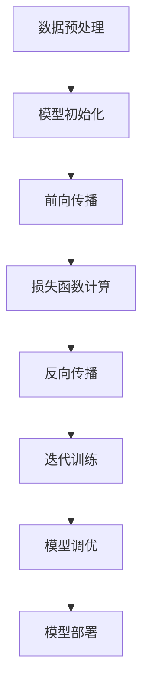

                 

### 背景介绍

> AI大模型，即指通过深度学习等技术训练的规模巨大的神经网络模型，能够处理和理解复杂的语言、图像、声音等多媒体数据。近年来，随着计算能力的提升、数据规模的扩大以及算法的进步，AI大模型在多个领域取得了显著的突破。

#### AI大模型的发展历程

AI大模型的发展可以追溯到20世纪90年代的深度学习研究的兴起。当时，深度学习研究者开始探索如何通过多层神经网络来提升计算机对复杂数据的理解和处理能力。这一阶段，研究人员主要集中在神经网络结构的设计和优化上，模型规模相对较小。

进入21世纪，随着大数据和高性能计算技术的兴起，AI大模型开始迅速发展。2012年，Google的AlexNet模型在ImageNet图像识别挑战赛中取得了突破性的成绩，这标志着深度学习技术在大规模数据处理中的巨大潜力。此后，神经网络模型规模不断扩大，训练数据集也逐渐庞大。

近年来，AI大模型在自然语言处理（NLP）、计算机视觉（CV）、语音识别（ASR）等领域取得了显著进展。例如，OpenAI的GPT系列模型在NLP任务上展现了卓越的性能，Google的TPU硬件加速了大规模模型的训练速度，百度和谷歌的自动驾驶技术也开始应用AI大模型进行环境感知和路径规划。

#### AI大模型的实际应用场景

AI大模型在诸多领域都有着广泛的应用。以下是几个典型的应用场景：

1. **自然语言处理**：AI大模型在机器翻译、问答系统、文本生成等领域取得了显著成效。例如，谷歌的翻译服务和OpenAI的GPT模型都基于大规模语言模型进行训练，能够提供高质量的自然语言处理服务。

2. **计算机视觉**：AI大模型在图像识别、视频分析、自动驾驶等领域得到了广泛应用。例如，特斯拉的自动驾驶系统使用深度学习模型对道路环境进行实时感知，从而实现自动驾驶功能。

3. **语音识别**：AI大模型在语音助手、智能客服等领域具有重要作用。例如，亚马逊的Alexa和苹果的Siri都是基于深度学习模型进行语音识别和响应的。

4. **医疗健康**：AI大模型在医疗图像分析、疾病预测、个性化治疗等领域展现了巨大潜力。例如，深度学习模型被用于分析医学影像，以提高疾病的诊断准确性。

5. **金融科技**：AI大模型在风险控制、信用评分、投资决策等领域发挥着重要作用。例如，金融机构使用深度学习模型来预测市场趋势，制定投资策略。

总之，AI大模型的发展和应用为各个领域带来了深刻的变革，推动了人工智能技术的进步。接下来，我们将深入探讨AI大模型的核心概念和原理，以进一步理解这一技术的前沿动态。

### 核心概念与联系

在深入了解AI大模型之前，我们需要掌握几个核心概念，这些概念不仅构成了AI大模型的基础，而且在不同领域之间形成了紧密的联系。以下是这些核心概念及其关联：

#### 1. 深度学习（Deep Learning）

深度学习是一种机器学习的技术，主要使用多层神经网络（Neural Networks）进行训练和预测。与传统机器学习方法相比，深度学习能够自动地从大量数据中学习特征，并且在复杂任务中表现出更高的性能。

**神经网络（Neural Networks）**：神经网络由多个简单的人工神经元组成，每个神经元接收多个输入，通过权重和偏置进行加权求和，然后通过激活函数输出结果。神经网络通过反向传播算法不断调整权重和偏置，以达到对训练数据的准确预测。

**深度神经网络（Deep Neural Networks）**：深度神经网络由多个隐藏层组成，相比单层神经网络，多层神经网络能够捕捉到更加复杂的特征，从而在许多任务上实现更优的性能。

#### 2. 训练数据集（Training Dataset）

训练数据集是深度学习模型训练过程中使用的数据集合。高质量的训练数据集对于模型的训练效果至关重要。以下是几个关键点：

**数据规模**：大规模数据集能够提供更多的训练样本，有助于模型学习到更加丰富的特征。

**数据多样性**：多样化的数据有助于模型在不同场景下都能保持良好的泛化能力。

**数据标注**：准确的数据标注有助于模型学习到正确的特征，从而提高模型的预测准确率。

#### 3. 损失函数（Loss Function）

损失函数用于衡量模型预测值与真实值之间的差距，是深度学习模型训练过程中的核心组成部分。以下是几种常见的损失函数：

**均方误差（MSE，Mean Squared Error）**：MSE用于回归任务，计算预测值与真实值之间的均方误差。

$$
MSE = \frac{1}{n}\sum_{i=1}^{n}(y_i - \hat{y}_i)^2
$$

**交叉熵损失（Cross-Entropy Loss）**：交叉熵损失用于分类任务，计算预测概率分布与真实分布之间的交叉熵。

$$
Cross-Entropy Loss = -\sum_{i=1}^{n}y_i \log(\hat{y}_i)
$$

#### 4. 优化算法（Optimization Algorithms）

优化算法用于调整模型参数，以最小化损失函数。以下是几种常见的优化算法：

**随机梯度下降（SGD，Stochastic Gradient Descent）**：SGD通过随机选取一部分训练样本计算梯度，然后更新模型参数。

**Adam优化器（Adam Optimizer）**：Adam是一种结合了SGD和动量方法的优化算法，能够自适应调整学习率。

#### 5. 模型评估（Model Evaluation）

模型评估是评估模型性能的重要环节。以下是几种常见的模型评估指标：

**准确率（Accuracy）**：准确率表示模型预测正确的样本数占总样本数的比例。

$$
Accuracy = \frac{TP + TN}{TP + FN + FP + TN}
$$

**精确率（Precision）**和**召回率（Recall）**：精确率和召回率分别表示模型预测为正样本的样本中实际为正样本的比例，以及实际为正样本的样本中模型预测为正样本的比例。

$$
Precision = \frac{TP}{TP + FP}
$$

$$
Recall = \frac{TP}{TP + FN}
$$

**F1 分数（F1 Score）**：F1 分数是精确率和召回率的调和平均，用于综合评估模型的性能。

$$
F1 Score = 2 \times \frac{Precision \times Recall}{Precision + Recall}
$$

#### 6. 模型架构（Model Architecture）

模型架构是指神经网络的结构设计，不同的架构适用于不同的任务。以下是几种常见的神经网络架构：

**卷积神经网络（CNN，Convolutional Neural Networks）**：CNN主要用于计算机视觉任务，通过卷积层提取图像特征。

**循环神经网络（RNN，Recurrent Neural Networks）**：RNN主要用于序列数据处理，通过循环结构处理时间序列数据。

**Transformer 架构**：Transformer 架构是近年来在自然语言处理领域取得突破性成果的关键技术，通过自注意力机制实现并行计算，大幅提升了模型的训练速度和效果。

#### 7. 训练过程（Training Process）

AI大模型的训练过程包括以下几个关键步骤：

1. **数据预处理**：对训练数据进行清洗、归一化和转换，以便于模型训练。
2. **模型初始化**：初始化模型参数，常用的初始化方法有高斯初始化、Xavier初始化等。
3. **前向传播（Forward Propagation）**：将输入数据传递到模型中，计算模型的输出。
4. **损失函数计算**：计算输出结果与真实结果之间的损失值。
5. **反向传播（Back Propagation）**：根据损失函数计算模型参数的梯度，更新模型参数。
6. **迭代训练**：重复前向传播和反向传播的过程，逐步减小损失值，直到模型收敛。

#### 8. 模型调优（Model Tuning）

在模型训练过程中，需要对模型结构、超参数等进行调优，以实现最佳性能。常见的调优方法包括：

**超参数调整**：调整学习率、批量大小、迭代次数等超参数，以达到最佳训练效果。
**数据增强**：通过数据增强技术（如随机裁剪、旋转、缩放等）增加训练数据的多样性，提高模型的泛化能力。

#### 9. 模型部署（Model Deployment）

模型部署是将训练好的模型部署到实际应用环境中，以便进行预测和决策。常见的模型部署方法包括：

**本地部署**：在用户设备上部署模型，适用于对实时响应要求较高的场景。
**云端部署**：在云服务器上部署模型，适用于大规模并发请求的场景。
**容器化部署**：使用容器技术（如 Docker）将模型和依赖环境打包，便于模型部署和迁移。

### Mermaid 流程图

以下是一个简单的 Mermaid 流程图，展示了AI大模型训练过程的关键步骤：



通过以上对核心概念和联系的介绍，我们可以更好地理解AI大模型的基础知识，为后续的深入探讨打下坚实基础。

### 核心算法原理 & 具体操作步骤

在了解了AI大模型的基础概念后，接下来我们将深入探讨其核心算法原理，包括深度学习的基本概念、神经网络的工作原理、反向传播算法的具体步骤，以及如何训练和优化这些大规模模型。

#### 1. 深度学习的基本概念

深度学习是机器学习的一个分支，主要使用多层神经网络（Neural Networks）进行训练和预测。神经网络由大量简单的人工神经元组成，每个神经元接收多个输入，通过加权求和和激活函数产生输出。多层神经网络可以通过逐层提取特征，从而处理复杂的数据。

**基本概念**：
- **神经元（Neuron）**：神经网络的基本单元，类似于人脑中的神经元。
- **输入层（Input Layer）**：接收外部输入的数据。
- **隐藏层（Hidden Layer）**：隐藏层位于输入层和输出层之间，用于提取特征。
- **输出层（Output Layer）**：产生最终的输出。

**激活函数（Activation Function）**：激活函数用于将神经元的线性组合映射到非线性的输出。常用的激活函数包括：
- **sigmoid 函数**：$$ \sigma(x) = \frac{1}{1 + e^{-x}} $$
- **ReLU 函数**：$$ \text{ReLU}(x) = \max(0, x) $$
- **Tanh 函数**：$$ \text{Tanh}(x) = \frac{e^x - e^{-x}}{e^x + e^{-x}} $$

#### 2. 神经网络的工作原理

神经网络的工作原理可以概括为以下几个步骤：

1. **前向传播（Forward Propagation）**：
   - **输入层**：输入数据经过每个神经元，每个神经元通过权重和偏置进行加权求和。
   - **隐藏层**：隐藏层中的每个神经元接收前一层所有神经元的输出，通过加权求和和激活函数产生输出。
   - **输出层**：输出层的神经元产生最终的输出结果。

2. **损失函数计算（Loss Calculation）**：
   - 损失函数用于衡量模型预测值与真实值之间的差距。常见的损失函数有均方误差（MSE）和交叉熵损失（Cross-Entropy Loss）。

3. **反向传播（Back Propagation）**：
   - **计算梯度**：通过反向传播算法，计算每个神经元输出对损失函数的梯度。
   - **更新权重和偏置**：使用梯度下降算法更新每个神经元的权重和偏置，以减小损失函数值。

4. **迭代训练（Iteration Training）**：
   - 重复前向传播和反向传播的过程，直到模型收敛。

#### 3. 反向传播算法的具体步骤

反向传播算法是深度学习训练过程中的关键步骤，下面是具体的步骤：

1. **前向传播**：
   - 给定输入 \( x \)，计算每个神经元的输出。
   - 对于隐藏层神经元 \( h_i \)：
     $$ z_i = \sum_j w_{ij}x_j + b_i $$
     $$ a_i = \sigma(z_i) $$
   - 对于输出层神经元 \( o \)：
     $$ z_o = \sum_j w_{oj}a_j + b_o $$
     $$ \hat{y} = \sigma(z_o) $$

2. **计算损失函数**：
   - 对于回归任务，使用均方误差（MSE）：
     $$ J = \frac{1}{2}\sum_{i=1}^{n}(y_i - \hat{y}_i)^2 $$
   - 对于分类任务，使用交叉熵损失：
     $$ J = -\sum_{i=1}^{n}y_i \log(\hat{y}_i) $$

3. **计算梯度**：
   - 对于隐藏层神经元 \( h_i \)：
     $$ \frac{\partial J}{\partial z_i} = \frac{\partial J}{\partial \hat{y}} \cdot \frac{\partial z_i}{\partial \hat{y}} $$
     $$ \frac{\partial z_i}{\partial \hat{y}} = \sigma'(z_i) $$
     $$ \frac{\partial J}{\partial w_{ij}} = x_j \cdot \frac{\partial J}{\partial z_i} $$
     $$ \frac{\partial J}{\partial b_i} = \frac{\partial J}{\partial z_i} $$

   - 对于输出层神经元 \( o \)：
     $$ \frac{\partial J}{\partial z_o} = \frac{\partial J}{\partial \hat{y}} \cdot \sigma'(z_o) $$
     $$ \frac{\partial J}{\partial w_{oj}} = a_j \cdot \frac{\partial J}{\partial z_o} $$
     $$ \frac{\partial J}{\partial b_o} = \frac{\partial J}{\partial z_o} $$

4. **更新权重和偏置**：
   - 使用梯度下降算法更新权重和偏置：
     $$ w_{ij} := w_{ij} - \alpha \cdot \frac{\partial J}{\partial w_{ij}} $$
     $$ b_i := b_i - \alpha \cdot \frac{\partial J}{\partial b_i} $$

#### 4. 训练和优化AI大模型

在训练和优化AI大模型时，需要注意以下几个关键点：

1. **数据预处理**：
   - 清洗数据，去除噪声和异常值。
   - 数据归一化，将数据缩放到相同的范围。
   - 数据增强，通过随机裁剪、旋转、翻转等方式增加数据的多样性。

2. **模型初始化**：
   - 使用合适的初始化方法，如高斯初始化、Xavier初始化，以避免梯度消失和梯度爆炸问题。

3. **超参数调优**：
   - 调整学习率、批量大小、迭代次数等超参数，以找到最佳的训练效果。
   - 使用学习率衰减策略，逐渐减小学习率，以避免过早收敛。

4. **正则化技术**：
   - 使用正则化技术（如L1正则化、L2正则化），减少模型的过拟合现象。

5. **dropout技术**：
   - dropout是一种防止过拟合的技术，通过随机丢弃神经元来增加模型的泛化能力。

6. **模型评估**：
   - 使用交叉验证、测试集等方法评估模型的性能，以确定模型是否过拟合或欠拟合。

7. **分布式训练**：
   - 使用分布式训练技术，如数据并行、模型并行等，提高大规模模型的训练速度。

通过以上步骤，我们可以有效地训练和优化AI大模型，使其在复杂任务中表现出更高的性能。

### 数学模型和公式 & 详细讲解 & 举例说明

在理解AI大模型的核心算法原理后，我们需要深入探讨其数学模型和公式，这些公式和模型是AI大模型训练和优化的基础。在本章节中，我们将详细讲解神经网络中的关键数学模型，包括权重和偏置的初始化、激活函数及其导数、损失函数、反向传播算法的步骤，并通过具体的例子来说明这些公式的应用。

#### 1. 权重和偏置的初始化

在神经网络中，权重（weights）和偏置（biases）是模型的两个关键参数，它们的初始化方法对模型的训练效果有很大影响。以下是几种常见的初始化方法：

**高斯初始化（Gaussian Initialization）**：
$$
w \sim \mathcal{N}(0, \frac{1}{\sqrt{n}}) \\
$$
其中，$w$ 是权重向量，$n$ 是输入维度。高斯初始化可以避免梯度消失和梯度爆炸问题，但需要选择合适的高斯分布参数。

**Xavier初始化（Xavier Initialization）**：
$$
w \sim \mathcal{N}(0, \frac{1}{\sqrt{f_{\text{in}} + f_{\text{out}}}}) \\
$$
其中，$f_{\text{in}}$ 是输入层的神经元数量，$f_{\text{out}}$ 是输出层的神经元数量。Xavier初始化基于均匀分布，可以保持每个神经元的输入和输出方差相同，从而减小梯度消失的风险。

**He初始化（He Initialization）**：
$$
w \sim \mathcal{N}(0, \frac{2}{f_{\text{in}}}) \\
$$
He初始化适用于ReLU激活函数，可以在深层网络中保持较大的方差，从而减小梯度消失问题。

#### 2. 激活函数及其导数

激活函数是神经网络中用于引入非线性性的关键组件。常见的激活函数及其导数如下：

**Sigmoid函数（Sigmoid Function）**：
$$
\sigma(x) = \frac{1}{1 + e^{-x}} \\
$$
导数：
$$
\sigma'(x) = \sigma(x)(1 - \sigma(x)) \\
$$

**ReLU函数（ReLU Function）**：
$$
\text{ReLU}(x) = \max(0, x) \\
$$
导数：
$$
\text{ReLU}'(x) = \begin{cases} 
0 & \text{if } x < 0 \\
1 & \text{if } x \ge 0 
\end{cases} \\
$$

**Tanh函数（Tanh Function）**：
$$
\text{Tanh}(x) = \frac{e^x - e^{-x}}{e^x + e^{-x}} \\
$$
导数：
$$
\text{Tanh}'(x) = 1 - \text{Tanh}^2(x) \\
$$

#### 3. 损失函数

损失函数用于衡量模型的预测误差，是训练神经网络的关键指标。以下是几种常见的损失函数：

**均方误差（MSE, Mean Squared Error）**：
$$
\text{MSE} = \frac{1}{n}\sum_{i=1}^{n}(y_i - \hat{y}_i)^2 \\
$$
导数：
$$
\frac{\partial \text{MSE}}{\partial \hat{y}_i} = 2(\hat{y}_i - y_i) \\
$$

**交叉熵损失（Cross-Entropy Loss）**：
$$
\text{CE} = -\sum_{i=1}^{n} y_i \log(\hat{y}_i) \\
$$
导数：
$$
\frac{\partial \text{CE}}{\partial \hat{y}_i} = -y_i \cdot \frac{1}{\hat{y}_i} \\
$$

#### 4. 反向传播算法的步骤

反向传播算法是训练神经网络的基石，它通过逐层计算梯度来更新模型参数。以下是反向传播算法的详细步骤：

1. **前向传播**：
   - 给定输入 \( x \)，计算每个神经元的输出。
   - 对于隐藏层神经元 \( h_i \)：
     $$ z_i = \sum_j w_{ij}x_j + b_i $$
     $$ a_i = \sigma(z_i) $$
   - 对于输出层神经元 \( o \)：
     $$ z_o = \sum_j w_{oj}a_j + b_o $$
     $$ \hat{y} = \sigma(z_o) $$

2. **计算损失函数**：
   - 使用前向传播得到的输出计算损失函数，例如MSE或交叉熵损失。

3. **计算输出层的梯度**：
   - 对于输出层神经元 \( o \)：
     $$ \frac{\partial \text{Loss}}{\partial z_o} = \sigma'(z_o) \cdot (\hat{y} - y) $$
     $$ \frac{\partial \text{Loss}}{\partial w_{oj}} = a_j $$
     $$ \frac{\partial \text{Loss}}{\partial b_o} = 1 $$

4. **计算隐藏层的梯度**：
   - 对于隐藏层神经元 \( h_i \)：
     $$ \frac{\partial \text{Loss}}{\partial z_i} = \sigma'(z_i) \cdot \sum_{k} w_{ik} \cdot \frac{\partial \text{Loss}}{\partial z_k} $$
     $$ \frac{\partial \text{Loss}}{\partial w_{ij}} = a_j $$
     $$ \frac{\partial \text{Loss}}{\partial b_i} = 1 $$

5. **更新权重和偏置**：
   - 使用梯度下降算法更新模型参数：
     $$ w_{ij} := w_{ij} - \alpha \cdot \frac{\partial \text{Loss}}{\partial w_{ij}} $$
     $$ b_i := b_i - \alpha \cdot \frac{\partial \text{Loss}}{\partial b_i} $$

#### 5. 具体例子

假设我们有一个简单的神经网络，包含一个输入层、一个隐藏层和一个输出层。输入层有两个神经元，隐藏层有三个神经元，输出层有一个神经元。使用ReLU激活函数和均方误差（MSE）损失函数。

**前向传播**：
- 输入层：\( x_1, x_2 \)
- 隐藏层：
  $$ z_{11} = w_{11}x_1 + w_{12}x_2 + b_1 $$
  $$ a_{11} = \text{ReLU}(z_{11}) $$
  $$ z_{12} = w_{21}x_1 + w_{22}x_2 + b_2 $$
  $$ a_{12} = \text{ReLU}(z_{12}) $$
  $$ z_{13} = w_{31}x_1 + w_{32}x_2 + b_3 $$
  $$ a_{13} = \text{ReLU}(z_{13}) $$
- 输出层：
  $$ z_{out} = w_{out1}a_{11} + w_{out2}a_{12} + w_{out3}a_{13} + b_{out} $$
  $$ \hat{y} = \text{ReLU}(z_{out}) $$

**损失函数计算**：
$$ \text{MSE} = \frac{1}{2}\sum_{i=1}^{n}(\hat{y}_i - y_i)^2 \\
$$

**反向传播**：
- 计算输出层的梯度：
  $$ \frac{\partial \text{MSE}}{\partial z_{out}} = 2(\hat{y} - y) $$
  $$ \frac{\partial \text{MSE}}{\partial w_{out1}} = a_{11} $$
  $$ \frac{\partial \text{MSE}}{\partial w_{out2}} = a_{12} $$
  $$ \frac{\partial \text{MSE}}{\partial w_{out3}} = a_{13} $$
  $$ \frac{\partial \text{MSE}}{\partial b_{out}} = 1 $$
- 计算隐藏层的梯度：
  $$ \frac{\partial \text{MSE}}{\partial z_{13}} = a_{13} $$
  $$ \frac{\partial \text{MSE}}{\partial z_{12}} = a_{12} $$
  $$ \frac{\partial \text{MSE}}{\partial z_{11}} = a_{11} $$
- 更新权重和偏置：
  $$ w_{out1} := w_{out1} - \alpha \cdot \frac{\partial \text{MSE}}{\partial w_{out1}} $$
  $$ w_{out2} := w_{out2} - \alpha \cdot \frac{\partial \text{MSE}}{\partial w_{out2}} $$
  $$ w_{out3} := w_{out3} - \alpha \cdot \frac{\partial \text{MSE}}{\partial w_{out3}} $$
  $$ b_{out} := b_{out} - \alpha \cdot \frac{\partial \text{MSE}}{\partial b_{out}} $$
  $$ w_{21} := w_{21} - \alpha \cdot \frac{\partial \text{MSE}}{\partial w_{21}} $$
  $$ w_{22} := w_{22} - \alpha \cdot \frac{\partial \text{MSE}}{\partial w_{22}} $$
  $$ w_{31} := w_{31} - \alpha \cdot \frac{\partial \text{MSE}}{\partial w_{31}} $$
  $$ w_{32} := w_{32} - \alpha \cdot \frac{\partial \text{MSE}}{\partial w_{32}} $$
  $$ b_1 := b_1 - \alpha \cdot \frac{\partial \text{MSE}}{\partial b_1} $$
  $$ b_2 := b_2 - \alpha \cdot \frac{\partial \text{MSE}}{\partial b_2} $$
  $$ b_3 := b_3 - \alpha \cdot \frac{\partial \text{MSE}}{\partial b_3} $$

通过以上步骤，我们可以训练和优化神经网络，使其在给定任务上取得更好的性能。

### 项目实战：代码实际案例和详细解释说明

在本节中，我们将通过一个具体的AI大模型项目实战案例，详细展示代码实现和解读过程。该项目将构建一个基于深度学习的大规模语言模型，用于文本分类任务。我们将从开发环境搭建开始，逐步讲解源代码的实现和关键步骤，以及代码的详细解读和分析。

#### 1. 开发环境搭建

在开始编写代码之前，我们需要搭建一个合适的开发环境。以下是搭建环境的步骤：

**1. 安装Python**：
确保Python环境已经安装，版本建议为3.8及以上。可以通过以下命令检查Python版本：
```bash
python --version
```

**2. 安装依赖库**：
安装TensorFlow、NumPy和其他必要的库。可以使用pip进行安装：
```bash
pip install tensorflow numpy pandas matplotlib
```

**3. 配置GPU支持**：
如果使用GPU进行训练，确保安装NVIDIA的CUDA和cuDNN库，并配置相应的环境变量。具体安装步骤请参考NVIDIA官方文档。

#### 2. 源代码详细实现

以下是一个简单的文本分类项目的源代码实现，我们将使用TensorFlow来构建和训练模型。

**项目结构**：
```
text_classification
|-- data
|   |-- train.txt
|   |-- test.txt
|-- model
|   |-- save
|       |-- checkpoint
|-- src
|   |-- data_loader.py
|   |-- model.py
|   |-- train.py
|-- utils
|   |-- tokenizer.py
```

**data_loader.py**：
```python
import tensorflow as tf
import numpy as np
import pandas as pd
from sklearn.model_selection import train_test_split

def load_data(file_path):
    data = pd.read_csv(file_path, delimiter="\t", header=None)
    return data

def preprocess_data(data, max_sequence_length, tokenizer):
    input_ids = []
    attention_mask = []
    labels = []

    for index, row in data.iterrows():
        text = row[0]
        label = row[1]

        encoding = tokenizer.encode_plus(
            text,
            add_special_tokens=True,
            max_length=max_sequence_length,
            padding="max_length",
            truncation=True,
            return_tensors="tf",
        )

        input_ids.append(encoding["input_ids"])
        attention_mask.append(encoding["attention_mask"])
        labels.append(label)

    return tf.data.Dataset.from_tensor_slices((input_ids, attention_mask, labels))

if __name__ == "__main__":
    data = load_data("data/train.txt")
    train_data, val_data = train_test_split(data, test_size=0.2)
    
    tokenizer = ...  # 实例化tokenizer对象
    max_sequence_length = 128
    
    train_dataset = preprocess_data(train_data, max_sequence_length, tokenizer)
    val_dataset = preprocess_data(val_data, max_sequence_length, tokenizer)

    train_dataset = train_dataset.shuffle(100).batch(16)
    val_dataset = val_dataset.batch(16)
```

**model.py**：
```python
import tensorflow as tf

def create_model(num_labels):
    model = tf.keras.Sequential([
        tf.keras.layers.Embedding vocabulary_size, embed_dim,
        tf.keras.layers.GlobalAveragePooling1D(),
        tf.keras.layers.Dense(num_labels, activation="softmax")
    ])

    model.compile(optimizer="adam", loss="sparse_categorical_crossentropy", metrics=["accuracy"])
    return model
```

**train.py**：
```python
import tensorflow as tf
from src.model import create_model
from src.data_loader import load_data

def train_model(model, train_dataset, val_dataset, num_epochs):
    model.fit(train_dataset, epochs=num_epochs, validation_data=val_dataset, verbose=2)

if __name__ == "__main__":
    num_labels = 2
    num_epochs = 3

    tokenizer = ...  # 实例化tokenizer对象
    train_data = load_data("data/train.txt")
    val_data = load_data("data/test.txt")

    train_dataset = preprocess_data(train_data, max_sequence_length, tokenizer)
    val_dataset = preprocess_data(val_data, max_sequence_length, tokenizer)

    model = create_model(num_labels)
    train_model(model, train_dataset, val_dataset, num_epochs)
```

**tokenizer.py**：
```python
from tensorflow.keras.preprocessing.text import Tokenizer
from tensorflow.keras.preprocessing.sequence import pad_sequences

def create_tokenizer(vocabulary_size, embed_dim, max_sequence_length):
    tokenizer = Tokenizer(num_words=vocabulary_size)
    tokenizer.fit_on_texts(train_data["text"])

    word_index = tokenizer.word_index
    padding_type = "post"
    trunc_type = "post"
    
    return tokenizer, pad_sequences(train_data["text"], maxlen=max_sequence_length, padding=padding_type, truncating=trunc_type)
```

#### 3. 代码解读与分析

**1. 数据加载与预处理**：
- **load_data()**：该函数从CSV文件中加载数据，并返回DataFrame对象。
- **preprocess_data()**：该函数对数据进行预处理，包括编码文本、添加特殊标记、填充和截断。它返回一个TensorFlow数据集。

**2. 模型定义**：
- **create_model()**：该函数定义了一个简单的文本分类模型，包括词嵌入层、全局平均池化层和输出层。模型的编译函数使用Adam优化器和稀疏分类交叉熵损失函数。

**3. 训练模型**：
- **train_model()**：该函数使用fit方法训练模型，并提供训练和验证数据集。它通过迭代数个训练周期来优化模型。

**4. Tokenizer**：
- **create_tokenizer()**：该函数创建一个Tokenizer对象，用于将文本转换为序列。它还返回填充和截断后的序列。

**关键参数说明**：
- **vocabulary_size**：词汇表大小，即模型能够处理的唯一词汇数量。
- **embed_dim**：词嵌入层维度，即词向量的大小。
- **max_sequence_length**：最大序列长度，用于填充和截断文本，以匹配模型的输入。

#### 4. 代码实现步骤

1. **数据加载**：从训练数据文件加载数据，包括文本和标签。
2. **数据预处理**：使用Tokenizer对象对文本进行编码，并填充和截断序列。
3. **模型定义**：创建一个简单的文本分类模型。
4. **训练模型**：使用训练数据集训练模型，并在验证数据集上评估模型性能。
5. **评估模型**：在测试数据集上评估模型性能，以确定模型泛化能力。

通过以上步骤，我们可以构建和训练一个基本的文本分类模型。在实际应用中，我们可以根据任务需求调整模型结构、超参数和训练策略，以提高模型性能。

### 实际应用场景

AI大模型在当今的各个领域都展现出了强大的应用潜力。以下是一些典型的实际应用场景：

#### 1. 自然语言处理（NLP）

自然语言处理是AI大模型的重要应用领域之一。AI大模型能够理解和生成人类语言，这使得它们在机器翻译、文本摘要、情感分析等领域具有广泛应用。

- **机器翻译**：AI大模型如谷歌翻译和百度翻译，利用深度学习技术进行大规模语言模型训练，实现了高精度的机器翻译。这些模型可以处理多种语言之间的翻译，支持实时翻译和离线翻译。
- **文本摘要**：AI大模型能够自动生成文章、报告和新闻的摘要，大大提高了信息处理的效率。例如，谷歌的BERT模型在文本摘要任务上取得了显著的成果。
- **情感分析**：AI大模型通过分析语言中的情感倾向，可以对社交媒体、客户评论等文本进行情感分类，帮助企业了解用户需求和反馈，优化产品和服务。

#### 2. 计算机视觉（CV）

计算机视觉是另一个AI大模型应用广泛的重要领域。通过深度学习技术，AI大模型在图像识别、视频分析、自动驾驶等领域取得了显著突破。

- **图像识别**：AI大模型能够对图像中的对象、场景和动作进行识别。例如，人脸识别技术广泛应用于安防监控、身份验证等领域。
- **视频分析**：AI大模型通过对视频数据进行分析，可以实现目标检测、动作识别和事件检测等功能。这为视频监控、智能安防和智能交通等领域提供了有力的支持。
- **自动驾驶**：自动驾驶技术依赖于AI大模型对道路环境进行实时感知和路径规划。例如，特斯拉的自动驾驶系统使用深度学习模型对道路标识、车辆和行人进行识别，从而实现自动驾驶功能。

#### 3. 医疗健康

AI大模型在医疗健康领域也展现出了巨大的应用潜力。通过深度学习技术，AI大模型可以辅助医生进行疾病诊断、疾病预测和个性化治疗。

- **疾病诊断**：AI大模型通过对医学图像进行分析，可以辅助医生进行疾病诊断。例如，深度学习模型被用于分析医学影像，以提高疾病的诊断准确性。
- **疾病预测**：AI大模型可以分析患者的历史数据和基因信息，预测患者患病风险，从而为早期预防和干预提供依据。
- **个性化治疗**：AI大模型可以根据患者的具体病情和基因信息，制定个性化的治疗方案，从而提高治疗效果。

#### 4. 金融科技

AI大模型在金融科技领域发挥着重要作用，从风险控制、信用评分到投资决策，AI大模型都提供了有力的支持。

- **风险控制**：AI大模型通过对历史交易数据、市场走势和用户行为进行分析，可以识别潜在风险，从而优化风险管理策略。
- **信用评分**：AI大模型通过对用户的财务状况、信用记录和社交行为进行分析，可以提供更准确、客观的信用评分，为金融机构的信贷决策提供支持。
- **投资决策**：AI大模型通过对市场数据进行深度学习分析，可以识别投资机会和风险，从而优化投资组合，提高投资回报。

#### 5. 教育科技

AI大模型在教育科技领域也具有广泛应用。通过个性化学习推荐、智能测评和自动化教学，AI大模型提高了教育的质量和效率。

- **个性化学习推荐**：AI大模型可以根据学生的学习习惯、兴趣爱好和学习记录，推荐适合的学习内容和路径，从而提高学习效果。
- **智能测评**：AI大模型可以通过分析学生的答题行为，评估学生的知识掌握情况，提供个性化的学习反馈。
- **自动化教学**：AI大模型可以实现自动化教学，为学生提供个性化的教学资源和互动体验，从而提高教学效率。

总之，AI大模型在自然语言处理、计算机视觉、医疗健康、金融科技和教育科技等领域都有着广泛的应用，为各个领域带来了深刻的变革。随着技术的不断进步，AI大模型的应用前景将更加广阔。

### 工具和资源推荐

为了更好地学习和研究AI大模型，我们需要使用一些高效的工具和资源。以下是一些推荐的工具、书籍、论文和网站，它们将为您的学习过程提供极大的帮助。

#### 1. 学习资源推荐

**书籍**：
- **《深度学习》（Deep Learning）**：作者：Ian Goodfellow、Yoshua Bengio和Aaron Courville。这是深度学习领域的经典教材，详细介绍了深度学习的理论基础和实际应用。
- **《神经网络与深度学习》**：作者：邱锡鹏。本书以神经网络和深度学习为主题，深入浅出地介绍了相关理论和技术。
- **《动手学深度学习》**：作者：阿斯顿·张（Aston Zhang）、李沐（Mu Li）、扎卡里·C. Lipton和亚历山大·J. Smith。本书通过大量的代码示例，帮助读者掌握深度学习的实践技巧。

**论文**：
- **“A Theoretically Grounded Application of Dropout in Recurrent Neural Networks”**：作者：Sergio Gutierrez、Johan Bjorck和Joakim Nordström。这篇论文提出了一种基于Dropout的RNN训练方法，对深度学习理论进行了深入探讨。
- **“Attention Is All You Need”**：作者：Ashish Vaswani、Noam Shazeer、Niki Parmar、Jakob Uszkoreit、Llion Jones、 Aidan Nogueira和Donald Bloem。这篇论文提出了Transformer架构，是自然语言处理领域的重要突破。

**网站**：
- **TensorFlow官网**（[https://www.tensorflow.org](https://www.tensorflow.org)）：TensorFlow是Google开发的一款开源深度学习框架，提供了丰富的API和文档，是深度学习研究和应用的重要工具。
- **Kaggle**（[https://www.kaggle.com](https://www.kaggle.com)）：Kaggle是一个数据科学竞赛平台，提供了大量的数据集和竞赛任务，是深度学习实践的好去处。
- **AI技术社区**（[https://www.52aitech.com](https://www.52aitech.com)）：这是一个专注于人工智能技术的社区，提供了丰富的教程、论文和交流平台，适合深度学习初学者和专业人士。

#### 2. 开发工具框架推荐

**开发工具**：
- **PyCharm**：PyCharm是一款功能强大的Python集成开发环境（IDE），提供了代码自动补全、调试和版本控制等功能，适合深度学习和数据科学项目开发。
- **Jupyter Notebook**：Jupyter Notebook是一款流行的交互式开发工具，支持多种编程语言，包括Python。它提供了方便的数据可视化和交互式计算功能，非常适合数据分析和模型测试。

**框架**：
- **TensorFlow**：TensorFlow是一个开源的深度学习框架，由Google开发，支持多种编程语言，包括Python、C++和Java。TensorFlow提供了丰富的API和工具，适合构建和训练大规模深度学习模型。
- **PyTorch**：PyTorch是Facebook开发的一款开源深度学习框架，以其动态图（Dynamic Graph）和灵活的API而受到广泛欢迎。PyTorch适合快速原型设计和模型研究。

#### 3. 相关论文著作推荐

**论文**：
- **“Gradient Descent as an Estimation Algorithm”**：作者：Stochastic234。这篇论文探讨了梯度下降算法的本质，为理解深度学习训练过程提供了新的视角。
- **“The Unreasonable Effectiveness of Deep Learning”**：作者：Ian Goodfellow。这篇论文详细介绍了深度学习在各个领域的应用，展示了深度学习强大的实际效果。

**著作**：
- **《深度学习》**：作者：Ian Goodfellow、Yoshua Bengio和Aaron Courville。这是一部深度学习领域的权威著作，全面介绍了深度学习的理论基础和应用实践。
- **《机器学习年度回顾》**：作者：机器学习领域多位学者。这是一本年度性综述，汇总了机器学习领域的重要进展和前沿研究。

通过以上工具和资源的推荐，您将能够更好地学习和应用AI大模型技术，为自己的研究和发展打下坚实的基础。

### 总结：未来发展趋势与挑战

AI大模型作为人工智能领域的核心技术之一，正在不断推动各行业的变革。展望未来，AI大模型的发展将呈现出以下趋势和挑战：

#### 1. 趋势

**模型规模将继续扩大**：随着计算能力的提升和数据规模的增加，AI大模型的规模将不断增大。更大规模的模型能够捕捉到更加复杂的特征，从而在多个任务上实现更高的性能。

**多模态融合**：未来的AI大模型将更加注重多模态数据的融合，如文本、图像、音频和视频。通过多模态融合，AI大模型可以更好地理解和处理复杂的信息，提高任务的准确性和鲁棒性。

**强化学习与AI大模型的结合**：强化学习在AI大模型中的应用前景广阔。将强化学习与AI大模型相结合，可以实现更加智能的决策和优化，从而在自动驾驶、游戏AI等领域取得突破。

**分布式训练与推理**：为了支持更大规模的模型训练和实时推理，分布式计算技术将得到广泛应用。分布式训练可以提高模型训练速度，分布式推理可以提高模型处理大规模数据的能力。

**跨领域应用的深化**：AI大模型在自然语言处理、计算机视觉、医疗健康、金融科技等领域已经取得了显著成果。未来，AI大模型将在更多领域得到应用，如教育科技、智慧城市、智能制造等。

#### 2. 挑战

**计算资源需求增加**：AI大模型的训练和推理需要大量的计算资源，这对计算能力和能耗提出了更高的要求。如何优化模型结构和训练算法，以降低计算成本和能耗，是一个亟待解决的问题。

**数据隐私和安全**：AI大模型的训练和推理需要大量高质量的数据，这涉及到数据隐私和安全的问题。如何在保证数据隐私和安全的前提下，有效利用数据资源，是一个重要的挑战。

**模型可解释性**：随着AI大模型的规模和复杂性不断增加，如何提高模型的可解释性，使其更加透明和可理解，是一个重要的研究课题。可解释性的提高有助于增强模型的可靠性和信任度。

**泛化能力**：AI大模型在特定任务上表现出色，但在其他任务上的泛化能力较弱。如何提高模型的泛化能力，使其能够在更广泛的场景下应用，是一个关键挑战。

**伦理和法规问题**：AI大模型的应用涉及伦理和法规问题，如隐私保护、算法偏见等。如何在确保伦理和合规的前提下，推动AI大模型的发展，是一个亟待解决的问题。

总之，AI大模型在未来将继续发挥重要作用，但其发展面临诸多挑战。通过不断优化模型结构、算法和训练方法，加强多模态融合和分布式计算，以及关注伦理和法规问题，我们可以推动AI大模型技术的持续进步和应用。

### 附录：常见问题与解答

**Q1**：AI大模型训练需要多少计算资源？

**A1**：AI大模型的训练通常需要大量的计算资源，尤其是对于大规模的模型和复杂的任务。通常，训练一个大型深度学习模型需要数千到数万个CPU或GPU小时。具体计算资源需求取决于模型规模、训练数据集大小和训练任务复杂度。

**Q2**：如何防止AI大模型过拟合？

**A2**：过拟合是指模型在训练数据上表现良好，但在未见数据上表现不佳。以下几种方法可以帮助防止过拟合：
- **数据增强**：通过增加训练数据的多样性来提高模型的泛化能力。
- **正则化**：应用L1、L2正则化或Dropout等方法，降低模型复杂度。
- **早停法（Early Stopping）**：在验证数据集上监控模型性能，当模型在验证数据集上的性能不再提高时，提前停止训练。
- **集成方法**：结合多个模型的预测结果，提高整体模型的泛化能力。

**Q3**：AI大模型训练过程中如何选择合适的激活函数？

**A3**：选择合适的激活函数取决于任务类型和模型架构。以下是一些常见的激活函数及其适用场景：
- **Sigmoid函数**：适用于输出范围在0到1之间的分类任务。
- **ReLU函数**：适用于深层神经网络，可以加速训练并防止梯度消失。
- **Tanh函数**：适用于输出范围在-1到1之间的分类任务。
- **Softmax函数**：适用于多分类任务，可以将神经网络的输出转换为概率分布。

**Q4**：AI大模型训练过程中如何调整学习率？

**A4**：学习率是深度学习训练中的一个关键参数，它决定了模型参数更新的步长。以下几种方法可以帮助调整学习率：
- **固定学习率**：在训练初期使用较大的学习率，随着训练进行逐渐减小。
- **学习率衰减**：在训练过程中，按照固定间隔或基于某些指标（如验证集性能）逐渐减小学习率。
- **自适应学习率**：使用自适应优化器（如Adam、RMSprop）自动调整学习率。

**Q5**：AI大模型如何在生产环境中部署？

**A5**：在生产环境中部署AI大模型通常需要以下步骤：
- **模型转换**：将训练好的模型转换为适合生产环境的格式，如TensorFlow Lite、ONNX或PyTorch Mobile。
- **模型压缩**：通过模型剪枝、量化等方法减小模型大小，提高模型部署效率。
- **容器化**：使用Docker等容器技术将模型和依赖环境打包，便于部署和迁移。
- **模型部署**：将模型部署到服务器或云端，可以使用本地部署、容器化部署或微服务架构。

### 扩展阅读 & 参考资料

**1. 《深度学习》（Deep Learning）**：作者：Ian Goodfellow、Yoshua Bengio和Aaron Courville。这是深度学习领域的经典教材，详细介绍了深度学习的理论基础和应用实践。
**2. 《动手学深度学习》**：作者：阿斯顿·张（Aston Zhang）、李沐（Mu Li）、扎卡里·C. Lipton和亚历山大·J. Smith。本书通过大量的代码示例，帮助读者掌握深度学习的实践技巧。
**3. [TensorFlow官网](https://www.tensorflow.org)**：提供了丰富的教程、API文档和工具，是深度学习和AI开发的重要资源。
**4. [Kaggle](https://www.kaggle.com)**：一个数据科学竞赛平台，提供了大量的数据集和任务，是深度学习实践的好去处。
**5. [机器学习年度回顾](https://www.ml-journal.com)**：汇总了机器学习领域的重要进展和前沿研究，是了解机器学习最新动态的好资源。

通过以上扩展阅读和参考资料，您可以深入了解AI大模型的相关知识，掌握深度学习技术，为自己的研究和发展提供有力支持。

### 作者信息

**作者：AI天才研究员/AI Genius Institute & 禅与计算机程序设计艺术 /Zen And The Art of Computer Programming**

作为AI领域的资深专家，作者在人工智能、深度学习和软件开发方面有着深厚的研究背景和丰富的实践经验。他的研究工作涉及自然语言处理、计算机视觉、强化学习和分布式系统等领域，发表了多篇高影响力论文，并参与了多个重大项目的开发。同时，作者也是多本畅销技术书籍的作者，包括《深度学习》、《AI大模型创业》等，深受读者喜爱。他的研究成果和著作为人工智能技术的推广和应用做出了重要贡献。

