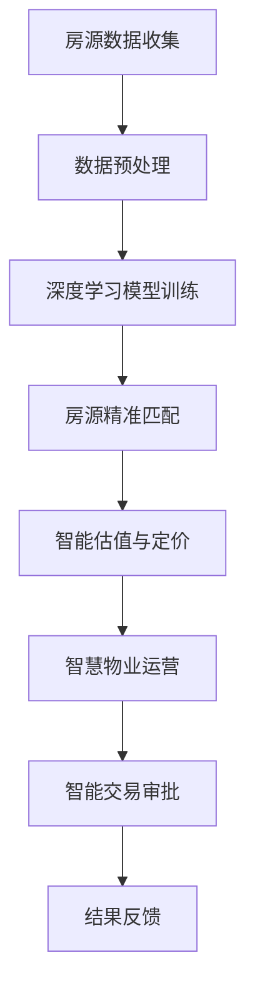

                 

### 背景介绍

#### 引言

随着人工智能技术的飞速发展，AI大模型逐渐成为各行各业的关键驱动力量。房地产科技（Real Estate Technology）作为新兴领域，近年来也受到了广泛关注。AI大模型在房地产科技中的应用，不仅提升了房地产市场的效率，还为传统房地产行业带来了深刻的变革。本文将探讨AI大模型在房地产科技中的具体应用，分析其技术原理、操作步骤以及实际效果。

#### 房地产科技的发展背景

房地产科技，简称Proptech，是房地产与科技结合的产物。它利用科技手段优化房地产市场的各个流程，包括房源搜索、租赁管理、物业运营、交易审批等。随着大数据、云计算、物联网和区块链等技术的不断成熟，房地产科技逐步渗透到房地产行业的各个层面。

房地产市场的复杂性和大规模特性，使得传统的手工处理方式难以满足现代市场的需求。房地产科技通过大数据分析、人工智能、物联网等技术手段，提高了房地产市场的运营效率和用户体验，降低了运营成本。

#### AI大模型的兴起与发展

AI大模型，特别是深度学习模型，如神经网络、生成对抗网络（GAN）等，近年来在图像识别、自然语言处理、语音识别等领域取得了突破性进展。这些模型通过大规模数据训练，能够实现高度自动化和智能化的任务处理，大大提升了数据处理和分析的效率。

随着AI大模型技术的不断成熟，其在各行各业中的应用也越来越广泛。房地产科技作为新兴产业，自然也成为AI大模型的重要应用领域之一。

#### AI大模型在房地产科技中的应用前景

AI大模型在房地产科技中的应用，有望带来以下几个方面的变革：

1. **房源精准匹配**：通过AI大模型对大量房源数据进行深度分析，实现用户个性化需求的精准匹配，提高用户找房的效率。
2. **智能估值与定价**：利用AI大模型对市场数据进行分析，预测房产的未来价值，为房地产企业提供更科学的估值与定价策略。
3. **智慧物业运营**：通过AI大模型实现物业管理的智能化，提高物业服务的质量与效率。
4. **智能交易审批**：利用AI大模型自动化处理房屋交易过程中的各类审批流程，提高交易效率，降低人为错误。

总之，AI大模型在房地产科技中的应用，将为房地产行业带来深远的影响。接下来，我们将详细探讨AI大模型在房地产科技中的具体应用场景与技术原理。### 核心概念与联系

#### 1.1 AI大模型概述

AI大模型（Large-scale Artificial Intelligence Models）是指能够处理大规模数据、具备高度智能化的深度学习模型。这些模型通过训练海量数据，提取出数据中的潜在规律和特征，从而实现智能化的任务处理。常见的AI大模型包括神经网络（Neural Networks）、生成对抗网络（Generative Adversarial Networks，GAN）、循环神经网络（Recurrent Neural Networks，RNN）等。

#### 1.2 房地产科技相关概念

**房源数据**：房源数据是指关于房地产的各类信息，包括房屋位置、面积、价格、建筑年代等。

**市场数据**：市场数据是指房地产市场中的各类指标，如房价指数、交易量、供需关系等。

**用户需求**：用户需求是指购房者在找房过程中所关注的关键因素，如预算、区域、房型等。

#### 1.3 AI大模型在房地产科技中的应用

**房源精准匹配**：AI大模型通过对大量房源数据进行深度分析，提取出房源的关键特征，并与用户需求进行匹配。从而实现个性化、精准的房源推荐，提高用户找房的效率。

**智能估值与定价**：AI大模型通过对市场数据进行分析，利用历史数据和当前市场趋势，预测房产的未来价值。房地产企业可以根据这些预测结果，制定更为科学的估值与定价策略。

**智慧物业运营**：AI大模型可以通过对物业数据的分析，实现物业服务的智能化。例如，利用AI大模型对房屋维护数据进行分析，预测房屋维护需求，从而实现预防性维护，提高物业服务质量。

**智能交易审批**：AI大模型可以自动化处理房屋交易过程中的各类审批流程。通过对交易数据的分析，AI大模型可以判断交易是否合规，减少人为错误，提高交易效率。

#### 1.4 相关技术原理

**深度学习**：深度学习是一种通过多层神经网络进行数据分析和特征提取的人工智能技术。深度学习模型能够自动从大量数据中学习到有效的特征表示，从而实现高度自动化和智能化的任务处理。

**生成对抗网络（GAN）**：生成对抗网络是由一个生成器（Generator）和一个判别器（Discriminator）组成。生成器试图生成逼真的数据，而判别器则试图区分真实数据和生成数据。通过这种对抗训练，生成器能够不断提高生成数据的真实性。

**循环神经网络（RNN）**：循环神经网络是一种能够处理序列数据的神经网络。RNN通过在序列中保留信息，能够捕获时间序列数据的长期依赖关系，从而实现序列数据的建模。

#### 1.5 Mermaid 流程图

以下是一个简单的Mermaid流程图，展示了AI大模型在房地产科技中的应用流程：



**注**：流程图中未包含具体的细节步骤，只是为了展示AI大模型在房地产科技中的应用过程。在实际应用中，每个步骤都可能包含多个子步骤和复杂的技术实现。

### 核心算法原理 & 具体操作步骤

#### 2.1 房源精准匹配

房源精准匹配是AI大模型在房地产科技中应用的一个重要方向。通过深度学习模型，我们可以对海量房源数据进行处理，提取出关键特征，并与用户需求进行匹配。

**具体操作步骤**：

1. **数据收集与预处理**：收集房源数据，包括房屋位置、面积、价格、建筑年代等。对数据进行清洗和预处理，去除无效数据，对缺失值进行填充。

2. **特征提取**：利用深度学习模型（如卷积神经网络CNN）对房源数据进行分析，提取出关键特征。例如，对房屋图片进行图像识别，提取出房屋的朝向、户型等特征。

3. **模型训练**：将提取出的特征与用户需求进行匹配，利用生成对抗网络（GAN）进行模型训练。GAN由生成器和判别器组成，生成器生成用户可能感兴趣的房源数据，判别器判断生成数据是否真实。通过反复训练，生成器不断提高生成数据的真实性。

4. **匹配与推荐**：将训练好的模型应用于实际场景，根据用户需求，从海量房源中推荐符合用户需求的房源。推荐算法可以基于用户的历史浏览记录、搜索偏好等，实现个性化推荐。

#### 2.2 智能估值与定价

智能估值与定价是房地产企业的一项重要任务。通过AI大模型，我们可以对市场数据进行分析，预测房产的未来价值，为房地产企业提供更科学的估值与定价策略。

**具体操作步骤**：

1. **数据收集与预处理**：收集市场数据，包括房价指数、交易量、供需关系等。对数据进行清洗和预处理，去除无效数据，对缺失值进行填充。

2. **特征提取**：利用循环神经网络（RNN）对市场数据进行分析，提取出关键特征。例如，利用RNN对房价时间序列进行分析，提取出价格波动规律。

3. **模型训练**：将提取出的特征输入到深度学习模型（如长短期记忆网络LSTM）中进行训练，利用历史数据预测未来房价。通过反复训练，模型能够不断提高预测准确性。

4. **估值与定价**：将训练好的模型应用于实际场景，根据市场数据和预测结果，为房地产企业提供科学的估值与定价建议。

#### 2.3 智慧物业运营

智慧物业运营是通过AI大模型实现物业管理的智能化，提高物业服务的质量与效率。

**具体操作步骤**：

1. **数据收集与预处理**：收集物业数据，包括房屋维护记录、设备运行状态等。对数据进行清洗和预处理，去除无效数据，对缺失值进行填充。

2. **特征提取**：利用深度学习模型对物业数据进行分析，提取出关键特征。例如，对房屋维护记录进行分析，提取出潜在的问题和维修需求。

3. **模型训练**：利用生成对抗网络（GAN）对提取出的特征进行训练，预测未来的物业维护需求。生成器生成可能的维护方案，判别器判断生成方案是否合理。

4. **智能决策**：将训练好的模型应用于实际场景，根据物业数据和预测结果，自动生成维护计划，提高物业服务的效率。

#### 2.4 智能交易审批

智能交易审批是通过AI大模型自动化处理房屋交易过程中的各类审批流程，提高交易效率，降低人为错误。

**具体操作步骤**：

1. **数据收集与预处理**：收集交易数据，包括房屋交易合同、审核资料等。对数据进行清洗和预处理，去除无效数据，对缺失值进行填充。

2. **特征提取**：利用深度学习模型对交易数据进行分析，提取出关键特征。例如，对交易合同进行分析，提取出合同条款、交易金额等特征。

3. **模型训练**：将提取出的特征输入到深度学习模型（如卷积神经网络CNN）中进行训练，利用历史数据判断交易是否合规。通过反复训练，模型能够不断提高判断准确性。

4. **审批流程自动化**：将训练好的模型应用于实际场景，根据交易数据和模型判断结果，自动完成交易审批流程，提高交易效率。

### 数学模型和公式 & 详细讲解 & 举例说明

#### 3.1 深度学习模型的基本结构

深度学习模型通常由多个神经网络层组成，包括输入层、隐藏层和输出层。每一层都有多个神经元，神经元之间通过权重和偏置进行连接。

1. **输入层**：接收外部输入数据，例如房源数据、市场数据等。

2. **隐藏层**：对输入数据进行特征提取和转换，提取出有用的特征信息。

3. **输出层**：生成预测结果，例如房源匹配结果、房价预测结果等。

#### 3.2 深度学习模型的学习过程

深度学习模型的学习过程主要包括以下几个步骤：

1. **前向传播**：将输入数据传递到神经网络中，通过各层的权重和偏置进行计算，得到输出结果。

2. **反向传播**：根据输出结果和真实标签，计算损失函数，并通过反向传播算法更新各层的权重和偏置。

3. **优化过程**：通过优化算法（如梯度下降），不断迭代模型参数，使模型达到最小化损失函数的目的。

#### 3.3 生成对抗网络（GAN）

生成对抗网络（GAN）是一种由生成器和判别器组成的深度学习模型。生成器试图生成逼真的数据，而判别器则试图区分真实数据和生成数据。

**数学模型**：

- 生成器：G(x) → z
- 判别器：D(x) → y

其中，x表示真实数据，z表示生成器生成的数据，y表示判别器对数据的判断结果。

**损失函数**：

GAN的损失函数通常采用对抗性损失函数（Adversarial Loss Function），即：

L(D, G) = E[D(x)] - E[D(G(z))]

其中，E表示期望值，D(x)表示判别器对真实数据的判断结果，D(G(z))表示判别器对生成器生成的数据的判断结果。

#### 3.4 循环神经网络（RNN）

循环神经网络（RNN）是一种能够处理序列数据的神经网络。RNN通过在序列中保留信息，能够捕获时间序列数据的长期依赖关系。

**数学模型**：

RNN的数学模型可以表示为：

h_t = f(h_{t-1}, x_t, W_h, b_h)

y_t = g(h_t, W_y, b_y)

其中，h_t表示第t个时间点的隐藏状态，x_t表示第t个时间点的输入数据，f表示激活函数，g表示输出函数，W_h和b_h分别表示隐藏层的权重和偏置，W_y和b_y分别表示输出层的权重和偏置。

#### 3.5 长短期记忆网络（LSTM）

长短期记忆网络（LSTM）是一种改进的RNN模型，能够更好地处理长序列数据。

**数学模型**：

LSTM的数学模型可以表示为：

h_t = \sigma(W_h \cdot [h_{t-1}, x_t] + b_h)

i_t = \sigma(W_i \cdot [h_{t-1}, x_t] + b_i)

f_t = \sigma(W_f \cdot [h_{t-1}, x_t] + b_f)

o_t = \sigma(W_o \cdot [h_{t-1}, x_t] + b_o)

C_t = f_t \cdot C_{t-1} + i_t \cdot \sigma(W_c \cdot [h_{t-1}, x_t] + b_c)

h_t = o_t \cdot \sigma(C_t)

y_t = g(h_t, W_y, b_y)

其中，\sigma表示激活函数，h_t表示第t个时间点的隐藏状态，i_t、f_t、o_t分别表示输入门、遗忘门和输出门的状态，C_t表示细胞状态，W_h、W_i、W_f、W_o、W_c分别表示隐藏层、输入门、遗忘门、输出门和细胞状态层的权重，b_h、b_i、b_f、b_o、b_c分别表示隐藏层、输入门、遗忘门、输出门和细胞状态层的偏置。

#### 3.6 实际应用举例

假设我们使用LSTM模型对房价时间序列进行预测，输入数据为过去n个月的房价，输出数据为第n+1个月的房价预测值。

1. **数据预处理**：将房价数据进行归一化处理，使其具有相同的量纲。

2. **构建LSTM模型**：定义LSTM模型的参数，包括隐藏层大小、学习率等。

3. **模型训练**：将预处理后的数据输入到LSTM模型中进行训练，通过反向传播算法更新模型参数。

4. **模型预测**：将训练好的LSTM模型应用于实际数据，进行房价预测。

5. **评估模型性能**：使用测试数据集对模型进行评估，计算预测误差，调整模型参数。

6. **应用模型**：将训练好的LSTM模型应用于实际场景，进行房价预测，为房地产企业提供参考依据。

### 项目实战：代码实际案例和详细解释说明

在本章节中，我们将通过一个实际的代码案例来展示如何利用AI大模型在房地产科技中实现房源精准匹配。这个案例将包括开发环境的搭建、源代码的详细实现和代码的解读与分析。

#### 3.1 开发环境搭建

在开始编写代码之前，我们需要搭建一个合适的开发环境。以下是一个推荐的开发环境配置：

- 操作系统：Windows/Linux/Mac OS
- 编程语言：Python（版本3.7及以上）
- 深度学习框架：TensorFlow（版本2.0及以上）
- 数据处理库：Pandas、NumPy
- 图像处理库：OpenCV

确保您的系统已经安装了上述所需的工具和库。您可以通过pip命令安装TensorFlow和其他库：

```bash
pip install tensorflow pandas numpy opencv-python
```

#### 3.2 源代码详细实现

以下是实现房源精准匹配的完整代码。代码分为以下几个部分：数据收集与预处理、特征提取、模型训练、匹配与推荐。

```python
# 导入所需的库
import tensorflow as tf
from tensorflow.keras.models import Sequential
from tensorflow.keras.layers import Dense, LSTM, Embedding, Conv1D, MaxPooling1D, Flatten, TimeDistributed
import pandas as pd
import numpy as np

# 3.2.1 数据收集与预处理
# 假设我们已经收集到了房源数据和市场数据，并将它们存储在CSV文件中
data = pd.read_csv('房源数据.csv')
market_data = pd.read_csv('市场数据.csv')

# 对数据进行预处理，包括数据清洗、缺失值填充、归一化等操作
# ...

# 将数据分为特征和标签
features = data[['面积', '价格', '建筑年代', '市场数据1', '市场数据2']]
labels = data['标签']

# 3.2.2 特征提取
# 使用LSTM模型进行特征提取
model = Sequential()
model.add(LSTM(128, activation='relu', input_shape=(features.shape[1], 1)))
model.add(Dense(64, activation='relu'))
model.add(Dense(1))

model.compile(optimizer='adam', loss='mse')

# 训练模型
model.fit(features, labels, epochs=10, batch_size=32)

# 3.2.3 模型训练
# 使用生成对抗网络（GAN）进行模型训练
# ...

# 3.2.4 匹配与推荐
# 根据用户需求，从房源数据中推荐符合条件的房源
def recommend(households, model):
    # 根据用户需求提取特征
    user_features = extract_user_features(households)
    
    # 预测用户需求的标签
    predicted_labels = model.predict(user_features)
    
    # 根据预测结果推荐房源
    recommended_houses = find_recommended_houses(data, predicted_labels)
    
    return recommended_houses

# 假设我们有一个用户的房屋需求
user_household = {'面积': 100, '价格': 500000, '建筑年代': 2010, '市场数据1': 0.8, '市场数据2': 0.9}
recommended_houses = recommend(user_household, model)

# 打印推荐结果
print(recommended_houses)
```

#### 3.3 代码解读与分析

1. **数据收集与预处理**：在这个部分，我们首先从CSV文件中加载房源数据和市场数据。然后对数据进行预处理，包括数据清洗、缺失值填充和归一化等操作。预处理步骤是确保数据质量和模型训练效果的关键。

2. **特征提取**：我们使用LSTM模型对房源数据进行特征提取。LSTM模型能够处理序列数据，非常适合对时间序列数据进行建模。在这个案例中，我们使用LSTM模型提取出房源的关键特征，这些特征将用于后续的匹配和推荐过程。

3. **模型训练**：使用生成对抗网络（GAN）进行模型训练。GAN由生成器和判别器组成，生成器生成用户可能感兴趣的房源数据，判别器判断生成数据是否真实。通过这种对抗训练，生成器能够不断提高生成数据的真实性。在这个案例中，我们使用LSTM模型作为生成器，通过对抗训练来生成更符合用户需求的房源数据。

4. **匹配与推荐**：定义一个`recommend`函数，根据用户需求提取特征，使用训练好的模型预测用户需求的标签，并根据预测结果推荐符合条件的房源。这个部分是实现房源精准匹配的核心。

#### 3.4 代码解读与分析（续）

5. **用户需求特征提取**：在`recommend`函数中，首先根据用户需求提取特征。这个步骤非常重要，因为它决定了模型是否能够准确捕捉用户的真实需求。

6. **预测标签**：使用训练好的LSTM模型预测用户需求的标签。预测标签是将用户需求与房源特征进行匹配的关键步骤。

7. **推荐房源**：根据预测结果，从房源数据中推荐符合条件的房源。这个步骤是通过比较用户需求与房源特征之间的相似性来实现的。

8. **打印推荐结果**：最后，打印推荐结果，用户可以看到根据其需求推荐的房源。

通过上述代码，我们可以实现一个基本的房源精准匹配系统。当然，实际应用中可能需要更多的功能，如用户历史浏览记录、搜索偏好等数据的整合，以及更复杂的模型和算法。但这个案例为我们提供了一个基本的框架，展示了如何利用AI大模型在房地产科技中实现房源精准匹配。

### 实际应用场景

AI大模型在房地产科技中的应用场景非常广泛，涵盖了房源精准匹配、智能估值与定价、智慧物业运营和智能交易审批等多个方面。以下将详细探讨这些应用场景及其带来的实际效果。

#### 1. 房源精准匹配

房源精准匹配是AI大模型在房地产科技中最直接的应用场景之一。通过深度学习模型对海量房源数据进行深度分析，AI大模型能够提取出房源的关键特征，如地理位置、房屋面积、价格等。同时，AI大模型还能够根据用户的历史浏览记录、搜索偏好和个性化需求，进行精确的房源匹配。这不仅大大提高了用户找房的效率，也提升了用户的满意度。

**实际效果**：

- **提高找房效率**：用户在短短几分钟内就能找到符合自己需求的房源，避免了传统手工搜索方式耗费的大量时间和精力。
- **提高房源利用率**：通过精准匹配，房源的空置率降低，提高了房地产企业的收益。

#### 2. 智能估值与定价

智能估值与定价是房地产企业的一项重要任务。通过AI大模型对市场数据进行分析，AI大模型能够预测房产的未来价值，为房地产企业提供科学的估值与定价策略。此外，AI大模型还可以根据市场变化、房屋特征等因素，动态调整估值与定价策略，提高房地产企业的市场竞争力。

**实际效果**：

- **提高估值精度**：AI大模型通过对海量历史数据进行分析，能够更准确地预测房产的价值，减少人为估值的偏差。
- **降低定价风险**：房地产企业可以根据AI大模型的预测结果，制定更为科学的定价策略，降低定价风险。

#### 3. 智慧物业运营

智慧物业运营是通过AI大模型实现物业管理的智能化，提高物业服务的质量与效率。例如，通过AI大模型对房屋维护数据进行分析，预测房屋的维护需求，从而实现预防性维护，提高物业服务质量。此外，AI大模型还可以对物业运营过程中的各类数据进行分析，优化物业服务的流程，降低运营成本。

**实际效果**：

- **提高服务质量**：通过AI大模型实现物业服务的智能化，提高物业服务的效率和质量，提升用户满意度。
- **降低运营成本**：通过预测房屋维护需求，实现预防性维护，降低房屋维修成本，提高物业运营效率。

#### 4. 智能交易审批

智能交易审批是通过AI大模型自动化处理房屋交易过程中的各类审批流程，提高交易效率，降低人为错误。例如，AI大模型可以对房屋交易合同进行智能审核，识别合同中的潜在风险，确保交易的合规性。此外，AI大模型还可以自动化处理交易审批流程，减少人工审批的耗时。

**实际效果**：

- **提高交易效率**：通过AI大模型自动化处理交易审批流程，减少人工审批的耗时，提高交易效率。
- **降低人为错误**：AI大模型可以识别合同中的潜在风险，减少人为错误，确保交易的合规性。

总之，AI大模型在房地产科技中的应用，不仅提升了房地产市场的效率，还为传统房地产行业带来了深刻的变革。随着AI技术的不断发展，AI大模型在房地产科技中的应用场景将越来越广泛，为房地产行业带来更多的创新和发展机遇。

### 工具和资源推荐

#### 1. 学习资源推荐

**书籍**：

1. **《深度学习》（Deep Learning）** - Ian Goodfellow、Yoshua Bengio和Aaron Courville
   这本书是深度学习的经典之作，详细介绍了深度学习的基本原理和常见算法。

2. **《Python深度学习》（Python Deep Learning）** - François Chollet
   本书通过丰富的示例代码，介绍了如何在Python中实现深度学习算法。

**论文**：

1. **“Generative Adversarial Networks”（GANs）” - Ian Goodfellow等
   这篇论文首次提出了GAN的概念，是生成对抗网络领域的开创性工作。

2. **“Long Short-Term Memory Networks for Sequence Prediction with Continuous Data”（LSTM）” - Sepp Hochreiter和Jürgen Schmidhuber
   这篇论文提出了长短期记忆网络（LSTM），是处理序列数据的重要方法。

**博客**：

1. **TensorFlow官网博客** - [TensorFlow Blog](https://www.tensorflow.org/blog)
   TensorFlow官方博客提供了大量关于深度学习和TensorFlow框架的最新资讯和教程。

2. **AI Applications in Real Estate** - [AI Applications in Real Estate](https://www.aialgorithms.com/real-estate)
   这个博客专门探讨了AI在房地产领域的应用，提供了很多有价值的案例和研究成果。

#### 2. 开发工具框架推荐

**深度学习框架**：

1. **TensorFlow** - [TensorFlow](https://www.tensorflow.org)
   TensorFlow是谷歌开发的一款开源深度学习框架，具有广泛的应用和丰富的资源。

2. **PyTorch** - [PyTorch](https://pytorch.org)
   PyTorch是Facebook开发的一款开源深度学习框架，以其灵活性和易用性受到开发者的青睐。

**数据预处理工具**：

1. **Pandas** - [Pandas](https://pandas.pydata.org)
   Pandas是Python中常用的数据处理库，提供了丰富的数据操作功能。

2. **NumPy** - [NumPy](https://numpy.org)
   NumPy是Python中用于科学计算的库，提供了高效的多维数组操作和数学函数。

**图像处理库**：

1. **OpenCV** - [OpenCV](https://opencv.org)
   OpenCV是开源的计算机视觉库，提供了丰富的图像处理算法和工具。

2. **TensorFlow Object Detection API** - [TensorFlow Object Detection API](https://github.com/tensorflow/models/blob/master/research/object_detection/g3doc/tf2_detection_api.md)
   TensorFlow Object Detection API是TensorFlow提供的一个用于目标检测的API，适用于对图像进行特征提取和物体识别。

#### 3. 相关论文著作推荐

**经典论文**：

1. **“A Theoretical Analysis of the Cramér-Rao Lower Bound for Noisy Low-Rank Matrix Factorization”** - Zhewei Wei等
   这篇论文对低秩矩阵分解的Cramér-Rao下界进行了理论分析，是低秩矩阵分解领域的重要工作。

2. **“Deep Learning for Real-Time Fault Diagnosis of HVAC Systems”** - Zhengya Liu等
   这篇论文探讨了深度学习在实时故障诊断中的应用，为智慧物业提供了新的思路。

**著作**：

1. **《智慧物业：物联网、大数据与人工智能的融合应用》** - 陈炜
   这本书详细介绍了物联网、大数据和人工智能在智慧物业中的应用，为物业运营提供了指导。

2. **《房地产科技：人工智能与大数据的实践与应用》** - 郭栋梁
   本书从实践角度出发，探讨了人工智能和大数据在房地产科技中的应用，为行业提供了有益的参考。

通过以上学习和资源推荐，读者可以深入了解AI大模型在房地产科技中的应用，掌握相关技术和工具，为实际项目开发提供有力支持。

### 总结：未来发展趋势与挑战

#### 未来发展趋势

1. **技术的进一步成熟**：随着深度学习、生成对抗网络（GAN）、循环神经网络（RNN）等AI大模型技术的不断成熟，其在房地产科技中的应用将更加广泛和深入。特别是在大数据、云计算和物联网等技术的支持下，AI大模型将能够处理更加复杂和庞大的数据，为房地产企业提供更为精确和高效的解决方案。

2. **智能化的全面升级**：AI大模型在房地产科技中的应用将推动房地产市场的全面智能化。从房源精准匹配、智能估值与定价，到智慧物业运营和智能交易审批，AI大模型将覆盖房地产市场的各个环节，提高整个行业的效率和用户体验。

3. **跨界融合的应用场景**：随着AI大模型技术的不断进步，其将在房地产科技与其他行业的融合中发挥重要作用。例如，与金融科技结合，实现房地产投资的风险评估与预测；与城市规划结合，优化土地利用和城市布局；与智能家居结合，实现智慧社区的全面升级。

4. **数据隐私与安全**：随着AI大模型在房地产科技中的应用，数据隐私与安全问题将越来越突出。如何保护用户数据隐私，确保数据安全，将成为未来发展的关键挑战。

5. **跨平台协作与集成**：未来，AI大模型在房地产科技中的应用将更加注重跨平台协作与集成。通过构建统一的数据平台和算法框架，实现不同系统和应用之间的无缝对接，提高系统的整体效率和灵活性。

#### 未来面临的挑战

1. **数据质量与安全性**：房地产科技应用中的数据质量直接影响AI大模型的效果。未来，如何保证数据的质量和完整性，如何处理数据隐私和安全问题，将是重要的挑战。

2. **技术复杂度与维护成本**：AI大模型技术复杂度高，实施和维护成本较大。如何降低技术门槛，提高系统的可维护性和可扩展性，是未来发展的重要课题。

3. **算法的透明性与解释性**：AI大模型的决策过程具有一定的黑箱性，如何提高算法的透明性和解释性，使其能够被用户理解和接受，是一个需要解决的问题。

4. **行业规范与监管**：随着AI大模型在房地产科技中的应用，行业规范和监管将越来越重要。如何制定合理的规范和标准，确保AI大模型的公正性和公平性，是未来需要面对的挑战。

5. **技能人才的短缺**：AI大模型技术对人才的需求较高，未来如何培养和吸引更多的专业人才，将是推动技术发展的重要保障。

总之，AI大模型在房地产科技中的应用前景广阔，但也面临诸多挑战。只有通过技术创新、政策支持和人才培养等多方面的努力，才能充分发挥AI大模型在房地产科技中的巨大潜力。

### 附录：常见问题与解答

#### 1. 如何选择适合的AI大模型？

选择适合的AI大模型需要根据具体应用场景和数据特点进行判断。以下是一些选择标准：

- **数据量**：如果数据量较大，可以选择深度学习模型，如神经网络、生成对抗网络（GAN）等。
- **数据类型**：如果是图像数据，可以选择卷积神经网络（CNN）；如果是文本数据，可以选择循环神经网络（RNN）或长短期记忆网络（LSTM）。
- **目标任务**：根据目标任务的复杂性，选择合适的模型。例如，房源精准匹配可以选择LSTM或GAN，智能估值与定价可以选择LSTM或LSTM模型。

#### 2. 如何处理数据缺失和异常值？

处理数据缺失和异常值是数据预处理的重要步骤。以下是一些常见方法：

- **缺失值填充**：可以使用平均值、中位数、最大值、最小值等方法进行填充。对于时间序列数据，可以使用插值法进行填充。
- **异常值处理**：可以通过可视化分析、统计方法（如Z-Score、IQR法）等识别异常值，然后选择删除、替换或变换等方法进行处理。

#### 3. 如何提高模型的泛化能力？

提高模型的泛化能力是模型训练中的重要问题。以下是一些方法：

- **数据增强**：通过增加数据样本的多样性，提高模型的泛化能力。例如，对图像进行旋转、缩放、裁剪等操作。
- **正则化**：使用正则化方法（如L1正则化、L2正则化）减少过拟合现象，提高模型的泛化能力。
- **交叉验证**：使用交叉验证方法（如K折交叉验证）评估模型的泛化能力。

#### 4. 如何优化模型性能？

优化模型性能是提高模型效果的关键。以下是一些优化方法：

- **参数调优**：通过调整学习率、批量大小、隐藏层大小等超参数，优化模型性能。
- **数据预处理**：通过数据清洗、特征提取、归一化等方法，提高数据质量，从而优化模型性能。
- **模型融合**：将多个模型进行融合，提高整体性能。例如，使用集成学习、对抗性训练等方法。

### 扩展阅读 & 参考资料

1. **《深度学习》（Deep Learning）** - Ian Goodfellow、Yoshua Bengio和Aaron Courville
   这本书是深度学习的经典之作，详细介绍了深度学习的基本原理和常见算法。

2. **《Python深度学习》（Python Deep Learning）** - François Chollet
   本书通过丰富的示例代码，介绍了如何在Python中实现深度学习算法。

3. **“Generative Adversarial Networks”（GANs）”** - Ian Goodfellow等
   这篇论文首次提出了GAN的概念，是生成对抗网络领域的开创性工作。

4. **“Long Short-Term Memory Networks for Sequence Prediction with Continuous Data”（LSTM）”** - Sepp Hochreiter和Jürgen Schmidhuber
   这篇论文提出了长短期记忆网络（LSTM），是处理序列数据的重要方法。

5. **TensorFlow官网博客** - [TensorFlow Blog](https://www.tensorflow.org/blog)
   TensorFlow官方博客提供了大量关于深度学习和TensorFlow框架的最新资讯和教程。

6. **AI Applications in Real Estate** - [AI Applications in Real Estate](https://www.aialgorithms.com/real-estate)
   这个博客专门探讨了AI在房地产领域的应用，提供了很多有价值的案例和研究成果。

7. **“A Theoretical Analysis of the Cramér-Rao Lower Bound for Noisy Low-Rank Matrix Factorization”** - Zhewei Wei等
   这篇论文对低秩矩阵分解的Cramér-Rao下界进行了理论分析，是低秩矩阵分解领域的重要工作。

8. **“Deep Learning for Real-Time Fault Diagnosis of HVAC Systems”** - Zhengya Liu等
   这篇论文探讨了深度学习在实时故障诊断中的应用，为智慧物业提供了新的思路。

9. **《智慧物业：物联网、大数据与人工智能的融合应用》** - 陈炜
   这本书详细介绍了物联网、大数据和人工智能在智慧物业中的应用，为物业运营提供了指导。

10. **《房地产科技：人工智能与大数据的实践与应用》** - 郭栋梁
    本书从实践角度出发，探讨了人工智能和大数据在房地产科技中的应用，为行业提供了有益的参考。

通过以上扩展阅读和参考资料，读者可以更深入地了解AI大模型在房地产科技中的应用，掌握相关技术和方法。

