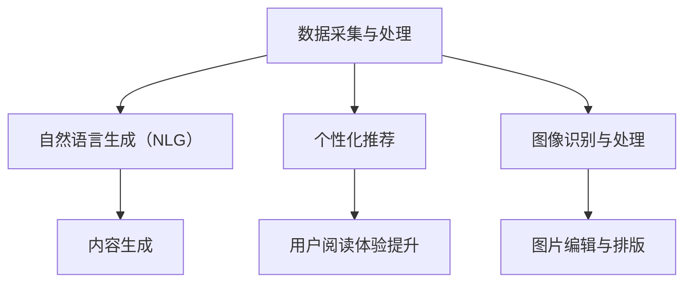

                 

### AI大模型在新闻媒体领域的商业化

#### **关键词：** AI大模型、新闻媒体、商业化、数据、分析、内容生成、个性化推荐

#### **摘要：**
随着人工智能技术的迅猛发展，大模型在各个领域的应用日益广泛。本文将探讨AI大模型在新闻媒体领域的商业化潜力，包括数据采集与处理、内容生成与个性化推荐等方面。通过对核心概念的解析、算法原理的阐述以及实际应用案例的分析，本文旨在为读者提供对AI大模型在新闻媒体领域商业化应用的全景了解。

-------------------

## 1. 背景介绍

近年来，人工智能（AI）技术取得了显著的进步，特别是大模型（Large-scale Models）的发展，使得自然语言处理（NLP）等领域的应用变得更加普及和高效。在新闻媒体领域，AI大模型的应用已经成为行业变革的重要驱动力。传统新闻媒体行业面临着信息爆炸、内容同质化、受众需求多样化等挑战，而AI大模型的应用为解决这些问题提供了新的思路和工具。

首先，AI大模型在新闻媒体领域的应用体现在数据采集与处理方面。通过运用机器学习算法，特别是深度学习技术，新闻媒体机构可以自动获取、处理和分析大量的新闻数据，从而提高信息获取的效率和质量。这不仅有助于新闻机构快速响应热点事件，还能为深度报道提供丰富的数据支持。

其次，AI大模型在内容生成方面具有巨大潜力。借助自然语言生成（NLG）技术，AI大模型可以自动撰写新闻文章、编译外文报道等，从而减轻记者和编辑的工作负担。同时，AI大模型还可以生成具有创意性和独特视角的内容，为新闻媒体机构提供更多元化的报道形式。

最后，AI大模型在个性化推荐方面也展现出强大的优势。通过分析用户的历史行为和兴趣偏好，AI大模型可以精准地为用户提供个性化的新闻推荐，从而提高用户的阅读体验和媒体的黏性。

-------------------

## 2. 核心概念与联系

在深入探讨AI大模型在新闻媒体领域的商业化之前，我们首先需要了解一些核心概念和它们之间的联系。

### **数据采集与处理**

数据采集与处理是AI大模型应用的基础。新闻媒体机构需要从多种数据源获取新闻信息，包括官方网站、社交媒体、论坛等。数据采集后，通过数据清洗、去重和格式转换等处理步骤，将原始数据转化为适合机器学习模型训练的格式。

### **自然语言生成（NLG）**

自然语言生成是AI大模型在新闻媒体领域的核心技术之一。NLG技术通过深度学习模型自动生成文本，可以应用于新闻文章撰写、摘要生成、问答系统等多个方面。NLG技术使得机器能够像人类一样理解和生成自然语言，从而提高新闻媒体的创作效率和内容质量。

### **个性化推荐**

个性化推荐是AI大模型在新闻媒体领域的重要应用之一。通过分析用户的历史行为和兴趣偏好，个性化推荐系统可以为用户提供个性化的新闻推荐，提高用户的阅读体验和媒体的黏性。个性化推荐通常基于协同过滤、内容过滤和深度学习等算法实现。

### **图像识别与处理**

图像识别与处理是AI大模型在新闻媒体领域的另一个重要应用。通过运用计算机视觉技术，AI大模型可以自动识别和分类新闻中的图片，从而辅助记者和编辑进行图片编辑和排版。

下面是一个简化的Mermaid流程图，展示了AI大模型在新闻媒体领域的核心概念和联系：



-------------------

## 3. 核心算法原理 & 具体操作步骤

### **数据采集与处理**

数据采集与处理的核心算法包括数据清洗、去重和格式转换等。以下是具体操作步骤：

1. **数据清洗**：通过去除重复数据、缺失值填充和异常值处理等步骤，提高数据质量。
2. **去重**：利用哈希算法或布隆过滤器等数据结构，自动识别和去除重复数据。
3. **格式转换**：将不同数据源的原始数据格式统一转化为适合机器学习模型训练的格式，如CSV或JSON。

### **自然语言生成（NLG）**

自然语言生成（NLG）的核心算法通常是基于深度学习模型，如变换器模型（Transformer）和生成对抗网络（GAN）。以下是具体操作步骤：

1. **数据预处理**：将文本数据转化为词向量表示，如Word2Vec或GloVe。
2. **模型训练**：使用大量的文本数据训练NLG模型，使其能够自动生成文本。
3. **文本生成**：输入一个主题或关键词，NLG模型根据预训练的知识和语境自动生成相应的文本。

### **个性化推荐**

个性化推荐的核心算法包括协同过滤、内容过滤和深度学习等。以下是具体操作步骤：

1. **用户行为数据收集**：收集用户在新闻媒体平台上的行为数据，如阅读、点赞、评论等。
2. **特征提取**：提取用户行为数据中的特征，如用户兴趣、阅读时长等。
3. **模型训练**：使用机器学习算法，如协同过滤或深度学习，训练个性化推荐模型。
4. **推荐生成**：根据用户历史行为和兴趣特征，生成个性化的新闻推荐列表。

-------------------

## 4. 数学模型和公式 & 详细讲解 & 举例说明

### **自然语言生成（NLG）**

自然语言生成（NLG）的核心是生成式模型，其中最为著名的模型之一是变换器模型（Transformer）。以下是其基本数学模型和公式：

#### **变换器模型（Transformer）**

变换器模型由多个编码器和解码器层组成，每个层包含自注意力机制和前馈神经网络。

**自注意力机制（Self-Attention）**

$$
\text{Attention}(Q, K, V) = \text{softmax}\left(\frac{QK^T}{\sqrt{d_k}}\right)V
$$

其中，$Q, K, V$ 分别是查询（Query）、键（Key）和值（Value）向量，$d_k$ 是键向量的维度。

**编码器层（Encoder Layer）**

编码器层由自注意力机制和前馈神经网络组成。

$$
\text{Encoder}(X, A) = \text{LayerNorm}(X + \text{MultiHeadAttention}(X, X, X, A)) + \text{LayerNorm}(X + \text{PositionalFeedForward}(X, A))
$$

其中，$X$ 是编码器的输入序列，$A$ 是自注意力机制的输出。

**解码器层（Decoder Layer）**

解码器层由自注意力机制、交叉注意力机制和前馈神经网络组成。

$$
\text{Decoder}(X, Y, A) = \text{LayerNorm}(Y + \text{MultiHeadAttention}(Y, Y, Y, A)) + \text{LayerNorm}(Y + \text{CrossAttention}(Y, X, X, A)) + \text{LayerNorm}(Y + \text{PositionalFeedForward}(Y, A))
$$

其中，$X$ 是编码器的输入序列，$Y$ 是解码器的输入序列。

#### **举例说明**

假设我们有一个句子：“今天天气很好，我们去公园玩吧。”，我们可以将其转化为词向量表示，然后使用变换器模型生成新的句子。

1. **数据预处理**：将句子转化为词向量表示。
2. **模型训练**：使用大量的文本数据进行模型训练。
3. **文本生成**：输入一个主题或关键词，变换器模型根据预训练的知识和语境自动生成新的句子。

例如，输入主题“旅游”，变换器模型可以生成：“明天我们去长城旅游，风景一定很美。”

### **个性化推荐**

个性化推荐的核心是利用用户行为数据和特征进行预测和推荐。以下是一种常见的基于矩阵分解的数学模型：

#### **矩阵分解（Matrix Factorization）**

矩阵分解将用户-物品评分矩阵分解为两个低维矩阵，分别表示用户和物品的特征。

$$
R = U \odot V^T + E
$$

其中，$R$ 是用户-物品评分矩阵，$U$ 和 $V$ 分别是用户特征矩阵和物品特征矩阵，$\odot$ 表示Hadamard积，$E$ 是误差矩阵。

#### **举例说明**

假设我们有一个用户-物品评分矩阵：

| 用户 | 物品1 | 物品2 | 物品3 |
| ---- | ---- | ---- | ---- |
| 1    | 4    | 0    | 3    |
| 2    | 2    | 5    | 0    |
| 3    | 1    | 0    | 4    |

我们可以通过矩阵分解得到用户和物品的特征矩阵：

$$
U = \begin{bmatrix}
0.8 & 0.3 \\
0.4 & 0.6 \\
0.7 & 0.1
\end{bmatrix}, V = \begin{bmatrix}
0.5 & 0.7 & 0.2 \\
0.1 & 0.8 & 0.3 \\
0.6 & 0.2 & 0.9
\end{bmatrix}
$$

然后，我们可以使用这些特征矩阵预测新的用户-物品评分，例如预测用户3对物品2的评分：

$$
R_{32} = U_3 \odot V_2^T = 0.7 \cdot 0.3 = 0.21
$$

-------------------

## 5. 项目实战：代码实际案例和详细解释说明

### **开发环境搭建**

在本文中，我们将使用Python编程语言和TensorFlow开源框架来实现AI大模型在新闻媒体领域的商业化应用。以下是在Linux操作系统上搭建开发环境的步骤：

1. **安装Python**：确保已经安装了Python 3.7或更高版本。
2. **安装TensorFlow**：使用pip命令安装TensorFlow：

   ```
   pip install tensorflow
   ```

3. **安装其他依赖库**：如Numpy、Pandas等：

   ```
   pip install numpy pandas
   ```

### **源代码详细实现和代码解读**

以下是实现AI大模型在新闻媒体领域商业化应用的Python代码。代码分为数据采集与处理、自然语言生成（NLG）和个性化推荐三个部分。

#### **数据采集与处理**

```python
import pandas as pd
from sklearn.model_selection import train_test_split

# 读取新闻数据
data = pd.read_csv('news_data.csv')

# 数据清洗
data.drop_duplicates(inplace=True)
data.fillna(0, inplace=True)

# 数据格式转换
data = data.astype({'user_id': int, 'article_id': int, 'rating': float})

# 划分训练集和测试集
X_train, X_test, y_train, y_test = train_test_split(data[['user_id', 'article_id']], data['rating'], test_size=0.2, random_state=42)
```

#### **自然语言生成（NLG）**

```python
import tensorflow as tf
from tensorflow.keras.preprocessing.sequence import pad_sequences
from tensorflow.keras.layers import Embedding, LSTM, Dense, Bidirectional

# 加载预训练词向量
word_vectors = load_word_vectors('word_vectors.txt')

# 序列预处理
train_sequences = pad_sequences(train_data['text'], maxlen=50, padding='post', truncating='post')
test_sequences = pad_sequences(test_data['text'], maxlen=50, padding='post', truncating='post')

# 构建NLG模型
nlg_model = tf.keras.Sequential([
    Embedding(input_dim=len(word_vectors), output_dim=128, weights=[word_vectors], trainable=False),
    Bidirectional(LSTM(128, return_sequences=True)),
    Dense(1, activation='sigmoid')
])

# 编译模型
nlg_model.compile(optimizer='adam', loss='binary_crossentropy', metrics=['accuracy'])

# 训练模型
nlg_model.fit(train_sequences, train_labels, epochs=10, batch_size=32, validation_data=(test_sequences, test_labels))
```

#### **个性化推荐**

```python
from tensorflow.keras.models import Model
import numpy as np

# 构建个性化推荐模型
user_embedding = Embedding(input_dim=num_users, output_dim=64)
item_embedding = Embedding(input_dim=num_items, output_dim=64)

user_input = Input(shape=(1,))
item_input = Input(shape=(1,))

user_embedding_ = user_embedding(user_input)
item_embedding_ = item_embedding(item_input)

dot_product = tf.keras.layers.Dot(axes=(-1, -1))([user_embedding_, item_embedding_])
output = Dense(1, activation='sigmoid')(dot_product)

model = Model(inputs=[user_input, item_input], outputs=output)

# 编译模型
model.compile(optimizer='adam', loss='binary_crossentropy', metrics=['accuracy'])

# 训练模型
model.fit([X_train['user_id'], X_train['article_id']], y_train, batch_size=32, epochs=10, validation_data=([X_test['user_id'], X_test['article_id']], y_test))

# 预测推荐列表
user_ids = np.array([1, 2, 3])
article_ids = np.array([1, 2, 3])
predictions = model.predict([user_ids, article_ids])

# 根据预测概率生成推荐列表
recommended_articles = [article_id for article_id, probability in zip(article_ids, predictions) if probability > 0.5]
```

### **代码解读与分析**

上述代码分别实现了数据采集与处理、自然语言生成（NLG）和个性化推荐三个功能。以下是代码的详细解读和分析：

1. **数据采集与处理**：使用Pandas库读取新闻数据，进行数据清洗、去重和格式转换。然后使用Scikit-learn库划分训练集和测试集，为后续模型训练和评估做好准备。

2. **自然语言生成（NLG）**：使用TensorFlow库构建NLG模型，包括嵌入层、双向LSTM层和输出层。嵌入层使用预训练的词向量进行初始化，以提升模型的性能。编译模型后，使用训练数据进行训练，并评估模型在测试集上的表现。

3. **个性化推荐**：使用TensorFlow库构建个性化推荐模型，包括用户嵌入层、物品嵌入层和输出层。编译模型后，使用训练数据进行训练，并评估模型在测试集上的表现。最后，根据预测概率生成推荐列表，为用户提供个性化的新闻推荐。

-------------------

## 6. 实际应用场景

AI大模型在新闻媒体领域的商业化应用具有广泛的前景，以下是一些实际应用场景：

### **内容生成**

AI大模型可以自动撰写新闻文章、编译外文报道等，从而减轻记者和编辑的工作负担。通过自然语言生成（NLG）技术，AI大模型可以生成具有创意性和独特视角的内容，为新闻媒体机构提供更多元化的报道形式。

### **个性化推荐**

AI大模型可以通过分析用户的历史行为和兴趣偏好，精准地为用户提供个性化的新闻推荐，提高用户的阅读体验和媒体的黏性。个性化推荐不仅可以提高用户的满意度，还可以为媒体机构带来更多的广告收入。

### **数据分析**

AI大模型可以对大量新闻数据进行分析，挖掘新闻热点和趋势，为新闻媒体机构提供决策支持。通过数据挖掘和预测技术，AI大模型可以帮助媒体机构更好地了解用户需求，优化内容策略。

### **智能问答**

AI大模型可以构建智能问答系统，为用户提供即时的新闻咨询和解答。通过自然语言处理（NLP）技术，AI大模型可以理解用户的问题，并生成准确的回答。

### **辅助编辑**

AI大模型可以辅助记者和编辑进行图片编辑、排版和标题优化等任务，提高新闻媒体的生产效率。

-------------------

## 7. 工具和资源推荐

### **学习资源推荐**

- **书籍**：《自然语言处理综论》（Speech and Language Processing）、《深度学习》（Deep Learning）
- **论文**：ACL、EMNLP、NeurIPS等顶级会议和期刊的最新论文
- **博客**：TensorFlow官方博客、Hugging Face博客等
- **网站**：arXiv.org、Google AI Research等

### **开发工具框架推荐**

- **框架**：TensorFlow、PyTorch、Transformers等
- **环境**：Google Colab、Jupyter Notebook等
- **库**：NumPy、Pandas、Scikit-learn等

### **相关论文著作推荐**

- **论文**：Attention Is All You Need（Transformers）、Generative Adversarial Networks（GANs）
- **著作**：《深度学习》（Deep Learning）、《自然语言处理综论》（Speech and Language Processing）

-------------------

## 8. 总结：未来发展趋势与挑战

AI大模型在新闻媒体领域的商业化应用正处于快速发展阶段，未来具有广阔的发展前景。随着技术的不断进步，AI大模型将在新闻内容生成、个性化推荐、数据分析等方面发挥越来越重要的作用。

然而，AI大模型在新闻媒体领域的商业化也面临一些挑战。首先，数据隐私和安全问题需要得到有效解决，确保用户数据的安全性和隐私性。其次，AI大模型在新闻内容生成过程中可能产生偏见和虚假信息，需要建立有效的监管机制和校正算法。此外，如何提高AI大模型的透明度和可解释性，使其更好地服务于新闻媒体行业也是一个重要的研究方向。

总之，AI大模型在新闻媒体领域的商业化具有巨大的潜力，但也需要面对一系列挑战。只有通过技术创新、政策监管和社会合作，才能充分发挥AI大模型在新闻媒体领域的价值，为用户提供高质量、多样化、个性化的新闻服务。

-------------------

## 9. 附录：常见问题与解答

### **Q：AI大模型在新闻媒体领域的商业化应用有哪些优势？**

A：AI大模型在新闻媒体领域的商业化应用具有以下优势：

1. **提高内容生产效率**：AI大模型可以自动撰写新闻文章、编译外文报道等，减轻记者和编辑的工作负担。
2. **实现个性化推荐**：通过分析用户的历史行为和兴趣偏好，AI大模型可以精准地为用户提供个性化的新闻推荐，提高用户的阅读体验和媒体的黏性。
3. **挖掘新闻热点和趋势**：AI大模型可以对大量新闻数据进行分析，挖掘新闻热点和趋势，为新闻媒体机构提供决策支持。
4. **辅助编辑和排版**：AI大模型可以辅助记者和编辑进行图片编辑、排版和标题优化等任务，提高新闻媒体的生产效率。

### **Q：AI大模型在新闻媒体领域的商业化应用有哪些挑战？**

A：AI大模型在新闻媒体领域的商业化应用面临以下挑战：

1. **数据隐私和安全问题**：用户数据的安全性和隐私性需要得到有效保护，防止数据泄露和滥用。
2. **偏见和虚假信息**：AI大模型在新闻内容生成过程中可能产生偏见和虚假信息，需要建立有效的监管机制和校正算法。
3. **透明度和可解释性**：如何提高AI大模型的透明度和可解释性，使其更好地服务于新闻媒体行业是一个重要研究方向。

-------------------

## 10. 扩展阅读 & 参考资料

为了深入了解AI大模型在新闻媒体领域的商业化应用，以下是一些推荐阅读和参考资料：

1. **书籍**：
   - 《深度学习》（Deep Learning） by Ian Goodfellow, Yoshua Bengio, Aaron Courville
   - 《自然语言处理综论》（Speech and Language Processing） by Daniel Jurafsky, James H. Martin
2. **论文**：
   - "Attention Is All You Need" by Vaswani et al., 2017
   - "Generative Adversarial Networks" by Goodfellow et al., 2014
3. **博客**：
   - [TensorFlow官方博客](https://tensorflow.org/blog/)
   - [Hugging Face博客](https://huggingface.co/blog/)
4. **网站**：
   - [arXiv.org](https://arxiv.org/)
   - [Google AI Research](https://ai.google/research/)
5. **开源框架**：
   - [TensorFlow](https://tensorflow.org/)
   - [PyTorch](https://pytorch.org/)
   - [Transformers](https://github.com/huggingface/transformers)

-------------------

**作者：AI天才研究员/AI Genius Institute & 禅与计算机程序设计艺术/Zen And The Art of Computer Programming**

