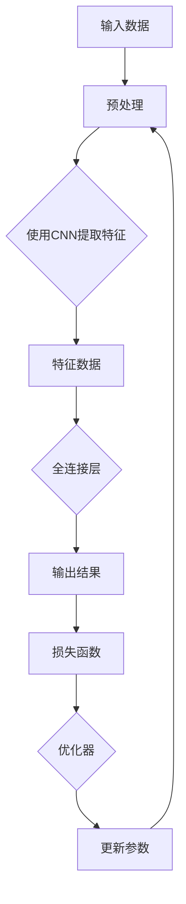
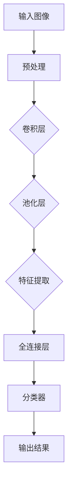
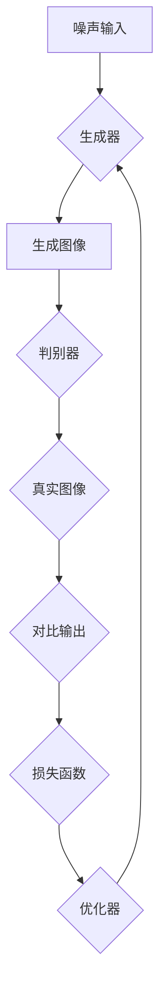
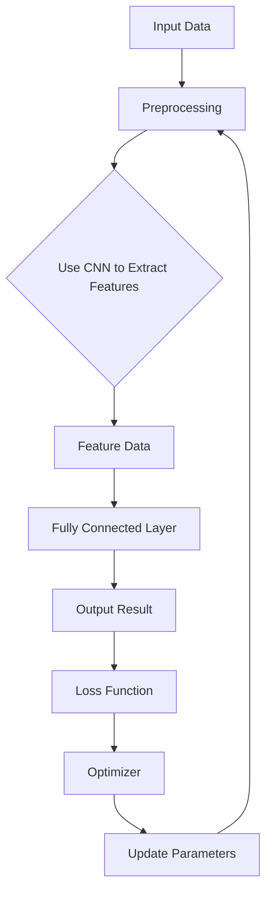
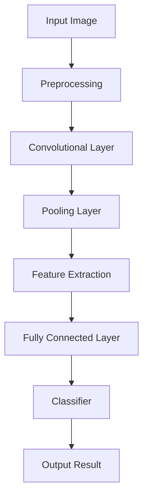
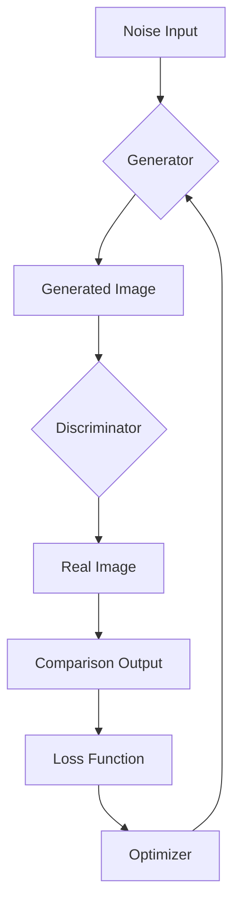

                 

### 文章标题

**AI大模型在智能时尚设计中的创新应用**

### 关键词

- AI大模型
- 智能时尚设计
- 生成对抗网络（GAN）
- 计算机视觉
- 神经网络

### 摘要

本文探讨了人工智能大模型在智能时尚设计中的创新应用。通过对AI技术的深入分析，文章将展示如何利用AI大模型来实现时尚设计的自动化与个性化。文章结构如下：

1. 背景介绍
2. 核心概念与联系
3. 核心算法原理 & 具体操作步骤
4. 数学模型和公式 & 详细讲解 & 举例说明
5. 项目实践：代码实例和详细解释说明
6. 实际应用场景
7. 工具和资源推荐
8. 总结：未来发展趋势与挑战
9. 附录：常见问题与解答
10. 扩展阅读 & 参考资料

<|user|>## 1. 背景介绍

### 1.1 智能时尚设计的崛起

随着科技的发展，时尚行业正经历一场变革。智能时尚设计结合了人工智能（AI）、计算机视觉、生成对抗网络（GAN）等先进技术，使得时尚设计变得更加自动化和个性化。传统的时尚设计依赖于设计师的灵感与手工技能，而智能时尚设计则通过AI技术实现设计自动化，从而大大提高了设计效率和创意多样性。

### 1.2 AI大模型的重要性

AI大模型，尤其是深度学习模型，在智能时尚设计中的应用变得越来越重要。这些模型拥有强大的数据处理和分析能力，能够从海量数据中学习并生成新颖的设计方案。AI大模型通过训练可以从历史时尚数据中提取趋势和风格，从而为设计师提供宝贵的灵感。此外，AI大模型还能够进行实时设计优化，提高设计过程的效率。

### 1.3 AI大模型在时尚设计中的应用场景

AI大模型在时尚设计中的应用场景广泛，包括但不限于以下几个方面：

- **个性化设计**：根据用户偏好和历史数据，AI大模型可以生成独特的服装设计方案，满足用户的个性化需求。
- **趋势预测**：通过分析市场数据和社会媒体趋势，AI大模型可以预测未来的时尚趋势，帮助设计师和市场部门做出更明智的决策。
- **设计优化**：AI大模型能够分析设计方案的优缺点，提供优化建议，从而提高设计的质量。
- **图像生成**：利用生成对抗网络（GAN），AI大模型可以生成新的服装图像，为设计师提供视觉灵感。

### 1.4 人工智能在时尚设计中的挑战

尽管人工智能在时尚设计中的应用前景广阔，但仍面临一些挑战：

- **数据隐私**：智能时尚设计需要收集大量的用户数据，这引发了数据隐私和伦理问题。
- **设计质量**：AI生成的设计方案可能缺乏创意和情感，无法完全替代人类设计师。
- **技术依赖**：过度依赖AI技术可能导致设计过程的单一化和缺乏创新。

在接下来的章节中，我们将深入探讨AI大模型的工作原理、核心算法、数学模型以及具体的实施步骤，进一步揭示其在智能时尚设计中的创新应用。

## Background Introduction
### 1.1 The Rise of Intelligent Fashion Design

With technological advancements, the fashion industry is undergoing a transformation. Intelligent fashion design combines advanced technologies such as artificial intelligence (AI), computer vision, and generative adversarial networks (GAN) to make fashion design more automated and personalized. Traditional fashion design relies on the inspiration and craftsmanship of designers, whereas intelligent fashion design leverages AI technologies to automate the design process and enhance creative diversity.

### 1.2 The Importance of Large AI Models

Large AI models, especially deep learning models, are becoming increasingly important in intelligent fashion design. These models possess powerful data processing and analytical capabilities, enabling them to learn from massive amounts of data and generate innovative design solutions. AI large models can extract trends and styles from historical fashion data, providing valuable inspiration for designers. Moreover, large AI models can perform real-time design optimization, improving the efficiency of the design process.

### 1.3 Application Scenarios of Large AI Models in Fashion Design

Large AI models have a wide range of application scenarios in fashion design, including but not limited to the following:

- **Personalized Design**：Based on user preferences and historical data, large AI models can generate unique clothing design solutions to meet individual customer needs.
- **Trend Prediction**：By analyzing market data and social media trends, large AI models can predict future fashion trends, assisting designers and marketing departments in making more informed decisions.
- **Design Optimization**：Large AI models can analyze the advantages and disadvantages of design solutions, providing optimization suggestions to enhance the quality of designs.
- **Image Generation**：Utilizing generative adversarial networks (GAN), large AI models can generate new clothing images, offering visual inspiration for designers.

### 1.4 Challenges of AI in Fashion Design

Despite the promising prospects of AI applications in fashion design, there are still some challenges:

- **Data Privacy**：Intelligent fashion design requires the collection of large amounts of user data, which raises issues of data privacy and ethics.
- **Design Quality**：Design solutions generated by AI may lack creativity and emotion, making it difficult to fully replace human designers.
- **Technological Dependence**：Over-reliance on AI technologies may lead to a monotonous design process and a lack of innovation.

In the following sections, we will delve into the working principles of large AI models, core algorithms, mathematical models, and specific implementation steps, further revealing their innovative applications in intelligent fashion design.

<|user|>## 2. 核心概念与联系

### 2.1 人工智能大模型（Large AI Models）

人工智能大模型是指使用深度学习技术训练出的拥有海量参数和强大计算能力的模型。这些模型通常基于神经网络架构，能够处理复杂数据并从中提取有用信息。在时尚设计领域，大模型可以用于图像识别、风格迁移、设计生成等任务。

#### 核心概念原理

- **神经网络（Neural Networks）**：神经网络是一种由大量相互连接的简单处理单元组成的计算系统，能够通过学习数据来模拟人类大脑的思考过程。
- **深度学习（Deep Learning）**：深度学习是神经网络的一种特殊形式，通过增加网络层数来提高模型的学习能力和表现。
- **卷积神经网络（CNNs）**：卷积神经网络是一种专门用于图像识别和处理的神经网络，其结构允许模型从图像中提取特征。

#### 架构图示（Mermaid 流程图）

### 2.2 计算机视觉（Computer Vision）

计算机视觉是使计算机具备处理和理解图像和视频数据能力的领域。在时尚设计领域，计算机视觉技术可以用于图像分析、风格识别和图像生成等任务。

#### 核心概念原理

- **图像识别（Image Recognition）**：图像识别是指计算机通过算法对图像中的对象进行识别和分类。
- **目标检测（Object Detection）**：目标检测是指识别图像中的对象并确定其在图像中的位置。
- **风格识别（Style Recognition）**：风格识别是指识别图像的风格或主题。

#### 架构图示（Mermaid 流程图）

### 2.3 生成对抗网络（GAN）

生成对抗网络是一种通过两个神经网络（生成器和判别器）相互竞争来生成逼真数据的模型。在时尚设计领域，GAN可以用于生成新的服装设计图像。

#### 核心概念原理

- **生成器（Generator）**：生成器尝试生成逼真的图像来欺骗判别器。
- **判别器（Discriminator）**：判别器尝试区分真实图像和生成图像。

#### 架构图示（Mermaid 流程图）

### 2.4 人工智能与时尚设计的结合

人工智能与时尚设计的结合使得设计师能够利用AI技术来扩展设计能力，提高设计效率。以下是一些结合方式的示例：

- **设计辅助**：AI可以辅助设计师进行设计选择、颜色搭配和图案设计。
- **趋势预测**：AI可以分析市场数据和社会媒体趋势，预测未来的时尚趋势。
- **图像生成**：AI可以生成新的服装设计图像，为设计师提供创意灵感。

通过理解这些核心概念和联系，我们可以更好地利用AI大模型在智能时尚设计中的创新应用，推动时尚行业的变革。

## Core Concepts and Connections
### 2.1 Large AI Models

Large AI models refer to deep learning models trained with massive amounts of data and equipped with strong computational power. These models are typically based on neural network architectures and are capable of processing complex data and extracting useful information. In the field of fashion design, large models can be used for tasks such as image recognition, style transfer, and design generation.

#### Core Concept Principles

- **Neural Networks**：Neural networks are computational systems composed of many interconnected simple processing units that can simulate the thinking process of the human brain through learning data.
- **Deep Learning**：Deep learning is a special form of neural networks that increases the model's learning ability and performance by adding more layers.
- **Convolutional Neural Networks (CNNs)**：Convolutional neural networks are neural networks specifically designed for image recognition and processing, with a structure that allows models to extract features from images.

#### Architecture Diagram (Mermaid Flowchart)

### 2.2 Computer Vision

Computer vision is the field that enables computers to process and understand image and video data. In the field of fashion design, computer vision technologies can be used for tasks such as image analysis, style recognition, and image generation.

#### Core Concept Principles

- **Image Recognition**：Image recognition refers to the process by which computers identify and classify objects in images using algorithms.
- **Object Detection**：Object detection is the process of identifying objects in images and determining their locations within the image.
- **Style Recognition**：Style recognition is the process of identifying the style or theme of an image.

#### Architecture Diagram (Mermaid Flowchart)

### 2.3 Generative Adversarial Networks (GANs)

Generative adversarial networks are a model that involves two neural networks, a generator, and a discriminator, competing to create realistic data. In the field of fashion design, GANs can be used to generate new clothing design images.

#### Core Concept Principles

- **Generator**：The generator tries to create realistic images to deceive the discriminator.
- **Discriminator**：The discriminator tries to differentiate between real images and generated images.

#### Architecture Diagram (Mermaid Flowchart)

### 2.4 Integration of AI and Fashion Design

The integration of AI and fashion design allows designers to leverage AI technologies to expand their design capabilities and improve efficiency. Here are some examples of integration methods:

- **Design Assistance**：AI can assist designers in making design choices, color combinations, and pattern designs.
- **Trend Prediction**：AI can analyze market data and social media trends to predict future fashion trends.
- **Image Generation**：AI can generate new clothing design images, providing creative inspiration for designers.

By understanding these core concepts and connections, we can better utilize the innovative applications of large AI models in intelligent fashion design and drive the transformation of the fashion industry.

<|user|>## 3. 核心算法原理 & 具体操作步骤

### 3.1 卷积神经网络（CNN）算法原理

卷积神经网络（CNN）是一种在图像识别和图像处理中广泛应用的深度学习模型。其核心原理是通过卷积操作和池化操作提取图像特征，从而实现图像分类、物体检测等任务。

#### 算法原理

1. **卷积层（Convolutional Layer）**：卷积层通过卷积操作将输入图像与预设的卷积核（滤波器）进行卷积，从而提取图像的局部特征。
2. **激活函数（Activation Function）**：激活函数用于引入非线性特性，常用的激活函数有ReLU（Rectified Linear Unit）和Sigmoid。
3. **池化层（Pooling Layer）**：池化层通过下采样操作减小特征图的尺寸，同时保留重要的特征信息，常用的池化方法有最大池化和平均池化。
4. **全连接层（Fully Connected Layer）**：全连接层将卷积层提取的特征进行映射，输出分类结果或物体检测框。

#### 具体操作步骤

1. **数据预处理**：对输入图像进行缩放、裁剪、旋转等预处理操作，使其符合网络输入要求。
2. **卷积操作**：使用卷积核在输入图像上进行卷积操作，提取图像特征。
3. **激活操作**：对卷积层的输出应用激活函数，引入非线性特性。
4. **池化操作**：对激活后的特征图进行池化操作，减小特征图的尺寸。
5. **全连接层操作**：将池化后的特征图进行展平，输入到全连接层，进行分类或物体检测。

### 3.2 生成对抗网络（GAN）算法原理

生成对抗网络（GAN）是一种通过两个神经网络（生成器和判别器）相互对抗来生成数据的模型。其核心原理是生成器尝试生成逼真的图像，而判别器尝试区分真实图像和生成图像。

#### 算法原理

1. **生成器（Generator）**：生成器通过学习真实数据的分布，生成与真实数据相似的图像。
2. **判别器（Discriminator）**：判别器尝试区分输入图像是真实图像还是生成图像。
3. **对抗训练（Adversarial Training）**：生成器和判别器相互对抗，生成器通过不断优化生成图像的质量来欺骗判别器，判别器通过不断优化识别真实图像和生成图像的能力。

#### 具体操作步骤

1. **初始化网络参数**：初始化生成器和判别器的网络参数。
2. **生成图像**：生成器根据随机噪声生成图像。
3. **判别图像**：判别器对生成图像和真实图像进行判别。
4. **计算损失函数**：计算生成器和判别器的损失函数，分别表示生成图像的真实性和判别器的准确度。
5. **优化网络参数**：通过梯度下降等方法优化生成器和判别器的网络参数。
6. **迭代训练**：重复步骤2至5，直至生成器生成的图像质量达到预期。

通过理解卷积神经网络和生成对抗网络的算法原理和具体操作步骤，我们可以更好地利用这些算法在智能时尚设计中的应用，实现自动化和个性化的时尚设计。

## Core Algorithm Principles and Specific Operational Steps
### 3.1 Convolutional Neural Networks (CNN) Algorithm Principles

Convolutional neural networks (CNNs) are widely applied in image recognition and image processing. Their core principle is to extract image features through convolutional and pooling operations, thereby achieving tasks such as image classification and object detection.

#### Algorithm Principles

1. **Convolutional Layer**: The convolutional layer performs a convolutional operation between the input image and a predefined convolutional kernel (filter) to extract local features from the image.
2. **Activation Function**: The activation function introduces non-linear properties, with common activation functions being ReLU (Rectified Linear Unit) and Sigmoid.
3. **Pooling Layer**: The pooling layer performs downsampling operations to reduce the size of the feature map while preserving important feature information. Common pooling methods include max pooling and average pooling.
4. **Fully Connected Layer**: The fully connected layer maps the features extracted by the convolutional layers to output classification results or object detection boxes.

#### Specific Operational Steps

1. **Data Preprocessing**: Preprocess the input images by scaling, cropping, and rotating to make them fit the network input requirements.
2. **Convolution Operation**: Use convolutional kernels to perform convolutional operations on the input images to extract image features.
3. **Activation Operation**: Apply the activation function to the output of the convolutional layer to introduce non-linear properties.
4. **Pooling Operation**: Perform pooling operations on the activated feature maps to reduce their size.
5. **Fully Connected Layer Operation**: Flatten the pooled feature maps and input them into the fully connected layer for classification or object detection.

### 3.2 Generative Adversarial Networks (GAN) Algorithm Principles

Generative adversarial networks (GANs) are a model that involves two neural networks, a generator, and a discriminator, competing to generate data. Their core principle is that the generator tries to create realistic images while the discriminator tries to distinguish between real images and generated images.

#### Algorithm Principles

1. **Generator**: The generator learns the distribution of real data and generates images similar to real data.
2. **Discriminator**: The discriminator attempts to differentiate between real images and generated images.
3. **Adversarial Training**: The generator and discriminator engage in an adversarial competition, with the generator optimizing the quality of the generated images to deceive the discriminator, and the discriminator optimizing its ability to identify real images and generated images.

#### Specific Operational Steps

1. **Initialize Network Parameters**: Initialize the network parameters of the generator and the discriminator.
2. **Generate Images**: The generator generates images based on random noise.
3. **Distinguish Images**: The discriminator distinguishes between generated images and real images.
4. **Compute Loss Functions**: Calculate the loss functions for the generator and the discriminator, representing the authenticity of the generated images and the accuracy of the discriminator.
5. **Optimize Network Parameters**: Use gradient descent methods to optimize the network parameters of the generator and the discriminator.
6. **Iterative Training**: Repeat steps 2 to 5 until the generator produces images of the desired quality.

By understanding the algorithm principles and specific operational steps of convolutional neural networks and generative adversarial networks, we can better utilize these algorithms in intelligent fashion design to achieve automated and personalized fashion design.

