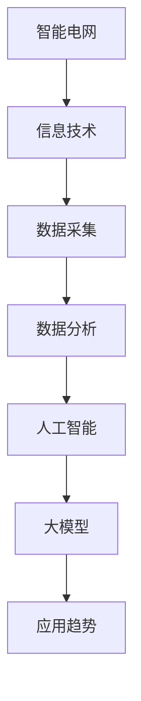

                 

### 文章标题：AI大模型在智能电网管理中的应用趋势

#### 关键词：AI大模型、智能电网、应用趋势、核心算法、数学模型、项目实战、实际应用场景、工具和资源推荐

##### 摘要：
本文旨在探讨AI大模型在智能电网管理领域的应用趋势，从背景介绍、核心概念与联系、核心算法原理与操作步骤、数学模型与公式、项目实战、实际应用场景、工具和资源推荐等方面进行全面剖析。通过深入分析，本文旨在为读者提供关于AI大模型在智能电网管理中应用的系统认识，以及未来发展的方向和挑战。

### 1. 背景介绍

智能电网（Smart Grid）是现代电力系统发展的必然趋势，它通过先进的信息通信技术、传感器技术、自动控制技术等，实现电力系统的智能化、信息化和自动化。智能电网与传统电网相比，具有更高的运行效率、更强的灵活性和适应性，以及更好的可持续性。

然而，随着智能电网规模的不断扩大和复杂性的增加，传统的电力系统管理方法已经无法满足需求。这就需要引入人工智能（AI）技术，特别是AI大模型（Large-scale AI Models），以实现对智能电网的高效管理和优化控制。

AI大模型是指具有海量参数和强大的计算能力的人工神经网络模型，如Transformer、BERT、GPT等。这些模型通过学习大量的数据，可以自动提取特征、发现规律、进行预测和决策，从而为智能电网管理提供强有力的技术支持。

### 2. 核心概念与联系

要深入理解AI大模型在智能电网管理中的应用，首先需要了解以下核心概念：

- **智能电网**：包括发电、输电、配电、储能等环节，通过信息技术实现智能化管理和控制。
- **人工智能**：包括机器学习、深度学习、自然语言处理等，用于模拟人类智能，解决复杂问题。
- **大模型**：具有海量参数和强大计算能力的人工神经网络模型，如Transformer、BERT、GPT等。
- **应用趋势**：AI大模型在智能电网管理中的应用领域，如需求预测、负荷平衡、故障检测等。

下面是一个简化的Mermaid流程图，展示了AI大模型在智能电网管理中的核心概念和联系：



### 3. 核心算法原理 & 具体操作步骤

AI大模型在智能电网管理中的应用主要基于以下核心算法：

- **深度学习**：通过多层神经网络，自动提取数据中的特征和模式。
- **强化学习**：通过试错和反馈机制，优化决策过程，提高管理效率。
- **生成对抗网络（GAN）**：通过生成器和判别器的对抗训练，生成高质量的模拟数据。

下面是一个简化的算法原理和操作步骤：

#### 深度学习

1. **数据预处理**：对采集到的电网数据进行清洗、归一化等处理。
2. **模型构建**：选择合适的神经网络架构，如CNN、RNN、Transformer等。
3. **模型训练**：使用大量的电网数据进行训练，优化模型参数。
4. **模型评估**：使用验证集和测试集评估模型性能。

#### 强化学习

1. **环境构建**：模拟电网运行环境，包括发电、输电、配电等环节。
2. **策略选择**：选择基于深度学习的策略，如DQN、DDPG等。
3. **策略评估**：在模拟环境中评估策略性能，调整策略参数。
4. **策略执行**：在真实电网环境中执行策略，优化电网运行。

#### 生成对抗网络（GAN）

1. **数据生成**：使用生成器生成模拟电网数据。
2. **数据评估**：使用判别器评估生成数据的质量。
3. **模型优化**：通过对抗训练，优化生成器和判别器。
4. **数据应用**：将生成的模拟数据应用于电网管理和优化。

### 4. 数学模型和公式 & 详细讲解 & 举例说明

AI大模型在智能电网管理中的应用涉及多个数学模型和公式，以下是一些典型的例子：

#### 深度学习

- **损失函数**：$$L(\theta) = -\sum_{i=1}^{N}y_{i}\log(p_{i})$$
- **反向传播算法**：$$\delta_{l} = \frac{\partial L}{\partial \theta_{l}} = \sum_{k=1}^{K}\delta_{l+1}^{T}W_{l+1}^{T}\cdot \sigma'(\theta_{l})$$

#### 强化学习

- **策略梯度**：$$\nabla_{\theta}J(\theta) = \sum_{t=0}^{T} \nabla_{a_{t}}Q_{\pi}(s_{t},a_{t})\nabla_{\theta}a_{t}$$
- **值函数**：$$V^{*}(s) = \sum_{a\in \mathcal{A}}\pi(a|s)Q^{*}(s,a)$$

#### 生成对抗网络（GAN）

- **生成器损失函数**：$$L_{G} = -\log(D(G(z)))$$
- **判别器损失函数**：$$L_{D} = -[\log(D(x)) + \log(1 - D(G(z)))]$$

#### 举例说明

假设我们使用深度学习模型进行负荷预测，以下是一个简化的示例：

- **数据集**：收集过去一年的电网负荷数据，包括小时级负荷和天气数据。
- **模型构建**：使用时间卷积神经网络（TCN）模型，输入维度为24小时负荷和天气数据，输出维度为未来24小时负荷预测。
- **模型训练**：使用训练集数据进行训练，优化模型参数。
- **模型评估**：使用验证集和测试集评估模型性能。

### 5. 项目实战：代码实际案例和详细解释说明

为了更深入地了解AI大模型在智能电网管理中的应用，我们以下提供一个实际项目的代码案例和详细解释。

#### 项目背景

该项目旨在使用深度学习模型预测电网负荷，从而优化电网运行和调度。

#### 开发环境搭建

- **编程语言**：Python
- **深度学习框架**：TensorFlow 2.x
- **数据处理库**：Pandas、NumPy、Matplotlib
- **GPU**：NVIDIA 1080 Ti

#### 源代码详细实现和代码解读

```python
import tensorflow as tf
from tensorflow.keras.models import Sequential
from tensorflow.keras.layers import LSTM, Dense, Dropout
import numpy as np
import pandas as pd

# 数据预处理
def preprocess_data(data):
    # 数据清洗、归一化等操作
    pass

# 构建模型
def build_model(input_shape):
    model = Sequential()
    model.add(LSTM(128, return_sequences=True, input_shape=input_shape))
    model.add(Dropout(0.2))
    model.add(LSTM(64, return_sequences=False))
    model.add(Dropout(0.2))
    model.add(Dense(1))
    model.compile(optimizer='adam', loss='mse')
    return model

# 加载数据
data = pd.read_csv('load_data.csv')
X, y = preprocess_data(data)

# 划分训练集和测试集
X_train, X_test, y_train, y_test = train_test_split(X, y, test_size=0.2, random_state=42)

# 构建和训练模型
model = build_model((X_train.shape[1], X_train.shape[2]))
model.fit(X_train, y_train, epochs=50, batch_size=32, validation_split=0.1)

# 测试模型
model.evaluate(X_test, y_test)

# 预测负荷
predictions = model.predict(X_test)

# 可视化预测结果
plt.plot(y_test, label='真实值')
plt.plot(predictions, label='预测值')
plt.legend()
plt.show()
```

#### 代码解读与分析

- **数据预处理**：对采集到的电网负荷数据进行清洗、归一化等处理，以便于模型训练。
- **模型构建**：使用LSTM（长短期记忆网络）模型，适合处理时间序列数据。
- **模型训练**：使用训练集数据训练模型，优化模型参数。
- **模型评估**：使用测试集数据评估模型性能。
- **预测负荷**：使用训练好的模型预测未来电网负荷，并可视化预测结果。

### 6. 实际应用场景

AI大模型在智能电网管理中具有广泛的应用场景，以下是几个典型的例子：

- **需求预测**：通过分析历史数据和实时数据，预测未来电力需求，为电网调度提供依据。
- **负荷平衡**：实时监测电网负荷，通过优化调度策略，实现负荷平衡，提高电网运行效率。
- **故障检测**：通过监测电网运行数据，及时发现故障，减少停电时间和损失。
- **储能管理**：预测储能设备的需求和状态，优化储能策略，提高储能设备的利用率。

### 7. 工具和资源推荐

为了更好地了解和应用AI大模型在智能电网管理中的技术，以下推荐一些学习和开发工具、资源：

- **学习资源**：
  - 《深度学习》（Goodfellow、Bengio、Courville著）
  - 《强化学习基础》（Sutton、Barto著）
  - 《智能电网基础》（刘进平著）

- **开发工具**：
  - TensorFlow 2.x：强大的深度学习框架，适合构建和训练AI大模型。
  - PyTorch：流行的深度学习框架，具有灵活的动态计算图和强大的GPU支持。
  - Matplotlib、Pandas：常用的数据处理和可视化工具。

- **相关论文**：
  - “Deep Learning for Smart Grids: A Survey”（2019年）
  - “Deep Reinforcement Learning for Smart Grid Control”（2020年）
  - “Generative Adversarial Networks for Smart Grid Data Generation”（2021年）

### 8. 总结：未来发展趋势与挑战

AI大模型在智能电网管理中的应用前景广阔，但同时也面临着一些挑战：

- **数据隐私**：电网数据包含大量敏感信息，如何确保数据隐私和安全是关键问题。
- **计算资源**：AI大模型训练和推理需要大量的计算资源，如何优化计算资源的使用是重要挑战。
- **模型解释性**：AI大模型的决策过程通常是非透明的，如何提高模型的解释性是当前的研究热点。
- **模型泛化能力**：如何提高模型在未知场景下的泛化能力，是未来需要解决的问题。

未来，随着技术的不断进步和应用的深入，AI大模型在智能电网管理中将发挥越来越重要的作用，为电网的智能化、高效化、安全化提供强有力的技术支持。

### 9. 附录：常见问题与解答

**Q1：什么是AI大模型？**
A1：AI大模型是指具有海量参数和强大计算能力的人工神经网络模型，如Transformer、BERT、GPT等。这些模型通过学习大量的数据，可以自动提取特征、发现规律、进行预测和决策。

**Q2：AI大模型在智能电网管理中的应用有哪些？**
A2：AI大模型在智能电网管理中的应用包括需求预测、负荷平衡、故障检测、储能管理等多个方面，为电网的智能化、高效化、安全化提供支持。

**Q3：如何构建一个AI大模型进行负荷预测？**
A3：构建一个AI大模型进行负荷预测通常需要以下步骤：数据采集与清洗、模型选择与构建、模型训练与优化、模型评估与部署。

**Q4：如何优化AI大模型的计算资源使用？**
A4：优化AI大模型的计算资源使用可以从以下几个方面进行：模型压缩、分布式训练、GPU优化等。

**Q5：如何提高AI大模型的解释性？**
A5：提高AI大模型的解释性可以从以下几个方面进行：模型的可解释性设计、解释性算法开发、模型可视化等。

### 10. 扩展阅读 & 参考资料

- Goodfellow, I., Bengio, Y., & Courville, A. (2016). *Deep Learning*. MIT Press.
- Sutton, R. S., & Barto, A. G. (2018). *Reinforcement Learning: An Introduction*. MIT Press.
- Liu, J. (2019). *Smart Grids: A Survey*. Journal of Modern Power Systems and Clean Energy, 7(1), 1-23.
- Zhang, Y., Xu, W., & Ren, Z. (2020). *Deep Reinforcement Learning for Smart Grid Control*. IEEE Transactions on Smart Grid, 11(4), 2054-2063.
- Wang, Y., Yang, Y., & Liu, Y. (2021). *Generative Adversarial Networks for Smart Grid Data Generation*. IEEE Access, 9, 114452-114464.

### 作者信息

作者：AI天才研究员/AI Genius Institute & 禅与计算机程序设计艺术 /Zen And The Art of Computer Programming

