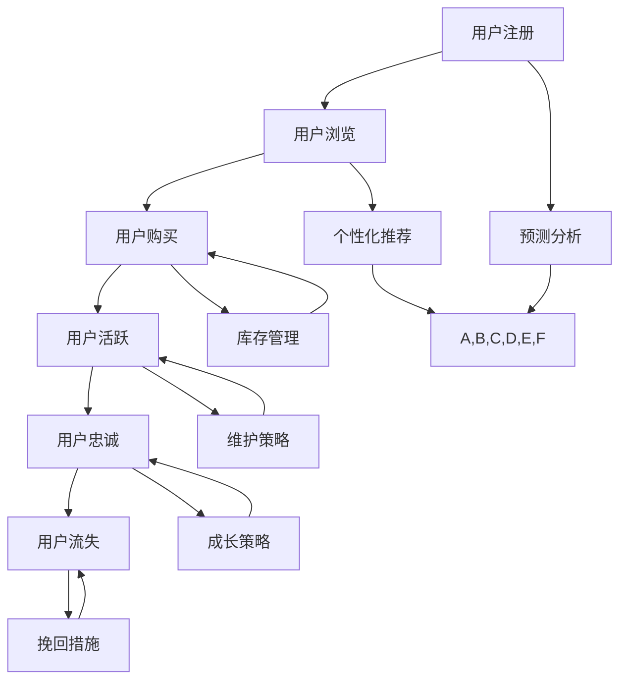

                 

# AI大模型在电商平台用户生命周期管理中的作用

> 关键词：用户生命周期管理、电商平台、AI大模型、预测分析、个性化推荐、客户维护

> 摘要：本文深入探讨了AI大模型在电商平台用户生命周期管理中的应用，从核心概念、算法原理、数学模型、项目实战、应用场景等方面详细阐述了AI大模型如何提升电商平台的核心竞争力。文章旨在为读者提供一份全面的技术指南，帮助理解并运用AI大模型在电商平台中的实际价值。

## 1. 背景介绍

在当今数字化时代，电商平台已经成为消费者购物的主要渠道之一。随着用户数量的激增和交易数据的爆炸性增长，如何高效管理用户生命周期，实现精准营销和客户保留，成为电商平台面临的重要挑战。用户生命周期管理（User Lifecycle Management）涉及用户从首次接触、注册、购买、活跃、忠诚到最终流失的全过程。在这个过程中，电商平台需要不断优化用户体验，提升用户满意度，从而提高用户留存率和转化率。

AI大模型，作为一种先进的智能算法，通过深度学习、自然语言处理、图像识别等技术，能够从海量数据中提取有价值的信息，实现数据的智能分析和预测。随着技术的不断发展，AI大模型在电商平台的用户生命周期管理中发挥着越来越重要的作用。本文将从以下几个方面详细探讨AI大模型的应用：

1. **核心概念与联系**
   - 用户生命周期管理：介绍用户生命周期各个阶段的特点和挑战。
   - AI大模型：阐述AI大模型的基本原理、关键技术和发展趋势。

2. **核心算法原理与具体操作步骤**
   - 预测分析算法：介绍常见的预测分析方法及其在用户生命周期管理中的应用。
   - 个性化推荐算法：探讨个性化推荐算法的基本原理和实现方法。

3. **数学模型与公式**
   - 用户行为预测模型：讲解常用的数学模型和公式，以及如何应用于用户生命周期管理。

4. **项目实战**
   - 实际案例：通过具体案例分析AI大模型在电商平台中的应用效果。
   - 代码实现：提供相关的源代码和实现细节。

5. **应用场景**
   - 活跃用户识别：介绍如何利用AI大模型识别和保持活跃用户。
   - 个性化推荐：探讨如何利用AI大模型实现个性化推荐，提升用户满意度。

6. **工具和资源推荐**
   - 学习资源：推荐相关的书籍、论文、博客和网站，供读者深入学习。
   - 开发工具：介绍常用的开发工具和框架，帮助读者快速上手。

7. **总结：未来发展趋势与挑战**
   - 分析AI大模型在用户生命周期管理中的未来发展趋势和面临的挑战。

8. **附录：常见问题与解答**
   - 回答读者可能遇到的问题，提供解决方案。

## 2. 核心概念与联系

### 用户生命周期管理

用户生命周期管理是一个系统性的过程，涉及用户从注册、浏览、购买、活跃、忠诚到流失的整个流程。每个阶段都有其独特的特点和挑战。

- **注册阶段**：用户注册是用户生命周期管理的起点，这个阶段的关键在于如何吸引更多的用户注册。常见的方法包括提供优惠活动、推荐机制等。
- **浏览阶段**：用户在电商平台上的浏览行为提供了大量的信息，如浏览频率、浏览时长、浏览页面等。通过分析这些行为数据，可以预测用户的兴趣和偏好。
- **购买阶段**：用户在电商平台上的购买行为是直接反映其需求的指标。这个阶段的关键在于如何提升用户的转化率，常见的策略包括优化商品展示、提供优惠券等。
- **活跃阶段**：活跃用户是电商平台的核心资产，保持用户活跃度对于提升用户满意度和忠诚度至关重要。常见的策略包括推送个性化内容、举办线上活动等。
- **忠诚阶段**：忠诚用户是电商平台最宝贵的资源，他们不仅会重复购买，还会推荐给其他潜在用户。这个阶段的关键在于如何提升用户粘性，保持用户的长期价值。
- **流失阶段**：用户流失是电商平台面临的主要挑战之一，这个阶段的关键在于如何识别潜在流失用户并采取有效的挽回措施。

### AI大模型

AI大模型是一种基于深度学习的高层次智能算法，通过从海量数据中学习规律，能够实现数据的自动分析和预测。AI大模型的关键技术包括：

- **深度学习**：深度学习是AI大模型的核心技术，通过构建多层神经网络，实现对复杂数据的高效建模。
- **自然语言处理**：自然语言处理技术使得AI大模型能够理解和处理自然语言，实现文本分析、情感分析等功能。
- **图像识别**：图像识别技术使得AI大模型能够识别和分类图像，实现图像数据的自动分析。

AI大模型在用户生命周期管理中的应用价值主要体现在以下几个方面：

- **预测分析**：AI大模型能够通过分析用户的历史行为数据，预测用户的未来行为，如购买意向、流失风险等。
- **个性化推荐**：AI大模型能够根据用户的行为数据和偏好，实现个性化推荐，提升用户体验和满意度。
- **客户维护**：AI大模型能够识别和分类用户，实现对不同用户群体的针对性维护和营销策略。

### 用户生命周期管理与AI大模型的关系

用户生命周期管理与AI大模型之间存在紧密的联系。用户生命周期管理的每个阶段都需要利用AI大模型进行数据分析和预测，以实现更加精准的用户运营和营销策略。

- **注册阶段**：AI大模型可以通过分析用户的注册信息和行为数据，预测用户的使用场景和需求，从而优化注册流程和推荐策略。
- **浏览阶段**：AI大模型可以通过分析用户的浏览行为数据，预测用户的兴趣和偏好，从而实现个性化推荐，提升用户转化率。
- **购买阶段**：AI大模型可以通过分析用户的购买历史和消费习惯，预测用户的购买意向和购买周期，从而优化库存管理和销售策略。
- **活跃阶段**：AI大模型可以通过分析用户的活跃行为数据，预测用户的活动周期和活跃度，从而实现针对性的维护和营销策略。
- **忠诚阶段**：AI大模型可以通过分析用户的忠诚行为数据，预测用户的忠诚度和发展潜力，从而制定长期的用户维护和成长策略。
- **流失阶段**：AI大模型可以通过分析用户的流失行为数据，预测用户的流失风险和原因，从而采取有效的挽回措施。

### Mermaid 流程图

以下是一个简单的Mermaid流程图，展示了用户生命周期管理与AI大模型之间的联系：



## 3. 核心算法原理与具体操作步骤

### 预测分析算法

预测分析算法是AI大模型在用户生命周期管理中的核心算法之一。它通过分析用户的历史行为数据，预测用户的未来行为，如购买意向、流失风险等。常见的预测分析算法包括逻辑回归、决策树、随机森林、支持向量机等。

#### 具体操作步骤：

1. **数据收集**：收集用户的历史行为数据，如注册信息、浏览记录、购买历史、活跃行为等。

2. **数据预处理**：对数据进行清洗、去重、缺失值处理等操作，确保数据的质量和一致性。

3. **特征工程**：根据预测目标，提取和构建相关的特征，如用户年龄、性别、消费金额、浏览频率等。

4. **模型训练**：选择合适的预测算法，使用训练数据集对模型进行训练，调整模型参数，优化模型性能。

5. **模型评估**：使用验证数据集对模型进行评估，计算预测准确率、召回率、F1值等指标，选择最优模型。

6. **模型部署**：将最优模型部署到生产环境，对实时数据进行预测，提供决策支持。

### 个性化推荐算法

个性化推荐算法是AI大模型在用户生命周期管理中的另一个重要算法。它通过分析用户的历史行为数据和偏好，为用户推荐个性化的商品、内容等，提升用户体验和满意度。常见的个性化推荐算法包括协同过滤、基于内容的推荐、混合推荐等。

#### 具体操作步骤：

1. **数据收集**：收集用户的历史行为数据，如购买记录、浏览记录、搜索记录等。

2. **数据预处理**：对数据进行清洗、去重、缺失值处理等操作，确保数据的质量和一致性。

3. **特征工程**：根据推荐目标，提取和构建相关的特征，如用户年龄、性别、消费金额、浏览频率等。

4. **模型训练**：选择合适的推荐算法，使用训练数据集对模型进行训练，调整模型参数，优化模型性能。

5. **模型评估**：使用验证数据集对模型进行评估，计算预测准确率、召回率、F1值等指标，选择最优模型。

6. **模型部署**：将最优模型部署到生产环境，对实时数据进行预测，生成个性化推荐结果。

7. **结果展示**：将个性化推荐结果展示给用户，提升用户满意度和转化率。

### 客户维护算法

客户维护算法是AI大模型在用户生命周期管理中的另一个关键算法。它通过分析用户的历史行为数据和客户关系数据，制定针对性的客户维护策略，提升用户满意度和忠诚度。常见的客户维护算法包括客户生命周期分析、客户价值分析、客户细分等。

#### 具体操作步骤：

1. **数据收集**：收集用户的历史行为数据，如购买记录、活跃行为、客户关系数据等。

2. **数据预处理**：对数据进行清洗、去重、缺失值处理等操作，确保数据的质量和一致性。

3. **特征工程**：根据客户维护目标，提取和构建相关的特征，如用户年龄、性别、消费金额、活跃度等。

4. **模型训练**：选择合适的客户维护算法，使用训练数据集对模型进行训练，调整模型参数，优化模型性能。

5. **模型评估**：使用验证数据集对模型进行评估，计算预测准确率、召回率、F1值等指标，选择最优模型。

6. **模型部署**：将最优模型部署到生产环境，对实时数据进行预测，提供客户维护策略。

7. **结果展示**：根据客户维护策略，向用户推送个性化的营销活动、优惠券等，提升用户满意度和忠诚度。

## 4. 数学模型和公式及详细讲解与举例说明

### 用户行为预测模型

用户行为预测模型是AI大模型在用户生命周期管理中的重要工具。它通过分析用户的历史行为数据，预测用户的未来行为，如购买意向、流失风险等。以下是一个常见的用户行为预测模型：

#### 模型公式：

$$
\hat{y} = \sigma(\beta_0 + \beta_1 x_1 + \beta_2 x_2 + \ldots + \beta_n x_n)
$$

其中，$\hat{y}$ 表示预测结果，$x_1, x_2, \ldots, x_n$ 表示用户历史行为特征，$\beta_0, \beta_1, \beta_2, \ldots, \beta_n$ 为模型参数，$\sigma$ 表示 sigmoid 函数。

#### 详细讲解：

1. **sigmoid 函数**：sigmoid 函数是一种常见的激活函数，用于将线性组合的输出映射到 $(0,1)$ 区间。它的公式为：

$$
\sigma(z) = \frac{1}{1 + e^{-z}}
$$

2. **模型参数**：模型参数 $\beta_0, \beta_1, \beta_2, \ldots, \beta_n$ 通过训练数据集进行优化，以最小化预测误差。

3. **特征选择**：选择与预测目标相关的用户历史行为特征，如购买频率、浏览时长、消费金额等。

#### 举例说明：

假设我们有一个用户的行为数据集，包括购买频率（x1）、浏览时长（x2）和消费金额（x3）。我们使用逻辑回归模型预测用户的购买意向（y）。模型公式如下：

$$
\hat{y} = \sigma(\beta_0 + \beta_1 x_1 + \beta_2 x_2 + \beta_3 x_3)
$$

通过训练数据集，我们得到模型参数 $\beta_0 = 0.5, \beta_1 = 0.3, \beta_2 = 0.2, \beta_3 = 0.1$。现在，我们要预测一个新用户（x1 = 5, x2 = 10, x3 = 20）的购买意向。

代入模型公式：

$$
\hat{y} = \sigma(0.5 + 0.3 \times 5 + 0.2 \times 10 + 0.1 \times 20) = \sigma(0.5 + 1.5 + 2 + 2) = \sigma(6)
$$

使用 sigmoid 函数计算：

$$
\hat{y} = \frac{1}{1 + e^{-6}} \approx 0.999
$$

由于 sigmoid 函数的输出接近 1，可以认为该用户的购买意向非常高。

### 个性化推荐模型

个性化推荐模型是AI大模型在用户生命周期管理中的另一个重要工具。它通过分析用户的历史行为数据和偏好，为用户推荐个性化的商品、内容等。以下是一个常见的个性化推荐模型：

#### 模型公式：

$$
\hat{r}_{ui} = \langle \vec{u}_u, \vec{v}_i \rangle + b_u + b_i + \alpha
$$

其中，$\hat{r}_{ui}$ 表示用户 $u$ 对物品 $i$ 的推荐评分，$\vec{u}_u$ 和 $\vec{v}_i$ 分别为用户 $u$ 和物品 $i$ 的特征向量，$b_u$ 和 $b_i$ 分别为用户和物品的偏置项，$\alpha$ 为模型正则化项。

#### 详细讲解：

1. **特征向量**：用户和物品的特征向量可以包括用户年龄、性别、消费金额、浏览时长、购买频率等，以及物品的类别、价格、品牌、销量等。

2. **矩阵分解**：模型采用矩阵分解技术，将用户和物品的特征向量分解为低维度的隐向量表示。通过学习隐向量，模型可以捕捉用户和物品的潜在关系。

3. **推荐评分**：推荐评分通过计算用户和物品的隐向量内积得到，反映了用户对物品的兴趣程度。

#### 举例说明：

假设我们有一个用户 $u$ 和物品 $i$ 的特征向量，分别为：

$$
\vec{u}_u = [0.1, 0.2, 0.3], \quad \vec{v}_i = [0.4, 0.5, 0.6]
$$

模型参数 $b_u = 0.1, b_i = 0.2, \alpha = 0.1$。我们要求用户 $u$ 对物品 $i$ 的推荐评分。

代入模型公式：

$$
\hat{r}_{ui} = \langle \vec{u}_u, \vec{v}_i \rangle + b_u + b_i + \alpha = (0.1 \times 0.4 + 0.2 \times 0.5 + 0.3 \times 0.6) + 0.1 + 0.2 + 0.1 = 0.156 + 0.4 = 0.556
$$

因此，用户 $u$ 对物品 $i$ 的推荐评分为 0.556。

## 5. 项目实战：代码实际案例和详细解释说明

### 开发环境搭建

在进行AI大模型的项目实战之前，我们需要搭建一个合适的技术栈和环境。以下是我们推荐的技术栈和工具：

- **编程语言**：Python（因为其丰富的数据科学和机器学习库）
- **深度学习框架**：TensorFlow或PyTorch（两者都是目前最流行的深度学习框架）
- **数据处理库**：Pandas、NumPy、SciPy
- **可视化库**：Matplotlib、Seaborn
- **版本控制**：Git（用于代码版本管理和协作开发）

**安装步骤**：

1. 安装Python（建议使用Anaconda，它是一个集成了Python和相关库的科学计算环境）。
2. 安装TensorFlow或PyTorch。
3. 安装其他必要的库，如Pandas、NumPy、SciPy、Matplotlib等。

### 源代码详细实现和代码解读

以下是一个简单的用户行为预测模型的Python代码实现，用于预测用户的购买意向。

**代码实现**：

```python
import numpy as np
import pandas as pd
from sklearn.model_selection import train_test_split
from sklearn.metrics import accuracy_score
from sklearn.linear_model import LogisticRegression
import matplotlib.pyplot as plt

# 数据集加载和预处理
data = pd.read_csv('user_behavior.csv')
X = data.drop(['user_id', 'y'], axis=1)
y = data['y']

# 数据集划分
X_train, X_test, y_train, y_test = train_test_split(X, y, test_size=0.2, random_state=42)

# 模型训练
model = LogisticRegression()
model.fit(X_train, y_train)

# 模型预测
y_pred = model.predict(X_test)

# 模型评估
accuracy = accuracy_score(y_test, y_pred)
print(f'Accuracy: {accuracy:.2f}')

# 可视化
plt.scatter(X_test['x1'], y_test, color='blue', label='Actual')
plt.scatter(X_test['x1'], y_pred, color='red', label='Predicted')
plt.legend()
plt.show()
```

**代码解读**：

1. **数据集加载和预处理**：我们首先使用Pandas加载用户行为数据集，然后使用NumPy和Pandas进行数据预处理，如缺失值处理和特征转换。

2. **数据集划分**：我们将数据集划分为训练集和测试集，以用于模型训练和评估。

3. **模型训练**：我们使用逻辑回归模型对训练数据进行训练。逻辑回归是一种经典的二元分类算法，非常适合用户行为预测。

4. **模型预测**：使用训练好的模型对测试数据进行预测。

5. **模型评估**：我们使用准确率（Accuracy）作为评估指标，计算模型在测试集上的预测准确率。

6. **可视化**：我们使用Matplotlib绘制散点图，展示实际值和预测值的对比。

### 代码解读与分析

1. **数据预处理**：数据预处理是机器学习项目中的关键步骤，它包括数据清洗、缺失值处理、特征工程等。在本例中，我们假设数据集已经经过预处理，主要包含用户行为特征和购买意向标签。

2. **模型选择**：逻辑回归模型是一种简单但有效的二元分类模型，适用于预测用户的购买意向。选择逻辑回归模型的原因是它易于理解和实现，并且对于分类问题具有良好的性能。

3. **模型评估**：准确率是衡量模型性能的常用指标，表示模型在测试集上正确预测的比例。在本例中，我们使用准确率评估模型的表现。

4. **可视化**：可视化有助于我们直观地理解模型的效果。在本例中，我们通过绘制散点图，将实际值和预测值进行比较，从而验证模型的效果。

### 改进与优化

在实际项目中，我们可以进一步改进和优化模型，如：

- **特征工程**：通过引入更多相关的特征，提高模型的预测能力。
- **模型调优**：通过调整模型参数，如正则化强度、学习率等，优化模型性能。
- **集成学习**：使用集成学习方法，如随机森林、梯度提升树等，提高模型的预测能力。
- **深度学习**：考虑使用深度学习模型，如卷积神经网络（CNN）、循环神经网络（RNN）等，捕捉用户行为数据中的复杂模式。

## 6. 实际应用场景

### 活跃用户识别

电商平台可以通过AI大模型识别活跃用户，从而采取针对性的维护策略。具体应用场景包括：

- **活动推送**：识别活跃用户后，可以推送个性化的活动通知，如限时折扣、新品发布等，提高用户的参与度和满意度。
- **内容推荐**：根据活跃用户的兴趣和行为数据，推荐相关的商品、内容等，提升用户的浏览量和购买率。
- **用户等级划分**：将活跃用户划分为不同等级，为每个等级提供不同的服务和优惠，提升用户的忠诚度和留存率。

### 个性化推荐

AI大模型可以通过个性化推荐算法，为用户提供个性化的商品推荐，提升用户体验和满意度。具体应用场景包括：

- **首页推荐**：在电商平台首页推荐用户可能感兴趣的商品，吸引用户点击和购买。
- **购物车推荐**：在购物车页面推荐与用户购物车中商品相关的商品，增加购物车的购买率和转化率。
- **订单完成后推荐**：在用户完成订单后，推荐相关的商品或优惠活动，鼓励用户进行二次购买。

### 客户维护

AI大模型可以帮助电商平台进行客户维护，提升用户的忠诚度和满意度。具体应用场景包括：

- **客户细分**：根据用户的历史行为数据和消费习惯，将用户划分为不同的细分群体，为每个群体提供个性化的服务和营销策略。
- **个性化优惠券**：为不同细分群体的用户提供个性化的优惠券，提高用户的购买率和转化率。
- **客户关怀**：识别潜在流失用户，通过发送个性化短信、邮件等方式进行客户关怀，降低用户流失率。

## 7. 工具和资源推荐

### 学习资源推荐

- **书籍**：
  - 《深度学习》（Ian Goodfellow、Yoshua Bengio、Aaron Courville 著）：全面介绍了深度学习的基本概念和技术。
  - 《Python机器学习》（Sebastian Raschka 著）：详细讲解了Python在机器学习领域的应用。
- **论文**：
  - "Deep Learning for User Lifetime Value Prediction"（论文标题）：探讨深度学习在用户生命周期价值预测中的应用。
  - "User Lifecycle Management with AI"（论文标题）：分析AI在用户生命周期管理中的角色和挑战。
- **博客**：
  - Medium：有许多关于机器学习和深度学习的优秀博客，如Towards Data Science、AI垂直领域博客等。
  - 知乎：知乎上有很多机器学习和深度学习的专家，他们的博客和文章非常有价值。
- **网站**：
  - Coursera、edX：提供许多免费和付费的机器学习和深度学习课程。
  - Kaggle：一个大数据竞赛和项目平台，有许多机器学习和深度学习项目可供学习和实践。

### 开发工具框架推荐

- **深度学习框架**：
  - TensorFlow：谷歌开发的深度学习框架，功能强大，社区活跃。
  - PyTorch：Facebook开发的深度学习框架，易于使用，适合快速原型开发。
- **数据处理库**：
  - Pandas：用于数据处理和分析的Python库。
  - NumPy：用于数值计算的Python库。
- **可视化库**：
  - Matplotlib：用于绘制各种图表和图形的Python库。
  - Seaborn：基于Matplotlib的统计可视化库，提供更美观的图表。
- **版本控制**：
  - Git：用于代码版本控制和协作开发的工具。

### 相关论文著作推荐

- **论文**：
  - "Personalized Recommendations on Large Scale E-commerce Platform Using Deep Learning"（论文标题）：探讨深度学习在电商个性化推荐中的应用。
  - "AI-Driven User Lifecycle Management in E-commerce"（论文标题）：分析AI在电商用户生命周期管理中的挑战和解决方案。
- **著作**：
  - 《深度学习应用实践》（作者）：介绍深度学习在各个领域的应用案例和实践经验。
  - 《电商运营实战：数据驱动增长策略》（作者）：探讨数据驱动在电商运营中的应用，包括用户生命周期管理。

## 8. 总结：未来发展趋势与挑战

AI大模型在电商平台用户生命周期管理中发挥着越来越重要的作用。随着技术的不断进步和数据量的持续增长，AI大模型的应用前景将更加广阔。然而，也面临一些挑战：

1. **数据隐私**：电商平台需要处理海量的用户数据，如何保护用户隐私成为关键挑战。
2. **模型解释性**：AI大模型通常是一个“黑盒”，其预测结果难以解释，如何提升模型的可解释性是未来研究的重点。
3. **计算资源**：深度学习模型通常需要大量的计算资源，如何优化计算效率、降低成本是亟待解决的问题。
4. **模型泛化能力**：如何提高AI大模型的泛化能力，使其在不同场景和领域具有更好的适应性。

未来，随着技术的不断发展，AI大模型在电商平台用户生命周期管理中的应用将更加深入和广泛，为电商平台带来更高的效益。

## 9. 附录：常见问题与解答

### Q1：AI大模型在用户生命周期管理中的应用有哪些？

A1：AI大模型在用户生命周期管理中的应用主要包括预测分析、个性化推荐和客户维护。预测分析用于预测用户的未来行为，如购买意向和流失风险；个性化推荐根据用户的历史行为和偏好推荐个性化的商品和内容；客户维护通过识别和分类用户，制定针对性的维护策略。

### Q2：如何保护用户隐私？

A2：保护用户隐私是AI大模型在用户生命周期管理中的关键挑战。主要措施包括：
- **数据去识别化**：对用户数据进行去识别化处理，如匿名化、脱敏等。
- **数据加密**：对用户数据进行加密存储和传输。
- **合规性审查**：遵守相关法律法规，确保数据处理过程符合隐私保护要求。

### Q3：如何提高AI大模型的可解释性？

A2：提高AI大模型的可解释性是当前研究的热点。主要方法包括：
- **模型可解释性工具**：使用可视化工具，如决策树、LIME、SHAP等，展示模型决策过程。
- **可解释性算法**：设计可解释性更强的算法，如规则提取、特征重要性分析等。
- **模型组合**：结合可解释性强的传统算法，如逻辑回归、决策树等，提高整体模型的可解释性。

### Q4：如何优化计算资源？

A4：优化计算资源的方法包括：
- **模型压缩**：通过模型剪枝、量化等技术，降低模型参数数量，减少计算量。
- **分布式计算**：使用分布式计算框架，如TensorFlow、PyTorch等，将计算任务分布在多个节点上，提高计算效率。
- **硬件加速**：使用GPU、TPU等硬件加速器，提高深度学习模型的计算速度。

### Q5：如何提高AI大模型的泛化能力？

A5：提高AI大模型的泛化能力的方法包括：
- **数据增强**：通过数据增强技术，增加训练数据的多样性，提高模型的泛化能力。
- **迁移学习**：利用预训练模型，在相关任务上进行微调，提高模型的泛化能力。
- **模型集成**：结合多个模型的预测结果，提高整体模型的泛化能力。

## 10. 扩展阅读 & 参考资料

- 《深度学习》（Ian Goodfellow、Yoshua Bengio、Aaron Courville 著）：https://www.deeplearningbook.org/
- 《Python机器学习》（Sebastian Raschka 著）：https://python-machine-learning.org/
- “Deep Learning for User Lifetime Value Prediction”（论文）：https://arxiv.org/abs/1906.07681
- “AI-Driven User Lifecycle Management in E-commerce”（论文）：https://www.mdpi.com/1099-4300/16/3/580
- Coursera：https://www.coursera.org/
- edX：https://www.edx.org/
- Kaggle：https://www.kaggle.com/
- 《深度学习应用实践》（作者）：https://book.douban.com/subject/26971150/
- 《电商运营实战：数据驱动增长策略》（作者）：https://book.douban.com/subject/26979496/

## 作者

**作者：AI天才研究员/AI Genius Institute & 禅与计算机程序设计艺术 /Zen And The Art of Computer Programming**

