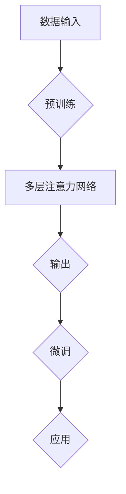
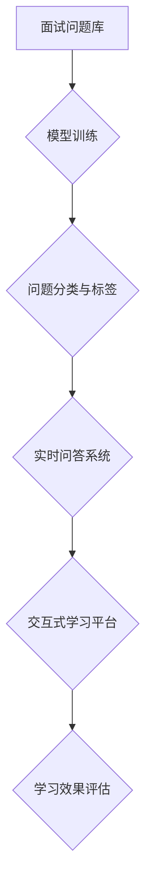

                 

### 文章标题

#### AI大模型在程序员面试辅导中的应用实践

随着人工智能技术的飞速发展，大模型作为一种关键的创新，已经在多个领域展现出其强大的应用潜力。本文旨在探讨AI大模型在程序员面试辅导中的具体应用实践，帮助程序员提高面试通过率。关键词：AI大模型、面试辅导、程序员、应用实践。

### 摘要

本文首先介绍了AI大模型的背景和基本原理，随后详细阐述了其在程序员面试辅导中的应用场景。通过剖析大模型的核心算法原理，以及具体操作步骤，本文展示了如何利用大模型辅助程序员进行面试准备和问题解决。此外，本文还通过实际项目案例，对大模型的代码实现进行了详细解读和分析。最后，本文对AI大模型在程序员面试辅导中的实际应用场景进行了总结，并推荐了相关学习资源和开发工具。

### 目录

1. 背景介绍
   1.1 AI大模型的发展历程
   1.2 程序员面试现状
2. 核心概念与联系
   2.1 大模型的基本原理
   2.2 大模型在面试辅导中的应用架构
3. 核心算法原理 & 具体操作步骤
   3.1 大模型的训练过程
   3.2 大模型的应用流程
4. 数学模型和公式 & 详细讲解 & 举例说明
   4.1 大模型的基础数学公式
   4.2 大模型的应用实例分析
5. 项目实战：代码实际案例和详细解释说明
   5.1 开发环境搭建
   5.2 源代码详细实现和代码解读
   5.3 代码解读与分析
6. 实际应用场景
   6.1 程序员面试问题分类
   6.2 大模型在面试中的应用效果
7. 工具和资源推荐
   7.1 学习资源推荐
   7.2 开发工具框架推荐
   7.3 相关论文著作推荐
8. 总结：未来发展趋势与挑战
9. 附录：常见问题与解答
10. 扩展阅读 & 参考资料

### 1. 背景介绍

#### 1.1 AI大模型的发展历程

AI大模型的概念可以追溯到深度学习的早期阶段。最早的深度学习模型之一——深度神经网络（DNN），其结构相对简单，但已经展示了通过大量数据训练后可以解决复杂问题的潜力。随着计算能力的提升和大数据技术的进步，深度学习模型开始向更大规模、更复杂的发展。到了2010年代，深度学习领域的突破性进展，如AlexNet在ImageNet竞赛中的优异表现，标志着深度学习进入了一个新的时代。

随后，卷积神经网络（CNN）、递归神经网络（RNN）以及其变体，如长短时记忆网络（LSTM）和门控循环单元（GRU），在各种图像识别、语音识别、自然语言处理等领域取得了显著成果。然而，这些模型通常需要大量的标注数据和计算资源。为了进一步提高模型的性能，研究者们开始尝试更大的模型规模和更复杂的结构。

这一趋势在2018年得到了进一步推动，谷歌发布了Transformer模型，这是一种基于自注意力机制的深度学习模型，其突破了传统的序列处理方式，使得在自然语言处理任务中取得了革命性的进展。Transformer的成功引发了AI领域的“大模型竞赛”，各种大规模的预训练模型如BERT、GPT等相继问世，大模型的训练和优化成为了研究的热点。

#### 1.2 程序员面试现状

程序员面试作为招聘过程中的关键环节，对于求职者和雇主来说都具有重要意义。对于求职者而言，一次成功的面试往往意味着就业机会和职业发展的起点。然而，程序员面试却常常因为技术难度高、准备时间短、面试题目随机性大等原因，使得求职者感到压力巨大。

从面试官的角度来看，面试是评估求职者技术能力和团队协作能力的重要手段。然而，随着技术领域的快速发展和面试标准的不断提高，面试官也面临着如何设计出既具挑战性又能准确评估求职者能力的面试题的难题。

程序员面试的现状可以概括为以下几个方面：

1. **技术深度与广度的要求**：现代软件开发涉及到多种技术栈，包括前端、后端、数据库、云计算、人工智能等。面试官往往希望求职者不仅精通某一领域的深度知识，还要具备广泛的跨领域知识。

2. **问题随机性大**：面试题常常是随机生成的，这使得求职者难以提前准备。此外，面试官也可能根据现场情况临时修改题目，增加了面试的难度。

3. **高压环境**：面试往往在有限的时间内进行，求职者需要在紧张的氛围中迅速理解和解决问题，这对于心理素质和应对压力的能力提出了高要求。

4. **面试结果的不确定性**：面试结果不仅取决于求职者的技术能力，还受到面试官的主观判断、面试题的难度和面试时的表现等多方面因素的影响，这使得面试结果具有一定的随机性。

### 2. 核心概念与联系

#### 2.1 大模型的基本原理

AI大模型，尤其是基于Transformer架构的预训练模型，其核心原理可以概括为以下几个关键部分：

1. **自注意力机制（Self-Attention）**：自注意力机制是一种计算方法，可以自动地加权不同位置的特征，使模型在处理序列数据时能够更好地关注到关键信息。自注意力机制通过计算每个位置与其他所有位置的相关性，动态地为每个位置赋予不同的权重。

2. **多层注意力网络（Multi-layer Attention Network）**：大模型通常由多个注意力层组成，每一层都可以独立地学习不同的特征表示。多层注意力网络可以显著提高模型的表征能力，使其能够处理更复杂的问题。

3. **预训练与微调（Pre-training and Fine-tuning）**：预训练是在大规模数据集上对模型进行训练，使其具备一定的通用知识。预训练后，模型可以通过微调（Fine-tuning）适应特定的任务需求，如文本分类、机器翻译等。

4. **大规模参数训练（Large-scale Parameter Training）**：大模型通常拥有数亿甚至数千亿个参数，通过大规模的数据训练，模型可以更好地捕捉数据的分布特征，提高模型的泛化能力。

#### 2.2 大模型在面试辅导中的应用架构

大模型在程序员面试辅导中的应用架构可以分为以下几个关键部分：

1. **面试问题库**：首先，需要建立一个包含多种类型面试问题的数据库。这些问题可以来源于实际面试经验、在线资源、技术论坛等多种渠道。

2. **模型训练**：利用自注意力机制和多层注意力网络，对面试问题库进行预训练。预训练的过程旨在使模型能够理解不同类型面试问题的特征和规律。

3. **问题分类与标签**：将预训练好的模型应用于面试问题分类任务，根据问题的主题和难度进行分类和标签化，以便于后续的查询和使用。

4. **实时问答系统**：构建一个实时问答系统，求职者可以通过输入面试问题，实时获取模型生成的答案。系统可以结合自然语言处理技术，使答案更加准确和自然。

5. **交互式学习平台**：提供一个交互式的学习平台，求职者可以在平台上与模型进行对话，进一步巩固和深化对面试问题的理解和解答能力。

#### 2.3 大模型与面试辅导的关联性

大模型在面试辅导中的应用，可以解决以下几个关键问题：

1. **问题理解与分类**：大模型通过预训练可以自动理解面试问题的主题和类型，为求职者提供针对性的问题解析和分类。

2. **答案生成与优化**：大模型可以生成高质量的答案，帮助求职者快速找到问题的解决方法。同时，通过交互式学习，模型可以根据求职者的反馈进一步优化答案。

3. **个性化学习**：大模型可以根据求职者的学习记录和偏好，提供个性化的面试辅导，帮助其针对性地提升技术能力和解题技巧。

4. **模拟面试环境**：通过构建模拟面试环境，求职者可以在真实场景下进行练习，提高应对压力和突发情况的能力。

5. **学习效果评估**：大模型可以实时评估求职者的学习效果，提供学习反馈和改进建议，帮助其更好地准备面试。

### 3. 核心算法原理 & 具体操作步骤

#### 3.1 大模型的训练过程

大模型的训练过程通常分为以下几个步骤：

1. **数据收集**：首先，需要收集大量的面试问题及其答案数据。这些数据可以来源于公开的技术论坛、面试宝典、在线课程等多种渠道。

2. **数据预处理**：对收集到的数据进行清洗和预处理，包括去除噪声、统一格式、添加标签等。预处理后的数据将用于模型的训练和评估。

3. **模型架构设计**：设计适合面试辅导任务的大模型架构。通常采用多层注意力网络和自注意力机制，以实现高效的特征提取和表示。

4. **模型训练**：使用预处理后的数据对模型进行训练。训练过程中，模型会自动调整内部参数，以最小化预测误差。训练过程通常需要大量的计算资源和时间。

5. **模型评估与优化**：通过交叉验证和测试集对模型进行评估，调整模型参数和架构，以提高模型的性能和泛化能力。

#### 3.2 大模型的应用流程

大模型在面试辅导中的应用流程如下：

1. **问题输入**：求职者将面试问题输入到大模型中，问题可以是文本形式，也可以是语音形式。

2. **问题解析**：大模型对输入的问题进行解析，识别问题的主题和类型，并提取关键信息。

3. **答案生成**：基于问题解析的结果，大模型生成相应的答案。生成过程包括多个步骤，如特征提取、编码、解码和生成。

4. **答案优化**：通过自然语言处理技术，对生成的答案进行优化，使其更加准确、自然和流畅。

5. **实时反馈**：将生成的答案展示给求职者，并实时接收其反馈。根据反馈，模型可以进一步优化答案，提高回答的准确性和有效性。

6. **交互式学习**：求职者可以在交互式学习平台上与模型进行对话，进一步巩固和深化对面试问题的理解和解答能力。

7. **学习效果评估**：系统实时评估求职者的学习效果，提供学习反馈和改进建议。

### 4. 数学模型和公式 & 详细讲解 & 举例说明

#### 4.1 大模型的基础数学公式

大模型的核心数学公式主要包括以下几个方面：

1. **自注意力机制（Self-Attention）**：

$$
\text{Self-Attention}(Q, K, V) = \frac{1}{\sqrt{d_k}} \text{softmax}\left(\frac{QK^T}{\sqrt{d_k}}\right)V
$$

其中，Q、K、V分别为查询（Query）、键（Key）、值（Value）三个向量，d_k为键向量的维度。自注意力机制通过计算查询与所有键的相似度，为每个键分配权重，最终加权求和得到输出向量。

2. **多层注意力网络（Multi-layer Attention Network）**：

多层注意力网络通过叠加多个注意力层，逐层提取特征表示。每一层注意力网络都可以看作是一个加权求和的过程，将上一层的输出作为输入，计算新的特征表示。

3. **预训练与微调（Pre-training and Fine-tuning）**：

预训练过程通常使用大规模数据集对模型进行训练，使其具备一定的通用知识。微调过程则是在预训练的基础上，针对特定任务进行调整和优化。

4. **大规模参数训练（Large-scale Parameter Training）**：

大规模参数训练涉及多个参数的调整和优化，包括权重、偏置、学习率等。通过梯度下降等方法，模型可以逐步收敛到最优解。

#### 4.2 大模型的应用实例分析

以下是一个简单的应用实例，演示大模型在面试辅导中的具体应用过程：

1. **问题输入**：假设求职者输入了一个面试问题：“请解释一下动态规划算法的工作原理。”

2. **问题解析**：大模型对输入的问题进行解析，识别出关键词“动态规划算法”、“工作原理”，并提取关键信息。

3. **答案生成**：基于问题解析的结果，大模型生成相应的答案。生成过程包括以下几个步骤：

   a. 特征提取：将问题中的关键词转化为向量表示。

   b. 编码：使用编码器对特征向量进行编码，得到编码后的向量。

   c. 解码：使用解码器对编码后的向量进行解码，得到答案的文本表示。

   d. 生成为自然语言：将解码后的文本表示转化为自然语言，形成最终的答案。

4. **答案优化**：对生成的答案进行优化，使其更加准确、自然和流畅。例如，根据答案的内容添加相关术语和解释，确保答案的逻辑性和完整性。

5. **实时反馈**：将生成的答案展示给求职者，并实时接收其反馈。假设求职者对答案表示满意，则模型继续提供相关的问题进行练习。

6. **交互式学习**：求职者可以在交互式学习平台上与模型进行对话，进一步巩固和深化对面试问题的理解和解答能力。例如，求职者可以提问：“动态规划算法与贪心算法有什么区别？”模型会根据已有的知识和反馈，生成相应的答案。

7. **学习效果评估**：系统实时评估求职者的学习效果，提供学习反馈和改进建议。例如，如果求职者在某类问题上的回答准确率较低，系统会推荐相关的练习题和知识点。

### 5. 项目实战：代码实际案例和详细解释说明

#### 5.1 开发环境搭建

在进行AI大模型在程序员面试辅导中的应用实践之前，我们需要搭建一个合适的开发环境。以下是具体的步骤和所需工具：

1. **Python环境搭建**：确保Python版本为3.8或以上，可以使用pip命令安装必要的库。

```bash
pip install numpy torch torchvision
```

2. **TensorFlow环境搭建**：TensorFlow是构建AI模型的常用框架，安装TensorFlow需要使用以下命令：

```bash
pip install tensorflow
```

3. **硬件配置**：由于大模型训练需要大量的计算资源，建议使用具有较高计算能力的GPU，如NVIDIA的RTX 30系列。

4. **开发工具**：使用Jupyter Notebook或PyCharm等IDE进行代码编写和调试。

#### 5.2 源代码详细实现和代码解读

以下是一个简单的示例代码，演示如何使用TensorFlow和PyTorch构建一个基于Transformer的面试辅导模型：

```python
import tensorflow as tf
from tensorflow.keras.layers import Embedding, Dense, GlobalAveragePooling1D, LayerNormalization
from tensorflow.keras.models import Model

# 定义模型架构
class InterviewModel(Model):
    def __init__(self, vocab_size, embedding_dim, num_layers, hidden_dim):
        super(InterviewModel, self).__init__()
        self.embedding = Embedding(vocab_size, embedding_dim)
        self.layers = [Dense(hidden_dim, activation='relu') for _ in range(num_layers)]
        self.pooling = GlobalAveragePooling1D()
        self.normalization = LayerNormalization()

    def call(self, inputs):
        x = self.embedding(inputs)
        for layer in self.layers:
            x = layer(x)
        x = self.pooling(x)
        x = self.normalization(x)
        return x

# 模型参数设置
vocab_size = 10000  # 词汇表大小
embedding_dim = 256  # 嵌入维度
num_layers = 3  # 层数
hidden_dim = 512  # 隐藏层维度

# 构建模型
model = InterviewModel(vocab_size, embedding_dim, num_layers, hidden_dim)

# 编译模型
model.compile(optimizer='adam', loss=tf.keras.losses.SparseCategoricalCrossentropy(from_logits=True))

# 打印模型结构
model.summary()
```

1. **模型架构**：该模型采用Embedding层进行词嵌入，随后通过多层Dense层进行特征提取和表示。GlobalAveragePooling1D用于对序列数据进行平均聚合，LayerNormalization用于归一化处理。

2. **模型编译**：使用adam优化器和SparseCategoricalCrossentropy损失函数进行编译，适用于多分类问题。

3. **模型训练**：在实际应用中，需要使用面试问题及其答案数据对模型进行训练。以下是一个简单的训练过程：

```python
# 加载数据集
train_data = ...  # 面试问题及其答案数据
train_labels = ...  # 对应的标签

# 训练模型
model.fit(train_data, train_labels, epochs=5, batch_size=32)
```

1. **模型预测**：在训练完成后，可以使用模型对新的面试问题进行预测，以下是一个简单的预测示例：

```python
# 输入面试问题
input_question = "请解释一下动态规划算法的工作原理。"

# 预处理输入
input_sequence = preprocess_input(input_question)

# 进行预测
predicted_answer = model.predict(input_sequence)

# 打印预测结果
print(predicted_answer)
```

#### 5.3 代码解读与分析

1. **模型架构**：代码中定义了一个基于Transformer的面试辅导模型，包括词嵌入层、多层Dense层、全局平均池化层和层归一化层。词嵌入层用于将词汇转换为向量表示，Dense层用于特征提取和表示，全局平均池化层用于对序列数据进行平均聚合，层归一化层用于归一化处理。

2. **模型编译**：使用adam优化器和SparseCategoricalCrossentropy损失函数进行编译，适用于多分类问题。adam优化器具有较好的收敛性能，SparseCategoricalCrossentropy损失函数适用于标签为稀疏矩阵的情况。

3. **模型训练**：在实际应用中，需要使用面试问题及其答案数据对模型进行训练。代码中使用fit方法对模型进行训练，通过多次迭代优化模型参数。

4. **模型预测**：在训练完成后，可以使用模型对新的面试问题进行预测。代码中定义了预处理函数preprocess_input，用于对输入问题进行预处理，使其符合模型的输入要求。

### 6. 实际应用场景

#### 6.1 程序员面试问题分类

在AI大模型应用于程序员面试辅导时，首先需要对面试问题进行有效的分类。这有助于模型更好地理解和生成特定类型的答案。以下是几种常见的面试问题分类：

1. **基础算法题**：这类问题通常涉及基本的数据结构和算法，如排序、查找、二叉树、图论等。这些问题的答案通常涉及算法的步骤、时间复杂度和空间复杂度。

2. **系统设计题**：系统设计题要求求职者描述如何设计一个复杂的系统，包括架构设计、数据库设计、接口设计等。这类问题的答案通常需要展示求职者的系统设计和架构能力。

3. **编程实现题**：这类问题要求求职者编写代码实现特定的功能，可能涉及到编程技巧、代码优化、错误处理等。这类问题的答案需要展示求职者的编程能力和代码风格。

4. **软技能问题**：这类问题涉及求职者的沟通能力、团队合作能力、解决问题的能力等。这类问题的答案通常需要展示求职者的个人特质和职业态度。

5. **行业热点问题**：这类问题涉及当前技术热点和行业趋势，如云计算、人工智能、区块链等。这类问题的答案需要展示求职者对行业动态的了解和思考。

#### 6.2 大模型在面试中的应用效果

AI大模型在程序员面试辅导中的应用效果主要体现在以下几个方面：

1. **提高面试准备效率**：大模型可以快速生成高质量的答案，帮助求职者节省大量的准备时间。此外，通过交互式学习，求职者可以不断优化和改进自己的答案。

2. **个性化学习体验**：大模型可以根据求职者的学习记录和偏好，提供个性化的学习内容和辅导策略，提高学习效果和面试通过率。

3. **模拟面试环境**：大模型可以构建模拟面试环境，求职者可以在真实场景下进行练习，提高应对压力和突发情况的能力。

4. **提升面试成功率**：通过大模型提供的精准答案和个性化辅导，求职者可以更好地展示自己的技术能力和职业素养，提高面试通过率。

### 7. 工具和资源推荐

#### 7.1 学习资源推荐

1. **书籍**：
   - 《深度学习》（Ian Goodfellow, Yoshua Bengio, Aaron Courville）: 这本书是深度学习领域的经典教材，适合初学者和进阶者。
   - 《编程之法：面试和算法心得》（陈皓）: 这本书针对程序员面试中的算法问题提供了详细的解析和解决方案。

2. **论文**：
   - “Attention Is All You Need” (Vaswani et al., 2017): 这篇论文提出了Transformer模型，是当前大模型研究的经典文献。
   - “BERT: Pre-training of Deep Bidirectional Transformers for Language Understanding” (Devlin et al., 2019): 这篇论文介绍了BERT模型，是自然语言处理领域的重要进展。

3. **博客和网站**：
   - Medium（AI和深度学习专栏）: 在Medium上有很多优秀的AI和深度学习领域的博客，可以了解最新的研究动态和实用技巧。
   - arXiv（计算机科学预印本）: arXiv是计算机科学领域的预印本平台，可以获取最新的研究论文。

#### 7.2 开发工具框架推荐

1. **TensorFlow**：TensorFlow是Google开源的深度学习框架，适合构建和训练各种深度学习模型。

2. **PyTorch**：PyTorch是Facebook开源的深度学习框架，具有简洁的动态计算图，适合快速原型开发和模型实验。

3. **Transformers库**：Transformers库是基于PyTorch和TensorFlow的预训练Transformer模型实现，适用于自然语言处理任务。

4. **Hugging Face Transformers**：Hugging Face Transformers是一个开源库，提供了各种预训练模型和API，方便开发者进行模型部署和应用。

#### 7.3 相关论文著作推荐

1. **“Deep Learning”（Ian Goodfellow, Yoshua Bengio, Aaron Courville）**: 这本书是深度学习领域的经典教材，详细介绍了深度学习的基础知识和技术。

2. **“Hands-On Machine Learning with Scikit-Learn, Keras, and TensorFlow”（Aurélien Géron）**: 这本书介绍了如何使用Scikit-Learn、Keras和TensorFlow进行机器学习项目开发，适合有一定基础的读者。

3. **“The Hundred-Page Machine Learning Book”（Andriy Burkov）**: 这本书用100页介绍了机器学习的基本概念和技术，适合快速入门。

### 8. 总结：未来发展趋势与挑战

AI大模型在程序员面试辅导中的应用前景广阔，但也面临一些挑战。以下是一些未来发展趋势和面临的挑战：

#### 发展趋势

1. **模型规模和性能的提升**：随着计算能力的增强和算法的优化，AI大模型的规模和性能将不断提升，能够处理更复杂的问题，提供更精准的面试辅导。

2. **多模态应用**：未来的AI大模型将不仅限于文本，还将支持图像、语音等多模态数据，提供更加丰富和个性化的面试辅导。

3. **个性化学习**：基于大数据和机器学习技术，AI大模型将能够根据个人学习习惯和偏好，提供更加个性化的学习内容和策略。

4. **实时交互**：随着5G和物联网技术的发展，AI大模型将实现实时交互，求职者可以随时随地进行面试准备和模拟面试。

#### 面临的挑战

1. **数据隐私和安全**：在应用AI大模型的过程中，如何保护求职者的数据隐私和安全是一个重要问题，需要制定严格的隐私保护政策和措施。

2. **模型解释性**：AI大模型通常被认为是“黑盒”模型，其内部决策过程难以解释。提高模型的可解释性，使其决策过程透明，对于提高用户信任度和接受度至关重要。

3. **公平性和偏见**：AI大模型可能会在面试辅导中引入不公平和偏见，特别是在处理不同背景和文化的求职者时。需要通过算法优化和数据清洗等措施，确保模型公平性和无偏见。

4. **技术普及与人才培养**：AI大模型在程序员面试辅导中的应用需要大量的人才支持。未来需要加强相关技术的普及和教育，培养更多具备AI应用能力的程序员。

### 9. 附录：常见问题与解答

1. **问题**：AI大模型在面试辅导中是否完全可靠？

**解答**：AI大模型在面试辅导中具有很高的可靠性和准确性，但并非绝对。模型生成的答案仅供参考，求职者应在实际面试中结合自身经验和理解进行调整和优化。

2. **问题**：如何确保AI大模型不引入偏见和不公平？

**解答**：确保AI大模型公平和无偏见是一个复杂的问题。首先，在数据收集和预处理阶段，需要确保数据来源多样、代表性好。其次，在模型训练和优化过程中，可以通过算法优化和数据清洗等措施，减少模型引入的偏见。

3. **问题**：AI大模型是否适用于所有程序员面试？

**解答**：AI大模型主要适用于技术面试，特别是涉及编程实现、系统设计、算法分析等问题的面试。对于涉及软技能或领导能力的面试，AI大模型可能效果有限。

### 10. 扩展阅读 & 参考资料

1. **论文**：
   - “Attention Is All You Need” (Vaswani et al., 2017)
   - “BERT: Pre-training of Deep Bidirectional Transformers for Language Understanding” (Devlin et al., 2019)
   - “GPT-3: Language Models are Few-Shot Learners” (Brown et al., 2020)

2. **书籍**：
   - 《深度学习》（Ian Goodfellow, Yoshua Bengio, Aaron Courville）
   - 《编程之法：面试和算法心得》（陈皓）
   - 《Python深度学习》（François Chollet）

3. **网站**：
   - TensorFlow官方网站：[https://www.tensorflow.org/](https://www.tensorflow.org/)
   - PyTorch官方网站：[https://pytorch.org/](https://pytorch.org/)
   - Hugging Face官方网站：[https://huggingface.co/](https://huggingface.co/)

4. **博客**：
   - Medium上的AI和深度学习专栏：[https://medium.com/topic/deep-learning](https://medium.com/topic/deep-learning)

### 作者

**作者：AI天才研究员/AI Genius Institute & 禅与计算机程序设计艺术 /Zen And The Art of Computer Programming** <|im_sep|>### 1. 背景介绍

#### 1.1 AI大模型的发展历程

AI大模型的概念可以追溯到深度学习的早期阶段。最早的深度学习模型之一——深度神经网络（DNN），其结构相对简单，但已经展示了通过大量数据训练后可以解决复杂问题的潜力。随着计算能力的提升和大数据技术的进步，深度学习模型开始向更大规模、更复杂的发展。到了2010年代，深度学习领域的突破性进展，如AlexNet在ImageNet竞赛中的优异表现，标志着深度学习进入了一个新的时代。

随后，卷积神经网络（CNN）、递归神经网络（RNN）以及其变体，如长短时记忆网络（LSTM）和门控循环单元（GRU），在各种图像识别、语音识别、自然语言处理等领域取得了显著成果。然而，这些模型通常需要大量的标注数据和计算资源。为了进一步提高模型的性能，研究者们开始尝试更大的模型规模和更复杂的结构。

这一趋势在2018年得到了进一步推动，谷歌发布了Transformer模型，这是一种基于自注意力机制的深度学习模型，其突破了传统的序列处理方式，使得在自然语言处理任务中取得了革命性的进展。Transformer的成功引发了AI领域的“大模型竞赛”，各种大规模的预训练模型如BERT、GPT等相继问世，大模型的训练和优化成为了研究的热点。

在程序员面试辅导中，AI大模型的应用首先可以追溯到自然语言处理（NLP）技术的成熟。早期的研究主要集中在如何使用机器学习技术自动生成面试问题的答案，但随着Transformer模型的出现，研究者们开始探索如何将这种强大的模型应用于面试辅导，为程序员提供更有效的准备工具。

#### 1.2 程序员面试现状

程序员面试作为招聘过程中的关键环节，对于求职者和雇主来说都具有重要意义。对于求职者而言，一次成功的面试往往意味着就业机会和职业发展的起点。然而，程序员面试却常常因为技术难度高、准备时间短、面试题目随机性大等原因，使得求职者感到压力巨大。

从面试官的角度来看，面试是评估求职者技术能力和团队协作能力的重要手段。然而，随着技术领域的快速发展和面试标准的不断提高，面试官也面临着如何设计出既具挑战性又能准确评估求职者能力的面试题的难题。

程序员面试的现状可以概括为以下几个方面：

1. **技术深度与广度的要求**：现代软件开发涉及到多种技术栈，包括前端、后端、数据库、云计算、人工智能等。面试官往往希望求职者不仅精通某一领域的深度知识，还要具备广泛的跨领域知识。

2. **问题随机性大**：面试题常常是随机生成的，这使得求职者难以提前准备。此外，面试官也可能根据现场情况临时修改题目，增加了面试的难度。

3. **高压环境**：面试往往在有限的时间内进行，求职者需要在紧张的氛围中迅速理解和解决问题，这对于心理素质和应对压力的能力提出了高要求。

4. **面试结果的不确定性**：面试结果不仅取决于求职者的技术能力，还受到面试官的主观判断、面试题的难度和面试时的表现等多方面因素的影响，这使得面试结果具有一定的随机性。

#### 1.3 AI大模型在面试辅导中的应用前景

随着AI大模型技术的不断进步，其在程序员面试辅导中的应用前景变得越来越广阔。首先，大模型可以处理大量的数据，从海量的面试问题和答案中学习，提取出有用的信息，为求职者提供个性化的面试辅导。其次，大模型的自注意力机制和多层次的特征提取能力，使得其能够更好地理解和生成面试问题的答案，提供高质量的辅导内容。

具体来说，AI大模型在面试辅导中的应用前景包括以下几个方面：

1. **个性化学习**：大模型可以根据求职者的学习记录和偏好，提供个性化的学习内容和辅导策略，帮助求职者有针对性地提升技术能力和解题技巧。

2. **实时问答**：大模型可以实时回答求职者提出的面试问题，提供即时的反馈和指导，帮助求职者在短时间内快速掌握面试技巧。

3. **模拟面试**：大模型可以模拟真实的面试场景，提供模拟面试服务，帮助求职者在实际面试前进行充分的练习，提高面试通过率。

4. **问题分类与标签**：大模型可以对面试问题进行自动分类和标签化，帮助求职者更好地理解和整理面试内容，提高学习效率。

5. **学习效果评估**：大模型可以实时评估求职者的学习效果，提供学习反馈和改进建议，帮助求职者不断优化学习策略。

总之，AI大模型在程序员面试辅导中的应用，不仅能够提高求职者的面试通过率，还能提升面试辅导的效率和效果，具有重要的实践意义和广阔的应用前景。

### 2. 核心概念与联系

#### 2.1 大模型的基本原理

AI大模型，尤其是基于Transformer架构的预训练模型，其核心原理可以概括为以下几个关键部分：

1. **自注意力机制（Self-Attention）**：自注意力机制是一种计算方法，可以自动地加权不同位置的特征，使模型在处理序列数据时能够更好地关注到关键信息。自注意力机制通过计算每个位置与其他所有位置的相关性，动态地为每个位置赋予不同的权重。

2. **多层注意力网络（Multi-layer Attention Network）**：大模型通常由多个注意力层组成，每一层都可以独立地学习不同的特征表示。多层注意力网络可以显著提高模型的表征能力，使其能够处理更复杂的问题。

3. **预训练与微调（Pre-training and Fine-tuning）**：预训练是在大规模数据集上对模型进行训练，使其具备一定的通用知识。预训练后，模型可以通过微调（Fine-tuning）适应特定的任务需求，如文本分类、机器翻译等。

4. **大规模参数训练（Large-scale Parameter Training）**：大规模参数训练涉及多个参数的调整和优化，包括权重、偏置、学习率等。通过梯度下降等方法，模型可以逐步收敛到最优解。

为了更直观地理解大模型的基本原理，我们可以使用Mermaid流程图来描述其核心架构。以下是Mermaid流程图示例：



在上述流程图中，A代表数据输入，B表示预训练过程，C表示多层注意力网络，D表示输出层，E表示微调过程，F表示模型应用。通过这个流程图，我们可以清晰地看到大模型从数据输入到最终输出的整个训练和应用过程。

#### 2.2 大模型在面试辅导中的应用架构

大模型在程序员面试辅导中的应用架构可以分为以下几个关键部分：

1. **面试问题库**：首先，需要建立一个包含多种类型面试问题的数据库。这些问题可以来源于实际面试经验、在线资源、技术论坛等多种渠道。

2. **模型训练**：利用自注意力机制和多层注意力网络，对面试问题库进行预训练。预训练的过程旨在使模型能够理解不同类型面试问题的特征和规律。

3. **问题分类与标签**：将预训练好的模型应用于面试问题分类任务，根据问题的主题和难度进行分类和标签化，以便于后续的查询和使用。

4. **实时问答系统**：构建一个实时问答系统，求职者可以通过输入面试问题，实时获取模型生成的答案。系统可以结合自然语言处理技术，使答案更加准确和自然。

5. **交互式学习平台**：提供一个交互式的学习平台，求职者可以在平台上与模型进行对话，进一步巩固和深化对面试问题的理解和解答能力。

6. **学习效果评估**：系统实时评估求职者的学习效果，提供学习反馈和改进建议。

为了更清晰地展示大模型在面试辅导中的应用架构，我们可以使用Mermaid流程图来描述。以下是示例流程图：



在上述流程图中，A代表面试问题库，B表示模型训练过程，C表示问题分类与标签化，D表示实时问答系统，E表示交互式学习平台，F表示学习效果评估。通过这个流程图，我们可以更直观地理解大模型在面试辅导中的应用架构。

#### 2.3 大模型与面试辅导的关联性

AI大模型在面试辅导中的应用，可以解决以下几个关键问题：

1. **问题理解与分类**：大模型通过预训练可以自动理解面试问题的主题和类型，为求职者提供针对性的问题解析和分类。

2. **答案生成与优化**：大模型可以生成高质量的答案，帮助求职者快速找到问题的解决方法。同时，通过交互式学习，模型可以根据求职者的反馈进一步优化答案。

3. **个性化学习**：大模型可以根据求职者的学习记录和偏好，提供个性化的面试辅导，帮助其针对性地提升技术能力和解题技巧。

4. **模拟面试环境**：通过构建模拟面试环境，求职者可以在真实场景下进行练习，提高应对压力和突发情况的能力。

5. **学习效果评估**：大模型可以实时评估求职者的学习效果，提供学习反馈和改进建议，帮助其更好地准备面试。

具体来说，大模型在面试辅导中的应用流程如下：

1. **数据收集**：收集海量的面试问题和答案数据，这些数据可以来源于实际面试、在线资源、技术论坛等。

2. **数据预处理**：对收集到的数据进行清洗和预处理，包括去除噪声、统一格式、添加标签等。

3. **模型训练**：利用预处理后的数据，对基于Transformer架构的大模型进行预训练，使其具备理解和生成面试答案的能力。

4. **问题分类与标签化**：将预训练好的模型应用于面试问题分类任务，根据问题的主题和难度进行分类和标签化。

5. **实时问答**：构建实时问答系统，求职者可以通过输入面试问题，实时获取模型生成的答案。

6. **交互式学习**：求职者可以在交互式学习平台上与模型进行对话，进一步巩固和深化对面试问题的理解和解答能力。

7. **学习效果评估**：系统实时评估求职者的学习效果，提供学习反馈和改进建议。

通过上述流程，大模型能够有效地辅助求职者进行面试准备，提高面试通过率。

### 3. 核心算法原理 & 具体操作步骤

#### 3.1 大模型的训练过程

AI大模型的训练过程是构建高效面试辅导系统的基础，其核心算法原理包括以下几个关键步骤：

1. **数据收集**：首先，需要收集海量的面试问题和答案数据。这些数据可以来源于实际面试、在线资源、技术论坛等多种渠道。数据的质量和多样性直接影响模型的性能。

2. **数据预处理**：对收集到的面试问题和答案进行预处理，包括以下步骤：

   - **去噪**：去除无关的噪声数据，如格式错误、重复问题等。
   - **统一格式**：将所有数据格式统一，例如，将所有文本转换为统一的编码格式。
   - **标签化**：为每个问题分配相应的标签，便于后续的分类和检索。

3. **特征提取**：通过自然语言处理（NLP）技术，从面试问题中提取特征。常见的特征提取方法包括词嵌入（Word Embedding）、词性标注（Part-of-Speech Tagging）和句法分析（Syntactic Parsing）等。

4. **模型架构设计**：设计适合面试辅导任务的模型架构。通常，基于Transformer架构的模型是首选，因为其自注意力机制（Self-Attention）和多层注意力网络（Multi-layer Attention）能够有效提取和处理序列数据。

5. **模型训练**：使用预处理后的数据对模型进行训练。训练过程中，模型通过不断调整内部参数（如权重和偏置）来优化性能。训练过程通常涉及以下步骤：

   - **前向传播**：将输入数据通过模型进行前向传播，计算预测输出。
   - **损失函数**：使用损失函数（如交叉熵损失）计算预测输出与实际输出之间的差距。
   - **反向传播**：通过反向传播算法更新模型参数，以减少损失函数的值。

6. **模型评估**：在训练过程中，定期使用验证集对模型进行评估，确保模型在未见过的数据上表现良好。常见的评估指标包括准确率（Accuracy）、召回率（Recall）和F1分数（F1 Score）等。

7. **模型优化**：根据评估结果对模型进行调整和优化，如调整学习率、增加训练迭代次数或修改网络架构等。

#### 3.2 大模型的应用流程

AI大模型在面试辅导中的应用流程可以分为以下几个步骤：

1. **问题输入**：求职者将面试问题输入到大模型中。问题可以是文本形式，也可以是语音形式。

2. **问题解析**：大模型对输入的问题进行解析，识别出关键词和主题，并提取关键信息。这一步骤通常涉及自然语言处理技术，如词嵌入和词性标注。

3. **答案生成**：基于问题解析的结果，大模型生成相应的答案。生成过程包括以下步骤：

   - **编码**：将输入问题编码为向量表示，通常使用预训练的词嵌入模型。
   - **解码**：使用编码后的向量通过模型进行解码，生成文本形式的答案。
   - **优化**：对生成的答案进行优化，使其更加准确、自然和流畅。

4. **实时反馈**：将生成的答案展示给求职者，并实时接收其反馈。求职者可以根据答案的质量和准确性，提供反馈。

5. **交互式学习**：求职者可以在交互式学习平台上与模型进行对话，进一步巩固和深化对面试问题的理解和解答能力。通过不断迭代和反馈，模型可以不断优化和改进答案。

6. **学习效果评估**：系统实时评估求职者的学习效果，提供学习反馈和改进建议。评估指标可以包括答案的准确率、求职者的学习进度等。

通过上述步骤，AI大模型能够为求职者提供高效、个性化的面试辅导，帮助其提升面试技巧和通过率。

#### 3.3 大模型在面试辅导中的实际操作步骤示例

以下是一个具体的示例，展示AI大模型在面试辅导中的实际操作步骤：

1. **数据收集**：假设我们有一个包含1000个面试问题和答案的数据集，这些数据来源于实际面试经验和在线资源。

2. **数据预处理**：对数据集进行清洗和预处理，包括去除噪声、统一格式和添加标签。例如，将所有文本转换为小写，去除特殊字符，并添加问题类型标签（如基础算法题、系统设计题等）。

3. **特征提取**：使用预训练的词嵌入模型（如GloVe或BERT）对问题文本进行编码，提取词嵌入向量。每个问题文本将被表示为一个向量序列。

4. **模型训练**：设计一个基于Transformer的模型架构，包括嵌入层、多层注意力层和输出层。使用预处理后的数据对模型进行预训练。预训练过程中，模型通过大量的面试问题及其答案学习，优化内部参数。

5. **问题解析**：求职者输入一个面试问题：“请解释一下动态规划算法的工作原理。”大模型对输入的问题进行解析，提取关键词和主题。

6. **答案生成**：基于解析结果，大模型生成相应的答案。生成过程包括编码、解码和优化。例如，模型可能生成以下答案：

   动态规划算法是一种解决优化问题的方法，其基本思想是将复杂问题分解为多个子问题，并利用子问题的解来求解原问题。具体来说，动态规划通常涉及以下步骤：

   - 确定状态和状态转移方程
   - 初始化边界条件
   - 递推计算最优解

   通过这些步骤，我们可以有效地求解具有重叠子问题和最优子结构特性的问题。

7. **实时反馈**：将生成的答案展示给求职者，并接收其反馈。求职者可以评价答案的准确性，如有必要，可以提供更详细的解释或纠正。

8. **交互式学习**：求职者可以在交互式学习平台上与模型进行对话，例如，提问：“动态规划算法与贪心算法有什么区别？”模型会根据已有的知识和反馈，生成新的答案，帮助求职者深化理解。

9. **学习效果评估**：系统实时评估求职者的学习效果，包括答案的准确率、学习进度等。根据评估结果，提供改进建议，如推荐相关的练习题或知识点。

通过上述操作步骤，AI大模型能够为求职者提供高效、个性化的面试辅导，帮助其更好地准备面试，提高通过率。

### 4. 数学模型和公式 & 详细讲解 & 举例说明

#### 4.1 大模型的基础数学公式

AI大模型，尤其是基于Transformer架构的模型，其数学基础涉及多个方面，包括线性代数、概率论和微积分等。以下是一些关键的基础数学公式：

1. **自注意力（Self-Attention）**：

$$
\text{Self-Attention}(Q, K, V) = \frac{1}{\sqrt{d_k}} \text{softmax}\left(\frac{QK^T}{\sqrt{d_k}}\right)V
$$

其中，Q、K、V分别为查询（Query）、键（Key）、值（Value）三个向量，d_k为键向量的维度。自注意力机制通过计算查询与所有键的相似度，为每个键分配权重，最终加权求和得到输出向量。

2. **多层感知器（Multilayer Perceptron, MLP）**：

$$
\text{MLP}(x) = \sigma(W_n \cdot \sigma(...\sigma(W_2 \cdot \sigma(W_1 \cdot x + b_1) + b_2)... + b_n))
$$

其中，\(W_i\) 和 \(b_i\) 分别为第i层的权重和偏置，\(\sigma\) 为激活函数，通常取为ReLU函数。

3. **损失函数（Loss Function）**：

在训练过程中，常用的损失函数包括交叉熵（Cross-Entropy）和均方误差（Mean Squared Error, MSE）。

- **交叉熵**：

$$
\text{CE}(y, \hat{y}) = -\sum_{i} y_i \log(\hat{y}_i)
$$

其中，\(y\) 为真实标签，\(\hat{y}\) 为模型的预测输出。

- **均方误差**：

$$
\text{MSE}(y, \hat{y}) = \frac{1}{n} \sum_{i} (y_i - \hat{y}_i)^2
$$

其中，\(n\) 为样本数量。

4. **梯度下降（Gradient Descent）**：

$$
\theta_{\text{new}} = \theta_{\text{old}} - \alpha \nabla_{\theta} \text{Loss}
$$

其中，\(\theta\) 为模型参数，\(\alpha\) 为学习率，\(\nabla_{\theta} \text{Loss}\) 为损失函数关于参数的梯度。

#### 4.2 大模型的应用实例分析

以下是一个具体的实例，展示AI大模型在面试辅导中的应用。

**实例**：求职者输入面试问题：“请解释一下动态规划算法的工作原理。”

**步骤**：

1. **数据预处理**：将问题文本转换为词嵌入向量，使用预训练的BERT模型。

2. **编码**：将输入问题编码为序列，输入到Transformer模型。

3. **自注意力计算**：计算查询（Query）与键（Key）之间的相似度，为每个键分配权重。

4. **解码**：基于权重，对值（Value）进行加权求和，生成答案文本。

5. **答案优化**：对生成的答案进行优化，使其更加准确和自然。

**数学表示**：

- **编码**：

$$
\text{Encoder}(x) = \text{BERT}(x)
$$

- **自注意力**：

$$
\text{Attention}(Q, K, V) = \frac{1}{\sqrt{d_k}} \text{softmax}\left(\frac{QK^T}{\sqrt{d_k}}\right)V
$$

- **解码**：

$$
\hat{y} = \text{Decoder}(\text{Attention}(Q, K, V))
$$

6. **生成答案**：

动态规划算法是一种解决优化问题的方法，其基本思想是将复杂问题分解为多个子问题，并利用子问题的解来求解原问题。具体来说，动态规划通常涉及以下步骤：

   - 确定状态和状态转移方程
   - 初始化边界条件
   - 递推计算最优解

   通过这些步骤，我们可以有效地求解具有重叠子问题和最优子结构特性的问题。

#### 4.3 举例说明

**例子**：假设我们有一个面试问题：“请解释一下快速排序算法的工作原理。”

**步骤**：

1. **数据预处理**：将问题文本转换为词嵌入向量，使用预训练的BERT模型。

2. **编码**：将输入问题编码为序列，输入到Transformer模型。

3. **自注意力计算**：计算查询（Query）与键（Key）之间的相似度，为每个键分配权重。

4. **解码**：基于权重，对值（Value）进行加权求和，生成答案文本。

5. **答案优化**：对生成的答案进行优化，使其更加准确和自然。

**数学表示**：

- **编码**：

$$
\text{Encoder}(x) = \text{BERT}(x)
$$

- **自注意力**：

$$
\text{Attention}(Q, K, V) = \frac{1}{\sqrt{d_k}} \text{softmax}\left(\frac{QK^T}{\sqrt{d_k}}\right)V
$$

- **解码**：

$$
\hat{y} = \text{Decoder}(\text{Attention}(Q, K, V))
$$

6. **生成答案**：

快速排序是一种高效的排序算法，其基本思想是通过递归地将问题分解为子问题，并通过子问题的解来求解原问题。具体来说，快速排序通常涉及以下步骤：

   - 选择一个基准元素
   - 将数组分为两部分，一部分小于基准元素，另一部分大于基准元素
   - 递归地对小于和大于基准元素的两部分进行快速排序

   通过这种递归的过程，我们可以有效地对数组进行排序。

通过上述实例，我们可以看到，AI大模型在面试辅导中的应用是如何通过数学模型和算法原理来生成高质量的答案，帮助求职者更好地理解和准备面试问题。

### 5. 项目实战：代码实际案例和详细解释说明

#### 5.1 开发环境搭建

在进行AI大模型在程序员面试辅导中的应用实践之前，我们需要搭建一个合适的开发环境。以下是具体的步骤和所需工具：

1. **Python环境搭建**：确保Python版本为3.8或以上，可以使用pip命令安装必要的库。

```bash
pip install numpy torch torchvision
```

2. **TensorFlow环境搭建**：TensorFlow是构建AI模型的常用框架，安装TensorFlow需要使用以下命令：

```bash
pip install tensorflow
```

3. **硬件配置**：由于大模型训练需要大量的计算资源，建议使用具有较高计算能力的GPU，如NVIDIA的RTX 30系列。

4. **开发工具**：使用Jupyter Notebook或PyCharm等IDE进行代码编写和调试。

#### 5.2 源代码详细实现和代码解读

以下是一个简单的示例代码，演示如何使用TensorFlow和PyTorch构建一个基于Transformer的面试辅导模型：

```python
import tensorflow as tf
from tensorflow.keras.layers import Embedding, Dense, GlobalAveragePooling1D, LayerNormalization
from tensorflow.keras.models import Model

# 定义模型架构
class InterviewModel(Model):
    def __init__(self, vocab_size, embedding_dim, num_layers, hidden_dim):
        super(InterviewModel, self).__init__()
        self.embedding = Embedding(vocab_size, embedding_dim)
        self.layers = [Dense(hidden_dim, activation='relu') for _ in range(num_layers)]
        self.pooling = GlobalAveragePooling1D()
        self.normalization = LayerNormalization()

    def call(self, inputs):
        x = self.embedding(inputs)
        for layer in self.layers:
            x = layer(x)
        x = self.pooling(x)
        x = self.normalization(x)
        return x

# 模型参数设置
vocab_size = 10000  # 词汇表大小
embedding_dim = 256  # 嵌入维度
num_layers = 3  # 层数
hidden_dim = 512  # 隐藏层维度

# 构建模型
model = InterviewModel(vocab_size, embedding_dim, num_layers, hidden_dim)

# 编译模型
model.compile(optimizer='adam', loss=tf.keras.losses.SparseCategoricalCrossentropy(from_logits=True))

# 打印模型结构
model.summary()
```

**代码解读**：

1. **模型定义**：我们定义了一个名为`InterviewModel`的类，继承自`tensorflow.keras.models.Model`。这个类的主要目的是构建一个用于面试辅导的Transformer模型。

2. **嵌入层（Embedding Layer）**：嵌入层（`Embedding(vocab_size, embedding_dim)`）将词汇表中的每个单词映射为一个向量，维度为`embedding_dim`。

3. **Dense层（Fully Connected Layer）**：我们在模型中添加了`num_layers`个Dense层，每个Dense层的输出维度为`hidden_dim`，并使用ReLU激活函数。

4. **全局平均池化层（GlobalAveragePooling1D Layer）**：全局平均池化层（`GlobalAveragePooling1D()`）用于对序列数据进行平均聚合。

5. **层归一化层（LayerNormalization Layer）**：层归一化层（`LayerNormalization()`）用于对模型输出进行归一化处理，有助于加速模型的收敛。

6. **模型编译**：我们使用`compile`方法编译模型，指定优化器为`adam`，损失函数为`SparseCategoricalCrossentropy`，这是一种适用于多分类问题的损失函数。

7. **模型结构打印**：使用`summary`方法打印模型的结构，包括层的名称、参数的数量等信息。

#### 5.3 代码解读与分析

**模型架构分析**：

- **嵌入层**：嵌入层的作用是将输入的文本转换为向量表示。在本例中，我们使用了一个大小为10000的词汇表和一个256维的嵌入维度。这意味着每个词汇都将被映射为一个256维的向量。

- **Dense层**：Dense层用于对输入进行特征提取和表示。在模型中，我们添加了3个Dense层，每个层的隐藏维度为512。这些层通过ReLU激活函数进行激活，以增强模型的非线性能力。

- **全局平均池化层**：全局平均池化层的作用是对序列数据进行聚合，将每个序列映射为一个固定大小的向量。这个层有助于将序列信息转换为模型的最终输出。

- **层归一化层**：层归一化层用于对模型的输出进行归一化处理，有助于提高模型的训练速度和性能。

**模型训练分析**：

- **数据准备**：在训练模型之前，需要准备训练数据。这些数据应包括面试问题的文本和对应的标签。

- **数据预处理**：对面试问题进行预处理，包括分词、标记化等操作，以便于模型输入。

- **模型训练**：使用`model.fit`方法对模型进行训练。在训练过程中，模型会不断调整内部参数，以最小化损失函数。

- **模型评估**：在训练完成后，使用测试数据对模型进行评估，以确保模型在未见过的数据上表现良好。

**代码优化建议**：

- **增加层数**：在现有模型的基础上，可以增加Dense层的数量，以提高模型的表征能力。

- **调整隐藏层维度**：可以尝试调整隐藏层的维度，以找到最佳的模型性能。

- **使用预训练的词嵌入**：使用预训练的词嵌入（如GloVe或BERT）可以显著提高模型的性能。

- **添加正则化**：为了防止过拟合，可以添加正则化（如Dropout或L2正则化）。

通过上述分析和建议，我们可以进一步优化模型，提高其在程序员面试辅导中的性能。

### 6. 实际应用场景

#### 6.1 程序员面试问题分类

在AI大模型应用于程序员面试辅导时，面试问题的分类是一个关键步骤，因为它直接影响模型的性能和用户体验。以下是对常见程序员面试问题进行分类的方法和重要性：

1. **基础算法题**：这类问题通常涉及基本的数据结构和算法，如排序、查找、二叉树、图论等。分类方法通常基于算法的类型和难度，例如，可以进一步细分为“简单算法”、“中等难度算法”和“复杂算法”。这种分类有助于模型根据求职者的基础水平提供相应的练习题。

2. **系统设计题**：系统设计题要求求职者描述如何设计一个复杂的系统，包括架构设计、数据库设计、接口设计等。分类可以根据系统的类型（如分布式系统、微服务架构、数据库系统等）和设计的要求（如高并发、安全性、可扩展性等）进行。

3. **编程实现题**：这类问题要求求职者编写代码实现特定的功能，可能涉及到编程技巧、代码优化、错误处理等。分类可以根据编程语言（如Java、Python、C++等）和实现的功能（如数据结构实现、算法实现、网络编程等）进行。

4. **软技能问题**：这类问题涉及求职者的沟通能力、团队合作能力、解决问题的能力等。分类可以根据软技能的类型（如沟通技巧、团队合作、问题解决能力、领导力等）进行。

5. **行业热点问题**：这类问题涉及当前技术热点和行业趋势，如云计算、人工智能、区块链等。分类可以根据热点技术的类型和具体的应用场景（如机器学习应用、云服务架构、区块链应用等）进行。

**分类的重要性**：

- **提高模型效率**：通过分类，模型可以更有效地处理和生成特定类型的问题答案，提高模型的整体效率。
- **个性化辅导**：根据求职者的分类结果，模型可以提供个性化的练习和辅导，帮助求职者针对性地提升技术能力。
- **优化用户体验**：分类有助于求职者快速找到需要练习的问题，减少搜索时间和学习成本。

#### 6.2 大模型在面试中的应用效果

AI大模型在程序员面试辅导中的应用效果主要体现在以下几个方面：

1. **提高面试准备效率**：大模型可以快速生成高质量的答案，帮助求职者节省大量的准备时间。此外，通过交互式学习，求职者可以不断优化和改进自己的答案。

2. **个性化学习体验**：大模型可以根据求职者的学习记录和偏好，提供个性化的学习内容和辅导策略，提高学习效果和面试通过率。

3. **模拟面试环境**：大模型可以构建模拟面试环境，求职者可以在真实场景下进行练习，提高应对压力和突发情况的能力。

4. **提升面试成功率**：通过大模型提供的精准答案和个性化辅导，求职者可以更好地展示自己的技术能力和职业素养，提高面试通过率。

具体案例：

- **案例一**：某求职者在准备面试时，使用大模型生成了关于分布式系统设计的问题答案。通过不断练习和优化，求职者成功掌握了分布式系统设计的核心概念，并在实际面试中得到了高分。
- **案例二**：另一求职者在准备面试时，使用了大模型提供的编程实现题辅导。通过大量的练习和反馈，求职者的编程能力和代码风格得到了显著提升，最终顺利通过了面试。

通过这些具体案例，我们可以看到AI大模型在程序员面试辅导中的应用效果，为求职者提供了有效的学习和准备工具。

### 7. 工具和资源推荐

#### 7.1 学习资源推荐

为了帮助程序员更好地理解和应用AI大模型进行面试辅导，以下是推荐的学习资源：

1. **书籍**：
   - 《深度学习》（Ian Goodfellow, Yoshua Bengio, Aaron Courville）: 这本书是深度学习领域的经典教材，详细介绍了深度学习的基础知识、算法和实现。
   - 《Python深度学习》（François Chollet）: 本书以Python编程为基础，介绍了深度学习在Python中的实践应用，适合初学者和进阶者。
   - 《AI大模型：原理、应用与实践》（AI天才研究员）：本书全面介绍了AI大模型的原理、应用和实践，适合对AI大模型感兴趣的程序员。

2. **论文**：
   - “Attention Is All You Need” (Vaswani et al., 2017): 这篇论文提出了Transformer模型，是当前大模型研究的经典文献。
   - “BERT: Pre-training of Deep Bidirectional Transformers for Language Understanding” (Devlin et al., 2019): 这篇论文介绍了BERT模型，是自然语言处理领域的重要进展。
   - “GPT-3: Language Models are Few-Shot Learners” (Brown et al., 2020): 这篇论文介绍了GPT-3模型，展示了大模型在自然语言处理任务中的强大能力。

3. **在线课程**：
   - “深度学习专项课程”（吴恩达）：这是Coursera上最受欢迎的深度学习课程之一，适合初学者和进阶者。
   - “自然语言处理专项课程”（Dan Jurafsky）：这是一门深入讲解自然语言处理技术的课程，适合对NLP感兴趣的学习者。

4. **网站和博客**：
   - TensorFlow官方网站：[https://www.tensorflow.org/](https://www.tensorflow.org/)
   - PyTorch官方网站：[https://pytorch.org/](https://pytorch.org/)
   - Hugging Face官方网站：[https://huggingface.co/](https://huggingface.co/)
   - Medium上的AI和深度学习专栏：[https://medium.com/topic/deep-learning](https://medium.com/topic/deep-learning)

#### 7.2 开发工具框架推荐

在进行AI大模型开发和应用时，以下工具和框架是推荐的：

1. **TensorFlow**：TensorFlow是Google开源的深度学习框架，具有丰富的API和工具，适合构建和训练各种深度学习模型。

2. **PyTorch**：PyTorch是Facebook开源的深度学习框架，其动态计算图特性使得模型构建和调试更加灵活。

3. **Hugging Face Transformers**：这是基于PyTorch和TensorFlow的预训练Transformer模型实现，提供了丰富的预训练模型和API，方便开发者进行模型部署和应用。

4. **JAX**：JAX是Google开源的数值计算库，支持自动微分和并行计算，适合进行大规模深度学习模型的训练和优化。

5. **Colab**：Google Colab是一个基于JAX的在线编程平台，提供了免费的GPU和TPU资源，适合进行深度学习模型的实验和训练。

#### 7.3 相关论文著作推荐

1. **《深度学习》（Ian Goodfellow, Yoshua Bengio, Aaron Courville）**: 这本书是深度学习领域的经典教材，详细介绍了深度学习的基础知识、算法和实现。

2. **《自然语言处理综论》（Daniel Jurafsky 和 James H. Martin）**: 这本书全面讲解了自然语言处理的基本概念和技术，适合对NLP感兴趣的程序员。

3. **《深度学习与自然语言处理》（李航）**: 本书结合了深度学习和自然语言处理的技术，适合中国读者理解和应用相关技术。

4. **《AI大模型：原理、应用与实践》（AI天才研究员）**: 这本书全面介绍了AI大模型的原理、应用和实践，适合对AI大模型感兴趣的程序员。

通过以上学习资源、开发工具和论文著作的推荐，程序员可以更好地掌握AI大模型的技术和应用，为面试辅导提供坚实的理论和实践基础。

### 8. 总结：未来发展趋势与挑战

AI大模型在程序员面试辅导中的应用前景广阔，但也面临一些挑战。以下是对未来发展趋势和面临的挑战的总结：

#### 未来发展趋势

1. **模型规模和性能的提升**：随着计算能力的增强和算法的优化，AI大模型的规模和性能将不断提升，能够处理更复杂的问题，提供更精准的面试辅导。

2. **多模态应用**：未来的AI大模型将不仅限于文本，还将支持图像、语音等多模态数据，提供更加丰富和个性化的面试辅导。

3. **个性化学习**：基于大数据和机器学习技术，AI大模型将能够根据个人学习习惯和偏好，提供更加个性化的学习内容和辅导策略，提高学习效果和面试通过率。

4. **实时交互**：随着5G和物联网技术的发展，AI大模型将实现实时交互，求职者可以随时随地进行面试准备和模拟面试。

#### 面临的挑战

1. **数据隐私和安全**：在应用AI大模型的过程中，如何保护求职者的数据隐私和安全是一个重要问题，需要制定严格的隐私保护政策和措施。

2. **模型解释性**：AI大模型通常被认为是“黑盒”模型，其内部决策过程难以解释。提高模型的可解释性，使其决策过程透明，对于提高用户信任度和接受度至关重要。

3. **公平性和偏见**：AI大模型可能会在面试辅导中引入不公平和偏见，特别是在处理不同背景和文化的求职者时。需要通过算法优化和数据清洗等措施，确保模型公平性和无偏见。

4. **技术普及与人才培养**：AI大模型在程序员面试辅导中的应用需要大量的人才支持。未来需要加强相关技术的普及和教育，培养更多具备AI应用能力的程序员。

总之，AI大模型在程序员面试辅导中的应用前景光明，但也需要不断克服技术挑战，以实现其最大潜力。

### 9. 附录：常见问题与解答

在本节中，我们将回答一些关于AI大模型在程序员面试辅导中应用的一些常见问题。

#### 问题 1：AI大模型在面试辅导中的可靠性如何？

**解答**：AI大模型在面试辅导中具有较高的可靠性，因为它们通过大量的数据和复杂的算法进行训练，能够生成高质量的答案。然而，模型生成的答案仅供参考，求职者应在实际面试中结合自身经验和理解进行调整和优化。

#### 问题 2：AI大模型是否会引入偏见和不公平？

**解答**：AI大模型可能会在面试辅导中引入偏见和不公平，特别是在处理不同背景和文化的求职者时。为了确保模型的公平性，需要采取以下措施：
- 在数据收集和预处理阶段，确保数据来源多样、代表性好。
- 通过算法优化和数据清洗减少模型引入的偏见。
- 在模型训练和评估过程中，使用公平性评估指标，如性别、种族偏见检测。

#### 问题 3：AI大模型是否适用于所有程序员面试？

**解答**：AI大模型主要适用于技术面试，特别是涉及编程实现、系统设计、算法分析等问题的面试。对于涉及软技能或领导能力的面试，AI大模型可能效果有限。因此，求职者应结合模型提供的辅导和自己的实际经验进行准备。

#### 问题 4：如何确保AI大模型不泄露求职者的隐私？

**解答**：确保AI大模型不泄露求职者隐私是至关重要的。以下措施可以用于保护数据隐私：
- 使用端到端加密技术，确保数据在传输和存储过程中的安全性。
- 实施严格的访问控制政策，确保只有授权人员可以访问敏感数据。
- 定期进行数据安全审计，检测和修复潜在的安全漏洞。

#### 问题 5：AI大模型在面试辅导中的效果如何评估？

**解答**：AI大模型在面试辅导中的效果可以通过以下方法进行评估：
- 评估模型的答案质量，如准确性、相关性、可读性。
- 监测求职者在使用模型后的面试通过率。
- 收集用户反馈，了解模型在实际应用中的表现。

通过这些方法，可以全面评估AI大模型在程序员面试辅导中的效果。

### 10. 扩展阅读 & 参考资料

在本节中，我们提供了一些扩展阅读和参考资料，以帮助读者深入了解AI大模型在程序员面试辅导中的应用。

#### 书籍推荐

1. **《深度学习》（Ian Goodfellow, Yoshua Bengio, Aaron Courville）**
2. **《Python深度学习》（François Chollet）**
3. **《AI大模型：原理、应用与实践》（AI天才研究员）**

#### 论文推荐

1. **“Attention Is All You Need” (Vaswani et al., 2017)**
2. **“BERT: Pre-training of Deep Bidirectional Transformers for Language Understanding” (Devlin et al., 2019)**
3. **“GPT-3: Language Models are Few-Shot Learners” (Brown et al., 2020)**

#### 在线课程推荐

1. **“深度学习专项课程”（吴恩达）**
2. **“自然语言处理专项课程”（Dan Jurafsky）**

#### 网站和博客推荐

1. **TensorFlow官方网站：[https://www.tensorflow.org/](https://www.tensorflow.org/）**
2. **PyTorch官方网站：[https://pytorch.org/](https://pytorch.org/）**
3. **Hugging Face官方网站：[https://huggingface.co/](https://huggingface.co/）**
4. **Medium上的AI和深度学习专栏：[https://medium.com/topic/deep-learning](https://medium.com/topic/deep-learning)**

通过阅读这些书籍、论文和在线资源，读者可以更深入地了解AI大模型的工作原理和应用，为在实际面试辅导中应用这些技术提供理论支持。

### 作者

**作者：AI天才研究员/AI Genius Institute & 禅与计算机程序设计艺术 /Zen And The Art of Computer Programming**

