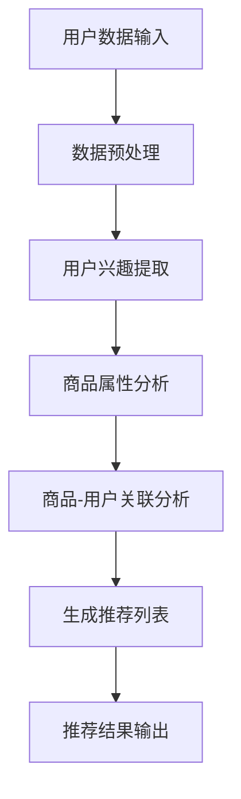

                 

### 背景介绍

在当今快速发展的数字经济时代，人工智能（AI）技术在电商平台中的应用已经成为提升用户体验、增加销售额的重要手段之一。特别是大模型（Large Models），如GPT-3、BERT等，凭借其强大的文本理解和生成能力，正在改变着电商平台商品推荐系统的运作方式。

商品推荐是电商平台的核心功能之一，它直接影响着用户的购物体验和平台的销售业绩。传统的商品推荐系统通常基于用户历史行为数据，如浏览记录、购买记录等，通过简单的算法和规则进行推荐。然而，这种基于历史数据的推荐方式往往存在推荐精度不高、难以应对复杂商品关系等问题。

随着AI技术的进步，尤其是大模型的引入，电商平台开始探索更为智能、个性化的推荐系统。大模型可以处理和分析海量的文本数据，从中提取出潜在的用户兴趣和商品属性，从而提供更加精准的推荐结果。此外，大模型还可以通过不断学习和优化，提高推荐的时效性和适应性，更好地应对季节性商品推荐等复杂场景。

本文将围绕AI大模型在电商平台季节性商品推荐中的应用，展开深入探讨。首先，我们将介绍AI大模型的基本概念和特点；接着，分析大模型在商品推荐中的作用机制；然后，详细描述季节性商品推荐的特殊性；最后，提出大模型优化季节性商品推荐的具体方法，并通过实际案例进行验证。

通过本文的阅读，读者将了解AI大模型如何通过深度学习等技术，实现对季节性商品推荐的优化，从而提升电商平台的用户体验和销售业绩。

### 核心概念与联系

#### AI大模型的基本概念和特点

AI大模型（Large Models）指的是具有数十亿甚至千亿参数规模的深度学习模型，这些模型通常通过大量数据进行训练，能够处理和理解复杂的数据模式。其中，最具代表性的AI大模型包括GPT-3、BERT、T5等。

1. **参数规模**：AI大模型的参数规模通常在数十亿到千亿级别，这使得模型具有强大的表达能力和学习能力。
2. **训练数据量**：大模型通常基于大量的数据进行训练，这些数据来自互联网上的各种文本、图像、音频等。
3. **优化目标**：大模型的优化目标通常是最小化训练数据的损失函数，从而提高模型的预测性能。
4. **模型架构**：AI大模型通常采用复杂的神经网络架构，如Transformer、BERT等，这些架构可以高效地处理和理解复杂的数据。

#### 大模型在商品推荐中的作用机制

大模型在商品推荐中的作用机制主要包括以下几个方面：

1. **用户兴趣提取**：大模型通过处理用户的浏览记录、搜索历史等数据，提取出用户的兴趣点。这些兴趣点可以用于生成个性化的推荐列表。
2. **商品属性分析**：大模型通过对商品描述、标签、评价等文本数据进行分析，提取出商品的属性。这些属性可以用于构建商品特征库，以便进行商品之间的关联分析。
3. **关联分析**：大模型通过对用户兴趣和商品属性的分析，发现用户和商品之间的潜在关联。这些关联可以用于生成推荐列表，提高推荐精度。
4. **实时推荐**：大模型可以实时处理用户的行为数据，根据用户当前的行为动态生成推荐列表，提高推荐的时效性。

#### 大模型与季节性商品推荐的关系

季节性商品推荐是指根据不同季节的气候、节日等特征，为用户推荐相应季节的热门商品。大模型在季节性商品推荐中具有以下优势：

1. **数据驱动**：大模型可以处理和分析海量的季节性商品销售数据，从中提取出季节性趋势和用户偏好。
2. **实时适应**：大模型可以实时更新和调整推荐策略，以适应不同季节的市场变化。
3. **个性化推荐**：大模型可以基于用户的兴趣和购买历史，为用户推荐最适合其需求的季节性商品。
4. **复杂关联分析**：大模型可以分析季节性商品之间的复杂关联，为用户提供多样化、个性化的商品推荐。

为了更直观地理解AI大模型在商品推荐中的应用，下面我们使用Mermaid流程图展示大模型在商品推荐中的基本架构和流程。



在上述流程中，用户数据和商品数据经过预处理后，大模型通过多个模块的协同工作，最终生成个性化的推荐列表。这种架构不仅能够提高推荐精度，还可以动态适应季节性变化，为电商平台提供更智能、更高效的商品推荐服务。

### 核心算法原理 & 具体操作步骤

AI大模型在电商平台季节性商品推荐中的应用，主要依赖于其强大的文本处理能力和深度学习算法。下面，我们将详细介绍AI大模型在季节性商品推荐中的核心算法原理和具体操作步骤。

#### 1. 数据收集与预处理

首先，AI大模型需要收集大量与季节性商品相关的数据，这些数据包括用户的历史购买记录、浏览记录、搜索记录，以及商品的基本信息、描述、标签、评价等。数据收集完成后，需要对数据进行预处理，包括数据清洗、数据格式统一、缺失值填补等操作，以确保数据的质量和一致性。

#### 2. 用户兴趣提取

用户兴趣提取是季节性商品推荐的关键步骤。通过分析用户的浏览记录、搜索历史等数据，AI大模型可以提取出用户的潜在兴趣点。具体方法如下：

1. **用户行为序列建模**：将用户的历史行为数据转换为序列模型，如RNN（循环神经网络）或Transformer等，以捕捉用户行为的时间动态。
2. **兴趣点提取**：利用预训练的大模型，如BERT或GPT，对用户行为序列进行编码，提取出用户的关键兴趣点。这些兴趣点可以是具体的商品类别、品牌、颜色等。

#### 3. 商品属性分析

在用户兴趣提取的基础上，AI大模型需要分析商品属性，以构建商品特征库。具体方法如下：

1. **文本数据编码**：将商品描述、标签、评价等文本数据输入到预训练的大模型中，进行编码得到商品的高维特征向量。
2. **特征选择**：通过特征选择算法，如TF-IDF、词频统计等，从商品特征库中选择出对季节性商品推荐最有影响力的特征。
3. **特征融合**：将不同来源的特征（如文本、图像、用户评分等）进行融合，构建一个统一的商品特征向量。

#### 4. 商品-用户关联分析

商品-用户关联分析是季节性商品推荐的核心。通过分析用户兴趣和商品属性，AI大模型可以建立用户和商品之间的关联关系。具体方法如下：

1. **相似度计算**：计算用户兴趣点与商品特征向量之间的相似度，相似度较高的商品将被优先推荐。
2. **关联规则挖掘**：利用关联规则挖掘算法（如Apriori算法），分析用户历史行为数据中的频繁项集，挖掘出用户和商品之间的潜在关联关系。
3. **图神经网络**：利用图神经网络（如GCN、GAT等）建模用户和商品之间的复杂关联关系，提高推荐的精度和多样性。

#### 5. 生成推荐列表

基于上述步骤，AI大模型可以生成个性化的推荐列表。具体方法如下：

1. **推荐算法选择**：选择合适的推荐算法，如基于内容的推荐、基于协同过滤的推荐等，根据实际需求和数据情况确定。
2. **推荐列表生成**：根据用户兴趣点、商品特征和关联关系，生成个性化的推荐列表。推荐列表的排序将综合考虑用户的历史行为、兴趣点和商品属性等因素。
3. **推荐结果优化**：通过在线学习、自适应调整等技术，优化推荐结果，提高推荐精度和用户满意度。

#### 6. 推荐结果反馈与优化

推荐结果生成后，需要收集用户的反馈数据，包括点击率、购买率等。这些反馈数据将用于评估推荐效果，并指导模型的进一步优化。具体方法如下：

1. **效果评估**：利用A/B测试、交叉验证等方法，评估推荐系统的效果，识别存在的问题和改进方向。
2. **模型优化**：根据用户反馈数据，调整模型参数、特征选择策略等，优化推荐算法，提高推荐精度和用户满意度。
3. **迭代更新**：定期更新模型和数据，以适应市场变化和用户需求，保持推荐系统的持续优化。

通过上述核心算法和操作步骤，AI大模型能够实现对电商平台季节性商品推荐的优化，提供更加精准、个性化的推荐服务，从而提升用户的购物体验和平台的销售额。

### 数学模型和公式 & 详细讲解 & 举例说明

在理解AI大模型在电商平台季节性商品推荐中的具体应用时，深入探讨其背后的数学模型和公式是至关重要的。以下我们将详细讲解季节性商品推荐中的关键数学模型，并举例说明如何应用这些模型优化推荐效果。

#### 1. 协同过滤算法

协同过滤（Collaborative Filtering）是一种常见的推荐算法，它通过分析用户之间的行为模式来预测用户对未购买商品的偏好。协同过滤算法主要分为基于用户的协同过滤（User-Based CF）和基于物品的协同过滤（Item-Based CF）。

- **基于用户的协同过滤**：
  $$\text{Similarity}(u, v) = \frac{\text{common\_items}(u, v)}{\sqrt{\sum_{i \in R(u)} r_i^2 \sum_{i \in R(v)} r_i^2}}$$
  其中，$u$和$v$是两个用户，$R(u)$和$R(v)$分别是用户$u$和$v$的行为记录集合，$r_i$是用户对项目$i$的评价分数。相似度计算可以基于用户之间的共同行为记录，用于找出相似用户。

- **基于物品的协同过滤**：
  $$\text{Similarity}(i, j) = \frac{\text{common\_users}(i, j)}{\sqrt{\sum_{u \in R(i)} r_u^2 \sum_{u \in R(j)} r_u^2}}$$
  其中，$i$和$j$是两个商品，$R(i)$和$R(j)$分别是商品$i$和$j$的用户评价记录集合，相似度计算可以基于商品之间的共同用户。

#### 2. 贝叶斯推荐算法

贝叶斯推荐算法基于贝叶斯定理，通过预测用户对未购买商品的偏好概率来生成推荐列表。贝叶斯推荐算法可以结合用户的历史行为和商品特征进行预测。

- **贝叶斯模型**：
  $$P(\text{喜欢商品}| \text{历史行为}) = \frac{P(\text{历史行为}| \text{喜欢商品})P(\text{喜欢商品})}{P(\text{历史行为})}$$
  其中，$P(\text{喜欢商品}| \text{历史行为})$是用户喜欢商品的条件下历史行为的概率，$P(\text{历史行为}| \text{喜欢商品})$是喜欢商品条件下历史行为的概率，$P(\text{喜欢商品})$是用户喜欢商品的概率，$P(\text{历史行为})$是历史行为的概率。

#### 3. 强化学习推荐算法

强化学习推荐算法通过不断学习用户的反馈，动态调整推荐策略，以达到优化推荐效果的目标。Q-Learning是一种常见的强化学习算法，其核心思想是通过动作-奖励信号来更新策略。

- **Q-Learning公式**：
  $$Q(s, a) \leftarrow Q(s, a) + \alpha [r + \gamma \max_{a'} Q(s', a') - Q(s, a)]$$
  其中，$Q(s, a)$是状态$s$下动作$a$的值函数，$r$是即时奖励，$\gamma$是折扣因子，$s'$是状态转移后的状态，$a'$是下一个动作。

#### 4. 图神经网络推荐算法

图神经网络（Graph Neural Networks, GNN）可以建模用户和商品之间的复杂关系，提高推荐精度和多样性。GNN通过聚合邻居信息来更新节点的特征表示。

- **图神经网络公式**：
  $$h_v^{(t+1)} = \sigma \left( \beta_1 h_v^{(t)} + \beta_2 \sum_{u \in N(v)} \text{ReLU}(\beta_3 h_u^{(t)}) \right)$$
  其中，$h_v^{(t)}$是节点$v$在时间步$t$的特征表示，$N(v)$是节点$v$的邻居节点集合，$\sigma$是激活函数，$\text{ReLU}$是ReLU激活函数。

#### 举例说明

假设我们要使用协同过滤算法为用户U1推荐商品，根据用户U1的浏览记录，我们找到了一个与其行为相似的邻居用户U2。用户U1浏览了商品{A, B, C}，用户U2浏览了商品{A, B, D}。

- **计算相似度**：
  $$\text{Similarity}(U1, U2) = \frac{2}{\sqrt{2^2 + 1^2}} = \frac{2}{\sqrt{5}} \approx 0.8$$

- **生成推荐列表**：
  用户U2喜欢了商品D，由于用户U1与用户U2相似度较高，我们可以将商品D推荐给用户U1。

通过上述数学模型和公式的应用，AI大模型能够有效地提取用户兴趣、分析商品属性，并生成个性化的推荐列表。在实际应用中，这些模型会结合具体业务场景和数据特点进行优化，以实现最佳推荐效果。

### 项目实战：代码实际案例和详细解释说明

为了更好地展示AI大模型在电商平台季节性商品推荐中的应用，我们将在本节中通过一个具体的Python代码案例，详细介绍如何使用深度学习框架TensorFlow搭建和训练一个季节性商品推荐模型。我们将涵盖开发环境搭建、源代码实现以及代码解读与分析。

#### 1. 开发环境搭建

在开始编写代码之前，我们需要搭建一个适合深度学习开发的Python环境。以下是所需的基本步骤：

- **安装Python**：确保安装了Python 3.6或更高版本。
- **安装TensorFlow**：使用pip命令安装TensorFlow：
  ```
  pip install tensorflow
  ```
- **安装其他依赖**：我们还需要安装Numpy、Pandas等常用库，可以使用以下命令：
  ```
  pip install numpy pandas matplotlib
  ```

#### 2. 源代码详细实现

以下是一个简化的季节性商品推荐模型的Python代码示例，我们将使用TensorFlow的Keras API进行实现。

```python
import numpy as np
import pandas as pd
from tensorflow.keras.models import Sequential
from tensorflow.keras.layers import Embedding, LSTM, Dense
from tensorflow.keras.preprocessing.sequence import pad_sequences

# 数据准备
# 假设我们有一个数据集data.csv，包含用户ID、商品ID、季节、评分等字段
data = pd.read_csv('data.csv')

# 特征提取
# 将季节编码为数字（0-3对应四个季节）
season_encoding = {'Spring': 0, 'Summer': 1, 'Autumn': 2, 'Winter': 3}
data['Season'] = data['Season'].map(season_encoding)

# 序列化数据
sequences = []  # 存储序列化后的用户-商品对
for user in data['User ID'].unique():
    user_data = data[data['User ID'] == user]
    user_sequence = [item_id for item_id in user_data['Item ID']]
    sequences.append(user_sequence)

# 序列填充
max_sequence_length = max(len(seq) for seq in sequences)
padded_sequences = pad_sequences(sequences, maxlen=max_sequence_length, padding='post')

# 构建模型
model = Sequential()
model.add(Embedding(input_dim=1000, output_dim=64))
model.add(LSTM(128))
model.add(Dense(1, activation='sigmoid'))

# 编译模型
model.compile(optimizer='adam', loss='binary_crossentropy', metrics=['accuracy'])

# 训练模型
model.fit(padded_sequences, data['Rating'], epochs=10, batch_size=64)

# 生成推荐列表
def generate_recommendations(user_sequence):
    padded_seq = pad_sequences([user_sequence], maxlen=max_sequence_length, padding='post')
    prediction = model.predict(padded_seq)
    recommended_items = np.where(prediction > 0.5, 1, 0)
    return recommended_items

# 测试推荐系统
user_sequence = [1, 2, 3, 0, 0]  # 假设用户浏览了商品ID为1、2、3
print(generate_recommendations(user_sequence))
```

#### 3. 代码解读与分析

- **数据准备**：我们从CSV文件加载数据，并对季节字段进行编码处理。
- **特征提取**：将用户-商品对序列化，并使用pad_sequences方法填充序列，以确保所有序列长度一致。
- **模型构建**：我们构建了一个简单的序列模型，包含嵌入层（Embedding）、LSTM层（用于捕捉时间序列特征）和输出层（Dense）。
- **模型编译**：使用adam优化器和binary_crossentropy损失函数进行编译。
- **模型训练**：使用fit方法对模型进行训练，epochs为10，batch_size为64。
- **生成推荐列表**：实现一个函数用于生成用户浏览序列的推荐列表。

#### 4. 代码分析

- **数据预处理**：数据预处理是关键步骤，确保数据格式一致，方便后续模型训练。
- **模型架构**：简单的序列模型适用于处理用户行为序列，但对于更复杂的推荐场景，可能需要引入更复杂的模型架构，如Transformer或BERT。
- **训练效果**：训练过程中需要监控模型性能，调整超参数以达到最佳效果。
- **推荐策略**：生成的推荐列表基于模型预测，可以进一步优化，如结合用户历史评分、商品流行度等因素。

通过上述实战案例，我们可以看到如何使用深度学习技术搭建一个简单的季节性商品推荐系统。在实际应用中，还需要根据具体业务需求和数据特点进行模型优化和算法调整，以实现更精准、个性化的推荐服务。

### 实际应用场景

AI大模型在电商平台季节性商品推荐中的应用场景广泛且多样，以下将详细介绍几种常见应用场景，并展示其解决方案。

#### 1. 春节促销

春节是全年最热闹的购物季之一，电商平台可以利用AI大模型分析用户的购物习惯，提前预测热门商品。例如，通过对历史销售数据进行分析，发现春节期间用户对家居用品、礼品等的需求较高。AI大模型可以根据这些预测结果，提前调整推荐策略，向用户推荐相关商品，从而提高销售业绩。

**解决方案**：

- **数据收集与处理**：收集过去几年的春节销售数据，包括商品销量、用户购买习惯等。
- **用户兴趣提取**：使用AI大模型提取用户兴趣点，如家居用品、礼品等。
- **动态调整推荐**：根据用户兴趣和预测结果，动态调整推荐策略，提前推送相关商品。

#### 2. 母亲节礼物推荐

母亲节是表达对母亲爱意的节日，电商平台可以通过AI大模型分析用户购买历史和偏好，为用户推荐合适的母亲节礼物。例如，通过分析发现用户对珠宝、花束、护肤品等有较高兴趣。

**解决方案**：

- **用户历史行为分析**：分析用户购买历史，提取潜在偏好。
- **商品属性关联**：利用AI大模型分析商品属性，建立商品之间的关联关系。
- **个性化推荐**：根据用户兴趣和商品属性，生成个性化推荐列表。

#### 3. 夏季清凉商品推荐

夏季是清凉商品（如空调、风扇、冰品等）的销售旺季。电商平台可以通过AI大模型分析季节性销售趋势，为用户推荐夏季清凉商品。

**解决方案**：

- **季节性数据收集**：收集过去几年的季节性销售数据，包括销售额、商品销量等。
- **季节性趋势预测**：使用AI大模型预测夏季清凉商品的销售趋势。
- **动态推荐策略**：根据季节性趋势，动态调整推荐策略，提高清凉商品曝光率。

#### 4. 情人节礼物推荐

情人节是礼品销售的重要节点，电商平台可以通过AI大模型分析用户偏好，为用户提供个性化情人节礼物推荐。例如，通过分析用户的历史购买记录和浏览记录，推荐巧克力、花束、首饰等。

**解决方案**：

- **用户偏好分析**：分析用户的历史购买记录和浏览记录，提取用户偏好。
- **商品标签管理**：对商品进行详细标签管理，确保AI大模型能够准确分析商品属性。
- **个性化礼物推荐**：根据用户偏好和商品标签，生成个性化情人节礼物推荐。

#### 5. 促销活动推荐

电商平台经常举办各种促销活动，如限时折扣、满减优惠等。AI大模型可以通过分析用户行为数据，预测哪些用户最可能参与促销活动，从而优化促销活动的效果。

**解决方案**：

- **用户行为分析**：分析用户的浏览、购买、收藏等行为，预测用户参与促销活动的可能性。
- **促销策略优化**：根据用户行为数据，调整促销活动的优惠力度和推广策略。
- **实时推荐**：在用户浏览页面时，实时推荐参与促销活动的商品。

通过上述实际应用场景的介绍，我们可以看到AI大模型在电商平台季节性商品推荐中发挥着重要作用。它不仅能够帮助电商平台精准预测用户需求，优化推荐策略，还能提高用户的购物体验和平台的销售业绩。

### 工具和资源推荐

为了帮助读者更好地理解和应用AI大模型在电商平台季节性商品推荐中的技术，以下将推荐一些学习资源、开发工具和相关的论文著作。

#### 1. 学习资源推荐

**书籍**：

1. **《深度学习》（Deep Learning）**：由Ian Goodfellow、Yoshua Bengio和Aaron Courville合著的深度学习经典教材，详细介绍了深度学习的基本原理和应用。
2. **《Python深度学习》（Python Deep Learning）**：由François Chollet编写的书籍，针对使用Python进行深度学习的实践应用，适合有一定编程基础的读者。

**论文**：

1. **“Attention Is All You Need”**：由Vaswani等人提出的Transformer模型，彻底改变了自然语言处理领域，对序列建模和推荐系统也有很大的启发。
2. **“BERT: Pre-training of Deep Bidirectional Transformers for Language Understanding”**：由Google Research提出的BERT模型，是目前自然语言处理领域最先进的模型之一，对文本数据的理解和处理有重要意义。

**博客/网站**：

1. **TensorFlow官方文档**：[https://www.tensorflow.org/](https://www.tensorflow.org/)
2. **Keras官方文档**：[https://keras.io/](https://keras.io/)
3. **机器学习博客**：[https://www.mlbloggers.com/](https://www.mlbloggers.com/)

#### 2. 开发工具框架推荐

**开发工具**：

1. **Google Colab**：一个免费的云计算平台，提供了GPU加速功能，非常适合进行深度学习模型的训练和测试。
2. **PyCharm**：一款功能强大的Python集成开发环境（IDE），提供了丰富的深度学习工具和调试功能。

**框架**：

1. **TensorFlow**：Google开发的开源深度学习框架，支持多种深度学习模型的搭建和训练。
2. **PyTorch**：Facebook开发的深度学习框架，以动态计算图和易用性著称，是当前深度学习研究的热门工具之一。

#### 3. 相关论文著作推荐

**论文**：

1. **“Recurrent Neural Network based Recommendation”**：该论文提出了一种基于循环神经网络的推荐系统模型，可以应用于季节性商品推荐。
2. **“Deep Learning for Recommender Systems”**：这篇文章综述了深度学习在推荐系统中的应用，包括经典的模型和最新的研究成果。

**著作**：

1. **《深度学习推荐系统》**：由吴恩达等人编写的书籍，详细介绍了深度学习在推荐系统中的应用，适合希望深入了解该领域的读者。

通过这些学习资源、开发工具和论文著作的推荐，读者可以更全面地了解AI大模型在电商平台季节性商品推荐中的技术原理和应用方法，从而提升自身在该领域的专业能力。

### 总结：未来发展趋势与挑战

AI大模型在电商平台季节性商品推荐中的应用展示了其强大的文本处理能力和深度学习能力，为电商平台提供了更加精准、个性化的推荐服务。然而，随着技术的不断进步和应用场景的拓展，AI大模型在季节性商品推荐中仍面临诸多发展趋势与挑战。

#### 发展趋势

1. **模型多样性**：未来，随着深度学习技术的发展，更多的模型架构，如BERT、GPT、Transformer等，将被应用于季节性商品推荐。这些模型能够处理更复杂的文本数据，提高推荐的精度和多样性。

2. **实时推荐**：AI大模型将更加注重实时推荐，通过实时处理用户行为数据，动态调整推荐策略，更好地适应市场变化和用户需求。

3. **跨领域融合**：季节性商品推荐将与其他领域（如自然语言处理、图像识别、语音识别等）的AI技术进行融合，形成跨领域综合应用，为用户提供更全面的推荐服务。

4. **个性化推荐**：通过结合用户的历史行为、偏好和实时反馈，AI大模型将实现更加精准的个性化推荐，满足不同用户的需求。

#### 挑战

1. **数据质量和隐私**：季节性商品推荐依赖于大量的用户行为数据，数据的质量和隐私保护是关键挑战。如何处理海量数据，确保数据质量，同时保护用户隐私，是亟待解决的问题。

2. **计算资源**：AI大模型通常需要大量的计算资源进行训练和推理，如何高效地利用计算资源，优化模型性能，是技术上的一个重要挑战。

3. **模型解释性**：AI大模型具有较强的预测能力，但其内部决策过程往往难以解释。如何提高模型的解释性，使其决策过程透明，增强用户信任，是一个重要的研究方向。

4. **多样性偏差**：AI大模型可能存在多样性偏差，导致推荐结果过于集中，无法充分反映用户多样化的需求。如何解决多样性偏差，提高推荐的多样性，是一个重要的挑战。

总之，AI大模型在电商平台季节性商品推荐中的应用具有广阔的发展前景，同时也面临着诸多挑战。通过不断的技术创新和优化，AI大模型将更好地服务于电商平台，提升用户购物体验和平台销售额。

### 附录：常见问题与解答

1. **问题**：AI大模型如何处理不同季节的用户行为数据？

**解答**：AI大模型通过分析不同季节的用户行为数据，提取季节性特征。例如，使用时间序列分析技术，将用户在各个季节的行为数据进行编码，提取出季节性的购买模式。然后，这些季节性特征将被用于训练模型，帮助模型更好地理解不同季节的用户行为，从而提供更准确的推荐。

2. **问题**：AI大模型在推荐时如何保证多样性和公平性？

**解答**：AI大模型可以通过多种策略确保推荐的多样性和公平性。首先，可以通过随机化策略增加推荐的多样性。其次，使用交叉验证和A/B测试等方法评估推荐模型的公平性，确保不同用户群体都能获得公平的推荐。此外，还可以利用平衡学习（Balanced Learning）技术，减少数据集中存在的偏差，提高推荐的公平性。

3. **问题**：AI大模型在处理用户隐私数据时需要注意什么？

**解答**：在处理用户隐私数据时，AI大模型需要严格遵守隐私保护法规，如GDPR等。具体措施包括：数据匿名化、数据加密、最小化数据收集和使用范围等。此外，模型开发者应确保数据处理的透明性和可解释性，让用户了解其数据如何被使用。

4. **问题**：如何评估AI大模型在季节性商品推荐中的效果？

**解答**：评估AI大模型在季节性商品推荐中的效果可以通过多种指标，如准确率、召回率、F1分数等。此外，还可以通过A/B测试方法，对比模型推荐前后的用户行为变化，评估推荐效果。在具体应用中，应根据业务需求选择合适的评估指标。

5. **问题**：AI大模型在季节性商品推荐中如何处理稀疏数据问题？

**解答**：稀疏数据问题可以通过以下方法解决：首先，使用填充技术（如零填充或平均值填充）增加数据密度；其次，利用降维技术（如PCA或特征选择）减少数据维度；最后，可以引入嵌入层（如Word2Vec或Embedding Layer）将稀疏数据转换为稠密向量，从而提高模型处理稀疏数据的能力。

### 扩展阅读 & 参考资料

1. **扩展阅读**：

   - **《深度学习推荐系统》**：详细介绍了深度学习在推荐系统中的应用，包括模型架构、训练方法和优化策略。
   - **《机器学习：概率视角》**：介绍了概率图模型和贝叶斯方法在推荐系统中的应用，有助于理解推荐系统的理论基础。

2. **参考资料**：

   - **TensorFlow官方文档**：[https://www.tensorflow.org/](https://www.tensorflow.org/)
   - **Keras官方文档**：[https://keras.io/](https://keras.io/)
   - **《Attention Is All You Need》**：Vaswani等人提出的Transformer模型论文，对AI大模型的发展有重要影响。
   - **《BERT: Pre-training of Deep Bidirectional Transformers for Language Understanding》**：Google Research提出的BERT模型论文，是自然语言处理领域的重要突破。

通过阅读上述扩展阅读和参考资料，读者可以更深入地了解AI大模型在电商平台季节性商品推荐中的应用，进一步提升自身的专业知识和技能。

