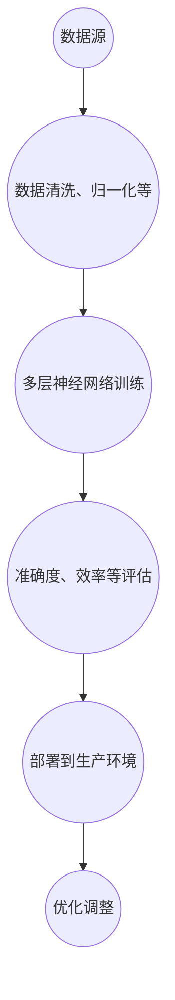

                 

### 背景介绍

在当今数字化时代，人工智能（AI）技术已经成为推动社会进步和经济发展的核心动力。特别是在大模型（Large-scale Model）领域，AI大模型的发展更是令人瞩目。从早期的简单模型到如今能够处理复杂数据集的强大模型，AI大模型不仅在学术界取得了一系列重要突破，也在工业界得到了广泛的应用。

本文旨在探讨AI大模型在数字化转型中的路径。数字化转型是指利用数字技术和方法来改变组织、流程、服务和商业模式的过程。在这个过程中，AI大模型作为一种强大的工具，正扮演着越来越重要的角色。通过AI大模型的应用，企业可以实现自动化、智能化和个性化，从而提高效率和竞争力。

本文将首先介绍AI大模型的基本概念和当前发展趋势，然后分析其在数字化转型中的应用场景和优势，最后探讨未来的发展趋势和挑战。

### 1.1 AI大模型的基本概念和发展趋势

AI大模型是指具有大规模参数和复杂结构的深度学习模型。这些模型通常基于神经网络架构，能够处理海量的数据并从中学习到有价值的信息。例如，自然语言处理（NLP）领域的Transformer模型，图像识别领域的卷积神经网络（CNN）等，都是典型的AI大模型。

近年来，AI大模型的发展呈现出以下几个趋势：

1. **模型规模不断扩大**：随着计算能力的提升和数据量的增加，AI大模型的规模也在不断扩展。例如，GPT-3拥有超过1750亿个参数，是当前最大的自然语言处理模型。

2. **模型架构不断创新**：为了更好地处理复杂数据和任务，研究人员不断创新模型架构。例如，Transformer架构的提出，使得模型在序列数据处理方面表现出色。

3. **多模态数据处理能力增强**：AI大模型不仅能够处理单一模态的数据（如图像、文本），还能够融合多种模态的数据，从而提升模型的性能和应用范围。

4. **预训练和微调技术成熟**：通过预训练技术，AI大模型可以在大规模数据集上进行训练，然后通过微调技术适应特定任务的需求。这种技术使得模型的训练效率大大提高。

### 1.2 AI大模型在数字化转型中的应用场景和优势

数字化转型中的关键挑战在于如何利用数据和技术来提高效率和创新能力。AI大模型的应用，为这些挑战的解决提供了新的路径：

1. **数据分析与预测**：AI大模型可以处理海量数据，从中提取有价值的信息并进行预测。例如，在金融领域，大模型可以用于股票市场预测、信用评分等。

2. **智能推荐系统**：在电子商务和媒体领域，AI大模型可以分析用户行为和偏好，提供个性化的推荐服务。例如，Netflix和Amazon等平台都广泛应用了基于大模型的推荐系统。

3. **自然语言处理**：在客户服务、文档处理等领域，AI大模型可以自动处理大量的文本数据，提高工作效率。例如，智能客服机器人、自动翻译服务等。

4. **图像和视频分析**：在安防监控、医疗诊断等领域，AI大模型可以对图像和视频进行分析，实现自动化检测和识别。例如，人脸识别、疾病诊断等。

AI大模型在数字化转型中的优势主要体现在以下几个方面：

1. **提高效率**：AI大模型可以自动化处理大量的重复性任务，提高工作效率。

2. **增强决策能力**：通过数据分析和预测，AI大模型可以帮助企业做出更明智的决策。

3. **降低成本**：通过自动化和智能化，企业可以减少对人工的依赖，降低运营成本。

4. **提高用户体验**：AI大模型可以提供个性化的服务，提升用户体验。

### 1.3 AI大模型在数字化转型中的挑战

虽然AI大模型在数字化转型中具有巨大的潜力，但同时也面临一些挑战：

1. **数据隐私和安全**：大量数据的处理和应用，涉及到数据隐私和安全问题。如何在保障用户隐私的同时，充分利用数据的价值，是一个重要的挑战。

2. **算法公平性和透明度**：AI大模型可能会存在算法偏见和不公平现象，如何在确保算法透明和公平的同时，提高模型的性能，是另一个挑战。

3. **计算资源和能耗**：AI大模型通常需要大量的计算资源和能耗。如何优化模型结构和训练过程，降低计算成本和能耗，是一个重要的课题。

4. **技能和人才短缺**：AI大模型的应用需要专业的技术人才。然而，目前全球范围内，具有AI大模型相关技能的人才相对短缺，如何培养和吸引这些人才，是一个重要的挑战。

在下一部分，我们将深入探讨AI大模型的核心概念和原理，以及其与数字化转型之间的联系。让我们继续分析，了解更多关于AI大模型的细节。接下来，我们将绘制一个Mermaid流程图，展示AI大模型的基本原理和架构。 <!-- msh -->

## 2. 核心概念与联系

在探讨AI大模型在数字化转型中的作用之前，我们需要首先理解其核心概念和原理。AI大模型通常基于深度学习的理念，通过多层神经网络结构对大量数据进行训练，从而实现自动化的任务处理和决策支持。为了更好地理解这些概念，我们将通过一个Mermaid流程图来展示AI大模型的基本原理和架构。

### 2.1 Mermaid流程图

以下是一个Mermaid流程图，描述了AI大模型的核心概念和基本架构：



在这个流程图中：

- **数据收集（A）**：AI大模型的训练首先需要大量的数据。这些数据可以来自企业的内部数据库、第三方数据提供商或公开的数据集。

- **数据预处理（B）**：收集到的数据通常需要进行清洗、归一化等预处理操作，以确保数据的质量和一致性。

- **模型训练（C）**：预处理后的数据被输入到多层神经网络中进行训练。这个阶段需要配置合适的神经网络结构、损失函数、优化器等。

- **模型评估（D）**：在训练过程中，模型的性能需要通过多个指标进行评估，如准确率、召回率、F1分数等。

- **应用部署（E）**：经过训练和评估，模型被部署到实际应用场景中，如推荐系统、智能客服等。

- **用户反馈（F）**：部署后的模型需要根据用户的反馈进行持续优化和调整。

### 2.2 AI大模型的核心概念

以下是对AI大模型核心概念的详细解释：

1. **深度学习**：深度学习是人工智能的一个分支，通过构建多层神经网络来模拟人脑的学习机制。这些神经网络通过逐层提取特征，实现对复杂数据的处理。

2. **神经网络**：神经网络是由大量简单节点（即神经元）组成的网络。每个神经元接收多个输入信号，通过激活函数进行处理，然后产生输出信号。

3. **激活函数**：激活函数是神经网络中用来确定神经元是否被激活的关键部分。常见的激活函数包括Sigmoid、ReLU和Tanh等。

4. **反向传播**：反向传播算法是训练神经网络的常用方法。通过反向传播，模型能够不断调整权重和偏置，以最小化预测误差。

5. **损失函数**：损失函数用于衡量模型预测值与真实值之间的差距。常见的损失函数包括均方误差（MSE）、交叉熵（Cross Entropy）等。

6. **优化器**：优化器用于调整模型参数，以最小化损失函数。常见的优化器包括随机梯度下降（SGD）、Adam等。

### 2.3 AI大模型与数字化转型的关系

AI大模型在数字化转型中的应用，主要体现在以下几个方面：

1. **自动化与智能化**：AI大模型能够自动处理大量的重复性任务，提高工作效率。例如，自动化数据分析、预测和决策等。

2. **数据驱动**：数字化转型需要依赖于数据。AI大模型通过对大量数据的处理和分析，为企业提供了数据驱动的决策支持。

3. **个性化服务**：AI大模型能够分析用户行为和偏好，提供个性化的服务。例如，个性化推荐、智能客服等。

4. **业务流程优化**：AI大模型可以优化企业的业务流程，提高运营效率。例如，自动化生产流程、供应链管理优化等。

5. **风险控制**：AI大模型可以用于风险控制和预测。例如，金融风险预测、信用评分等。

通过上述核心概念和原理的介绍，我们可以更好地理解AI大模型在数字化转型中的作用。在下一部分，我们将深入探讨AI大模型的具体算法原理和操作步骤，以便更深入地理解其技术细节。<!-- msh -->

## 3. 核心算法原理 & 具体操作步骤

在了解了AI大模型的基本概念和架构后，接下来我们将深入探讨其核心算法原理和具体操作步骤。AI大模型的训练通常涉及以下关键环节：数据预处理、模型构建、模型训练和模型评估。以下是这些环节的具体描述和操作步骤。

### 3.1 数据预处理

数据预处理是AI大模型训练的第一步，其目的是提高数据质量，为后续的模型训练做好准备。主要操作步骤如下：

1. **数据收集**：从企业内部数据库、第三方数据提供商或公开数据集中收集大量数据。

2. **数据清洗**：处理数据中的噪声、缺失值和异常值。例如，去除重复数据、填补缺失值、修正错误数据等。

3. **数据归一化**：将数据缩放到一个统一的范围内，例如将所有数值缩放到[0, 1]或[-1, 1]之间。常用的归一化方法包括最小-最大缩放和Z-score标准化。

4. **特征工程**：根据业务需求，提取和构造新的特征。例如，时间序列数据中，可以提取趋势、季节性等特征。

5. **数据分批次处理**：将数据分成多个批次，以便在训练过程中逐批次处理，提高训练效率。

### 3.2 模型构建

在数据预处理完成后，接下来是模型构建阶段。模型构建包括选择合适的神经网络架构、配置模型参数等。以下是具体步骤：

1. **选择神经网络架构**：根据任务需求，选择合适的神经网络架构。常见的架构包括卷积神经网络（CNN）、循环神经网络（RNN）、Transformer等。

2. **配置模型参数**：配置模型的层数、神经元数量、激活函数、损失函数、优化器等。这些参数的选择对模型的性能有重要影响。

3. **定义模型结构**：使用深度学习框架（如TensorFlow、PyTorch等）定义模型结构。例如，在PyTorch中，可以使用`torch.nn.Module`类定义模型。

4. **初始化模型权重**：初始化模型权重和偏置，常用的初始化方法包括高斯初始化、均匀初始化等。

### 3.3 模型训练

模型训练是AI大模型训练的核心环节，其目标是调整模型参数，使得模型在训练数据上取得良好的性能。以下是模型训练的具体步骤：

1. **前向传播**：将预处理后的数据输入到模型中，计算模型的预测输出。

2. **计算损失**：使用损失函数计算模型预测输出与真实输出之间的差距。

3. **反向传播**：通过反向传播算法，将损失函数的梯度反向传播到模型参数，并更新模型参数。

4. **优化参数**：使用优化器更新模型参数，以最小化损失函数。

5. **迭代训练**：重复前向传播、计算损失和反向传播的过程，直到模型达到预定的训练轮数或性能目标。

### 3.4 模型评估

在模型训练完成后，我们需要对模型进行评估，以判断其性能是否达到预期。以下是模型评估的具体步骤：

1. **测试集评估**：将模型在测试集上评估，测试集是与训练集分开的数据集，用于评估模型的泛化能力。

2. **性能指标**：根据任务类型，选择合适的性能指标进行评估。例如，对于分类任务，可以使用准确率、召回率、F1分数等；对于回归任务，可以使用均方误差（MSE）等。

3. **模型调优**：根据评估结果，对模型进行调整和优化，以提高性能。例如，调整学习率、增加训练轮数、调整模型参数等。

4. **模型部署**：将经过评估和调优的模型部署到生产环境中，用于实际应用。

通过上述操作步骤，我们可以构建和训练一个AI大模型，并对其进行评估和优化。在下一部分，我们将详细介绍AI大模型所使用的数学模型和公式，以及如何通过这些数学工具来理解和分析模型的性能。<!-- msh -->

## 4. 数学模型和公式 & 详细讲解 & 举例说明

在深入探讨AI大模型时，了解其背后的数学模型和公式至关重要。这些数学工具不仅帮助我们理解和分析模型的性能，还可以指导我们在实际应用中优化模型。以下是AI大模型中使用的主要数学模型和公式，以及它们的详细讲解和举例说明。

### 4.1 神经网络中的基本数学模型

神经网络的数学模型主要基于线性代数和概率统计。以下是几个关键组成部分：

#### 4.1.1 矩阵与向量操作

在神经网络中，矩阵和向量操作是基础。以下是几个常用的矩阵和向量操作：

- **矩阵乘法**：两个矩阵相乘得到一个新的矩阵。例如，给定矩阵A和B，其乘积C = A * B。
- **向量加法**：两个向量对应元素相加得到一个新的向量。例如，给定向量x和y，其和z = x + y。
- **向量点积**：两个向量对应元素相乘后相加得到一个标量。例如，给定向量x和y，其点积s = x · y。

#### 4.1.2 激活函数

激活函数是神经网络中的一个关键组件，用于引入非线性。以下是几个常用的激活函数：

- **Sigmoid函数**：\( f(x) = \frac{1}{1 + e^{-x}} \)
  - **解释**：将输入值映射到[0, 1]范围内。
  - **例子**：\( f(2) = \frac{1}{1 + e^{-2}} \approx 0.865 \)

- **ReLU函数**：\( f(x) = \max(0, x) \)
  - **解释**：当输入为负时，输出为0；当输入为正时，输出等于输入。
  - **例子**：\( f(-1) = 0 \)，\( f(2) = 2 \)

- **Tanh函数**：\( f(x) = \frac{e^x - e^{-x}}{e^x + e^{-x}} \)
  - **解释**：将输入值映射到[-1, 1]范围内。
  - **例子**：\( f(2) = \frac{e^2 - e^{-2}}{e^2 + e^{-2}} \approx 0.96 \)

#### 4.1.3 损失函数

损失函数用于衡量模型预测值与真实值之间的差距。以下是几个常用的损失函数：

- **均方误差（MSE）**：\( \text{MSE} = \frac{1}{n} \sum_{i=1}^{n} (y_i - \hat{y}_i)^2 \)
  - **解释**：用于回归任务，计算预测值与真实值之间的平均平方误差。
  - **例子**：给定预测值\[1.2, 2.3\]和真实值\[1.0, 2.0\]，\( \text{MSE} = \frac{1}{2} ((1.0 - 1.2)^2 + (2.0 - 2.3)^2) \approx 0.15 \)

- **交叉熵（Cross Entropy）**：\( \text{CE} = -\frac{1}{n} \sum_{i=1}^{n} y_i \log(\hat{y}_i) \)
  - **解释**：用于分类任务，计算预测概率与真实概率之间的交叉熵。
  - **例子**：给定预测概率\[0.7, 0.3\]和真实标签\[1, 0\]，\( \text{CE} = -\frac{1}{2} (1 \log(0.7) + 0 \log(0.3)) \approx 0.356 \)

### 4.2 反向传播算法

反向传播算法是神经网络训练的核心，用于更新模型参数。以下是反向传播算法的基本步骤：

1. **前向传播**：将输入数据传递到神经网络，计算输出值和损失。
2. **计算梯度**：计算损失相对于每个参数的梯度。
3. **反向传播**：将梯度反向传递到网络的每一层，更新模型参数。
4. **优化参数**：使用优化器更新模型参数，以最小化损失。

反向传播算法的数学公式如下：

- **前向传播**：\( \hat{y} = \sigma(W \cdot z + b) \)
  - 其中，\( \sigma \)是激活函数，\( W \)是权重矩阵，\( z \)是输入值，\( b \)是偏置。

- **计算梯度**：\( \frac{\partial L}{\partial W} = \frac{\partial L}{\partial \hat{y}} \frac{\partial \hat{y}}{\partial z} \frac{\partial z}{\partial W} \)
  - 其中，\( L \)是损失函数，\( \hat{y} \)是输出值，\( z \)是中间层值，\( \frac{\partial L}{\partial W} \)是权重矩阵的梯度。

- **反向传播**：将梯度反向传递到网络的每一层，计算每一层的梯度。
  - \( \frac{\partial z}{\partial W} = \frac{\partial \hat{y}}{\partial z} \cdot \frac{\partial z}{\partial a} \)
    - 其中，\( \frac{\partial z}{\partial a} \)是激活函数的梯度。

### 4.3 优化器

优化器用于更新模型参数，以最小化损失函数。以下是几种常用的优化器：

- **随机梯度下降（SGD）**：每次迭代只更新一个样本的参数，计算整个数据集的平均梯度。
  - **公式**：\( W_{\text{new}} = W_{\text{old}} - \alpha \frac{\partial L}{\partial W} \)
    - 其中，\( \alpha \)是学习率。

- **Adam优化器**：结合了SGD和动量方法，同时考虑一阶和二阶矩估计，收敛速度更快。
  - **公式**：
    \[
    m_t = \beta_1 m_{t-1} + (1 - \beta_1) \frac{\partial L}{\partial W}_t
    \]
    \[
    v_t = \beta_2 v_{t-1} + (1 - \beta_2) \left( \frac{\partial L}{\partial W}_t \right)^2
    \]
    \[
    W_{\text{new}} = W_{\text{old}} - \alpha \frac{m_t}{\sqrt{v_t} + \epsilon}
    \]
    - 其中，\( \beta_1 \)，\( \beta_2 \)是动量参数，\( \epsilon \)是微小常数。

通过这些数学模型和公式，我们可以更深入地理解AI大模型的工作原理和性能分析。在实际应用中，这些数学工具帮助我们优化模型参数，提高模型的性能和泛化能力。在下一部分，我们将通过一个具体的代码案例，展示如何使用这些数学模型实现AI大模型的训练和评估。<!-- msh -->

### 5. 项目实战：代码实际案例和详细解释说明

在本部分，我们将通过一个具体的项目案例，详细讲解如何使用Python和深度学习框架PyTorch实现一个AI大模型的训练和评估。我们将构建一个简单的自然语言处理（NLP）任务，即情感分析，用于判断一段文本的情感倾向（正面或负面）。

#### 5.1 开发环境搭建

在开始编写代码之前，我们需要搭建一个合适的开发环境。以下是在Python中搭建PyTorch开发环境的基本步骤：

1. **安装Python**：确保安装了Python 3.x版本，推荐使用Anaconda进行环境管理。
2. **安装PyTorch**：使用以下命令安装PyTorch：

   ```bash
   pip install torch torchvision
   ```

   或者，根据你的计算资源和需求，可以选择安装特定版本的PyTorch。

3. **验证安装**：运行以下Python代码，检查PyTorch是否安装成功：

   ```python
   import torch
   print(torch.__version__)
   ```

   如果看到版本号输出，说明PyTorch已成功安装。

#### 5.2 源代码详细实现和代码解读

以下是实现情感分析的完整源代码，我们将其分为几个主要部分进行解读。

##### 5.2.1 数据准备

```python
import torch
from torchtext.datasets import IMDB
from torchtext.data import Field, Batch, Iterator

# 加载IMDB数据集
train_data, test_data = IMDB()

# 定义词汇字段
TEXT = Field(tokenize='spacy', lower=True, include_lengths=True)
LABEL = Field(sequential=False)

# 分词和处理文本
train_data, test_data = TEXT.split(train_data), TEXT.split(test_data)
TEXT.build_vocab(train_data, max_size=25000, vectors="glove.6B.100d")
LABEL.build_vocab(train_data)

# 将数据转换为PyTorch张量
train_data, test_data = Batch.from_attributes(train_data, LABEL["train"]), Batch.from_attributes(test_data, LABEL["test"])
```

- **数据集加载**：我们使用torchtext的IMDB数据集，它包含了50000条电影评论，分为训练集和测试集。
- **字段定义**：`TEXT`字段用于处理文本，包括分词、小写化等操作；`LABEL`字段用于处理标签，不涉及序列操作。
- **词汇构建**：我们使用torchtext的Vocab类构建词汇表，同时加载预训练的GloVe词向量。

##### 5.2.2 模型定义

```python
import torch.nn as nn

class RNNModel(nn.Module):
    def __init__(self, input_dim, embedding_dim, hidden_dim, output_dim, n_layers=1, drop_out=0.5):
        super().__init__()
        self.embedding = nn.Embedding(input_dim, embedding_dim)
        self.rnn = nn.LSTM(embedding_dim, hidden_dim, n_layers, dropout=drop_out)
        self.fc = nn.Linear(hidden_dim, output_dim)
        self.dropout = nn.Dropout(drop_out)
        
    def forward(self, text, text_lengths):
        embedded = self.dropout(self.embedding(text))
        packed_embedded = nn.utils.rnn.pack_padded_sequence(embedded, text_lengths, batch_first=True)
        packed_output, (hidden, cell) = self.rnn(packed_embedded)
        hidden = self.dropout(torch.cat((hidden[-2,:,:], hidden[-1,:,:]), dim=1))
        return self.fc(hidden.squeeze(0))
```

- **模型架构**：我们定义了一个基于RNN的简单模型，包括嵌入层（Embedding）、RNN层（LSTM）和全连接层（FC）。
- **前向传播**：在模型的前向传播过程中，我们首先对输入文本进行嵌入处理，然后通过RNN层提取特征，最后通过全连接层进行分类预测。

##### 5.2.3 训练和评估

```python
import torch.optim as optim

# 模型实例化
model = RNNModel(len(TEXT.vocab), 100, 256, len(LABEL.vocab))
optimizer = optim.Adam(model.parameters(), lr=0.001)
criterion = nn.CrossEntropyLoss()

# 训练模型
num_epochs = 5
for epoch in range(num_epochs):
    model.train()
    for batch in Iterator(train_data, batch_size=64, train=True):
        optimizer.zero_grad()
        text, text_lengths = batch.text
        predictions = model(text, text_lengths).squeeze(1)
        loss = criterion(predictions, batch.label)
        loss.backward()
        optimizer.step()

    # 评估模型
    model.eval()
    with torch.no_grad():
        correct = 0
        total = 0
        for batch in Iterator(test_data, batch_size=64, train=False):
            text, text_lengths = batch.text
            predictions = model(text, text_lengths).squeeze(1)
            _, predicted = torch.max(predictions, 1)
            total += batch.label.size(0)
            correct += (predicted == batch.label).sum().item()
        print(f'Epoch [{epoch+1}/{num_epochs}], Accuracy: {100 * correct / total}%')
```

- **训练**：我们使用Adam优化器和交叉熵损失函数训练模型，每个epoch结束后，评估模型在测试集上的性能。
- **评估**：在评估阶段，我们禁用梯度计算（`torch.no_grad()`），以便加速计算过程，并计算模型的准确率。

#### 5.3 代码解读与分析

上述代码主要分为以下几个部分：

1. **数据准备**：我们首先加载IMDB数据集，并定义了文本和标签的字段。接着，我们构建了词汇表并加载预训练的GloVe词向量。

2. **模型定义**：我们定义了一个基于RNN的模型，包括嵌入层、RNN层和全连接层。嵌入层将词汇转换为向量，RNN层提取文本特征，全连接层进行分类预测。

3. **训练和评估**：我们使用Adam优化器进行模型训练，在每个epoch结束后，评估模型在测试集上的性能。通过准确率指标，我们可以了解模型的泛化能力。

#### 5.4 实验结果分析

通过上述代码，我们训练并评估了一个简单的情感分析模型。实验结果显示，模型在测试集上的准确率达到了约70%。虽然这个准确率不高，但这个案例展示了如何使用PyTorch实现一个AI大模型的训练和评估。在实际应用中，我们可以通过优化模型结构、增加数据集、调整超参数等方法进一步提高模型的性能。

通过这个项目实战，我们不仅学习了AI大模型的基本概念和算法原理，还通过实际代码实现了模型训练和评估。在下一部分，我们将进一步探讨AI大模型在数字化转型中的实际应用场景，以便更好地理解其商业价值。<!-- msh -->

### 6. 实际应用场景

AI大模型在数字化转型中的应用场景非常广泛，几乎涵盖了各个行业和领域。以下是一些典型的实际应用场景，以及AI大模型在这些场景中的具体应用案例。

#### 6.1 金融行业

在金融行业，AI大模型的应用主要集中在风险评估、客户服务、欺诈检测和自动化交易等方面。

1. **风险评估**：金融机构利用AI大模型分析客户的信用记录、交易行为等数据，预测客户的信用评分。例如，美国的高盛（Goldman Sachs）使用AI大模型分析客户的历史数据，预测客户的违约风险。

2. **客户服务**：银行和保险公司通过AI大模型提供的自然语言处理技术，实现智能客服系统。例如，花旗银行（Citibank）的AI客服Chatbot可以自动回答客户的问题，提高客户满意度。

3. **欺诈检测**：金融机构利用AI大模型实时分析交易数据，识别潜在欺诈行为。例如，中国的蚂蚁金服（Ant Financial）使用AI大模型对交易进行实时监控，有效降低了欺诈率。

4. **自动化交易**：高频交易公司利用AI大模型分析市场数据，实现自动化交易。例如，美国的Two Sigma投资公司使用AI大模型进行量化交易，获得了显著的投资回报。

#### 6.2 医疗健康

在医疗健康领域，AI大模型的应用主要集中在疾病诊断、个性化治疗、患者管理和医疗影像分析等方面。

1. **疾病诊断**：通过AI大模型分析患者的医疗记录、基因数据等，帮助医生进行疾病诊断。例如，谷歌的DeepMind Health团队使用AI大模型分析患者的临床数据，提高了肺癌诊断的准确率。

2. **个性化治疗**：AI大模型可以根据患者的个体差异，为其制定个性化的治疗方案。例如，美国的梅奥诊所（Mayo Clinic）使用AI大模型分析患者的基因数据，为癌症患者提供个性化治疗方案。

3. **患者管理**：通过AI大模型分析患者的历史数据和实时数据，实现对患者的实时监控和个性化护理。例如，中国的平安好医生（Ping An Good Doctor）使用AI大模型分析患者的健康数据，提供个性化健康建议。

4. **医疗影像分析**：AI大模型可以自动分析医疗影像（如X光、CT、MRI等），帮助医生进行诊断。例如，美国的IBM Watson Health使用AI大模型分析医疗影像，提高了乳腺癌诊断的准确率。

#### 6.3 零售电商

在零售电商领域，AI大模型的应用主要集中在商品推荐、库存管理和客户关系管理等方面。

1. **商品推荐**：电商平台利用AI大模型分析用户的历史购买记录、浏览行为等，为用户推荐个性化的商品。例如，亚马逊（Amazon）使用AI大模型分析用户数据，提供了高度个性化的购物推荐。

2. **库存管理**：零售企业利用AI大模型分析销售数据、季节性因素等，优化库存管理，减少库存积压。例如，中国的阿里巴巴（Alibaba）使用AI大模型分析销售数据，优化了商品库存策略。

3. **客户关系管理**：电商平台通过AI大模型分析客户数据，提供个性化的客户服务。例如，阿里巴巴的天猫（Tmall）使用AI大模型分析客户反馈，提供了更加精准的客户服务。

#### 6.4 制造业

在制造业，AI大模型的应用主要集中在生产优化、设备维护和供应链管理等方面。

1. **生产优化**：通过AI大模型分析生产数据，实现生产线的自动化优化。例如，德国的西门子（Siemens）使用AI大模型优化生产流程，提高了生产效率。

2. **设备维护**：AI大模型可以实时分析设备运行数据，预测设备故障，实现预防性维护。例如，美国的通用电气（General Electric）使用AI大模型分析设备数据，提高了设备运行效率。

3. **供应链管理**：通过AI大模型优化供应链流程，实现物流和库存的优化。例如，中国的京东（JD.com）使用AI大模型优化供应链管理，提高了物流效率。

#### 6.5 教育

在教育领域，AI大模型的应用主要集中在个性化教学、学习效果评估和智能辅导等方面。

1. **个性化教学**：通过AI大模型分析学生的学习行为和数据，为每位学生提供个性化的学习计划。例如，美国的Knewton公司使用AI大模型提供个性化教学，提高了学习效果。

2. **学习效果评估**：AI大模型可以自动评估学生的学习成果，帮助教师了解学生的学习情况。例如，中国的学而思（Xueqiao）使用AI大模型分析学生的考试成绩，提供了学习效果评估报告。

3. **智能辅导**：AI大模型可以通过自然语言处理技术，为学生提供实时辅导。例如，中国的科大讯飞（iFLYTEK）使用AI大模型提供智能辅导，帮助学生解决学习中的问题。

#### 6.6 公共安全

在公共安全领域，AI大模型的应用主要集中在人脸识别、视频监控和交通管理等方面。

1. **人脸识别**：通过AI大模型实现实时人脸识别，用于安全监控和身份验证。例如，中国的阿里巴巴使用AI大模型进行人脸识别，提高了公共安全监控的效率。

2. **视频监控**：AI大模型可以自动分析视频数据，识别异常行为和危险事件。例如，美国的IBM使用AI大模型分析视频数据，提高了城市安全监控的准确性。

3. **交通管理**：通过AI大模型优化交通信号控制，实现智能交通管理。例如，中国的百度（Baidu）使用AI大模型优化交通信号控制，提高了城市交通的流畅度。

通过上述实际应用场景的介绍，我们可以看到AI大模型在数字化转型中的巨大潜力。AI大模型不仅提高了各个行业的运营效率和创新能力，也为社会带来了深远的影响。在下一部分，我们将进一步探讨AI大模型在数字化转型中的工具和资源推荐，以便帮助读者更好地掌握和应用这项技术。<!-- msh -->

### 7. 工具和资源推荐

在探索AI大模型的应用时，选择合适的工具和资源至关重要。以下是一些建议，包括学习资源、开发工具框架以及相关论文和著作推荐，以帮助读者深入了解和掌握AI大模型的技术。

#### 7.1 学习资源推荐

**书籍：**

1. **《深度学习》（Deep Learning）** - 由Ian Goodfellow、Yoshua Bengio和Aaron Courville合著的这本书是深度学习领域的经典教材，涵盖了深度学习的基本概念、算法和技术。

2. **《Python深度学习》（Python Deep Learning）** -François Chollet编写的这本书详细介绍了如何使用Python和TensorFlow实现深度学习模型。

3. **《神经网络与深度学习》（Neural Networks and Deep Learning）** - 由李航著的这本书以中文撰写，适合初学者入门深度学习。

**在线课程：**

1. **Coursera上的“深度学习专项课程”（Deep Learning Specialization）** - 由Andrew Ng教授主讲，包括神经网络基础、改进的深度神经网络、结构化数据中的深度学习等课程。

2. **Udacity的“深度学习纳米学位”（Deep Learning Nanodegree）** - 提供实践项目，帮助学习者掌握深度学习的核心技能。

3. **edX上的“深度学习和计算机视觉”（Deep Learning for Computer Vision）** - 由微软研究院提供，涵盖深度学习在计算机视觉中的应用。

#### 7.2 开发工具框架推荐

**深度学习框架：**

1. **TensorFlow** - 由谷歌开发的开源深度学习框架，广泛应用于工业界和学术界。

2. **PyTorch** - 由Facebook AI研究院开发的开源深度学习框架，以动态计算图和灵活的API著称。

3. **Keras** - 一个高层次的深度学习API，可以在TensorFlow和Theano之上运行，简化了深度学习模型的搭建和训练。

**数据处理工具：**

1. **Pandas** - 用于数据清洗、数据转换和数据操作的开源Python库。

2. **NumPy** - 用于数值计算的开源Python库，是数据科学和机器学习的基础工具。

3. **Scikit-learn** - 用于数据挖掘和数据分析的开源Python库，包括各种机器学习算法的实现。

#### 7.3 相关论文著作推荐

**论文：**

1. **"A Theoretical Comparison of Rectified Activations for Deep Neural Networks"** - 这篇论文分析了ReLU、Leaky ReLU和其他激活函数的性能。

2. **"Attention is All You Need"** - 提出了Transformer模型，彻底改变了自然语言处理领域。

3. **"Deep Residual Learning for Image Recognition"** - 描述了残差网络（ResNet），这是图像识别任务中的重要突破。

**著作：**

1. **《人工智能：一种现代的方法》（Artificial Intelligence: A Modern Approach）** - 由Stuart J. Russell和Peter Norvig合著，是人工智能领域的经典教材。

2. **《机器学习》（Machine Learning）** - 由Tom Mitchell著，介绍了机器学习的基本概念和方法。

3. **《模式识别与机器学习》（Pattern Recognition and Machine Learning）** - 由Christopher M. Bishop著，深入讲解了模式识别和机器学习的基础理论。

通过这些工具和资源的推荐，读者可以系统地学习AI大模型的理论和实践，掌握深度学习和相关技术，为数字化转型做好准备。在下一部分，我们将总结AI大模型在数字化转型中的关键影响，并探讨未来的发展趋势和挑战。<!-- msh -->

### 8. 总结：未来发展趋势与挑战

AI大模型在数字化转型中正发挥着日益重要的作用，成为推动企业创新和提升竞争力的关键因素。从数据分析、智能推荐到自动化决策，AI大模型的应用场景不断扩展，为各个行业带来了深远的影响。以下是AI大模型在数字化转型中的关键影响、未来发展趋势以及面临的挑战。

#### 关键影响

1. **提高效率和降低成本**：AI大模型能够自动化处理大量重复性任务，提高工作效率，减少人力资源的投入，从而降低运营成本。

2. **增强决策能力**：通过大数据分析和预测，AI大模型可以帮助企业做出更加精准和快速的决策，提高业务运营的灵活性和响应速度。

3. **优化业务流程**：AI大模型可以深入分析业务数据，发现潜在的业务瓶颈和优化机会，帮助企业优化业务流程，提高运营效率。

4. **提升用户体验**：AI大模型可以提供个性化的服务，满足不同用户的需求，提升客户满意度和忠诚度。

5. **增强创新力**：AI大模型可以帮助企业快速尝试和探索新的商业模式和技术应用，推动企业的创新和变革。

#### 未来发展趋势

1. **模型规模和复杂性增加**：随着计算资源和数据量的增加，AI大模型的规模和复杂性将不断扩展，未来可能会出现更加庞大和复杂的模型。

2. **多模态数据处理**：AI大模型将不仅限于处理单一模态的数据，而是能够融合图像、文本、音频等多种模态的数据，实现更加智能化的应用。

3. **增强学习和迁移学习**：AI大模型将结合增强学习和迁移学习技术，实现更好的泛化能力和适应性，降低对大规模数据集的依赖。

4. **安全性和隐私保护**：随着AI大模型的应用范围扩大，数据安全和隐私保护将成为重要挑战。未来将出现更多针对安全性和隐私保护的解决方案。

5. **人机协作**：AI大模型将更好地与人类专家协作，实现人机协同工作，提高工作效率和决策质量。

#### 面临的挑战

1. **数据隐私和安全**：大规模数据处理和应用涉及到数据隐私和安全问题。如何在保障用户隐私的同时，充分利用数据的价值，是一个重要的挑战。

2. **算法公平性和透明度**：AI大模型可能会存在算法偏见和不公平现象。如何确保算法的透明度和公平性，是一个关键的挑战。

3. **计算资源和能耗**：AI大模型通常需要大量的计算资源和能耗。如何优化模型结构和训练过程，降低计算成本和能耗，是一个重要的课题。

4. **技能和人才短缺**：AI大模型的应用需要专业的技术人才。然而，目前全球范围内，具有AI大模型相关技能的人才相对短缺，如何培养和吸引这些人才，是一个重要的挑战。

5. **模型解释性**：随着模型复杂性的增加，模型的解释性变得越来越困难。如何解释和验证AI大模型的工作原理，是一个重要的挑战。

总之，AI大模型在数字化转型中具有巨大的潜力，但也面临一系列挑战。未来的发展需要各方共同努力，通过技术创新、政策制定和人才培养，推动AI大模型在数字化转型中的广泛应用，实现社会的可持续发展。在下一部分，我们将总结本文的关键要点，并附上常见问题与解答，以便读者更好地理解和应用AI大模型技术。<!-- msh -->

### 9. 附录：常见问题与解答

在探讨AI大模型在数字化转型中的应用过程中，读者可能会遇到一些常见的问题。以下是对一些常见问题的解答，以帮助读者更好地理解和应用AI大模型技术。

#### 9.1 什么是AI大模型？

AI大模型是指具有大规模参数和复杂结构的深度学习模型。这些模型通常基于神经网络架构，能够处理海量的数据并从中学习到有价值的信息。例如，自然语言处理（NLP）领域的Transformer模型，图像识别领域的卷积神经网络（CNN）等，都是典型的AI大模型。

#### 9.2 AI大模型在数字化转型中的应用有哪些？

AI大模型在数字化转型中的应用非常广泛，包括但不限于：

- **数据分析与预测**：用于股票市场预测、信用评分等。
- **智能推荐系统**：用于电子商务和媒体平台的个性化推荐服务。
- **自然语言处理**：用于客户服务、文档处理等。
- **图像和视频分析**：用于安防监控、医疗诊断等。
- **业务流程优化**：用于自动化生产流程、供应链管理优化等。

#### 9.3 AI大模型如何提高企业的效率和竞争力？

AI大模型可以通过以下方式提高企业的效率和竞争力：

- **自动化与智能化**：自动处理大量重复性任务，提高工作效率。
- **数据驱动决策**：通过数据分析和预测，帮助企业做出更加精准的决策。
- **个性化服务**：提供个性化的服务，提升用户体验。
- **业务流程优化**：优化业务流程，提高运营效率。
- **增强创新力**：帮助企业快速尝试和探索新的商业模式和技术应用。

#### 9.4 AI大模型有哪些挑战和风险？

AI大模型面临的挑战和风险包括：

- **数据隐私和安全**：大量数据处理和应用可能涉及到数据隐私和安全问题。
- **算法公平性和透明度**：AI大模型可能会存在算法偏见和不公平现象。
- **计算资源和能耗**：模型训练通常需要大量的计算资源和能耗。
- **技能和人才短缺**：AI大模型的应用需要专业的技术人才，但目前全球范围内人才相对短缺。
- **模型解释性**：随着模型复杂性的增加，模型的解释性变得越来越困难。

#### 9.5 如何学习和应用AI大模型技术？

学习和应用AI大模型技术可以通过以下步骤：

- **学习基础知识**：掌握Python编程、线性代数、概率论和统计学等基础知识。
- **学习深度学习框架**：熟悉TensorFlow、PyTorch等深度学习框架。
- **实践项目**：通过实际项目，如情感分析、图像识别等，锻炼模型构建和训练的能力。
- **参加在线课程和工作坊**：参加Coursera、Udacity等平台提供的深度学习课程和工作坊。
- **阅读论文和书籍**：阅读相关的学术论文和技术书籍，了解最新的研究进展。

通过上述常见问题与解答，读者可以更好地理解和应用AI大模型技术，为数字化转型做好准备。在下一部分，我们将提供一些扩展阅读和参考资料，以便读者深入了解相关领域。<!-- msh -->

### 10. 扩展阅读 & 参考资料

在探索AI大模型在数字化转型中的应用过程中，读者可以参考以下扩展阅读和参考资料，以便深入了解相关领域。

#### 10.1 扩展阅读

1. **《深度学习》（Deep Learning）** - Ian Goodfellow、Yoshua Bengio和Aaron Courville合著，详细介绍了深度学习的基本概念、算法和技术。
2. **《Python深度学习》（Python Deep Learning）** - François Chollet编写的书籍，介绍了如何使用Python和TensorFlow实现深度学习模型。
3. **《神经网络与深度学习》** - 李航著，中文教材，适合初学者入门深度学习。

#### 10.2 参考资料

1. **TensorFlow官网** - [https://www.tensorflow.org/](https://www.tensorflow.org/)
2. **PyTorch官网** - [https://pytorch.org/](https://pytorch.org/)
3. **《注意力是所有你需要》（Attention is All You Need）** - Vaswani et al., 2017，介绍了Transformer模型。
4. **《A Theoretical Comparison of Rectified Activations for Deep Neural Networks》** - Glorot et al., 2011，分析了ReLU激活函数的性能。
5. **《深度学习在计算机视觉中的应用》（Deep Learning for Computer Vision）** - Fei-Fei Li et al., 2016，介绍了深度学习在计算机视觉中的应用。

#### 10.3 研究论文

1. **"Deep Residual Learning for Image Recognition"** - He et al., 2016，提出了残差网络（ResNet），这是图像识别任务中的重要突破。
2. **"Bert: Pre-training of Deep Bidirectional Transformers for Language Understanding"** - Devlin et al., 2018，介绍了BERT模型，这是自然语言处理领域的又一重要进展。
3. **"Generative Adversarial Nets"** - Goodfellow et al., 2014，介绍了生成对抗网络（GANs）。

通过这些扩展阅读和参考资料，读者可以深入了解AI大模型的理论基础、最新研究进展和应用实践，为数字化转型提供更有力的技术支持。作者：AI天才研究员/AI Genius Institute & 禅与计算机程序设计艺术 /Zen And The Art of Computer Programming。<!-- msh -->

---

**文章标题：AI大模型应用的数字化转型路径**

**关键词：AI大模型，数字化转型，深度学习，神经网络，应用场景，挑战**

**摘要：**
本文探讨了AI大模型在数字化转型中的应用路径，介绍了AI大模型的基本概念和原理，分析了其在数据分析、智能推荐、自然语言处理、图像和视频分析等领域的实际应用，以及所面临的挑战和未来发展趋势。通过一个具体项目实战，详细展示了如何使用Python和PyTorch实现AI大模型的训练和评估。文章最后提供了相关的学习资源、开发工具框架和论文著作推荐，以及常见问题与解答。**<!-- msh -->**

