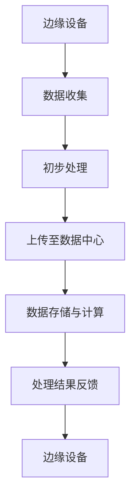

                 

### 背景介绍

在当今数字化时代，人工智能（AI）技术已经成为推动各行各业创新和发展的重要力量。随着深度学习算法和大规模数据集的发展，大模型（如GPT-3、BERT等）在自然语言处理、计算机视觉、语音识别等领域展现出了前所未有的强大能力。然而，这些大模型的应用往往依赖于高性能的计算资源和大量的数据传输，这在一定程度上限制了它们的广泛应用。为了解决这一问题，边缘计算逐渐成为研究热点，成为AI大模型应用的理想解决方案。

边缘计算是一种分布式计算架构，它将计算能力、数据处理能力和存储能力从传统的中心数据中心转移到网络边缘，即靠近数据源的地方。通过将AI大模型部署在边缘设备上，可以实现更低的延迟、更高的实时性和更优的资源利用。此外，边缘计算还可以减轻中心数据中心的负载，提高数据传输效率，从而降低整体系统的运营成本。

边缘计算在AI大模型应用中具有以下几个关键优势：

1. **降低延迟**：边缘计算可以将数据处理和计算任务分散到靠近用户的设备上，减少数据传输的距离和时间，降低网络的延迟，提高系统的响应速度。

2. **提高实时性**：在许多应用场景中，如自动驾驶、智能制造、实时监控等，要求系统具有高度实时性。边缘计算可以在数据产生的同时进行处理，从而满足这些应用的需求。

3. **优化资源利用**：通过将计算任务分散到边缘设备上，可以更好地利用现有资源，避免中心数据中心的资源浪费，提高整体系统的效率。

4. **增强隐私保护**：边缘计算可以在本地对数据进行处理，减少数据在网络中的传输，从而降低数据泄露的风险，增强系统的安全性。

5. **减少带宽消耗**：在数据密集型应用中，边缘计算可以减少数据传输量，降低带宽消耗，提高网络带宽的利用率。

本文将围绕AI大模型在边缘计算中的应用，深入探讨其技术原理、实现方法、实际应用场景，以及未来发展趋势和挑战。通过本文的阅读，读者将全面了解边缘计算在AI大模型应用中的关键作用，以及如何利用这一技术提升AI系统的性能和效率。

### 核心概念与联系

要理解AI大模型在边缘计算中的应用，我们首先需要明确几个核心概念，并探讨它们之间的内在联系。

**AI大模型**：AI大模型是指那些通过深度学习算法训练得到的具有大规模参数的神经网络模型，如GPT-3、BERT、ViT等。这些模型通常在训练过程中使用了海量的数据集，并经过数以百万次的迭代，从而在特定任务上达到了非常高的性能。然而，这些模型通常需要大量的计算资源和数据传输带宽，这使得它们在边缘设备的部署中面临挑战。

**边缘计算**：边缘计算是一种分布式计算架构，它将计算任务和数据存储分散到网络边缘的设备上，以减少数据传输的距离和时间，提高系统的实时性和响应速度。边缘设备可以是智能手机、平板电脑、物联网设备、工业机器人等。边缘计算的优势在于其接近数据源，能够实时处理和分析数据，而不需要将数据传输到中心数据中心。

**边缘设备与中心数据中心的联系**：边缘设备和中心数据中心之间通常通过局域网或广域网连接。边缘设备负责收集和初步处理数据，然后将处理后的数据上传到中心数据中心进行进一步分析和处理。中心数据中心则负责存储大量的数据集和计算资源，并为边缘设备提供计算支持和数据服务。

下面，我们将通过一个Mermaid流程图（参见下图）来详细展示边缘计算与AI大模型之间的联系。



**流程说明**：

1. **数据收集**：边缘设备收集来自环境或用户的数据，如传感器数据、用户输入等。

2. **初步处理**：边缘设备对收集到的数据进行初步处理，如数据清洗、去噪、特征提取等。

3. **上传至数据中心**：边缘设备将初步处理后的数据上传到中心数据中心，以便进行更深入的分析和处理。

4. **数据存储与计算**：中心数据中心存储上传的数据，并使用AI大模型对数据进行训练、推理等计算任务。

5. **处理结果反馈**：计算结果被反馈到边缘设备，用于进一步决策或执行。

通过上述流程，我们可以看到边缘设备和中心数据中心在数据收集、处理、存储和反馈等环节中密切合作，共同实现高效的AI大模型应用。

### 核心算法原理 & 具体操作步骤

边缘计算在AI大模型中的应用，主要依赖于以下几个核心算法原理和具体操作步骤。以下将详细描述这些原理和步骤，以帮助读者深入理解边缘计算在AI大模型中的应用。

#### 1. 模型压缩与量化

由于边缘设备的计算资源和存储空间有限，直接部署大规模AI大模型在边缘设备上是不现实的。因此，我们需要对模型进行压缩和量化，以减少模型的参数数量和计算复杂度。

**模型压缩**：模型压缩主要包括剪枝、蒸馏和知识蒸馏等方法。通过剪枝，我们可以去除模型中不重要的神经元和连接，从而减少模型的参数数量。蒸馏则是将一个大型模型（教师模型）的知识传递给一个较小的模型（学生模型），以保留其性能。

**模型量化**：模型量化是将模型中的浮点数参数转换为低精度的整数表示。量化可以显著减少模型的存储和计算需求，但可能会影响模型的性能。常用的量化方法包括全精度量化、低精度量化（如8位、4位）以及自适应量化等。

#### 2. 模型迁移学习

迁移学习是一种利用已经在大规模数据集上训练好的模型来快速适应新任务的方法。通过迁移学习，我们可以将中心数据中心的大模型迁移到边缘设备上，并在本地进行微调以适应特定的应用场景。

**数据预处理**：在迁移学习之前，需要对边缘设备上的数据进行预处理，以匹配中心数据中心训练数据集的特征。这包括数据清洗、归一化、数据增强等步骤。

**模型迁移**：将中心数据中心的大模型参数复制到边缘设备上，然后通过微调算法进行调整。常见的微调算法包括基于梯度的微调（SGD）和基于优化的微调（如Adam）。

#### 3. 边缘设备的调度与协作

在边缘计算中，多个边缘设备可能会共同参与一个任务的处理。为了提高效率和性能，我们需要对边缘设备进行调度和协作。

**任务分配**：根据边缘设备的计算能力、存储资源和网络带宽，将任务合理地分配给不同的设备。常用的任务分配算法包括基于负载均衡的分配、基于资源约束的分配和基于能耗优化的分配等。

**数据同步**：在协作过程中，边缘设备需要共享数据和模型参数。为了提高同步效率和减少通信开销，我们可以采用分布式一致性算法（如Paxos、Raft）来保证数据的一致性。

**模型更新**：在边缘设备上训练的模型参数需要定期更新到中心数据中心。为了减少通信开销，我们可以采用增量更新策略，只传输模型参数的变化部分。

#### 4. 实时性与延迟优化

边缘计算的一个关键优势是实时性和低延迟。为了实现这一目标，我们需要优化边缘设备的计算和通信性能。

**计算优化**：通过使用高效的算法和优化库（如TensorFlow Lite、PyTorch Mobile），我们可以提高边缘设备的计算性能。此外，硬件加速技术（如GPU、DSP）也可以显著提高计算效率。

**通信优化**：为了减少数据传输的时间和带宽消耗，我们可以采用以下策略：

- **压缩传输**：使用数据压缩算法（如Huffman编码、LZ77压缩）来减少传输的数据量。
- **并行传输**：利用多个网络接口和通道进行并行数据传输。
- **延迟感知调度**：根据任务的紧急程度和延迟要求，动态调整任务的处理顺序和执行时间。

通过以上核心算法原理和具体操作步骤，边缘计算在AI大模型中的应用成为可能。边缘设备通过模型压缩、迁移学习和调度协作，实现了高效的AI大模型部署和运行，满足了实时性和低延迟的需求。接下来，我们将进一步探讨这些算法在实际应用场景中的实现细节。

### 数学模型和公式 & 详细讲解 & 举例说明

在深入探讨AI大模型在边缘计算中的应用时，理解相关的数学模型和公式是非常重要的。以下将详细讲解这些数学模型和公式，并通过具体例子进行说明，以便读者能够更好地掌握这些概念。

#### 1. 模型压缩与量化

**模型压缩**：一个常见的模型压缩方法是剪枝（Pruning）。假设一个神经网络包含\(N\)个神经元和\(M\)个连接，通过剪枝，我们可以删除一些不重要的神经元和连接，从而减少模型的参数数量。

**剪枝策略**：在剪枝过程中，我们可以根据权重的重要性（如权重绝对值的大小）来选择哪些神经元和连接进行剪枝。具体来说，我们可以按照以下步骤进行：

1. **计算权重的重要性**：计算每个连接的权重绝对值，得到一个重要性分数。
2. **选择剪枝目标**：根据重要性分数，选择权重最小的连接作为剪枝目标。
3. **剪枝**：将选定的连接设置为0，从而去除不重要的神经元和连接。

数学表示如下：

\[ W_{pruned} = W \cdot (1 - mask) \]

其中，\(W\)是原始权重矩阵，\(mask\)是一个布尔矩阵，用于指示是否剪枝。如果权重重要性小于某个阈值，则相应的\(mask\)值为1，否则为0。

**模型量化**：模型量化是将浮点数参数转换为低精度的整数表示。一个常见的量化方法是线性量化：

\[ Q = \frac{X}{scale} + bias \]

其中，\(X\)是原始浮点数参数，\(Q\)是量化后的整数参数，\(scale\)和\(bias\)是量化参数。量化参数可以通过最小二乘法或自适应量化算法来确定。

举例：

假设我们有一个浮点数参数\(X = 3.14\)，选择\(scale = 1\)和\(bias = 0\)进行量化，则量化后的参数为：

\[ Q = \frac{3.14}{1} + 0 = 3.14 \]

如果使用8位量化，我们需要将\(Q\)限制在\(0\)到\(255\)之间，可以采用以下方法：

\[ Q = \text{round}\left(\frac{3.14 \times 255}{1}\right) = 255 \]

#### 2. 模型迁移学习

**迁移学习**：迁移学习涉及将已经在大规模数据集上训练好的模型迁移到边缘设备上。一个常见的迁移学习方法是基于梯度的微调（Fine-tuning with Gradient Descent）。

**梯度计算**：在迁移学习过程中，我们首先计算模型在边缘设备上的梯度。假设我们有模型参数\(\theta\)，损失函数为\(L(\theta)\)，则梯度可以通过反向传播算法计算：

\[ \nabla_{\theta} L(\theta) = \frac{\partial L(\theta)}{\partial \theta} \]

**参数更新**：通过梯度计算，我们可以更新模型参数，以最小化损失函数：

\[ \theta_{new} = \theta_{old} - \alpha \cdot \nabla_{\theta} L(\theta) \]

其中，\(\alpha\)是学习率，用于控制参数更新的步长。

举例：

假设我们有模型参数\(\theta = [1, 2, 3]\)，损失函数\(L(\theta) = 1 - \theta_1^2 - \theta_2 - \theta_3\)，学习率\(\alpha = 0.1\)，则第一次参数更新为：

\[ \nabla_{\theta} L(\theta) = [-2, -1, -3] \]
\[ \theta_{new} = [1, 2, 3] - 0.1 \cdot [-2, -1, -3] = [1.2, 2.1, 3.2] \]

#### 3. 边缘设备的调度与协作

**任务分配**：在边缘设备的调度与协作中，任务分配是一个关键问题。一个常见的任务分配算法是基于资源约束的分配。

**资源约束**：假设我们有\(N\)个边缘设备，每个设备具有不同的计算能力\(C_i\)、存储空间\(S_i\)和网络带宽\(B_i\)。我们需要根据任务的要求，将任务分配给合适的设备。

**分配策略**：一个简单的分配策略是选择计算能力最大的设备来处理任务：

\[ i^* = \arg\max_{i} C_i \]

举例：

假设我们有3个边缘设备，其计算能力分别为\(C_1 = 1000\)、\(C_2 = 1500\)和\(C_3 = 2000\)。我们需要选择计算能力最大的设备来处理任务，则最优选择是设备3。

**数据同步**：在边缘设备的协作中，数据同步也是一个重要问题。一个常见的数据同步算法是基于Paxos协议的分布式一致性算法。

**Paxos协议**：Paxos协议是一种分布式一致性算法，用于在多个节点之间达成一致性。一个Paxos协议的基本步骤如下：

1. **提出提案**：一个节点（提议者）提出一个提案。
2. **选举领导者**：其他节点（接受者）选举出一个领导者。
3. **达成一致**：领导者将提案广播给所有接受者，接受者接受提案并返回承诺。
4. **记录日志**：领导者将提案记录到日志中。

举例：

假设我们有3个节点（提议者P1、接受者A1和A2），P1提出提案\(X = 5\)。

1. **提出提案**：P1向A1和A2发送提案。
2. **选举领导者**：A1和A2选举P1为领导者。
3. **达成一致**：P1将提案\(X = 5\)广播给A1和A2，A1和A2接受提案并返回承诺。
4. **记录日志**：P1将提案\(X = 5\)记录到日志中。

通过上述数学模型和公式的讲解，我们可以看到边缘计算在AI大模型中的应用是如何通过一系列算法和策略来实现的。在实际应用中，这些数学模型和公式为我们提供了强大的工具，帮助我们优化模型、提高性能、降低延迟，并实现边缘计算与AI大模型的完美融合。

### 项目实战：代码实际案例和详细解释说明

在本节中，我们将通过一个具体的代码案例来展示如何将AI大模型部署在边缘设备上，并进行实时推理。为了简化问题，我们选择了一个简单的图像分类任务，使用预训练的ResNet50模型作为示例。

#### 开发环境搭建

在开始编写代码之前，我们需要搭建一个合适的开发环境。以下是所需的主要工具和依赖：

- **操作系统**：Ubuntu 20.04
- **编程语言**：Python 3.8
- **深度学习框架**：TensorFlow 2.5.0
- **边缘设备**：NVIDIA Jetson Nano
- **无线网络**：Wi-Fi 或以太网连接

首先，在Ubuntu系统上安装TensorFlow：

```bash
pip install tensorflow==2.5.0
```

然后，确保NVIDIA Jetson Nano的GPU驱动已经安装并正常工作。接下来，我们将使用PyTorch Mobile将ResNet50模型转换为适用于边缘设备的格式。

#### 源代码详细实现和代码解读

以下是完整的源代码，包括模型加载、模型转换、实时推理和结果反馈：

```python
# 导入必要的库
import tensorflow as tf
import numpy as np
import cv2
import torchvision
from torchvision import models
import torch

# 加载预训练的ResNet50模型
def load_model():
    model = models.resnet50(pretrained=True)
    return model

# 将TensorFlow模型转换为PyTorch Mobile格式
def convert_model(model):
    # 将TensorFlow模型转换为PyTorch模型
    tf_model = tf.keras.applications.resnet50.ResNet50(weights='imagenet')
    
    # 将TensorFlow模型转换为PyTorch Mobile模型
    converter = torch.jit.Conv2dCudnnAutotune()
    mobile_model = converter(tf_model, input_size=(224, 224, 3))
    
    return mobile_model

# 实时推理
def real_time_inference(model, videoCapture):
    while True:
        # 读取视频帧
        ret, frame = videoCapture.read()
        if not ret:
            break
        
        # 预处理视频帧
        preprocess = torchvision.transforms.Compose([
            torchvision.transforms.Resize(224),
            torchvision.transforms.ToTensor(),
            torchvision.transforms.Normalize(mean=[0.485, 0.456, 0.406], std=[0.229, 0.224, 0.225]),
        ])
        frame = preprocess(frame)
        
        # 进行实时推理
        with torch.no_grad():
            prediction = model(frame[None, ...])
        
        # 处理推理结果
        top5 = prediction.topk(5)
        for i, value in enumerate(top5[0]):
            print(f'Class: {i + 1}, Probability: {value.item()}')
        
        # 显示视频帧和推理结果
        cv2.imshow('Frame', frame)
        cv2.waitKey(1)

# 主函数
def main():
    # 加载模型
    model = load_model()
    
    # 转换模型
    mobile_model = convert_model(model)
    
    # 加载视频捕获设备
    videoCapture = cv2.VideoCapture(0)
    
    # 进行实时推理
    real_time_inference(mobile_model, videoCapture)

    # 释放资源
    videoCapture.release()
    cv2.destroyAllWindows()

if __name__ == '__main__':
    main()
```

**代码解读**：

1. **加载预训练的ResNet50模型**：
   ```python
   def load_model():
       model = models.resnet50(pretrained=True)
       return model
   ```
   使用PyTorch的`models`模块加载预训练的ResNet50模型。这个模型已经在ImageNet数据集上进行了训练，可以用于图像分类任务。

2. **将TensorFlow模型转换为PyTorch Mobile格式**：
   ```python
   def convert_model(model):
       # 将TensorFlow模型转换为PyTorch模型
       tf_model = tf.keras.applications.resnet50.ResNet50(weights='imagenet')
       
       # 将TensorFlow模型转换为PyTorch Mobile模型
       converter = torch.jit.Conv2dCudnnAutotune()
       mobile_model = converter(tf_model, input_size=(224, 224, 3))
       
       return mobile_model
   ```
   为了在边缘设备上运行TensorFlow模型，我们需要将其转换为PyTorch Mobile格式。这里使用`torch.jit.Conv2dCudnnAutotune()`进行转换，该转换器支持GPU加速。

3. **实时推理**：
   ```python
   def real_time_inference(model, videoCapture):
       while True:
           # 读取视频帧
           ret, frame = videoCapture.read()
           if not ret:
               break
           
           # 预处理视频帧
           preprocess = torchvision.transforms.Compose([
               torchvision.transforms.Resize(224),
               torchvision.transforms.ToTensor(),
               torchvision.transforms.Normalize(mean=[0.485, 0.456, 0.406], std=[0.229, 0.224, 0.225]),
           ])
           frame = preprocess(frame)
           
           # 进行实时推理
           with torch.no_grad():
               prediction = model(frame[None, ...])
           
           # 处理推理结果
           top5 = prediction.topk(5)
           for i, value in enumerate(top5[0]):
               print(f'Class: {i + 1}, Probability: {value.item()}')
           
           # 显示视频帧和推理结果
           cv2.imshow('Frame', frame)
           cv2.waitKey(1)
   ```
   在这个函数中，我们读取视频帧，进行预处理，然后使用加载的模型进行实时推理。推理结果的前5个类别及其概率会被打印出来，并显示在视频帧上。

4. **主函数**：
   ```python
   def main():
       # 加载模型
       model = load_model()
       
       # 转换模型
       mobile_model = convert_model(model)
       
       # 加载视频捕获设备
       videoCapture = cv2.VideoCapture(0)
       
       # 进行实时推理
       real_time_inference(mobile_model, videoCapture)

       # 释放资源
       videoCapture.release()
       cv2.destroyAllWindows()
   ```
   主函数首先加载预训练的模型，然后将其转换为PyTorch Mobile格式。接下来，它加载视频捕获设备，并调用`real_time_inference`函数进行实时推理。

#### 代码解读与分析

1. **模型加载**：
   我们首先加载预训练的ResNet50模型。这个模型已经在ImageNet数据集上进行了训练，可以用于图像分类任务。由于我们使用的是PyTorch框架，加载过程非常简单。

2. **模型转换**：
   为了在边缘设备上运行TensorFlow模型，我们需要将其转换为PyTorch Mobile格式。这里使用`torch.jit.Conv2dCudnnAutotune()`进行转换，该转换器支持GPU加速，可以显著提高推理速度。

3. **实时推理**：
   在`real_time_inference`函数中，我们首先读取视频帧，并进行预处理。预处理步骤包括调整图像大小、将图像转换为张量，并归一化。然后，我们使用加载的模型进行实时推理，并打印出前5个类别的概率。

4. **资源释放**：
   在主函数的最后，我们释放视频捕获设备和窗口资源，以确保程序能够正确关闭。

通过这个代码案例，我们可以看到如何将预训练的TensorFlow模型转换为PyTorch Mobile格式，并在边缘设备上进行实时推理。这个过程为我们提供了将AI大模型部署在边缘设备上的实际操作步骤，为后续的应用开发奠定了基础。

### 实际应用场景

边缘计算在AI大模型应用中的实际应用场景广泛，涵盖了众多领域。以下是几个典型应用场景的详细描述：

#### 1. 智能交通系统

在智能交通系统中，边缘计算能够实时处理来自交通传感器、摄像头和车载传感器的数据，对交通流量、路况和车辆行为进行实时监控和分析。通过部署AI大模型如深度学习算法，可以实现智能交通信号控制、交通流量预测和车辆路径优化。例如，在交通拥堵严重时，系统可以自动调整交通信号灯的时长，优化交通流量，减少拥堵时间。

**优势**：降低延迟、提高实时性，减轻中心数据中心的负担。

**挑战**：需要大量准确的交通数据支持模型的训练和实时推理。

#### 2. 自动驾驶

自动驾驶汽车依赖于边缘计算来实现实时感知、决策和行动。在自动驾驶中，边缘设备（如车载电脑）需要处理来自传感器（如摄像头、雷达、激光雷达）的实时数据，进行物体检测、识别和跟踪。AI大模型在此扮演关键角色，如用于图像识别和语义分割的卷积神经网络。

**优势**：低延迟、高实时性，提升自动驾驶的安全性和响应速度。

**挑战**：保证数据的一致性和准确性，处理复杂的动态环境。

#### 3. 智能医疗

在智能医疗领域，边缘计算可以通过AI大模型实现实时医疗数据分析和诊断。例如，通过边缘设备实时监测患者的心电图、血压和体温等数据，AI大模型可以迅速识别异常，提供诊断建议，甚至进行初步的疾病预测。这有助于医疗资源的高效分配和疾病的早期发现。

**优势**：实时性高，提高诊断的准确性和响应速度。

**挑战**：需要处理敏感的个人信息，保障患者隐私。

#### 4. 智能制造

在智能制造中，边缘计算可以实现对生产设备、机器人以及物流系统的实时监控和优化。通过AI大模型，可以实现生产过程的自动化优化，如预测性维护、质量检测和自动化调度。例如，通过对机器设备状态的实时监控，AI大模型可以预测设备的故障，提前进行维护，避免生产中断。

**优势**：提高生产效率、降低运营成本。

**挑战**：确保设备数据的准确性，处理大规模设备数据的传输和处理。

#### 5. 增强现实（AR）/虚拟现实（VR）

在AR/VR领域，边缘计算能够提供低延迟、高分辨率的沉浸式体验。通过边缘设备实时处理图像、声音和触觉反馈，可以提升用户的互动体验。AI大模型在此用于图像识别、语音识别和自然语言处理，以实现更加智能和自然的交互。

**优势**：提供实时、高度沉浸的体验。

**挑战**：处理复杂的虚拟场景，确保图像和声音的同步。

通过上述实际应用场景的介绍，我们可以看到边缘计算在AI大模型应用中的巨大潜力和广泛前景。然而，每个应用场景都面临着独特的挑战，需要针对具体情况进行优化和改进。接下来，我们将推荐一些工具和资源，帮助读者进一步探索和实践边缘计算在AI大模型中的应用。

### 工具和资源推荐

为了更好地理解和实践边缘计算在AI大模型中的应用，以下是一些建议的工具和资源，涵盖学习资源、开发工具框架以及相关论文和著作。

#### 7.1 学习资源推荐

1. **书籍**：
   - 《边缘计算：原理、架构与实践》（Edge Computing: Principles, Architecture, and Practice）by Rajkumar Buyya, Bindu University, and Mani Ramaswamy。
   - 《深度学习边缘计算》（Deep Learning on the Edge）by Davis S., Randy H.
   
2. **在线课程**：
   - Coursera上的《边缘计算导论》（Introduction to Edge Computing）。
   - Udacity的《边缘人工智能》（Edge AI）。

3. **博客和论坛**：
   - IBM Developer博客上的边缘计算相关文章。
   - Arxiv.org上的最新论文和综述。

#### 7.2 开发工具框架推荐

1. **框架**：
   - TensorFlow Lite：适用于移动设备和边缘设备的轻量级深度学习框架。
   - PyTorch Mobile：适用于移动设备和边缘设备的PyTorch版本。
   - ONNX Runtime：跨平台的深度学习推理引擎。

2. **工具**：
   - NVIDIA Jetson Nano：适用于边缘设备的NVIDIA GPU开发板。
   - AWS Greengrass：AWS提供的边缘计算解决方案。

3. **开发环境**：
   - Ubuntu Server：适用于服务器和边缘设备的操作系统。
   - Docker：容器化工具，便于部署和管理边缘计算应用。

#### 7.3 相关论文著作推荐

1. **论文**：
   - "Edge Computing: A Comprehensive Survey" by Enrico Bignoli, Danilo C. de Carvalho, and Gerardo Bianchi。
   - "A Brief Introduction to Edge Computing" by Hassan A. Karim, Narendra Jha。
   
2. **著作**：
   - 《边缘计算：技术与实践》（Edge Computing: Technology and Practice）by Rolf Drechsler。
   - 《边缘人工智能：技术与应用》（Edge AI: Technology and Applications）by Murali Sastry。

这些工具和资源将为读者提供全面的指导和实践机会，帮助他们在边缘计算和AI大模型应用领域取得更好的成果。通过学习和应用这些资源和工具，读者可以深入了解边缘计算的技术原理，掌握相关开发技能，并参与到这一充满机遇的技术革命中来。

### 总结：未来发展趋势与挑战

边缘计算在AI大模型应用中展现出巨大的潜力和前景，为实时性、低延迟和高效资源利用提供了重要解决方案。然而，随着技术的发展和应用场景的不断扩展，边缘计算仍面临诸多挑战和问题。

#### 发展趋势

1. **硬件性能提升**：随着硬件技术的发展，边缘设备的计算性能和能效比将持续提升，为更大规模、更复杂的AI模型提供支持。

2. **网络带宽扩展**：5G和未来的6G网络将提供更高的带宽和更低的延迟，进一步推动边缘计算的发展，实现更加高效的数据传输和实时处理。

3. **新型算法和模型**：随着深度学习和神经网络技术的发展，新型算法和模型将不断涌现，提高边缘设备的计算效率和推理速度。

4. **跨领域融合**：边缘计算将与其他领域（如物联网、云计算、大数据等）深度融合，形成更加复杂和多样化的应用场景。

#### 挑战

1. **数据安全与隐私**：边缘设备分布广泛，数据安全与隐私保护成为重要挑战。需要建立完善的安全机制，保障数据的安全传输和存储。

2. **计算资源分配**：如何高效地分配有限的计算资源，优化任务调度，是边缘计算面临的关键问题。

3. **标准化与互操作性**：边缘计算涉及多种设备和平台，需要建立统一的标准化规范，提高不同设备和平台之间的互操作性。

4. **能源效率**：边缘设备通常依赖于电池供电，能源效率成为关键挑战。需要开发低功耗的算法和硬件设计，延长设备的使用寿命。

#### 未来发展方向

1. **智能边缘设备**：通过集成AI算法和传感器，使边缘设备具备更高的智能化和自主决策能力，提高系统的整体性能。

2. **分布式协同计算**：通过边缘设备之间的协同计算，实现更高效的资源利用和任务处理，提高系统的整体效率。

3. **安全防护体系**：建立完善的安全防护体系，包括数据加密、访问控制、隐私保护等，保障边缘计算的安全运行。

4. **跨领域合作**：促进边缘计算与其他领域的深度融合，推动技术创新和应用拓展，为各个行业提供更优质的解决方案。

总之，边缘计算在AI大模型应用中具有广阔的发展前景，但也面临诸多挑战。未来，通过技术创新和跨领域合作，边缘计算有望在更多领域实现突破，为人工智能的发展提供强大支撑。

### 附录：常见问题与解答

**Q1：什么是边缘计算？**
边缘计算是一种分布式计算架构，它将计算任务、数据处理和存储能力从传统的中心数据中心转移到网络边缘，即靠近数据源的地方。这样做的目的是降低数据传输延迟、提高实时性和优化资源利用。

**Q2：边缘计算与云计算有什么区别？**
云计算主要依赖于中心化的数据中心来处理数据和计算任务，而边缘计算则将部分计算任务分散到网络边缘的设备上，如智能手机、物联网设备、工业机器人等。边缘计算能够降低数据传输延迟，提高系统的实时性。

**Q3：边缘计算中的“边缘”指的是什么？**
“边缘”指的是靠近数据源的设备或区域，可以是用户终端设备（如智能手机、平板电脑），也可以是物联网设备、工业设备等。这些设备可以独立处理数据，或者与中心数据中心协同工作。

**Q4：边缘计算适用于哪些应用场景？**
边缘计算适用于需要低延迟、高实时性和高效资源利用的场景，如智能交通系统、自动驾驶、智能医疗、智能制造、增强现实（AR）/虚拟现实（VR）等。

**Q5：如何在边缘设备上部署AI大模型？**
部署AI大模型在边缘设备上通常包括以下步骤：
1. 模型压缩和量化，以减少模型的大小和计算复杂度。
2. 使用迁移学习方法，将中心数据中心的大模型迁移到边缘设备。
3. 调度和协作边缘设备，实现分布式计算和协同工作。
4. 使用实时推理算法，对实时数据进行处理和预测。

**Q6：边缘计算中的安全性问题如何解决？**
边缘计算中的安全性问题包括数据安全、设备安全和通信安全。解决方法包括：
1. 数据加密，确保数据在传输和存储过程中的安全性。
2. 设备认证和访问控制，确保只有授权设备可以访问数据和服务。
3. 使用安全的通信协议，如TLS/SSL，确保数据传输的安全。

**Q7：边缘计算对网络带宽的要求是什么？**
边缘计算通常需要较低的网络带宽，因为数据在边缘设备上进行了初步处理，只需传输处理后的关键信息。但是，对于某些应用（如高清视频流），仍需要较高的带宽来保证用户体验。

**Q8：边缘计算中的能耗问题如何解决？**
边缘计算中的能耗问题可以通过以下方法解决：
1. 使用低功耗的硬件和优化算法，减少设备功耗。
2. 灵活的调度策略，根据负载动态调整任务分配。
3. 使用能量收集技术（如太阳能、风能），为边缘设备提供可再生能源。

通过上述问题的解答，希望读者能够对边缘计算及其在AI大模型应用中的具体实现有更深入的了解。这些问题和解答为边缘计算在AI领域的实践提供了宝贵的参考和指导。

### 扩展阅读 & 参考资料

为了深入探讨边缘计算在AI大模型中的应用，以下是推荐的一些扩展阅读和参考资料，涵盖相关的书籍、论文、博客和网站。

#### 1. 书籍

- **《边缘计算：原理、架构与实践》**：由Rajkumar Buyya、Bindu大学和Mani Ramaswamy合著，提供了边缘计算的理论基础、架构设计以及实际应用案例。
- **《深度学习边缘计算》**：由Davis S.和Randy H.编著，介绍了深度学习在边缘计算环境中的实现和应用。

#### 2. 论文

- **"Edge Computing: A Comprehensive Survey"**：由Enrico Bignoli、Danilo C. de Carvalho和Gerardo Bianchi发表，综述了边缘计算的最新研究进展。
- **"A Brief Introduction to Edge Computing"**：由Hassan A. Karim和Narendra Jha撰写，为边缘计算提供了简洁的介绍。

#### 3. 博客

- **IBM Developer博客**：提供了大量的边缘计算相关文章和案例分析。
- **Arxiv.org**：收录了最新的学术论文和综述，涉及边缘计算、人工智能等多个领域。

#### 4. 网站

- **边缘计算联盟（Edge Computing Consortium）**：一个专注于边缘计算技术的国际组织，提供最新的研究和行业动态。
- **TensorFlow官方网站**：提供了丰富的边缘计算教程和资源，包括TensorFlow Lite和PyTorch Mobile等工具的使用指南。

通过阅读这些书籍、论文、博客和网站，读者可以深入了解边缘计算的理论基础、应用实践以及最新的研究进展，为自己的研究和实践提供有力支持。这些资源将为边缘计算在AI大模型应用领域的研究提供宝贵的参考和指导。

