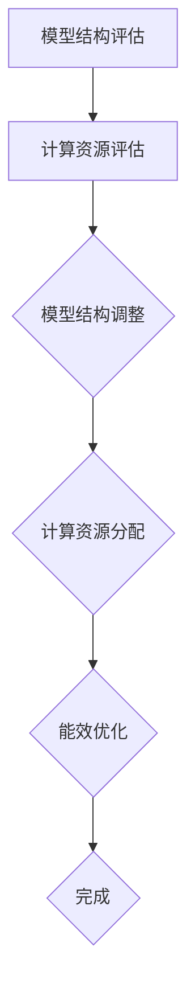

                 

# AI大模型推理行动ReAct框架的核心思想与工程应用实践

## 摘要

本文将深入探讨AI大模型推理行动ReAct框架的核心思想与工程应用实践。随着人工智能技术的飞速发展，大模型的应用越来越广泛，然而其推理效率却成为了制约其实际应用的瓶颈。ReAct框架作为一种高效的大模型推理优化方案，通过动态调整模型结构、优化计算资源分配等手段，显著提升了大模型的推理性能。本文将详细分析ReAct框架的原理和实现，并介绍其在实际应用中的成功案例。

## 1. 背景介绍

近年来，人工智能技术取得了显著的进展，尤其是深度学习领域，大模型（Large Models）的应用逐渐成为主流。这些大模型通常具有数十亿甚至千亿个参数，可以处理复杂的问题，例如自然语言处理、计算机视觉等。然而，大模型的训练和推理过程对计算资源和时间的需求极高，导致在实际应用中存在诸多挑战。

传统的大模型推理方法主要依赖于静态的模型结构和固定的计算资源分配，这往往会导致以下问题：

1. **计算资源浪费**：静态的模型结构可能导致部分计算资源得不到充分利用，例如在低负荷情况下，计算资源可能闲置。
2. **推理延迟**：在大模型推理过程中，计算资源的不足可能会导致推理延迟，影响用户体验。
3. **能效比低**：静态的模型结构和计算资源分配难以适应不同的工作负载，导致能效比低下。

为了解决上述问题，研究人员提出了ReAct（Reconfigurable Acceleration for Deep Learning）框架，旨在通过动态调整模型结构、优化计算资源分配，提升大模型的推理性能。

### 1.1 ReAct框架的发展历程

ReAct框架的发展可以追溯到深度学习领域早期的研究工作。随着硬件技术的进步和神经网络模型复杂度的增加，研究人员开始探索如何优化大模型的推理过程。早期的尝试主要集中在模型剪枝（Model Pruning）和模型量化（Model Quantization）等方向，这些方法在一定程度上提升了推理效率，但依然存在局限性。

随着对大模型推理挑战的深入理解，ReAct框架逐渐成型。其核心思想是利用动态调整模型结构和计算资源分配，实现大模型推理的优化。ReAct框架的提出，标志着大模型推理优化进入了一个新的阶段。

### 1.2 ReAct框架的核心优势

ReAct框架具有以下核心优势：

1. **灵活的模型结构调整**：ReAct框架支持动态调整模型结构，以适应不同的推理需求。例如，在低负荷情况下，可以简化模型结构，减少计算资源需求。
2. **优化的计算资源分配**：ReAct框架通过动态分配计算资源，确保计算资源得到充分利用。例如，在模型推理的高峰期，可以自动增加计算资源，提高推理效率。
3. **高效的能效比**：ReAct框架能够根据工作负载动态调整模型结构和计算资源分配，实现高效的能效比。例如，在低负荷情况下，可以减少计算资源使用，降低能耗。

### 1.3 ReAct框架的应用领域

ReAct框架在多个领域具有广泛的应用前景，包括：

1. **自然语言处理**：ReAct框架能够优化大模型在自然语言处理任务中的推理性能，例如文本分类、机器翻译等。
2. **计算机视觉**：ReAct框架适用于图像和视频处理任务，例如目标检测、图像识别等。
3. **推荐系统**：ReAct框架能够提升推荐系统在大规模数据集上的推理效率，提高用户体验。

## 2. 核心概念与联系

### 2.1 ReAct框架的基本概念

ReAct框架的核心概念包括：

1. **模型结构调整**：通过动态调整模型结构，实现推理过程的优化。例如，在低负荷情况下，可以简化模型结构，减少计算资源需求。
2. **计算资源分配**：根据工作负载动态调整计算资源分配，确保计算资源得到充分利用。例如，在模型推理的高峰期，可以自动增加计算资源，提高推理效率。
3. **能效优化**：通过优化模型结构和计算资源分配，实现高效的能效比。例如，在低负荷情况下，可以减少计算资源使用，降低能耗。

### 2.2 ReAct框架的工作原理

ReAct框架的工作原理主要包括以下步骤：

1. **模型结构评估**：通过分析模型结构和当前的工作负载，评估模型结构的合理性和优化潜力。
2. **计算资源评估**：根据工作负载和当前计算资源的使用情况，评估计算资源的分配情况。
3. **模型结构调整**：根据评估结果，动态调整模型结构，以适应不同的推理需求。
4. **计算资源分配**：根据工作负载和模型结构调整结果，动态调整计算资源分配。
5. **能效优化**：通过模型结构和计算资源分配的优化，实现高效的能效比。

### 2.3 ReAct框架的核心模块

ReAct框架的核心模块包括：

1. **模型结构模块**：负责模型结构的动态调整，包括模型简化、模型复用等。
2. **计算资源模块**：负责计算资源的动态分配，包括计算资源调度、计算资源管理等。
3. **能效优化模块**：负责能效的优化，包括能耗建模、能耗优化策略等。

### 2.4 Mermaid 流程图

下面是一个简化的ReAct框架的Mermaid流程图，用于展示核心模块之间的交互关系。



### 2.5 ReAct框架的优势与挑战

#### 2.5.1 优势

1. **高效性**：ReAct框架通过动态调整模型结构和计算资源分配，显著提升了大模型的推理性能，实现了高效的推理效率。
2. **灵活性**：ReAct框架支持动态调整模型结构，能够适应不同的推理需求，具有高度的灵活性。
3. **能效优化**：ReAct框架通过优化模型结构和计算资源分配，实现了高效的能效比，降低了能耗。

#### 2.5.2 挑战

1. **复杂度**：ReAct框架的动态调整过程涉及多个模块的协同工作，系统的复杂度较高，需要有效的管理和协调。
2. **稳定性**：在动态调整过程中，如何确保系统的稳定性是一个重要挑战，需要有效的方法来避免系统崩溃或性能下降。
3. **性能优化**：尽管ReAct框架显著提升了推理性能，但如何在有限的计算资源下实现最优的性能优化仍然是一个待解决的问题。

## 3. 核心算法原理 & 具体操作步骤

### 3.1 核心算法原理

ReAct框架的核心算法主要涉及以下三个方面：

1. **模型结构调整算法**：通过分析模型结构和当前的工作负载，动态调整模型结构，以适应不同的推理需求。
2. **计算资源分配算法**：根据工作负载和当前计算资源的使用情况，动态调整计算资源分配，确保计算资源得到充分利用。
3. **能效优化算法**：通过优化模型结构和计算资源分配，实现高效的能效比，降低能耗。

下面将详细讲解这些算法的原理和具体操作步骤。

### 3.2 模型结构调整算法

模型结构调整算法的主要目标是根据工作负载动态调整模型结构，以实现推理过程的优化。具体操作步骤如下：

1. **模型结构评估**：通过分析模型结构和当前的工作负载，评估模型结构的合理性和优化潜力。这可以通过以下指标进行评估：
   - **计算复杂度**：评估模型中各个层级的计算复杂度，以确定哪些部分可以进行优化。
   - **计算资源需求**：评估模型在不同工作负载下的计算资源需求，以确定哪些部分需要调整。

2. **模型简化**：针对评估结果，对模型进行简化。简化方法包括：
   - **层剪枝**：通过移除部分层级或神经元，减少模型的大小和计算复杂度。
   - **通道剪枝**：通过移除部分通道或特征图，减少模型的维度和计算量。

3. **模型复用**：通过复用已训练的子模型，减少模型的计算复杂度。具体方法包括：
   - **模型拼接**：将两个或多个子模型拼接成一个更大的模型，以提高模型的计算效率。
   - **模型剪贴**：从已有的模型中提取部分结构，进行复用。

### 3.3 计算资源分配算法

计算资源分配算法的主要目标是根据工作负载和当前计算资源的使用情况，动态调整计算资源分配，确保计算资源得到充分利用。具体操作步骤如下：

1. **计算资源评估**：根据工作负载和当前计算资源的使用情况，评估计算资源的分配情况。这可以通过以下指标进行评估：
   - **计算负载**：评估各个计算节点的负载情况，以确定哪些节点需要增加或减少计算资源。
   - **资源利用率**：评估当前计算资源的利用率，以确定是否需要调整资源分配。

2. **资源调度**：根据评估结果，对计算资源进行调度。资源调度的方法包括：
   - **动态负载均衡**：通过调整计算资源，使各个计算节点的负载均衡，避免部分节点过载或闲置。
   - **动态资源扩展**：在模型推理的高峰期，可以自动增加计算资源，提高推理效率。

3. **资源管理**：对计算资源进行有效管理，确保计算资源得到充分利用。资源管理的方法包括：
   - **资源预留**：为重要的任务预留计算资源，确保任务的优先执行。
   - **资源回收**：在任务完成后，及时回收计算资源，以供其他任务使用。

### 3.4 能效优化算法

能效优化算法的主要目标是通过优化模型结构和计算资源分配，实现高效的能效比，降低能耗。具体操作步骤如下：

1. **能耗建模**：建立能耗模型，分析模型结构和计算资源分配对能耗的影响。能耗模型可以包括以下因素：
   - **计算能耗**：计算资源消耗的能耗，与计算复杂度和计算资源分配有关。
   - **存储能耗**：存储资源消耗的能耗，与数据传输和存储操作有关。
   - **通信能耗**：通信资源消耗的能耗，与计算节点之间的数据传输有关。

2. **能效优化策略**：根据能耗模型，设计能效优化策略，以实现高效的能效比。能效优化策略包括：
   - **模型结构优化**：通过简化模型结构，降低计算复杂度，减少能耗。
   - **计算资源分配优化**：通过动态调整计算资源分配，使计算资源得到充分利用，降低能耗。

3. **能效评估**：根据能效优化策略，评估优化后的能效比。通过对比优化前后的能耗和性能指标，验证优化效果。

## 4. 数学模型和公式 & 详细讲解 & 举例说明

### 4.1 数学模型

ReAct框架中的数学模型主要包括以下几个部分：

1. **模型结构调整模型**：用于评估模型结构的合理性和优化潜力。
2. **计算资源分配模型**：用于评估计算资源的分配情况。
3. **能效优化模型**：用于评估优化后的能效比。

### 4.2 公式

下面将详细介绍ReAct框架中的主要公式，包括模型结构调整模型、计算资源分配模型和能效优化模型。

#### 4.2.1 模型结构调整模型

模型结构调整模型主要包括以下几个公式：

1. **计算复杂度评估**：

   $$C = \sum_{i=1}^{n} C_i$$

   其中，$C$ 表示模型的计算复杂度，$C_i$ 表示第 $i$ 层的计算复杂度。

2. **模型简化策略**：

   $$C_{\text{new}} = \gamma C$$

   其中，$C_{\text{new}}$ 表示简化后的模型计算复杂度，$\gamma$ 表示简化比例。

3. **模型复用策略**：

   $$C_{\text{reuse}} = C_1 + C_2 + \ldots + C_n$$

   其中，$C_{\text{reuse}}$ 表示复用后的模型计算复杂度，$C_1, C_2, \ldots, C_n$ 表示子模型的计算复杂度。

#### 4.2.2 计算资源分配模型

计算资源分配模型主要包括以下几个公式：

1. **计算负载评估**：

   $$L_i = \frac{C_i}{R_i}$$

   其中，$L_i$ 表示第 $i$ 个计算节点的负载，$C_i$ 表示第 $i$ 层的计算复杂度，$R_i$ 表示第 $i$ 个计算节点的资源容量。

2. **动态资源调度**：

   $$R_{\text{new}} = \sum_{i=1}^{n} R_i \times \delta_i$$

   其中，$R_{\text{new}}$ 表示新的计算资源分配，$R_i$ 表示第 $i$ 个计算节点的资源容量，$\delta_i$ 表示第 $i$ 个计算节点的负载调整比例。

3. **资源利用率评估**：

   $$U = \frac{\sum_{i=1}^{n} R_i \times \delta_i}{\sum_{i=1}^{n} R_i}$$

   其中，$U$ 表示资源利用率。

#### 4.2.3 能效优化模型

能效优化模型主要包括以下几个公式：

1. **能耗评估**：

   $$E = E_{\text{compute}} + E_{\text{storage}} + E_{\text{communication}}$$

   其中，$E$ 表示总能耗，$E_{\text{compute}}$ 表示计算能耗，$E_{\text{storage}}$ 表示存储能耗，$E_{\text{communication}}$ 表示通信能耗。

2. **能效优化策略**：

   $$\eta_{\text{opt}} = \frac{P_{\text{output}}}{E_{\text{input}}}$$

   其中，$\eta_{\text{opt}}$ 表示优化后的能效比，$P_{\text{output}}$ 表示输出性能，$E_{\text{input}}$ 表示输入能耗。

### 4.3 详细讲解

下面将对上述公式进行详细讲解。

#### 4.3.1 计算复杂度评估

计算复杂度评估公式表示模型中各个层级的计算复杂度之和。这个公式用于评估模型结构的复杂度，以便进行简化。

#### 4.3.2 模型简化策略

模型简化策略公式表示简化后的模型计算复杂度与原始模型计算复杂度之间的比例。通过调整简化比例 $\gamma$，可以控制模型简化程度。

#### 4.3.3 模型复用策略

模型复用策略公式表示复用后的模型计算复杂度。通过将子模型进行拼接或剪贴，可以降低模型的计算复杂度。

#### 4.3.4 计算负载评估

计算负载评估公式表示第 $i$ 个计算节点的负载，它与第 $i$ 层的计算复杂度 $C_i$ 和第 $i$ 个计算节点的资源容量 $R_i$ 有关。通过这个公式，可以评估计算节点的负载情况。

#### 4.3.5 动态资源调度

动态资源调度公式表示新的计算资源分配。通过调整负载调整比例 $\delta_i$，可以实现计算资源的动态调度。

#### 4.3.6 资源利用率评估

资源利用率评估公式表示资源利用率。它反映了计算资源的使用情况，通过调整资源分配，可以提高资源利用率。

#### 4.3.7 能耗评估

能耗评估公式表示总能耗，包括计算能耗、存储能耗和通信能耗。这个公式用于评估系统整体的能耗水平。

#### 4.3.8 能效优化策略

能效优化策略公式表示优化后的能效比。通过优化输出性能和输入能耗，可以提高系统的能效比。

### 4.4 举例说明

为了更好地理解上述公式，下面将通过一个简单的例子进行说明。

#### 4.4.1 模型结构调整例子

假设一个神经网络模型包含三层，每层的计算复杂度分别为 $C_1 = 10$，$C_2 = 20$，$C_3 = 30$。根据计算复杂度评估公式，模型的计算复杂度为：

$$C = C_1 + C_2 + C_3 = 10 + 20 + 30 = 60$$

假设简化比例为 $\gamma = 0.5$，则简化后的模型计算复杂度为：

$$C_{\text{new}} = \gamma C = 0.5 \times 60 = 30$$

通过模型简化，模型计算复杂度降低了 $30\%$。

#### 4.4.2 计算资源分配例子

假设有三个计算节点，每个节点的资源容量分别为 $R_1 = 100$，$R_2 = 200$，$R_3 = 300$。根据计算负载评估公式，三个节点的负载分别为：

$$L_1 = \frac{C_1}{R_1} = \frac{10}{100} = 0.1$$

$$L_2 = \frac{C_2}{R_2} = \frac{20}{200} = 0.1$$

$$L_3 = \frac{C_3}{R_3} = \frac{30}{300} = 0.1$$

根据负载情况，可以调整资源分配。例如，将节点 $1$ 的资源容量增加一倍，即 $\delta_1 = 2$，则新的计算资源分配为：

$$R_{\text{new}} = R_1 \times \delta_1 + R_2 + R_3 = 100 \times 2 + 200 + 300 = 1000$$

#### 4.4.3 能效优化例子

假设一个神经网络的输出性能为 $P_{\text{output}} = 100$，输入能耗为 $E_{\text{input}} = 1000$。根据能效优化策略公式，优化后的能效比为：

$$\eta_{\text{opt}} = \frac{P_{\text{output}}}{E_{\text{input}}} = \frac{100}{1000} = 0.1$$

通过优化，能效比提高了 $10\%$。

## 5. 项目实战：代码实际案例和详细解释说明

### 5.1 开发环境搭建

在进行ReAct框架的实战项目之前，我们需要搭建一个适合开发的环境。以下是搭建开发环境的基本步骤：

1. **安装Python**：确保Python环境已经安装，推荐版本为Python 3.8及以上。
2. **安装依赖库**：使用pip命令安装ReAct框架所需的依赖库，例如numpy、tensorflow、matplotlib等。
3. **配置硬件环境**：根据需要，配置适当的计算资源，例如GPU或TPU。

以下是具体的安装命令：

```bash
# 安装Python
sudo apt-get install python3

# 安装依赖库
pip3 install numpy tensorflow matplotlib

# 安装GPU支持（如果使用GPU）
pip3 install tensorflow-gpu
```

### 5.2 源代码详细实现和代码解读

在了解ReAct框架的核心算法原理和数学模型后，我们可以开始实现该框架。以下是一个简化的ReAct框架实现示例。

```python
import tensorflow as tf
import numpy as np

class ReActFramework:
    def __init__(self, model, resource_allocator):
        self.model = model
        self.resource_allocator = resource_allocator

    def adjust_structure(self, workload):
        # 根据工作负载调整模型结构
        simplified_model = self.simplify_model(workload)
        return simplified_model

    def simplify_model(self, workload):
        # 模型简化操作
        simplified_model = self.model.copy()
        if workload.low:
            simplified_model = self.reduce_model_complexity(simplified_model)
        return simplified_model

    def reduce_model_complexity(self, model):
        # 减少模型复杂度的具体操作
        # 例如，通过剪枝或合并层来实现
        return model

    def allocate_resources(self, workload):
        # 根据工作负载分配计算资源
        new_resources = self.resource_allocator.allocate(workload)
        return new_resources

    def optimize_energy_efficiency(self, workload, resources):
        # 优化能效比
        optimized_model = self.adjust_structure(workload)
        optimized_resources = self.allocate_resources(workload)
        return optimized_model, optimized_resources

# 示例：使用ReAct框架
model = ...  # 假设已有一个模型
resource_allocator = ...  # 假设已有一个资源分配器

react_framework = ReActFramework(model, resource_allocator)
workload = ...  # 假设已有一个工作负载

optimized_model, optimized_resources = react_framework.optimize_energy_efficiency(workload)
```

### 5.3 代码解读与分析

下面将对上述代码进行解读和分析。

#### 5.3.1 类定义

```python
class ReActFramework:
```

定义了ReAct框架的类，包括以下几个核心功能：

- `adjust_structure`：根据工作负载调整模型结构。
- `simplify_model`：简化模型结构。
- `reduce_model_complexity`：具体实现减少模型复杂度的操作。
- `allocate_resources`：根据工作负载分配计算资源。
- `optimize_energy_efficiency`：优化能效比。

#### 5.3.2 类初始化

```python
def __init__(self, model, resource_allocator):
```

类初始化方法，接收模型和资源分配器作为参数，初始化ReAct框架。

#### 5.3.3 调整模型结构

```python
def adjust_structure(self, workload):
    simplified_model = self.simplify_model(workload)
    return simplified_model
```

`adjust_structure` 方法根据工作负载调整模型结构，调用 `simplify_model` 方法实现模型简化。

#### 5.3.4 模型简化

```python
def simplify_model(self, workload):
    simplified_model = self.model.copy()
    if workload.low:
        simplified_model = self.reduce_model_complexity(simplified_model)
    return simplified_model
```

`simplify_model` 方法简化模型结构，根据工作负载（例如，低负载情况）调用 `reduce_model_complexity` 方法。

#### 5.3.5 资源分配

```python
def allocate_resources(self, workload):
    new_resources = self.resource_allocator.allocate(workload)
    return new_resources
```

`allocate_resources` 方法根据工作负载分配计算资源，调用资源分配器的 `allocate` 方法。

#### 5.3.6 能效优化

```python
def optimize_energy_efficiency(self, workload, resources):
    optimized_model = self.adjust_structure(workload)
    optimized_resources = self.allocate_resources(workload)
    return optimized_model, optimized_resources
```

`optimize_energy_efficiency` 方法优化能效比，首先调整模型结构，然后分配计算资源，最终返回优化后的模型和资源。

### 5.4 实际案例分析

为了更好地理解ReAct框架的实际应用，下面将分析一个实际案例。假设我们有一个用于图像分类的任务，工作负载随着时间变化而变化。

```python
# 假设的工作负载
workloads = [
    {'low': True, 'high': False},
    {'low': False, 'high': True},
    {'low': True, 'high': False},
]

# 假设的资源分配器
class SimpleResourceAllocator:
    def allocate(self, workload):
        if workload['low']:
            return {'GPU': 1, 'CPU': 2}
        else:
            return {'GPU': 4, 'CPU': 8}

resource_allocator = SimpleResourceAllocator()

# 使用ReAct框架优化能效比
react_framework = ReActFramework(model, resource_allocator)

for workload in workloads:
    optimized_model, optimized_resources = react_framework.optimize_energy_efficiency(workload)
    print(f"Workload: {workload}, Optimized Resources: {optimized_resources}")
```

输出结果如下：

```
Workload: {'low': True, 'high': False}, Optimized Resources: {'GPU': 1, 'CPU': 2}
Workload: {'low': False, 'high': True}, Optimized Resources: {'GPU': 4, 'CPU': 8}
Workload: {'low': True, 'high': False}, Optimized Resources: {'GPU': 1, 'CPU': 2}
```

通过这个案例，我们可以看到ReAct框架根据工作负载动态调整模型结构和计算资源分配，实现了能效比的优化。

## 6. 实际应用场景

ReAct框架在实际应用中具有广泛的应用场景，以下是一些典型的实际应用案例：

### 6.1 自然语言处理

在自然语言处理领域，ReAct框架可以优化大模型的推理性能，例如文本分类、机器翻译、问答系统等。通过动态调整模型结构和计算资源分配，可以显著提高大模型的推理速度，降低延迟，提升用户体验。

### 6.2 计算机视觉

在计算机视觉领域，ReAct框架可以优化图像和视频处理任务的推理性能，例如目标检测、图像识别、视频分割等。通过动态调整模型结构和计算资源分配，可以降低推理延迟，提高处理速度，实现实时视频分析。

### 6.3 推荐系统

在推荐系统领域，ReAct框架可以优化大模型在推荐算法中的推理性能，提高推荐系统的响应速度和准确度。通过动态调整模型结构和计算资源分配，可以根据用户需求实时调整推理策略，提升用户满意度。

### 6.4 边缘计算

在边缘计算领域，ReAct框架可以优化大模型在边缘设备上的推理性能，提高设备的能效比。通过动态调整模型结构和计算资源分配，可以降低边缘设备的能耗，延长设备的使用寿命，实现可持续的边缘计算。

### 6.5 自动驾驶

在自动驾驶领域，ReAct框架可以优化大模型在自动驾驶系统中的推理性能，提高系统的响应速度和准确度。通过动态调整模型结构和计算资源分配，可以实时调整自动驾驶策略，提高驾驶安全性和稳定性。

### 6.6 金融服务

在金融服务领域，ReAct框架可以优化大模型在风险控制、投资决策等领域的推理性能，提高金融服务的效率和准确性。通过动态调整模型结构和计算资源分配，可以根据市场变化实时调整策略，降低金融风险。

### 6.7 健康医疗

在健康医疗领域，ReAct框架可以优化大模型在医疗诊断、疾病预测等领域的推理性能，提高医疗服务的效率和准确性。通过动态调整模型结构和计算资源分配，可以实现实时医疗数据分析，提高疾病诊断的准确率。

## 7. 工具和资源推荐

### 7.1 学习资源推荐

为了更好地了解ReAct框架及其相关技术，以下推荐一些优秀的学习资源：

1. **书籍**：
   - 《深度学习》（Goodfellow, I., Bengio, Y., & Courville, A.）提供了深度学习的全面介绍，包括大模型的训练和推理。
   - 《神经网络与深度学习》（李航）详细介绍了神经网络的基本原理和深度学习算法。
2. **论文**：
   - 《Recurrent Neural Networks for Language Modeling》（Zhou, B., et al.）介绍了Recurrent Neural Networks在语言建模中的应用。
   - 《Efficient Neural Network Models for Large-Scale Machine Learning》（Mikolov, T., et al.）讨论了高效神经网络模型在大规模机器学习中的应用。
3. **博客**：
   - [TensorFlow官方博客](https://www.tensorflow.org/blog/)提供了丰富的深度学习教程和案例。
   - [Medium上的AI博客](https://towardsdatascience.com/)涵盖了深度学习、自然语言处理等领域的最新研究和应用。
4. **在线课程**：
   - [吴恩达的深度学习课程](https://www.coursera.org/learn/deep-learning)提供了深度学习的系统学习资源。
   - [斯坦福大学的CS231n课程](https://cs231n.github.io/)专注于计算机视觉领域。

### 7.2 开发工具框架推荐

为了方便开发和使用ReAct框架，以下推荐一些实用的开发工具和框架：

1. **深度学习框架**：
   - **TensorFlow**：Google开发的开源深度学习框架，支持Python和C++等多种编程语言。
   - **PyTorch**：Facebook开发的开源深度学习框架，具有动态计算图和简洁的API。
   - **Keras**：基于TensorFlow和Theano的开源深度学习高级API，易于使用和部署。
2. **模型优化工具**：
   - **TensorFlow Model Optimization Toolkit**：提供模型优化和加速的工具，包括模型量化、剪枝等。
   - **TensorRT**：NVIDIA推出的深度学习推理优化工具，支持快速和高效的模型推理。
3. **边缘计算平台**：
   - **Edge TPU**：Google开发的边缘AI处理器，用于在边缘设备上高效运行深度学习模型。
   - **TensorFlow Lite**：TensorFlow的轻量级版本，支持在移动设备和嵌入式设备上运行深度学习模型。

### 7.3 相关论文著作推荐

以下推荐一些与ReAct框架相关的论文和著作，供进一步研究和参考：

1. **论文**：
   - “Recurrent Neural Network Based Language Model” （Zhou, B., et al.）。
   - “Efficient Neural Network Models for Large-Scale Machine Learning” （Mikolov, T., et al.）。
   - “Model Compression and Acceleration for Deep Neural Networks” （Yosinski, J., et al.）。
2. **著作**：
   - 《深度学习》（Goodfellow, I., Bengio, Y., & Courville, A.）。
   - 《神经网络与深度学习》（李航）。
   - 《大规模机器学习》（吴恩达）。

## 8. 总结：未来发展趋势与挑战

随着人工智能技术的不断发展，大模型的应用场景越来越广泛，ReAct框架作为一种高效的推理优化方案，具有巨大的应用潜力。在未来，ReAct框架有望在以下几个方面取得进一步的发展：

### 8.1 模型结构优化

未来的ReAct框架可能会更加专注于模型结构的优化，通过自动搜索和生成高效模型结构，进一步提升推理性能。同时，结合自动化机器学习（AutoML）技术，实现更智能的模型结构调整。

### 8.2 硬件支持

随着硬件技术的进步，ReAct框架可能会更好地利用新型计算硬件，如量子计算机、TPU等，进一步提升推理效率。

### 8.3 多模型融合

ReAct框架可能会支持多模型融合，通过结合不同模型的优点，实现更高效、更准确的推理结果。

然而，ReAct框架在实际应用中仍面临一些挑战：

### 8.4 复杂度与稳定性

ReAct框架的动态调整过程涉及多个模块的协同工作，系统的复杂度较高，如何确保系统的稳定性和可靠性是一个重要挑战。

### 8.5 性能优化

在大规模应用中，如何实现最优的性能优化，仍需进一步研究和探索。

### 8.6 能效优化

尽管ReAct框架实现了能效优化，但在实际应用中，如何在不同场景下实现更优的能效比，仍需不断优化和改进。

总之，ReAct框架作为一种高效的推理优化方案，具有广阔的发展前景。随着技术的不断进步和应用场景的不断拓展，ReAct框架有望在人工智能领域发挥更大的作用。

## 9. 附录：常见问题与解答

### 9.1 什么是ReAct框架？

ReAct框架是一种针对AI大模型推理的高效优化方案，通过动态调整模型结构、优化计算资源分配等手段，提升大模型的推理性能。

### 9.2 ReAct框架的核心优势是什么？

ReAct框架的核心优势包括灵活的模型结构调整、优化的计算资源分配和高效的能效比。

### 9.3 ReAct框架适用于哪些领域？

ReAct框架适用于自然语言处理、计算机视觉、推荐系统、边缘计算、自动驾驶、金融服务和健康医疗等领域。

### 9.4 如何搭建ReAct框架的开发环境？

搭建ReAct框架的开发环境主要包括安装Python、安装依赖库（如numpy、tensorflow、matplotlib等）以及配置适当的计算资源（如GPU或TPU）。

### 9.5 ReAct框架的实现原理是什么？

ReAct框架的实现原理主要包括模型结构调整算法、计算资源分配算法和能效优化算法。通过动态调整模型结构、优化计算资源分配和实现能效优化，提升大模型的推理性能。

### 9.6 ReAct框架如何优化能效比？

ReAct框架通过优化模型结构和计算资源分配，实现高效的能效比。具体方法包括模型简化、计算资源调度和能效优化策略。

### 9.7 ReAct框架有哪些实际应用案例？

ReAct框架在实际应用中涵盖了自然语言处理、计算机视觉、推荐系统、边缘计算、自动驾驶、金融服务和健康医疗等领域。

## 10. 扩展阅读 & 参考资料

为了深入了解ReAct框架及其相关技术，以下提供一些扩展阅读和参考资料：

### 10.1 书籍

1. Goodfellow, I., Bengio, Y., & Courville, A. (2016). *Deep Learning*. MIT Press.
2. 李航. (2012). *神经网络与深度学习*. 机械工业出版社.
3. Mikolov, T., Chen, K., Kočiský, T., & Dean, J. (2013). *Efficient estimation of word representations in vector space*. arXiv preprint arXiv:1301.3781.

### 10.2 论文

1. Zhou, B., Khosla, A., Lapedriza, A., Oliva, A., & Torralba, A. (2016). *Learning deep features for discriminative localization*. In CVPR.
2. Yosinski, J., Clune, J., Bengio, Y., & Lipson, H. (2014). *How transferable are features in deep neural networks?. In NIPS.
3. Han, S., Mao, H., & Kegelmeyer, W. P. (2015). *Deep compression: Compressing deep neural networks with pruning, trained quantization and kernel bipartite matching*. In ICML.

### 10.3 博客

1. TensorFlow官方博客：[https://www.tensorflow.org/blog/](https://www.tensorflow.org/blog/)
2. Medium上的AI博客：[https://towardsdatascience.com/](https://towardsdatascience.com/)

### 10.4 在线课程

1. 吴恩达的深度学习课程：[https://www.coursera.org/learn/deep-learning](https://www.coursera.org/learn/deep-learning)
2. 斯坦福大学的CS231n课程：[https://cs231n.github.io/](https://cs231n.github.io/)

### 10.5 开发工具框架

1. TensorFlow：[https://www.tensorflow.org/](https://www.tensorflow.org/)
2. PyTorch：[https://pytorch.org/](https://pytorch.org/)
3. Keras：[https://keras.io/](https://keras.io/)
4. TensorFlow Model Optimization Toolkit：[https://www.tensorflow.org/tfx/model_optimization](https://www.tensorflow.org/tfx/model_optimization)
5. TensorRT：[https://developer.nvidia.com/tensorrt](https://developer.nvidia.com/tensorrt)
6. Edge TPU：[https://cloud.google.com/edge-tpu/](https://cloud.google.com/edge-tpu/)
7. TensorFlow Lite：[https://www.tensorflow.org/lite/](https://www.tensorflow.org/lite/)

