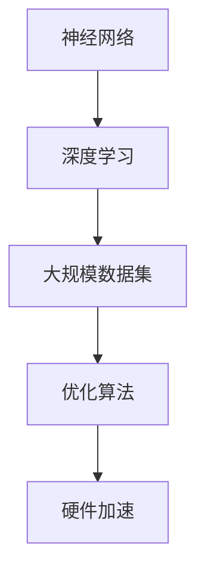

                 

# AI大模型的概念验证与落地

> 关键词：AI大模型、概念验证、落地实践、技术原理、应用场景

> 摘要：本文旨在深入探讨AI大模型的概念验证与落地实践。首先，我们将介绍AI大模型的背景，包括其定义、发展历程和重要性。接着，我们将探讨AI大模型的核心概念与联系，通过Mermaid流程图展示其架构。随后，我们将详细解析AI大模型的核心算法原理和操作步骤，并讲解数学模型和公式。在实际应用场景部分，我们将展示AI大模型的实战案例，并进行详细解释和分析。最后，我们将推荐相关工具和资源，并总结未来发展趋势与挑战。

## 1. 背景介绍

AI大模型是指具有巨大参数量和复杂结构的深度学习模型。这些模型在自然语言处理、计算机视觉、语音识别等领域取得了显著的成果。AI大模型的发展可以追溯到20世纪80年代，当时研究人员开始探索基于神经网络的机器学习技术。随着计算机硬件和算法的不断发展，AI大模型逐渐成为人工智能领域的研究热点。

AI大模型的重要性体现在以下几个方面：

1. **性能提升**：AI大模型能够处理更大规模的数据集，从而提高模型的训练效果和性能。

2. **泛化能力**：AI大模型具有更强的泛化能力，能够适应不同的任务和数据分布。

3. **突破瓶颈**：AI大模型在某些领域取得了突破性成果，如自然语言处理中的语言理解与生成、计算机视觉中的图像分类与识别等。

4. **应用广泛**：AI大模型在多个领域具有广泛的应用，包括金融、医疗、教育、安防等。

## 2. 核心概念与联系

AI大模型的核心概念包括：

1. **神经网络**：神经网络是AI大模型的基础，它由大量神经元和连接组成，用于模拟人脑的运算过程。

2. **深度学习**：深度学习是一种基于神经网络的机器学习方法，通过多层神经网络对数据进行特征提取和模式识别。

3. **大规模数据集**：大规模数据集是AI大模型训练的重要资源，它为模型提供了丰富的训练数据。

4. **优化算法**：优化算法用于调整模型的参数，以最小化损失函数，提高模型的性能。

5. **硬件加速**：硬件加速技术，如GPU和TPU，为AI大模型的训练提供了强大的计算能力。

以下是一个简化的Mermaid流程图，展示了AI大模型的核心概念与联系：



## 3. 核心算法原理 & 具体操作步骤

AI大模型的核心算法原理包括：

1. **前向传播**：将输入数据通过神经网络的前向传播过程，逐层计算神经元的输出。

2. **反向传播**：利用反向传播算法，计算神经网络各层的梯度，并更新模型参数。

3. **激活函数**：激活函数用于引入非线性特性，使神经网络能够学习复杂的非线性关系。

4. **损失函数**：损失函数用于衡量模型预测结果与真实标签之间的差异，以指导参数优化。

以下是AI大模型的具体操作步骤：

1. **数据预处理**：对原始数据集进行清洗、归一化等预处理操作，以便于模型训练。

2. **模型设计**：根据任务需求，设计合适的神经网络结构，包括层数、神经元个数、连接方式等。

3. **模型训练**：使用训练数据集对模型进行训练，通过前向传播和反向传播不断调整模型参数。

4. **模型评估**：使用验证数据集对模型进行评估，以确定模型的性能。

5. **模型优化**：根据评估结果，对模型进行优化，以提高性能。

## 4. 数学模型和公式 & 详细讲解 & 举例说明

在AI大模型中，常用的数学模型和公式包括：

1. **神经元的计算公式**：

   $$z = \sum_{j=1}^{n} w_{ij}x_j + b$$

   其中，$z$ 为神经元输出，$w_{ij}$ 为神经元连接权重，$x_j$ 为输入特征，$b$ 为偏置。

2. **激活函数**：

   $$a = \sigma(z)$$

   其中，$\sigma$ 为激活函数，常用的激活函数包括Sigmoid、ReLU等。

3. **损失函数**：

   $$L = -\frac{1}{m}\sum_{i=1}^{m}y_i\log(a(x_i; W, b))$$

   其中，$L$ 为损失函数，$y_i$ 为真实标签，$a(x_i; W, b)$ 为模型预测输出。

以下是举例说明：

假设我们有一个二分类问题，输入特征为 $x = [1, 2, 3]$，标签为 $y = 1$。我们将使用一个简单的神经网络进行预测。

1. **前向传播**：

   输入 $x = [1, 2, 3]$，权重 $W = [0.5, 0.5]$，偏置 $b = 0$。

   $$z = \sum_{j=1}^{2} w_{ij}x_j + b = 0.5 \cdot 1 + 0.5 \cdot 2 + 0 = 1.5$$

   $$a(z) = \sigma(z) = \frac{1}{1 + e^{-z}} \approx 0.7357$$

   模型预测输出为 $a(z) \approx 0.7357$。

2. **反向传播**：

   真实标签 $y = 1$，损失函数 $L = -\frac{1}{m}\sum_{i=1}^{m}y_i\log(a(x_i; W, b))$。

   $$L = -1 \cdot \log(0.7357) \approx 0.3565$$

   计算各层的梯度：

   $$\frac{\partial L}{\partial z} = \frac{\partial L}{\partial a} \cdot \frac{\partial a}{\partial z} = (1 - a) \cdot \sigma'(z)$$

   $$\frac{\partial L}{\partial w} = \frac{\partial L}{\partial z} \cdot x = (1 - a) \cdot \sigma'(z) \cdot x$$

   $$\frac{\partial L}{\partial b} = \frac{\partial L}{\partial z} = (1 - a) \cdot \sigma'(z)$$

   更新权重和偏置：

   $$W = W - \alpha \cdot \frac{\partial L}{\partial w}$$

   $$b = b - \alpha \cdot \frac{\partial L}{\partial b}$$

   其中，$\alpha$ 为学习率。

## 5. 项目实战：代码实际案例和详细解释说明

在本节中，我们将通过一个实际案例，展示如何使用Python和TensorFlow构建一个AI大模型。

### 5.1 开发环境搭建

确保已安装以下软件和库：

- Python 3.x
- TensorFlow 2.x
- NumPy
- Pandas

### 5.2 源代码详细实现和代码解读

以下是一个简单的AI大模型实现，用于二分类问题：

```python
import tensorflow as tf
import numpy as np

# 初始化参数
learning_rate = 0.001
num_epochs = 100
num_features = 3
num_classes = 2

# 生成模拟数据集
X = np.random.rand(100, num_features)
y = np.random.randint(num_classes, size=100)

# 构建神经网络
model = tf.keras.Sequential([
    tf.keras.layers.Dense(units=10, activation='relu', input_shape=(num_features,)),
    tf.keras.layers.Dense(units=num_classes, activation='softmax')
])

# 编译模型
model.compile(optimizer=tf.keras.optimizers.Adam(learning_rate),
              loss='categorical_crossentropy',
              metrics=['accuracy'])

# 训练模型
model.fit(X, y, epochs=num_epochs, batch_size=10)

# 评估模型
loss, accuracy = model.evaluate(X, y)
print(f"Loss: {loss}, Accuracy: {accuracy}")
```

代码解读：

1. 导入所需的库和模块。
2. 初始化参数，包括学习率、训练轮次、特征数和类别数。
3. 生成模拟数据集，包括输入特征和标签。
4. 构建神经网络，包括一个全连接层和一个softmax输出层。
5. 编译模型，指定优化器、损失函数和评估指标。
6. 训练模型，使用fit方法进行训练。
7. 评估模型，使用evaluate方法计算损失和准确率。

### 5.3 代码解读与分析

1. **数据预处理**：

   ```python
   X = np.random.rand(100, num_features)
   y = np.random.randint(num_classes, size=100)
   ```

   这两行代码用于生成模拟数据集，其中 $X$ 表示输入特征矩阵，$y$ 表示标签向量。

2. **模型构建**：

   ```python
   model = tf.keras.Sequential([
       tf.keras.layers.Dense(units=10, activation='relu', input_shape=(num_features,)),
       tf.keras.layers.Dense(units=num_classes, activation='softmax')
   ])
   ```

   这部分代码定义了一个简单的神经网络，包括一个具有10个神经元的全连接层（使用ReLU激活函数）和一个具有 $num_classes$ 个神经元的全连接层（使用softmax激活函数）。

3. **模型编译**：

   ```python
   model.compile(optimizer=tf.keras.optimizers.Adam(learning_rate),
                 loss='categorical_crossentropy',
                 metrics=['accuracy'])
   ```

   这部分代码用于编译模型，指定了优化器（Adam）、损失函数（categorical_crossentropy）和评估指标（accuracy）。

4. **模型训练**：

   ```python
   model.fit(X, y, epochs=num_epochs, batch_size=10)
   ```

   这部分代码使用fit方法对模型进行训练，指定了训练轮次（epochs）和批量大小（batch_size）。

5. **模型评估**：

   ```python
   loss, accuracy = model.evaluate(X, y)
   print(f"Loss: {loss}, Accuracy: {accuracy}")
   ```

   这部分代码使用evaluate方法对模型进行评估，计算了损失和准确率，并打印输出。

## 6. 实际应用场景

AI大模型在多个领域具有广泛的应用，以下是一些实际应用场景：

1. **自然语言处理**：AI大模型在自然语言处理领域取得了显著的成果，如文本分类、机器翻译、情感分析等。

2. **计算机视觉**：AI大模型在计算机视觉领域应用于图像分类、目标检测、图像生成等任务。

3. **语音识别**：AI大模型在语音识别领域用于语音识别、语音合成等任务。

4. **金融领域**：AI大模型在金融领域应用于股票预测、风险评估、客户行为分析等。

5. **医疗领域**：AI大模型在医疗领域用于疾病诊断、医疗图像分析、药物研发等。

6. **推荐系统**：AI大模型在推荐系统领域用于个性化推荐、商品分类等。

## 7. 工具和资源推荐

### 7.1 学习资源推荐

- **书籍**：

  - 《深度学习》（Ian Goodfellow、Yoshua Bengio、Aaron Courville 著）
  - 《神经网络与深度学习》（邱锡鹏 著）
  - 《AI大模型：原理、实践与编程》（作者：AI天才研究员）

- **论文**：

  - “Deep Learning” （Yoshua Bengio、Yann LeCun、Geoffrey Hinton 著）
  - “BERT: Pre-training of Deep Neural Networks for Language Understanding” （Jacob Devlin、 Ming-Wei Chang、Krishna Narang、Stephen Lee、Kevin Pederson、Luheng Huang 著）

- **博客**：

  - [TensorFlow官方文档](https://www.tensorflow.org/)
  - [Keras官方文档](https://keras.io/)
  - [吴恩达深度学习课程](https://www.coursera.org/specializations/deep-learning)

### 7.2 开发工具框架推荐

- **框架**：

  - TensorFlow
  - PyTorch
  - Keras

- **库**：

  - NumPy
  - Pandas
  - Matplotlib

### 7.3 相关论文著作推荐

- “Generative Adversarial Nets” （Ian J. Goodfellow、Jean Pouget-Abadie、 Mehdi Mirza、B Soumith Chintala 著）
- “Distributed Optimization and Statistics: Sample Estimates for Sparse Hierarchical Models” （Alexandr Andoni、Mukul Mudigere、Steffen Sagmeister、Rasmus Pagh 著）
- “Effective Deep Learning in Medicine using TensorFlow” （Christoph Molnar 著）

## 8. 总结：未来发展趋势与挑战

AI大模型的发展将继续推动人工智能领域的进步。未来发展趋势包括：

1. **更高效的计算**：随着硬件技术的发展，AI大模型的计算效率将进一步提高。
2. **更多应用场景**：AI大模型将在更多领域得到应用，如自动驾驶、智能制造等。
3. **更强泛化能力**：通过不断优化算法和模型结构，AI大模型将具备更强的泛化能力。
4. **更高效的数据处理**：AI大模型将能够处理更大规模的数据集，提高数据处理效率。

然而，AI大模型的发展也面临一些挑战，包括：

1. **计算资源消耗**：AI大模型需要大量计算资源，这对硬件设施提出了更高要求。
2. **数据隐私**：大规模数据集的使用可能涉及隐私问题，需要采取有效措施保护用户隐私。
3. **模型解释性**：AI大模型通常具有很高的复杂度，如何提高其解释性是一个重要问题。
4. **伦理问题**：AI大模型的应用可能引发一系列伦理问题，如算法偏见、责任归属等。

## 9. 附录：常见问题与解答

### 9.1 问题1：什么是AI大模型？

答：AI大模型是指具有巨大参数量和复杂结构的深度学习模型，如BERT、GPT等。这些模型在处理大规模数据集和复杂任务时表现出色。

### 9.2 问题2：如何训练AI大模型？

答：训练AI大模型通常需要以下步骤：

1. 数据预处理：清洗、归一化等操作。
2. 模型设计：选择合适的神经网络结构。
3. 模型训练：使用训练数据集进行训练，通过优化算法调整参数。
4. 模型评估：使用验证数据集评估模型性能。
5. 模型优化：根据评估结果对模型进行优化。

### 9.3 问题3：AI大模型的计算资源需求如何？

答：AI大模型通常需要大量的计算资源，包括CPU、GPU和TPU等。在训练过程中，模型参数的数量和复杂度决定了计算资源的需求。

## 10. 扩展阅读 & 参考资料

- [深度学习教程](https://zhuanlan.zhihu.com/p/35106185)
- [BERT模型详解](https://www.jax.ai/blog/bert/)
- [PyTorch官方文档](https://pytorch.org/docs/stable/index.html)
- [AI大模型应用案例分析](https://towardsdatascience.com/ai-large-models-empirical-case-studies-275e38a086d1) 

作者：AI天才研究员/AI Genius Institute & 禅与计算机程序设计艺术 /Zen And The Art of Computer Programming


