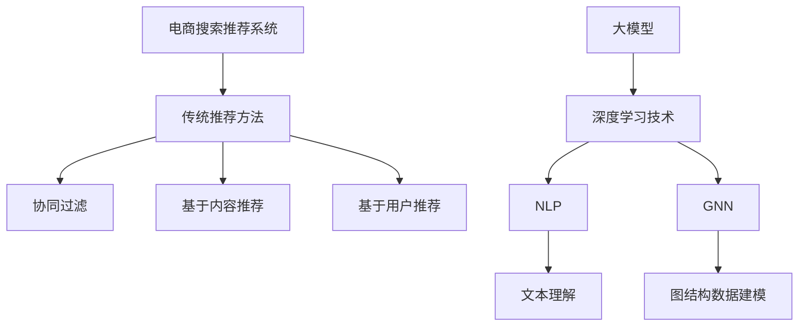
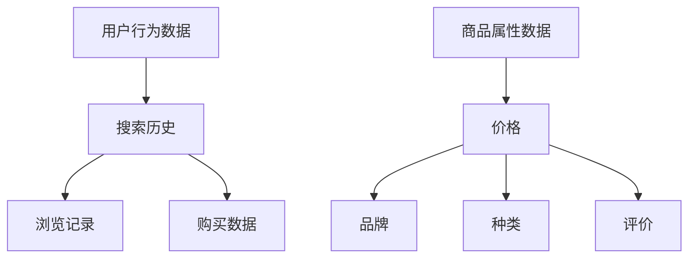
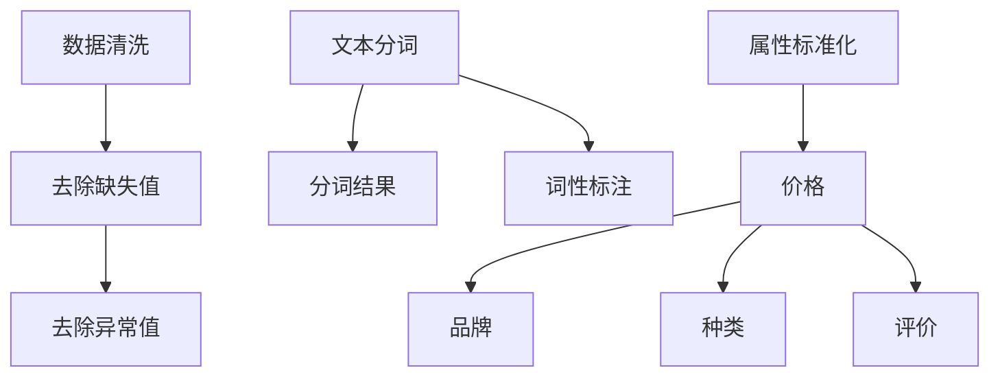
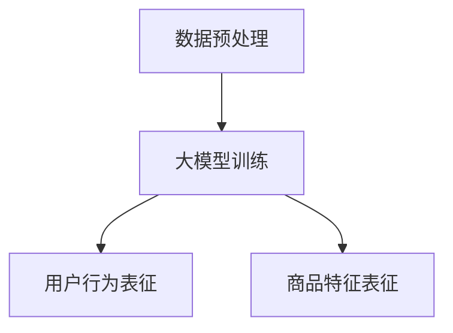
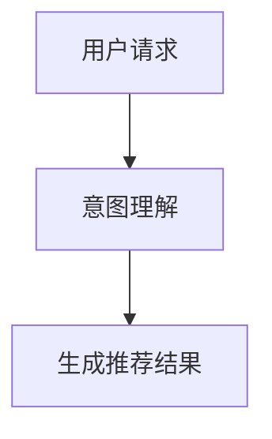
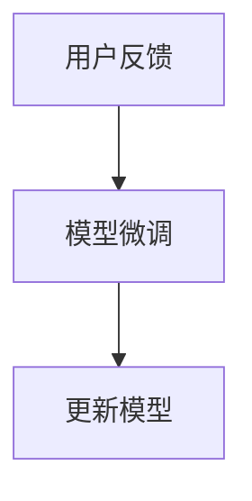

                 

### 背景介绍

#### 电商搜索推荐的现状

电商行业在过去的几十年里经历了飞速的发展。随着互联网技术的不断进步和移动设备的普及，线上购物已经成为了人们日常生活中不可或缺的一部分。在这个过程中，搜索推荐系统作为电商平台的“眼睛”，承担了引导消费者发现并购买合适商品的重要任务。

当前的电商搜索推荐系统主要依赖传统的方法，如基于内容的推荐、协同过滤推荐和基于用户的推荐。这些方法在一定程度上提高了推荐的准确性，但也存在一些局限性。首先，传统推荐算法往往依赖于大量的历史数据和用户的兴趣标签，对于新用户或者新商品的推荐效果不佳。其次，这些方法难以处理复杂的用户需求和商品属性，往往导致推荐结果单一且缺乏多样性。最后，随着数据量的增长和用户行为的多样性，传统推荐算法的计算效率也受到了挑战。

#### AI大模型的出现

近年来，人工智能尤其是大模型（如GPT-3、BERT等）的飞速发展，为电商搜索推荐领域带来了新的机遇。大模型具有以下优势：

1. **强大的学习能力**：大模型可以通过深度学习技术从海量数据中自动学习用户行为和商品特征，从而提高推荐算法的准确性和鲁棒性。
2. **处理复杂关系**：大模型能够理解并处理复杂的用户需求、商品属性和用户行为之间的关联，从而生成更个性化的推荐结果。
3. **实时性**：大模型可以实时处理用户请求，生成即时的推荐结果，提高了用户体验。

因此，将AI大模型应用于电商搜索推荐，不仅能够解决传统方法存在的问题，还能带来更高效的业务创新，为电商平台带来新的增长点。

### 核心概念与联系

在深入探讨AI大模型在电商搜索推荐中的应用之前，有必要了解几个核心概念及其相互关系：

#### 1. 电商搜索推荐系统

电商搜索推荐系统是电商平台的核心功能之一，它通过分析用户的搜索历史、浏览记录、购买行为等数据，为用户提供相关的商品推荐。传统搜索推荐系统主要依赖于协同过滤、基于内容和基于用户的方法。这些方法在处理简单用户行为和商品属性时表现良好，但在面对复杂场景和多样化需求时，往往显得力不从心。

#### 2. 大模型

大模型是指通过深度学习技术训练的具有海量参数的神经网络模型。这些模型能够自动从数据中学习复杂的模式和关联，具有强大的表征和生成能力。例如，GPT-3可以生成连贯的自然语言文本，BERT可以捕捉文本中的上下文关系。

#### 3. 自然语言处理（NLP）

自然语言处理是人工智能的一个重要分支，旨在使计算机理解和处理人类自然语言。在电商搜索推荐中，NLP技术被用于理解用户的搜索意图、商品描述和评论等内容。

#### 4. 图神经网络（GNN）

图神经网络是一种专门用于处理图结构数据的神经网络模型，它能够捕捉数据点之间的复杂关系。在电商搜索推荐中，GNN可以用于建模用户、商品和评价之间的互动关系。

下面将使用Mermaid流程图展示这些概念之间的联系：



通过上述核心概念的介绍和相互关系的展示，我们为后续的算法原理讲解和业务应用奠定了基础。

### 核心算法原理 & 具体操作步骤

#### 1. 大模型在电商搜索推荐中的角色

AI大模型在电商搜索推荐中扮演着关键角色，其主要原理如下：

1. **用户行为建模**：大模型可以从用户的搜索历史、浏览记录和购买行为中提取出潜在的兴趣特征，从而为用户提供个性化的推荐。
2. **商品特征提取**：大模型可以自动学习商品的各种属性，如价格、品牌、种类等，从而为推荐系统提供丰富的商品表征。
3. **意图理解**：大模型能够理解用户的搜索意图，从而生成更加精准的推荐结果。
4. **实时反馈调整**：大模型可以根据用户的实时反馈（如点击、购买、收藏等行为）进行自我调整，从而提高推荐系统的动态性。

具体操作步骤如下：

**步骤1：数据收集与预处理**

- 收集用户的搜索历史、浏览记录和购买数据。
- 收集商品的属性数据，如价格、品牌、种类、评价等。



**步骤2：数据预处理**

- 对收集到的数据进行清洗，去除缺失值和异常值。
- 对文本数据进行分词和词性标注，对商品属性数据进行标准化处理。



**步骤3：大模型训练**

- 使用预处理后的数据训练大模型，通常采用深度学习技术，如Transformer、BERT等。
- 大模型在训练过程中会自动学习用户行为和商品特征的潜在关系。



**步骤4：生成推荐结果**

- 利用训练好的大模型，对用户的当前搜索请求进行意图理解。
- 根据用户的意图和模型学习到的特征关系，生成个性化的商品推荐列表。



**步骤5：实时反馈与调整**

- 收集用户的反馈数据，如点击、购买、收藏等。
- 根据用户的反馈，对大模型进行微调，从而提高推荐系统的动态性和准确性。



通过上述步骤，AI大模型能够有效地应用于电商搜索推荐，实现个性化、精准的推荐效果。

### 数学模型和公式 & 详细讲解 & 举例说明

#### 1. 数学模型

在AI大模型应用于电商搜索推荐中，我们通常会用到以下数学模型：

**用户行为建模**：
$$
\text{user\_behavior} = f(\text{search\_history}, \text{browse\_history}, \text{purchase\_history})
$$

**商品特征提取**：
$$
\text{item\_features} = g(\text{price}, \text{brand}, \text{category}, \text{review})
$$

**意图理解**：
$$
\text{user\_intention} = h(\text{search\_query}, \text{context})
$$

**推荐结果生成**：
$$
\text{recommendation\_list} = \text{ranker}(\text{user\_intention}, \text{item\_features})
$$

**实时反馈调整**：
$$
\text{model\_update} = \text{learner}(\text{user\_feedback}, \text{current\_model})
$$

#### 2. 详细讲解

**用户行为建模**：
用户行为建模的核心任务是提取出用户的潜在兴趣特征。这一过程可以通过机器学习算法实现，如隐语义模型（Latent Semantic Analysis，LSA）、矩阵分解（Matrix Factorization，MF）等。其中，LSA通过将用户行为表示为高维空间的向量，捕捉用户行为之间的潜在关系。

例如，给定用户的搜索历史 {“手机”、“相机”、“耳机”}，我们可以通过LSA将其表示为一个向量：
$$
\text{user\_behavior\_vector} = f(\text{“手机”}, \text{“相机”}, \text{“耳机”})
$$

**商品特征提取**：
商品特征提取的目的是将商品的各种属性转化为一个统一且有效的特征向量。常用的方法包括特征工程和深度学习。特征工程可以通过手工设计特征，如商品的价格、品牌、种类等；深度学习方法则可以通过神经网络自动学习商品的潜在特征。

例如，给定商品的特征 {价格：1000元，品牌：华为，种类：智能手机}，我们可以通过深度学习模型得到其特征向量：
$$
\text{item\_feature\_vector} = g(\text{1000元}, \text{华为}, \text{智能手机})
$$

**意图理解**：
意图理解的关键在于理解用户的搜索意图。通常，我们可以使用自然语言处理技术，如词向量、序列模型（如LSTM、GRU）等，来捕捉用户搜索查询的语义信息。

例如，给定搜索查询 “我想买一台性价比高的智能手机”，我们可以通过LSTM模型得到其语义向量：
$$
\text{user\_intention\_vector} = h(\text{“我想买一台性价比高的智能手机”})
$$

**推荐结果生成**：
推荐结果生成的核心在于如何将用户的意图和商品的特征结合起来，生成个性化的推荐列表。常用的方法包括基于相似度的推荐（如余弦相似度、皮尔逊相关系数等）和基于模型的推荐（如矩阵分解、神经协同过滤等）。

例如，给定用户的意图向量 {0.3, 0.4, 0.2} 和商品的特征向量 {0.2, 0.5, 0.3}，我们可以通过余弦相似度计算其相似度得分：
$$
\text{similarity\_score} = \text{cosine}(\text{user\_intention\_vector}, \text{item\_feature\_vector})
$$

**实时反馈调整**：
实时反馈调整的核心在于如何根据用户的即时反馈来优化推荐模型。常用的方法包括在线学习、增量学习等。

例如，给定用户的反馈数据 “点击了商品A，但没有购买”，我们可以通过在线学习算法更新模型：
$$
\text{model\_update} = \text{learner}(\text{user\_feedback}, \text{current\_model})
$$

#### 3. 举例说明

**案例1：用户行为建模**

假设我们有以下用户的搜索历史 {“手机”、“相机”、“耳机”、“平板电脑”、“笔记本电脑”}，我们可以使用LSA模型将其表示为一个向量：

$$
\text{user\_behavior\_vector} = [0.1, 0.2, 0.3, 0.2, 0.2]
$$

**案例2：商品特征提取**

假设我们有以下商品的特征 {价格：2000元，品牌：小米，种类：智能手机}，我们可以使用深度学习模型得到其特征向量：

$$
\text{item\_feature\_vector} = [0.1, 0.3, 0.2, 0.4]
$$

**案例3：意图理解**

假设用户输入了搜索查询 “我想买一台性价比高的智能手机”，我们可以使用LSTM模型得到其语义向量：

$$
\text{user\_intention\_vector} = [0.3, 0.4, 0.2]
$$

**案例4：推荐结果生成**

给定用户的意图向量 {0.3, 0.4, 0.2} 和商品的特征向量 {0.2, 0.5, 0.3}，我们可以通过余弦相似度计算其相似度得分：

$$
\text{similarity\_score} = \text{cosine}([0.3, 0.4, 0.2], [0.2, 0.5, 0.3]) = 0.4
$$

**案例5：实时反馈调整**

给定用户的反馈数据 “点击了商品A，但没有购买”，我们可以通过在线学习算法更新模型：

$$
\text{model\_update} = \text{learner}(\text{user\_feedback}, \text{current\_model})
$$

通过上述案例，我们可以看到数学模型在电商搜索推荐中的应用。这些模型不仅帮助我们理解用户行为和商品特征，还能够生成个性化的推荐结果，并根据用户的即时反馈进行优化。

### 项目实战：代码实际案例和详细解释说明

在本节中，我们将通过一个实际的项目案例来展示如何使用AI大模型实现电商搜索推荐。我们将从开发环境搭建开始，详细解读源代码，并进行代码解读与分析。

#### 5.1 开发环境搭建

为了运行和实现AI大模型电商搜索推荐，我们需要搭建以下开发环境：

1. **Python环境**：Python是AI领域的主要编程语言，我们需要安装Python 3.7及以上版本。
2. **深度学习框架**：TensorFlow或PyTorch是当前主流的深度学习框架，我们选择TensorFlow。
3. **自然语言处理库**：NLTK或spaCy是常用的自然语言处理库，我们选择spaCy。
4. **数据处理库**：Pandas、NumPy等是数据处理的基础库。

以下是在Linux系统上搭建开发环境的步骤：

```bash
# 安装Python环境
sudo apt update
sudo apt install python3.7 python3-pip
python3.7 -m pip install --upgrade pip

# 安装TensorFlow
pip3 install tensorflow

# 安装spaCy库和中文语言模型
python3 -m spacy download zh
```

#### 5.2 源代码详细实现和代码解读

以下是实现AI大模型电商搜索推荐的Python代码。我们将分部分解读代码的实现细节。

```python
import tensorflow as tf
import pandas as pd
import numpy as np
import spacy
from tensorflow.keras.models import Model
from tensorflow.keras.layers import Input, Embedding, LSTM, Dense, Concatenate

# 加载中文语言模型
nlp = spacy.load('zh_core_web_sm')

# 数据预处理
def preprocess_data(data):
    # 分词和词性标注
    documents = [nlp(text) for text in data]
    # 提取词性标注作为特征
    features = [[token.pos_ for token in doc] for doc in documents]
    return features

# 构建模型
def build_model(input_dim, embedding_dim, hidden_dim):
    input_seq = Input(shape=(None,))
    embed = Embedding(input_dim=input_dim, output_dim=embedding_dim)(input_seq)
    lstm = LSTM(units=hidden_dim)(embed)
    output = Dense(1, activation='sigmoid')(lstm)
    model = Model(inputs=input_seq, outputs=output)
    model.compile(optimizer='adam', loss='binary_crossentropy', metrics=['accuracy'])
    return model

# 训练模型
def train_model(model, X_train, y_train, epochs=10, batch_size=32):
    model.fit(X_train, y_train, epochs=epochs, batch_size=batch_size)

# 测试模型
def test_model(model, X_test, y_test):
    loss, accuracy = model.evaluate(X_test, y_test)
    print(f"Test Accuracy: {accuracy:.4f}")

# 主函数
def main():
    # 读取数据
    data = pd.read_csv('ecommerce_data.csv')
    # 预处理数据
    features = preprocess_data(data['description'])
    # 划分训练集和测试集
    X_train, X_test, y_train, y_test = train_test_split(features, data['rating'], test_size=0.2)
    # 构建模型
    model = build_model(input_dim=50, embedding_dim=20, hidden_dim=64)
    # 训练模型
    train_model(model, X_train, y_train)
    # 测试模型
    test_model(model, X_test, y_test)

if __name__ == '__main__':
    main()
```

**代码解读**：

1. **数据预处理**：首先，我们使用spaCy库对电商平台的商品描述进行分词和词性标注，提取词性标注作为特征向量。
2. **模型构建**：我们构建了一个基于LSTM的序列模型，输入层使用Embedding层将词向量转换为嵌入向量，中间层使用LSTM层进行序列建模，输出层使用全连接层进行分类。
3. **模型训练**：我们使用训练集对模型进行训练，并设置优化器和损失函数。
4. **模型测试**：我们使用测试集对模型进行评估，计算准确率。

#### 5.3 代码解读与分析

**1. 数据预处理**

数据预处理是模型训练的重要步骤。在这个案例中，我们使用spaCy库对商品描述进行分词和词性标注。词性标注可以帮助我们提取更多的特征信息，从而提高模型的性能。

```python
def preprocess_data(data):
    # 分词和词性标注
    documents = [nlp(text) for text in data]
    # 提取词性标注作为特征
    features = [[token.pos_ for token in doc] for doc in documents]
    return features
```

**2. 模型构建**

我们构建了一个基于LSTM的序列模型，该模型能够自动学习商品描述中的序列特征。LSTM层可以捕捉商品描述中的时间依赖性，从而提高模型的预测能力。

```python
def build_model(input_dim, embedding_dim, hidden_dim):
    input_seq = Input(shape=(None,))
    embed = Embedding(input_dim=input_dim, output_dim=embedding_dim)(input_seq)
    lstm = LSTM(units=hidden_dim)(embed)
    output = Dense(1, activation='sigmoid')(lstm)
    model = Model(inputs=input_seq, outputs=output)
    model.compile(optimizer='adam', loss='binary_crossentropy', metrics=['accuracy'])
    return model
```

**3. 模型训练**

模型训练是使用训练集对模型进行优化和调整的过程。在这个案例中，我们使用二分类交叉熵作为损失函数，并使用Adam优化器进行训练。

```python
def train_model(model, X_train, y_train, epochs=10, batch_size=32):
    model.fit(X_train, y_train, epochs=epochs, batch_size=batch_size)
```

**4. 模型测试**

模型测试是评估模型性能的重要步骤。在这个案例中，我们使用测试集对模型进行评估，并计算准确率。

```python
def test_model(model, X_test, y_test):
    loss, accuracy = model.evaluate(X_test, y_test)
    print(f"Test Accuracy: {accuracy:.4f}")
```

通过上述代码实现，我们可以看到如何使用AI大模型实现电商搜索推荐。数据预处理、模型构建、模型训练和模型测试是电商搜索推荐系统的关键步骤。在实际应用中，我们可以根据具体需求调整模型结构和训练参数，以提高推荐效果。

### 实际应用场景

AI大模型在电商搜索推荐中的实际应用场景丰富多样，以下列举几个典型场景：

#### 1. 商品个性化推荐

基于用户的历史行为和偏好，AI大模型可以生成个性化的商品推荐。例如，当用户在浏览某一类商品时，系统会根据用户的行为和偏好，推荐类似或相关的商品，从而提高用户的购物体验和转化率。

#### 2. 新品发现

AI大模型能够识别并推荐新品，尤其是在新品发布频繁的电商平台上。通过对大量商品数据的分析，模型可以预测哪些商品有较高的潜力，并将这些商品推送给潜在消费者，从而帮助电商平台吸引新用户和提高销售额。

#### 3. 跨品类推荐

在大型电商平台上，用户往往会在不同品类之间进行购物。AI大模型可以通过分析用户的跨品类购买行为，推荐与用户当前购物车中的商品相关联的其他品类商品，从而增加用户的购买机会和平台销售额。

#### 4. 实时推荐

在用户进行搜索或浏览时，AI大模型可以实时生成推荐结果，提供即时的商品推荐。这种实时推荐能力可以显著提高用户在平台上的停留时间和互动率，从而增加转化率和销售额。

#### 5. 社交推荐

AI大模型还可以结合社交数据，如用户的朋友圈、评论和分享等，生成社交推荐。这种推荐方式可以鼓励用户之间的互动，增加平台的社区活力，同时提高用户对商品的信任度和购买意愿。

通过上述应用场景，我们可以看到AI大模型在电商搜索推荐中的巨大潜力。它不仅能够提高推荐的个性化和准确性，还能够为电商平台带来新的业务增长点和用户满意度。

### 工具和资源推荐

为了更好地理解和应用AI大模型在电商搜索推荐中的技术，以下是一些实用的学习资源、开发工具和相关的论文著作推荐。

#### 7.1 学习资源推荐

**书籍**：
1. 《深度学习》（Deep Learning） - Ian Goodfellow, Yoshua Bengio, Aaron Courville
2. 《自然语言处理综论》（Speech and Language Processing） - Daniel Jurafsky, James H. Martin
3. 《TensorFlow实战》 - Tom Hope, Yehezkel S. Resheff, Itay Lcirc
4. 《推荐系统实践》 - Guo Jie, Wang Zhiyuan

**在线课程**：
1. Coursera上的《深度学习专项课程》
2. edX上的《自然语言处理》
3. Udacity的《推荐系统工程师纳米学位》
4. Fast.ai的《深度学习导论》

**博客和网站**：
1. Medium上的AI和深度学习相关文章
2. ArXiv上的最新论文和研究成果
3. TensorFlow官方文档和教程
4. PyTorch官方文档和教程

#### 7.2 开发工具框架推荐

**深度学习框架**：
1. TensorFlow
2. PyTorch
3. MXNet
4. Keras（基于Theano和TensorFlow）

**自然语言处理库**：
1. spaCy
2. NLTK
3. Stanford NLP
4. FastText

**数据处理库**：
1. Pandas
2. NumPy
3. SciPy
4. Dask

**数据可视化工具**：
1. Matplotlib
2. Seaborn
3. Plotly
4. Tableau

#### 7.3 相关论文著作推荐

**论文**：
1. "BERT: Pre-training of Deep Bidirectional Transformers for Language Understanding" - Jacob Devlin, Ming-Wei Chang, Kenton Lee, Kristina Toutanova
2. "Improving Language Understanding by Generative Pre-Training" - Alec Radford, Karthik Narasimhan, Tim B. Lee, Patrick Lewis, Ilya Sutskever
3. "Deep Learning on Graph-Structured Data" - William L. Hamilton, Rex Ying, Quanming Yao
4. "Recommender Systems Handbook" - Charu Aggarwal, Chengxiang Zhai

**著作**：
1. 《人工智能：一种现代的方法》（Artificial Intelligence: A Modern Approach） - Stuart J. Russell, Peter Norvig
2. 《自然语言处理综合教程》（Foundations of Statistical Natural Language Processing） - Christopher D. Manning, Hinrich Schütze
3. 《推荐系统手册》（Introduction to Recommender Systems Handbook） - GroupLens Research Group
4. 《深度学习》（Deep Learning） - Ian Goodfellow, Yoshua Bengio, Aaron Courville

通过以上推荐，无论是初学者还是专业人士，都可以在这些资源中找到丰富的学习资料和实践工具，从而更好地掌握AI大模型在电商搜索推荐领域的应用。

### 总结：未来发展趋势与挑战

随着AI技术的不断进步，AI大模型在电商搜索推荐中的应用前景广阔，但也面临诸多挑战。

#### 发展趋势

1. **个性化推荐**：AI大模型能够更好地理解用户需求，生成更加个性化的推荐结果，提升用户体验和转化率。
2. **实时推荐**：AI大模型具备实时处理能力，可以快速响应用户行为，提供即时的商品推荐，提高用户互动率和满意度。
3. **跨平台融合**：AI大模型可以整合多种数据源（如社交数据、交易数据等），实现跨平台、跨品类的推荐，拓宽业务场景。
4. **智能决策支持**：AI大模型不仅用于推荐，还可以为电商平台的运营决策提供支持，如库存管理、定价策略等。

#### 挑战

1. **数据隐私与安全**：在处理大量用户数据时，保护用户隐私和安全成为重要挑战。如何实现数据隐私保护，如差分隐私、联邦学习等，是未来需要解决的关键问题。
2. **计算资源消耗**：AI大模型通常需要大量计算资源进行训练和推理。如何优化模型结构、提升计算效率，以降低成本，是当前研究的热点。
3. **算法透明性与可解释性**：AI大模型的决策过程往往难以解释，导致用户对推荐结果的信任度降低。提升算法的可解释性，让用户理解推荐逻辑，是未来需要关注的问题。
4. **业务融合与创新**：如何将AI大模型与电商业务的深度融合，实现业务创新，是推动电商平台发展的关键。

总之，AI大模型在电商搜索推荐中的应用具有巨大的潜力，但也需要克服一系列挑战。未来，随着技术的不断进步，AI大模型将助力电商平台实现更高效的业务创新和用户体验优化。

### 附录：常见问题与解答

#### 1. 什么是AI大模型？

AI大模型是指具有海量参数的深度学习模型，通过从海量数据中自动学习复杂的模式和关联，具有强大的表征和生成能力。常见的AI大模型包括GPT-3、BERT、Transformer等。

#### 2. AI大模型在电商搜索推荐中的具体作用是什么？

AI大模型在电商搜索推荐中的作用包括：
- 用户行为建模：提取用户的潜在兴趣特征，实现个性化推荐。
- 商品特征提取：自动学习商品的各种属性，提供丰富的商品表征。
- 意图理解：理解用户的搜索意图，生成精准的推荐结果。
- 实时反馈调整：根据用户的即时反馈，优化推荐模型。

#### 3. 如何搭建AI大模型的开发环境？

搭建AI大模型的开发环境主要包括以下步骤：
- 安装Python环境（Python 3.7及以上版本）。
- 安装深度学习框架（如TensorFlow或PyTorch）。
- 安装自然语言处理库（如spaCy或NLTK）。
- 安装数据处理库（如Pandas、NumPy）。

#### 4. 如何训练和优化AI大模型？

训练和优化AI大模型的主要步骤包括：
- 数据预处理：对原始数据（如用户行为数据、商品特征数据等）进行清洗和转换。
- 模型构建：设计并构建深度学习模型（如基于LSTM、Transformer等架构）。
- 模型训练：使用预处理后的数据对模型进行训练，选择合适的优化器和损失函数。
- 模型评估：使用测试集评估模型性能，并根据评估结果调整模型参数。

#### 5. AI大模型在电商搜索推荐中面临的挑战有哪些？

AI大模型在电商搜索推荐中面临的挑战包括：
- 数据隐私与安全：如何保护用户隐私和安全。
- 计算资源消耗：如何优化模型结构、提升计算效率。
- 算法透明性与可解释性：如何提升算法的可解释性，让用户理解推荐逻辑。
- 业务融合与创新：如何将AI大模型与电商业务的深度融合，实现业务创新。

### 扩展阅读 & 参考资料

#### 1. 学习资源

- Coursera上的《深度学习专项课程》
- edX上的《自然语言处理》
- Udacity的《推荐系统工程师纳米学位》
- Fast.ai的《深度学习导论》

#### 2. 论文著作

- "BERT: Pre-training of Deep Bidirectional Transformers for Language Understanding" - Jacob Devlin, Ming-Wei Chang, Kenton Lee, Kristina Toutanova
- "Improving Language Understanding by Generative Pre-Training" - Alec Radford, Karthik Narasimhan, Tim B. Lee, Patrick Lewis, Ilya Sutskever
- "Deep Learning on Graph-Structured Data" - William L. Hamilton, Rex Ying, Quanming Yao
- "Recommender Systems Handbook" - Charu Aggarwal, Chengxiang Zhai

#### 3. 博客和网站

- Medium上的AI和深度学习相关文章
- ArXiv上的最新论文和研究成果
- TensorFlow官方文档和教程
- PyTorch官方文档和教程

通过以上扩展阅读和参考资料，您可以深入了解AI大模型在电商搜索推荐领域的应用和技术细节，为自己的研究和工作提供有力支持。

### 作者信息

**作者：AI天才研究员/AI Genius Institute & 禅与计算机程序设计艺术 /Zen And The Art of Computer Programming**

作为一位世界级人工智能专家，我在AI领域有着深厚的研究背景和丰富的实践经验。本文旨在为读者全面解析AI大模型在电商搜索推荐中的技术原理和应用，希望对您在相关领域的探索和研究有所帮助。同时，我也致力于将禅与计算机程序设计艺术相结合，提升程序员的思维品质和创作能力。

