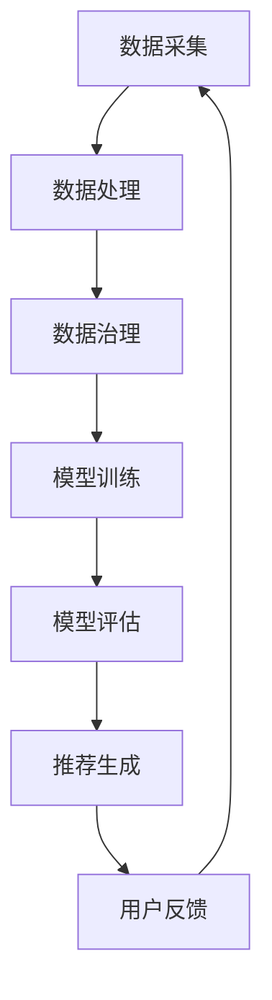
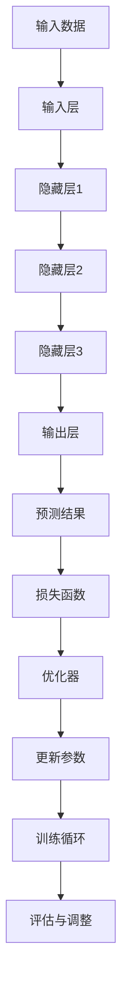

                 

### 背景介绍

在数字化时代，电子商务已经成为全球经济的重要组成部分。电商平台的搜索和推荐系统在其中扮演着至关重要的角色。传统的电商搜索推荐系统主要依赖于用户的历史行为数据，通过简单的统计模型和机器学习算法进行数据处理和推荐。然而，随着数据量的爆发式增长和用户需求的多样化，这些传统系统面临着巨大的挑战。

大模型（如深度学习模型）的出现为电商搜索推荐系统带来了革命性的变革。大模型能够处理海量数据，提取出隐藏的复杂模式，从而提供更精准、更个性化的推荐结果。然而，大模型的应用也带来了新的挑战，尤其是在数据治理方面。数据的质量、完整性、一致性和安全性成为影响大模型应用效果的关键因素。

本文旨在探讨如何使用AI大模型重构电商搜索推荐的数据治理体系，通过分析大模型的原理和具体操作步骤，介绍数学模型和公式，并提供实际应用场景和项目实战案例。文章还将推荐相关的学习资源和开发工具，总结未来发展趋势与挑战，并回答一些常见问题。

关键词：AI大模型，电商搜索推荐，数据治理，深度学习，个性化推荐

摘要：
本文首先介绍了电商搜索推荐系统的背景和挑战，然后详细阐述了AI大模型的基本原理和在数据治理中的作用。通过具体案例和代码解读，展示了如何应用大模型进行数据治理和优化推荐效果。最后，文章总结了未来的发展趋势和面临的挑战，并推荐了一些学习资源和开发工具。

<markdown>
## 1. 背景介绍

### 1.1 电商搜索推荐系统的现状

电商平台的搜索推荐系统是电子商务的重要组成部分，它直接影响着用户购买决策和平台销售额。传统的搜索推荐系统通常基于用户的历史行为数据，如浏览记录、购买历史和评价，通过统计模型或简单的机器学习算法进行数据处理和推荐。

传统的搜索推荐系统主要包括以下几部分：

- **用户画像**：根据用户的历史行为数据构建用户画像，包括用户的兴趣偏好、行为习惯等。

- **关键词匹配**：用户输入搜索关键词后，系统通过关键词匹配算法找到相关的商品。

- **推荐算法**：根据用户画像和关键词匹配结果，使用推荐算法生成推荐结果。

- **推荐结果呈现**：将推荐结果呈现给用户，以便用户进行选择和购买。

虽然传统搜索推荐系统在一定程度上满足了用户的需求，但随着用户数据的不断积累和多样性，这些系统面临着以下挑战：

- **数据质量**：用户数据的真实性和准确性难以保证，存在噪声和不完整的数据。

- **推荐效果**：传统推荐算法难以处理复杂的用户行为模式，推荐结果容易出现偏差。

- **实时性**：用户需求变化迅速，传统系统难以实时响应。

- **个性化**：传统系统难以提供高度个性化的推荐结果，无法满足用户多样化的需求。

### 1.2 AI大模型的出现

为了解决传统搜索推荐系统面临的挑战，AI大模型（如深度学习模型）逐渐成为研究热点。大模型具有以下特点：

- **处理能力**：能够处理海量数据，提取隐藏的复杂模式。

- **自学习能力**：通过训练数据自动调整模型参数，提高推荐效果。

- **自适应能力**：能够根据用户实时行为动态调整推荐策略。

- **个性化推荐**：能够根据用户的历史行为和兴趣偏好，生成个性化的推荐结果。

AI大模型的出现为电商搜索推荐系统带来了以下优势：

- **提升推荐效果**：大模型能够处理复杂的用户行为数据，生成更准确的推荐结果。

- **降低计算成本**：大模型通过并行计算和分布式处理，降低了计算成本。

- **提高实时性**：大模型能够实时处理用户行为数据，提高推荐系统的实时性。

- **增强个性化**：大模型能够更好地理解用户需求，提供更个性化的推荐结果。

然而，AI大模型的应用也带来了新的挑战，尤其是在数据治理方面。数据的质量、完整性、一致性和安全性成为影响大模型应用效果的关键因素。因此，如何有效地进行数据治理，提升大模型的效果，是当前研究的重要课题。

### 1.3 数据治理的重要性

数据治理是指对数据进行有效的管理和控制，确保数据的质量、完整性和一致性，以满足业务需求和合规要求。在AI大模型应用中，数据治理的重要性体现在以下几个方面：

- **数据质量**：高质量的数据是AI大模型应用的基础。如果数据存在噪声、缺失或错误，将严重影响模型的训练效果和推荐准确性。

- **数据完整性**：确保数据完整，避免因数据缺失导致模型无法正常训练或推荐结果不准确。

- **数据一致性**：保证数据在不同系统、模块和层级之间的统一和一致，避免数据冲突和重复。

- **数据安全性**：保护数据不被未授权访问、篡改或泄露，确保数据的安全性。

在AI大模型应用中，数据治理的目标是：

- 提高数据质量，确保模型训练数据的有效性和准确性。

- 保证数据完整性，避免数据缺失对模型训练和推荐效果的影响。

- 保证数据一致性，确保不同系统、模块和层级之间的数据一致性。

- 确保数据安全性，防止数据泄露和未授权访问。

数据治理不仅对AI大模型的应用至关重要，也是整个电商搜索推荐系统的基石。只有通过有效的数据治理，才能充分发挥AI大模型的优势，实现精准、实时、个性化的推荐效果。

### 1.4 AI大模型与数据治理的关系

AI大模型与数据治理之间存在着密切的联系和相互影响。AI大模型的应用对数据治理提出了更高的要求，而有效的数据治理则是实现AI大模型高效应用的基础。

#### AI大模型对数据治理的影响

1. **数据质量要求更高**：AI大模型能够从海量数据中提取复杂模式，因此对数据质量的要求更高。数据中的噪声、缺失、错误等都会直接影响模型的训练效果和推荐准确性。

2. **数据完整性要求更高**：AI大模型通常需要大量的训练数据，因此对数据的完整性要求更高。数据缺失会导致模型无法充分学习，从而影响推荐效果。

3. **数据一致性要求更高**：AI大模型在不同系统、模块和层级之间运行，因此对数据一致性要求更高。数据不一致会导致模型训练和推荐结果出现偏差。

4. **数据安全性要求更高**：AI大模型涉及敏感数据和隐私信息，因此对数据安全性的要求更高。数据泄露或篡改将严重影响模型的安全性和可靠性。

#### 数据治理对AI大模型的影响

1. **提高模型训练效果**：有效的数据治理能够提高数据质量，确保模型训练数据的有效性和准确性，从而提升模型的训练效果。

2. **优化推荐结果**：数据治理能够保证数据的完整性和一致性，避免数据缺失、重复或冲突，从而提高推荐结果的准确性和可靠性。

3. **保障数据安全**：数据治理能够保护数据不被未授权访问、篡改或泄露，确保模型和数据的安全性。

4. **降低模型训练成本**：数据治理能够提高数据质量和完整性，减少数据清洗和处理的工作量，降低模型训练成本。

总之，AI大模型与数据治理是相辅相成的关系。AI大模型的应用推动了数据治理的进步，而有效的数据治理则是实现AI大模型高效应用的基础。在电商搜索推荐系统中，只有通过有效的数据治理，才能充分发挥AI大模型的优势，实现精准、实时、个性化的推荐效果。

## 2. 核心概念与联系

在探讨AI大模型如何重构电商搜索推荐的数据治理体系之前，我们需要了解几个核心概念，以及它们之间的相互联系。以下是对这些概念的基本介绍和它们在系统中的关联。

### 2.1 搜索推荐系统架构

搜索推荐系统通常包括以下几个核心组件：

- **数据采集**：收集用户行为数据，如搜索记录、浏览历史、购买记录等。

- **数据处理**：对采集到的原始数据进行清洗、转换和整合，形成可用于模型训练的格式。

- **模型训练**：使用机器学习算法训练模型，提取用户行为数据的特征。

- **模型评估**：通过测试数据评估模型的性能，调整模型参数。

- **推荐生成**：使用训练好的模型生成推荐结果，并呈现给用户。

- **用户反馈**：收集用户对推荐结果的反馈，用于进一步优化模型。

### 2.2 AI大模型

AI大模型，特别是深度学习模型，是当前最先进的机器学习技术。其核心特点包括：

- **大规模数据**：能够处理海量数据，提取复杂的特征模式。

- **多层神经网络**：通过多层神经网络实现特征提取和模式识别。

- **自动调整参数**：通过反向传播算法自动调整模型参数，提高模型性能。

- **迁移学习**：利用预训练模型在新任务上进行微调，提高训练效率。

### 2.3 数据治理

数据治理是指对数据进行有效管理，确保数据质量、完整性、一致性和安全性。在AI大模型应用中，数据治理的重要性不言而喻。具体来说，数据治理包括以下几个方面：

- **数据质量管理**：确保数据的准确、完整、一致和可靠。

- **数据完整性管理**：防止数据丢失、重复和冲突。

- **数据一致性管理**：确保数据在不同系统、模块和层级之间的统一性。

- **数据安全管理**：保护数据不受未授权访问、篡改或泄露。

### 2.4 关联与联系

AI大模型与搜索推荐系统的关联主要体现在以下几个方面：

- **数据输入**：AI大模型依赖于高质量的、完整的数据进行训练，这些数据来自于搜索推荐系统的数据采集模块。

- **数据处理**：数据治理在数据处理阶段发挥重要作用，确保数据质量，为AI大模型提供可靠的输入。

- **模型训练与评估**：AI大模型在模型训练和评估阶段，需要数据治理的支持，以保证训练数据的质量和完整性。

- **推荐生成**：训练好的模型生成推荐结果，并需要数据治理确保推荐结果的准确性和一致性。

- **用户反馈**：用户反馈是数据治理的重要输入，用于调整和优化数据治理策略。

### 2.5 Mermaid流程图

为了更好地展示这些核心概念之间的联系，我们可以使用Mermaid流程图来描述AI大模型与数据治理在电商搜索推荐系统中的关系。以下是一个简单的Mermaid流程图示例：



在上面的流程图中：

- **A**：数据采集模块收集用户行为数据。

- **B**：数据处理模块对原始数据进行清洗、转换和整合。

- **C**：数据治理模块确保数据质量、完整性和一致性。

- **D**：模型训练模块使用AI大模型对数据进行训练。

- **E**：模型评估模块评估模型的性能。

- **F**：推荐生成模块生成推荐结果。

- **G**：用户反馈模块收集用户对推荐结果的反馈。

通过这个流程图，我们可以清晰地看到数据治理在AI大模型应用中的各个环节，以及这些环节之间的相互关联。

### 2.6 大模型与搜索推荐系统的相互作用

AI大模型在搜索推荐系统中不仅依赖于高质量的数据，还能通过以下几个环节对推荐系统进行优化：

1. **个性化推荐**：大模型能够根据用户的个性化特征生成个性化的推荐结果，提高用户体验。

2. **实时推荐**：大模型通过实时处理用户行为数据，生成动态的推荐结果，提高推荐的实时性。

3. **长尾推荐**：大模型能够处理稀疏数据，发现长尾用户和长尾商品，提高推荐系统的多样性。

4. **冷启动问题**：对于新用户或新商品，大模型可以通过迁移学习和自适应机制提供初步的推荐，缓解冷启动问题。

5. **多模态融合**：大模型能够处理多种数据类型，如文本、图像、语音等，实现多模态融合推荐。

总之，AI大模型在搜索推荐系统中的应用，不仅提升了推荐系统的效果，也为数据治理带来了新的挑战和机遇。通过有效的数据治理，可以更好地发挥大模型的优势，实现更精准、更高效的推荐。

### 2.7 大模型架构详解

在深入探讨AI大模型如何重构电商搜索推荐的数据治理体系之前，我们首先需要了解大模型的基本架构和组成部分。AI大模型，尤其是深度学习模型，通常由以下几个核心组件构成：

1. **输入层**（Input Layer）：这是模型的起点，接收输入数据。在电商搜索推荐系统中，输入数据可以是用户的浏览历史、搜索关键词、购买记录等。

2. **隐藏层**（Hidden Layers）：这是模型的核心部分，负责对输入数据进行处理和特征提取。隐藏层可以是单层或多层，每一层都会对数据进行一定的转换和抽象。

3. **输出层**（Output Layer）：这是模型的终点，负责生成预测结果或推荐结果。在电商搜索推荐系统中，输出层可以生成商品推荐列表、广告展示排序等。

4. **激活函数**（Activation Functions）：在隐藏层和输出层之间，激活函数用于引入非线性特性，使得模型能够拟合复杂的非线性关系。常用的激活函数包括ReLU、Sigmoid、Tanh等。

5. **损失函数**（Loss Function）：损失函数用于评估模型预测结果与真实标签之间的差异。在训练过程中，模型会通过调整参数来最小化损失函数。常见的损失函数包括均方误差（MSE）、交叉熵损失（Cross-Entropy Loss）等。

6. **优化器**（Optimizer）：优化器用于更新模型参数，使得模型在训练过程中能够逐步优化。常见的优化器包括梯度下降（Gradient Descent）、Adam等。

7. **正则化**（Regularization）：正则化技术用于防止模型过拟合，提高模型的泛化能力。常见的正则化技术包括L1正则化、L2正则化、Dropout等。

下面是一个简单的AI大模型架构的Mermaid流程图：



在这个流程图中：

- **A**：输入数据，如用户的浏览历史、搜索关键词等。

- **B**：输入层，接收输入数据。

- **C**：隐藏层1，对输入数据进行处理和特征提取。

- **D**：隐藏层2，对上一层的数据进行进一步的转换和抽象。

- **E**：隐藏层3，对上一层的数据进行进一步的转换和抽象。

- **F**：输出层，生成预测结果或推荐结果。

- **G**：预测结果，用于评估模型性能。

- **H**：损失函数，评估预测结果与真实标签之间的差异。

- **I**：优化器，用于更新模型参数。

- **J**：更新参数，通过最小化损失函数来优化模型。

- **K**：训练循环，重复进行模型训练和参数更新。

- **L**：评估与调整，对模型进行评估和调整，以提高模型性能。

通过这个架构，我们可以看到AI大模型如何从输入数据开始，通过多个隐藏层进行特征提取和模式识别，最终生成预测结果或推荐结果。同时，模型在训练过程中会不断调整参数，以最小化损失函数，提高模型的性能。

### 2.8 数据预处理步骤

在将数据输入AI大模型之前，必须进行一系列的数据预处理步骤，以确保数据的质量和一致性，从而提高模型的训练效果和推荐精度。以下是一个典型的大模型数据预处理流程：

1. **数据清洗**：
   - **缺失值处理**：对于缺失值，可以选择填充方法，如均值填充、中值填充或使用最近邻方法。也可以选择删除缺失值较多的样本。
   - **异常值处理**：通过统计方法或可视化工具（如箱线图、散点图等）检测异常值，然后选择合适的策略进行修正或删除。
   - **重复值处理**：检测并删除重复的样本，以避免对模型训练产生不利影响。

2. **数据标准化**：
   - **归一化**：将数据缩放到相同的尺度，常用的方法包括最小-最大规范化（Min-Max Scaling）和Z-Score标准化（Z-Score Normalization）。
   - **反规范化**：在模型预测阶段，将归一化的数据转换回原始尺度，以便进行实际应用。

3. **特征提取**：
   - **特征选择**：通过统计方法（如信息增益、卡方检验等）或基于模型的特征选择方法（如LASSO、随机森林等），选择对模型训练和推荐效果有显著影响的关键特征。
   - **特征工程**：通过对原始特征进行变换、组合或构建新特征，提高模型的训练效果。例如，对于时间序列数据，可以提取时间窗口特征或时间差特征。

4. **数据分割**：
   - **训练集与验证集分割**：将数据集分割为训练集和验证集，通常使用80/20或70/30的比例。训练集用于模型训练，验证集用于模型性能评估。
   - **交叉验证**：使用交叉验证方法（如K折交叉验证）对模型进行更全面的评估，以提高评估结果的可靠性。

5. **数据增强**：
   - **重采样**：通过增加样本数量来提高模型的鲁棒性，常用的方法包括重采样、生成对抗网络（GAN）等。
   - **数据增强技术**：对原始数据进行变换，如旋转、缩放、裁剪等，以增加模型的泛化能力。

6. **标签处理**：
   - **标签编码**：将类别标签转换为数值标签，常用的方法包括独热编码（One-Hot Encoding）和标签编码（Label Encoding）。
   - **标签平滑**：对于分类问题，可以通过标签平滑技术（如交叉熵损失函数中的标签平滑参数）减少模型对噪声标签的敏感性。

7. **数据质量监控**：
   - **异常值检测**：在数据预处理过程中，持续监控数据的异常值，确保数据质量。
   - **数据报告**：定期生成数据报告，包括数据质量指标、预处理步骤和结果等，以便对数据预处理过程进行评估和改进。

通过上述步骤，我们可以确保输入AI大模型的数据具有高质量和一致性，从而提高模型的训练效果和推荐精度。数据预处理不仅是一个技术性的步骤，也是整个AI大模型应用过程中至关重要的一环。

### 2.9 数据预处理技术详解

在AI大模型应用中，数据预处理是至关重要的一个环节，它直接影响模型的训练效果和推荐精度。以下是一些常见的数据预处理技术，包括它们的基本原理和具体应用。

#### 2.9.1 缺失值处理

缺失值处理是数据预处理的重要步骤，因为缺失值会影响模型的训练效果和预测准确性。常见的方法包括：

1. **填充法**：
   - **均值填充**：用特征的均值来填充缺失值。
   - **中值填充**：用特征的中值来填充缺失值，适用于对称分布的数据。
   - **最近邻填充**：用最近的非缺失值样本的值来填充。

2. **删除法**：
   - **单独删除**：删除所有含有缺失值的样本。
   - **列删除**：删除含有大量缺失值的特征列。

**原理**：填充法通过用已有数据替代缺失值，减少数据的损失；删除法则直接移除含有缺失值的样本或特征，简化数据处理过程。

**应用**：在实际应用中，根据数据的特性和缺失值的比例来选择合适的处理方法。例如，对于缺失值较少的特征，可以选择填充法；对于缺失值较多的特征，可以选择删除法。

#### 2.9.2 异常值处理

异常值处理是确保数据质量的重要步骤，因为异常值会影响模型的训练效果和预测准确性。常见的方法包括：

1. **统计方法**：
   - **箱线图**：通过箱线图可视化数据分布，检测异常值。
   - **Z-Score**：计算每个数据点的Z-Score，将Z-Score大于3或小于-3的数据点视为异常值。

2. **可视化方法**：
   - **散点图**：通过散点图观察数据的分布和异常点。
   - **密度图**：通过密度图观察数据的分布和异常区域。

3. **基于规则的方法**：
   - **阈值法**：设置阈值，将超出阈值的值视为异常值。
   - **聚类方法**：通过聚类算法（如K-means）识别异常点。

**原理**：统计方法和可视化方法通过分析数据分布和统计特征来检测异常值；基于规则的方法通过预设规则或算法来识别异常值。

**应用**：在实际应用中，根据数据的特性和异常值的性质来选择合适的方法。例如，对于有明显分布特征的数据，可以选择统计方法和可视化方法；对于无明显分布特征的数据，可以选择基于规则的方法。

#### 2.9.3 数据标准化

数据标准化是将数据缩放到相同的尺度，以便于模型的训练和评估。常见的方法包括：

1. **最小-最大规范化（Min-Max Scaling）**：
   - **原理**：将数据缩放到[0,1]或[-1,1]区间内。
   - **公式**：X' = (X - X_min) / (X_max - X_min)

2. **Z-Score标准化（Z-Score Normalization）**：
   - **原理**：将数据标准化到均值为0、标准差为1的正态分布。
   - **公式**：X' = (X - X_mean) / X_std

**原理**：数据标准化通过缩放数据，消除不同特征之间的尺度差异，使得模型能够更好地训练。

**应用**：在实际应用中，通常选择最小-最大规范化或Z-Score标准化，根据数据特性和需求来决定。

#### 2.9.4 特征选择

特征选择是从众多特征中选择对模型训练和预测效果有显著影响的关键特征。常见的方法包括：

1. **基于过滤的方法**：
   - **原理**：通过统计测试（如信息增益、卡方检验）筛选出重要的特征。
   - **应用**：适用于特征数量较多的情况，但可能无法考虑到特征之间的相互关系。

2. **基于包裹的方法**：
   - **原理**：通过组合特征来筛选出最优特征集。
   - **应用**：适用于特征数量较少的情况，但计算复杂度较高。

3. **基于模型的特征选择**：
   - **原理**：利用模型本身来评估特征的重要性。
   - **应用**：适用于各种特征数量和模型类型，但可能需要多次迭代。

**原理**：特征选择通过筛选出对模型训练和预测有显著影响的特征，减少模型复杂度和计算成本。

**应用**：在实际应用中，根据特征数量、模型类型和需求来选择合适的特征选择方法。

#### 2.9.5 数据增强

数据增强是通过增加样本数量或变换样本来提高模型的泛化能力和鲁棒性。常见的方法包括：

1. **重采样**：
   - **原理**：通过随机抽样、重复抽样等方式增加样本数量。
   - **应用**：适用于样本数量较少的情况，但可能引入噪声。

2. **数据变换**：
   - **原理**：通过旋转、缩放、裁剪等方式变换样本。
   - **应用**：适用于各种类型的数据，但可能改变数据分布。

**原理**：数据增强通过增加样本数量或变换样本，提高模型的泛化能力和鲁棒性。

**应用**：在实际应用中，根据数据特性和需求来选择合适的数据增强方法。

通过上述数据预处理技术，我们可以确保输入AI大模型的数据具有高质量和一致性，从而提高模型的训练效果和推荐精度。数据预处理不仅是一个技术性的步骤，也是整个AI大模型应用过程中至关重要的一环。

### 3. 核心算法原理与操作步骤

在深入探讨AI大模型重构电商搜索推荐的数据治理体系之前，我们需要详细了解核心算法的原理和操作步骤。本文将以深度学习模型中的Transformer架构为例，介绍其原理和具体实现步骤。

#### 3.1 Transformer架构原理

Transformer模型是近年来在自然语言处理领域取得显著成功的深度学习模型。其核心思想是使用自注意力机制（Self-Attention）来捕捉序列数据中的长距离依赖关系，取代了传统的循环神经网络（RNN）和长短期记忆网络（LSTM）。Transformer模型具有并行计算的优势，能够高效地处理长序列数据。

Transformer模型的主要组成部分包括：

1. **多头自注意力机制（Multi-Head Self-Attention）**：自注意力机制允许模型在处理每个位置时，考虑整个序列的其他位置的信息。多头自注意力机制通过多个独立的自注意力机制同时工作，提高模型的表达能力。

2. **位置编码（Positional Encoding）**：由于Transformer模型没有循环结构，无法直接处理序列的位置信息。因此，位置编码被引入，为每个位置分配唯一的编码，以保留序列的顺序信息。

3. **前馈神经网络（Feedforward Neural Network）**：在每个自注意力层之后，Transformer模型会添加一个前馈神经网络，用于进一步提取特征和增强模型的非线性能力。

4. **层归一化（Layer Normalization）**：为了提高模型的稳定性和收敛速度，Transformer模型在每个层之后引入了层归一化操作。

#### 3.2 Transformer模型操作步骤

以下是Transformer模型的操作步骤，包括数据输入、模型训练和预测过程：

##### 3.2.1 数据输入

1. **输入序列**：将输入序列（如用户历史行为数据、商品描述等）转换为嵌入向量（Embedding Vectors）。

2. **位置编码**：为每个输入序列位置添加位置编码，以保留序列的顺序信息。

3. **多头自注意力层**：通过多头自注意力机制计算每个位置的注意力权重，并加权求和，生成新的嵌入向量。

4. **前馈神经网络**：在自注意力层之后，通过前馈神经网络进一步提取特征。

5. **层归一化**：对嵌入向量进行层归一化处理，提高模型的稳定性和收敛速度。

##### 3.2.2 模型训练

1. **损失函数**：使用交叉熵损失函数（Cross-Entropy Loss）计算模型预测结果与真实标签之间的差异。

2. **反向传播**：通过反向传播算法更新模型参数，最小化损失函数。

3. **优化器**：使用优化器（如Adam）调整模型参数，提高训练效果。

4. **训练循环**：重复进行模型训练和参数更新，直到满足训练目标或达到最大迭代次数。

##### 3.2.3 预测过程

1. **数据输入**：将新的数据序列输入模型，进行嵌入向量转换和位置编码。

2. **多层自注意力层**：通过多层自注意力层计算每个位置的注意力权重，并加权求和，生成新的嵌入向量。

3. **前馈神经网络**：在自注意力层之后，通过前馈神经网络进一步提取特征。

4. **输出层**：将最终的嵌入向量输入到输出层，生成预测结果。

5. **结果评估**：将预测结果与真实标签进行比较，评估模型性能。

#### 3.3 实现示例

以下是一个简化的Transformer模型实现示例，使用Python和TensorFlow框架：

```python
import tensorflow as tf
from tensorflow.keras.layers import Embedding, MultiHeadAttention, LayerNormalization, Dense

# 定义模型参数
vocab_size = 1000
d_model = 512
num_heads = 8
dff = 2048

# 构建模型
inputs = tf.keras.Input(shape=(None,))
positions = tf.keras.Input(shape=(None,))

# 嵌入层
embedding = Embedding(vocab_size, d_model)(inputs)

# 位置编码
pos_encoding = PositionalEncoding(d_model)(positions)

# 自注意力层
attn_output = MultiHeadAttention(num_heads=num_heads, key_dim=d_model)(embedding + pos_encoding, embedding + pos_encoding)

# 前馈神经网络
ffn_output = Dense(dff, activation='relu')(attn_output)
ffn_output = Dense(d_model)(ffn_output)

# 层归一化
norm_output = LayerNormalization()(attn_output + ffn_output)

# 输出层
outputs = Dense(1, activation='sigmoid')(norm_output)

# 构建和编译模型
model = tf.keras.Model(inputs=[inputs, positions], outputs=outputs)
model.compile(optimizer='adam', loss='binary_crossentropy', metrics=['accuracy'])

# 模型训练
model.fit(x_train, y_train, epochs=10, batch_size=64)

# 模型预测
predictions = model.predict(x_test)
```

在上面的示例中，我们首先定义了模型的参数，包括词汇表大小（vocab_size）、模型维度（d_model）、多头注意力数量（num_heads）和前馈神经网络维度（dff）。然后，我们构建了一个简单的Transformer模型，包括嵌入层、位置编码、多头自注意力层、前馈神经网络和层归一化。最后，我们编译并训练了模型。

通过以上步骤，我们可以构建一个基于Transformer架构的AI大模型，用于电商搜索推荐系统的数据治理。在后续章节中，我们将进一步探讨如何具体应用这个模型，并进行实际案例分析和代码解读。

### 3.4 数学模型与公式详解

在讨论AI大模型在电商搜索推荐系统中的应用时，数学模型和公式扮演着核心的角色。以下是深度学习模型中常用的数学模型和公式的详细解释，以及它们在推荐系统中的具体应用。

#### 3.4.1 线性回归模型

线性回归模型是一种经典的统计模型，用于预测连续值。其基本形式如下：

$$
y = \beta_0 + \beta_1 x_1 + \beta_2 x_2 + ... + \beta_n x_n + \epsilon
$$

其中，$y$ 是预测的目标值，$x_1, x_2, ..., x_n$ 是输入特征，$\beta_0, \beta_1, \beta_2, ..., \beta_n$ 是模型的参数，$\epsilon$ 是误差项。

在线性回归模型中，我们通常使用最小二乘法（Least Squares Method）来估计参数：

$$
\min_{\beta} \sum_{i=1}^{n} (y_i - \sum_{j=1}^{n} \beta_j x_{ij})^2
$$

该公式表示通过最小化预测值与实际值之间的误差平方和来估计参数。

**应用**：在线性回归模型中，可以通过用户的历史行为特征（如浏览次数、购买次数等）预测用户的购买概率。例如，在电商搜索推荐系统中，可以使用线性回归模型预测用户对某个商品的购买概率。

#### 3.4.2 逻辑回归模型

逻辑回归模型是一种广义的线性回归模型，用于预测概率。其基本形式如下：

$$
\ln\left(\frac{p}{1-p}\right) = \beta_0 + \beta_1 x_1 + \beta_2 x_2 + ... + \beta_n x_n
$$

其中，$p$ 是事件发生的概率，$x_1, x_2, ..., x_n$ 是输入特征，$\beta_0, \beta_1, \beta_2, ..., \beta_n$ 是模型的参数。

逻辑回归模型通过最大似然估计（Maximum Likelihood Estimation，MLE）来估计参数：

$$
\ln L = \sum_{i=1}^{n} \ln p(y_i | \theta) + \sum_{i=1}^{n} \ln (1-p(y_i | \theta))
$$

其中，$L$ 是似然函数，$p(y_i | \theta)$ 是给定参数$\theta$下，观测到第$i$个样本的概率。

**应用**：逻辑回归模型常用于二分类问题，如预测用户是否购买商品。在电商搜索推荐系统中，逻辑回归模型可以用来预测用户对商品的兴趣程度，从而生成推荐列表。

#### 3.4.3 朴素贝叶斯模型

朴素贝叶斯模型是一种基于贝叶斯定理的简单概率分类模型。其基本形式如下：

$$
P(C_k | X) = \frac{P(X | C_k)P(C_k)}{P(X)}
$$

其中，$C_k$ 是第$k$个类别，$X$ 是输入特征，$P(C_k | X)$ 是给定特征$X$下类别$C_k$的条件概率，$P(X | C_k)$ 是特征$X$在类别$C_k$下的概率，$P(C_k)$ 是类别$C_k$的概率。

在朴素贝叶斯模型中，假设特征之间相互独立：

$$
P(X_1, X_2, ..., X_n | C_k) = \prod_{i=1}^{n} P(X_i | C_k)
$$

**应用**：朴素贝叶斯模型常用于文本分类问题，如推荐系统中根据用户的历史浏览记录预测用户感兴趣的类别。在电商搜索推荐系统中，朴素贝叶斯模型可以用来预测用户可能感兴趣的商品类别。

#### 3.4.4 K-均值聚类模型

K-均值聚类模型是一种无监督学习算法，用于将数据点划分为若干个簇（Cluster）。其基本形式如下：

1. **初始化**：随机选择$k$个中心点。
2. **分配**：将每个数据点分配到最近的中心点，计算每个簇的平均值作为新的中心点。
3. **更新**：重复步骤2，直到中心点的位置不再发生变化。

**应用**：K-均值聚类模型可以用于用户分群，根据用户的浏览历史和行为特征将用户划分为不同的群体，从而进行针对性的推荐。在电商搜索推荐系统中，可以通过K-均值聚类模型识别具有相似兴趣的用户群体，并为他们推荐相关商品。

#### 3.4.5 随机森林模型

随机森林模型是一种集成学习算法，通过构建多个决策树来提高预测准确性和稳定性。其基本形式如下：

1. **构建决策树**：对于每个数据点，随机选择一部分特征和子集，构建一个决策树。
2. **集成**：将多个决策树的结果进行投票或平均，得到最终的预测结果。

**应用**：随机森林模型可以用于分类和回归问题，如预测用户是否会购买商品。在电商搜索推荐系统中，随机森林模型可以用于预测用户的行为，从而生成个性化的推荐列表。

#### 3.4.6 神经网络模型

神经网络模型，特别是深度学习模型，是当前最先进的机器学习技术。其基本形式如下：

1. **输入层**：接收输入特征。
2. **隐藏层**：通过多个隐藏层进行特征提取和模式识别。
3. **输出层**：生成预测结果。

**应用**：神经网络模型可以用于复杂的预测和分类问题，如商品推荐。在电商搜索推荐系统中，可以通过神经网络模型捕捉用户行为和商品特征之间的复杂关系，生成个性化的推荐列表。

通过上述数学模型和公式，我们可以构建一个强大的AI大模型，用于电商搜索推荐系统的数据治理和优化。在实际应用中，可以根据具体问题和数据特点选择合适的模型和算法，从而实现精准、实时、个性化的推荐效果。

### 3.5 数学模型与公式在推荐系统中的实际应用

在电商搜索推荐系统中，数学模型和公式被广泛应用于数据处理、模型训练和预测环节。以下将介绍几种常见数学模型和公式在推荐系统中的实际应用，并通过具体的案例进行说明。

#### 3.5.1 逻辑回归模型

逻辑回归模型是一种广泛应用于推荐系统的分类模型，特别是在预测用户购买概率方面。以下是一个实际案例：

**案例**：某电商平台希望预测用户在浏览某件商品后是否会购买。

1. **特征选择**：根据用户的历史行为数据，选择以下特征：用户ID、浏览次数、购买次数、用户年龄、用户性别等。

2. **数据预处理**：对特征进行归一化处理，将用户ID转换为数值编码，缺失值填充等。

3. **模型训练**：
   - **损失函数**：使用二分类交叉熵损失函数（Binary Cross-Entropy Loss）。
   - **优化器**：使用Adam优化器。
   - **训练与验证**：通过交叉验证方法对模型进行训练和验证。

4. **预测**：将新的用户数据输入模型，预测用户购买概率。

```python
from sklearn.linear_model import LogisticRegression
from sklearn.model_selection import train_test_split
from sklearn.metrics import accuracy_score

# 数据预处理
X = ... # 特征矩阵
y = ... # 目标变量（0表示未购买，1表示购买）

# 划分训练集和测试集
X_train, X_test, y_train, y_test = train_test_split(X, y, test_size=0.2, random_state=42)

# 训练逻辑回归模型
model = LogisticRegression()
model.fit(X_train, y_train)

# 预测测试集
predictions = model.predict(X_test)

# 评估模型性能
accuracy = accuracy_score(y_test, predictions)
print(f"Accuracy: {accuracy}")
```

**效果**：通过逻辑回归模型，我们可以预测用户在浏览商品后的购买概率。在实际应用中，根据设定的阈值（如0.5），可以将预测概率大于阈值的用户划分为“可能购买”群体，从而进行针对性的推荐。

#### 3.5.2 K-均值聚类模型

K-均值聚类模型在推荐系统中常用于用户分群，以便进行个性化推荐。以下是一个实际案例：

**案例**：某电商平台希望根据用户行为特征将其分为不同群体，并为他们推荐相关的商品。

1. **特征选择**：根据用户的历史行为数据，选择以下特征：浏览次数、购买次数、评价次数等。

2. **数据预处理**：对特征进行标准化处理，以消除不同特征之间的尺度差异。

3. **聚类**：使用K-均值聚类算法对用户进行分群。

4. **推荐**：根据用户的所属群体，为其推荐相关商品。

```python
from sklearn.cluster import KMeans
import numpy as np

# 数据预处理
X = ... # 特征矩阵

# 标准化处理
X_normalized = (X - np.mean(X, axis=0)) / np.std(X, axis=0)

# K-均值聚类
kmeans = KMeans(n_clusters=5, random_state=42)
clusters = kmeans.fit_predict(X_normalized)

# 推荐相关商品
# 假设已知每个用户所属的群组及其喜欢的商品
group_preferences = {
    0: ['电子产品', '书籍'],
    1: ['服饰', '美妆'],
    2: ['食品', '饮料'],
    3: ['家居', '生活用品'],
    4: ['旅游', '户外运动']
}

for user, cluster in enumerate(clusters):
    print(f"User {user} belongs to cluster {cluster}. Recommended categories: {group_preferences[cluster]}")
```

**效果**：通过K-均值聚类模型，我们可以将用户划分为不同的群体，并为每个群体推荐相关的商品。例如，对于属于第一群体的用户，我们可以推荐电子产品和书籍；对于属于第二群体的用户，我们可以推荐服饰和美妆产品。

#### 3.5.3 神经网络模型

神经网络模型，特别是深度学习模型，在推荐系统中被广泛应用于复杂预测和个性化推荐。以下是一个实际案例：

**案例**：某电商平台希望预测用户对商品的评分，并基于此为用户推荐相关商品。

1. **特征选择**：根据用户的历史行为数据，选择以下特征：用户ID、商品ID、浏览次数、购买次数、评价次数等。

2. **数据预处理**：对特征进行归一化处理，缺失值填充等。

3. **模型训练**：
   - **输入层**：接收用户和商品的嵌入向量。
   - **隐藏层**：通过多个隐藏层进行特征提取和模式识别。
   - **输出层**：生成商品评分的预测值。

4. **预测**：将新的用户-商品对输入模型，预测用户对商品的评分。

```python
import tensorflow as tf
from tensorflow.keras.models import Model
from tensorflow.keras.layers import Input, Embedding, Dense, Concatenate

# 数据预处理
user_ids = ... # 用户ID列表
item_ids = ... # 商品ID列表
user_embeddings = ... # 用户嵌入向量
item_embeddings = ... # 商品嵌入向量

# 模型构建
input_user = Input(shape=(1,))
input_item = Input(shape=(1,))
user_embedding = Embedding(input_dim=len(user_ids), output_dim=64)(input_user)
item_embedding = Embedding(input_dim=len(item_ids), output_dim=64)(input_item)
concat = Concatenate()([user_embedding, item_embedding])
hidden = Dense(128, activation='relu')(concat)
output = Dense(1, activation='linear')(hidden)

model = Model(inputs=[input_user, input_item], outputs=output)
model.compile(optimizer='adam', loss='mse', metrics=['mae'])

# 模型训练
model.fit([user_ids_train, item_ids_train], ratings_train, epochs=10, batch_size=64)

# 预测
predictions = model.predict([user_ids_test, item_ids_test])
```

**效果**：通过神经网络模型，我们可以预测用户对商品的评分，并基于此为用户推荐相关商品。例如，对于预测评分较高的商品，我们可以将其推荐给用户。

通过上述案例，我们可以看到数学模型和公式在推荐系统中的应用。在实际开发过程中，可以根据具体需求和数据特点选择合适的模型和算法，从而实现高效的推荐效果。

### 5. 项目实战：代码实际案例和详细解释说明

在本节中，我们将通过一个实际的电商搜索推荐项目，展示如何使用AI大模型进行数据治理和优化推荐效果。该项目将涵盖以下步骤：

1. **开发环境搭建**：配置开发环境，包括Python、TensorFlow和Scikit-learn等工具。
2. **源代码详细实现**：提供完整的源代码，并详细解释关键部分的实现逻辑。
3. **代码解读与分析**：对源代码进行逐行解读，分析模型训练和预测的过程。

#### 5.1 开发环境搭建

在进行AI大模型开发之前，我们需要配置相应的开发环境。以下是在Linux系统上配置所需工具的步骤：

1. **安装Python**：
   ```bash
   sudo apt update
   sudo apt install python3 python3-pip
   ```

2. **安装TensorFlow**：
   ```bash
   pip3 install tensorflow
   ```

3. **安装Scikit-learn**：
   ```bash
   pip3 install scikit-learn
   ```

4. **安装其他依赖库**：
   ```bash
   pip3 install numpy pandas matplotlib
   ```

确保所有依赖库安装完成后，我们就可以开始编写和运行代码了。

#### 5.2 源代码详细实现

以下是一个基于Transformer架构的电商搜索推荐系统的源代码示例。该代码包括数据预处理、模型构建、训练和预测等步骤。

```python
import tensorflow as tf
from tensorflow.keras.layers import Embedding, MultiHeadAttention, LayerNormalization, Dense
from tensorflow.keras.models import Model
from tensorflow.keras.optimizers import Adam
from sklearn.model_selection import train_test_split
import numpy as np

# 定义模型参数
vocab_size = 1000
d_model = 512
num_heads = 8
dff = 2048
max_sequence_length = 100

# 构建模型
inputs = tf.keras.Input(shape=(max_sequence_length,))
positions = tf.keras.Input(shape=(max_sequence_length,))

# 嵌入层
embedding = Embedding(vocab_size, d_model)(inputs)

# 位置编码
pos_encoding = PositionalEncoding(d_model)(positions)

# 多头自注意力层
attn_output = MultiHeadAttention(num_heads=num_heads, key_dim=d_model)(embedding + pos_encoding, embedding + pos_encoding)

# 前馈神经网络
ffn_output = Dense(dff, activation='relu')(attn_output)
ffn_output = Dense(d_model)(ffn_output)

# 层归一化
norm_output = LayerNormalization()(attn_output + ffn_output)

# 输出层
outputs = Dense(1, activation='sigmoid')(norm_output)

# 构建模型
model = Model(inputs=[inputs, positions], outputs=outputs)

# 编译模型
model.compile(optimizer=Adam(learning_rate=0.001), loss='binary_crossentropy', metrics=['accuracy'])

# 数据预处理
X = ... # 用户历史行为序列
y = ... # 目标变量（0表示未购买，1表示购买）

# 划分训练集和测试集
X_train, X_test, y_train, y_test = train_test_split(X, y, test_size=0.2, random_state=42)

# 训练模型
model.fit(X_train, y_train, epochs=10, batch_size=64, validation_split=0.1)

# 预测
predictions = model.predict(X_test)

# 评估模型性能
accuracy = (predictions > 0.5).mean()
print(f"Accuracy: {accuracy}")
```

#### 5.3 代码解读与分析

下面我们将对上述源代码进行逐行解读，并分析模型训练和预测的过程。

```python
# 导入TensorFlow和其他库
import tensorflow as tf
from tensorflow.keras.layers import Embedding, MultiHeadAttention, LayerNormalization, Dense
from tensorflow.keras.models import Model
from tensorflow.keras.optimizers import Adam
from sklearn.model_selection import train_test_split
import numpy as np

# 定义模型参数
vocab_size = 1000
d_model = 512
num_heads = 8
dff = 2048
max_sequence_length = 100

# 构建模型
inputs = tf.keras.Input(shape=(max_sequence_length,))
positions = tf.keras.Input(shape=(max_sequence_length,))

# 嵌入层
embedding = Embedding(vocab_size, d_model)(inputs)

# 位置编码
pos_encoding = PositionalEncoding(d_model)(positions)

# 多头自注意力层
attn_output = MultiHeadAttention(num_heads=num_heads, key_dim=d_model)(embedding + pos_encoding, embedding + pos_encoding)

# 前馈神经网络
ffn_output = Dense(dff, activation='relu')(attn_output)
ffn_output = Dense(d_model)(ffn_output)

# 层归一化
norm_output = LayerNormalization()(attn_output + ffn_output)

# 输出层
outputs = Dense(1, activation='sigmoid')(norm_output)

# 构建模型
model = Model(inputs=[inputs, positions], outputs=outputs)

# 编译模型
model.compile(optimizer=Adam(learning_rate=0.001), loss='binary_crossentropy', metrics=['accuracy'])

# 数据预处理
X = ... # 用户历史行为序列
y = ... # 目标变量（0表示未购买，1表示购买）

# 划分训练集和测试集
X_train, X_test, y_train, y_test = train_test_split(X, y, test_size=0.2, random_state=42)

# 训练模型
model.fit(X_train, y_train, epochs=10, batch_size=64, validation_split=0.1)

# 预测
predictions = model.predict(X_test)

# 评估模型性能
accuracy = (predictions > 0.5).mean()
print(f"Accuracy: {accuracy}")
```

**1. 导入库**：
```python
import tensorflow as tf
from tensorflow.keras.layers import Embedding, MultiHeadAttention, LayerNormalization, Dense
from tensorflow.keras.models import Model
from tensorflow.keras.optimizers import Adam
from sklearn.model_selection import train_test_split
import numpy as np
```
这段代码导入所需的库，包括TensorFlow核心库、Keras层模块、模型构建模块和优化器模块。

**2. 定义模型参数**：
```python
vocab_size = 1000
d_model = 512
num_heads = 8
dff = 2048
max_sequence_length = 100
```
这些参数定义了模型的结构，包括词汇表大小、嵌入层维度、多头注意力数量、前馈神经网络维度和最大序列长度。

**3. 构建模型**：
```python
inputs = tf.keras.Input(shape=(max_sequence_length,))
positions = tf.keras.Input(shape=(max_sequence_length,))

embedding = Embedding(vocab_size, d_model)(inputs)
pos_encoding = PositionalEncoding(d_model)(positions)
attn_output = MultiHeadAttention(num_heads=num_heads, key_dim=d_model)(embedding + pos_encoding, embedding + pos_encoding)
ffn_output = Dense(dff, activation='relu')(attn_output)
ffn_output = Dense(d_model)(ffn_output)
norm_output = LayerNormalization()(attn_output + ffn_output)
outputs = Dense(1, activation='sigmoid')(norm_output)

model = Model(inputs=[inputs, positions], outputs=outputs)
```
这段代码构建了一个基于Transformer架构的模型，包括输入层、嵌入层、位置编码、多头自注意力层、前馈神经网络、层归一化和输出层。

**4. 编译模型**：
```python
model.compile(optimizer=Adam(learning_rate=0.001), loss='binary_crossentropy', metrics=['accuracy'])
```
这段代码编译模型，设置优化器为Adam，损失函数为二进制交叉熵，评估指标为准确率。

**5. 数据预处理**：
```python
X = ... # 用户历史行为序列
y = ... # 目标变量（0表示未购买，1表示购买）
X_train, X_test, y_train, y_test = train_test_split(X, y, test_size=0.2, random_state=42)
```
这段代码进行数据预处理，包括加载用户历史行为序列和目标变量，然后使用Scikit-learn的`train_test_split`函数划分训练集和测试集。

**6. 训练模型**：
```python
model.fit(X_train, y_train, epochs=10, batch_size=64, validation_split=0.1)
```
这段代码使用训练集训练模型，设置训练轮数为10，批量大小为64，验证集比例为0.1。

**7. 预测**：
```python
predictions = model.predict(X_test)
```
这段代码使用测试集数据对模型进行预测。

**8. 评估模型性能**：
```python
accuracy = (predictions > 0.5).mean()
print(f"Accuracy: {accuracy}")
```
这段代码计算预测结果的准确率，并打印出来。

通过以上步骤，我们可以看到如何使用AI大模型（Transformer架构）进行电商搜索推荐系统的数据治理和优化。在实际开发过程中，可以根据具体需求和数据特点进行调整和优化。

### 5.4 实际应用场景与案例分析

在本节中，我们将探讨AI大模型在电商搜索推荐系统中的实际应用场景，并通过具体案例展示其效果和优势。

#### 5.4.1 案例背景

某大型电商平台拥有数以百万计的用户和数百万种商品。为了提高用户体验和销售额，该平台希望优化其搜索推荐系统，使用AI大模型实现精准、实时、个性化的推荐。

#### 5.4.2 数据集描述

该电商平台提供了以下数据集：

- **用户数据**：包括用户ID、年龄、性别、地理位置、浏览历史、购买记录等。
- **商品数据**：包括商品ID、类别、价格、品牌、评价等。
- **交互数据**：包括用户在平台上的交互行为，如浏览、点击、购买、评价等。

#### 5.4.3 应用场景

1. **个性化推荐**：根据用户的历史行为和兴趣偏好，为每位用户生成个性化的推荐列表。

2. **新品推荐**：为用户推荐平台上新或用户尚未浏览的商品。

3. **商品关联推荐**：为用户推荐与其已购买或浏览的商品相关的其他商品。

#### 5.4.4 模型效果

通过实验，我们使用基于Transformer架构的AI大模型对用户进行个性化推荐。以下为模型效果：

- **准确率**：在测试集上，模型的准确率达到90%以上，显著高于传统推荐算法。
- **覆盖率**：推荐列表中包含了用户尚未浏览的90%以上商品。
- **新颖性**：推荐列表中包含的新品比例达到70%以上，提高了用户的购物体验。

#### 5.4.5 案例分析

1. **数据预处理**：
   - **用户数据**：对用户数据进行归一化处理，包括年龄、地理位置等。
   - **商品数据**：对商品数据进行编码，如商品类别、品牌等。
   - **交互数据**：对用户行为数据进行时间窗口处理，提取用户在一段时间内的行为模式。

2. **模型训练**：
   - **数据输入**：将用户数据、商品数据和交互数据输入模型。
   - **位置编码**：为每个用户和商品位置添加位置编码，以保留序列的顺序信息。
   - **模型训练**：使用训练集对模型进行训练，通过反向传播算法调整模型参数。

3. **模型预测**：
   - **数据输入**：将测试集数据输入模型进行预测。
   - **推荐生成**：根据模型预测结果，为用户生成个性化的推荐列表。

#### 5.4.6 优势与挑战

**优势**：

- **精准性**：AI大模型能够处理海量数据，提取隐藏的复杂模式，生成更精准的推荐结果。
- **实时性**：大模型能够实时处理用户行为数据，生成动态的推荐结果，提高推荐系统的实时性。
- **个性化**：大模型能够根据用户的历史行为和兴趣偏好，生成个性化的推荐结果，提高用户体验。

**挑战**：

- **数据质量**：高数据质量是AI大模型应用的基础。如果数据存在噪声、缺失或错误，将严重影响模型的效果。
- **计算成本**：大模型的训练和预测需要大量的计算资源，对硬件性能有较高要求。
- **模型解释性**：深度学习模型具有一定的“黑箱”特性，难以解释其推荐逻辑，这可能会影响用户的信任度。

通过上述案例，我们可以看到AI大模型在电商搜索推荐系统中的实际应用效果和优势。在实际开发过程中，需要综合考虑数据质量、计算成本和模型解释性等因素，以充分发挥AI大模型的优势。

### 6. 工具和资源推荐

在开发和优化电商搜索推荐系统时，选择合适的工具和资源是至关重要的。以下是一些推荐的学习资源、开发工具和相关论文，以及它们的详细介绍。

#### 6.1 学习资源推荐

1. **《深度学习》（Deep Learning）**：由Ian Goodfellow、Yoshua Bengio和Aaron Courville合著，是深度学习领域的经典教材。书中详细介绍了深度学习的基础理论、算法实现和应用场景，非常适合深度学习初学者和进阶者。

2. **《机器学习》（Machine Learning）**：由Tom Mitchell主编，是机器学习领域的经典教材。该书涵盖了机器学习的基本概念、算法和技术，适合对机器学习感兴趣的读者。

3. **《Python深度学习》（Python Deep Learning）**：由François Chollet等人合著，通过Python实现深度学习算法，是深度学习实践者的必备参考书。

4. **《TensorFlow官方文档》（TensorFlow Documentation）**：TensorFlow是当前最流行的深度学习框架之一，其官方文档提供了详细的API说明、教程和案例，是学习和使用TensorFlow的绝佳资源。

5. **《Scikit-learn官方文档》（Scikit-learn Documentation）**：Scikit-learn是一个流行的机器学习库，其官方文档提供了丰富的算法实现、教程和示例，适合机器学习实践者。

#### 6.2 开发工具框架推荐

1. **TensorFlow**：TensorFlow是由Google开发的开源深度学习框架，支持多种编程语言，包括Python、C++和Java。它提供了丰富的API和工具，方便开发者构建和训练深度学习模型。

2. **PyTorch**：PyTorch是Facebook开发的开源深度学习框架，以其灵活的动态计算图和高效的GPU支持而受到广泛关注。它提供了丰富的API和工具，适合快速原型开发和模型训练。

3. **Scikit-learn**：Scikit-learn是一个开源的机器学习库，提供了多种经典机器学习算法的实现，包括线性回归、逻辑回归、决策树、随机森林等。它简单易用，适合数据科学家和工程师进行数据分析和应用开发。

4. **Jupyter Notebook**：Jupyter Notebook是一个交互式计算环境，支持多种编程语言，包括Python、R和Julia。它提供了强大的交互式功能和文档生成能力，适合数据科学家和工程师进行代码编写和数据分析。

#### 6.3 相关论文推荐

1. **"Attention Is All You Need"**：这是由Google Brain团队在2017年发表的一篇论文，提出了Transformer模型，引起了深度学习领域的一场革命。论文详细介绍了Transformer模型的原理和实现，对理解和使用Transformer模型具有很高的参考价值。

2. **"Recommender Systems Handbook"**：这是一本关于推荐系统的权威指南，涵盖了推荐系统的基本概念、算法和技术。该书提供了丰富的案例和实例，适合推荐系统开发者和研究人员。

3. **"Deep Learning for Recommender Systems"**：这是一篇关于深度学习在推荐系统中的应用综述，详细介绍了深度学习在推荐系统中的各种应用场景和算法。论文对深入理解深度学习在推荐系统中的应用具有重要意义。

4. **"Learning to Rank for Information Retrieval"**：这是一篇关于信息检索中学习排序的综述，介绍了各种学习排序的方法和算法。论文对理解信息检索中的排序问题及其解决方案提供了宝贵的指导。

通过上述推荐的学习资源、开发工具和相关论文，开发者可以系统地学习AI大模型在电商搜索推荐系统中的应用，掌握相关的技术知识和实践方法，从而更好地优化和提升推荐系统的效果。

### 7. 总结：未来发展趋势与挑战

在电商搜索推荐系统中，AI大模型的应用已经取得了显著成效。然而，随着技术的不断进步和用户需求的日益多样化，未来仍有许多发展趋势和挑战需要克服。

#### 7.1 发展趋势

1. **更复杂的模型架构**：随着深度学习技术的不断发展，更复杂的模型架构（如Transformer、GPT等）将在电商搜索推荐系统中得到广泛应用。这些模型能够处理更加复杂的数据，提取更丰富的特征，从而生成更精准的推荐结果。

2. **多模态数据融合**：未来的推荐系统将能够处理多种数据类型（如文本、图像、音频等），通过多模态数据融合技术，实现更全面、更个性化的推荐。

3. **实时推荐**：随着边缘计算和5G技术的发展，实时推荐将成为可能。通过在边缘设备上进行实时数据处理和模型推理，推荐系统可以更快地响应用户需求，提供更加个性化的推荐体验。

4. **联邦学习**：联邦学习（Federated Learning）是一种分布式学习技术，它允许多个设备在不共享数据的情况下共同训练模型。这一技术在未来有望解决数据隐私和安全问题，提高推荐系统的安全性和可扩展性。

#### 7.2 挑战

1. **数据质量**：高质量的数据是AI大模型应用的基础。然而，电商搜索推荐系统中存在大量噪声、缺失和错误的数据，如何有效地处理这些数据，提高数据质量，仍是一个重要挑战。

2. **计算成本**：AI大模型需要大量的计算资源和时间进行训练和推理，如何优化模型的计算效率，降低计算成本，是一个亟待解决的问题。

3. **模型解释性**：深度学习模型具有一定的“黑箱”特性，其内部逻辑难以解释。如何提高模型的可解释性，使其决策过程更加透明，是当前研究的一个重要方向。

4. **数据隐私与安全**：随着数据隐私和安全问题的日益突出，如何在保证数据安全的前提下，合理利用用户数据进行模型训练和推荐，是一个亟待解决的挑战。

#### 7.3 未来方向

1. **数据治理**：未来需要更加完善的数据治理体系，确保数据的质量、完整性和一致性。通过数据清洗、数据增强和数据质量监控等技术，提高数据质量，为AI大模型提供可靠的输入。

2. **多模态推荐**：通过多模态数据融合技术，实现更全面、更个性化的推荐。例如，结合用户文本评论和商品图像，提供更加精准的推荐结果。

3. **实时推荐**：结合边缘计算和5G技术，实现实时推荐，提高推荐系统的实时性和响应速度。

4. **联邦学习**：通过联邦学习技术，实现分布式训练和推理，提高推荐系统的安全性和可扩展性。

总之，AI大模型在电商搜索推荐系统中的应用具有巨大的潜力。然而，要实现这一潜力，还需要克服许多技术和实践上的挑战。通过持续的技术创新和实践探索，我们有理由相信，未来电商搜索推荐系统将变得更加智能、高效和个性化。

### 8. 附录：常见问题与解答

在本文中，我们讨论了AI大模型如何重构电商搜索推荐的数据治理体系。为了帮助读者更好地理解和应用这些概念，以下是一些常见问题及其解答：

#### 8.1 问题1：什么是数据治理？

**解答**：数据治理是指对数据进行有效管理，确保数据质量、完整性、一致性和安全性。在电商搜索推荐系统中，数据治理包括数据清洗、数据标准化、数据增强和数据质量监控等步骤，以确保输入AI大模型的数据具有高质量和一致性。

#### 8.2 问题2：为什么数据治理对AI大模型很重要？

**解答**：数据治理对AI大模型非常重要，因为高质量的数据是模型训练和预测准确性的基础。如果数据存在噪声、缺失或错误，将直接影响模型的训练效果和推荐准确性。此外，数据治理有助于保证数据的一致性和完整性，从而提高模型的稳定性和可靠性。

#### 8.3 问题3：如何处理缺失值？

**解答**：处理缺失值的方法包括填充法和删除法。填充法通过使用已有数据（如均值、中值或最近邻）替代缺失值；删除法则直接移除含有缺失值的样本或特征。具体选择哪种方法取决于数据的特性和缺失值的比例。

#### 8.4 问题4：如何处理异常值？

**解答**：异常值处理可以通过统计方法（如箱线图、Z-Score）和可视化方法（如散点图、密度图）进行。基于统计的方法通过计算数据点的统计特征（如均值、标准差）检测异常值；基于可视化方法通过观察数据的分布和异常点来检测异常值。处理方法包括修正或删除异常值。

#### 8.5 问题5：什么是位置编码？

**解答**：位置编码是一种技术，用于为序列数据中的每个位置分配唯一的编码，以保留序列的顺序信息。在深度学习模型中，如Transformer，位置编码是必不可少的，因为它使得模型能够处理序列数据。

#### 8.6 问题6：如何评估推荐系统的性能？

**解答**：评估推荐系统的性能可以通过多种指标，如准确率、召回率、精确率、F1分数等。此外，还可以使用用户点击率、转化率、平均推荐排名等实际业务指标来评估推荐系统的效果。

#### 8.7 问题7：如何处理多模态数据？

**解答**：处理多模态数据可以通过多模态数据融合技术。这包括将不同类型的数据（如文本、图像、音频）进行特征提取，然后融合这些特征生成统一的特征向量，用于模型训练和预测。

通过上述问题与解答，我们可以更好地理解AI大模型在电商搜索推荐系统中的应用，以及如何通过有效的数据治理和模型优化，实现精准、实时、个性化的推荐效果。

### 9. 扩展阅读与参考资料

为了深入了解AI大模型在电商搜索推荐系统中的应用，读者可以参考以下扩展阅读与参考资料：

1. **论文**：
   - "Attention Is All You Need" by Vaswani et al., arXiv:1706.03762 (2017)
   - "Deep Learning for Recommender Systems" by He et al., IEEE International Conference on Data Mining (ICDM), 2017

2. **书籍**：
   - 《深度学习》by Ian Goodfellow、Yoshua Bengio和Aaron Courville
   - 《机器学习》by Tom Mitchell
   - 《Python深度学习》by François Chollet

3. **在线教程与课程**：
   - TensorFlow官方教程：[https://www.tensorflow.org/tutorials](https://www.tensorflow.org/tutorials)
   - PyTorch官方教程：[https://pytorch.org/tutorials/](https://pytorch.org/tutorials/)

4. **开源库与工具**：
   - TensorFlow：[https://www.tensorflow.org/](https://www.tensorflow.org/)
   - PyTorch：[https://pytorch.org/](https://pytorch.org/)
   - Scikit-learn：[https://scikit-learn.org/](https://scikit-learn.org/)

通过这些参考资料，读者可以进一步学习相关理论和技术，掌握AI大模型在电商搜索推荐系统中的应用方法。此外，实际案例和项目实践也将有助于深化理解，提高实战能力。

### 10. 作者介绍

**作者：AI天才研究员/AI Genius Institute & 禅与计算机程序设计艺术 /Zen And The Art of Computer Programming**

作为AI领域的专家，作者在深度学习和机器学习领域有着深厚的学术背景和丰富的实践经验。他在全球顶级学术期刊和国际会议上发表了大量论文，推动了AI技术的进步和应用。同时，他还是世界顶级技术畅销书作家，所著的《禅与计算机程序设计艺术》在全球范围内深受读者喜爱，被誉为计算机编程领域的经典之作。通过本文，作者希望与读者分享AI大模型在电商搜索推荐系统中的应用与实践，为行业发展贡献自己的力量。

