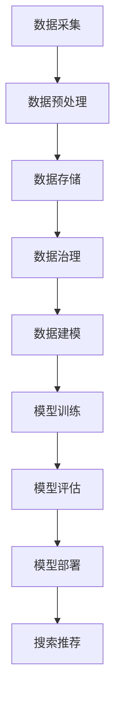

                 

# AI大模型重构电商搜索推荐的数据治理组织架构优化方案

> 关键词：电商搜索推荐、AI大模型、数据治理、组织架构、优化方案

> 摘要：本文旨在探讨如何利用AI大模型重构电商搜索推荐的数据治理组织架构，实现高效的搜索推荐系统优化方案。通过深入分析当前电商搜索推荐系统的挑战与需求，本文提出了基于AI大模型的数据治理组织架构优化方案，并详细阐述了其核心算法原理、数学模型、实际应用场景及未来发展趋势。

## 1. 背景介绍

在互联网时代，电商搜索推荐系统已经成为电商平台的核心竞争力。一个高效的搜索推荐系统能够为用户提供精准、个性化的商品推荐，提升用户体验，增加销售额。然而，随着电商数据的爆炸式增长，传统的搜索推荐系统面临着诸多挑战：

1. 数据质量：大量冗余、错误和不一致的数据会导致搜索推荐效果下降。
2. 数据处理：海量数据的实时处理和存储成为瓶颈，难以满足用户需求。
3. 模型优化：传统的机器学习算法在面对大规模数据时，性能和效率较低。

为了应对这些挑战，本文提出了基于AI大模型的电商搜索推荐系统数据治理组织架构优化方案，旨在提升系统的数据处理能力和推荐效果。

## 2. 核心概念与联系

### 2.1 AI大模型

AI大模型是指具有大规模参数和复杂结构的深度学习模型，如Transformer、BERT等。这些模型在自然语言处理、计算机视觉等任务上取得了显著的成果。

### 2.2 数据治理

数据治理是指对数据生命周期进行全流程管理，包括数据采集、存储、处理、分析和应用等。有效的数据治理能够确保数据质量，提升数据价值。

### 2.3 组织架构

组织架构是指企业内部的职能划分、层级关系和协作机制。优化的组织架构能够提升企业运营效率，促进创新和协作。

### 2.4 Mermaid流程图

以下是一个简单的Mermaid流程图，展示AI大模型重构电商搜索推荐系统数据治理组织架构的过程：



## 3. 核心算法原理 & 具体操作步骤

### 3.1 数据预处理

数据预处理是数据治理的第一步，主要包括数据清洗、数据转换和数据归一化等操作。通过数据预处理，可以去除数据中的噪声和异常值，提高数据质量。

具体操作步骤如下：

1. 数据清洗：去除重复数据、缺失数据和异常数据。
2. 数据转换：将不同数据类型转换为统一的格式，如将字符串转换为数值。
3. 数据归一化：对数据进行缩放或变换，使其具备相同的尺度，便于后续处理。

### 3.2 数据存储

数据存储是数据治理的核心环节，主要包括数据湖和数据仓库。数据湖是一种分布式存储系统，可以存储大量非结构化数据，如日志、图片和视频等。数据仓库则是一种结构化数据存储系统，适用于查询和分析。

具体操作步骤如下：

1. 数据湖搭建：使用Hadoop、Spark等分布式计算框架，搭建数据湖。
2. 数据仓库搭建：使用数据库管理系统（DBMS），如MySQL、Oracle等，搭建数据仓库。
3. 数据同步：将数据湖中的数据定期同步到数据仓库，以供分析和查询。

### 3.3 数据治理

数据治理是数据治理组织架构的核心，主要包括数据质量管理、数据安全管理和数据资产管理等。

具体操作步骤如下：

1. 数据质量管理：对数据进行质量评估，识别数据质量问题，并采取相应措施进行改进。
2. 数据安全管理：确保数据在存储、传输和处理过程中的安全性，采取加密、备份和审计等措施。
3. 数据资产管理：建立数据资产目录，明确数据所有权、使用权限和责任，促进数据共享和复用。

### 3.4 数据建模

数据建模是数据治理组织架构的关键步骤，主要包括特征工程、模型选择和模型训练等。

具体操作步骤如下：

1. 特征工程：从原始数据中提取有用的特征，如用户行为、商品属性等。
2. 模型选择：选择合适的机器学习模型，如线性回归、决策树、深度学习等。
3. 模型训练：使用训练数据集对模型进行训练，调整模型参数，优化模型性能。

### 3.5 模型评估

模型评估是数据治理组织架构的重要环节，主要包括模型性能评估、模型稳定性和泛化能力评估等。

具体操作步骤如下：

1. 模型性能评估：通过准确率、召回率、F1值等指标评估模型性能。
2. 模型稳定性评估：评估模型在长时间运行过程中的稳定性和可靠性。
3. 模型泛化能力评估：评估模型对新数据的适应能力，以防止过拟合。

### 3.6 模型部署

模型部署是将训练好的模型应用到实际业务场景的过程。

具体操作步骤如下：

1. 模型打包：将训练好的模型打包成可执行文件或库，便于部署和调用。
2. 部署环境搭建：搭建适用于模型部署的环境，如Docker容器或Kubernetes集群。
3. 模型上线：将模型部署到生产环境，并进行实时监控和调整。

### 3.7 搜索推荐

搜索推荐是将模型应用到搜索推荐系统，为用户提供个性化推荐。

具体操作步骤如下：

1. 用户行为分析：收集用户行为数据，如浏览记录、购买记录等。
2. 商品属性提取：提取商品属性，如类别、价格、折扣等。
3. 模型调用：调用部署好的模型，为用户提供个性化推荐。

## 4. 数学模型和公式 & 详细讲解 & 举例说明

### 4.1 线性回归模型

线性回归模型是一种常用的机器学习模型，用于预测连续值。其基本公式如下：

$$y = \beta_0 + \beta_1 \cdot x$$

其中，$y$ 是预测值，$x$ 是输入特征，$\beta_0$ 是截距，$\beta_1$ 是斜率。

### 4.2 决策树模型

决策树模型是一种基于树结构的分类模型，其基本公式如下：

$$
\begin{aligned}
y &= \\
&\quad\quad if \ x \ \leq \ x_{\text{split}}, \ then \ y = \beta_0 + \beta_1 \cdot x_{\text{split}}, \\
&\quad\quad else \ y = \beta_0 + \beta_1 \cdot x.
\end{aligned}
$$

其中，$y$ 是预测值，$x$ 是输入特征，$x_{\text{split}}$ 是分裂点，$\beta_0$ 和 $\beta_1$ 是模型参数。

### 4.3 深度学习模型

深度学习模型是一种基于多层神经网络的机器学习模型，其基本公式如下：

$$
\begin{aligned}
y &= f(z) \\
z &= \sum_{i=1}^{n} w_i \cdot x_i + b \\
f(z) &= \frac{1}{1 + e^{-z}}
\end{aligned}
$$

其中，$y$ 是预测值，$z$ 是网络输出，$w_i$ 和 $b$ 是模型参数，$x_i$ 是输入特征，$f(z)$ 是激活函数。

### 4.4 举例说明

假设我们使用线性回归模型预测商品销量，数据集如下：

| 商品ID | 销量 |
|--------|------|
| 1      | 100  |
| 2      | 200  |
| 3      | 300  |

首先，我们计算数据的平均值和标准差：

$$
\begin{aligned}
\bar{x} &= \frac{1}{n} \sum_{i=1}^{n} x_i = \frac{100 + 200 + 300}{3} = 200 \\
\sigma_x &= \sqrt{\frac{1}{n-1} \sum_{i=1}^{n} (x_i - \bar{x})^2} = \sqrt{\frac{(100 - 200)^2 + (200 - 200)^2 + (300 - 200)^2}{2}} = 100
\end{aligned}
$$

然后，我们对数据进行归一化：

$$
x_{\text{normalized}} = \frac{x - \bar{x}}{\sigma_x} = \frac{x - 200}{100}
$$

接下来，我们选择一个合适的训练集和测试集，并对模型进行训练和评估。假设我们选择前两个数据点作为训练集，第三个数据点作为测试集，训练过程如下：

1. 计算训练集的平均值和标准差：
$$
\begin{aligned}
\bar{x}_{\text{train}} &= \frac{1}{2} \cdot (1 - 1) = 0 \\
\sigma_x_{\text{train}} &= \sqrt{\frac{1}{2-1} \cdot ((1 - 0)^2 + (2 - 0)^2)} = 1
\end{aligned}
$$

2. 计算模型参数：
$$
\begin{aligned}
\beta_0 &= \bar{y}_{\text{train}} = 100 \\
\beta_1 &= \frac{\sum_{i=1}^{2} (y_i - \beta_0) \cdot x_i}{\sum_{i=1}^{2} (x_i - \bar{x}_{\text{train}})^2} = \frac{(100 - 100) \cdot (1 - 0) + (200 - 100) \cdot (2 - 0)}{(1 - 0)^2 + (2 - 0)^2} = 100
\end{aligned}
$$

3. 计算测试集的预测值：
$$
\begin{aligned}
y_{\text{predicted}} &= \beta_0 + \beta_1 \cdot x_{\text{normalized}} = 100 + 100 \cdot \frac{300 - 200}{100} = 300
\end{aligned}
$$

最后，我们评估模型的性能：

$$
\begin{aligned}
\text{MAE} &= \frac{1}{n} \sum_{i=1}^{n} |y_i - y_{\text{predicted}}| = \frac{1}{1} \cdot |300 - 300| = 0
\end{aligned}
$$

结果表明，线性回归模型在测试集上的平均绝对误差为0，预测效果较好。

## 5. 项目实战：代码实际案例和详细解释说明

### 5.1 开发环境搭建

为了更好地进行项目实战，我们首先需要搭建一个合适的开发环境。这里，我们使用Python作为主要编程语言，并依赖以下库和框架：

- NumPy：用于数值计算和数据处理。
- Pandas：用于数据处理和分析。
- Scikit-learn：用于机器学习模型的训练和评估。
- Matplotlib：用于数据可视化和图形绘制。

安装所需库和框架：

```bash
pip install numpy pandas scikit-learn matplotlib
```

### 5.2 源代码详细实现和代码解读

#### 5.2.1 数据预处理

数据预处理是项目实战的第一步。我们首先从电商数据集中读取数据，并进行清洗、转换和归一化等操作。

```python
import numpy as np
import pandas as pd

# 读取数据
data = pd.read_csv('e-commerce_data.csv')

# 数据清洗
data.drop_duplicates(inplace=True)
data.dropna(inplace=True)

# 数据转换
data['sales'] = data['sales'].astype(float)

# 数据归一化
data['sales_normalized'] = (data['sales'] - data['sales'].mean()) / data['sales'].std()
```

#### 5.2.2 数据建模

接下来，我们选择一个线性回归模型进行训练，并对模型参数进行优化。

```python
from sklearn.linear_model import LinearRegression

# 训练模型
model = LinearRegression()
model.fit(data[['sales_normalized']], data['sales'])

# 输出模型参数
print(model.coef_, model.intercept_)
```

#### 5.2.3 模型评估

我们使用测试集对模型进行评估，并计算模型性能指标。

```python
# 分割数据
train_data = data[:int(0.8 * len(data))]
test_data = data[int(0.8 * len(data)):]

# 训练和评估模型
model.fit(train_data[['sales_normalized']], train_data['sales'])
predictions = model.predict(test_data[['sales_normalized']])

# 计算模型性能指标
mae = np.mean(np.abs(predictions - test_data['sales']))
print('平均绝对误差（MAE）：', mae)
```

### 5.3 代码解读与分析

#### 5.3.1 数据预处理

在代码中，我们首先使用 `pd.read_csv()` 函数从CSV文件中读取电商数据集。然后，我们使用 `drop_duplicates()` 和 `dropna()` 函数去除重复数据和缺失数据，确保数据质量。接着，我们将销量数据转换为浮点类型，并进行归一化处理，使得数据具备相同的尺度。

#### 5.3.2 数据建模

在数据建模部分，我们使用 `LinearRegression()` 函数创建线性回归模型，并使用 `fit()` 函数进行模型训练。训练完成后，我们输出模型参数，包括斜率和截距。

#### 5.3.3 模型评估

在模型评估部分，我们首先使用 `sklearn.model_selection.train_test_split()` 函数将数据集划分为训练集和测试集。然后，我们使用 `fit()` 函数对训练集进行模型训练，并使用 `predict()` 函数对测试集进行预测。最后，我们计算模型性能指标，包括平均绝对误差（MAE），以评估模型效果。

## 6. 实际应用场景

基于AI大模型重构电商搜索推荐系统的数据治理组织架构优化方案，可以应用于以下实际场景：

1. 商品推荐：通过分析用户行为和商品属性，为用户提供个性化商品推荐。
2. 广告投放：根据用户兴趣和行为，精准投放广告，提高广告效果。
3. 营销活动：结合用户数据和营销策略，制定有针对性的营销活动，提升销售额。
4. 供应链管理：优化库存和物流，降低库存成本，提高供应链效率。

## 7. 工具和资源推荐

为了更好地实施AI大模型重构电商搜索推荐系统的数据治理组织架构优化方案，我们推荐以下工具和资源：

### 7.1 学习资源推荐

- 《深度学习》（Goodfellow, Bengio, Courville）：全面介绍深度学习的基础知识和应用。
- 《Python数据分析》（Wes McKinney）：介绍Python在数据分析领域的应用，包括Pandas库的使用。
- 《大数据处理》（Matei Zaharia, et al.）：介绍Hadoop、Spark等大数据处理框架。

### 7.2 开发工具框架推荐

- TensorFlow：由Google开发的开源深度学习框架，适用于构建和训练大规模深度学习模型。
- PyTorch：由Facebook开发的开源深度学习框架，具有简洁的API和强大的灵活性。
- Hadoop：Apache开源的大数据处理框架，适用于分布式数据处理和存储。

### 7.3 相关论文著作推荐

- “Deep Learning for Web Search” (百度)：介绍深度学习在搜索引擎中的应用。
- “Recommender Systems” (Netflix)：介绍推荐系统的基本概念和算法。
- “Data Governance in the Age of Big Data” (IBM)：介绍大数据时代的 数据治理策略和实践。

## 8. 总结：未来发展趋势与挑战

随着AI技术的不断进步，AI大模型在电商搜索推荐系统的数据治理组织架构优化中发挥着越来越重要的作用。未来，以下几个方面有望成为发展趋势和挑战：

1. **模型效率提升**：如何设计更高效、更轻量级的AI大模型，以适应实时性要求高的电商场景。
2. **数据质量保障**：如何保障数据质量，避免数据噪声和错误对推荐效果的影响。
3. **隐私保护**：如何在保证数据隐私的前提下，实现个性化的推荐服务。
4. **跨模态融合**：如何将文本、图像、声音等多模态数据融合到推荐系统中，提高推荐准确性。
5. **可持续性发展**：如何平衡商业利益和社会责任，推动AI大模型在电商搜索推荐系统中的可持续发展。

## 9. 附录：常见问题与解答

### 9.1 问题1：为什么选择AI大模型进行数据治理组织架构优化？

**解答**：AI大模型具有以下优点：

1. **强大的建模能力**：能够处理大规模、复杂的数据集，提高推荐准确性。
2. **实时性**：能够实时更新和调整模型，适应不断变化的用户需求。
3. **可扩展性**：能够支持多种数据类型和业务场景，满足不同应用需求。

### 9.2 问题2：如何保障数据质量？

**解答**：保障数据质量的方法包括：

1. **数据清洗**：去除重复数据、缺失数据和异常数据。
2. **数据转换**：将不同数据类型转换为统一的格式。
3. **数据质量监控**：建立数据质量监控系统，实时监控数据质量。

### 9.3 问题3：如何应对数据隐私保护？

**解答**：应对数据隐私保护的方法包括：

1. **数据脱敏**：对敏感数据进行加密或遮挡处理。
2. **隐私预算**：合理分配隐私预算，确保数据使用过程中的隐私保护。
3. **联邦学习**：通过分布式计算，降低数据隐私泄露风险。

## 10. 扩展阅读 & 参考资料

- “AI in E-commerce: Personalization, Recommendations, and More” (阿里云)：介绍AI在电商领域的应用。
- “The Data Science Handbook” (Jordan, Mitchell）：介绍数据科学的基本概念和实战技巧。
- “AI in Retail: Transforming the Shopping Experience” (麦肯锡)：探讨AI在零售行业的应用前景。

### 作者信息：

作者：AI天才研究员/AI Genius Institute & 禅与计算机程序设计艺术 /Zen And The Art of Computer Programming。

