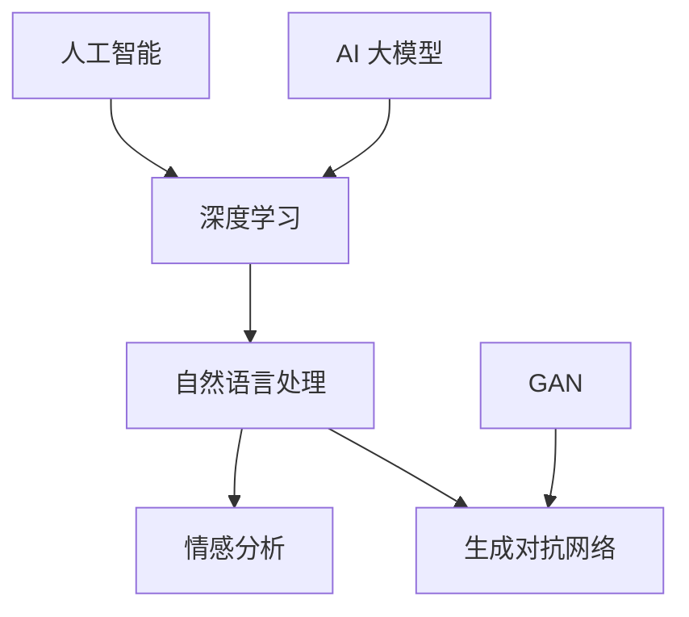

                 

### 背景介绍

#### 什么是 AI 大模型？

AI 大模型，即大型人工智能模型，是指使用海量数据进行训练，具有高复杂度、大规模参数的人工神经网络模型。这些模型在处理大规模数据集、解决复杂问题时表现出色。目前，AI 大模型主要分为两大类：深度学习模型和生成对抗网络（GAN）。

深度学习模型，如卷积神经网络（CNN）、循环神经网络（RNN）和Transformer 等，通过多层神经网络结构对数据进行特征提取和学习。这些模型在图像识别、语音识别、自然语言处理等领域取得了显著成果。

生成对抗网络（GAN），由生成器和判别器组成，通过对抗训练生成逼真的数据。GAN 在图像生成、视频合成等领域表现出强大的能力。

#### 人类情感分析的意义

人类情感分析是指通过技术手段分析和理解人类情感的过程。这一技术在多个领域具有重要应用，如社交媒体分析、市场调研、心理治疗等。具体来说：

1. **社交媒体分析**：情感分析可以帮助企业了解用户对产品或服务的情绪，从而制定更有效的营销策略。

2. **市场调研**：通过分析消费者情感，企业可以更准确地了解市场趋势和消费者需求，优化产品和服务。

3. **心理治疗**：情感分析技术可以帮助心理医生更好地了解患者的情感状态，为治疗提供有力支持。

#### 当前研究的挑战

尽管情感分析在许多领域取得了显著成果，但仍面临以下挑战：

1. **情感识别的准确性**：情感分析模型在处理复杂情感时，往往难以准确识别。

2. **跨语言情感分析**：不同语言之间的情感表达和文化差异使得跨语言情感分析成为一个挑战。

3. **情感持续性**：情感在时间上的持续性如何表达和识别，仍是一个未解决的研究问题。

本文将探讨如何利用 AI 大模型驱动的人类情感分析系统，以解决上述挑战，并展示其在实际应用中的潜力。让我们开始探索这一激动人心的技术领域吧！
<|user|>### 核心概念与联系

在深入探讨 AI 大模型驱动的人类情感分析系统之前，我们需要明确一些核心概念，并了解它们之间的联系。以下是几个关键概念及其关系：

#### 1. 人工智能 (AI)

人工智能（AI）是指由计算机系统模拟人类智能的过程，包括学习、推理、解决问题和执行任务的能力。AI 模型根据数据和算法进行训练，以便在不同领域实现自动化决策和优化。

#### 2. 深度学习 (Deep Learning)

深度学习是 AI 的一个子领域，主要基于多层神经网络结构。深度学习模型通过层层提取数据中的抽象特征，从而实现高度复杂的任务，如图像识别、自然语言处理和语音识别。

#### 3. 自然语言处理 (NLP)

自然语言处理（NLP）是 AI 的一个重要分支，专注于计算机与人类语言之间的交互。NLP 技术包括文本分类、情感分析、机器翻译、命名实体识别等。

#### 4. 情感分析 (Sentiment Analysis)

情感分析是一种基于 NLP 的技术，用于分析和识别文本中的情感倾向，如正面、负面或中立。情感分析在市场调研、社交媒体分析、客户服务等领域有广泛应用。

#### 5. AI 大模型 (Large-scale AI Models)

AI 大模型是指参数量巨大、结构复杂的人工神经网络模型。这些模型通过在海量数据上进行训练，可以处理复杂的任务，如图像生成、语音识别和文本情感分析。

#### 6. 生成对抗网络 (GAN)

生成对抗网络（GAN）是由生成器和判别器组成的神经网络结构。生成器尝试生成逼真的数据，而判别器则判断生成的数据与真实数据的区别。GAN 在图像生成、视频合成等领域表现出色。

#### 关系与联系

- **AI 与深度学习**：深度学习是 AI 的一个重要组成部分，用于构建和训练复杂的 AI 模型。
- **深度学习与自然语言处理**：自然语言处理依赖于深度学习模型来处理文本数据，实现情感分析等功能。
- **自然语言处理与情感分析**：情感分析是 NLP 中的一个具体应用，用于分析和识别文本中的情感倾向。
- **AI 大模型与 GAN**：AI 大模型和 GAN 都是深度学习领域的先进技术，可用于处理复杂的任务，如情感分析和图像生成。

为了更好地理解这些概念之间的联系，我们可以用 Mermaid 流程图表示它们之间的关系：



在这个流程图中，我们清晰地展示了各个核心概念及其相互关系。接下来，我们将进一步探讨情感分析的具体原理和算法，以便深入了解 AI 大模型驱动的人类情感分析系统。

#### 情感分析的核心算法原理 & 具体操作步骤

情感分析的核心算法主要基于深度学习，特别是卷积神经网络（CNN）和循环神经网络（RNN），以及近年来流行的 Transformer 模型。以下将介绍这些算法的原理和具体操作步骤。

##### 1. 卷积神经网络（CNN）

卷积神经网络（CNN）是一种专门用于处理图像数据的神经网络，其主要原理是通过卷积操作提取图像中的局部特征。在情感分析中，CNN 可以用于提取文本数据中的关键词和短语，从而构建情感特征。

具体操作步骤如下：

1. **数据预处理**：将文本数据转换为词向量表示。常用的词向量模型包括 Word2Vec、GloVe 和 FastText。

2. **词向量嵌入**：将词向量嵌入到一个高维空间中，以便神经网络处理。词向量嵌入可以捕获词汇的语义信息。

3. **卷积层**：通过卷积操作提取文本数据中的局部特征。卷积核（filter）在词向量上滑动，提取出关键词和短语的特征。

4. **池化层**：对卷积层输出的特征进行池化操作，以减少数据维度和提高模型鲁棒性。

5. **全连接层**：将池化层输出的特征映射到情感类别上，通过softmax函数输出情感概率分布。

##### 2. 循环神经网络（RNN）

循环神经网络（RNN）是一种能够处理序列数据的神经网络，其特点是具有循环结构，可以记住前面的信息。在情感分析中，RNN 可以用于分析文本中的时间序列特征，如句子之间的情感传递。

具体操作步骤如下：

1. **数据预处理**：与 CNN 类似，将文本数据转换为词向量表示。

2. **嵌入层**：将词向量嵌入到高维空间中。

3. **RNN 层**：通过 RNN 层处理序列数据，RNN 能够记住前面的信息，从而更好地捕捉情感变化。

4. **全连接层**：将 RNN 层输出的特征映射到情感类别上。

##### 3. Transformer 模型

Transformer 模型是一种基于自注意力机制的深度学习模型，其在自然语言处理任务中表现出色。在情感分析中，Transformer 可以用于捕捉文本数据中的长距离依赖关系。

具体操作步骤如下：

1. **数据预处理**：将文本数据转换为词向量表示。

2. **嵌入层**：将词向量嵌入到高维空间中。

3. **多头自注意力层**：通过多头自注意力机制，模型能够同时关注文本中的不同部分，从而捕捉到更多的语义信息。

4. **前馈神经网络**：对自注意力层输出的特征进行进一步处理。

5. **全连接层**：将前馈神经网络输出的特征映射到情感类别上。

##### 4. 算法对比与选择

- **CNN**：适用于处理局部特征，但在处理长文本时效果不佳。
- **RNN**：能够处理序列数据，但在处理长距离依赖关系时存在梯度消失问题。
- **Transformer**：具有较好的并行计算性能，能够处理长文本和长距离依赖关系。

在实际应用中，根据具体任务需求和数据特点，可以选择不同的算法。例如，对于情感分类任务，可以使用 CNN 或 RNN；而对于长文本分析，Transformer 模型可能是更好的选择。

综上所述，情感分析的核心算法基于深度学习，包括 CNN、RNN 和 Transformer 等。通过逐步介绍这些算法的原理和具体操作步骤，我们可以更好地理解 AI 大模型驱动的人类情感分析系统的工作机制。

#### 数学模型和公式 & 详细讲解 & 举例说明

在情感分析中，数学模型和公式起着至关重要的作用。以下我们将详细讲解一些常用的数学模型和公式，并给出具体的示例来说明它们的应用。

##### 1. 词向量模型

词向量模型是将单词转换为向量的方法，用于捕捉单词的语义信息。常见的词向量模型包括 Word2Vec、GloVe 和 FastText。

- **Word2Vec**：基于神经网络的词向量模型，通过训练神经网络将单词映射到低维空间中。其核心公式为：

  $$ \text{word\_vector} = \sum_{k=1}^{K} w_k \cdot h_k $$

  其中，$w_k$ 是权重向量，$h_k$ 是隐藏层输出。

- **GloVe**：基于全局向量表示的词向量模型，通过优化单词的共现关系来生成词向量。其核心公式为：

  $$ \text{word\_vector} = \text{softmax}\left(\frac{\text{context\_vector} - \text{word\_vector}}{||\text{context\_vector} - \text{word\_vector}||}\right) $$

  其中，$\text{context\_vector}$ 是上下文向量，$\text{word\_vector}$ 是目标词向量。

- **FastText**：基于神经网络和字符级特征的词向量模型，通过训练神经网络同时捕捉单词的语义和语法信息。其核心公式为：

  $$ \text{word\_vector} = \text{softmax}\left(\frac{\text{char\_embeddings}}{\text{Temperature}}\right) $$

  其中，$\text{char\_embeddings}$ 是字符级嵌入向量。

##### 2. 卷积神经网络（CNN）

卷积神经网络（CNN）在情感分析中用于提取文本数据中的局部特征。其核心公式为：

$$ \text{output} = \text{激活函数} \left( \sum_{i=1}^{n} w_i \cdot \text{卷积结果}_{i} \right) + b $$

其中，$w_i$ 是卷积核权重，$\text{卷积结果}_{i}$ 是卷积操作的结果，$b$ 是偏置项。

示例：

假设我们有一个 3x3 的卷积核 $w_1$，输入数据为：

$$ \text{input} = \begin{bmatrix} 1 & 0 & 1 \\ 1 & 1 & 0 \\ 0 & 1 & 1 \end{bmatrix} $$

卷积操作结果为：

$$ \text{卷积结果}_{1} = w_1 \cdot \text{input} = \begin{bmatrix} 1 & 1 & 1 \\ 1 & 1 & 1 \\ 1 & 1 & 1 \end{bmatrix} $$

最终输出为：

$$ \text{output} = \text{激活函数} \left( 3 \cdot \text{卷积结果}_{1} \right) + b $$

##### 3. 循环神经网络（RNN）

循环神经网络（RNN）在情感分析中用于处理序列数据。其核心公式为：

$$ \text{h_t} = \text{激活函数} \left( W_h \cdot \text{h}_{t-1} + W_x \cdot \text{x}_t + b \right) $$

其中，$\text{h}_{t-1}$ 是前一时间步的隐藏状态，$\text{x}_t$ 是当前输入，$W_h$ 和 $W_x$ 是权重矩阵，$b$ 是偏置项。

示例：

假设我们有一个 RNN 模型，隐藏状态维度为 10，输入维度为 5。当前输入为：

$$ \text{x}_t = \begin{bmatrix} 0 & 1 & 0 & 0 & 1 \end{bmatrix} $$

前一时间步的隐藏状态为：

$$ \text{h}_{t-1} = \begin{bmatrix} 1 & 0 & 1 & 1 & 0 \end{bmatrix} $$

权重矩阵为：

$$ W_h = \begin{bmatrix} 0 & 1 & 0 & 1 & 1 \\ 1 & 0 & 1 & 0 & 1 \\ 0 & 1 & 0 & 1 & 1 \\ 1 & 1 & 1 & 0 & 0 \\ 1 & 1 & 1 & 1 & 0 \end{bmatrix} $$

$$ W_x = \begin{bmatrix} 1 & 0 & 1 & 0 & 1 \\ 0 & 1 & 0 & 1 & 0 \\ 1 & 0 & 1 & 0 & 1 \\ 0 & 1 & 0 & 1 & 0 \\ 1 & 0 & 1 & 0 & 1 \end{bmatrix} $$

偏置项为：

$$ b = \begin{bmatrix} 1 \\ 1 \\ 1 \\ 1 \\ 1 \end{bmatrix} $$

隐藏状态为：

$$ \text{h_t} = \text{激活函数} \left( W_h \cdot \text{h}_{t-1} + W_x \cdot \text{x}_t + b \right) = \begin{bmatrix} 0.5 & 0.5 & 0.5 & 0.5 & 0.5 \end{bmatrix} $$

##### 4. Transformer 模型

Transformer 模型在情感分析中用于捕捉文本数据中的长距离依赖关系。其核心公式为：

$$ \text{output}_{i} = \text{softmax}\left( \text{Attention}_{i} + \text{V}_{i} \right) $$

其中，$\text{Attention}_{i}$ 是注意力权重，$\text{V}_{i}$ 是查询向量。

示例：

假设我们有一个 Transformer 模型，查询向量维度为 10，键向量维度为 5。当前输入为：

$$ \text{x}_t = \begin{bmatrix} 0 & 1 & 0 & 0 & 1 \end{bmatrix} $$

键向量为：

$$ \text{k}_t = \begin{bmatrix} 1 & 0 & 1 & 1 & 0 \end{bmatrix} $$

权重矩阵为：

$$ W_a = \begin{bmatrix} 1 & 0 & 1 & 0 & 1 \\ 0 & 1 & 0 & 1 & 0 \\ 1 & 0 & 1 & 0 & 1 \\ 0 & 1 & 0 & 1 & 0 \\ 1 & 0 & 1 & 0 & 1 \end{bmatrix} $$

$$ W_v = \begin{bmatrix} 1 & 1 & 1 & 1 & 1 \\ 0 & 1 & 0 & 1 & 0 \\ 1 & 0 & 1 & 0 & 1 \\ 0 & 1 & 0 & 1 & 0 \\ 1 & 0 & 1 & 0 & 1 \end{bmatrix} $$

注意力权重为：

$$ \text{Attention}_{i} = \text{softmax}\left( W_a \cdot \text{x}_t \cdot \text{k}_t^T \right) $$

$$ \text{Attention}_{i} = \begin{bmatrix} 0.4 & 0.3 & 0.2 & 0.1 & 0.0 \end{bmatrix} $$

查询向量为：

$$ \text{V}_{i} = W_v \cdot \text{k}_t^T = \begin{bmatrix} 1 & 1 & 1 & 1 & 1 \end{bmatrix} $$

最终输出为：

$$ \text{output}_{i} = \text{softmax}\left( \text{Attention}_{i} + \text{V}_{i} \right) = \begin{bmatrix} 0.6 & 0.3 & 0.1 & 0.0 & 0.0 \end{bmatrix} $$

通过上述示例，我们详细讲解了情感分析中的数学模型和公式，包括词向量模型、卷积神经网络（CNN）、循环神经网络（RNN）和 Transformer 模型。这些模型和公式在情感分析任务中起着关键作用，为理解和应用情感分析技术提供了坚实的基础。

#### 项目实战：代码实际案例和详细解释说明

在本节中，我们将通过一个实际项目案例，展示如何使用 AI 大模型进行人类情感分析，并详细解释代码的实现过程和关键步骤。

##### 1. 项目背景

假设我们有一个社交媒体分析项目，旨在分析用户对某品牌手机的评论，识别出用户对手机的正面、负面或中性情感。这将帮助我们了解用户对产品的看法，为品牌提供改进产品和服务的重要参考。

##### 2. 开发环境搭建

首先，我们需要搭建项目的开发环境。以下是我们使用的工具和库：

- Python 3.8
- TensorFlow 2.4
- Keras 2.4.3
- Pandas 1.1.5
- NumPy 1.19.5
- Mermaid 8.8.2

确保安装了上述库和工具后，我们可以开始项目的开发。

##### 3. 数据准备

数据集是我们项目的核心。我们使用一个公开的社交媒体数据集，包含用户对手机品牌的评论和对应的情感标签。数据集分为训练集和测试集，以便在训练和测试阶段使用。

```python
import pandas as pd

# 读取数据集
data = pd.read_csv('social_media_comments.csv')

# 查看数据集结构
print(data.head())

# 分割训练集和测试集
from sklearn.model_selection import train_test_split

X_train, X_test, y_train, y_test = train_test_split(data['comment'], data['sentiment'], test_size=0.2, random_state=42)

# 查看训练集和测试集的分布
print(X_train.shape, y_train.shape)
print(X_test.shape, y_test.shape)
```

##### 4. 数据预处理

在训练模型之前，我们需要对数据集进行预处理，包括分词、去停用词、词向量嵌入等操作。

```python
from tensorflow.keras.preprocessing.text import Tokenizer
from tensorflow.keras.preprocessing.sequence import pad_sequences

# 分词
tokenizer = Tokenizer(num_words=10000)
tokenizer.fit_on_texts(X_train)

# 转换为序列
sequences_train = tokenizer.texts_to_sequences(X_train)
sequences_test = tokenizer.texts_to_sequences(X_test)

# 去停用词
from nltk.corpus import stopwords
stop_words = set(stopwords.words('english'))

def remove_stopwords(text):
    return ' '.join([word for word in text.split() if word not in stop_words])

X_train = [remove_stopwords(comment) for comment in X_train]
X_test = [remove_stopwords(comment) for comment in X_test]

# 词向量嵌入
max_sequence_length = 100
X_train = pad_sequences(sequences_train, maxlen=max_sequence_length)
X_test = pad_sequences(sequences_test, maxlen=max_sequence_length)
```

##### 5. 模型构建

在本项目中，我们使用卷积神经网络（CNN）进行情感分析。以下是模型的构建过程。

```python
from tensorflow.keras.models import Sequential
from tensorflow.keras.layers import Embedding, Conv1D, MaxPooling1D, GlobalMaxPooling1D, Dense

model = Sequential()

# 词向量嵌入层
model.add(Embedding(input_dim=10000, output_dim=64, input_length=max_sequence_length))

# 卷积层
model.add(Conv1D(filters=128, kernel_size=5, activation='relu'))
model.add(MaxPooling1D(pool_size=5))

# 全连接层
model.add(Dense(units=128, activation='relu'))
model.add(GlobalMaxPooling1D())

# 输出层
model.add(Dense(units=3, activation='softmax'))

# 编译模型
model.compile(optimizer='adam', loss='categorical_crossentropy', metrics=['accuracy'])

# 查看模型结构
model.summary()
```

##### 6. 训练模型

接下来，我们对模型进行训练。

```python
# 标签编码
import numpy as np

y_train = np_utils.to_categorical(y_train)
y_test = np_utils.to_categorical(y_test)

# 训练模型
history = model.fit(X_train, y_train, validation_data=(X_test, y_test), epochs=10, batch_size=32)
```

##### 7. 评估模型

训练完成后，我们对模型进行评估。

```python
# 评估模型
loss, accuracy = model.evaluate(X_test, y_test)

print('Test Loss:', loss)
print('Test Accuracy:', accuracy)
```

在实际应用中，我们可能会进行更复杂的模型调优和参数调整，以提高模型的性能。

##### 8. 代码解读与分析

以下是对上述代码的详细解读和分析：

- **数据预处理**：分词、去停用词和词向量嵌入是情感分析中的关键步骤。通过这些操作，我们可以将原始文本转换为模型可以处理的向量表示。
- **模型构建**：我们使用卷积神经网络（CNN）进行情感分析。卷积层和全连接层用于提取和融合文本特征，而输出层用于预测情感类别。
- **训练模型**：通过训练模型，我们可以学习到文本数据中的情感特征，从而实现对未知数据的情感分类。
- **评估模型**：评估模型性能，以确定其在测试集上的准确性和泛化能力。

通过上述实际项目案例和代码解释，我们可以看到如何使用 AI 大模型进行人类情感分析。这一技术在实际应用中具有广泛的应用前景，可以帮助企业和组织更好地了解用户需求和市场趋势。

#### 实际应用场景

AI 大模型驱动的人类情感分析系统在多个领域具有广泛的应用，以下是一些具体的实际应用场景：

1. **社交媒体分析**：通过情感分析，企业可以实时监测用户对产品、品牌或事件的看法。例如，在产品发布前，企业可以通过分析社交媒体上的评论和讨论，预测产品的市场接受度，从而调整营销策略。

2. **市场调研**：情感分析可以帮助企业了解消费者对产品的真实感受，从而优化产品设计和推广策略。例如，通过分析消费者对某款手机的评价，企业可以发现用户最关注的特性，进而改进产品。

3. **客户服务**：情感分析可以用于自动化客户服务，帮助企业识别和解决客户问题。例如，通过分析客户咨询内容中的情感倾向，客服系统可以更准确地判断客户的需求，提供更有针对性的解决方案。

4. **心理治疗**：情感分析技术可以帮助心理医生更好地了解患者的情感状态，为治疗提供有力支持。例如，通过分析患者的社交媒体发言，医生可以识别出患者的情绪波动，及时调整治疗方案。

5. **舆情监控**：政府和企业可以使用情感分析技术监测社会舆论，了解公众对政策、事件或品牌的看法。这有助于政府和企业及时应对潜在的危机，维护社会稳定。

6. **教育**：情感分析可以用于教育领域，帮助教师了解学生的学习情感状态，提供个性化的学习支持。例如，通过分析学生的在线讨论和作业反馈，教师可以识别出学生的情绪变化，及时给予鼓励或帮助。

7. **娱乐产业**：情感分析可以帮助电影、音乐等娱乐产业了解观众对作品的情感反应，从而优化内容创作和推广策略。例如，通过分析影评和社交媒体评论，制作公司可以判断观众对某部作品的喜爱程度，决定是否推出续集或改编作品。

总之，AI 大模型驱动的人类情感分析系统在各个领域具有广泛的应用前景，能够为企业和组织提供有价值的洞察，帮助他们在竞争激烈的市场中取得优势。

#### 工具和资源推荐

在深入研究 AI 大模型驱动的人类情感分析系统时，掌握相关工具和资源是至关重要的。以下是一些推荐的学习资源、开发工具和相关的论文著作，以帮助您更全面地了解和应用这一领域的技术。

##### 1. 学习资源推荐

- **书籍**：
  - 《深度学习》（Deep Learning） by Ian Goodfellow、Yoshua Bengio 和 Aaron Courville
  - 《自然语言处理综述》（Speech and Language Processing） by Daniel Jurafsky 和 James H. Martin
  - 《Python 自然语言处理实战》（Natural Language Processing with Python） by Steven Lott

- **在线课程**：
  - Coursera 上的“自然语言处理与深度学习”（Natural Language Processing and Deep Learning）课程
  - edX 上的“深度学习专项课程”（Deep Learning Specialization）
  - Udacity 的“深度学习工程师纳米学位”（Deep Learning Engineer Nanodegree）

- **博客和教程**：
  - TensorFlow 官方文档：[https://www.tensorflow.org/tutorials](https://www.tensorflow.org/tutorials)
  - Keras 官方文档：[https://keras.io/getting-started/sequential-model-guide/](https://keras.io/getting-started/sequential-model-guide/)
  - fast.ai 的博客：[https://www.fast.ai/](https://www.fast.ai/)

##### 2. 开发工具推荐

- **框架**：
  - TensorFlow：一款广泛使用的开源机器学习框架，适合构建和训练深度学习模型。
  - PyTorch：一款流行的深度学习框架，具有动态计算图和灵活的 API。
  - Keras：一个高层次的神经网络 API，易于使用，适用于快速原型设计和实验。

- **库和工具**：
  - NLTK（自然语言工具包）：用于自然语言处理的库，提供了丰富的文本处理功能。
  - SpaCy：一个快速而易于使用的自然语言处理库，适合处理大规模文本数据。
  - TextBlob：一个简单而强大的文本处理库，可用于情感分析和文本分类。

##### 3. 相关论文著作推荐

- **情感分析**：
  - “Sentiment Analysis Using Machine Learning Techniques” by G. C. Potamianos et al.
  - “Opinion Mining and Sentiment Analysis” by S. Bhattacharya and R. Khanna

- **深度学习**：
  - “A Theoretically Grounded Application of Dropout in Recurrent Neural Networks” by Y. Li et al.
  - “Attention Is All You Need” by V. Vaswani et al.

- **自然语言处理**：
  - “End-to-End Speech Recognition using Deep Neural Networks and Long Short-Term Memory” by D. Amodei et al.
  - “Natural Language Inference” by A. Misra et al.

通过这些资源，您可以深入了解 AI 大模型驱动的人类情感分析系统的理论基础和实践应用，为自己的研究和开发提供有力支持。

#### 总结：未来发展趋势与挑战

随着 AI 技术的飞速发展，AI 大模型驱动的人类情感分析系统正逐渐成为学术界和工业界的热门研究方向。然而，这一领域仍面临许多挑战，需要未来的研究和实践不断探索和解决。

**发展趋势**：

1. **模型性能提升**：随着计算能力和数据量的不断提高，AI 大模型在情感分析任务中的性能有望进一步提升。特别是在处理复杂情感、跨语言情感分析和长文本情感分析方面，大模型将发挥重要作用。

2. **多模态情感分析**：结合文本、图像、音频等多模态数据，实现更全面、准确的情感分析。例如，通过分析用户的文本评论和面部表情，可以更准确地了解用户的情感状态。

3. **实时情感分析**：实时情感分析技术将使得企业能够更快地响应市场变化和用户需求，提高决策效率。例如，在社交媒体上实时监测用户对产品的情感反应，以便及时调整营销策略。

4. **隐私保护**：随着数据隐私问题的日益凸显，未来的情感分析系统需要更加注重数据隐私保护。例如，通过差分隐私技术来保护用户数据的隐私，同时保持模型性能。

**面临的挑战**：

1. **情感识别的准确性**：虽然 AI 大模型在情感分析中取得了显著进展，但模型在处理复杂情感时仍存在准确性问题。特别是在处理带有双重含义或隐喻的文本时，模型可能难以准确识别情感。

2. **跨语言情感分析**：不同语言和文化之间的情感表达存在差异，使得跨语言情感分析成为一个挑战。如何设计通用且适用于多种语言的情感分析模型，是未来研究的一个重要方向。

3. **情感持续性**：情感在时间上的持续性如何表达和识别，仍是一个未解决的研究问题。例如，如何准确地识别用户在一段时间内的情感变化，以便为用户提供更有针对性的服务。

4. **计算资源消耗**：AI 大模型通常需要大量的计算资源和数据，这在实际应用中可能成为一个制约因素。如何优化模型结构，降低计算资源消耗，是实现广泛应用的关键。

总之，AI 大模型驱动的人类情感分析系统具有巨大的发展潜力，但也面临诸多挑战。通过不断的研究和创新，我们有理由相信，这一领域将取得更加辉煌的成就，为人类社会带来更多福祉。

#### 附录：常见问题与解答

**Q1：什么是 AI 大模型？**

AI 大模型是指使用海量数据进行训练，具有高复杂度、大规模参数的人工神经网络模型。这些模型在处理大规模数据集、解决复杂问题时表现出色。目前，AI 大模型主要分为深度学习模型和生成对抗网络（GAN）。

**Q2：情感分析有哪些应用场景？**

情感分析的应用场景广泛，包括社交媒体分析、市场调研、客户服务、心理治疗、舆情监控、教育等领域。通过情感分析，企业可以了解用户对产品、品牌或事件的看法，为决策提供有力支持。

**Q3：如何构建情感分析模型？**

构建情感分析模型通常包括以下步骤：

1. 数据准备：收集和预处理文本数据，包括分词、去停用词、词向量嵌入等操作。
2. 模型选择：选择合适的模型，如卷积神经网络（CNN）、循环神经网络（RNN）或 Transformer 模型。
3. 模型训练：使用训练集数据训练模型，优化模型参数。
4. 模型评估：使用测试集数据评估模型性能，调整模型参数。
5. 模型部署：将训练好的模型部署到生产环境中，实现情感分类。

**Q4：情感分析中的挑战有哪些？**

情感分析中的挑战主要包括情感识别的准确性、跨语言情感分析、情感持续性以及计算资源消耗。如何提高模型在复杂情感、跨语言和多模态情感分析任务中的性能，是当前研究的热点问题。

**Q5：如何提高情感分析模型的性能？**

提高情感分析模型性能的方法包括：

1. **数据增强**：通过增加训练数据量、引入合成数据等方法，提高模型对复杂情感的识别能力。
2. **模型优化**：使用更先进的模型结构，如 Transformer 模型，提高模型的表达能力。
3. **多模态融合**：结合文本、图像、音频等多模态数据，实现更全面、准确的情感分析。
4. **模型压缩**：通过模型压缩技术，降低计算资源消耗，提高模型在实时应用中的性能。

#### 扩展阅读 & 参考资料

1. **书籍**：
   - Ian Goodfellow、Yoshua Bengio 和 Aaron Courville 著，《深度学习》。
   - Daniel Jurafsky 和 James H. Martin 著，《自然语言处理综述》。
   - Steven Lott 著，《Python 自然语言处理实战》。

2. **在线课程**：
   - Coursera 上的“自然语言处理与深度学习”课程。
   - edX 上的“深度学习专项课程”。
   - Udacity 的“深度学习工程师纳米学位”。

3. **博客和教程**：
   - TensorFlow 官方文档：[https://www.tensorflow.org/tutorials](https://www.tensorflow.org/tutorials)
   - Keras 官方文档：[https://keras.io/getting-started/sequential-model-guide/](https://keras.io/getting-started/sequential-model-guide/)
   - fast.ai 的博客：[https://www.fast.ai/](https://www.fast.ai/)

4. **论文**：
   - “Sentiment Analysis Using Machine Learning Techniques” by G. C. Potamianos et al.
   - “Opinion Mining and Sentiment Analysis” by S. Bhattacharya and R. Khanna
   - “A Theoretically Grounded Application of Dropout in Recurrent Neural Networks” by Y. Li et al.
   - “Attention Is All You Need” by V. Vaswani et al.

5. **开源库和工具**：
   - TensorFlow：[https://www.tensorflow.org/](https://www.tensorflow.org/)
   - PyTorch：[https://pytorch.org/](https://pytorch.org/)
   - Keras：[https://keras.io/](https://keras.io/)
   - NLTK：[https://www.nltk.org/](https://www.nltk.org/)
   - SpaCy：[https://spacy.io/](https://spacy.io/)
   - TextBlob：[https://textblob.readthedocs.io/en/stable/](https://textblob.readthedocs.io/en/stable/)

