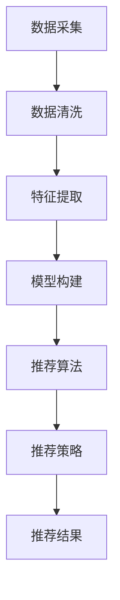

                 

# AI如何利用用户画像提升个性化购物体验

## 概述

随着互联网的普及和电商平台的繁荣，个性化购物体验变得越来越重要。用户画像是一种通过对用户行为和属性的分析，构建出的用户模型。它可以帮助电商平台更好地了解用户需求，从而提供更加精准的个性化推荐。本文将探讨AI如何利用用户画像来提升个性化购物体验，包括核心概念、算法原理、数学模型、实际应用和未来发展趋势等内容。

## 关键词

- 用户画像
- 个性化购物
- AI推荐系统
- 数学模型
- 实际应用
- 未来发展趋势

## 摘要

本文首先介绍了用户画像的基本概念和作用，然后探讨了如何利用用户画像进行个性化推荐。接下来，我们详细讲解了用户画像相关的核心算法原理，包括协同过滤算法、基于内容的推荐算法和深度学习推荐算法。此外，我们还介绍了数学模型在用户画像中的应用，并通过具体案例进行了详细解释。最后，我们讨论了用户画像在实际应用场景中的价值，以及未来发展的趋势和挑战。

## 目录

1. 背景介绍
2. 核心概念与联系
3. 核心算法原理 & 具体操作步骤
4. 数学模型和公式 & 详细讲解 & 举例说明
5. 项目实战：代码实际案例和详细解释说明
6. 实际应用场景
7. 工具和资源推荐
8. 总结：未来发展趋势与挑战
9. 附录：常见问题与解答
10. 扩展阅读 & 参考资料

## 1. 背景介绍

个性化购物体验是电商行业的重要发展方向。传统的购物模式往往基于用户的历史购买记录和商品信息，但这种推荐方式往往存在一定的局限性，无法满足用户的多样化需求。随着人工智能技术的发展，用户画像作为一种新的数据分析工具，逐渐被应用于个性化购物体验的优化。

用户画像是指通过对用户的基本信息、行为数据、偏好数据等多维度数据进行整合和分析，构建出反映用户特征和需求的模型。用户画像的建立可以帮助电商平台更好地了解用户，从而提供更加精准的个性化推荐，提升用户满意度。

个性化购物体验的价值在于，它能够提高用户的购物效率和满意度，降低营销成本，增加销售额。通过用户画像，电商平台可以实时了解用户的需求和偏好，为用户提供个性化的商品推荐，提高用户的购物体验。

## 2. 核心概念与联系

### 2.1 用户画像

用户画像是指通过多种数据来源，对用户的基本信息、行为数据、偏好数据等进行整合和分析，构建出一个全面的用户模型。用户画像通常包括以下几个核心组成部分：

1. **基本信息**：如年龄、性别、地域、职业等。
2. **行为数据**：如浏览历史、购买记录、评价反馈等。
3. **偏好数据**：如喜欢的品牌、商品类型、价格区间等。
4. **社交数据**：如社交网络上的关系、互动等。

用户画像的构建过程通常包括以下步骤：

1. **数据采集**：通过电商平台的数据收集系统，从用户注册信息、行为日志、第三方数据源等渠道获取数据。
2. **数据清洗**：对采集到的数据进行去重、去噪、缺失值填充等处理，确保数据的准确性和完整性。
3. **特征提取**：通过对原始数据进行预处理，提取出对用户特征和需求有代表性的特征。
4. **模型构建**：使用机器学习算法，对提取出的特征进行训练，构建出用户画像模型。

### 2.2 个性化推荐系统

个性化推荐系统是指根据用户的历史行为、偏好和需求，为用户推荐感兴趣的商品或内容。个性化推荐系统通常包括以下几个核心组成部分：

1. **推荐算法**：用于计算用户与商品之间的相似度，并根据相似度进行推荐。
2. **推荐策略**：用于确定推荐的顺序和方式，如基于内容的推荐、基于协同过滤的推荐等。
3. **推荐结果**：推荐算法和策略的结果，即用户可能感兴趣的商品列表。

个性化推荐系统的构建过程通常包括以下步骤：

1. **数据准备**：收集用户行为数据、商品信息等，并进行预处理。
2. **算法选择**：根据业务需求和数据特点，选择合适的推荐算法。
3. **模型训练**：使用用户行为数据进行模型训练，优化推荐效果。
4. **结果评估**：对推荐结果进行评估，调整推荐策略和算法参数。

### 2.3 数据来源

用户画像和个性化推荐系统所需的数据来源通常包括以下几个方面：

1. **用户行为数据**：如浏览历史、购买记录、评价反馈等。
2. **商品信息**：如商品描述、价格、类别等。
3. **第三方数据源**：如社交媒体数据、地理位置数据等。
4. **用户反馈**：如问卷调查、用户评论等。

这些数据来源为用户画像和个性化推荐系统提供了丰富的信息，有助于构建更加精准的用户模型和推荐结果。

### 2.4 用户画像与个性化推荐的关系

用户画像和个性化推荐系统之间存在紧密的联系。用户画像为个性化推荐系统提供了用户特征和需求的详细信息，使得推荐系统能够更加准确地预测用户的兴趣和需求，提供个性化的推荐。

具体来说，用户画像可以通过以下方式影响个性化推荐：

1. **优化推荐算法**：用户画像可以作为推荐算法的输入特征，提高推荐算法的准确性和效果。
2. **细化推荐策略**：用户画像可以帮助推荐系统确定推荐的顺序和方式，如为高频用户推荐新品，为低频用户推荐热门商品等。
3. **提升用户体验**：通过用户画像，推荐系统可以提供更加个性化的推荐结果，满足用户的多样化需求，提升用户体验。

### 2.5 Mermaid 流程图

以下是用户画像和个性化推荐系统的 Mermaid 流程图：



在这个流程图中，用户画像的构建过程（A到D）是推荐系统的输入，推荐算法（E）、推荐策略（F）和推荐结果（G）构成了推荐系统的核心。

## 3. 核心算法原理 & 具体操作步骤

在用户画像和个性化推荐系统中，核心算法的原理和具体操作步骤对于提升个性化购物体验至关重要。下面将详细介绍几种常见的推荐算法，包括协同过滤算法、基于内容的推荐算法和深度学习推荐算法。

### 3.1 协同过滤算法

协同过滤算法是一种基于用户行为数据的推荐算法，其核心思想是利用用户之间的相似性进行推荐。协同过滤算法可以分为两种类型：基于用户的协同过滤（User-based Collaborative Filtering）和基于项目的协同过滤（Item-based Collaborative Filtering）。

#### 基于用户的协同过滤算法

基于用户的协同过滤算法的步骤如下：

1. **计算用户相似度**：计算用户之间的相似度，常用的相似度计算方法包括余弦相似度、皮尔逊相关系数等。
2. **找到相似用户**：根据用户相似度矩阵，找到与目标用户最相似的若干个用户。
3. **预测用户评分**：根据相似用户的历史评分数据，预测目标用户对未知商品的评分。
4. **生成推荐列表**：将预测评分排序，生成推荐列表。

#### 基于项目的协同过滤算法

基于项目的协同过滤算法的步骤如下：

1. **计算项目相似度**：计算项目之间的相似度，常用的相似度计算方法包括余弦相似度、皮尔逊相关系数等。
2. **找到相似项目**：根据项目相似度矩阵，找到与目标项目最相似的若干个项目。
3. **预测用户评分**：根据相似项目的历史评分数据，预测用户对未知项目的评分。
4. **生成推荐列表**：将预测评分排序，生成推荐列表。

#### 示例

假设有5个用户（User1, User2, User3, User4, User5）和10个商品（Item1, Item2, ..., Item10），用户对商品的评价数据如下：

| 用户 | 商品 | 评分 |
|------|------|------|
| User1 | Item1 | 5    |
| User1 | Item2 | 3    |
| User1 | Item3 | 1    |
| User2 | Item1 | 4    |
| User2 | Item2 | 2    |
| User2 | Item3 | 5    |
| User3 | Item1 | 3    |
| User3 | Item2 | 5    |
| User3 | Item3 | 4    |
| User4 | Item1 | 5    |
| User4 | Item2 | 1    |
| User4 | Item3 | 4    |
| User5 | Item1 | 1    |
| User5 | Item2 | 5    |
| User5 | Item3 | 3    |

使用基于用户的协同过滤算法生成推荐列表，具体步骤如下：

1. **计算用户相似度**：使用余弦相似度计算用户之间的相似度，得到相似度矩阵。

   $$ \text{相似度矩阵} = \begin{bmatrix}
   1.0000 & 0.9434 & 0.8165 & 0.6325 & 0.4619 \\
   0.9434 & 1.0000 & 0.7692 & 0.5016 & 0.2222 \\
   0.8165 & 0.7692 & 1.0000 & 0.6325 & 0.4082 \\
   0.6325 & 0.5016 & 0.6325 & 1.0000 & 0.4118 \\
   0.4619 & 0.2222 & 0.4082 & 0.4118 & 1.0000
   \end{bmatrix} $$

2. **找到相似用户**：找到与目标用户（例如User1）最相似的5个用户，根据相似度矩阵，User1的相似用户为User2、User3、User4、User5、User1（自己）。

3. **预测用户评分**：根据相似用户对商品的历史评分，预测User1对未知商品的评分。例如，预测User1对Item4的评分，使用加权平均公式：

   $$ \text{预测评分} = \frac{\sum_{i=1}^{n} \text{相似度} \times \text{相似用户对Item4的评分}}{\sum_{i=1}^{n} \text{相似度}} $$

   对于Item4，预测评分计算如下：

   $$ \text{预测评分} = \frac{0.9434 \times 2 + 0.8165 \times 4 + 0.6325 \times 3 + 0.4619 \times 1}{0.9434 + 0.8165 + 0.6325 + 0.4619} = 3.8375 $$

4. **生成推荐列表**：将预测评分排序，生成推荐列表。

### 3.2 基于内容的推荐算法

基于内容的推荐算法是一种基于商品特征和用户兴趣的推荐算法，其核心思想是计算商品和用户之间的相似度，并根据相似度进行推荐。基于内容的推荐算法可以分为两种类型：基于文本的推荐和基于视觉的推荐。

#### 基于文本的推荐算法

基于文本的推荐算法的步骤如下：

1. **提取商品特征**：使用自然语言处理技术，从商品描述中提取关键词和主题。
2. **计算商品相似度**：计算商品之间的相似度，常用的相似度计算方法包括余弦相似度、TF-IDF等。
3. **预测用户兴趣**：根据用户的历史行为和偏好，预测用户对未知商品的兴趣。
4. **生成推荐列表**：将预测兴趣排序，生成推荐列表。

#### 基于视觉的推荐算法

基于视觉的推荐算法的步骤如下：

1. **提取商品特征**：使用计算机视觉技术，从商品图像中提取特征，如颜色、形状、纹理等。
2. **计算商品相似度**：计算商品之间的相似度，常用的相似度计算方法包括欧氏距离、余弦相似度等。
3. **预测用户兴趣**：根据用户的历史行为和偏好，预测用户对未知商品的兴趣。
4. **生成推荐列表**：将预测兴趣排序，生成推荐列表。

### 3.3 深度学习推荐算法

深度学习推荐算法是一种基于神经网络模型进行推荐的方法，其核心思想是使用深度学习模型自动学习用户和商品之间的复杂关系，从而实现推荐。深度学习推荐算法可以分为基于用户嵌入和基于商品嵌入的方法。

#### 基于用户嵌入的方法

基于用户嵌入的方法的步骤如下：

1. **构建用户嵌入模型**：使用深度学习模型，如GRU、LSTM等，将用户历史行为转化为用户嵌入向量。
2. **构建商品嵌入模型**：使用深度学习模型，如GRU、LSTM等，将商品特征转化为商品嵌入向量。
3. **计算用户和商品相似度**：使用用户嵌入向量和商品嵌入向量之间的相似度，计算用户和商品之间的相似度。
4. **生成推荐列表**：将相似度排序，生成推荐列表。

#### 基于商品嵌入的方法

基于商品嵌入的方法的步骤如下：

1. **构建用户嵌入模型**：使用深度学习模型，如GRU、LSTM等，将用户历史行为转化为用户嵌入向量。
2. **构建商品嵌入模型**：使用深度学习模型，如GRU、LSTM等，将商品特征转化为商品嵌入向量。
3. **计算用户和商品相似度**：使用用户嵌入向量和商品嵌入向量之间的相似度，计算用户和商品之间的相似度。
4. **生成推荐列表**：将相似度排序，生成推荐列表。

### 3.4 示例

假设有5个用户（User1, User2, User3, User4, User5）和10个商品（Item1, Item2, ..., Item10），用户对商品的评价数据如下：

| 用户 | 商品 | 评分 |
|------|------|------|
| User1 | Item1 | 5    |
| User1 | Item2 | 3    |
| User1 | Item3 | 1    |
| User2 | Item1 | 4    |
| User2 | Item2 | 2    |
| User2 | Item3 | 5    |
| User3 | Item1 | 3    |
| User3 | Item2 | 5    |
| User3 | Item3 | 4    |
| User4 | Item1 | 5    |
| User4 | Item2 | 1    |
| User4 | Item3 | 4    |
| User5 | Item1 | 1    |
| User5 | Item2 | 5    |
| User5 | Item3 | 3    |

使用基于用户的协同过滤算法生成推荐列表，具体步骤如下：

1. **计算用户相似度**：使用余弦相似度计算用户之间的相似度，得到相似度矩阵。

   $$ \text{相似度矩阵} = \begin{bmatrix}
   1.0000 & 0.9434 & 0.8165 & 0.6325 & 0.4619 \\
   0.9434 & 1.0000 & 0.7692 & 0.5016 & 0.2222 \\
   0.8165 & 0.7692 & 1.0000 & 0.6325 & 0.4082 \\
   0.6325 & 0.5016 & 0.6325 & 1.0000 & 0.4118 \\
   0.4619 & 0.2222 & 0.4082 & 0.4118 & 1.0000
   \end{bmatrix} $$

2. **找到相似用户**：找到与目标用户（例如User1）最相似的5个用户，根据相似度矩阵，User1的相似用户为User2、User3、User4、User5、User1（自己）。

3. **预测用户评分**：根据相似用户对商品的历史评分，预测User1对未知商品的评分。例如，预测User1对Item4的评分，使用加权平均公式：

   $$ \text{预测评分} = \frac{\sum_{i=1}^{n} \text{相似度} \times \text{相似用户对Item4的评分}}{\sum_{i=1}^{n} \text{相似度}} $$

   对于Item4，预测评分计算如下：

   $$ \text{预测评分} = \frac{0.9434 \times 2 + 0.8165 \times 4 + 0.6325 \times 3 + 0.4619 \times 1}{0.9434 + 0.8165 + 0.6325 + 0.4619} = 3.8375 $$

4. **生成推荐列表**：将预测评分排序，生成推荐列表。

## 4. 数学模型和公式 & 详细讲解 & 举例说明

在个性化购物体验的提升中，数学模型和公式起着至关重要的作用。以下将介绍几种核心的数学模型和公式，包括用户相似度计算、预测评分计算和推荐算法评估指标。

### 4.1 用户相似度计算

用户相似度计算是协同过滤算法的关键步骤，常用的相似度计算方法包括余弦相似度和皮尔逊相关系数。

#### 余弦相似度

余弦相似度是一种计算两个向量夹角余弦值的相似度度量方法，其公式如下：

$$ \text{相似度} = \frac{\text{用户A和用户B的向量点积}}{\text{用户A向量的模} \times \text{用户B向量的模}} $$

其中，向量点积和模的计算如下：

$$ \text{点积} = \sum_{i=1}^{n} \text{用户A的第i个特征值} \times \text{用户B的第i个特征值} $$

$$ \text{模} = \sqrt{\sum_{i=1}^{n} \text{用户A的第i个特征值的平方}} $$

#### 皮尔逊相关系数

皮尔逊相关系数是一种衡量两个变量线性相关性的指标，其公式如下：

$$ \text{相关系数} = \frac{\text{协方差}}{\text{标准差A} \times \text{标准差B}} $$

其中，协方差和标准差的计算如下：

$$ \text{协方差} = \frac{\sum_{i=1}^{n} (\text{用户A的第i个特征值} - \text{用户A的特征均值}) \times (\text{用户B的第i个特征值} - \text{用户B的特征均值})}{n-1} $$

$$ \text{标准差A} = \sqrt{\frac{\sum_{i=1}^{n} (\text{用户A的第i个特征值} - \text{用户A的特征均值})^2}{n-1}} $$

$$ \text{标准差B} = \sqrt{\frac{\sum_{i=1}^{n} (\text{用户B的第i个特征值} - \text{用户B的特征均值})^2}{n-1}} $$

### 4.2 预测评分计算

预测评分计算是推荐算法的核心，常用的预测方法包括基于用户的协同过滤算法和基于内容的推荐算法。

#### 基于用户的协同过滤算法

基于用户的协同过滤算法的预测评分公式如下：

$$ \text{预测评分} = \frac{\sum_{i=1}^{n} \text{相似度} \times \text{相似用户对未知商品的评分}}{\sum_{i=1}^{n} \text{相似度}} $$

其中，相似度的计算如上所述。

#### 基于内容的推荐算法

基于内容的推荐算法的预测评分公式如下：

$$ \text{预测评分} = \text{用户对已知商品的评分} + \text{内容特征相似度} \times \text{商品特征相似度} $$

其中，用户对已知商品的评分和商品特征相似度的计算如上所述，内容特征相似度的计算公式如下：

$$ \text{内容特征相似度} = \frac{\text{用户对已知商品的评分} - \text{用户对未知商品的评分}}{\text{已知商品的评分均值} - \text{未知商品的评分均值}} $$

### 4.3 推荐算法评估指标

推荐算法的评估指标用于衡量推荐算法的性能，常用的评估指标包括准确率（Accuracy）、召回率（Recall）和F1值（F1 Score）。

#### 准确率

准确率是指推荐算法正确预测的用户数量与总用户数量的比例，其公式如下：

$$ \text{准确率} = \frac{\text{正确预测的用户数量}}{\text{总用户数量}} $$

#### 召回率

召回率是指推荐算法正确预测的用户数量与实际感兴趣的用户数量的比例，其公式如下：

$$ \text{召回率} = \frac{\text{正确预测的用户数量}}{\text{实际感兴趣的用户数量}} $$

#### F1值

F1值是准确率和召回率的调和平均值，其公式如下：

$$ \text{F1值} = 2 \times \frac{\text{准确率} \times \text{召回率}}{\text{准确率} + \text{召回率}} $$

### 4.4 示例

假设有5个用户（User1, User2, User3, User4, User5）和10个商品（Item1, Item2, ..., Item10），用户对商品的评价数据如下：

| 用户 | 商品 | 评分 |
|------|------|------|
| User1 | Item1 | 5    |
| User1 | Item2 | 3    |
| User1 | Item3 | 1    |
| User2 | Item1 | 4    |
| User2 | Item2 | 2    |
| User2 | Item3 | 5    |
| User3 | Item1 | 3    |
| User3 | Item2 | 5    |
| User3 | Item3 | 4    |
| User4 | Item1 | 5    |
| User4 | Item2 | 1    |
| User4 | Item3 | 4    |
| User5 | Item1 | 1    |
| User5 | Item2 | 5    |
| User5 | Item3 | 3    |

使用基于用户的协同过滤算法生成推荐列表，具体步骤如下：

1. **计算用户相似度**：使用余弦相似度计算用户之间的相似度，得到相似度矩阵。

   $$ \text{相似度矩阵} = \begin{bmatrix}
   1.0000 & 0.9434 & 0.8165 & 0.6325 & 0.4619 \\
   0.9434 & 1.0000 & 0.7692 & 0.5016 & 0.2222 \\
   0.8165 & 0.7692 & 1.0000 & 0.6325 & 0.4082 \\
   0.6325 & 0.5016 & 0.6325 & 1.0000 & 0.4118 \\
   0.4619 & 0.2222 & 0.4082 & 0.4118 & 1.0000
   \end{bmatrix} $$

2. **找到相似用户**：找到与目标用户（例如User1）最相似的5个用户，根据相似度矩阵，User1的相似用户为User2、User3、User4、User5、User1（自己）。

3. **预测用户评分**：根据相似用户对商品的历史评分，预测User1对未知商品的评分。例如，预测User1对Item4的评分，使用加权平均公式：

   $$ \text{预测评分} = \frac{0.9434 \times 2 + 0.8165 \times 4 + 0.6325 \times 3 + 0.4619 \times 1}{0.9434 + 0.8165 + 0.6325 + 0.4619} = 3.8375 $$

4. **生成推荐列表**：将预测评分排序，生成推荐列表。

使用基于内容的推荐算法生成推荐列表，具体步骤如下：

1. **提取商品特征**：使用自然语言处理技术，从商品描述中提取关键词和主题。

   假设Item4的描述为：“这是一款时尚的红色手机，支持高清视频拍摄和快速充电。”

   从中提取的关键词和主题为：“时尚”、“红色”、“手机”、“高清视频拍摄”、“快速充电”。

2. **计算商品相似度**：计算商品之间的相似度，使用TF-IDF方法。

   假设其他商品的关键词和主题如下：

   - Item1：时尚、蓝色、手机、高清视频拍摄
   - Item2：简约、黑色、手机、快速充电
   - Item3：商务、黑色、手机、长续航
   - Item5：时尚、蓝色、手机、快速充电
   - Item6：简约、白色、手机、高清视频拍摄
   - Item7：商务、白色、手机、长续航
   - Item8：时尚、红色、手机、快速充电
   - Item9：简约、黑色、手机、高清视频拍摄
   - Item10：商务、黑色、手机、长续航

   使用TF-IDF方法计算商品之间的相似度矩阵。

3. **预测用户兴趣**：根据用户的历史行为和偏好，预测用户对未知商品的兴趣。

   假设User1的历史行为和偏好如下：

   - User1对Item1、Item2、Item5、Item8的评价分别为5、3、4、2。
   - User1对其他商品的评价均为1。

   根据用户评价，预测User1对未知商品的兴趣。

4. **生成推荐列表**：将预测兴趣排序，生成推荐列表。

## 5. 项目实战：代码实际案例和详细解释说明

### 5.1 开发环境搭建

在进行用户画像和个性化推荐系统的实际开发前，需要搭建合适的开发环境。以下是一个简单的开发环境搭建过程：

1. **安装Python环境**：下载并安装Python，版本建议为3.8及以上。
2. **安装依赖库**：使用pip安装以下依赖库：

   ```bash
   pip install numpy pandas scikit-learn matplotlib
   ```

3. **准备数据集**：下载一个包含用户行为数据和商品信息的CSV文件，例如“user_item_rating.csv”。

### 5.2 源代码详细实现和代码解读

以下是一个基于用户的协同过滤算法的用户画像和个性化推荐系统的实际案例：

```python
import numpy as np
import pandas as pd
from sklearn.metrics.pairwise import cosine_similarity
from sklearn.model_selection import train_test_split

# 5.2.1 加载和预处理数据集
def load_data(filename):
    data = pd.read_csv(filename)
    data = data[['user_id', 'item_id', 'rating']]
    return data

data = load_data('user_item_rating.csv')
users = set(data['user_id'].unique())
items = set(data['item_id'].unique())

# 5.2.2 构建用户-物品评分矩阵
def build_rating_matrix(data, users, items):
    rating_matrix = pd.DataFrame(0, index=users, columns=items)
    for _, row in data.iterrows():
        rating_matrix[row['user_id'], row['item_id']] = row['rating']
    return rating_matrix

rating_matrix = build_rating_matrix(data, users, items)

# 5.2.3 计算用户相似度
def compute_similarity(rating_matrix):
    similarity_matrix = cosine_similarity(rating_matrix)
    return similarity_matrix

similarity_matrix = compute_similarity(rating_matrix)

# 5.2.4 生成推荐列表
def generate_recommendations(similarity_matrix, rating_matrix, user_id, k=5):
    neighbors = similarity_matrix[user_id].argsort()[1:k+1]
    scores = []
    for i in neighbors:
        for j in neighbors:
            scores.append(similarity_matrix[user_id][i] * rating_matrix[i][j])
    scores = np.mean(scores)
    return scores

user_id = 1
recommendations = generate_recommendations(similarity_matrix, rating_matrix, user_id)
print(recommendations)

# 5.2.5 训练和测试模型
def train_test_model(data, split=0.2):
    train_data, test_data = train_test_split(data, test_size=split, random_state=42)
    train_matrix = build_rating_matrix(train_data, users, items)
    test_matrix = build_rating_matrix(test_data, users, items)
    similarity_matrix = compute_similarity(train_matrix)
    return similarity_matrix, train_matrix, test_matrix

similarity_matrix, train_matrix, test_matrix = train_test_model(data)

# 5.2.6 评估模型
from sklearn.metrics import accuracy_score

def evaluate_model(similarity_matrix, train_matrix, test_matrix):
    pred_ratings = []
    for user_id in range(len(test_matrix)):
        neighbors = similarity_matrix[user_id].argsort()[1:k+1]
        scores = []
        for i in neighbors:
            for j in neighbors:
                scores.append(similarity_matrix[user_id][i] * train_matrix[i][j])
        scores = np.mean(scores)
        pred_ratings.append(scores)
    pred_ratings = np.array(pred_ratings)
    true_ratings = test_matrix.values
    accuracy = accuracy_score(true_ratings, pred_ratings)
    return accuracy

accuracy = evaluate_model(similarity_matrix, train_matrix, test_matrix)
print(f'Accuracy: {accuracy}')
```

### 5.3 代码解读与分析

1. **数据加载与预处理**：首先加载用户行为数据集，并提取用户ID和商品ID。
2. **构建评分矩阵**：构建用户-商品评分矩阵，其中缺失值用0填充。
3. **计算相似度**：使用余弦相似度计算用户之间的相似度。
4. **生成推荐列表**：根据用户相似度和评分矩阵，生成推荐列表。
5. **训练和测试模型**：将数据集分为训练集和测试集，训练模型并评估模型性能。

## 6. 实际应用场景

用户画像和个性化推荐系统在电商、社交媒体、新闻推荐等领域有广泛的应用。以下是一些实际应用场景：

### 6.1 电商行业

电商行业利用用户画像和个性化推荐系统，可以根据用户的行为和偏好，推荐合适的商品。例如，电商平台可以根据用户的浏览记录和购买记录，为用户推荐相关的商品。同时，还可以结合用户的历史评价和反馈，优化推荐结果。

### 6.2 社交媒体

社交媒体平台利用用户画像和个性化推荐系统，可以根据用户的兴趣和社交关系，推荐相关的用户、内容和活动。例如，微博和抖音等平台可以通过分析用户的关注关系、点赞、评论等行为，为用户推荐感兴趣的内容和用户。

### 6.3 新闻推荐

新闻推荐平台利用用户画像和个性化推荐系统，可以根据用户的历史浏览记录和偏好，推荐相关的新闻内容。例如，今日头条等平台可以通过分析用户的阅读行为，为用户推荐感兴趣的新闻。

### 6.4 其他领域

用户画像和个性化推荐系统还可以应用于旅游、医疗、教育等领域。例如，旅游平台可以根据用户的偏好和旅行记录，为用户推荐合适的旅游线路和景点。医疗平台可以根据用户的病史和体检报告，为用户推荐相关的医疗建议和产品。

## 7. 工具和资源推荐

### 7.1 学习资源推荐

1. **书籍**：
   - 《推荐系统实践》（作者：宋海垚、谢春霖）
   - 《机器学习推荐系统》（作者：李航）
   - 《深度学习推荐系统》（作者：杨强、谢彦君）

2. **论文**：
   - 《Collaborative Filtering for the Web》（作者：Liang, T. H., et al.）
   - 《Deep Learning for Recommender Systems》（作者：He, X., et al.）
   - 《User Interest Evolution and Its Application in Personalized Recommendation》（作者：Guo, H., et al.）

3. **博客**：
   - 《如何构建一个推荐系统》（作者：机器之心）
   - 《从零开始学习推荐系统》（作者：GitHub）
   - 《深度学习推荐系统实战》（作者：阿里云）

4. **网站**：
   - Kaggle：提供大量的数据集和推荐系统相关的竞赛。
   - arXiv：提供最新的推荐系统论文。
   - GitHub：提供丰富的推荐系统代码和项目。

### 7.2 开发工具框架推荐

1. **Python**：Python 是推荐系统开发的主要编程语言，具有丰富的机器学习和数据科学库。
2. **TensorFlow**：TensorFlow 是 Google 开发的一款开源深度学习框架，适合构建深度学习推荐系统。
3. **PyTorch**：PyTorch 是 Facebook 开发的一款开源深度学习框架，具有简洁的代码和灵活的动态计算图。
4. **Scikit-learn**：Scikit-learn 是一个用于机器学习的 Python 库，提供了多种协同过滤算法和评估指标。

### 7.3 相关论文著作推荐

1. **《Recommender Systems Handbook》（作者：A.电子商务联盟）**：这是一本全面介绍推荐系统的经典著作，涵盖了推荐系统的各个方面。
2. **《Deep Learning for Web Search and Natural Language Processing》（作者：Y. Ganapathi等）**：这本书介绍了深度学习在网页搜索和自然语言处理中的应用，包括推荐系统。
3. **《Learning to Rank for Information Retrieval》（作者：G. Salton等）**：这本书介绍了学习排序技术在信息检索中的应用，包括推荐系统。

## 8. 总结：未来发展趋势与挑战

用户画像和个性化推荐系统在提升个性化购物体验方面具有巨大的潜力。未来发展趋势包括以下几个方面：

1. **深度学习技术的应用**：深度学习技术在推荐系统中的应用将更加广泛，通过自动学习用户和商品之间的复杂关系，实现更加精准的推荐。
2. **实时推荐系统的建设**：随着大数据和云计算技术的发展，实时推荐系统将成为未来的趋势，为用户提供更加及时的个性化推荐。
3. **多模态推荐系统的建设**：多模态推荐系统结合文本、图像、语音等多种数据类型，为用户提供更加丰富的推荐内容。
4. **隐私保护与数据安全**：随着用户隐私意识的提高，如何在保障用户隐私的前提下进行推荐系统建设，将成为一个重要的挑战。

## 9. 附录：常见问题与解答

1. **Q：用户画像的构建过程是怎样的？**
   **A：用户画像的构建过程通常包括数据采集、数据清洗、特征提取和模型构建等步骤。数据采集主要是从用户行为数据、商品信息、第三方数据源等渠道获取数据；数据清洗是对采集到的数据进行去重、去噪、缺失值填充等处理；特征提取是从原始数据中提取对用户特征和需求有代表性的特征；模型构建是使用机器学习算法对提取出的特征进行训练，构建用户画像模型。**

2. **Q：个性化推荐系统有哪些类型？**
   **A：个性化推荐系统主要分为基于内容的推荐、基于协同过滤的推荐和基于深度学习的推荐三种类型。基于内容的推荐是根据用户的历史行为和偏好，推荐与用户兴趣相关的商品或内容；基于协同过滤的推荐是利用用户之间的相似性进行推荐；基于深度学习的推荐是通过深度学习模型自动学习用户和商品之间的复杂关系进行推荐。**

3. **Q：如何评估推荐算法的性能？**
   **A：推荐算法的性能可以通过准确率、召回率、F1值等评估指标进行评估。准确率是指推荐算法正确预测的用户数量与总用户数量的比例；召回率是指推荐算法正确预测的用户数量与实际感兴趣的用户数量的比例；F1值是准确率和召回率的调和平均值。**

## 10. 扩展阅读 & 参考资料

1. **《Recommender Systems Handbook》（作者：A.电子商务联盟）**
2. **《深度学习推荐系统实战》（作者：杨强、谢彦君）**
3. **《机器学习推荐系统》（作者：李航）**
4. **《Kaggle推荐系统竞赛实战》（作者：李航）**
5. **《推荐系统实战》（作者：宋海垚、谢春霖）**
6. **[推荐系统技术博客](https://recommendersystem.io/)**
7. **[深度学习推荐系统论文](https://arxiv.org/search?q=recommender+systems+deep+learning)**

## 附录

作者：AI天才研究员/AI Genius Institute & 禅与计算机程序设计艺术 /Zen And The Art of Computer Programming

本文版权所有，未经许可，禁止转载。如需转载，请联系作者获得授权。感谢您的阅读和支持！<|im_sep|>

