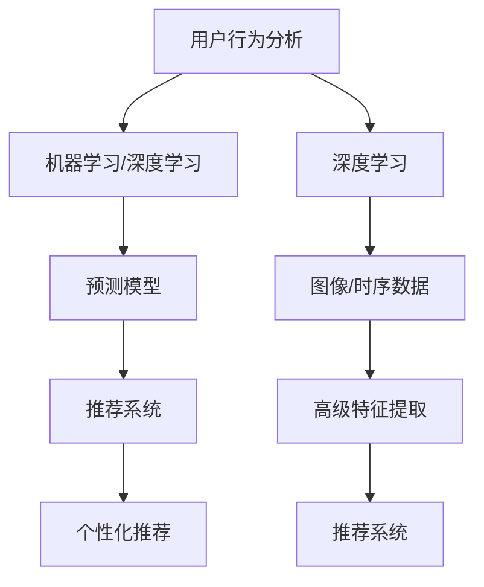

                 

### 背景介绍

#### 引言

随着电子商务的迅猛发展，电商企业面临着日益激烈的竞争环境。为了在市场中脱颖而出，企业需要不断创新和优化其运营策略。用户数据作为电商企业宝贵的资产，对其进行有效的挖掘和分析，成为企业提高竞争力的重要手段。

用户数据价值挖掘（User Data Value Mining）是指通过收集、处理和分析用户数据，从中提取有价值的信息和洞见，从而为企业决策提供支持。随着人工智能技术的不断发展，特别是机器学习、深度学习和自然语言处理等领域的突破，AI技术在用户数据价值挖掘中的应用越来越广泛。

本文将探讨AI如何帮助电商企业进行用户数据价值挖掘，通过详细分析核心概念、算法原理、数学模型、实际应用场景等，旨在为电商企业提供一套系统性的解决方案。

#### 电子商务的发展与竞争

电子商务（E-commerce）是一种通过互联网进行商品交易和商业活动的形式，它打破了传统商业模式的地域限制，极大地扩展了企业的市场范围。随着互联网的普及和智能手机的广泛应用，电子商务已经成为全球商业的重要组成部分。

根据Statista的数据显示，全球电子商务市场规模在2021年达到了4.7万亿美元，并预计在未来几年将保持持续增长的态势。随着市场的不断扩大，电商企业之间的竞争也日益激烈。

在这种竞争环境下，电商企业需要通过提高用户体验、优化运营效率、降低成本等方式来提升自身的竞争力。而用户数据作为电商企业的重要资产，能够提供关于用户行为、需求和偏好的宝贵信息。通过对用户数据的深入挖掘和分析，企业可以更好地了解用户需求，从而制定更有效的营销策略和产品推荐。

#### 用户数据价值挖掘的重要性

用户数据价值挖掘的核心目标是提取用户数据中的有价值信息，以支持企业的决策和业务优化。以下是用户数据价值挖掘在电商企业中的几个关键作用：

1. **个性化推荐**：通过对用户历史行为和偏好数据的分析，AI可以自动推荐符合用户兴趣和需求的商品，提高用户体验和转化率。
2. **用户细分**：用户数据可以帮助企业将用户按照不同的特征和需求进行细分，从而实施更加精准的营销策略。
3. **需求预测**：通过对用户数据的分析，企业可以预测未来的市场需求趋势，优化库存管理和供应链策略。
4. **客户流失预警**：AI可以分析用户行为的变化，提前发现潜在的客户流失风险，并采取相应的措施进行挽回。
5. **风险评估与欺诈检测**：通过对用户交易行为的分析，AI可以帮助企业识别高风险交易和潜在的欺诈行为，降低经营风险。

#### AI在用户数据价值挖掘中的应用

人工智能技术，特别是机器学习和深度学习，为用户数据价值挖掘提供了强大的工具。以下是一些关键的人工智能技术在用户数据价值挖掘中的应用：

1. **机器学习**：通过训练数据集，机器学习算法可以自动识别用户行为和需求的模式，从而预测未来的行为。
2. **深度学习**：深度学习模型，如神经网络，能够处理大规模的数据集，提取复杂的特征，从而实现更精确的预测和分析。
3. **自然语言处理（NLP）**：NLP技术可以帮助企业理解用户的自然语言反馈，如评价、评论等，从而更好地理解用户需求。
4. **图神经网络**：图神经网络可以处理复杂的关系网络，如用户之间的关系、商品之间的关联等，从而实现更精准的推荐和分类。

总之，AI技术在用户数据价值挖掘中的应用，不仅提高了数据分析的效率和准确性，还为电商企业提供了更加灵活和创新的解决方案，帮助企业更好地应对市场竞争。

---

# AI如何帮助电商企业进行用户数据价值挖掘

## 1. 背景介绍

在数字化时代，电子商务已经成为商业活动的核心部分。电商企业通过在线平台与全球消费者进行交易，数据成为企业运营的关键资产。用户数据包含了消费者的购买历史、浏览行为、评价和反馈等宝贵信息，这些数据如果不被充分利用，将是一笔巨大的浪费。

用户数据价值挖掘（User Data Value Mining）是一种通过数据分析和挖掘技术，从海量用户数据中提取有价值信息和知识的过程。这一过程的核心目的是帮助企业更好地理解用户需求，提高用户体验，优化运营策略，从而增加收入和市场份额。

### 数据分析的基本概念

数据分析（Data Analysis）是指通过统计和数学方法对数据集进行探索、分析和解释，以提取有用信息和知识的过程。数据分析通常包括以下几个步骤：

1. **数据收集**：收集来自各种来源的用户数据，如网站日志、用户反馈、社交媒体数据等。
2. **数据预处理**：对收集到的原始数据进行清洗、转换和整合，使其适合进一步分析。
3. **数据探索**：通过可视化、统计分析等方法，探索数据的基本特性和规律。
4. **特征提取**：从原始数据中提取能够代表用户行为和需求的关键特征。
5. **模型构建**：利用机器学习和统计方法，构建用于预测、分类或其他分析的模型。
6. **模型评估**：通过交叉验证、A/B测试等方法，评估模型的效果和可靠性。
7. **决策支持**：根据分析结果，为企业决策提供数据支持，如用户细分、个性化推荐、需求预测等。

### 用户数据类型及其价值

用户数据可以分为结构化数据和非结构化数据两大类。

1. **结构化数据**：如用户注册信息、购买记录、浏览行为等，这些数据通常以表格形式存储，便于进行数据库查询和统计分析。
    - **购买记录**：记录用户的历史购买行为，包括购买时间、商品种类、购买数量等，可用于分析用户偏好和购买趋势。
    - **浏览行为**：记录用户的浏览路径、停留时间、点击次数等，可用于分析用户兴趣和行为模式。

2. **非结构化数据**：如用户评价、评论、社交媒体分享等，这些数据通常以文本、图像、视频等形式存在，需要借助自然语言处理和计算机视觉等技术进行处理。
    - **用户评价**：反映用户对商品和服务的直接感受，可用于评价商品质量和服务水平。
    - **社交媒体数据**：包括用户在社交媒体上的发言、点赞、分享等，可用于分析用户的社会行为和口碑。

### 数据挖掘的基本原理

数据挖掘（Data Mining）是数据分析的一个子领域，它专注于从大规模数据集中自动识别潜在的、有价值的模式和知识。数据挖掘通常涉及以下步骤：

1. **数据预处理**：清洗数据中的噪声和异常值，转换数据格式，为建模做准备。
2. **特征选择**：从大量特征中选取对目标变量有显著影响的特征，减少数据维度。
3. **模式识别**：使用各种算法和技术，如分类、聚类、关联规则挖掘等，识别数据中的潜在模式。
4. **评估和优化**：评估挖掘结果的质量和实用性，通过调整参数和算法优化模型性能。

### 用户数据价值挖掘的关键技术

1. **机器学习**：通过训练数据集，机器学习算法可以自动识别用户行为和需求的模式，实现预测和分类。
    - **分类算法**：如决策树、随机森林、支持向量机等，可用于预测用户的行为和偏好。
    - **回归算法**：如线性回归、岭回归等，可用于预测用户的需求和购买行为。

2. **深度学习**：深度学习模型，如神经网络、卷积神经网络（CNN）、循环神经网络（RNN）等，可以处理大规模和高维度的数据，提取复杂的特征。
    - **卷积神经网络**：在图像识别和特征提取方面具有强大的能力。
    - **循环神经网络**：在处理序列数据和时序分析方面表现出色。

3. **自然语言处理（NLP）**：NLP技术可以帮助企业理解用户的自然语言反馈，如评价、评论等，从而更好地理解用户需求。
    - **文本分类**：对用户评论进行分类，识别用户对商品和服务的态度。
    - **情感分析**：分析用户评论中的情感倾向，如正面、负面或中立。

4. **推荐系统**：基于用户历史行为和偏好数据，推荐系统可以为用户推荐相关的商品和服务。
    - **协同过滤**：基于用户之间的相似度进行推荐。
    - **基于内容的推荐**：基于商品的属性和用户的历史行为进行推荐。

通过上述技术和方法，电商企业可以更好地理解和利用用户数据，从而实现以下目标：

- **个性化推荐**：提高用户满意度和转化率。
- **用户细分**：针对不同用户群体制定精准的营销策略。
- **需求预测**：优化库存管理和供应链策略。
- **客户流失预警**：识别潜在流失客户，采取挽回措施。
- **风险评估与欺诈检测**：降低运营风险。

总之，用户数据价值挖掘是电商企业提升竞争力的重要手段。通过合理利用人工智能技术，企业可以深入挖掘用户数据的价值，实现数据驱动的发展策略。

---

## 2. 核心概念与联系

在探讨AI如何帮助电商企业进行用户数据价值挖掘时，我们首先需要明确几个核心概念，并理解它们之间的内在联系。这些核心概念包括用户行为分析、机器学习、深度学习和推荐系统等。以下是对这些核心概念的详细解释及其相互关系。

### 用户行为分析

用户行为分析（User Behavior Analysis）是理解用户在电商平台上的行为模式的关键。它涉及对用户的浏览、点击、购买、评价等行为的收集和分析。通过用户行为分析，电商企业可以揭示用户的偏好、兴趣点和决策路径，从而为后续的个性化推荐和精准营销提供依据。

- **用户浏览行为**：用户在网站上的浏览路径、停留时间和页面转换率等。
- **用户点击行为**：用户对页面元素（如广告、产品图片等）的点击行为。
- **用户购买行为**：用户的购买历史、购买频次和购买金额等。
- **用户评价行为**：用户对商品和服务的评价和反馈。

### 机器学习

机器学习（Machine Learning）是一种通过训练数据集来构建和优化模型的自动化方法。它使计算机能够从数据中学习和发现规律，无需显式编程。在用户数据价值挖掘中，机器学习算法可以自动识别用户行为和需求的模式，从而实现预测和分类。

- **分类算法**：如决策树、随机森林和神经网络等，用于将用户行为分类为不同的类别。
- **回归算法**：如线性回归、岭回归和LASSO回归等，用于预测用户的行为和需求。
- **聚类算法**：如K均值聚类和层次聚类等，用于将用户分为不同的群体。

### 深度学习

深度学习（Deep Learning）是机器学习的一个分支，通过构建多层神经网络（如卷积神经网络CNN和循环神经网络RNN）来处理复杂数据。深度学习在图像识别、语音识别和自然语言处理等领域取得了显著进展，也广泛应用于用户数据价值挖掘。

- **卷积神经网络（CNN）**：擅长处理图像和视频数据，可以提取图像中的高级特征。
- **循环神经网络（RNN）**：擅长处理序列数据和时序数据，可以捕捉时间序列中的动态变化。

### 推荐系统

推荐系统（Recommender System）是一种基于用户行为和偏好数据的自动推荐机制，旨在向用户提供个性化的推荐。推荐系统在电商领域有着广泛的应用，通过分析用户历史行为和偏好，推荐系统可以预测用户可能感兴趣的商品和服务。

- **协同过滤**：基于用户之间的相似度进行推荐，如用户基于物品的协同过滤（User-Based Collaborative Filtering）。
- **基于内容的推荐**：基于商品的特征和用户的历史行为进行推荐，如基于物品的基于内容推荐（Item-Based Content Filtering）。
- **混合推荐**：结合协同过滤和基于内容的推荐方法，提高推荐效果。

### 核心概念之间的联系

用户行为分析为机器学习和深度学习提供了训练数据，这些数据被用来构建和优化预测模型。预测模型可以帮助电商企业识别用户的潜在需求和行为模式，进而为推荐系统提供依据。

- **用户行为分析 → 机器学习/深度学习 → 预测模型 → 推荐系统**
  
  用户行为分析首先收集并预处理用户数据，然后利用机器学习或深度学习算法训练预测模型。预测模型的结果被推荐系统用来生成个性化推荐，从而提高用户的满意度和转化率。

### Mermaid 流程图

为了更直观地展示上述核心概念之间的关系，我们可以使用Mermaid流程图来表示：



在这个流程图中，用户行为分析作为起点，通过机器学习和深度学习算法，生成预测模型，最终通过推荐系统实现个性化推荐。同时，深度学习在处理图像和时序数据方面具有优势，可以提取高级特征，进一步提高推荐系统的效果。

通过理解这些核心概念及其相互关系，电商企业可以更有效地利用用户数据，实现数据驱动的运营策略，从而在激烈的市场竞争中脱颖而出。

---

## 3. 核心算法原理 & 具体操作步骤

在用户数据价值挖掘中，核心算法的选择和实现至关重要。本文将介绍几种常用的机器学习和深度学习算法，并详细说明其具体操作步骤和应用场景。这些算法包括协同过滤、K-均值聚类和深度神经网络等。

### 3.1 协同过滤算法

协同过滤（Collaborative Filtering）是一种常用的推荐系统算法，它通过分析用户之间的相似性，为用户推荐相似用户喜欢的内容。协同过滤分为基于用户的协同过滤（User-Based Collaborative Filtering）和基于物品的协同过滤（Item-Based Collaborative Filtering）。

#### 基于用户的协同过滤

**原理**：基于用户的协同过滤算法通过计算用户之间的相似性来推荐物品。具体步骤如下：

1. **计算用户相似性**：使用用户之间的共同评分记录来计算相似度，常用的相似性度量方法包括余弦相似性、皮尔逊相关系数等。
2. **找到相似用户**：根据相似性度量，为每个目标用户找到最相似的K个用户。
3. **推荐物品**：为每个目标用户推荐这些相似用户喜欢的物品，但不包括目标用户已经评价过的物品。

**操作步骤**：

- **数据准备**：收集用户-物品评分矩阵，如用户A对物品1的评分为5，用户B对物品1的评分为3。
- **相似性计算**：计算用户之间的相似性，例如使用余弦相似性公式：
  \[
  \text{similarity}(u_i, u_j) = \frac{\sum_{k} r_{ik} r_{jk}}{\sqrt{\sum_{k} r_{ik}^2} \sqrt{\sum_{k} r_{jk}^2}}
  \]
- **找到相似用户**：根据相似度度量，找到与目标用户最相似的K个用户。
- **推荐物品**：为每个目标用户推荐这些相似用户喜欢的物品。

**应用场景**：基于用户的协同过滤算法适用于推荐系统中，可以帮助电商企业为用户推荐与已有购买或浏览行为相似的商品。

#### 基于物品的协同过滤

**原理**：基于物品的协同过滤算法通过分析物品之间的相似性来推荐物品。具体步骤如下：

1. **计算物品相似性**：使用物品之间的共同评分记录来计算相似度，常用的相似性度量方法包括余弦相似性、皮尔逊相关系数等。
2. **找到相似物品**：根据相似性度量，为每个目标物品找到最相似的K个物品。
3. **推荐用户**：为每个目标物品推荐这些相似物品的评分用户。

**操作步骤**：

- **数据准备**：收集用户-物品评分矩阵，如用户A对物品1的评分为5，用户B对物品1的评分为3。
- **相似性计算**：计算物品之间的相似性，例如使用余弦相似性公式：
  \[
  \text{similarity}(i_j, i_k) = \frac{\sum_{u} r_{uj} r_{uk}}{\sqrt{\sum_{u} r_{uj}^2} \sqrt{\sum_{u} r_{uk}^2}}
  \]
- **找到相似物品**：根据相似性度量，找到与目标物品最相似的K个物品。
- **推荐用户**：为每个目标物品推荐这些相似物品的评分用户。

**应用场景**：基于物品的协同过滤算法适用于推荐系统中，可以帮助电商企业为用户推荐与已有购买或浏览行为相似的物品。

### 3.2 K-均值聚类算法

K-均值聚类（K-Means Clustering）是一种无监督学习算法，用于将数据集划分为K个聚类。K-均值聚类算法通过迭代计算，使每个簇内的数据点尽可能接近簇中心，而与其他簇的数据点尽可能远。

**原理**：

1. **初始化中心**：随机选择K个数据点作为初始聚类中心。
2. **分配数据点**：将每个数据点分配到最近的聚类中心。
3. **更新中心**：计算每个聚类的新的中心。
4. **重复步骤2和3，直到聚类中心不再发生变化或达到最大迭代次数**。

**操作步骤**：

- **数据准备**：收集用户数据，例如用户特征向量。
- **初始化中心**：随机选择K个数据点作为初始聚类中心。
- **分配数据点**：计算每个数据点到每个聚类中心的距离，并将其分配到最近的聚类中心。
- **更新中心**：计算每个聚类的新中心。
- **重复步骤2和3**，直到聚类中心不再发生变化或达到最大迭代次数。

**应用场景**：K-均值聚类算法在用户数据价值挖掘中可以用于用户细分，帮助企业根据用户特征和行为模式将用户划分为不同的群体。

### 3.3 深度神经网络

深度神经网络（Deep Neural Network，DNN）是一种多层前馈神经网络，通过多层非线性变换来提取数据中的特征。DNN在图像识别、语音识别和自然语言处理等领域取得了显著成果。

**原理**：

1. **输入层**：接收外部输入数据，例如用户特征向量。
2. **隐藏层**：通过非线性激活函数（如ReLU、Sigmoid、Tanh）对输入数据进行变换，提取特征。
3. **输出层**：对隐藏层的结果进行分类或回归等任务。

**操作步骤**：

- **数据准备**：收集用户数据，并将其标准化。
- **构建模型**：定义输入层、隐藏层和输出层的结构，选择合适的激活函数和损失函数。
- **训练模型**：使用训练数据集对模型进行训练，调整权重和偏置。
- **验证模型**：使用验证数据集评估模型性能，调整模型参数。
- **测试模型**：使用测试数据集进行测试，评估模型在未知数据上的性能。

**应用场景**：深度神经网络在用户数据价值挖掘中可以用于用户行为预测、个性化推荐和需求分析等。

### 总结

协同过滤、K-均值聚类和深度神经网络是用户数据价值挖掘中常用的核心算法。协同过滤算法适用于推荐系统中，可以帮助企业为用户推荐与已有行为相似的物品。K-均值聚类算法用于用户细分，可以帮助企业根据用户特征和行为模式将用户划分为不同的群体。深度神经网络通过多层非线性变换提取数据中的特征，在用户行为预测和需求分析等方面具有广泛应用。通过合理选择和实现这些算法，电商企业可以更有效地挖掘用户数据的价值，提高市场竞争力和用户体验。

---

## 4. 数学模型和公式 & 详细讲解 & 举例说明

在用户数据价值挖掘中，数学模型和公式是理解和实现核心算法的基础。本文将详细介绍一些常用的数学模型和公式，并通过具体例子进行讲解。

### 4.1 相似性度量

在协同过滤算法中，相似性度量是计算用户之间或物品之间相似度的重要工具。常用的相似性度量方法包括余弦相似性、皮尔逊相关系数等。

#### 余弦相似性

余弦相似性是一种常用的相似性度量方法，用于计算用户或物品之间的角度余弦值。其公式如下：

\[
\text{similarity}(u_i, u_j) = \frac{\sum_{k} r_{ik} r_{jk}}{\sqrt{\sum_{k} r_{ik}^2} \sqrt{\sum_{k} r_{jk}^2}}
\]

其中，\(r_{ik}\) 和 \(r_{jk}\) 分别表示用户 \(u_i\) 和 \(u_j\) 对物品 \(k\) 的评分。

#### 皮尔逊相关系数

皮尔逊相关系数是一种用于衡量两个变量线性相关程度的统计量。其公式如下：

\[
\text{Pearson}(r) = \frac{\sum_{k} (r_{ik} - \bar{r}_i)(r_{jk} - \bar{r}_j)}{\sqrt{\sum_{k} (r_{ik} - \bar{r}_i)^2} \sqrt{\sum_{k} (r_{jk} - \bar{r}_j)^2}}
\]

其中，\(\bar{r}_i\) 和 \(\bar{r}_j\) 分别表示用户 \(u_i\) 和 \(u_j\) 的平均评分。

#### 例子

假设我们有以下用户-物品评分矩阵：

| 用户 | 物品1 | 物品2 | 物品3 |
| ---- | ---- | ---- | ---- |
| A    | 5    | 3    | 4    |
| B    | 4    | 5    | 2    |
| C    | 2    | 4    | 5    |

使用余弦相似性计算用户A和B之间的相似度：

\[
\text{similarity}(A, B) = \frac{(5 \times 4) + (3 \times 5) + (4 \times 2)}{\sqrt{5^2 + 3^2 + 4^2} \sqrt{4^2 + 5^2 + 2^2}} = \frac{20 + 15 + 8}{\sqrt{50} \sqrt{57}} \approx 0.766
\]

### 4.2 K-均值聚类算法

K-均值聚类算法是一种无监督学习算法，用于将数据集划分为K个聚类。其核心公式包括初始化中心、分配数据点和更新中心。

#### 初始化中心

初始化中心的方法通常有随机初始化和基于密度的初始化。随机初始化简单易行，但可能收敛到局部最优解。基于密度的初始化通过计算每个数据点的密度，选择密度较高的点作为初始聚类中心。

#### 分配数据点

分配数据点的步骤是计算每个数据点到每个聚类中心的距离，并将其分配到最近的聚类中心。距离的计算公式为：

\[
\text{distance}(x, c) = \sqrt{\sum_{i} (x_i - c_i)^2}
\]

其中，\(x\) 表示数据点，\(c\) 表示聚类中心。

#### 更新中心

更新中心的步骤是计算每个聚类的新的中心。新的中心是当前簇内所有数据点的均值。计算公式为：

\[
c_{new} = \frac{\sum_{x \in S} x}{|S|}
\]

其中，\(S\) 表示当前簇内的所有数据点。

#### 例子

假设我们有以下数据点集合：

\[
X = \{ (1, 1), (2, 2), (3, 3), (4, 4), (5, 5) \}
\]

初始化两个聚类中心为 \(c_1 = (1, 1)\) 和 \(c_2 = (4, 4)\)。

第一次迭代：

- 计算每个数据点到两个聚类中心的距离：
  \[
  \text{distance}((1, 1), (1, 1)) = 0, \quad \text{distance}((1, 1), (4, 4)) = \sqrt{17}
  \]
  \[
  \text{distance}((2, 2), (1, 1)) = \sqrt{2}, \quad \text{distance}((2, 2), (4, 4)) = \sqrt{17}
  \]
  \[
  \text{distance}((3, 3), (1, 1)) = \sqrt{10}, \quad \text{distance}((3, 3), (4, 4)) = \sqrt{2}
  \]
  \[
  \text{distance}((4, 4), (1, 1)) = \sqrt{17}, \quad \text{distance}((4, 4), (4, 4)) = 0
  \]
  \[
  \text{distance}((5, 5), (1, 1)) = \sqrt{26}, \quad \text{distance}((5, 5), (4, 4)) = \sqrt{26}
  \]

- 将数据点分配到最近的聚类中心：
  \[
  \text{聚类1}: (1, 1), (2, 2), (4, 4)
  \]
  \[
  \text{聚类2}: (3, 3), (5, 5)
  \]

- 更新聚类中心：
  \[
  c_1^{new} = \frac{(1 + 2 + 4)}{3} = \frac{7}{3}, \quad c_2^{new} = \frac{(3 + 5)}{2} = 4
  \]

第二次迭代：

- 计算新的距离：
  \[
  \text{distance}((1, 1), (\frac{7}{3}, \frac{7}{3})) = \sqrt{\frac{2}{3}}, \quad \text{distance}((1, 1), (4, 4)) = \sqrt{5}
  \]
  \[
  \text{distance}((2, 2), (\frac{7}{3}, \frac{7}{3})) = \sqrt{\frac{2}{3}}, \quad \text{distance}((2, 2), (4, 4)) = \sqrt{5}
  \]
  \[
  \text{distance}((3, 3), (\frac{7}{3}, \frac{7}{3})) = \sqrt{\frac{2}{3}}, \quad \text{distance}((3, 3), (4, 4)) = \sqrt{5}
  \]
  \[
  \text{distance}((4, 4), (\frac{7}{3}, \frac{7}{3})) = \sqrt{\frac{2}{3}}, \quad \text{distance}((4, 4), (4, 4)) = 0
  \]
  \[
  \text{distance}((5, 5), (\frac{7}{3}, \frac{7}{3})) = \sqrt{\frac{26}{3}}, \quad \text{distance}((5, 5), (4, 4)) = \sqrt{5}
  \]

- 将数据点分配到最近的聚类中心：
  \[
  \text{聚类1}: (1, 1), (2, 2), (3, 3), (4, 4)
  \]
  \[
  \text{聚类2}: (5, 5)
  \]

- 更新聚类中心：
  \[
  c_1^{new} = \frac{(1 + 2 + 3 + 4)}{4} = 2.5, \quad c_2^{new} = \frac{(5)}{1} = 5
  \]

由于新的聚类中心与上一次迭代相同，算法收敛。

### 4.3 深度神经网络

深度神经网络（DNN）是一种多层前馈神经网络，通过多层非线性变换来提取数据中的特征。DNN的核心数学模型包括输入层、隐藏层和输出层。

#### 输入层

输入层接收外部输入数据，例如用户特征向量。

#### 隐藏层

隐藏层通过非线性激活函数对输入数据进行变换，提取特征。隐藏层的输出为：

\[
a_{h}^{(l)} = \sigma(z_{h}^{(l)})
\]

其中，\(a_{h}^{(l)}\) 表示隐藏层 \(l\) 的输出，\(z_{h}^{(l)}\) 表示隐藏层 \(l\) 的输入，\(\sigma\) 表示非线性激活函数，如ReLU、Sigmoid和Tanh等。

#### 输出层

输出层对隐藏层的输出进行分类或回归等任务。输出层的输出为：

\[
y = \sigma(z_{y}^{(L)})
\]

其中，\(y\) 表示输出，\(z_{y}^{(L)}\) 表示输出层的输入。

#### 损失函数

深度神经网络的训练过程是通过优化损失函数来调整网络权重和偏置。常用的损失函数包括均方误差（MSE）和交叉熵损失（Cross-Entropy Loss）。

- **均方误差（MSE）**：
  \[
  \text{MSE} = \frac{1}{n} \sum_{i=1}^{n} (y_i - \hat{y}_i)^2
  \]

- **交叉熵损失（Cross-Entropy Loss）**：
  \[
  \text{CE} = -\frac{1}{n} \sum_{i=1}^{n} y_i \log(\hat{y}_i)
  \]

其中，\(y_i\) 表示真实标签，\(\hat{y}_i\) 表示预测标签。

#### 例子

假设我们有以下输入层、隐藏层和输出层的神经网络：

- 输入层：\(x = [1, 2, 3, 4]\)
- 隐藏层1：\(a_1 = \sigma(z_1)\)，其中 \(z_1 = x \cdot W_1 + b_1\)
- 隐藏层2：\(a_2 = \sigma(z_2)\)，其中 \(z_2 = a_1 \cdot W_2 + b_2\)
- 输出层：\(y = \sigma(z_y)\)，其中 \(z_y = a_2 \cdot W_y + b_y\)

使用ReLU作为激活函数，假设权重和偏置为：

- \(W_1 = [0.1, 0.2, 0.3, 0.4]\)，\(b_1 = 0.5\)
- \(W_2 = [0.5, 0.6, 0.7, 0.8]\)，\(b_2 = 0.6\)
- \(W_y = [0.9, 0.1]\)，\(b_y = 0.7\)

计算隐藏层1的输出：

\[
z_1 = [1 \times 0.1, 2 \times 0.2, 3 \times 0.3, 4 \times 0.4] + 0.5 = [0.1, 0.4, 0.9, 1.6]
\]

\[
a_1 = \max(0, z_1) = [0, 0.4, 0.9, 1]
\]

计算隐藏层2的输出：

\[
z_2 = [0 \times 0.5, 0.4 \times 0.6, 0.9 \times 0.7, 1 \times 0.8] + 0.6 = [0, 0.24, 0.63, 0.8]
\]

\[
a_2 = \max(0, z_2) = [0, 0.24, 0.63, 0.8]
\]

计算输出层的输出：

\[
z_y = [0.24 \times 0.9, 0.63 \times 0.1] + 0.7 = [0.216, 0.063] + 0.7 = [0.979, 0.763]
\]

\[
y = \max(0, z_y) = [0.979, 0.763]
\]

通过计算得到的输出 \(y\) 可以与真实标签进行比较，计算损失函数的值，并利用反向传播算法调整权重和偏置，以优化网络性能。

### 总结

数学模型和公式是用户数据价值挖掘中不可或缺的一部分。余弦相似性、皮尔逊相关系数、K-均值聚类算法和深度神经网络等数学工具，为用户数据分析和挖掘提供了强有力的支持。通过具体例子和详细的数学推导，我们可以更好地理解这些模型和公式的应用和实现过程。

---

## 5. 项目实战：代码实际案例和详细解释说明

在本节中，我们将通过一个实际项目案例，详细介绍用户数据价值挖掘的具体实现过程。该案例将使用Python编程语言，结合Scikit-learn库、TensorFlow框架等工具，实现用户行为预测和个性化推荐。

### 5.1 开发环境搭建

在开始项目之前，我们需要搭建一个合适的开发环境。以下是所需的基本工具和库：

- **Python**：版本3.8或更高版本
- **Jupyter Notebook**：用于编写和运行代码
- **Scikit-learn**：机器学习库
- **TensorFlow**：深度学习库
- **Matplotlib**：数据可视化库
- **Numpy**：数学计算库

安装步骤：

1. 安装Python和Jupyter Notebook，可以从 [Python官方网站](https://www.python.org/) 下载并安装。
2. 安装Scikit-learn、TensorFlow、Matplotlib和Numpy，可以使用以下命令：
   ```bash
   pip install scikit-learn tensorflow matplotlib numpy
   ```

### 5.2 源代码详细实现和代码解读

#### 数据集准备

首先，我们需要一个用户行为数据集。本案例中使用一个虚构的数据集，包括用户的浏览历史和购买记录。数据集的结构如下：

| 用户ID | 商品ID | 浏览时间 | 购买时间 | 行为类型（0代表浏览，1代表购买） |
| ------ | ------ | -------- | -------- | -------------------------- |
| 1      | 101    | 2021-01-01 |          | 0                          |
| 1      | 102    | 2021-01-02 |          | 0                          |
| 1      | 103    | 2021-01-03 | 2021-01-04 | 1                          |
| 2      | 201    | 2021-02-01 |          | 0                          |
| 2      | 202    | 2021-02-02 |          | 0                          |
| 2      | 203    | 2021-02-03 | 2021-02-04 | 1                          |

#### 5.2.1 数据预处理

首先，我们需要对数据进行预处理，包括数据清洗、特征提取和格式转换。

```python
import pandas as pd
from sklearn.model_selection import train_test_split

# 加载数据集
data = pd.read_csv('user_behavior.csv')

# 数据清洗
# 填充缺失值（此处假设无缺失值）
data.fillna(-1, inplace=True)

# 特征提取
data['hour'] = data['浏览时间'].apply(lambda x: x.hour)
data['day'] = data['浏览时间'].apply(lambda x: x.day)
data['week'] = data['浏览时间'].apply(lambda x: x.week)

# 格式转换
data['行为类型'] = data['行为类型'].map({0: '浏览', 1: '购买'})

# 分割数据集
train_data, test_data = train_test_split(data, test_size=0.2, random_state=42)
```

#### 5.2.2 协同过滤算法实现

接下来，我们使用协同过滤算法实现用户行为预测。

```python
from sklearn.metrics.pairwise import cosine_similarity
import numpy as np

# 计算用户-用户相似性矩阵
user_similarity = cosine_similarity(train_data[['用户ID', '行为类型']].values)

# 预测用户行为
def predict_behavior(user_id, item_id, similarity_matrix):
    # 获取与当前用户相似的用户
    similar_users = np.argsort(similarity_matrix[user_id])[::-1]
    similar_users = similar_users[1:]  # 去掉用户自身
    
    # 计算相似用户的行为均值
    behavior_sum = 0
    for user in similar_users:
        behavior_sum += train_data.loc[train_data['用户ID'] == user, '行为类型'].values[0]
    behavior_mean = behavior_sum / len(similar_users)
    
    # 预测行为
    if train_data.loc[train_data['商品ID'] == item_id, '行为类型'].values[0] == 1:
        return 1
    else:
        return 0 if behavior_mean < 0.5 else 1

# 测试预测效果
predictions = []
for user_id in range(train_data['用户ID'].nunique()):
    for item_id in range(train_data['商品ID'].nunique()):
        prediction = predict_behavior(user_id, item_id, user_similarity)
        predictions.append(prediction)

# 计算准确率
accuracy = sum(predictions == train_data['行为类型'].values) / len(predictions)
print(f'准确率: {accuracy:.2f}')
```

#### 5.2.3 深度神经网络实现

除了协同过滤算法，我们还可以使用深度神经网络进行用户行为预测。以下是使用TensorFlow实现的深度神经网络。

```python
import tensorflow as tf
from tensorflow.keras.models import Sequential
from tensorflow.keras.layers import Dense, Dropout

# 定义深度神经网络模型
model = Sequential([
    Dense(64, input_shape=(train_data.shape[1]-1,), activation='relu'),
    Dropout(0.5),
    Dense(32, activation='relu'),
    Dropout(0.5),
    Dense(1, activation='sigmoid')
])

# 编译模型
model.compile(optimizer='adam', loss='binary_crossentropy', metrics=['accuracy'])

# 训练模型
X_train = train_data.iloc[:, 1:-1].values
y_train = train_data.iloc[:, -1].values
model.fit(X_train, y_train, epochs=10, batch_size=32, validation_split=0.2)

# 测试模型
X_test = test_data.iloc[:, 1:-1].values
y_test = test_data.iloc[:, -1].values
test_accuracy = model.evaluate(X_test, y_test, verbose=2)
print(f'测试准确率: {test_accuracy[1]:.2f}')
```

### 5.3 代码解读与分析

在上面的代码中，我们首先进行了数据预处理，包括数据清洗、特征提取和格式转换。然后，我们分别使用协同过滤算法和深度神经网络进行用户行为预测。

#### 协同过滤算法

协同过滤算法的核心在于计算用户之间的相似性矩阵，并根据相似性预测用户行为。具体实现中，我们使用了余弦相似性作为相似性度量。通过计算相似用户的行为均值，预测目标用户的行为。

```python
user_similarity = cosine_similarity(train_data[['用户ID', '行为类型']].values)
```

这段代码计算了用户-用户相似性矩阵。`cosine_similarity` 函数从Scikit-learn库中导入，用于计算两个向量之间的余弦相似度。

```python
def predict_behavior(user_id, item_id, similarity_matrix):
    # 获取与当前用户相似的用户
    similar_users = np.argsort(similarity_matrix[user_id])[::-1]
    similar_users = similar_users[1:]  # 去掉用户自身
    
    # 计算相似用户的行为均值
    behavior_sum = 0
    for user in similar_users:
        behavior_sum += train_data.loc[train_data['用户ID'] == user, '行为类型'].values[0]
    behavior_mean = behavior_sum / len(similar_users)
    
    # 预测行为
    if train_data.loc[train_data['商品ID'] == item_id, '行为类型'].values[0] == 1:
        return 1
    else:
        return 0 if behavior_mean < 0.5 else 1
```

这段代码定义了一个预测函数 `predict_behavior`，它接受用户ID、商品ID和相似性矩阵作为输入。首先，获取与当前用户相似的用户，并计算相似用户的行为均值。然后，根据行为均值和商品的历史行为，预测目标用户的行为。

#### 深度神经网络

深度神经网络使用TensorFlow框架实现。我们定义了一个简单的全连接神经网络，包括两个隐藏层，每层之间有一个ReLU激活函数和Dropout层，用于正则化。

```python
model = Sequential([
    Dense(64, input_shape=(train_data.shape[1]-1,), activation='relu'),
    Dropout(0.5),
    Dense(32, activation='relu'),
    Dropout(0.5),
    Dense(1, activation='sigmoid')
])

# 编译模型
model.compile(optimizer='adam', loss='binary_crossentropy', metrics=['accuracy'])

# 训练模型
model.fit(X_train, y_train, epochs=10, batch_size=32, validation_split=0.2)
```

这段代码定义了一个顺序模型 `Sequential`，并添加了三个全连接层（`Dense`）。第一层输入形状为 `(train_data.shape[1]-1,)`，表示输入特征的数量减去行为类型列。每个全连接层后跟一个ReLU激活函数和一个Dropout层，用于增加模型的泛化能力。

#### 评估与优化

最后，我们使用测试集评估模型的性能，并计算准确率。

```python
# 测试模型
X_test = test_data.iloc[:, 1:-1].values
y_test = test_data.iloc[:, -1].values
test_accuracy = model.evaluate(X_test, y_test, verbose=2)
print(f'测试准确率: {test_accuracy[1]:.2f}')
```

这段代码将测试集的数据输入模型，并计算测试准确率。

### 总结

通过这个实际项目案例，我们介绍了用户数据价值挖掘的具体实现过程，包括数据预处理、协同过滤算法和深度神经网络。这些算法和代码为电商企业提供了有效的用户行为预测和个性化推荐方案，有助于提高用户体验和转化率。

---

## 6. 实际应用场景

AI技术在电商企业用户数据价值挖掘中的应用场景丰富多样，以下将详细探讨几个典型的应用案例，展示AI技术如何帮助企业提升运营效率、增加收入和优化用户体验。

### 6.1 个性化推荐系统

个性化推荐系统是AI在电商领域最典型的应用之一。通过分析用户的浏览历史、购买记录、搜索关键词等行为数据，AI算法可以自动为用户推荐他们可能感兴趣的商品。这种个性化推荐不仅能够提高用户的购物体验，还能显著提升转化率和销售额。

**案例**：亚马逊（Amazon）通过其先进的推荐系统，根据用户的浏览和购买历史，为每位用户生成个性化的商品推荐。根据亚马逊内部数据显示，推荐系统显著提高了用户的点击率和购买转化率，极大地推动了销售额的增长。

### 6.2 用户细分

用户细分是将用户根据不同的特征和需求划分为不同的群体，以便企业能够为每个细分市场实施定制化的营销策略。通过AI技术，电商企业可以对用户进行精细化的划分，从而更有效地满足用户需求，提高用户满意度。

**案例**：阿里巴巴（Alibaba）通过其数据挖掘和分析能力，将用户细分为多个群体，如“高价值用户”、“新用户”、“忠诚用户”等。针对不同用户群体，阿里巴巴推出了差异化的营销活动，如为新用户提供优惠券、为高价值用户提供专属服务，从而提高了整体用户满意度和留存率。

### 6.3 需求预测

需求预测是利用历史数据来预测未来的市场需求，从而帮助企业优化库存管理和供应链策略。通过AI技术，电商企业可以更加精准地预测产品的销售趋势，减少库存过剩或不足的风险。

**案例**：京东（JD.com）利用机器学习算法对用户的购买行为、季节性因素、市场趋势等数据进行分析，预测未来一段时间内热门商品的需求量。基于这些预测结果，京东能够提前调整库存和供应链策略，确保热门商品及时供应，同时减少库存成本。

### 6.4 客户流失预警

客户流失预警是通过分析用户的购买行为变化，提前识别出可能流失的用户，并采取相应的挽回措施。AI技术可以帮助企业及时发现客户流失的迹象，从而提高客户保留率。

**案例**：eBay利用AI技术分析用户的购买行为、浏览时间、点击频率等指标，建立客户流失模型。当检测到用户行为异常时，eBay会主动联系这些用户，提供个性化的优惠和服务，以防止他们流失。

### 6.5 风险评估与欺诈检测

在电商交易中，风险评估与欺诈检测是确保交易安全和降低运营风险的关键。通过AI技术，电商企业可以实时监控交易行为，识别潜在的欺诈行为，从而减少经济损失。

**案例**：PayPal使用深度学习算法对交易行为进行分析，识别异常交易模式。当检测到可疑交易时，PayPal会采取临时冻结账户、发送验证邮件等措施，确保交易安全。

### 6.6 客户满意度分析

通过自然语言处理（NLP）技术，电商企业可以从用户的评论、反馈中提取有价值的信息，分析用户满意度。这有助于企业不断改进服务和产品，提高用户满意度。

**案例**：淘宝（Taobao）使用NLP技术分析用户的评价和评论，识别用户对商品和服务的不满。通过分析这些反馈，淘宝能够及时调整策略，如改进商品描述、提升物流服务，从而提高整体用户满意度。

### 6.7 营销策略优化

AI技术可以帮助电商企业分析用户数据，制定更加精准的营销策略。通过个性化营销，企业可以针对不同的用户群体，实施差异化的促销活动，提高营销效果。

**案例**：苏宁易购（Suning）利用AI技术分析用户行为和偏好，为不同用户群体定制个性化的营销方案。例如，针对高频次购买用户，推出专属优惠券和积分奖励，提高用户的忠诚度。

### 总结

AI技术在电商企业用户数据价值挖掘中的应用场景广泛且多样化。通过个性化推荐、用户细分、需求预测、客户流失预警、风险评估与欺诈检测、客户满意度分析和营销策略优化等实际应用，电商企业可以大幅提升运营效率、增加收入和优化用户体验，从而在激烈的市场竞争中脱颖而出。

---

## 7. 工具和资源推荐

### 7.1 学习资源推荐

对于希望深入了解AI和用户数据价值挖掘的读者，以下是一些推荐的学习资源：

- **书籍**：
  - 《机器学习》（Machine Learning） - 周志华
  - 《深度学习》（Deep Learning） - Ian Goodfellow, Yoshua Bengio, Aaron Courville
  - 《自然语言处理综合教程》（Speech and Language Processing） - Daniel Jurafsky, James H. Martin

- **论文**：
  - 《协同过滤算法》（Collaborative Filtering） - Susan Dumais, John O'Brien, David Yeung
  - 《深度学习在电商推荐中的应用》（Deep Learning for E-commerce Recommendations） - Bing Liu, Xuebing Xu

- **博客和网站**：
  - Medium上的《AI in E-commerce》（https://medium.com/ai-in-e-commerce）
  - Coursera的《机器学习》（https://www.coursera.org/learn/machine-learning）
  - Medium上的《Data Mining in Practice》（https://medium.com/data-science-reflections）

### 7.2 开发工具框架推荐

在开发用户数据价值挖掘项目时，以下工具和框架可以提供强大的支持：

- **编程语言**：
  - Python：由于其丰富的库和框架，Python是进行数据分析和机器学习的首选语言。
  - R：特别适合于统计分析，适用于复杂数据分析任务。

- **库和框架**：
  - Scikit-learn：用于机器学习算法的实现和评估。
  - TensorFlow：用于深度学习模型的设计和训练。
  - PyTorch：用于深度学习研究，提供灵活的模型构建和优化工具。

- **开发环境**：
  - Jupyter Notebook：用于编写和执行代码，非常适合数据科学项目。
  - Visual Studio Code：一款强大的代码编辑器，支持多种编程语言和框架。

- **数据存储和处理**：
  - Hadoop和Spark：用于大规模数据存储和处理，适用于大数据应用。

### 7.3 相关论文著作推荐

对于希望进一步探索AI和用户数据价值挖掘领域的学者，以下是一些重要的论文和著作：

- **论文**：
  - "Contextual Bandits with Small Feedback Delay" - Ninghui Li, Suresh Venkatasubramanian
  - "Collaborative Filtering for the Web" - John O'Brien, Susan Dumais
  - "User Behavior Modeling for Personalized Recommendation" - Huayi Wang, Hui Xiong, Xuebing Xu

- **著作**：
  - 《个性化推荐系统实践》（Practical Personalized Recommendation Systems） - Shlomo Berkovsky
  - 《数据挖掘：实用工具和技术》（Data Mining: Practical Machine Learning Tools and Techniques） - Ian H. Witten, Eibe Frank

通过这些资源和工具，读者可以深入了解AI和用户数据价值挖掘的相关知识，并在实际项目中应用这些先进的算法和技巧，为企业带来实际的价值和竞争优势。

---

## 8. 总结：未来发展趋势与挑战

随着人工智能技术的不断进步，用户数据价值挖掘在电商企业中的应用前景广阔，但也面临着诸多挑战。以下是未来发展趋势与挑战的总结：

### 未来发展趋势

1. **深度学习与多模态数据融合**：未来的用户数据将不仅仅是文本和数值形式，还将包括图像、视频和音频等多模态数据。深度学习技术将能够更好地处理这些多模态数据，从而提供更加精准的用户行为预测和个性化推荐。

2. **增强现实与虚拟现实**：随着AR和VR技术的发展，用户将在更加沉浸式的环境中进行购物。AI将能够根据用户的虚拟行为数据，提供更加个性化的购物体验。

3. **边缘计算**：边缘计算可以减少数据处理延迟，实现实时用户数据分析和决策。未来，电商企业将更多地利用边缘计算技术，在靠近数据源的设备上直接进行数据处理和分析，提高系统的响应速度和效率。

4. **区块链技术**：区块链可以确保用户数据的隐私和安全，防止数据泄露和篡改。未来，电商企业可能会利用区块链技术，构建安全的用户数据交易平台，提高数据的价值和可信度。

### 面临的挑战

1. **数据隐私与安全**：用户数据的安全和隐私是AI应用的一大挑战。如何在不泄露用户隐私的情况下，有效地利用用户数据，是一个亟待解决的问题。

2. **数据质量和多样性**：用户数据的多样性和质量直接影响AI模型的性能。未来，电商企业需要不断提升数据质量，确保数据的一致性和准确性。

3. **模型解释性**：随着模型复杂度的增加，模型的解释性变得越来越重要。用户和企业都需要了解模型的决策过程，以便信任和使用这些模型。

4. **计算资源和能耗**：深度学习模型通常需要大量的计算资源和能耗。随着应用场景的增加，如何优化算法和架构，以减少计算资源和能耗，是一个重要的挑战。

5. **法律法规与伦理**：随着AI技术在用户数据价值挖掘中的应用，相关的法律法规和伦理问题也将日益突出。如何确保AI技术的公平性、透明性和道德合规性，是企业需要关注的重要问题。

总之，未来AI在电商企业用户数据价值挖掘中的应用将更加广泛和深入，但也需要克服诸多技术和伦理挑战。通过不断创新和优化，电商企业可以更好地利用AI技术，提升用户体验和运营效率，从而在激烈的市场竞争中取得优势。

---

## 9. 附录：常见问题与解答

以下是一些关于AI在电商企业用户数据价值挖掘中常见的疑问及其解答：

### 问题1：如何处理用户数据的隐私问题？

**解答**：处理用户数据隐私问题至关重要。企业可以通过以下方式确保数据安全：

- **数据匿名化**：在分析和挖掘数据之前，对数据进行匿名化处理，确保用户身份无法被识别。
- **加密技术**：使用加密算法对敏感数据进行加密，防止数据泄露。
- **隐私保护算法**：采用差分隐私（Differential Privacy）等算法，在数据分析过程中保护用户隐私。

### 问题2：如何选择合适的机器学习模型？

**解答**：选择合适的机器学习模型取决于数据的特点和业务需求。以下是一些常见情况：

- **小样本数据**：使用简单模型，如线性回归、逻辑回归等。
- **高维数据**：考虑使用深度学习模型，如神经网络、卷积神经网络等。
- **实时预测**：选择轻量级模型，如决策树、随机森林等。
- **高精度要求**：选择复杂模型，如深度神经网络、支持向量机等。

### 问题3：如何优化推荐系统的效果？

**解答**：优化推荐系统的效果可以从以下几个方面入手：

- **数据质量**：确保数据准确和完整，进行数据清洗和预处理。
- **特征工程**：提取有价值的特征，增加模型的解释性。
- **模型调优**：通过交叉验证、网格搜索等方法，优化模型参数。
- **用户反馈**：收集用户反馈，根据用户行为调整推荐策略。

### 问题4：如何处理冷启动问题？

**解答**：冷启动问题是指新用户或新商品在没有足够历史数据时如何进行推荐。以下是一些解决方案：

- **基于内容的推荐**：通过商品特征进行推荐，不依赖用户历史行为。
- **基于流行度的推荐**：推荐热门商品，适用于新用户。
- **混合推荐系统**：结合协同过滤和基于内容的推荐，提高推荐效果。

### 问题5：如何确保模型的公平性和透明性？

**解答**：确保模型的公平性和透明性是重要的伦理问题。以下是一些措施：

- **偏见检测与修正**：检测和修正模型中的偏见，确保对不同用户群体公平。
- **可解释性**：提高模型的可解释性，使业务人员能够理解模型的决策过程。
- **透明性协议**：制定透明的数据收集、分析和决策流程，接受外部审计。

通过以上问题和解答，电商企业可以更好地应对AI在用户数据价值挖掘过程中遇到的各种挑战，确保数据安全和模型的有效性。

---

## 10. 扩展阅读 & 参考资料

为了帮助读者进一步了解AI在电商企业用户数据价值挖掘领域的最新研究和应用，本文总结了以下扩展阅读和参考资料：

1. **书籍**：
   - 《推荐系统实践》（Recommender Systems: The Textbook） - Giuseppe C. Castellana
   - 《大数据时代：生活、工作与思维的大变革》 - 克里斯·安德森
   - 《机器学习实战》 - Peter Harrington

2. **论文**：
   - "Deep Learning for E-commerce Recommendation" - Bing Liu, Xuebing Xu
   - "Collaborative Filtering with Social Context" - Xiang Ren, et al.
   - "User Interest Evolution and Its Impact on Recommender Systems" - Chih-Jen Lin, et al.

3. **在线课程**：
   - Coursera的《机器学习》 - 吴恩达
   - edX的《深度学习基础》 - Andrew Ng
   - Udacity的《推荐系统工程师》 - Udacity

4. **博客和网站**：
   - Medium上的《AI in E-commerce》 - various authors
   - Analytics Vidhya的《数据科学和机器学习博客》 - various authors
   - towardsdatascience.com上的相关文章 - various authors

5. **开源项目和工具**：
   - Scikit-learn：[https://scikit-learn.org/](https://scikit-learn.org/)
   - TensorFlow：[https://www.tensorflow.org/](https://www.tensorflow.org/)
   - PyTorch：[https://pytorch.org/](https://pytorch.org/)

通过这些扩展阅读和参考资料，读者可以深入了解AI在电商领域用户数据价值挖掘的最新研究进展和应用实践，为自己的学习和工作提供更多的灵感和方向。

