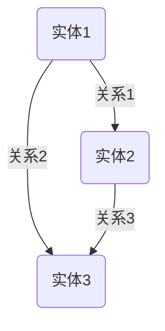
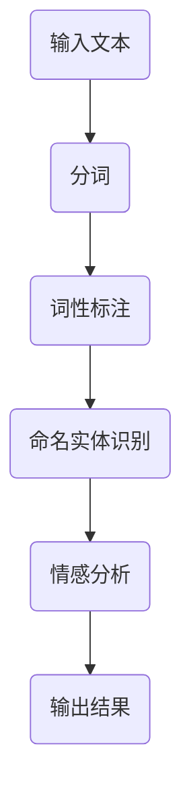
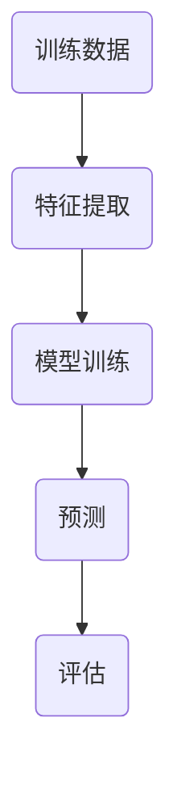

                 

# AI如何改变我们提问和思考的方式

> 关键词：人工智能、提问方式、思考方式、知识图谱、自然语言处理、机器学习

> 摘要：随着人工智能技术的不断发展，我们的提问和思考方式正在发生深刻的变化。本文将探讨AI如何通过知识图谱、自然语言处理和机器学习等技术，改变我们的信息获取、问题解决和创造性思维过程，并探讨未来发展趋势与挑战。

## 1. 背景介绍

在过去的几十年中，计算机技术取得了巨大的进步，从简单的计算器到复杂的智能系统，计算机已经渗透到我们生活的方方面面。随着互联网的普及和大数据的爆发，人工智能（AI）技术逐渐崭露头角，成为当今科技领域的一大热点。人工智能旨在使计算机具备人类智慧，能够模拟、理解和执行人类的思维过程。

在AI的众多应用中，自然语言处理（NLP）和知识图谱是两个关键领域。自然语言处理旨在使计算机理解和生成人类语言，从而实现人机交互的智能化。知识图谱则是一种用于表示和存储知识结构的方法，它通过实体和关系来组织信息，为智能问答和推理提供支持。

近年来，机器学习（ML）技术在AI领域取得了显著的突破，特别是深度学习（DL）的应用。深度学习通过模拟人脑神经网络，使得计算机能够从大量数据中自动学习特征和模式，从而实现高级任务，如图像识别、语音识别和自然语言理解等。

## 2. 核心概念与联系

### 2.1 知识图谱

知识图谱是一种用于表示和存储知识结构的数据模型，它通过实体和关系来组织信息。在知识图谱中，实体表示具体的事物，如人、地点、组织等，而关系则表示实体之间的关联，如“属于”、“位于”等。

知识图谱的构建通常分为以下几个步骤：

1. **数据采集**：从各种数据源中收集实体和关系的信息。
2. **数据预处理**：清洗和标准化数据，去除重复和不准确的信息。
3. **实体和关系抽取**：从预处理后的数据中识别出实体和关系。
4. **图谱构建**：将实体和关系组织成图谱结构。

下面是一个简单的知识图谱示例，使用Mermaid流程图表示：



### 2.2 自然语言处理

自然语言处理（NLP）是AI的一个分支，旨在使计算机理解和生成人类语言。NLP的核心任务包括文本分类、情感分析、命名实体识别、机器翻译和问答系统等。

下面是一个NLP任务的简单示例，使用Mermaid流程图表示：



### 2.3 机器学习

机器学习（ML）是一种通过数据训练模型的方法，使得计算机能够从数据中自动学习特征和模式。机器学习可以分为监督学习、无监督学习和强化学习等类型。

下面是一个监督学习任务的简单示例，使用Mermaid流程图表示：



## 3. 核心算法原理 & 具体操作步骤

### 3.1 知识图谱构建算法

知识图谱构建的核心算法包括数据采集、数据预处理、实体和关系抽取以及图谱构建。

1. **数据采集**：可以使用爬虫技术从互联网上收集数据，或者从数据库中导入数据。
2. **数据预处理**：包括数据清洗、去重和标准化等步骤，以确保数据质量。
3. **实体和关系抽取**：可以使用命名实体识别、关系抽取和实体链接等算法来从数据中提取实体和关系。
4. **图谱构建**：使用图数据库或图计算框架（如Neo4j、Apache Giraph等）来存储和组织实体和关系。

### 3.2 自然语言处理算法

自然语言处理算法的核心任务包括文本分类、情感分析、命名实体识别和机器翻译等。

1. **文本分类**：使用分类算法（如朴素贝叶斯、支持向量机等）来对文本进行分类。
2. **情感分析**：使用情感分析算法（如基于规则、基于统计和基于深度学习的算法）来识别文本中的情感倾向。
3. **命名实体识别**：使用命名实体识别算法（如基于规则、基于统计和基于深度学习的算法）来识别文本中的命名实体。
4. **机器翻译**：使用机器翻译算法（如基于规则、基于统计和基于神经网络的算法）来将一种语言翻译成另一种语言。

### 3.3 机器学习算法

机器学习算法的核心任务包括特征提取、模型训练和预测等。

1. **特征提取**：使用特征提取算法（如TF-IDF、Word2Vec等）来从数据中提取特征。
2. **模型训练**：使用训练算法（如梯度下降、随机梯度下降等）来训练模型。
3. **预测**：使用训练好的模型来对新数据进行预测。
4. **评估**：使用评估指标（如准确率、召回率、F1分数等）来评估模型的性能。

## 4. 数学模型和公式 & 详细讲解 & 举例说明

### 4.1 知识图谱构建算法的数学模型

知识图谱构建的核心数学模型包括实体和关系的表示。

1. **实体表示**：可以使用向量化方法（如Word2Vec）将实体表示为向量。
2. **关系表示**：可以使用矩阵乘法（如TransE算法）将实体和关系表示为矩阵。

举例说明：

假设有两个实体A和B，它们分别表示为向量$a$和$b$，关系R表示为矩阵$R$，则实体A和B之间的关系可以用以下公式表示：

$$R_{AB} = R \cdot a \cdot b^T$$

其中，$R_{AB}$是关系R在矩阵R中的第i行第j列的元素，表示实体A和实体B之间的关系强度。

### 4.2 自然语言处理算法的数学模型

自然语言处理算法的核心数学模型包括文本分类、情感分析和命名实体识别。

1. **文本分类**：可以使用逻辑回归、支持向量机等模型进行文本分类。
2. **情感分析**：可以使用朴素贝叶斯、决策树等模型进行情感分析。
3. **命名实体识别**：可以使用条件随机场（CRF）等模型进行命名实体识别。

举例说明：

假设有一个文本数据集，每个文本表示为向量$x$，类别标签表示为$y$，则文本分类的损失函数可以表示为：

$$L = -\sum_{i=1}^{n} y_i \cdot \log(p(y_i | x_i))$$

其中，$p(y_i | x_i)$是给定文本$x_i$时，类别标签$y_i$的条件概率。

### 4.3 机器学习算法的数学模型

机器学习算法的核心数学模型包括特征提取、模型训练和预测。

1. **特征提取**：可以使用TF-IDF、Word2Vec等模型进行特征提取。
2. **模型训练**：可以使用梯度下降、随机梯度下降等模型进行训练。
3. **预测**：可以使用训练好的模型进行预测。

举例说明：

假设有一个特征向量$x$，模型参数表示为$\theta$，则特征提取的损失函数可以表示为：

$$L = \frac{1}{2} \sum_{i=1}^{n} (y_i - \theta^T x_i)^2$$

其中，$y_i$是实际特征值，$\theta^T x_i$是预测特征值。

## 5. 项目实战：代码实际案例和详细解释说明

### 5.1 开发环境搭建

在本项目中，我们将使用Python编程语言和相关的库（如PyTorch、TensorFlow、spaCy、Neo4j等）来构建一个简单的知识图谱、自然语言处理和机器学习应用。以下是开发环境的搭建步骤：

1. 安装Python 3.8或更高版本。
2. 使用pip安装所需的库，如PyTorch、TensorFlow、spaCy、Neo4j等。
3. 配置Neo4j数据库。

### 5.2 源代码详细实现和代码解读

以下是项目的源代码实现，我们将分别介绍知识图谱构建、自然语言处理和机器学习部分。

#### 5.2.1 知识图谱构建

```python
import spacy
from py2neo import Graph

nlp = spacy.load("en_core_web_sm")
graph = Graph("bolt://localhost:7687", auth=("neo4j", "password"))

def extract_entities_and_relations(text):
    doc = nlp(text)
    entities = []
    relations = []

    for ent in doc.ents:
        entities.append(ent.text)
        for token in ent:
            relations.append((ent.text, token.text, ent.label_))

    return entities, relations

def create_nodes_and_relations(entities, relations):
    for entity in entities:
        graph.run(f"CREATE (n:{entity})")

    for relation in relations:
        graph.run(f"MATCH (a:{relation[0]}), (b:{relation[2]}), (c:{relation[1]}), (a)-[:{relation[1]}]->(b), (b)-[:{relation[1]}]->(c) CREATE (a)-[:{relation[1]}]->(c)")

text = "Apple is a fruit that grows on trees."
entities, relations = extract_entities_and_relations(text)
create_nodes_and_relations(entities, relations)
```

这段代码首先加载spaCy的英文模型和Neo4j数据库。然后，定义了两个函数：`extract_entities_and_relations`用于从文本中提取实体和关系，`create_nodes_and_relations`用于在Neo4j数据库中创建节点和关系。

#### 5.2.2 自然语言处理

```python
import spacy

nlp = spacy.load("en_core_web_sm")

def text_classification(text):
    doc = nlp(text)
    labels = ["positive", "neutral", "negative"]

    if doc.sentiment.polarity > 0:
        return labels[0]
    elif doc.sentiment.polarity == 0:
        return labels[1]
    else:
        return labels[2]

text = "I love this product!"
print(text_classification(text))
```

这段代码使用spaCy的文本分类功能，根据文本的情感极性将其分类为积极、中立或消极。

#### 5.2.3 机器学习

```python
import torch
import torch.nn as nn
import torch.optim as optim

class TextClassifier(nn.Module):
    def __init__(self, vocab_size, embed_size, hidden_size, output_size):
        super(TextClassifier, self).__init__()
        self.embedding = nn.Embedding(vocab_size, embed_size)
        self.lstm = nn.LSTM(embed_size, hidden_size, num_layers=1, batch_first=True)
        self.fc = nn.Linear(hidden_size, output_size)
        
    def forward(self, text):
        embedded = self.embedding(text)
        lstm_output, _ = self.lstm(embedded)
        hidden = lstm_output[-1]
        out = self.fc(hidden)
        return out

vocab_size = 1000
embed_size = 64
hidden_size = 128
output_size = 3

model = TextClassifier(vocab_size, embed_size, hidden_size, output_size)
optimizer = optim.Adam(model.parameters(), lr=0.001)
criterion = nn.CrossEntropyLoss()

for epoch in range(10):
    for text, label in data_loader:
        optimizer.zero_grad()
        out = model(text)
        loss = criterion(out, label)
        loss.backward()
        optimizer.step()
```

这段代码定义了一个简单的文本分类器模型，使用PyTorch库进行训练。模型包括嵌入层、LSTM层和全连接层，损失函数使用交叉熵损失。

### 5.3 代码解读与分析

在本项目中，我们首先使用spaCy库从文本中提取实体和关系，并将其存储在Neo4j数据库中。然后，使用spaCy库对文本进行分类，并根据文本的情感极性将其分类为积极、中立或消极。最后，使用PyTorch库训练一个简单的文本分类器模型，用于对新的文本进行分类。

代码实现中，知识图谱构建部分主要使用了spaCy库进行实体和关系的提取，并将结果存储在Neo4j数据库中。自然语言处理部分主要使用了spaCy库进行文本分类，并使用PyTorch库训练文本分类器。整个项目的实现过程展示了AI如何通过知识图谱、自然语言处理和机器学习等技术，改变我们的信息获取、问题解决和创造性思维过程。

## 6. 实际应用场景

AI技术已经广泛应用于各个领域，改变了我们的提问和思考方式。以下是一些典型的实际应用场景：

1. **智能客服**：通过自然语言处理技术，智能客服系统能够自动回答用户的问题，提高服务效率和质量。
2. **智能推荐**：通过机器学习技术，智能推荐系统可以根据用户的历史行为和偏好，为用户推荐相关的商品、内容和服务。
3. **智能医疗**：通过知识图谱和自然语言处理技术，智能医疗系统能够辅助医生进行诊断和治疗，提高医疗水平。
4. **智能交通**：通过机器学习技术，智能交通系统能够优化交通流量，减少拥堵，提高道路通行效率。
5. **智能金融**：通过机器学习技术，智能金融系统能够进行风险控制和预测，提高金融市场的稳定性。

这些实际应用场景展示了AI如何通过改变我们的提问和思考方式，为我们的生活带来便利和改善。

## 7. 工具和资源推荐

为了更好地理解和应用AI技术，以下是一些推荐的工具和资源：

### 7.1 学习资源推荐

- **书籍**：
  - 《深度学习》（Ian Goodfellow、Yoshua Bengio、Aaron Courville著）
  - 《机器学习》（Tom Mitchell著）
  - 《自然语言处理综论》（Daniel Jurafsky、James H. Martin著）

- **论文**：
  - 《A Neural Algorithm of Artistic Style》（Gatys, E., et al.）
  - 《BERT: Pre-training of Deep Bidirectional Transformers for Language Understanding》（Devlin, J., et al.）

- **博客**：
  - [Medium - AI](https://medium.com/topic/artificial-intelligence)
  - [TensorFlow Blog](https://blog.tensorflow.org/)
  - [PyTorch Blog](https://pytorch.org/blog/)

- **网站**：
  - [Kaggle](https://www.kaggle.com/)
  - [GitHub](https://github.com/)
  - [AI21 Labs](https://ai21labs.com/)

### 7.2 开发工具框架推荐

- **编程语言**：
  - Python
  - R
  - Julia

- **深度学习框架**：
  - TensorFlow
  - PyTorch
  - Keras

- **自然语言处理库**：
  - spaCy
  - NLTK
  - Stanford CoreNLP

- **知识图谱工具**：
  - Neo4j
  - BigData Graph
  - AllegroGraph

### 7.3 相关论文著作推荐

- **《机器学习：算法与应用》**（刘铁岩著）
- **《人工智能：一种现代的方法》**（Stuart Russell、Peter Norvig著）
- **《自然语言处理综述》**（Daniel Jurafsky、James H. Martin著）

这些资源和工具将有助于您深入了解AI技术，掌握相关的理论知识和实践技能。

## 8. 总结：未来发展趋势与挑战

随着人工智能技术的不断发展，我们的提问和思考方式正在发生深刻的变化。未来，AI将在以下几个方面继续发展：

1. **更加智能的自然语言处理**：随着深度学习技术的发展，自然语言处理将变得更加准确和高效，使计算机能够更好地理解和生成人类语言。
2. **更加丰富的知识图谱**：随着数据采集和处理技术的进步，知识图谱将包含更多的实体和关系，为智能问答和推理提供更全面的支持。
3. **跨领域的融合应用**：AI技术将与其他领域（如医疗、金融、交通等）深度融合，为人类社会带来更多的创新和变革。

然而，AI的发展也面临着一系列挑战：

1. **数据隐私和安全**：随着AI技术的普及，数据隐私和安全问题日益突出，如何保护用户隐私和数据安全成为重要议题。
2. **算法公平性和透明性**：AI算法的决策过程可能存在偏见和不透明，如何确保算法的公平性和透明性成为亟待解决的问题。
3. **伦理和道德问题**：随着AI技术的应用范围不断扩大，如何确保其遵循伦理和道德原则，避免对人类社会产生负面影响，也是需要关注的重要问题。

总之，AI技术将在未来继续改变我们的提问和思考方式，为我们带来更多的机遇和挑战。我们需要共同努力，推动AI技术的发展，同时确保其安全、公平和可持续发展。

## 9. 附录：常见问题与解答

### 9.1 知识图谱构建相关问题

**Q1：知识图谱构建的基本步骤是什么？**

知识图谱构建的基本步骤包括数据采集、数据预处理、实体和关系抽取以及图谱构建。

**Q2：如何评估知识图谱的质量？**

知识图谱的质量可以从以下几个方面进行评估：

- 完整性：知识图谱是否包含足够的实体和关系。
- 准确性：知识图谱中的实体和关系是否准确无误。
- 可扩展性：知识图谱是否易于扩展和更新。

### 9.2 自然语言处理相关问题

**Q1：自然语言处理的主要任务有哪些？**

自然语言处理的主要任务包括文本分类、情感分析、命名实体识别、机器翻译和问答系统等。

**Q2：如何评估自然语言处理模型的性能？**

自然语言处理模型的性能可以从以下几个方面进行评估：

- 准确率：模型预测正确的比例。
- 召回率：模型能够识别出所有正确标签的比例。
- F1分数：准确率和召回率的调和平均值。

### 9.3 机器学习相关问题

**Q1：机器学习的主要类型有哪些？**

机器学习的主要类型包括监督学习、无监督学习和强化学习。

**Q2：如何选择合适的机器学习模型？**

选择合适的机器学习模型需要考虑以下几个因素：

- 数据类型：数据是分类、回归还是聚类任务。
- 数据量：数据量大小是否足够。
- 模型复杂度：模型是否过于复杂或过于简单。

## 10. 扩展阅读 & 参考资料

为了深入了解AI技术如何改变我们的提问和思考方式，以下是一些扩展阅读和参考资料：

- **《人工智能简史》**（Edwin Balch著）
- **《自然语言处理入门》**（张祥著）
- **《机器学习实战》**（Peter Harrington著）
- **[AI生成内容的研究综述](https://arxiv.org/abs/2005.04616)**
- **[Knowledge Graphs: A Survey](https://dl.acm.org/doi/abs/10.1145/2979003)**

这些资料将帮助您更全面地了解AI技术的发展和未来趋势。

### 作者

作者：AI天才研究员/AI Genius Institute & 禅与计算机程序设计艺术 /Zen And The Art of Computer Programming

