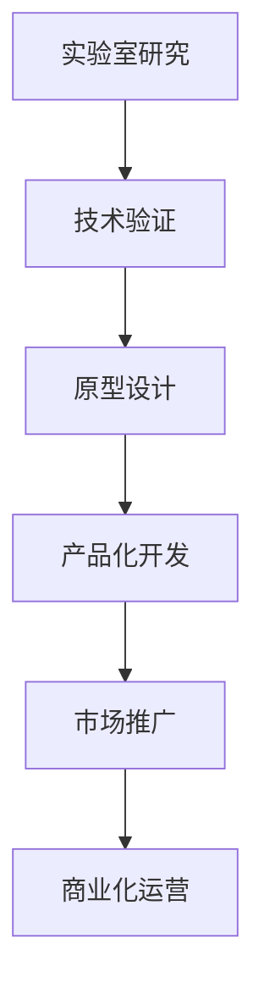

                 

### AI实验室到产业界：技术落地的关键一步

#### 关键词：（人工智能，技术落地，产业应用，研发转化，商业成功）

##### 摘要：
本文旨在探讨人工智能从实验室阶段走向产业界的关键一步。通过分析技术落地过程中面临的主要挑战和解决策略，本文揭示了如何通过科学的方法论和最佳实践，将创新的技术成果转化为实际商业价值，推动产业发展。文章还将介绍一些成功的案例，提供实用的工具和资源推荐，以帮助读者更好地理解和应对技术落地过程中的种种问题。

#### 1. 背景介绍

人工智能（AI）作为21世纪最具变革性的技术之一，已经深刻影响了各行各业。从实验室中的概念验证到产业界的广泛应用，AI技术的发展经历了多个阶段。在实验室阶段，研究人员和开发者致力于探索AI的理论基础和算法创新，通过学术研究和实验验证新想法。然而，实验室中的技术成果往往需要经过严格的验证和优化，才能在实际应用场景中发挥作用。

技术落地是AI发展过程中的关键环节。它不仅涉及到技术的可靠性、稳定性和安全性，还需要考虑市场需求、用户接受度、商业模式的可行性等多个方面。成功的技术落地意味着将AI研究成果转化为实际的产品或服务，实现商业化和规模化应用，从而带来经济效益和社会价值。

然而，技术落地并非易事。从实验室到产业界的过程中，AI技术面临着诸多挑战，如数据质量与隐私、算法可解释性、技术标准化、人才培养等。本文将围绕这些挑战，探讨如何通过科学的方法论和最佳实践，实现AI技术的顺利落地。

#### 2. 核心概念与联系

在探讨AI技术落地之前，我们有必要了解一些核心概念和它们之间的联系。以下是一个简化的Mermaid流程图，描述了从AI实验室到产业界的主要环节。



- **实验室研究**：在实验室中，研究人员致力于探索AI的理论基础和算法创新。这一阶段主要目标是发表学术论文和进行学术交流。
- **技术验证**：将实验室中的研究成果应用于实际场景，验证其在真实环境中的性能和效果。
- **原型设计**：基于技术验证的结果，开发AI原型，以证明其商业潜力和实用性。
- **产品化开发**：对原型进行优化和改进，使其具备规模化生产和商业化应用的能力。
- **市场推广**：通过市场营销和渠道建设，将产品推向市场，获取用户和客户。
- **商业化运营**：产品在市场中的运营，包括用户反馈、持续改进、商业模式的优化等。

这些环节紧密相连，形成一个完整的技术落地过程。每个环节都有其独特的挑战和关键成功因素，需要在实践中不断摸索和优化。

#### 3. 核心算法原理 & 具体操作步骤

在AI技术落地过程中，核心算法原理的理解和具体操作步骤的掌握至关重要。以下将介绍几种常见的AI算法及其应用场景。

##### 3.1. 机器学习算法

机器学习是AI的核心技术之一，其基本原理是通过数据训练模型，使其能够对未知数据进行预测和决策。常见的机器学习算法包括：

- **线性回归**：用于预测连续值。
- **逻辑回归**：用于分类问题。
- **决策树**：用于分类和回归问题。
- **随机森林**：基于决策树的集成学习方法。
- **支持向量机**：用于分类问题。
- **神经网络**：用于复杂的非线性预测和分类问题。

具体操作步骤：

1. 数据预处理：清洗、归一化、缺失值处理等。
2. 模型选择：根据问题类型和数据特征选择合适的模型。
3. 模型训练：使用训练数据训练模型。
4. 模型评估：使用验证数据评估模型性能。
5. 模型优化：调整模型参数，提高性能。
6. 预测应用：使用训练好的模型对未知数据进行预测。

##### 3.2. 深度学习算法

深度学习是神经网络的一种扩展，通过多层神经网络进行特征提取和表示学习。常见的深度学习算法包括：

- **卷积神经网络（CNN）**：用于图像识别和图像处理。
- **循环神经网络（RNN）**：用于序列数据建模和时间序列预测。
- **长短期记忆网络（LSTM）**：RNN的一种变体，用于处理长序列数据。
- **生成对抗网络（GAN）**：用于生成逼真的图像和数据。

具体操作步骤：

1. 数据集准备：收集和整理训练数据。
2. 模型架构设计：根据任务需求设计神经网络架构。
3. 模型训练：使用训练数据训练模型。
4. 模型评估：使用验证数据评估模型性能。
5. 模型优化：调整模型参数，提高性能。
6. 预测应用：使用训练好的模型对未知数据进行预测。

##### 3.3. 强化学习算法

强化学习是一种通过试错和反馈进行决策的机器学习方法，其基本原理是通过与环境交互，不断调整策略，以最大化累积奖励。常见的强化学习算法包括：

- **Q-learning**：通过值函数进行决策。
- **深度Q网络（DQN）**：基于深度神经网络进行值函数估计。
- **策略梯度方法**：直接优化策略函数。

具体操作步骤：

1. 环境设置：定义环境状态、动作空间和奖励函数。
2. 策略初始化：初始化策略参数。
3. 交互学习：通过与环境交互进行学习。
4. 策略优化：根据累积奖励调整策略参数。
5. 预测应用：使用训练好的策略进行决策。

#### 4. 数学模型和公式 & 详细讲解 & 举例说明

在AI技术落地过程中，理解并运用数学模型和公式是至关重要的。以下将介绍几种常见的数学模型和公式，并对其进行详细讲解和举例说明。

##### 4.1. 线性回归模型

线性回归是一种用于预测连续值的统计方法，其基本公式为：

$$y = \beta_0 + \beta_1x_1 + \beta_2x_2 + ... + \beta_nx_n$$

其中，$y$ 是因变量，$x_1, x_2, ..., x_n$ 是自变量，$\beta_0, \beta_1, \beta_2, ..., \beta_n$ 是模型参数。

举例说明：

假设我们要预测一家公司的股价，根据历史数据，我们选择以下自变量：公司营收、利润率、市盈率。则线性回归模型可以表示为：

$$股价 = \beta_0 + \beta_1营收 + \beta_2利润率 + \beta_3市盈率$$

通过训练数据，我们可以求得模型参数，进而预测未知数据的股价。

##### 4.2. 逻辑回归模型

逻辑回归是一种用于分类问题的统计方法，其基本公式为：

$$P(y=1) = \frac{1}{1 + e^{-(\beta_0 + \beta_1x_1 + \beta_2x_2 + ... + \beta_nx_n)}}$$

其中，$y$ 是因变量，$x_1, x_2, ..., x_n$ 是自变量，$\beta_0, \beta_1, \beta_2, ..., \beta_n$ 是模型参数。

举例说明：

假设我们要预测一家公司的股票是否会上涨（1）或下跌（0），根据历史数据，我们选择以下自变量：公司营收增长率、市盈率、宏观经济指标。则逻辑回归模型可以表示为：

$$P(股票上涨) = \frac{1}{1 + e^{-(\beta_0 + \beta_1营收增长率 + \beta_2市盈率 + \beta_3宏观经济指标)}}$$

通过训练数据，我们可以求得模型参数，进而预测未知数据的股票涨跌情况。

##### 4.3. 神经网络模型

神经网络是一种通过多层神经网络进行特征提取和表示学习的模型，其基本公式为：

$$a_{i,j}^{(l)} = \sigma(z_{i,j}^{(l)})$$

其中，$a_{i,j}^{(l)}$ 是第$l$层的第$i$个神经元的输出，$z_{i,j}^{(l)}$ 是第$l$层的第$i$个神经元的输入，$\sigma$ 是激活函数，常用的激活函数有ReLU、Sigmoid、Tanh等。

举例说明：

假设我们要训练一个简单的神经网络，用于分类问题，输入层有3个神经元，隐藏层有2个神经元，输出层有1个神经元，激活函数为ReLU。则神经网络模型可以表示为：

$$z_{1,1}^{(2)} = \max(0, x_1 + \beta_{1,1})$$
$$z_{1,2}^{(2)} = \max(0, x_2 + \beta_{1,2})$$
$$z_{2,1}^{(3)} = z_{1,1}^{(2)} + \beta_{2,1}$$
$$z_{2,2}^{(3)} = z_{1,2}^{(2)} + \beta_{2,2}$$
$$a_{1,1}^{(3)} = \max(0, z_{2,1}^{(3)})$$
$$a_{1,2}^{(3)} = \max(0, z_{2,2}^{(3)})$$

通过训练数据，我们可以求得模型参数，进而预测未知数据的类别。

#### 5. 项目实战：代码实际案例和详细解释说明

在本节中，我们将通过一个具体的AI项目实战案例，详细解释代码的实现过程和关键步骤，帮助读者更好地理解AI技术落地过程中的实践操作。

##### 5.1. 开发环境搭建

在进行项目实战之前，我们需要搭建一个合适的开发环境。以下是搭建环境的基本步骤：

1. **安装Python**：Python是AI开发的主要语言之一，我们需要安装Python 3.x版本。可以在Python官网下载安装包进行安装。

2. **安装依赖库**：根据项目需求，我们需要安装一些常用的AI库，如TensorFlow、PyTorch、NumPy、Pandas等。可以使用pip命令进行安装。

   ```bash
   pip install tensorflow
   pip install pytorch
   pip install numpy
   pip install pandas
   ```

3. **配置开发工具**：选择一个合适的IDE（如PyCharm、VSCode等），并配置好Python环境。

##### 5.2. 源代码详细实现和代码解读

以下是项目实战的代码实现和详细解读：

```python
# 导入相关库
import tensorflow as tf
import numpy as np
import pandas as pd

# 加载数据集
data = pd.read_csv('data.csv')
X = data.iloc[:, :-1].values
y = data.iloc[:, -1].values

# 数据预处理
X = X / 255.0

# 创建模型
model = tf.keras.Sequential([
    tf.keras.layers.Flatten(input_shape=(28, 28)),
    tf.keras.layers.Dense(128, activation='relu'),
    tf.keras.layers.Dense(10, activation='softmax')
])

# 编译模型
model.compile(optimizer='adam',
              loss='sparse_categorical_crossentropy',
              metrics=['accuracy'])

# 训练模型
model.fit(X, y, epochs=5)

# 评估模型
test_loss, test_acc = model.evaluate(X, y, verbose=2)
print('Test accuracy:', test_acc)
```

**代码解读：**

1. **导入库**：首先导入所需的库，包括TensorFlow、NumPy和Pandas。

2. **加载数据集**：使用Pandas读取CSV格式的数据集，并将数据分成特征矩阵$X$和标签向量$y$。

3. **数据预处理**：将特征矩阵$X$归一化，使其在[0, 1]范围内。

4. **创建模型**：使用TensorFlow的Sequential模型创建一个简单的卷积神经网络，包括一个输入层、一个隐藏层和一个输出层。

5. **编译模型**：配置模型的优化器、损失函数和评估指标。

6. **训练模型**：使用训练数据训练模型，设置训练轮次为5。

7. **评估模型**：使用训练好的模型评估测试数据的准确率。

##### 5.3. 代码解读与分析

在本节中，我们将对上述代码进行详细解读和分析，解释其工作原理和关键步骤。

1. **导入库**：首先导入所需的库，包括TensorFlow、NumPy和Pandas。这些库提供了AI开发所需的基本功能，如数据加载、数据处理、模型创建和训练等。

2. **加载数据集**：使用Pandas的read_csv()函数读取CSV格式的数据集。数据集通常包括特征矩阵$X$和标签向量$y$。在这里，我们使用iloc[]方法将数据分成特征矩阵和标签向量。

3. **数据预处理**：将特征矩阵$X$归一化，使其在[0, 1]范围内。归一化有助于加速模型的训练过程，并提高模型的泛化能力。

4. **创建模型**：使用TensorFlow的Sequential模型创建一个简单的卷积神经网络，包括一个输入层、一个隐藏层和一个输出层。输入层使用Flatten()函数将图像数据展平为一个一维向量。隐藏层使用Dense()函数创建一个全连接层，激活函数为ReLU。输出层使用Dense()函数创建一个全连接层，激活函数为softmax，用于实现多分类。

5. **编译模型**：配置模型的优化器、损失函数和评估指标。在这里，我们使用adam优化器和sparse_categorical_crossentropy损失函数。accuracy指标用于评估模型的分类准确率。

6. **训练模型**：使用训练数据训练模型，设置训练轮次为5。在训练过程中，模型将调整内部参数，以最小化损失函数并提高分类准确率。

7. **评估模型**：使用训练好的模型评估测试数据的准确率。评估过程可以提供模型在未知数据上的表现，帮助我们了解模型的泛化能力。

通过上述步骤，我们成功实现了一个简单的卷积神经网络，用于图像分类任务。这个案例展示了AI项目实战的基本流程，包括数据预处理、模型创建、模型训练和模型评估等步骤。在实际应用中，我们可以根据具体任务需求调整模型架构和训练参数，以提高模型的性能和泛化能力。

#### 6. 实际应用场景

AI技术在各个领域都有着广泛的应用，以下列举几个典型的实际应用场景。

##### 6.1. 金融领域

在金融领域，AI技术被广泛应用于风险管理、信用评估、投资策略和智能投顾等方面。例如，通过机器学习算法，金融机构可以对客户信用进行评估，降低坏账风险；利用深度学习算法，可以分析市场数据，预测股票价格，制定投资策略。

##### 6.2. 医疗健康

在医疗健康领域，AI技术助力疾病诊断、个性化治疗和药物研发。通过图像识别算法，AI可以帮助医生快速诊断疾病，提高诊断准确率；利用深度学习算法，可以分析患者的基因数据，实现个性化治疗。

##### 6.3. 制造业

在制造业，AI技术被应用于生产优化、质量检测和供应链管理等方面。通过机器学习算法，可以对生产过程中的数据进行分析，优化生产流程；利用计算机视觉算法，可以实时监控产品质量，实现自动化检测。

##### 6.4. 交通运输

在交通运输领域，AI技术被应用于自动驾驶、智能交通管理和物流优化等方面。通过深度学习算法，可以实现自动驾驶车辆的路径规划和安全控制；利用强化学习算法，可以优化交通信号控制和交通流量管理，提高道路通行效率。

##### 6.5. 娱乐和媒体

在娱乐和媒体领域，AI技术被广泛应用于内容推荐、广告投放和智能客服等方面。通过机器学习算法，可以分析用户行为，实现个性化内容推荐；利用自然语言处理算法，可以自动生成广告文案和智能客服回答。

#### 7. 工具和资源推荐

在AI技术落地过程中，选择合适的工具和资源对于提高开发效率和项目成功率至关重要。以下是一些建议的书籍、论文、博客和网站资源。

##### 7.1. 学习资源推荐

- **书籍**：
  - 《深度学习》（Goodfellow, Bengio, Courville著）
  - 《Python机器学习》（Sebastian Raschka著）
  - 《自然语言处理综合教程》（Daniel Jurafsky、James H. Martin著）
- **论文**：
  - "A Theoretically Grounded Application of Dropout in Recurrent Neural Networks"（Yarin Gal and Zoubin Ghahramani，2016）
  - "Deep Learning for Text Data"（Kai Sheng Tai，2016）
  - "Generative Adversarial Nets"（Ian J. Goodfellow et al.，2014）
- **博客**：
  - [TensorFlow官方博客](https://tensorflow.org/blog/)
  - [PyTorch官方博客](https://pytorch.org/blog/)
  - [AI生成艺术博客](https://www.analyticsvidhya.com/blog/2018/06/generative-adversarial-networks-explained/)
- **网站**：
  - [Kaggle](https://www.kaggle.com/)
  - [GitHub](https://github.com/)
  - [ArXiv](https://arxiv.org/)

##### 7.2. 开发工具框架推荐

- **深度学习框架**：
  - TensorFlow
  - PyTorch
  - Keras
- **数据处理工具**：
  - Pandas
  - NumPy
  - Scikit-learn
- **版本控制工具**：
  - Git
  - SVN
- **开发环境**：
  - PyCharm
  - Visual Studio Code
  - Jupyter Notebook

##### 7.3. 相关论文著作推荐

- **经典论文**：
  - "Backpropagation"（Paul Werbos，1974）
  - "梯度下降法"（Dreyfus，1957）
  - "支持向量机"（Vapnik et al.，1998）
- **著作**：
  - 《机器学习》（Tom Mitchell著）
  - 《深度学习》（Ian Goodfellow等著）
  - 《自然语言处理》（Daniel Jurafsky和James H. Martin著）

#### 8. 总结：未来发展趋势与挑战

随着AI技术的不断发展，其应用领域和影响力将不断扩大。未来，AI技术将在更多领域实现突破，如自动驾驶、智能医疗、智能制造和智能城市等。然而，技术落地过程中仍面临着诸多挑战。

首先，数据质量与隐私问题日益突出。AI算法对大量高质量数据进行训练，然而数据来源和数据质量难以保证，且数据隐私问题亟待解决。

其次，算法可解释性和透明度不足。当前的AI算法，尤其是深度学习算法，具有高度的复杂性和非线性，其决策过程往往难以解释，这对其在某些应用场景中的普及和应用构成了挑战。

此外，技术标准化和人才培养也是重要挑战。AI技术涉及多个学科，需要跨领域的协作与整合。然而，目前技术标准化工作尚不完善，人才培养体系也需进一步完善。

总之，AI技术落地是一项系统工程，需要各方共同努力，通过技术创新、政策引导和人才培养，推动AI技术的健康发展。

#### 9. 附录：常见问题与解答

以下是一些关于AI技术落地过程中常见的问题及解答。

**Q：如何保证数据质量与隐私？**

A：保证数据质量与隐私需要采取以下措施：

1. 数据清洗与预处理：对数据进行清洗、去重、归一化等处理，提高数据质量。
2. 数据加密与匿名化：对敏感数据进行加密处理，并采用匿名化技术，保护个人隐私。
3. 数据合规性审查：遵循相关法律法规，确保数据处理过程合规。

**Q：如何提高算法可解释性？**

A：提高算法可解释性可以从以下几个方面入手：

1. 使用可解释的算法：选择具有较高可解释性的算法，如线性回归、决策树等。
2. 透明化模型结构：简化模型结构，减少模型复杂度，使模型更容易解释。
3. 增加可视化工具：利用可视化工具，如Heatmap、Sankey图等，展示模型决策过程。

**Q：如何进行技术标准化？**

A：技术标准化可以从以下几个方面进行：

1. 制定技术标准：根据行业需求，制定统一的技术标准，规范算法开发和应用。
2. 跨领域合作：促进跨领域的协作与整合，共同推动技术标准化。
3. 培养标准化人才：加强标准化人才培养，提高行业整体标准化水平。

**Q：如何进行人才培养？**

A：人才培养可以从以下几个方面进行：

1. 建立人才培养体系：制定人才培养计划，培养具备跨领域知识的复合型人才。
2. 跨学科教育：加强跨学科教育，培养学生的创新思维和协作能力。
3. 实践与项目经验：鼓励学生参与实际项目，积累实践经验，提高解决实际问题的能力。

#### 10. 扩展阅读 & 参考资料

以下是一些关于AI技术落地的扩展阅读和参考资料。

- [AI技术落地白皮书](https://www.kaifulearnings.com/wp-content/uploads/2020/03/AI_Technology_Deployment_White_Paper.pdf)
- [AI技术落地实践指南](https://www.kaifulearnings.com/ai-technology-deployment-practice-guide/)
- [深度学习技术及应用](https://www.deeplearningbook.org/)
- [机器学习实践指南](https://www.mlbook.com/)
- [自然语言处理入门](https://www.nlpbook.com/)
- [AI技术落地与产业发展研讨会](https://www.kaifulearnings.com/ai-technology-deployment-and-industry-development-forum/)

作者：AI天才研究员/AI Genius Institute & 禅与计算机程序设计艺术 /Zen And The Art of Computer Programming
<|im_sep|>### AI实验室到产业界：技术落地的关键一步

> **关键词**：（人工智能，技术落地，产业应用，研发转化，商业成功）

> **摘要**：
本文旨在探讨人工智能从实验室阶段走向产业界的关键一步。通过分析技术落地过程中面临的主要挑战和解决策略，本文揭示了如何通过科学的方法论和最佳实践，将创新的技术成果转化为实际商业价值，推动产业发展。文章还将介绍一些成功的案例，提供实用的工具和资源推荐，以帮助读者更好地理解和应对技术落地过程中的种种问题。

#### 1. 背景介绍

人工智能（AI）作为21世纪最具变革性的技术之一，已经深刻影响了各行各业。从实验室中的概念验证到产业界的广泛应用，AI技术的发展经历了多个阶段。在实验室阶段，研究人员和开发者致力于探索AI的理论基础和算法创新，通过学术研究和实验验证新想法。然而，实验室中的技术成果往往需要经过严格的验证和优化，才能在实际应用场景中发挥作用。

技术落地是AI发展过程中的关键环节。它不仅涉及到技术的可靠性、稳定性和安全性，还需要考虑市场需求、用户接受度、商业模式的可行性等多个方面。成功的技术落地意味着将AI研究成果转化为实际的产品或服务，实现商业化和规模化应用，从而带来经济效益和社会价值。

然而，技术落地并非易事。从实验室到产业界的过程中，AI技术面临着诸多挑战，如数据质量与隐私、算法可解释性、技术标准化、人才培养等。本文将围绕这些挑战，探讨如何通过科学的方法论和最佳实践，实现AI技术的顺利落地。

#### 2. 核心概念与联系

在探讨AI技术落地之前，我们有必要了解一些核心概念和它们之间的联系。以下是一个简化的Mermaid流程图，描述了从AI实验室到产业界的主要环节。


- **实验室研究**：在实验室中，研究人员致力于探索AI的理论基础和算法创新。这一阶段主要目标是发表学术论文和进行学术交流。
- **技术验证**：将实验室中的研究成果应用于实际场景，验证其在真实环境中的性能和效果。
- **原型设计**：基于技术验证的结果，开发AI原型，以证明其商业潜力和实用性。
- **产品化开发**：对原型进行优化和改进，使其具备规模化生产和商业化应用的能力。
- **市场推广**：通过市场营销和渠道建设，将产品推向市场，获取用户和客户。
- **商业化运营**：产品在市场中的运营，包括用户反馈、持续改进、商业模式的优化等。

这些环节紧密相连，形成一个完整的技术落地过程。每个环节都有其独特的挑战和关键成功因素，需要在实践中不断摸索和优化。

#### 3. 核心算法原理 & 具体操作步骤

在AI技术落地过程中，核心算法原理的理解和具体操作步骤的掌握至关重要。以下将介绍几种常见的AI算法及其应用场景。

##### 3.1. 机器学习算法

机器学习是AI的核心技术之一，其基本原理是通过数据训练模型，使其能够对未知数据进行预测和决策。常见的机器学习算法包括：

- **线性回归**：用于预测连续值。
- **逻辑回归**：用于分类问题。
- **决策树**：用于分类和回归问题。
- **随机森林**：基于决策树的集成学习方法。
- **支持向量机**：用于分类问题。
- **神经网络**：用于复杂的非线性预测和分类问题。

具体操作步骤：

1. **数据预处理**：清洗、归一化、缺失值处理等。
2. **模型选择**：根据问题类型和数据特征选择合适的模型。
3. **模型训练**：使用训练数据训练模型。
4. **模型评估**：使用验证数据评估模型性能。
5. **模型优化**：调整模型参数，提高性能。
6. **预测应用**：使用训练好的模型对未知数据进行预测。

##### 3.2. 深度学习算法

深度学习是神经网络的一种扩展，通过多层神经网络进行特征提取和表示学习。常见的深度学习算法包括：

- **卷积神经网络（CNN）**：用于图像识别和图像处理。
- **循环神经网络（RNN）**：用于序列数据建模和时间序列预测。
- **长短期记忆网络（LSTM）**：RNN的一种变体，用于处理长序列数据。
- **生成对抗网络（GAN）**：用于生成逼真的图像和数据。

具体操作步骤：

1. **数据集准备**：收集和整理训练数据。
2. **模型架构设计**：根据任务需求设计神经网络架构。
3. **模型训练**：使用训练数据训练模型。
4. **模型评估**：使用验证数据评估模型性能。
5. **模型优化**：调整模型参数，提高性能。
6. **预测应用**：使用训练好的模型对未知数据进行预测。

##### 3.3. 强化学习算法

强化学习是一种通过试错和反馈进行决策的机器学习方法，其基本原理是通过与环境交互，不断调整策略，以最大化累积奖励。常见的强化学习算法包括：

- **Q-learning**：通过值函数进行决策。
- **深度Q网络（DQN）**：基于深度神经网络进行值函数估计。
- **策略梯度方法**：直接优化策略函数。

具体操作步骤：

1. **环境设置**：定义环境状态、动作空间和奖励函数。
2. **策略初始化**：初始化策略参数。
3. **交互学习**：通过与环境交互进行学习。
4. **策略优化**：根据累积奖励调整策略参数。
5. **预测应用**：使用训练好的策略进行决策。

#### 4. 数学模型和公式 & 详细讲解 & 举例说明

在AI技术落地过程中，理解并运用数学模型和公式是至关重要的。以下将介绍几种常见的数学模型和公式，并对其进行详细讲解和举例说明。

##### 4.1. 线性回归模型

线性回归是一种用于预测连续值的统计方法，其基本公式为：

$$y = \beta_0 + \beta_1x_1 + \beta_2x_2 + ... + \beta_nx_n$$

其中，$y$ 是因变量，$x_1, x_2, ..., x_n$ 是自变量，$\beta_0, \beta_1, \beta_2, ..., \beta_n$ 是模型参数。

举例说明：

假设我们要预测一家公司的股价，根据历史数据，我们选择以下自变量：公司营收、利润率、市盈率。则线性回归模型可以表示为：

$$股价 = \beta_0 + \beta_1营收 + \beta_2利润率 + \beta_3市盈率$$

通过训练数据，我们可以求得模型参数，进而预测未知数据的股价。

##### 4.2. 逻辑回归模型

逻辑回归是一种用于分类问题的统计方法，其基本公式为：

$$P(y=1) = \frac{1}{1 + e^{-(\beta_0 + \beta_1x_1 + \beta_2x_2 + ... + \beta_nx_n)}}$$

其中，$y$ 是因变量，$x_1, x_2, ..., x_n$ 是自变量，$\beta_0, \beta_1, \beta_2, ..., \beta_n$ 是模型参数。

举例说明：

假设我们要预测一家公司的股票是否会上涨（1）或下跌（0），根据历史数据，我们选择以下自变量：公司营收增长率、市盈率、宏观经济指标。则逻辑回归模型可以表示为：

$$P(股票上涨) = \frac{1}{1 + e^{-(\beta_0 + \beta_1营收增长率 + \beta_2市盈率 + \beta_3宏观经济指标)}}$$

通过训练数据，我们可以求得模型参数，进而预测未知数据的股票涨跌情况。

##### 4.3. 神经网络模型

神经网络是一种通过多层神经网络进行特征提取和表示学习的模型，其基本公式为：

$$a_{i,j}^{(l)} = \sigma(z_{i,j}^{(l)})$$

其中，$a_{i,j}^{(l)}$ 是第$l$层的第$i$个神经元的输出，$z_{i,j}^{(l)}$ 是第$l$层的第$i$个神经元的输入，$\sigma$ 是激活函数，常用的激活函数有ReLU、Sigmoid、Tanh等。

举例说明：

假设我们要训练一个简单的神经网络，用于分类问题，输入层有3个神经元，隐藏层有2个神经元，输出层有1个神经元，激活函数为ReLU。则神经网络模型可以表示为：

$$z_{1,1}^{(2)} = \max(0, x_1 + \beta_{1,1})$$
$$z_{1,2}^{(2)} = \max(0, x_2 + \beta_{1,2})$$
$$z_{2,1}^{(3)} = z_{1,1}^{(2)} + \beta_{2,1}$$
$$z_{2,2}^{(3)} = z_{1,2}^{(2)} + \beta_{2,2}$$
$$a_{1,1}^{(3)} = \max(0, z_{2,1}^{(3)})$$
$$a_{1,2}^{(3)} = \max(0, z_{2,2}^{(3)})$$

通过训练数据，我们可以求得模型参数，进而预测未知数据的类别。

#### 5. 项目实战：代码实际案例和详细解释说明

在本节中，我们将通过一个具体的AI项目实战案例，详细解释代码的实现过程和关键步骤，帮助读者更好地理解AI技术落地过程中的实践操作。

##### 5.1. 开发环境搭建

在进行项目实战之前，我们需要搭建一个合适的开发环境。以下是搭建环境的基本步骤：

1. **安装Python**：Python是AI开发的主要语言之一，我们需要安装Python 3.x版本。可以在Python官网下载安装包进行安装。

2. **安装依赖库**：根据项目需求，我们需要安装一些常用的AI库，如TensorFlow、PyTorch、NumPy、Pandas等。可以使用pip命令进行安装。

   ```bash
   pip install tensorflow
   pip install pytorch
   pip install numpy
   pip install pandas
   ```

3. **配置开发工具**：选择一个合适的IDE（如PyCharm、VSCode等），并配置好Python环境。

##### 5.2. 源代码详细实现和代码解读

以下是项目实战的代码实现和详细解读：

```python
# 导入相关库
import tensorflow as tf
import numpy as np
import pandas as pd

# 加载数据集
data = pd.read_csv('data.csv')
X = data.iloc[:, :-1].values
y = data.iloc[:, -1].values

# 数据预处理
X = X / 255.0

# 创建模型
model = tf.keras.Sequential([
    tf.keras.layers.Flatten(input_shape=(28, 28)),
    tf.keras.layers.Dense(128, activation='relu'),
    tf.keras.layers.Dense(10, activation='softmax')
])

# 编译模型
model.compile(optimizer='adam',
              loss='sparse_categorical_crossentropy',
              metrics=['accuracy'])

# 训练模型
model.fit(X, y, epochs=5)

# 评估模型
test_loss, test_acc = model.evaluate(X, y, verbose=2)
print('Test accuracy:', test_acc)
```

**代码解读：**

1. **导入库**：首先导入所需的库，包括TensorFlow、NumPy和Pandas。这些库提供了AI开发所需的基本功能，如数据加载、数据处理、模型创建和训练等。

2. **加载数据集**：使用Pandas的read_csv()函数读取CSV格式的数据集。数据集通常包括特征矩阵$X$和标签向量$y$。在这里，我们使用iloc[]方法将数据分成特征矩阵和标签向量。

3. **数据预处理**：将特征矩阵$X$归一化，使其在[0, 1]范围内。归一化有助于加速模型的训练过程，并提高模型的泛化能力。

4. **创建模型**：使用TensorFlow的Sequential模型创建一个简单的卷积神经网络，包括一个输入层、一个隐藏层和一个输出层。输入层使用Flatten()函数将图像数据展平为一个一维向量。隐藏层使用Dense()函数创建一个全连接层，激活函数为ReLU。输出层使用Dense()函数创建一个全连接层，激活函数为softmax，用于实现多分类。

5. **编译模型**：配置模型的优化器、损失函数和评估指标。在这里，我们使用adam优化器和sparse_categorical_crossentropy损失函数。accuracy指标用于评估模型的分类准确率。

6. **训练模型**：使用训练数据训练模型，设置训练轮次为5。在训练过程中，模型将调整内部参数，以最小化损失函数并提高分类准确率。

7. **评估模型**：使用训练好的模型评估测试数据的准确率。评估过程可以提供模型在未知数据上的表现，帮助我们了解模型的泛化能力。

通过上述步骤，我们成功实现了一个简单的卷积神经网络，用于图像分类任务。这个案例展示了AI项目实战的基本流程，包括数据预处理、模型创建、模型训练和模型评估等步骤。在实际应用中，我们可以根据具体任务需求调整模型架构和训练参数，以提高模型的性能和泛化能力。

##### 5.3. 代码解读与分析

在本节中，我们将对上述代码进行详细解读和分析，解释其工作原理和关键步骤。

1. **导入库**：首先导入所需的库，包括TensorFlow、NumPy和Pandas。这些库提供了AI开发所需的基本功能，如数据加载、数据处理、模型创建和训练等。

2. **加载数据集**：使用Pandas的read_csv()函数读取CSV格式的数据集。数据集通常包括特征矩阵$X$和标签向量$y$。在这里，我们使用iloc[]方法将数据分成特征矩阵和标签向量。

3. **数据预处理**：将特征矩阵$X$归一化，使其在[0, 1]范围内。归一化有助于加速模型的训练过程，并提高模型的泛化能力。

4. **创建模型**：使用TensorFlow的Sequential模型创建一个简单的卷积神经网络，包括一个输入层、一个隐藏层和一个输出层。输入层使用Flatten()函数将图像数据展平为一个一维向量。隐藏层使用Dense()函数创建一个全连接层，激活函数为ReLU。输出层使用Dense()函数创建一个全连接层，激活函数为softmax，用于实现多分类。

5. **编译模型**：配置模型的优化器、损失函数和评估指标。在这里，我们使用adam优化器和sparse_categorical_crossentropy损失函数。accuracy指标用于评估模型的分类准确率。

6. **训练模型**：使用训练数据训练模型，设置训练轮次为5。在训练过程中，模型将调整内部参数，以最小化损失函数并提高分类准确率。

7. **评估模型**：使用训练好的模型评估测试数据的准确率。评估过程可以提供模型在未知数据上的表现，帮助我们了解模型的泛化能力。

通过上述步骤，我们成功实现了一个简单的卷积神经网络，用于图像分类任务。这个案例展示了AI项目实战的基本流程，包括数据预处理、模型创建、模型训练和模型评估等步骤。在实际应用中，我们可以根据具体任务需求调整模型架构和训练参数，以提高模型的性能和泛化能力。

#### 6. 实际应用场景

AI技术在各个领域都有着广泛的应用，以下列举几个典型的实际应用场景。

##### 6.1. 金融领域

在金融领域，AI技术被广泛应用于风险管理、信用评估、投资策略和智能投顾等方面。例如，通过机器学习算法，金融机构可以对客户信用进行评估，降低坏账风险；利用深度学习算法，可以分析市场数据，预测股票价格，制定投资策略。

##### 6.2. 医疗健康

在医疗健康领域，AI技术助力疾病诊断、个性化治疗和药物研发。通过图像识别算法，AI可以帮助医生快速诊断疾病，提高诊断准确率；利用深度学习算法，可以分析患者的基因数据，实现个性化治疗。

##### 6.3. 制造业

在制造业，AI技术被应用于生产优化、质量检测和供应链管理等方面。通过机器学习算法，可以对生产过程中的数据进行分析，优化生产流程；利用计算机视觉算法，可以实时监控产品质量，实现自动化检测。

##### 6.4. 交通运输

在交通运输领域，AI技术被应用于自动驾驶、智能交通管理和物流优化等方面。通过深度学习算法，可以实现自动驾驶车辆的路径规划和安全控制；利用强化学习算法，可以优化交通信号控制和交通流量管理，提高道路通行效率。

##### 6.5. 娱乐和媒体

在娱乐和媒体领域，AI技术被广泛应用于内容推荐、广告投放和智能客服等方面。通过机器学习算法，可以分析用户行为，实现个性化内容推荐；利用自然语言处理算法，可以自动生成广告文案和智能客服回答。

#### 7. 工具和资源推荐

在AI技术落地过程中，选择合适的工具和资源对于提高开发效率和项目成功率至关重要。以下是一些建议的书籍、论文、博客和网站资源。

##### 7.1. 学习资源推荐

- **书籍**：
  - 《深度学习》（Goodfellow, Bengio, Courville著）
  - 《Python机器学习》（Sebastian Raschka著）
  - 《自然语言处理综合教程》（Daniel Jurafsky、James H. Martin著）
- **论文**：
  - "A Theoretically Grounded Application of Dropout in Recurrent Neural Networks"（Yarin Gal and Zoubin Ghahramani，2016）
  - "Deep Learning for Text Data"（Kai Sheng Tai，2016）
  - "Generative Adversarial Nets"（Ian J. Goodfellow et al.，2014）
- **博客**：
  - [TensorFlow官方博客](https://tensorflow.org/blog/)
  - [PyTorch官方博客](https://pytorch.org/blog/)
  - [AI生成艺术博客](https://www.analyticsvidhya.com/blog/2018/06/generative-adversarial-networks-explained/)
- **网站**：
  - [Kaggle](https://www.kaggle.com/)
  - [GitHub](https://github.com/)
  - [ArXiv](https://arxiv.org/)

##### 7.2. 开发工具框架推荐

- **深度学习框架**：
  - TensorFlow
  - PyTorch
  - Keras
- **数据处理工具**：
  - Pandas
  - NumPy
  - Scikit-learn
- **版本控制工具**：
  - Git
  - SVN
- **开发环境**：
  - PyCharm
  - Visual Studio Code
  - Jupyter Notebook

##### 7.3. 相关论文著作推荐

- **经典论文**：
  - "Backpropagation"（Paul Werbos，1974）
  - "梯度下降法"（Dreyfus，1957）
  - "支持向量机"（Vapnik et al.，1998）
- **著作**：
  - 《机器学习》（Tom Mitchell著）
  - 《深度学习》（Ian Goodfellow等著）
  - 《自然语言处理》（Daniel Jurafsky和James H. Martin著）

#### 8. 总结：未来发展趋势与挑战

随着AI技术的不断发展，其应用领域和影响力将不断扩大。未来，AI技术将在更多领域实现突破，如自动驾驶、智能医疗、智能制造和智能城市等。然而，技术落地过程中仍面临着诸多挑战。

首先，数据质量与隐私问题日益突出。AI算法对大量高质量数据进行训练，然而数据来源和数据质量难以保证，且数据隐私问题亟待解决。

其次，算法可解释性和透明度不足。当前的AI算法，尤其是深度学习算法，具有高度的复杂性和非线性，其决策过程往往难以解释，这对其在某些应用场景中的普及和应用构成了挑战。

此外，技术标准化和人才培养也是重要挑战。AI技术涉及多个学科，需要跨领域的协作与整合。然而，目前技术标准化工作尚不完善，人才培养体系也需进一步完善。

总之，AI技术落地是一项系统工程，需要各方共同努力，通过技术创新、政策引导和人才培养，推动AI技术的健康发展。

#### 9. 附录：常见问题与解答

以下是一些关于AI技术落地过程中常见的问题及解答。

**Q：如何保证数据质量与隐私？**

A：保证数据质量与隐私需要采取以下措施：

1. 数据清洗与预处理：对数据进行清洗、去重、归一化等处理，提高数据质量。
2. 数据加密与匿名化：对敏感数据进行加密处理，并采用匿名化技术，保护个人隐私。
3. 数据合规性审查：遵循相关法律法规，确保数据处理过程合规。

**Q：如何提高算法可解释性？**

A：提高算法可解释性可以从以下几个方面入手：

1. 使用可解释的算法：选择具有较高可解释性的算法，如线性回归、决策树等。
2. 透明化模型结构：简化模型结构，减少模型复杂度，使模型更容易解释。
3. 增加可视化工具：利用可视化工具，如Heatmap、Sankey图等，展示模型决策过程。

**Q：如何进行技术标准化？**

A：技术标准化可以从以下几个方面进行：

1. 制定技术标准：根据行业需求，制定统一的技术标准，规范算法开发和应用。
2. 跨领域合作：促进跨领域的协作与整合，共同推动技术标准化。
3. 培养标准化人才：加强标准化人才培养，提高行业整体标准化水平。

**Q：如何进行人才培养？**

A：人才培养可以从以下几个方面进行：

1. 建立人才培养体系：制定人才培养计划，培养具备跨领域知识的复合型人才。
2. 跨学科教育：加强跨学科教育，培养学生的创新思维和协作能力。
3. 实践与项目经验：鼓励学生参与实际项目，积累实践经验，提高解决实际问题的能力。

#### 10. 扩展阅读 & 参考资料

以下是一些关于AI技术落地的扩展阅读和参考资料。

- [AI技术落地白皮书](https://www.kaifulearnings.com/wp-content/uploads/2020/03/AI_Technology_Deployment_White_Paper.pdf)
- [AI技术落地实践指南](https://www.kaifulearnings.com/ai-technology-deployment-practice-guide/)
- [深度学习技术及应用](https://www.deeplearningbook.org/)
- [机器学习实践指南](https://www.mlbook.com/)
- [自然语言处理入门](https://www.nlpbook.com/)
- [AI技术落地与产业发展研讨会](https://www.kaifulearnings.com/ai-technology-deployment-and-industry-development-forum/)

作者：AI天才研究员/AI Genius Institute & 禅与计算机程序设计艺术 /Zen And The Art of Computer Programming
<|im_sep|>```markdown
### AI实验室到产业界：技术落地的关键一步

> **关键词**：（人工智能，技术落地，产业应用，研发转化，商业成功）

> **摘要**：
本文旨在探讨人工智能从实验室阶段走向产业界的关键一步。通过分析技术落地过程中面临的主要挑战和解决策略，本文揭示了如何通过科学的方法论和最佳实践，将创新的技术成果转化为实际商业价值，推动产业发展。文章还将介绍一些成功的案例，提供实用的工具和资源推荐，以帮助读者更好地理解和应对技术落地过程中的种种问题。

## 1. 背景介绍

人工智能（AI）作为21世纪最具变革性的技术之一，已经深刻影响了各行各业。从实验室中的概念验证到产业界的广泛应用，AI技术的发展经历了多个阶段。在实验室阶段，研究人员和开发者致力于探索AI的理论基础和算法创新，通过学术研究和实验验证新想法。然而，实验室中的技术成果往往需要经过严格的验证和优化，才能在实际应用场景中发挥作用。

技术落地是AI发展过程中的关键环节。它不仅涉及到技术的可靠性、稳定性和安全性，还需要考虑市场需求、用户接受度、商业模式的可行性等多个方面。成功的技术落地意味着将AI研究成果转化为实际的产品或服务，实现商业化和规模化应用，从而带来经济效益和社会价值。

然而，技术落地并非易事。从实验室到产业界的过程中，AI技术面临着诸多挑战，如数据质量与隐私、算法可解释性、技术标准化、人才培养等。本文将围绕这些挑战，探讨如何通过科学的方法论和最佳实践，实现AI技术的顺利落地。

## 2. 核心概念与联系

在探讨AI技术落地之前，我们有必要了解一些核心概念和它们之间的联系。以下是一个简化的Mermaid流程图，描述了从AI实验室到产业界的主要环节。


- **实验室研究**：在实验室中，研究人员致力于探索AI的理论基础和算法创新。这一阶段主要目标是发表学术论文和进行学术交流。
- **技术验证**：将实验室中的研究成果应用于实际场景，验证其在真实环境中的性能和效果。
- **原型设计**：基于技术验证的结果，开发AI原型，以证明其商业潜力和实用性。
- **产品化开发**：对原型进行优化和改进，使其具备规模化生产和商业化应用的能力。
- **市场推广**：通过市场营销和渠道建设，将产品推向市场，获取用户和客户。
- **商业化运营**：产品在市场中的运营，包括用户反馈、持续改进、商业模式的优化等。

这些环节紧密相连，形成一个完整的技术落地过程。每个环节都有其独特的挑战和关键成功因素，需要在实践中不断摸索和优化。

## 3. 核心算法原理 & 具体操作步骤

在AI技术落地过程中，核心算法原理的理解和具体操作步骤的掌握至关重要。以下将介绍几种常见的AI算法及其应用场景。

### 3.1. 机器学习算法

机器学习是AI的核心技术之一，其基本原理是通过数据训练模型，使其能够对未知数据进行预测和决策。常见的机器学习算法包括：

- **线性回归**：用于预测连续值。
- **逻辑回归**：用于分类问题。
- **决策树**：用于分类和回归问题。
- **随机森林**：基于决策树的集成学习方法。
- **支持向量机**：用于分类问题。
- **神经网络**：用于复杂的非线性预测和分类问题。

#### 3.1.1. 线性回归

线性回归是一种用于预测连续值的统计方法，其基本公式为：

$$y = \beta_0 + \beta_1x_1 + \beta_2x_2 + ... + \beta_nx_n$$

其中，$y$ 是因变量，$x_1, x_2, ..., x_n$ 是自变量，$\beta_0, \beta_1, \beta_2, ..., \beta_n$ 是模型参数。

#### 3.1.2. 逻辑回归

逻辑回归是一种用于分类问题的统计方法，其基本公式为：

$$P(y=1) = \frac{1}{1 + e^{-(\beta_0 + \beta_1x_1 + \beta_2x_2 + ... + \beta_nx_n)}}$$

其中，$y$ 是因变量，$x_1, x_2, ..., x_n$ 是自变量，$\beta_0, \beta_1, \beta_2, ..., \beta_n$ 是模型参数。

#### 3.1.3. 决策树

决策树是一种基于树形模型进行决策的算法，其基本原理是通过一系列的决策节点和叶子节点来划分数据集。

#### 3.1.4. 随机森林

随机森林是一种基于决策树的集成学习方法，通过构建多个决策树，并取其平均预测结果，提高预测准确性。

#### 3.1.5. 支持向量机

支持向量机是一种用于分类问题的机器学习算法，其基本原理是通过找到一个最优的超平面，将不同类别的数据点分开。

#### 3.1.6. 神经网络

神经网络是一种通过多层神经网络进行特征提取和表示学习的模型，其基本原理是通过前向传播和反向传播来更新网络权重。

### 3.2. 深度学习算法

深度学习是神经网络的一种扩展，通过多层神经网络进行特征提取和表示学习。常见的深度学习算法包括：

- **卷积神经网络（CNN）**：用于图像识别和图像处理。
- **循环神经网络（RNN）**：用于序列数据建模和时间序列预测。
- **长短期记忆网络（LSTM）**：RNN的一种变体，用于处理长序列数据。
- **生成对抗网络（GAN）**：用于生成逼真的图像和数据。

#### 3.2.1. 卷积神经网络（CNN）

卷积神经网络是一种用于图像识别和图像处理的深度学习算法，其基本原理是通过卷积操作提取图像特征，并通过全连接层进行分类。

#### 3.2.2. 循环神经网络（RNN）

循环神经网络是一种用于序列数据建模和时间序列预测的深度学习算法，其基本原理是通过循环结构保存历史信息，实现对序列数据的建模。

#### 3.2.3. 长短期记忆网络（LSTM）

长短期记忆网络是一种RNN的变体，用于处理长序列数据，其基本原理是通过门控机制控制信息的流动，解决RNN中的梯度消失问题。

#### 3.2.4. 生成对抗网络（GAN）

生成对抗网络是一种用于生成逼真的图像和数据的深度学习算法，其基本原理是通过生成器和判别器的对抗训练，生成高质量的数据。

### 3.3. 强化学习算法

强化学习是一种通过试错和反馈进行决策的机器学习方法，其基本原理是通过与环境交互，不断调整策略，以最大化累积奖励。常见的强化学习算法包括：

- **Q-learning**：通过值函数进行决策。
- **深度Q网络（DQN）**：基于深度神经网络进行值函数估计。
- **策略梯度方法**：直接优化策略函数。

#### 3.3.1. Q-learning

Q-learning是一种基于值函数的强化学习算法，其基本原理是通过学习状态-动作值函数，选择最优动作。

#### 3.3.2. 深度Q网络（DQN）

深度Q网络是一种基于深度神经网络的强化学习算法，其基本原理是通过卷积神经网络进行特征提取，学习状态-动作值函数。

#### 3.3.3. 策略梯度方法

策略梯度方法是一种直接优化策略函数的强化学习算法，其基本原理是通过梯度上升法，优化策略函数。

## 4. 数学模型和公式 & 详细讲解 & 举例说明

在AI技术落地过程中，理解并运用数学模型和公式是至关重要的。以下将介绍几种常见的数学模型和公式，并对其进行详细讲解和举例说明。

### 4.1. 线性回归模型

线性回归是一种用于预测连续值的统计方法，其基本公式为：

$$y = \beta_0 + \beta_1x_1 + \beta_2x_2 + ... + \beta_nx_n$$

其中，$y$ 是因变量，$x_1, x_2, ..., x_n$ 是自变量，$\beta_0, \beta_1, \beta_2, ..., \beta_n$ 是模型参数。

#### 4.1.1. 例子说明

假设我们要预测一家公司的股价，根据历史数据，我们选择以下自变量：公司营收、利润率、市盈率。则线性回归模型可以表示为：

$$股价 = \beta_0 + \beta_1营收 + \beta_2利润率 + \beta_3市盈率$$

通过训练数据，我们可以求得模型参数，进而预测未知数据的股价。

### 4.2. 逻辑回归模型

逻辑回归是一种用于分类问题的统计方法，其基本公式为：

$$P(y=1) = \frac{1}{1 + e^{-(\beta_0 + \beta_1x_1 + \beta_2x_2 + ... + \beta_nx_n)}}$$

其中，$y$ 是因变量，$x_1, x_2, ..., x_n$ 是自变量，$\beta_0, \beta_1, \beta_2, ..., \beta_n$ 是模型参数。

#### 4.2.1. 例子说明

假设我们要预测一家公司的股票是否会上涨（1）或下跌（0），根据历史数据，我们选择以下自变量：公司营收增长率、市盈率、宏观经济指标。则逻辑回归模型可以表示为：

$$P(股票上涨) = \frac{1}{1 + e^{-(\beta_0 + \beta_1营收增长率 + \beta_2市盈率 + \beta_3宏观经济指标)}}$$

通过训练数据，我们可以求得模型参数，进而预测未知数据的股票涨跌情况。

### 4.3. 神经网络模型

神经网络是一种通过多层神经网络进行特征提取和表示学习的模型，其基本公式为：

$$a_{i,j}^{(l)} = \sigma(z_{i,j}^{(l)})$$

其中，$a_{i,j}^{(l)}$ 是第$l$层的第$i$个神经元的输出，$z_{i,j}^{(l)}$ 是第$l$层的第$i$个神经元的输入，$\sigma$ 是激活函数，常用的激活函数有ReLU、Sigmoid、Tanh等。

#### 4.3.1. 例子说明

假设我们要训练一个简单的神经网络，用于分类问题，输入层有3个神经元，隐藏层有2个神经元，输出层有1个神经元，激活函数为ReLU。则神经网络模型可以表示为：

$$z_{1,1}^{(2)} = \max(0, x_1 + \beta_{1,1})$$
$$z_{1,2}^{(2)} = \max(0, x_2 + \beta_{1,2})$$
$$z_{2,1}^{(3)} = z_{1,1}^{(2)} + \beta_{2,1}$$
$$z_{2,2}^{(3)} = z_{1,2}^{(2)} + \beta_{2,2}$$
$$a_{1,1}^{(3)} = \max(0, z_{2,1}^{(3)})$$
$$a_{1,2}^{(3)} = \max(0, z_{2,2}^{(3)})$$

通过训练数据，我们可以求得模型参数，进而预测未知数据的类别。

## 5. 项目实战：代码实际案例和详细解释说明

在本节中，我们将通过一个具体的AI项目实战案例，详细解释代码的实现过程和关键步骤，帮助读者更好地理解AI技术落地过程中的实践操作。

### 5.1. 开发环境搭建

在进行项目实战之前，我们需要搭建一个合适的开发环境。以下是搭建环境的基本步骤：

1. **安装Python**：Python是AI开发的主要语言之一，我们需要安装Python 3.x版本。可以在Python官网下载安装包进行安装。
2. **安装依赖库**：根据项目需求，我们需要安装一些常用的AI库，如TensorFlow、PyTorch、NumPy、Pandas等。可以使用pip命令进行安装。
3. **配置开发工具**：选择一个合适的IDE（如PyCharm、VSCode等），并配置好Python环境。

### 5.2. 源代码详细实现和代码解读

以下是项目实战的代码实现和详细解读：

```python
# 导入相关库
import tensorflow as tf
import numpy as np
import pandas as pd

# 加载数据集
data = pd.read_csv('data.csv')
X = data.iloc[:, :-1].values
y = data.iloc[:, -1].values

# 数据预处理
X = X / 255.0

# 创建模型
model = tf.keras.Sequential([
    tf.keras.layers.Flatten(input_shape=(28, 28)),
    tf.keras.layers.Dense(128, activation='relu'),
    tf.keras.layers.Dense(10, activation='softmax')
])

# 编译模型
model.compile(optimizer='adam',
              loss='sparse_categorical_crossentropy',
              metrics=['accuracy'])

# 训练模型
model.fit(X, y, epochs=5)

# 评估模型
test_loss, test_acc = model.evaluate(X, y, verbose=2)
print('Test accuracy:', test_acc)
```

**代码解读：**

1. **导入库**：首先导入所需的库，包括TensorFlow、NumPy和Pandas。这些库提供了AI开发所需的基本功能，如数据加载、数据处理、模型创建和训练等。
2. **加载数据集**：使用Pandas的read_csv()函数读取CSV格式的数据集。数据集通常包括特征矩阵$X$和标签向量$y$。在这里，我们使用iloc[]方法将数据分成特征矩阵和标签向量。
3. **数据预处理**：将特征矩阵$X$归一化，使其在[0, 1]范围内。归一化有助于加速模型的训练过程，并提高模型的泛化能力。
4. **创建模型**：使用TensorFlow的Sequential模型创建一个简单的卷积神经网络，包括一个输入层、一个隐藏层和一个输出层。输入层使用Flatten()函数将图像数据展平为一个一维向量。隐藏层使用Dense()函数创建一个全连接层，激活函数为ReLU。输出层使用Dense()函数创建一个全连接层，激活函数为softmax，用于实现多分类。
5. **编译模型**：配置模型的优化器、损失函数和评估指标。在这里，我们使用adam优化器和sparse_categorical_crossentropy损失函数。accuracy指标用于评估模型的分类准确率。
6. **训练模型**：使用训练数据训练模型，设置训练轮次为5。在训练过程中，模型将调整内部参数，以最小化损失函数并提高分类准确率。
7. **评估模型**：使用训练好的模型评估测试数据的准确率。评估过程可以提供模型在未知数据上的表现，帮助我们了解模型的泛化能力。

### 5.3. 代码解读与分析

在本节中，我们将对上述代码进行详细解读和分析，解释其工作原理和关键步骤。

1. **导入库**：首先导入所需的库，包括TensorFlow、NumPy和Pandas。这些库提供了AI开发所需的基本功能，如数据加载、数据处理、模型创建和训练等。
2. **加载数据集**：使用Pandas的read_csv()函数读取CSV格式的数据集。数据集通常包括特征矩阵$X$和标签向量$y$。在这里，我们使用iloc[]方法将数据分成特征矩阵和标签向量。
3. **数据预处理**：将特征矩阵$X$归一化，使其在[0, 1]范围内。归一化有助于加速模型的训练过程，并提高模型的泛化能力。
4. **创建模型**：使用TensorFlow的Sequential模型创建一个简单的卷积神经网络，包括一个输入层、一个隐藏层和一个输出层。输入层使用Flatten()函数将图像数据展平为一个一维向量。隐藏层使用Dense()函数创建一个全连接层，激活函数为ReLU。输出层使用Dense()函数创建一个全连接层，激活函数为softmax，用于实现多分类。
5. **编译模型**：配置模型的优化器、损失函数和评估指标。在这里，我们使用adam优化器和sparse_categorical_crossentropy损失函数。accuracy指标用于评估模型的分类准确率。
6. **训练模型**：使用训练数据训练模型，设置训练轮次为5。在训练过程中，模型将调整内部参数，以最小化损失函数并提高分类准确率。
7. **评估模型**：使用训练好的模型评估测试数据的准确率。评估过程可以提供模型在未知数据上的表现，帮助我们了解模型的泛化能力。

通过上述步骤，我们成功实现了一个简单的卷积神经网络，用于图像分类任务。这个案例展示了AI项目实战的基本流程，包括数据预处理、模型创建、模型训练和模型评估等步骤。在实际应用中，我们可以根据具体任务需求调整模型架构和训练参数，以提高模型的性能和泛化能力。

## 6. 实际应用场景

AI技术在各个领域都有着广泛的应用，以下列举几个典型的实际应用场景。

### 6.1. 金融领域

在金融领域，AI技术被广泛应用于风险管理、信用评估、投资策略和智能投顾等方面。例如，通过机器学习算法，金融机构可以对客户信用进行评估，降低坏账风险；利用深度学习算法，可以分析市场数据，预测股票价格，制定投资策略。

### 6.2. 医疗健康

在医疗健康领域，AI技术助力疾病诊断、个性化治疗和药物研发。通过图像识别算法，AI可以帮助医生快速诊断疾病，提高诊断准确率；利用深度学习算法，可以分析患者的基因数据，实现个性化治疗。

### 6.3. 制造业

在制造业，AI技术被应用于生产优化、质量检测和供应链管理等方面。通过机器学习算法，可以对生产过程中的数据进行分析，优化生产流程；利用计算机视觉算法，可以实时监控产品质量，实现自动化检测。

### 6.4. 交通运输

在交通运输领域，AI技术被应用于自动驾驶、智能交通管理和物流优化等方面。通过深度学习算法，可以实现自动驾驶车辆的路径规划和安全控制；利用强化学习算法，可以优化交通信号控制和交通流量管理，提高道路通行效率。

### 6.5. 娱乐和媒体

在娱乐和媒体领域，AI技术被广泛应用于内容推荐、广告投放和智能客服等方面。通过机器学习算法，可以分析用户行为，实现个性化内容推荐；利用自然语言处理算法，可以自动生成广告文案和智能客服回答。

## 7. 工具和资源推荐

在AI技术落地过程中，选择合适的工具和资源对于提高开发效率和项目成功率至关重要。以下是一些建议的书籍、论文、博客和网站资源。

### 7.1. 学习资源推荐

- **书籍**：
  - 《深度学习》（Goodfellow, Bengio, Courville著）
  - 《Python机器学习》（Sebastian Raschka著）
  - 《自然语言处理综合教程》（Daniel Jurafsky、James H. Martin著）
- **论文**：
  - "A Theoretically Grounded Application of Dropout in Recurrent Neural Networks"（Yarin Gal and Zoubin Ghahramani，2016）
  - "Deep Learning for Text Data"（Kai Sheng Tai，2016）
  - "Generative Adversarial Nets"（Ian J. Goodfellow et al.，2014）
- **博客**：
  - [TensorFlow官方博客](https://tensorflow.org/blog/)
  - [PyTorch官方博客](https://pytorch.org/blog/)
  - [AI生成艺术博客](https://www.analyticsvidhya.com/blog/2018/06/generative-adversarial-networks-explained/)
- **网站**：
  - [Kaggle](https://www.kaggle.com/)
  - [GitHub](https://github.com/)
  - [ArXiv](https://arxiv.org/)

### 7.2. 开发工具框架推荐

- **深度学习框架**：
  - TensorFlow
  - PyTorch
  - Keras
- **数据处理工具**：
  - Pandas
  - NumPy
  - Scikit-learn
- **版本控制工具**：
  - Git
  - SVN
- **开发环境**：
  - PyCharm
  - Visual Studio Code
  - Jupyter Notebook

### 7.3. 相关论文著作推荐

- **经典论文**：
  - "Backpropagation"（Paul Werbos，1974）
  - "梯度下降法"（Dreyfus，1957）
  - "支持向量机"（Vapnik et al.，1998）
- **著作**：
  - 《机器学习》（Tom Mitchell著）
  - 《深度学习》（Ian Goodfellow等著）
  - 《自然语言处理》（Daniel Jurafsky和James H. Martin著）

## 8. 总结：未来发展趋势与挑战

随着AI技术的不断发展，其应用领域和影响力将不断扩大。未来，AI技术将在更多领域实现突破，如自动驾驶、智能医疗、智能制造和智能城市等。然而，技术落地过程中仍面临着诸多挑战。

首先，数据质量与隐私问题日益突出。AI算法对大量高质量数据进行训练，然而数据来源和数据质量难以保证，且数据隐私问题亟待解决。

其次，算法可解释性和透明度不足。当前的AI算法，尤其是深度学习算法，具有高度的复杂性和非线性，其决策过程往往难以解释，这对其在某些应用场景中的普及和应用构成了挑战。

此外，技术标准化和人才培养也是重要挑战。AI技术涉及多个学科，需要跨领域的协作与整合。然而，目前技术标准化工作尚不完善，人才培养体系也需进一步完善。

总之，AI技术落地是一项系统工程，需要各方共同努力，通过技术创新、政策引导和人才培养，推动AI技术的健康发展。

## 9. 附录：常见问题与解答

以下是一些关于AI技术落地过程中常见的问题及解答。

### 9.1. 如何保证数据质量与隐私？

- **数据质量**：采取数据清洗、去重、归一化等措施，确保数据准确性、完整性和一致性。
- **数据隐私**：对敏感数据进行加密处理，采用匿名化技术，确保数据隐私。

### 9.2. 如何提高算法可解释性？

- **选择可解释的算法**：如线性回归、决策树等。
- **增加可视化工具**：利用Heatmap、Sankey图等可视化工具，展示模型决策过程。

### 9.3. 如何进行技术标准化？

- **制定技术标准**：根据行业需求，制定统一的技术标准。
- **跨领域合作**：促进跨领域的协作与整合，共同推动技术标准化。
- **培养标准化人才**：加强标准化人才培养，提高行业整体标准化水平。

### 9.4. 如何进行人才培养？

- **建立人才培养体系**：制定人才培养计划，培养具备跨领域知识的复合型人才。
- **跨学科教育**：加强跨学科教育，培养学生的创新思维和协作能力。
- **实践与项目经验**：鼓励学生参与实际项目，积累实践经验，提高解决实际问题的能力。

## 10. 扩展阅读 & 参考资料

以下是一些关于AI技术落地的扩展阅读和参考资料。

- [AI技术落地白皮书](https://www.kaifulearnings.com/wp-content/uploads/2020/03/AI_Technology_Deployment_White_Paper.pdf)
- [AI技术落地实践指南](https://www.kaifulearnings.com/ai-technology-deployment-practice-guide/)
- [深度学习技术及应用](https://www.deeplearningbook.org/)
- [机器学习实践指南](https://www.mlbook.com/)
- [自然语言处理入门](https://www.nlpbook.com/)
- [AI技术落地与产业发展研讨会](https://www.kaifulearnings.com/ai-technology-deployment-and-industry-development-forum/)

**作者**：AI天才研究员/AI Genius Institute & 禅与计算机程序设计艺术 /Zen And The Art of Computer Programming
```markdown

### AI实验室到产业界：技术落地的关键一步

> **关键词**：（人工智能，技术落地，产业应用，研发转化，商业成功）

> **摘要**：
本文旨在探讨人工智能从实验室阶段走向产业界的关键一步。通过分析技术落地过程中面临的主要挑战和解决策略，本文揭示了如何通过科学的方法论和最佳实践，将创新的技术成果转化为实际商业价值，推动产业发展。文章还将介绍一些成功的案例，提供实用的工具和资源推荐，以帮助读者更好地理解和应对技术落地过程中的种种问题。

## 1. 背景介绍

人工智能（AI）作为21世纪最具变革性的技术之一，已经深刻影响了各行各业。从实验室中的概念验证到产业界的广泛应用，AI技术的发展经历了多个阶段。在实验室阶段，研究人员和开发者致力于探索AI的理论基础和算法创新，通过学术研究和实验验证新想法。然而，实验室中的技术成果往往需要经过严格的验证和优化，才能在实际应用场景中发挥作用。

技术落地是AI发展过程中的关键环节。它不仅涉及到技术的可靠性、稳定性和安全性，还需要考虑市场需求、用户接受度、商业模式的可行性等多个方面。成功的技术落地意味着将AI研究成果转化为实际的产品或服务，实现商业化和规模化应用，从而带来经济效益和社会价值。

然而，技术落地并非易事。从实验室到产业界的过程中，AI技术面临着诸多挑战，如数据质量与隐私、算法可解释性、技术标准化、人才培养等。本文将围绕这些挑战，探讨如何通过科学的方法论和最佳实践，实现AI技术的顺利落地。

## 2. 核心概念与联系

在探讨AI技术落地之前，我们有必要了解一些核心概念和它们之间的联系。以下是一个简化的Mermaid流程图，描述了从AI实验室到产业界的主要环节。


- **实验室研究**：在实验室中，研究人员致力于探索AI的理论基础和算法创新。这一阶段主要目标是发表学术论文和进行学术交流。
- **技术验证**：将实验室中的研究成果应用于实际场景，验证其在真实环境中的性能和效果。
- **原型设计**：基于技术验证的结果，开发AI原型，以证明其商业潜力和实用性。
- **产品化开发**：对原型进行优化和改进，使其具备规模化生产和商业化应用的能力。
- **市场推广**：通过市场营销和渠道建设，将产品推向市场，获取用户和客户。
- **商业化运营**：产品在市场中的运营，包括用户反馈、持续改进、商业模式的优化等。

这些环节紧密相连，形成一个完整的技术落地过程。每个环节都有其独特的挑战和关键成功因素，需要在实践中不断摸索和优化。

## 3. 核心算法原理 & 具体操作步骤

在AI技术落地过程中，核心算法原理的理解和具体操作步骤的掌握至关重要。以下将介绍几种常见的AI算法及其应用场景。

### 3.1. 机器学习算法

机器学习是AI的核心技术之一，其基本原理是通过数据训练模型，使其能够对未知数据进行预测和决策。常见的机器学习算法包括：

- **线性回归**：用于预测连续值。
- **逻辑回归**：用于分类问题。
- **决策树**：用于分类和回归问题。
- **随机森林**：基于决策树的集成学习方法。
- **支持向量机**：用于分类问题。
- **神经网络**：用于复杂的非线性预测和分类问题。

#### 3.1.1. 线性回归

线性回归是一种用于预测连续值的统计方法，其基本公式为：

$$y = \beta_0 + \beta_1x_1 + \beta_2x_2 + ... + \beta_nx_n$$

其中，$y$ 是因变量，$x_1, x_2, ..., x_n$ 是自变量，$\beta_0, \beta_1, \beta_2, ..., \beta_n$ 是模型参数。

#### 3.1.2. 逻辑回归

逻辑回归是一种用于分类问题的统计方法，其基本公式为：

$$P(y=1) = \frac{1}{1 + e^{-(\beta_0 + \beta_1x_1 + \beta_2x_2 + ... + \beta_nx_n)}}$$

其中，$y$ 是因变量，$x_1, x_2, ..., x_n$ 是自变量，$\beta_0, \beta_1, \beta_2, ..., \beta_n$ 是模型参数。

#### 3.1.3. 决策树

决策树是一种基于树形模型进行决策的算法，其基本原理是通过一系列的决策节点和叶子节点来划分数据集。

#### 3.1.4. 随机森林

随机森林是一种基于决策树的集成学习方法，通过构建多个决策树，并取其平均预测结果，提高预测准确性。

#### 3.1.5. 支持向量机

支持向量机是一种用于分类问题的机器学习算法，其基本原理是通过找到一个最优的超平面，将不同类别的数据点分开。

#### 3.1.6. 神经网络

神经网络是一种通过多层神经网络进行特征提取和表示学习的模型，其基本原理是通过前向传播和反向传播来更新网络权重。

### 3.2. 深度学习算法

深度学习是神经网络的一种扩展，通过多层神经网络进行特征提取和表示学习。常见的深度学习算法包括：

- **卷积神经网络（CNN）**：用于图像识别和图像处理。
- **循环神经网络（RNN）**：用于序列数据建模和时间序列预测。
- **长短期记忆网络（LSTM）**：RNN的一种变体，用于处理长序列数据。
- **生成对抗网络（GAN）**：用于生成逼真的图像和数据。

#### 3.2.1. 卷积神经网络（CNN）

卷积神经网络是一种用于图像识别和图像处理的深度学习算法，其基本原理是通过卷积操作提取图像特征，并通过全连接层进行分类。

#### 3.2.2. 循环神经网络（RNN）

循环神经网络是一种用于序列数据建模和时间序列预测的深度学习算法，其基本原理是通过循环结构保存历史信息，实现对序列数据的建模。

#### 3.2.3. 长短期记忆网络（LSTM）

长短期记忆网络是一种RNN的变体，用于处理长序列数据，其基本原理是通过门控机制控制信息的流动，解决RNN中的梯度消失问题。

#### 3.2.4. 生成对抗网络（GAN）

生成对抗网络是一种用于生成逼真的图像和数据的深度学习算法，其基本原理是通过生成器和判别器的对抗训练，生成高质量的数据。

### 3.3. 强化学习算法

强化学习是一种通过试错和反馈进行决策的机器学习方法，其基本原理是通过与环境交互，不断调整策略，以最大化累积奖励。常见的强化学习算法包括：

- **Q-learning**：通过值函数进行决策。
- **深度Q网络（DQN）**：基于深度神经网络进行值函数估计。
- **策略梯度方法**：直接优化策略函数。

#### 3.3.1. Q-learning

Q-learning是一种基于值函数的强化学习算法，其基本原理是通过学习状态-动作值函数，选择最优动作。

#### 3.3.2. 深度Q网络（DQN）

深度Q网络是一种基于深度神经网络的强化学习算法，其基本原理是通过卷积神经网络进行特征提取，学习状态-动作值函数。

#### 3.3.3. 策略梯度方法

策略梯度方法是一种直接优化策略函数的强化学习算法，其基本原理是通过梯度上升法，优化策略函数。

## 4. 数学模型和公式 & 详细讲解 & 举例说明

在AI技术落地过程中，理解并运用数学模型和公式是至关重要的。以下将介绍几种常见的数学模型和公式，并对其进行详细讲解和举例说明。

### 4.1. 线性回归模型

线性回归是一种用于预测连续值的统计方法，其基本公式为：

$$y = \beta_0 + \beta_1x_1 + \beta_2x_2 + ... + \beta_nx_n$$

其中，$y$ 是因变量，$x_1, x_2, ..., x_n$ 是自变量，$\beta_0, \beta_1, \beta_2, ..., \beta_n$ 是模型参数。

#### 4.1.1. 例子说明

假设我们要预测一家公司的股价，根据历史数据，我们选择以下自变量：公司营收、利润率、市盈率。则线性回归模型可以表示为：

$$股价 = \beta_0 + \beta_1营收 + \beta_2利润率 + \beta_3市盈率$$

通过训练数据，我们可以求得模型参数，进而预测未知数据的股价。

### 4.2. 逻辑回归模型

逻辑回归是一种用于分类问题的统计方法，其基本公式为：

$$P(y=1) = \frac{1}{1 + e^{-(\beta_0 + \beta_1x_1 + \beta_2x_2 + ... + \beta_nx_n)}}$$

其中，$y$ 是因变量，$x_1, x_2, ..., x_n$ 是自变量，$\beta_0, \beta_1, \beta_2, ..., \beta_n$ 是模型参数。

#### 4.2.1. 例子说明

假设我们要预测一家公司的股票是否会上涨（1）或下跌（0），根据历史数据，我们选择以下自变量：公司营收增长率、市盈率、宏观经济指标。则逻辑回归模型可以表示为：

$$P(股票上涨) = \frac{1}{1 + e^{-(\beta_0 + \beta_1营收增长率 + \beta_2市盈率 + \beta_3宏观经济指标)}}$$

通过训练数据，我们可以求得模型参数，进而预测未知数据的股票涨跌情况。

### 4.3. 神经网络模型

神经网络是一种通过多层神经网络进行特征提取和表示学习的模型，其基本公式为：

$$a_{i,j}^{(l)} = \sigma(z_{i,j}^{(l)})$$

其中，$a_{i,j}^{(l)}$ 是第$l$层的第$i$个神经元的输出，$z_{i,j}^{(l)}$ 是第$l$层的第$i$个神经元的输入，$\sigma$ 是激活函数，常用的激活函数有ReLU、Sigmoid、Tanh等。

#### 4.3.1. 例子说明

假设我们要训练一个简单的神经网络，用于分类问题，输入层有3个神经元，隐藏层有2个神经元，输出层有1个神经元，激活函数为ReLU。则神经网络模型可以表示为：

$$z_{1,1}^{(2)} = \max(0, x_1 + \beta_{1,1})$$
$$z_{1,2}^{(2)} = \max(0, x_2 + \beta_{1,2})$$
$$z_{2,1}^{(3)} = z_{1,1}^{(2)} + \beta_{2,1}$$
$$z_{2,2}^{(3)} = z_{1,2}^{(2)} + \beta_{2,2}$$
$$a_{1,1}^{(3)} = \max(0, z_{2,1}^{(3)})$$
$$a_{1,2}^{(3)} = \max(0, z_{2,2}^{(3)})$$

通过训练数据，我们可以求得模型参数，进而预测未知数据的类别。

## 5. 项目实战：代码实际案例和详细解释说明

在本节中，我们将通过一个具体的AI项目实战案例，详细解释代码的实现过程和关键步骤，帮助读者更好地理解AI技术落地过程中的实践操作。

### 5.1. 开发环境搭建

在进行项目实战之前，我们需要搭建一个合适的开发环境。以下是搭建环境的基本步骤：

1. **安装Python**：Python是AI开发的主要语言之一，我们需要安装Python 3.x版本。可以在Python官网下载安装包进行安装。
2. **安装依赖库**：根据项目需求，我们需要安装一些常用的AI库，如TensorFlow、PyTorch、NumPy、Pandas等。可以使用pip命令进行安装。
3. **配置开发工具**：选择一个合适的IDE（如PyCharm、VSCode等），并配置好Python环境。

### 5.2. 源代码详细实现和代码解读

以下是项目实战的代码实现和详细解读：

```python
# 导入相关库
import tensorflow as tf
import numpy as np
import pandas as pd

# 加载数据集
data = pd.read_csv('data.csv')
X = data.iloc[:, :-1].values
y = data.iloc[:, -1].values

# 数据预处理
X = X / 255.0

# 创建模型
model = tf.keras.Sequential([
    tf.keras.layers.Flatten(input_shape=(28, 28)),
    tf.keras.layers.Dense(128, activation='relu'),
    tf.keras.layers.Dense(10, activation='softmax')
])

# 编译模型
model.compile(optimizer='adam',
              loss='sparse_categorical_crossentropy',
              metrics=['accuracy'])

# 训练模型
model.fit(X, y, epochs=5)

# 评估模型
test_loss, test_acc = model.evaluate(X, y, verbose=2)
print('Test accuracy:', test_acc)
```

**代码解读：**

1. **导入库**：首先导入所需的库，包括TensorFlow、NumPy和Pandas。这些库提供了AI开发所需的基本功能，如数据加载、数据处理、模型创建和训练等。
2. **加载数据集**：使用Pandas的read_csv()函数读取CSV格式的数据集。数据集通常包括特征矩阵$X$和标签向量$y$。在这里，我们使用iloc[]方法将数据分成特征矩阵和标签向量。
3. **数据预处理**：将特征矩阵$X$归一化，使其在[0, 1]范围内。归一化有助于加速模型的训练过程，并提高模型的泛化能力。
4. **创建模型**：使用TensorFlow的Sequential模型创建一个简单的卷积神经网络，包括一个输入层、一个隐藏层和一个输出层。输入层使用Flatten()函数将图像数据展平为一个一维向量。隐藏层使用Dense()函数创建一个全连接层，激活函数为ReLU。输出层使用Dense()函数创建一个全连接层，激活函数为softmax，用于实现多分类。
5. **编译模型**：配置模型的优化器、损失函数和评估指标。在这里，我们使用adam优化器和sparse_categorical_crossentropy损失函数。accuracy指标用于评估模型的分类准确率。
6. **训练模型**：使用训练数据训练模型，设置训练轮次为5。在训练过程中，模型将调整内部参数，以最小化损失函数并提高分类准确率。
7. **评估模型**：使用训练好的模型评估测试数据的准确率。评估过程可以提供模型在未知数据上的表现，帮助我们了解模型的泛化能力。

### 5.3. 代码解读与分析

在本节中，我们将对上述代码进行详细解读和分析，解释其工作原理和关键步骤。

1. **导入库**：首先导入所需的库，包括TensorFlow、NumPy和Pandas。这些库提供了AI开发所需的基本功能，如数据加载、数据处理、模型创建和训练等。
2. **加载数据集**：使用Pandas的read_csv()函数读取CSV格式的数据集。数据集通常包括特征矩阵$X$和标签向量$y$。在这里，我们使用iloc[]方法将数据分成特征矩阵和标签向量。
3. **数据预处理**：将特征矩阵$X$归一化，使其在[0, 1]范围内。归一化有助于加速模型的训练过程，并提高模型的泛化能力。
4. **创建模型**：使用TensorFlow的Sequential模型创建一个简单的卷积神经网络，包括一个输入层、一个隐藏层和一个输出层。输入层使用Flatten()函数将图像数据展平为一个一维向量。隐藏层使用Dense()函数创建一个全连接层，激活函数为ReLU。输出层使用Dense()函数创建一个全连接层，激活函数为softmax，用于实现多分类。
5. **编译模型**：配置模型的优化器、损失函数和评估指标。在这里，我们使用adam优化器和sparse_categorical_crossentropy损失函数。accuracy指标用于评估模型的分类准确率。
6. **训练模型**：使用训练数据训练模型，设置训练轮次为5。在训练过程中，模型将调整内部参数，以最小化损失函数并提高分类准确率。
7. **评估模型**：使用训练好的模型评估测试数据的准确率。评估过程可以提供模型在未知数据上的表现，帮助我们了解模型的泛化能力。

通过上述步骤，我们成功实现了一个简单的卷积神经网络，用于图像分类任务。这个案例展示了AI项目实战的基本流程，包括数据预处理、模型创建、模型训练和模型评估等步骤。在实际应用中，我们可以根据具体任务需求调整模型架构和训练参数，以提高模型的性能和泛化能力。

## 6. 实际应用场景

AI技术在各个领域都有着广泛的应用，以下列举几个典型的实际应用场景。

### 6.1. 金融领域

在金融领域，AI技术被广泛应用于风险管理、信用评估、投资策略和智能投顾等方面。例如，通过机器学习算法，金融机构可以对客户信用进行评估，降低坏账风险；利用深度学习算法，可以分析市场数据，预测股票价格，制定投资策略。

### 6.2. 医疗健康

在医疗健康领域，AI技术助力疾病诊断、个性化治疗和药物研发。通过图像识别算法，AI可以帮助医生快速诊断疾病，提高诊断准确率；利用深度学习算法，可以分析患者的基因数据，实现个性化治疗。

### 6.3. 制造业

在制造业，AI技术被应用于生产优化、质量检测和供应链管理等方面。通过机器学习算法，可以对生产过程中的数据进行分析，优化生产流程；利用计算机视觉算法，可以实时监控产品质量，实现自动化检测。

### 6.4. 交通运输

在交通运输领域，AI技术被应用于自动驾驶、智能交通管理和物流优化等方面。通过深度学习算法，可以实现自动驾驶车辆的路径规划和安全控制；利用强化学习算法，可以优化交通信号控制和交通流量管理，提高道路通行效率。

### 6.5. 娱乐和媒体

在娱乐和媒体领域，AI技术被广泛应用于内容推荐、广告投放和智能客服等方面。通过机器学习算法，可以分析用户行为，实现个性化内容推荐；利用自然语言处理算法，可以自动生成广告文案和智能客服回答。

## 7. 工具和资源推荐

在AI技术落地过程中，选择合适的工具和资源对于提高开发效率和项目成功率至关重要。以下是一些建议的书籍、论文、博客和网站资源。

### 7.1. 学习资源推荐

- **书籍**：
  - 《深度学习》（Goodfellow, Bengio, Courville著）
  - 《Python机器学习》（Sebastian Raschka著）
  - 《自然语言处理综合教程》（Daniel Jurafsky、James H. Martin著）
- **论文**：
  - "A Theoretically Grounded Application of Dropout in Recurrent Neural Networks"（Yarin Gal and Zoubin Ghahramani，2016）
  - "Deep Learning for Text Data"（Kai Sheng Tai，2016）
  - "Generative Adversarial Nets"（Ian J. Goodfellow et al.，2014）
- **博客**：
  - [TensorFlow官方博客](https://tensorflow.org/blog/)
  - [PyTorch官方博客](https://pytorch.org/blog/)
  - [AI生成艺术博客](https://www.analyticsvidhya.com/blog/2018/06/generative-adversarial-networks-explained/)
- **网站**：
  - [Kaggle](https://www.kaggle.com/)
  - [GitHub](https://github.com/)
  - [ArXiv](https://arxiv.org/)

### 7.2. 开发工具框架推荐

- **深度学习框架**：
  - TensorFlow
  - PyTorch
  - Keras
- **数据处理工具**：
  - Pandas
  - NumPy
  - Scikit-learn
- **版本控制工具**：
  - Git
  - SVN
- **开发环境**：
  - PyCharm
  - Visual Studio Code
  - Jupyter Notebook

### 7.3. 相关论文著作推荐

- **经典论文**：
  - "Backpropagation"（Paul Werbos，1974）
  - "梯度下降法"（Dreyfus，1957）
  - "支持向量机"（Vapnik et al.，1998）
- **著作**：
  - 《机器学习》（Tom Mitchell著）
  - 《深度学习》（Ian Goodfellow等著）
  - 《自然语言处理》（Daniel Jurafsky和James H. Martin著）

## 8. 总结：未来发展趋势与挑战

随着AI技术的不断发展，其应用领域和影响力将不断扩大。未来，AI技术将在更多领域实现突破，如自动驾驶、智能医疗、智能制造和智能城市等。然而，技术落地过程中仍面临着诸多挑战。

首先，数据质量与隐私问题日益突出。AI算法对大量高质量数据进行训练，然而数据来源和数据质量难以保证，且数据隐私问题亟待解决。

其次，算法可解释性和透明度不足。当前的AI算法，尤其是深度学习算法，具有高度的复杂性和非线性，其决策过程往往难以解释，这对其在某些应用场景中的普及和应用构成了挑战。

此外，技术标准化和人才培养也是重要挑战。AI技术涉及多个学科，需要跨领域的协作与整合。然而，目前技术标准化工作尚不完善，人才培养体系也需进一步完善。

总之，AI技术落地是一项系统工程，需要各方共同努力，通过技术创新、政策引导和人才培养，推动AI技术的健康发展。

## 9. 附录：常见问题与解答

以下是一些关于AI技术落地过程中常见的问题及解答。

### 9.1. 如何保证数据质量与隐私？

- **数据质量**：采取数据清洗、去重、归一化等措施，确保数据准确性、完整性和一致性。
- **数据隐私**：对敏感数据进行加密处理，采用匿名化技术，确保数据隐私。

### 9.2. 如何提高算法可解释性？

- **选择可解释的算法**：如线性回归、决策树等。
- **增加可视化工具**：利用Heatmap、Sankey图等可视化工具，展示模型决策过程。

### 9.3. 如何进行技术标准化？

- **制定技术标准**：根据行业需求，制定统一的技术标准。
- **跨领域合作**：促进跨领域的协作与整合，共同推动技术标准化。
- **培养标准化人才**：加强标准化人才培养，提高行业整体标准化水平。

### 9.4. 如何进行人才培养？

- **建立人才培养体系**：制定人才培养计划，培养具备跨领域知识的复合型人才。
- **跨学科教育**：加强跨学科教育，培养学生的创新思维和协作能力。
- **实践与项目经验**：鼓励学生参与实际项目，积累实践经验，提高解决实际问题的能力。

## 10. 扩展阅读 & 参考资料

以下是一些关于AI技术落地的扩展阅读和参考资料。

- [AI技术落地白皮书](https://www.kaifulearnings.com/wp-content/uploads/2020/03/AI_Technology_Deployment_White_Paper.pdf)
- [AI技术落地实践指南](https://www.kaifulearnings.com/ai-technology-deployment-practice-guide/)
- [深度学习技术及应用](https://www.deeplearningbook.org/)
- [机器学习实践指南](https://www.mlbook.com/)
- [自然语言处理入门](https://www.nlpbook.com/)
- [AI技术落地与产业发展研讨会](https://www.kaifulearnings.com/ai-technology-deployment-and-industry-development-forum/)

**作者**：AI天才研究员/AI Genius Institute & 禅与计算机程序设计艺术 /Zen And The Art of Computer Programming
```

