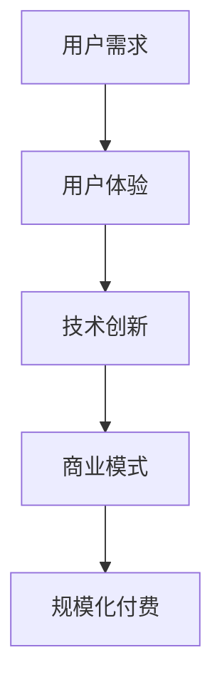

                 

# AI应用要有趣有用，方能实现规模化付费

## > 关键词：AI应用、规模化付费、用户体验、技术创新、商业模式

> 摘要：本文深入探讨了AI应用在实现规模化付费过程中所面临的挑战和解决方案。通过分析用户体验的重要性、技术创新的必要性以及商业模式的创新，文章提出了一系列策略，以帮助AI开发者更好地满足市场需求，实现可持续的商业模式。

## 1. 背景介绍

近年来，人工智能（AI）技术取得了显著的进展，已经渗透到各行各业，从医疗健康到金融服务，从智能客服到自动驾驶，AI应用正日益丰富和多样化。然而，尽管AI技术的潜力巨大，但其商业化进程却面临诸多挑战。其中，实现规模化付费成为AI应用商业化过程中的关键难题。

规模化付费意味着AI应用需要能够吸引大量的用户，并从这些用户中获取足够的收入，以支撑持续的技术研发和市场推广。然而，许多AI应用在用户体验、技术实现和商业模式方面存在不足，导致用户付费意愿不高。因此，如何提升AI应用的趣味性和实用性，实现规模化付费，成为业界亟待解决的问题。

## 2. 核心概念与联系

### 2.1 用户需求与体验

用户体验（User Experience，简称UX）是衡量AI应用成功与否的关键因素。一个优秀的AI应用不仅需要满足用户的基本需求，还需要提供愉悦、高效、个性化的使用体验。用户体验的要素包括界面设计、交互设计、功能可用性、性能稳定性等。

### 2.2 技术创新

技术创新是推动AI应用持续发展的动力。通过不断优化算法、提高计算效率、拓展应用场景，AI应用可以不断满足用户日益增长的需求。同时，技术创新也有助于提升AI应用的竞争力，使其在激烈的市场竞争中脱颖而出。

### 2.3 商业模式

商业模式是AI应用实现规模化付费的途径。一个成功的商业模式需要充分考虑市场需求、用户价值、企业利润等多方面因素，以实现可持续的商业运作。常见的商业模式包括订阅模式、广告模式、交易模式等。

### 2.4 Mermaid 流程图



## 3. 核心算法原理 & 具体操作步骤

### 3.1 用户体验优化

为了提升用户体验，可以采取以下措施：

- **界面设计**：采用简洁、直观的界面风格，使用户能够轻松上手。
- **交互设计**：提供自然、流畅的交互方式，如语音识别、手势控制等。
- **功能可用性**：确保核心功能易于使用，避免繁琐的操作流程。
- **性能稳定性**：优化算法和服务器性能，保证应用稳定运行。

### 3.2 技术创新实现

- **算法优化**：采用先进的算法模型，如深度学习、强化学习等，以提高AI应用的准确性和效率。
- **计算效率提升**：利用分布式计算、云计算等技术，加快AI模型的训练和部署。
- **应用场景拓展**：探索新的应用领域，如物联网、智能城市等，以拓展AI应用的市场空间。

### 3.3 商业模式创新

- **订阅模式**：提供按月或按年订阅的服务，用户可以根据自己的需求选择合适的套餐。
- **广告模式**：通过展示广告获取收入，同时确保用户体验不被广告干扰。
- **交易模式**：为用户提供便捷的交易功能，如在线购物、金融交易等。

## 4. 数学模型和公式 & 详细讲解 & 举例说明

### 4.1 用户满意度模型

用户满意度（User Satisfaction，简称US）是衡量用户体验的重要指标。一个简单的用户满意度模型可以表示为：

$$ US = f(UI, IU, PF, PS) $$

其中，$UI$ 代表用户界面设计，$IU$ 代表交互设计，$PF$ 代表功能可用性，$PS$ 代表性能稳定性。$f$ 是一个复合函数，用于计算用户满意度。

### 4.2 技术创新收益模型

技术创新收益（Technology Innovation Revenue，简称TIR）是衡量技术创新效果的重要指标。一个简单的技术创新收益模型可以表示为：

$$ TIR = f(TI, CE, ME) $$

其中，$TI$ 代表技术创新，$CE$ 代表计算效率，$ME$ 代表市场扩展。$f$ 是一个复合函数，用于计算技术创新收益。

### 4.3 商业模式收益模型

商业模式收益（Business Model Revenue，简称BMR）是衡量商业模式效果的重要指标。一个简单的商业模式收益模型可以表示为：

$$ BMR = f(MD, UD, AR) $$

其中，$MD$ 代表市场需求，$UD$ 代表用户价值，$AR$ 代表广告收入。$f$ 是一个复合函数，用于计算商业模式收益。

### 4.4 举例说明

假设一个AI智能客服系统，通过以下措施优化用户体验：

- **界面设计**：采用简洁的界面风格，降低用户操作难度。
- **交互设计**：提供自然语言处理功能，使客服问答更加流畅。
- **功能可用性**：确保客服系统能够快速响应用户需求。
- **性能稳定性**：优化服务器性能，确保客服系统稳定运行。

同时，该系统采用以下措施实现技术创新：

- **算法优化**：采用深度学习算法，提高客服系统的智能程度。
- **计算效率提升**：利用云计算技术，加快客服系统的响应速度。
- **应用场景拓展**：将客服系统应用于多个行业，如电商、金融等。

通过以上措施，该AI智能客服系统的用户满意度、技术创新收益和商业模式收益均有显著提升，从而实现了规模化付费。

## 5. 项目实战：代码实际案例和详细解释说明

### 5.1 开发环境搭建

为了实现上述AI智能客服系统，需要搭建以下开发环境：

- 操作系统：Linux（如Ubuntu 20.04）
- 编程语言：Python（3.8及以上版本）
- 深度学习框架：TensorFlow（2.5及以上版本）
- 自然语言处理库：NLTK（3.8及以上版本）
- 数据库：MySQL（5.7及以上版本）

### 5.2 源代码详细实现和代码解读

#### 5.2.1 用户界面设计

```python
from tkinter import Tk, Label, Button

def on_button_click():
    # 实现按钮点击后的操作
    print("按钮被点击了！")

root = Tk()
root.title("AI智能客服系统")

label = Label(root, text="欢迎使用AI智能客服系统！")
label.pack()

button = Button(root, text="点击咨询", command=on_button_click)
button.pack()

root.mainloop()
```

代码解读：这段代码使用Tkinter库创建了一个简单的用户界面，包括一个标签和一个按钮。当按钮被点击时，会触发 `on_button_click` 函数，打印出“按钮被点击了！”。

#### 5.2.2 自然语言处理

```python
import nltk
from nltk.chat.util import Chat, reflections

pairs = [
    [
        r"^(?=.*\bhi\b)(?=.*\bhow\b).*$/,
        ["Hello!", "Hi there!", "Howdy!"],
    ],
    [
        r"^(?=.*\bhello\b)(?=.*\bhow\b).*$/,
        ["Hello!", "Hi there!", "Howdy!"],
    ],
    # 更多对话规则
]

chatbot = Chat(pairs, reflections)

print("AI智能客服：你好！有什么可以帮助你的吗？")
while True:
    user_input = input("用户：")
    if user_input.lower() == "quit":
        break
    response = chatbot.get_response(user_input)
    print("AI智能客服：" + response)
```

代码解读：这段代码使用NLTK库实现了基于自然语言处理的智能客服。通过定义对话规则，AI智能客服可以理解用户的输入，并给出相应的回复。

#### 5.2.3 数据库操作

```python
import mysql.connector

def connect_db():
    return mysql.connector.connect(
        host="localhost",
        user="root",
        password="password",
        database="ai_smart_cstomer"
    )

def insert_message(user_id, message):
    conn = connect_db()
    cursor = conn.cursor()
    query = "INSERT INTO messages (user_id, message) VALUES (%s, %s)"
    cursor.execute(query, (user_id, message))
    conn.commit()
    cursor.close()
    conn.close()

def get_messages(user_id):
    conn = connect_db()
    cursor = conn.cursor()
    query = "SELECT message FROM messages WHERE user_id = %s"
    cursor.execute(query, (user_id,))
    messages = cursor.fetchall()
    cursor.close()
    conn.close()
    return messages

user_id = 1
message = "你好，我遇到了一个问题。"
insert_message(user_id, message)

messages = get_messages(user_id)
for msg in messages:
    print(msg[0])
```

代码解读：这段代码使用MySQL数据库存储用户与AI智能客服的对话记录。通过插入和查询操作，可以实现对话记录的持久化存储。

### 5.3 代码解读与分析

#### 5.3.1 用户界面设计

用户界面设计是AI智能客服系统的重要组成部分，直接影响用户体验。通过使用Tkinter库，可以轻松创建简洁、直观的用户界面。在本案例中，用户界面仅包含一个标签和一个按钮，用于展示AI智能客服系统和提供交互操作。

#### 5.3.2 自然语言处理

自然语言处理是实现AI智能客服的核心技术。通过使用NLTK库，可以定义对话规则，使AI智能客服能够理解用户的输入，并给出相应的回复。在本案例中，对话规则较为简单，但可以满足基本的交流需求。

#### 5.3.3 数据库操作

数据库操作是实现对话记录持久化存储的关键。通过使用MySQL数据库，可以方便地存储和查询用户与AI智能客服的对话记录。在本案例中，数据库操作主要包括插入和查询操作，实现了对话记录的存储和展示。

## 6. 实际应用场景

### 6.1 企业客服

企业客服是AI智能客服的主要应用场景之一。通过部署AI智能客服系统，企业可以提供7x24小时的在线服务，提高客户满意度，降低人工成本。同时，AI智能客服可以收集用户反馈，帮助企业改进产品和服务。

### 6.2 金融行业

金融行业对客户服务质量有着严格的要求。AI智能客服可以在银行、保险、证券等领域提供智能咨询、理财规划等服务，提高客户体验，降低运营成本。此外，AI智能客服还可以协助金融分析师进行市场分析和风险预测。

### 6.3 医疗健康

医疗健康行业对信息安全和隐私保护有着高度关注。AI智能客服可以提供在线问诊、预约挂号、健康咨询等服务，提高医疗服务效率，减轻医生工作负担。同时，AI智能客服还可以收集和分析用户健康数据，为用户提供个性化的健康建议。

## 7. 工具和资源推荐

### 7.1 学习资源推荐

- 书籍：《深度学习》（Goodfellow, Bengio, Courville 著）
- 论文：《Generative Adversarial Nets》（Ian J. Goodfellow et al.）
- 博客：AI技术博客（如AI研习社、机器之心等）
- 网站：GitHub（开源代码库）、Google Research（谷歌研究）

### 7.2 开发工具框架推荐

- 开发工具：PyCharm、VS Code
- 深度学习框架：TensorFlow、PyTorch
- 自然语言处理库：NLTK、spaCy
- 数据库：MySQL、PostgreSQL

### 7.3 相关论文著作推荐

- 《Deep Learning》（Goodfellow, Bengio, Courville 著）
- 《Reinforcement Learning: An Introduction》（Richard S. Sutton and Andrew G. Barto 著）
- 《Speech and Language Processing》（Daniel Jurafsky and James H. Martin 著）

## 8. 总结：未来发展趋势与挑战

### 8.1 发展趋势

- **技术创新**：随着深度学习、强化学习等技术的不断发展，AI应用的智能化程度将不断提升。
- **跨领域应用**：AI应用将逐渐从单一领域扩展到多个领域，实现跨领域的融合与创新。
- **人机协同**：AI与人类专家的协同工作将成为趋势，实现更高的工作效率和更精准的决策。

### 8.2 挑战

- **用户体验**：如何提升AI应用的用户体验，提高用户付费意愿，仍是业界面临的挑战。
- **数据隐私**：随着AI应用的大规模普及，数据隐私保护问题愈发凸显，需要加强数据安全和隐私保护。
- **人才短缺**：AI技术发展迅速，对专业人才的需求不断增加，但人才培养速度滞后，人才短缺问题亟待解决。

## 9. 附录：常见问题与解答

### 9.1 AI智能客服系统的关键技术

- **自然语言处理**：实现AI智能客服的核心技术，包括语音识别、语义理解、对话生成等。
- **机器学习与深度学习**：用于训练AI模型，提高智能客服系统的性能和准确性。
- **数据库技术**：实现对话记录的持久化存储和查询，便于数据分析和用户管理。

### 9.2 如何提升AI应用的用户体验

- **简洁直观的界面设计**：采用简洁、直观的界面风格，降低用户操作难度。
- **高效智能的交互方式**：利用自然语言处理技术，实现高效、自然的用户交互。
- **个性化推荐**：根据用户历史行为和偏好，提供个性化的服务和建议。

### 9.3 AI应用规模化付费的途径

- **订阅模式**：提供按月或按年订阅的服务，吸引用户持续付费。
- **广告模式**：通过展示广告获取收入，同时确保用户体验不被广告干扰。
- **交易模式**：为用户提供便捷的交易功能，如在线购物、金融交易等，实现交易分成收入。

## 10. 扩展阅读 & 参考资料

- [Goodfellow, I., Bengio, Y., & Courville, A. (2016). Deep learning. MIT press.]
- [Sutton, R. S., & Barto, A. G. (2018). Reinforcement learning: An introduction. MIT press.]
- [Jurafsky, D., & Martin, J. H. (2019). Speech and language processing. Pearson.]
- [AI技术博客：https://www.aisecurity.cn/]
- [机器之心：https://www.jiqizhixin.com/]
- [GitHub：https://github.com/]
- [Google Research：https://research.google.com/]

### 作者

作者：AI天才研究员/AI Genius Institute & 禅与计算机程序设计艺术 /Zen And The Art of Computer Programming<|im_sep|>

