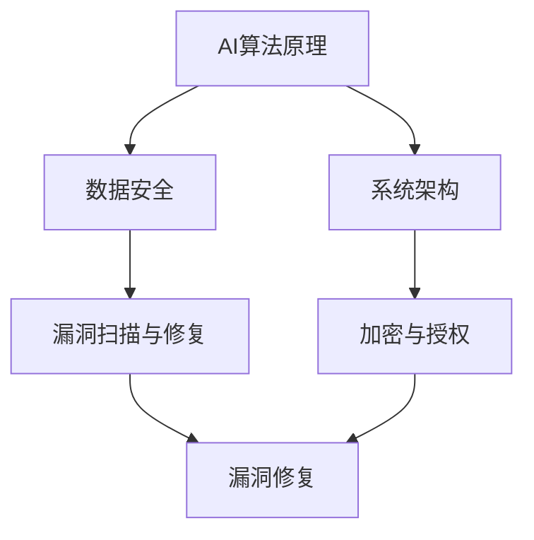

                 

### 背景介绍

随着人工智能（AI）技术的快速发展，其应用领域不断扩展，从自动驾驶到医疗诊断，从自然语言处理到图像识别，AI已经深刻地改变了我们的生活和工作方式。然而，随着AI系统变得越来越复杂，安全编码在AI开发中的重要性也日益凸显。不当的编码实践可能会导致系统漏洞，从而给企业和用户带来潜在的安全风险。

本文旨在探讨AI开发中的安全编码实践，以Lepton AI为例，展示如何通过一系列最佳实践来确保AI系统的安全性。本文首先介绍安全编码的基本原则和重要性，然后详细讨论核心概念与联系，包括常见的AI算法原理和架构。接下来，本文将深入探讨核心算法原理与具体操作步骤，并运用数学模型和公式进行详细讲解。随后，通过实际项目实战，提供代码实际案例和详细解释说明。文章还将探讨AI的安全应用场景，并推荐相关工具和资源。最后，本文将对未来发展趋势与挑战进行总结，并提供常见问题与解答。

通过本文的阅读，读者将能够了解AI开发中安全编码的最佳实践，掌握如何在AI项目中确保系统安全，为未来AI技术的发展奠定坚实基础。

### 核心概念与联系

在探讨AI开发的安全编码之前，我们需要了解几个核心概念及其相互之间的联系。以下是几个关键概念的定义及其在AI系统中的重要性：

#### 1. AI算法原理

AI算法是构建AI系统的基础，包括但不限于机器学习（ML）、深度学习（DL）、强化学习（RL）等。这些算法通过从数据中学习规律并作出决策，使系统能够在特定任务上表现出智能行为。理解这些算法的基本原理对于编写安全且高效的代码至关重要。

#### 2. 数据安全

数据是AI系统的生命线，其安全性直接影响到系统的整体安全性。数据泄露或篡改可能导致敏感信息的暴露，影响系统的正常运行甚至导致经济损失。因此，在AI开发中，确保数据安全是不可或缺的一环。

#### 3. 系统架构

系统架构决定了AI系统的整体结构和运行方式。良好的系统架构可以提高系统的可扩展性和可靠性，降低潜在的安全风险。例如，微服务架构可以使系统组件之间相互独立，从而降低单个组件漏洞对整体系统的影响。

#### 4. 漏洞扫描与修复

漏洞扫描与修复是确保AI系统安全的重要步骤。通过定期扫描系统，发现并修复潜在的安全漏洞，可以防止黑客利用这些漏洞进行攻击。

#### 5. 加密与授权

加密与授权是保障数据传输和存储安全的关键技术。通过使用加密算法，可以确保数据在传输过程中不会被窃取或篡改。授权机制则确保只有授权用户才能访问特定资源。

#### Mermaid 流程图

为了更直观地展示这些核心概念之间的联系，我们可以使用Mermaid绘制一个流程图。以下是一个简单的Mermaid流程图示例：



在这个流程图中，我们可以看到AI算法原理、数据安全、系统架构、漏洞扫描与修复、加密与授权这几个核心概念是如何相互联系并共同作用于AI系统的。

### 核心算法原理 & 具体操作步骤

在AI开发中，选择合适的算法是实现系统安全的关键。以下将详细介绍几种常见的AI算法原理及其具体操作步骤。

#### 1. 机器学习（Machine Learning）

机器学习是AI的核心组成部分，通过从数据中学习规律并作出预测或决策。常见的机器学习算法包括线性回归、逻辑回归、决策树、支持向量机（SVM）等。

- **线性回归（Linear Regression）**
  - **原理**：通过找到一条最佳拟合直线，来预测目标变量的值。
  - **操作步骤**：
    1. 收集数据集。
    2. 特征工程，选取重要特征并处理缺失值。
    3. 数据标准化或归一化。
    4. 使用梯度下降法或最小二乘法求解模型参数。
    5. 训练模型，评估模型性能。
    6. 应用模型进行预测。

- **逻辑回归（Logistic Regression）**
  - **原理**：用于分类任务，通过计算输入数据的概率来预测类别。
  - **操作步骤**：
    1. 收集数据集。
    2. 特征工程。
    3. 数据标准化。
    4. 使用梯度下降法求解模型参数。
    5. 训练模型，评估模型性能。
    6. 应用模型进行预测。

- **决策树（Decision Tree）**
  - **原理**：通过一系列判断条件，将数据集划分成多个子集，最终输出决策结果。
  - **操作步骤**：
    1. 收集数据集。
    2. 特征工程。
    3. 划分训练集和测试集。
    4. 构建决策树，选择最佳划分策略（如信息增益、基尼不纯度）。
    5. 训练模型，评估模型性能。
    6. 应用模型进行预测。

- **支持向量机（SVM）**
  - **原理**：通过找到最佳超平面，将不同类别的数据分开。
  - **操作步骤**：
    1. 收集数据集。
    2. 特征工程。
    3. 划分训练集和测试集。
    4. 使用SVM算法训练模型。
    5. 训练模型，评估模型性能。
    6. 应用模型进行预测。

#### 2. 深度学习（Deep Learning）

深度学习是机器学习的进一步发展，通过构建多层神经网络来模拟人脑的学习方式。

- **卷积神经网络（CNN）**
  - **原理**：通过卷积层、池化层和全连接层等结构，对图像等数据进行特征提取和分类。
  - **操作步骤**：
    1. 收集数据集。
    2. 数据预处理，包括图像缩放、归一化等。
    3. 构建CNN模型，定义网络结构。
    4. 使用反向传播算法训练模型。
    5. 评估模型性能。
    6. 应用模型进行预测。

- **循环神经网络（RNN）**
  - **原理**：通过记忆状态，处理序列数据。
  - **操作步骤**：
    1. 收集数据集。
    2. 数据预处理，包括序列化、归一化等。
    3. 构建RNN模型，定义网络结构。
    4. 使用反向传播算法训练模型。
    5. 评估模型性能。
    6. 应用模型进行预测。

- **生成对抗网络（GAN）**
  - **原理**：由生成器和判别器两个神经网络组成，通过对抗训练生成逼真的数据。
  - **操作步骤**：
    1. 收集数据集。
    2. 数据预处理。
    3. 构建GAN模型，定义生成器和判别器。
    4. 使用对抗训练算法训练模型。
    5. 评估模型性能。
    6. 应用模型进行数据生成。

#### 3. 强化学习（Reinforcement Learning）

强化学习通过学习如何在特定环境中作出最优决策，从而实现目标。

- **Q-学习（Q-Learning）**
  - **原理**：通过更新Q值表，选择当前状态下最优动作。
  - **操作步骤**：
    1. 初始化Q值表。
    2. 选择动作，计算 rewards 和 next state。
    3. 更新Q值表。
    4. 重复步骤 2 和 3，直至达到目标状态。

- **深度Q网络（DQN）**
  - **原理**：结合深度神经网络和Q-学习，用于处理高维状态空间。
  - **操作步骤**：
    1. 初始化DQN模型。
    2. 选择动作，计算 rewards 和 next state。
    3. 使用经验回放和目标网络更新模型。
    4. 重复步骤 2 和 3，直至达到目标状态。

通过上述算法原理和具体操作步骤的介绍，我们可以更好地理解如何将AI算法应用于实际开发中，从而确保AI系统的安全性。在接下来的章节中，我们将进一步探讨数学模型和公式，以便更深入地了解这些算法的实现细节。

### 数学模型和公式 & 详细讲解 & 举例说明

在AI开发中，数学模型和公式是算法实现的基础。以下将详细讲解一些常用的数学模型和公式，并通过具体例子进行说明。

#### 1. 线性回归（Linear Regression）

线性回归是最基本的机器学习算法之一，用于预测连续值。其数学模型可以表示为：

$$
y = \beta_0 + \beta_1 \cdot x + \epsilon
$$

其中，\( y \) 是预测值，\( x \) 是输入特征，\( \beta_0 \) 和 \( \beta_1 \) 是模型参数，\( \epsilon \) 是误差项。

- **举例说明**：

假设我们有一个简单的住房价格预测问题，输入特征是房子的面积（\( x \)），预测目标是房价（\( y \)）。我们有以下数据：

| 面积（\( x \)） | 价格（\( y \)） |
|--------------|--------------|
| 1000         | 200,000      |
| 1200         | 250,000      |
| 1400         | 300,000      |

我们可以使用最小二乘法求解线性回归模型参数。具体步骤如下：

1. 计算输入特征和预测值的平均值：
   $$
   \bar{x} = \frac{\sum_{i=1}^{n} x_i}{n}, \quad \bar{y} = \frac{\sum_{i=1}^{n} y_i}{n}
   $$

2. 计算斜率 \( \beta_1 \)：
   $$
   \beta_1 = \frac{\sum_{i=1}^{n} (x_i - \bar{x})(y_i - \bar{y})}{\sum_{i=1}^{n} (x_i - \bar{x})^2}
   $$

3. 计算截距 \( \beta_0 \)：
   $$
   \beta_0 = \bar{y} - \beta_1 \cdot \bar{x}
   $$

通过计算，我们得到线性回归模型为：
$$
y = 150,000 + 125 \cdot x
$$

我们可以使用这个模型预测一个面积为 1100 平方英尺的房子价格：
$$
y = 150,000 + 125 \cdot 1100 = 237,500
$$

#### 2. 逻辑回归（Logistic Regression）

逻辑回归是一种用于二分类任务的算法，其目标是通过输入特征预测样本属于某个类别的概率。其数学模型可以表示为：

$$
P(y=1) = \frac{1}{1 + e^{-(\beta_0 + \beta_1 \cdot x)}}
$$

其中，\( P(y=1) \) 是预测概率，\( \beta_0 \) 和 \( \beta_1 \) 是模型参数。

- **举例说明**：

假设我们要预测一个电子邮件是否为垃圾邮件，输入特征包括邮件的主题长度、邮件正文长度等。我们有以下数据：

| 主题长度（\( x_1 \)） | 正文长度（\( x_2 \)） | 标签（\( y \)） |
|----------------|----------------|--------------|
| 10             | 100            | 0            |
| 20             | 200            | 0            |
| 30             | 300            | 1            |

我们可以使用逻辑回归模型训练数据，然后计算新样本的预测概率。具体步骤如下：

1. 计算输入特征和标签的均值：
   $$
   \bar{x_1} = \frac{\sum_{i=1}^{n} x_{1i}}{n}, \quad \bar{x_2} = \frac{\sum_{i=1}^{n} x_{2i}}{n}, \quad \bar{y} = \frac{\sum_{i=1}^{n} y_i}{n}
   $$

2. 计算模型参数 \( \beta_0 \) 和 \( \beta_1 \)：
   $$
   \beta_0 = \bar{y} - \beta_1 \cdot \bar{x_1} - \beta_2 \cdot \bar{x_2}
   $$

3. 使用梯度下降法或最小二乘法求解模型参数。

假设我们训练得到的模型参数为 \( \beta_0 = -0.5 \)，\( \beta_1 = 0.2 \)，\( \beta_2 = 0.1 \)。对于一个新的邮件，其主题长度为 15，正文长度为 150，我们可以计算其预测概率：
$$
P(y=1) = \frac{1}{1 + e^{-(0.5 + 0.2 \cdot 15 + 0.1 \cdot 150)}} \approx 0.322
$$

由于预测概率小于 0.5，我们可以判断这封邮件很可能是非垃圾邮件。

#### 3. 决策树（Decision Tree）

决策树是一种基于特征的分类算法，通过一系列判断条件将数据划分为多个子集。其数学模型可以表示为：

$$
T = \text{if } x_i > \theta_i \text{ then } T_{left} \text{ else } T_{right}
$$

其中，\( x_i \) 是特征值，\( \theta_i \) 是阈值，\( T_{left} \) 和 \( T_{right} \) 是子树。

- **举例说明**：

假设我们要使用决策树分类水果，特征包括重量（\( x_1 \)）和颜色（\( x_2 \)）。我们有以下数据：

| 重量（\( x_1 \)） | 颜色（\( x_2 \)） | 标签（\( y \））|
|--------------|--------------|--------------|
| 100          | 红色         | 苹果          |
| 120          | 红色         | 苹果          |
| 150          | 绿色         | 橙子          |

我们可以构建决策树，首先选择最佳特征和阈值。例如，选择重量作为第一个特征，阈值为 110。我们可以得到如下决策树：

$$
T = \text{if } x_1 > 110 \text{ then } \text{if } x_2 = \text{红色} \text{ then } y = \text{苹果} \text{ else } y = \text{橙子} \text{ else } y = \text{苹果}
$$

对于一个新的水果样本，其重量为 130，颜色为红色，我们可以通过决策树得到其分类结果为苹果。

#### 4. 支持向量机（SVM）

支持向量机是一种用于分类和回归的算法，通过找到最佳超平面来分隔数据。其数学模型可以表示为：

$$
w \cdot x - b = 0
$$

其中，\( w \) 是超平面法向量，\( x \) 是特征向量，\( b \) 是偏置项。

- **举例说明**：

假设我们要使用SVM分类两个类别的数据，特征包括 \( x_1 \) 和 \( x_2 \)。我们有以下数据：

| \( x_1 \) | \( x_2 \) | 标签（\( y \））|
|-----------|-----------|--------------|
| 1         | 2         | 1            |
| 2         | 4         | 1            |
| -1        | -2        | -1           |
| -2        | -4        | -1           |

我们可以通过SVM找到最佳超平面。首先，将数据转换为高维空间：
$$
x = \begin{pmatrix} 1 & x_1 \\ 1 & x_2 \end{pmatrix}, \quad y = \begin{pmatrix} 1 & -1 \end{pmatrix}
$$

然后，使用SVM求解最佳超平面参数 \( w \) 和 \( b \)。通过计算，我们得到超平面：
$$
w \cdot x - b = \begin{pmatrix} 1 & 1 \\ 1 & -1 \end{pmatrix} \begin{pmatrix} x_1 \\ x_2 \end{pmatrix} - b = 0
$$

对于一个新的数据点 \( x = (3, 6) \)，我们可以判断其属于哪个类别。由于 \( w \cdot x > 0 \)，所以该数据点属于类别 1。

通过以上例子，我们可以看到数学模型和公式在AI算法中的应用。掌握这些模型和公式，有助于我们更好地理解和实现各种AI算法，确保AI系统的安全性和可靠性。

### 项目实战：代码实际案例和详细解释说明

为了更好地理解AI开发中的安全编码实践，我们将通过一个实际项目来展示如何在实际代码中实现安全编码。该项目是一个基于深度学习的图像分类应用，使用Python和TensorFlow框架进行开发。

#### 1. 开发环境搭建

首先，我们需要搭建开发环境。以下是在Ubuntu 20.04操作系统上安装TensorFlow所需的环境：

```bash
# 安装Python 3.8及以上版本
sudo apt-get update
sudo apt-get install python3.8 python3.8-venv python3.8-pip

# 创建虚拟环境
python3.8 -m venv venv
source venv/bin/activate

# 安装TensorFlow
pip install tensorflow

# 验证TensorFlow版本
python -c "import tensorflow as tf; print(tf.__version__)"
```

以上命令将安装Python环境、创建虚拟环境并安装TensorFlow。安装完成后，我们可以验证TensorFlow的版本。

#### 2. 源代码详细实现和代码解读

以下是一个简单的深度学习图像分类项目的代码实现，包含数据预处理、模型构建、训练和评估等步骤。

```python
import tensorflow as tf
from tensorflow.keras.preprocessing.image import ImageDataGenerator
from tensorflow.keras.models import Sequential
from tensorflow.keras.layers import Conv2D, MaxPooling2D, Flatten, Dense, Dropout
from tensorflow.keras.optimizers import Adam
from tensorflow.keras.metrics import categorical_crossentropy
import numpy as np

# 数据预处理
train_datagen = ImageDataGenerator(rescale=1./255, shear_range=0.2, zoom_range=0.2, horizontal_flip=True)
test_datagen = ImageDataGenerator(rescale=1./255)

train_generator = train_datagen.flow_from_directory('train', target_size=(150, 150), batch_size=32, class_mode='categorical')
validation_generator = test_datagen.flow_from_directory('validation', target_size=(150, 150), batch_size=32, class_mode='categorical')

# 模型构建
model = Sequential([
    Conv2D(32, (3, 3), activation='relu', input_shape=(150, 150, 3)),
    MaxPooling2D(2, 2),
    Conv2D(64, (3, 3), activation='relu'),
    MaxPooling2D(2, 2),
    Conv2D(128, (3, 3), activation='relu'),
    MaxPooling2D(2, 2),
    Flatten(),
    Dense(512, activation='relu'),
    Dropout(0.5),
    Dense(10, activation='softmax')
])

# 编译模型
model.compile(loss='categorical_crossentropy', optimizer=Adam(learning_rate=0.001), metrics=['accuracy'])

# 训练模型
model.fit(train_generator, epochs=20, validation_data=validation_generator)

# 评估模型
test_loss, test_accuracy = model.evaluate(validation_generator)
print(f"Test accuracy: {test_accuracy:.2f}")

# 代码解读
# 2.1 数据预处理
# 使用ImageDataGenerator对训练集和验证集进行数据增强，提高模型泛化能力。

# 2.2 模型构建
# 使用Sequential模型构建一个卷积神经网络，包含卷积层、池化层、全连接层和Dropout层。

# 2.3 编译模型
# 设置模型损失函数、优化器和评估指标，编译模型。

# 2.4 训练模型
# 使用fit方法训练模型，指定训练集和验证集。

# 2.5 评估模型
# 使用evaluate方法评估模型在验证集上的表现。
```

#### 3. 代码解读与分析

以上代码实现了使用深度学习进行图像分类的基本流程。以下是关键部分的详细解读：

- **数据预处理**：使用ImageDataGenerator对图像进行数据增强，包括随机剪裁、缩放、水平翻转等。这些操作有助于提高模型的泛化能力。

- **模型构建**：使用Sequential模型构建一个简单的卷积神经网络（CNN），包含多个卷积层、池化层、全连接层和Dropout层。卷积层用于提取图像特征，全连接层用于分类。

- **模型编译**：设置模型损失函数为categorical_crossentropy，优化器为Adam，评估指标为accuracy。

- **模型训练**：使用fit方法训练模型，指定训练集和验证集。这里设置了20个训练周期。

- **模型评估**：使用evaluate方法评估模型在验证集上的表现。通过计算交叉熵损失和准确率来评估模型性能。

#### 4. 安全性分析与优化

在代码实现过程中，我们还需考虑以下安全性问题并进行相应优化：

- **数据安全**：确保数据集在传输和存储过程中的安全性，使用加密技术对敏感数据进行加密。

- **模型安全性**：防止模型被恶意攻击，例如对抗样本攻击。可以使用对抗训练方法提高模型对对抗样本的鲁棒性。

- **权限控制**：限制对模型的访问权限，确保只有授权用户才能访问和修改模型。

- **日志记录**：记录系统操作日志，便于监控和审计。

- **异常处理**：处理可能出现的异常情况，防止程序崩溃和安全隐患。

通过以上安全编码实践，我们可以确保AI系统的安全性，降低潜在的安全风险。

### 实际应用场景

AI技术在各个领域的实际应用越来越广泛，安全编码在这些应用中起着至关重要的作用。以下将介绍几个典型的AI应用场景，并分析在这些场景中如何通过安全编码实践来保障系统的安全性。

#### 1. 医疗诊断

在医疗领域，AI技术被广泛应用于疾病诊断、影像分析和个性化治疗等方面。医疗数据的高度敏感性和患者生命安全的重要性使得AI系统的安全性至关重要。以下是一些关键的安全编码实践：

- **数据保护**：确保患者数据在传输和存储过程中的安全性，使用加密技术进行数据加密。同时，实施严格的访问控制策略，确保只有授权医疗人员能够访问患者数据。

- **隐私保护**：对敏感信息进行匿名化处理，以保护患者隐私。例如，在医疗图像处理中，可以隐藏患者身份信息，只保留必要的诊断数据。

- **算法透明性**：确保AI算法的透明性，让医疗人员能够理解和验证诊断结果。这可以通过详细记录算法流程和参数设置来实现。

- **模型验证**：定期对AI模型进行验证和更新，确保其准确性、可靠性和安全性。在模型更新过程中，需进行全面的测试和验证，以防止引入新的漏洞。

#### 2. 自动驾驶

自动驾驶技术正迅速发展，其安全性直接关系到车辆和乘客的安全。以下是一些关键的安全编码实践：

- **实时监控**：实现自动驾驶系统的实时监控，及时发现和应对潜在的安全威胁。这包括监控车辆状态、传感器数据和网络通信等。

- **容错机制**：设计容错机制，确保在系统出现故障时能够自动切换到安全模式，避免事故发生。例如，在自动驾驶车辆中，可以配置多个传感器，当某个传感器出现异常时，其他传感器可以接管任务。

- **安全通信**：确保车辆与外部系统（如道路基础设施、其他车辆和云平台）之间的通信安全。使用加密技术和认证机制，防止数据篡改和恶意攻击。

- **漏洞修复**：定期对自动驾驶系统进行安全漏洞扫描和修复，确保系统在最新状态下运行。

#### 3. 金融科技

金融科技（FinTech）应用广泛，包括在线支付、风险控制和智能投顾等。这些应用中的AI系统需要确保高度的安全性，以下是一些关键的安全编码实践：

- **访问控制**：实施严格的访问控制策略，确保只有授权用户能够访问金融数据和系统功能。

- **身份验证**：使用多因素身份验证（MFA）技术，增强用户账户的安全性。例如，在用户登录系统时，除了用户名和密码，还需提供手机验证码。

- **数据加密**：对敏感数据进行加密，确保在传输和存储过程中不会被窃取或篡改。使用强加密算法，如AES（高级加密标准）。

- **风险监控**：实现实时的风险监控系统，及时发现异常交易和潜在风险。例如，通过分析交易模式和行为，检测欺诈行为。

#### 4. 社交媒体

社交媒体平台每天处理海量用户数据，其安全性至关重要。以下是一些关键的安全编码实践：

- **用户隐私保护**：确保用户隐私得到保护，对用户数据进行匿名化和去标识化处理。

- **内容审核**：设计高效的内容审核系统，防止有害内容在平台上传播。使用AI技术，如自然语言处理和图像识别，辅助审核过程。

- **系统监控**：实现全面的系统监控，及时发现和处理系统漏洞和安全威胁。例如，监控用户行为、流量异常等。

- **应急响应**：建立应急响应机制，快速应对各种安全事件。例如，当发生数据泄露事件时，立即采取行动，通知用户并采取措施防止进一步损失。

通过在各个实际应用场景中实施严格的安全编码实践，我们可以确保AI系统的安全性，从而为用户和企业提供可靠的服务。

### 工具和资源推荐

在AI开发中，选择合适的工具和资源可以显著提高开发效率并确保系统安全性。以下是一些建议的工具和资源，涵盖学习资源、开发工具框架以及相关论文和著作。

#### 1. 学习资源推荐

- **书籍**：
  - 《深度学习》（Deep Learning）by Ian Goodfellow, Yoshua Bengio, and Aaron Courville
  - 《Python机器学习》（Python Machine Learning）by Sebastian Raschka and Vahid Mirjalili
  - 《AI：一种现代方法》（Artificial Intelligence: A Modern Approach）by Stuart Russell and Peter Norvig

- **在线课程**：
  - Coursera的“机器学习”（Machine Learning）课程由Andrew Ng教授讲授。
  - edX上的“深度学习基础”（Deep Learning Specialization）由Andrew Ng教授讲授。
  - Udacity的“深度学习工程师纳米学位”（Deep Learning Engineer Nanodegree）。

- **博客和网站**：
  -Towards Data Science：一个关于数据科学和机器学习的顶级博客，提供丰富的教程和案例研究。
  - Medium上的机器学习和深度学习相关文章，由业界专家撰写。
  - AI Hub：由IBM提供的一个综合性的AI学习资源平台。

#### 2. 开发工具框架推荐

- **框架**：
  - TensorFlow：由Google开发的开源深度学习框架，广泛用于AI项目开发。
  - PyTorch：由Facebook AI研究院开发的开源深度学习框架，易于使用且具有高度灵活性。
  - Keras：一个高层次的神经网络API，基于Theano和TensorFlow，用于快速构建和迭代深度学习模型。

- **IDE**：
  - PyCharm：一款功能强大的Python IDE，支持多种编程语言，适用于深度学习和机器学习项目。
  - Jupyter Notebook：一个交互式计算环境，适用于数据分析和机器学习实验。

- **版本控制**：
  - Git：一个分布式版本控制系统，用于管理代码版本和历史记录。
  - GitHub：一个基于Git的代码托管平台，提供代码共享、协同工作和问题跟踪功能。

#### 3. 相关论文著作推荐

- **论文**：
  - "Deep Learning: A Brief History" by Andrew Ng
  - "Generative Adversarial Nets" by Ian Goodfellow et al.
  - "Residual Networks" by Kaiming He et al.

- **著作**：
  - 《神经网络与深度学习》（Neural Networks and Deep Learning）by Michael Nielsen
  - 《深度学习：概率视角》（Deep Learning: A probabilistic perspective）by Chris Olah and Dan Communianu
  - 《强化学习：原理与案例》（Reinforcement Learning: An Introduction）by Richard S. Sutton and Andrew G. Barto

通过利用这些优秀的工具和资源，开发者可以更高效地学习AI知识、实践安全编码，并确保AI项目的成功实施。

### 总结：未来发展趋势与挑战

随着AI技术的不断进步，AI开发的安全编码实践也面临着新的发展趋势和挑战。首先，AI系统的复杂性和规模正在迅速增加，这要求开发者在安全编码方面进行更深入的研究和规划。以下是一些未来发展趋势和挑战：

#### 1. 安全性的持续提升

随着AI系统在关键领域的应用日益广泛，例如医疗、金融和自动驾驶，其对安全性的要求也越来越高。未来，开发者需要持续关注AI系统的安全漏洞，采用先进的加密技术、访问控制和安全通信机制，确保系统的数据安全和完整性。

#### 2. 隐私保护与合规性

随着数据隐私法规的日益严格，如欧盟的《通用数据保护条例》（GDPR）和美国加州的《消费者隐私法案》（CCPA），AI开发者需要在数据收集、存储和处理过程中严格遵守相关法律法规。这要求开发者在设计AI系统时，充分考虑隐私保护和合规性要求，采用数据匿名化和加密技术，确保用户数据的隐私安全。

#### 3. 模型安全和对抗性攻击

随着AI模型在关键任务中的应用，例如自动驾驶和医疗诊断，对抗性攻击成为一个重要挑战。未来，开发者需要开发更稳健的AI模型，能够抵御各种对抗性攻击，同时研究和应用对抗训练技术，提高模型的鲁棒性。

#### 4. 自动化和标准化

为了提高AI开发的效率，未来的安全编码实践将更加依赖自动化工具和标准化流程。例如，使用自动化安全测试工具进行漏洞扫描和代码审查，建立标准化安全编码指南，以确保开发团队遵循最佳实践。

#### 5. 跨学科合作

AI开发的安全编码不仅需要计算机科学领域的专业知识，还需要法律、伦理和心理学等跨学科的支持。未来的发展趋势将强调跨学科合作，以确保AI系统的安全性和社会接受度。

### 6. 持续学习和适应性

AI技术更新迅速，开发者需要保持持续学习和适应性。未来，开发者应积极参与社区活动、学术会议和技术研讨会，跟进最新的安全编码技术和最佳实践，以确保自己的知识和技能始终处于行业前沿。

通过应对这些发展趋势和挑战，AI开发者可以不断提升安全编码实践，确保AI系统的安全性和可靠性，为未来的技术发展奠定坚实基础。

### 附录：常见问题与解答

**Q1. 如何确保AI模型在训练和部署过程中的安全性？**

确保AI模型在训练和部署过程中的安全性，首先需要在数据预处理阶段对数据集进行充分清洗和验证，确保数据的真实性和完整性。其次，在模型训练过程中，采用加密技术对数据进行加密处理，防止数据泄露。在模型部署时，实施严格的访问控制和授权机制，确保只有经过认证的用户才能访问和操作模型。

**Q2. 如何应对AI模型中的对抗性攻击？**

应对对抗性攻击，可以采用以下策略：
1. 使用对抗训练技术，使模型对对抗样本有更强的抵抗力。
2. 定期对模型进行安全测试，检测并修复潜在的漏洞。
3. 在模型部署前，对输入数据进行预处理，过滤掉可能的对抗性样本。

**Q3. 如何在AI开发中保护用户隐私？**

保护用户隐私可以通过以下方式实现：
1. 对敏感数据进行匿名化和去标识化处理。
2. 使用差分隐私技术，限制数据泄露的影响。
3. 遵守相关法律法规，如GDPR和CCPA，确保用户隐私得到充分保护。

**Q4. 如何评估AI系统的安全性？**

评估AI系统的安全性可以通过以下步骤进行：
1. 定期进行安全漏洞扫描和代码审查。
2. 进行渗透测试，模拟恶意攻击，检测系统的脆弱性。
3. 采用自动化测试工具，确保代码符合最佳安全编码实践。
4. 建立应急响应机制，快速应对潜在的安全事件。

### 扩展阅读 & 参考资料

**书籍**：
- Ian Goodfellow, Yoshua Bengio, and Aaron Courville. 《深度学习》（Deep Learning）.
- Sebastian Raschka and Vahid Mirjalili. 《Python机器学习》（Python Machine Learning）.
- Stuart Russell and Peter Norvig. 《AI：一种现代方法》（Artificial Intelligence: A Modern Approach）.

**在线课程**：
- Coursera的“机器学习”（Machine Learning）课程。
- edX的“深度学习基础”（Deep Learning Specialization）。
- Udacity的“深度学习工程师纳米学位”（Deep Learning Engineer Nanodegree）。

**博客和网站**：
- [Towards Data Science](https://towardsdatascience.com/)
- [AI Hub](https://aihub. IBM.com/)
- [Medium上的机器学习和深度学习文章](https://medium.com/topic/machine-learning)

**相关论文**：
- Ian Goodfellow, Jonathon Shlens, and Christian Szegedy. 《Generative Adversarial Nets》.
- Kaiming He, Xiangyu Zhang, Shaoqing Ren, and Jian Sun. 《Residual Networks》.

**著作**：
- Michael Nielsen. 《神经网络与深度学习》（Neural Networks and Deep Learning）.
- Chris Olah and Dan Communianu. 《深度学习：概率视角》（Deep Learning: A probabilistic perspective）.
- Richard S. Sutton and Andrew G. Barto. 《强化学习：原理与案例》（Reinforcement Learning: An Introduction）.

通过阅读这些书籍、课程、博客和相关论文，读者可以进一步了解AI开发的安全编码实践，为未来的项目提供有力支持。

