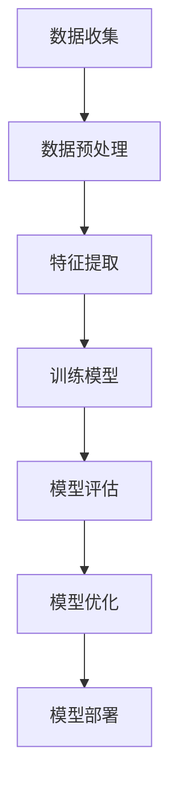
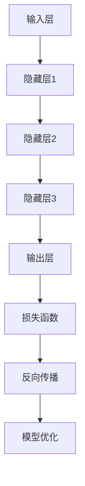
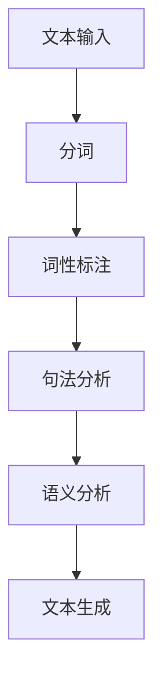
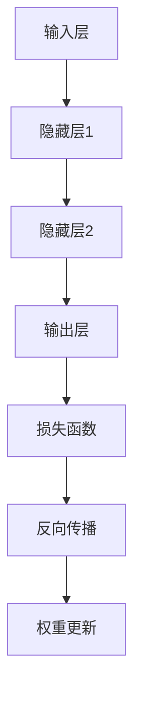
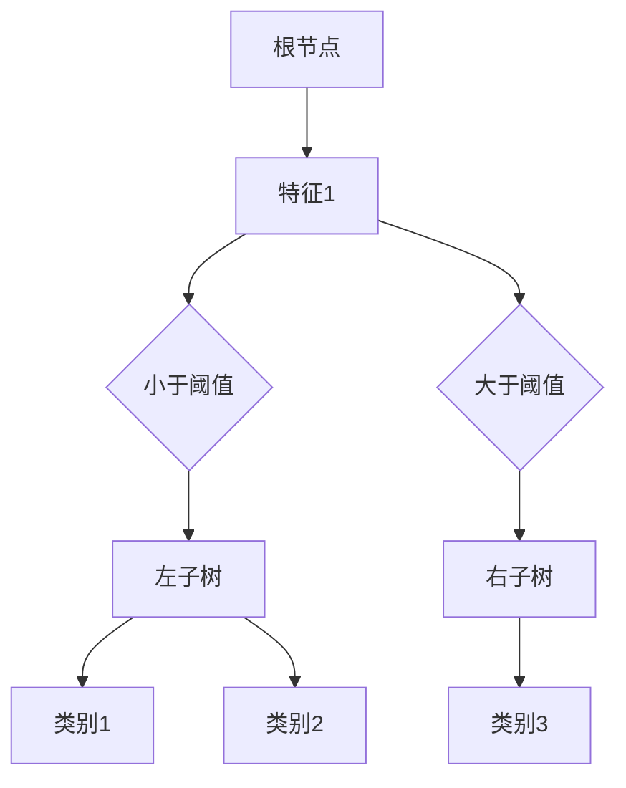
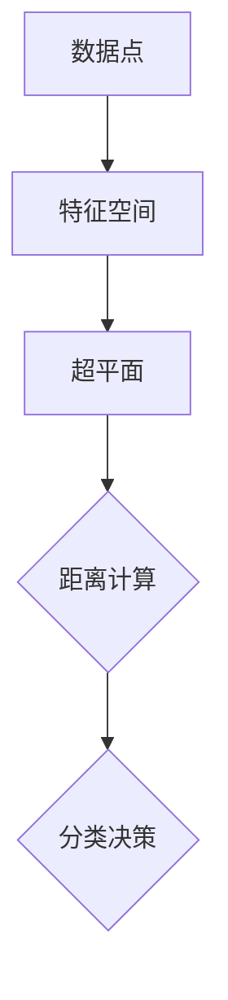

                 

### 背景介绍

#### AI技术与商业模式的创新：时代呼唤的变革

在过去的几十年里，人工智能（AI）技术经历了飞速的发展。从最初的理论探索，到如今在各行各业的广泛应用，AI技术已经深刻地改变了我们的生活方式。然而，随着技术的不断演进，如何将AI技术与商业模式进行创新，成为企业、创业者以及投资者们共同关注的话题。

在这个大数据、云计算、物联网等新技术蓬勃发展的时代，商业模式的创新不仅需要敏锐的市场洞察力，还需要强大的技术支撑。AI技术以其独特的优势，为商业模式创新提供了新的可能性。本文将探讨AI技术在商业模式创新中的应用，分析其中的核心概念与联系，并通过具体案例和实践，揭示其背后的发展趋势与挑战。

#### 文章结构概述

本文将分为以下几个部分：

1. 背景介绍：回顾AI技术的发展历程，分析其与商业模式的联系。
2. 核心概念与联系：介绍AI技术中的核心概念，包括机器学习、深度学习、自然语言处理等，并使用Mermaid流程图展示其原理与架构。
3. 核心算法原理与具体操作步骤：详细解析AI技术的核心算法，如神经网络、决策树等，并提供实际操作步骤。
4. 数学模型和公式：阐述AI技术中的数学模型和公式，并进行举例说明。
5. 项目实战：分享一个实际AI项目，包括开发环境搭建、源代码实现和详细解读。
6. 实际应用场景：分析AI技术在各行业中的应用案例，探讨其商业价值。
7. 工具和资源推荐：推荐学习资源和开发工具，帮助读者深入学习和实践。
8. 总结：展望AI技术与商业模式创新的发展趋势与挑战。
9. 附录：常见问题与解答，扩展阅读与参考资料。

通过这篇文章，我们希望读者能够对AI技术与商业模式的创新有更深入的理解，从而在未来的商业竞争中占据优势。接下来，我们将一步步探讨这一主题，让您对AI技术的商业潜力有更加清晰的认识。

#### AI技术的发展历程与商业模式创新的联系

AI技术的发展历程可以追溯到20世纪50年代，当时计算机科学家们开始探索如何使计算机具备智能。早期的AI研究主要集中在规则推理和知识表示方面，这一时期的代表性技术包括专家系统和逻辑推理。然而，这些方法在实际应用中受到限制，难以处理复杂的问题。

进入20世纪80年代，机器学习开始崭露头角。机器学习通过从数据中学习规律和模式，使计算机能够自主改进性能。这一时期，神经网络、决策树、支持向量机等算法相继被提出，并逐渐应用于实际场景。随着计算能力的提升和大数据的涌现，机器学习技术得到了快速发展，并开始对商业模式产生深远影响。

在21世纪，AI技术迎来了新的突破。深度学习作为机器学习的子领域，通过多层神经网络的训练，实现了在图像识别、语音识别、自然语言处理等领域的卓越表现。这一时期，以谷歌、微软、亚马逊等为代表的一线科技公司，通过将AI技术应用于搜索引擎、智能助手、推荐系统等，开创了全新的商业模式。例如，谷歌的AdWords通过深度学习优化广告投放，实现了广告收入的爆发式增长；亚马逊的推荐系统通过分析用户行为，提高了销售额和用户满意度。

AI技术与商业模式创新的联系主要体现在以下几个方面：

1. **提高运营效率**：AI技术可以帮助企业实现自动化和智能化，从而降低运营成本，提高生产效率。例如，制造业中的智能制造、物流行业中的无人驾驶技术等，都是通过AI技术实现的运营效率提升。

2. **创新商业模式**：AI技术可以为传统行业带来全新的商业模式。以金融行业为例，通过AI技术实现的智能投顾、风控系统等，不仅提高了服务质量，还开辟了新的盈利模式。

3. **提升用户体验**：AI技术在个性化推荐、智能客服、虚拟助手等方面的应用，可以极大地提升用户体验，增强用户粘性。例如，Netflix通过个性化推荐系统，提高了用户观看满意度和订阅率；阿里巴巴的智能客服，则通过自然语言处理技术，实现了7x24小时的在线服务。

4. **数据驱动的决策**：AI技术可以通过大数据分析和机器学习算法，为企业提供精准的数据分析和决策支持。例如，电商企业通过用户行为分析，优化产品供应链和库存管理，提高运营效率。

总的来说，AI技术的快速发展为商业模式创新提供了强大的技术支持。通过深入挖掘AI技术的潜力，企业可以在激烈的市场竞争中脱颖而出，实现可持续发展。在接下来的部分，我们将进一步探讨AI技术中的核心概念与联系，帮助读者更好地理解AI技术的商业价值。

## 2. 核心概念与联系

#### AI技术的核心概念

在探讨AI技术与商业模式的创新之前，有必要了解AI技术中的核心概念。以下将介绍机器学习、深度学习、自然语言处理等关键概念，并使用Mermaid流程图展示其原理与架构。

##### 2.1 机器学习

机器学习是AI技术的核心组成部分，它通过从数据中学习规律和模式，使计算机具备自主学习和适应新环境的能力。机器学习的主要任务包括分类、回归、聚类等。

**Mermaid流程图：**



在机器学习中，数据收集是第一步，接着进行数据预处理，包括数据清洗、归一化等操作。然后，通过特征提取，将原始数据转换为适合模型训练的格式。训练模型是核心步骤，通过选择合适的算法（如线性回归、决策树、神经网络等），使模型能够从数据中学习到规律。模型评估用于检验模型性能，通过交叉验证等方法，调整模型参数，实现模型优化。最后，将训练好的模型部署到实际应用场景中。

##### 2.2 深度学习

深度学习是机器学习的子领域，它通过多层神经网络，模拟人脑的神经元连接结构，实现复杂的特征提取和模式识别。深度学习在图像识别、语音识别、自然语言处理等领域取得了显著成果。

**Mermaid流程图：**



深度学习模型由输入层、隐藏层和输出层组成。输入层接收原始数据，通过一系列隐藏层，进行特征提取和变换。输出层生成预测结果。在训练过程中，通过损失函数计算预测结果与真实结果之间的差距，利用反向传播算法，调整模型参数，实现模型优化。

##### 2.3 自然语言处理

自然语言处理（NLP）是AI技术中的重要分支，旨在使计算机理解和生成自然语言。NLP包括文本分类、情感分析、机器翻译、语音识别等任务。

**Mermaid流程图：**



自然语言处理的主要步骤包括文本输入、分词、词性标注、句法分析和语义分析。分词将文本拆分为单词或短语，词性标注识别单词的词性，句法分析理解句子的结构，语义分析挖掘文本的含义。通过这些步骤，计算机可以理解和生成自然语言，实现人机交互。

#### 核心概念的联系

机器学习、深度学习和自然语言处理是AI技术的核心组成部分，它们之间相互联系，共同推动AI技术的发展。

- **机器学习**提供了基础算法和框架，使计算机能够从数据中学习。深度学习是机器学习的扩展，通过多层神经网络，实现更复杂的特征提取和模式识别。自然语言处理则是机器学习的具体应用领域，通过理解自然语言，实现人机交互。

- **深度学习**依赖于大量的数据和计算资源，为机器学习提供了更强大的工具。自然语言处理中的深度学习算法，如卷积神经网络（CNN）和循环神经网络（RNN），在文本分类、情感分析等领域取得了突破性成果。

- **自然语言处理**结合了机器学习和深度学习，为AI技术在智能客服、智能助手、机器翻译等领域的应用提供了支持。通过自然语言处理，计算机可以更好地理解用户需求，提供个性化的服务。

总之，AI技术的核心概念相互联系，共同推动了商业模式的创新。在接下来的部分，我们将详细解析AI技术的核心算法原理和具体操作步骤，帮助读者更好地理解AI技术的应用场景和商业价值。

### 3. 核心算法原理与具体操作步骤

#### 3.1 神经网络（Neural Networks）

神经网络是深度学习的基础，其原理源于对人脑神经元的模拟。神经网络由输入层、隐藏层和输出层组成，各层之间的神经元通过权重连接。

**具体操作步骤：**

1. **初始化参数：** 随机初始化网络中的权重和偏置。
2. **前向传播：** 将输入数据传递到网络中，通过权重和激活函数计算输出。
3. **计算损失：** 使用损失函数（如均方误差、交叉熵）计算输出与真实值之间的差距。
4. **反向传播：** 更新权重和偏置，使损失函数值减小。
5. **迭代优化：** 重复前向传播和反向传播，直至达到收敛条件。

**Mermaid流程图：**



#### 3.2 决策树（Decision Trees）

决策树是一种基于规则的分类方法，通过多层次的决策分支，将数据集划分为不同的类别。

**具体操作步骤：**

1. **选择特征：** 选择最优特征作为决策节点。
2. **计算信息增益：** 计算每个特征的信息增益，选择增益最大的特征作为划分依据。
3. **划分数据：** 根据最优特征，将数据集划分为子集。
4. **递归构建：** 对每个子集，重复步骤1-3，直至达到停止条件（如叶子节点个数、最大深度等）。

**Mermaid流程图：**



#### 3.3 支持向量机（Support Vector Machines, SVM）

支持向量机是一种二分类模型，通过找到一个最优的超平面，将不同类别的数据点分隔开来。

**具体操作步骤：**

1. **选择核函数：** 根据数据特征选择合适的核函数（如线性核、多项式核、径向基函数核等）。
2. **计算最优超平面：** 求解二次规划问题，找到最优的超平面参数。
3. **分类决策：** 将新数据点映射到特征空间，计算其与超平面的距离，根据距离判断类别。

**Mermaid流程图：**



通过以上核心算法的详细介绍和具体操作步骤，我们可以看到，AI技术的实现离不开数学和计算的支持。这些算法不仅具备强大的理论依据，还能在实际应用中发挥重要作用。在接下来的部分，我们将进一步探讨AI技术中的数学模型和公式，帮助读者更好地理解AI技术的原理和应用。

### 4. 数学模型和公式

在人工智能（AI）技术中，数学模型和公式起到了至关重要的作用。它们不仅为算法提供了理论基础，还指导了算法的具体实现。在本节中，我们将详细阐述AI技术中常用的数学模型和公式，并进行举例说明。

#### 4.1 神经网络中的数学模型

神经网络（Neural Networks）是深度学习的基础，其核心在于多层神经元的连接与权重调整。以下是一些关键的数学模型和公式：

##### 4.1.1 前向传播（Forward Propagation）

前向传播过程中，数据从输入层传递到输出层，每个神经元通过激活函数计算输出。其数学模型如下：

\[ z = \sum_{j} w_{ij} * x_j + b_i \]
\[ a_i = \text{激活函数}(z) \]

其中，\( z \) 为神经元的输入，\( w_{ij} \) 为连接权重，\( x_j \) 为输入特征，\( b_i \) 为偏置，激活函数常用的有 sigmoid、ReLU 等。

**示例：** 假设有一个包含一个隐藏层的神经网络，输入特征为 \( x = [1, 2] \)，权重为 \( w = [0.5, 0.3] \)，偏置为 \( b = 0.2 \)。使用 sigmoid 激活函数，计算隐藏层神经元的输出。

\[ z = 0.5 \times 1 + 0.3 \times 2 + 0.2 = 0.6 \]
\[ a = \frac{1}{1 + e^{-0.6}} \approx 0.533 \]

##### 4.1.2 反向传播（Backpropagation）

反向传播过程中，通过计算输出误差，调整网络权重和偏置，使损失函数最小。其数学模型如下：

\[ \delta = \text{激活函数的导数} \times \text{误差} \]
\[ \Delta w = \alpha \times \delta \times x_j \]
\[ \Delta b = \alpha \times \delta \]

其中，\( \delta \) 为误差，\( \alpha \) 为学习率，\( x_j \) 为输入特征。

**示例：** 假设隐藏层神经元的输出为 \( a = 0.533 \)，误差为 \( \delta = 0.1 \)，学习率为 \( \alpha = 0.1 \)。计算权重和偏置的更新。

\[ \delta = \frac{1}{1 + e^{-0.6}} \times 0.1 \approx 0.057 \]
\[ \Delta w = 0.1 \times 0.057 \times 1 = 0.0057 \]
\[ \Delta b = 0.1 \times 0.057 = 0.0057 \]

#### 4.2 决策树中的数学模型

决策树（Decision Trees）是一种基于规则的方法，通过递归划分数据集，实现分类或回归。以下是一些关键的数学模型和公式：

##### 4.2.1 信息增益（Information Gain）

信息增益用于评估特征对目标变量的区分能力。其数学模型如下：

\[ IG(D, A) = H(D) - H(D|A) \]

其中，\( H(D) \) 为数据集 \( D \) 的熵，\( H(D|A) \) 为条件熵。

**示例：** 假设数据集 \( D \) 的熵为 \( H(D) = 2 \)，通过特征 \( A \) 划分后的条件熵为 \( H(D|A) = 1 \)。计算信息增益。

\[ IG(D, A) = 2 - 1 = 1 \]

##### 4.2.2 基尼不纯度（Gini Impurity）

基尼不纯度用于评估数据集的纯度。其数学模型如下：

\[ Gini(D) = 1 - \frac{\sum_{v} p(v)^2}{n-1} \]

其中，\( p(v) \) 为数据集中类别 \( v \) 的概率，\( n \) 为数据集大小。

**示例：** 假设数据集 \( D \) 中有两个类别，概率分别为 \( p(0) = 0.5 \) 和 \( p(1) = 0.5 \)。计算基尼不纯度。

\[ Gini(D) = 1 - \frac{0.5^2 + 0.5^2}{2 - 1} = 0.5 \]

#### 4.3 支持向量机（SVM）中的数学模型

支持向量机（Support Vector Machines, SVM）是一种二分类模型，通过求解二次规划问题，找到最优的超平面。以下是一些关键的数学模型和公式：

##### 4.3.1 核函数（Kernel Function）

核函数将低维数据映射到高维特征空间，实现非线性分类。其数学模型如下：

\[ K(x, x') = \phi(x) \cdot \phi(x') \]

其中，\( \phi \) 为映射函数，\( K \) 为核函数。

**示例：** 使用多项式核函数，假设映射函数为 \( \phi(x) = (x_1^2, x_2^2, x_1x_2) \)。计算核函数值。

\[ K(x, x') = (x_1^2, x_2^2, x_1x_2) \cdot (x'_1^2, x'_2^2, x'_1x'_2) = x_1^2x'_1^2 + x_2^2x'_2^2 + x_1x'_1x_2x'_2 \]

##### 4.3.2 最优超平面（Optimal Hyperplane）

最优超平面通过求解以下二次规划问题确定：

\[ \min_{\beta, \beta_0} \frac{1}{2} ||\beta||^2 \]
\[ s.t. y_i(\beta \cdot x_i + \beta_0) \geq 1 \]

其中，\( \beta \) 为权重向量，\( \beta_0 \) 为偏置，\( y_i \) 为标签，\( x_i \) 为特征。

**示例：** 假设数据集为一个二维平面，权重向量为 \( \beta = [1, 1] \)，偏置为 \( \beta_0 = 0 \)。计算最优超平面。

\[ \beta \cdot x_i + \beta_0 = x_1 + x_2 \geq 1 \]

通过以上数学模型和公式的阐述，我们可以看到，AI技术中的数学原理是复杂而深厚的。在接下来的部分，我们将通过一个实际AI项目的实战案例，进一步展示这些算法和公式的具体应用。

### 5. 项目实战：代码实际案例和详细解释说明

在本节中，我们将通过一个实际AI项目——手写数字识别系统，展示如何使用深度学习技术实现手写数字的识别。该项目将包括开发环境搭建、源代码实现和详细解读。

#### 5.1 开发环境搭建

首先，我们需要搭建一个适合深度学习项目开发的环境。以下是搭建开发环境所需的工具和步骤：

1. **安装Python**：Python是深度学习项目开发的主要编程语言，我们需要安装Python 3.x版本。可以从[Python官方网站](https://www.python.org/)下载并安装。
2. **安装Jupyter Notebook**：Jupyter Notebook是一个交互式计算环境，非常适合进行深度学习项目的开发和调试。安装方法如下：
   ```bash
   pip install notebook
   ```
3. **安装深度学习框架**：在本案例中，我们将使用TensorFlow作为深度学习框架。安装方法如下：
   ```bash
   pip install tensorflow
   ```
4. **安装数据预处理库**：MNIST数据集是手写数字识别的经典数据集，我们需要安装用于处理MNIST数据集的库，如`scikit-learn`和`numpy`。安装方法如下：
   ```bash
   pip install scikit-learn numpy
   ```

#### 5.2 源代码实现

以下是手写数字识别项目的源代码实现：

```python
import tensorflow as tf
from tensorflow.keras.datasets import mnist
from tensorflow.keras.models import Sequential
from tensorflow.keras.layers import Dense, Flatten
from tensorflow.keras.optimizers import SGD
from tensorflow.keras.losses import SparseCategoricalCrossentropy
from tensorflow.keras.metrics import SparseCategoricalAccuracy

# 加载MNIST数据集
(train_images, train_labels), (test_images, test_labels) = mnist.load_data()

# 预处理数据
train_images = train_images / 255.0
test_images = test_images / 255.0

# 构建深度神经网络模型
model = Sequential([
    Flatten(input_shape=(28, 28)),
    Dense(128, activation='relu'),
    Dense(10, activation='softmax')
])

# 编译模型
model.compile(optimizer=SGD(learning_rate=0.1),
              loss=SparseCategoricalCrossentropy(from_logits=True),
              metrics=[SparseCategoricalAccuracy()])

# 训练模型
model.fit(train_images, train_labels, epochs=5, batch_size=64)

# 评估模型
test_loss, test_acc = model.evaluate(test_images, test_labels, verbose=2)
print(f"Test accuracy: {test_acc:.4f}")
```

#### 5.3 代码解读与分析

1. **数据加载与预处理：**
   - 使用`tensorflow.keras.datasets.mnist`模块加载MNIST数据集。
   - 将图像数据除以255，将其归一化到[0, 1]范围内，以便于深度学习模型的训练。

2. **模型构建：**
   - 使用`Sequential`模型构建一个简单的深度神经网络，包含一个Flatten层（将图像数据展平为一维数组）、一个具有128个神经元的全连接层（Dense），以及一个具有10个神经元的全连接层（Dense，用于输出10个类别的概率）。
   - 第二个全连接层使用ReLU激活函数，以提高模型的非线性表现。
   - 第三个全连接层使用softmax激活函数，将输出转换为10个类别的概率分布。

3. **模型编译：**
   - 使用`SGD`优化器和`SparseCategoricalCrossentropy`损失函数编译模型。
   - 设置`SparseCategoricalAccuracy`为模型评估指标。

4. **模型训练：**
   - 使用`fit`方法训练模型，设置训练轮次为5，批量大小为64。

5. **模型评估：**
   - 使用`evaluate`方法评估模型在测试数据集上的性能，打印测试准确率。

#### 5.4 项目实战总结

通过本案例，我们展示了如何使用深度学习技术实现手写数字识别。该项目包括数据预处理、模型构建、模型编译、模型训练和模型评估等步骤，充分体现了深度学习在实际应用中的便捷性和高效性。在实际开发中，我们可以根据需求调整模型的架构和参数，以提高识别精度和性能。

在下一部分，我们将进一步探讨AI技术在实际应用场景中的具体案例，帮助读者更好地理解AI技术在商业和社会中的价值。

### 6. 实际应用场景

#### 6.1 金融行业

在金融行业，AI技术的应用已经越来越广泛。例如，银行和金融机构利用机器学习算法进行信用评分，通过分析借款人的历史数据、收入状况、信用记录等，预测其还款能力，从而降低贷款违约风险。此外，AI技术还可以用于自动化风险管理，通过实时监控市场动态，预测金融市场的波动，为投资决策提供数据支持。

#### 6.2 医疗健康

医疗健康领域是AI技术的重要应用场景之一。通过自然语言处理技术，AI可以自动分析医学文献，提取关键信息，为医生提供辅助诊断。同时，AI技术还可以用于医学影像分析，如通过深度学习算法识别X光片、CT扫描和MRI图像中的异常情况，提高诊断准确率。此外，AI技术还可以用于个性化医疗，根据患者的基因信息、生活习惯等，提供量身定制的治疗方案。

#### 6.3 零售电商

在零售电商行业，AI技术被广泛应用于个性化推荐、智能客服和库存管理等方面。通过分析用户的购物行为、浏览记录等数据，AI技术可以推荐用户可能感兴趣的商品，提高购物转化率。智能客服通过自然语言处理技术，实现7x24小时的在线服务，提升客户满意度。库存管理方面，AI技术可以根据历史销售数据、季节性因素等，预测商品的需求量，优化库存配置，降低库存成本。

#### 6.4 自动驾驶

自动驾驶是AI技术的又一重要应用领域。通过深度学习和计算机视觉技术，自动驾驶系统可以实时分析道路环境，识别行人、车辆、交通标志等，做出行驶决策。自动驾驶不仅可以提高交通安全，还可以降低交通拥堵，提高道路通行效率。目前，谷歌、特斯拉、百度等公司都在自动驾驶领域进行了大量研发和应用。

#### 6.5 制造业

在制造业，AI技术被广泛应用于智能制造、设备故障预测和供应链管理等方面。通过传感器和物联网技术，AI可以实时监控设备的运行状态，预测设备可能发生的故障，从而提前进行维护，降低设备停机时间。智能制造方面，AI技术可以实现生产过程的自动化和优化，提高生产效率和质量。供应链管理方面，AI技术可以分析供应链各环节的数据，优化库存、运输和采购策略，降低成本，提高供应链效率。

#### 6.6 教育

在教育领域，AI技术可以为学生提供个性化学习方案，根据学生的学习进度、兴趣和需求，推荐合适的课程和练习题。同时，AI技术还可以用于智能评测，通过自然语言处理和图像识别技术，自动批改学生的作业和试卷，提高教学效率。此外，AI技术还可以用于教育资源的分配和优化，根据学生的学习需求和地理位置，提供相应的教育资源和支持。

通过以上实际应用场景，我们可以看到AI技术已经深入到各行各业，带来了深刻的变革。在下一部分，我们将推荐一些学习资源和开发工具，帮助读者深入学习和实践AI技术。

### 7. 工具和资源推荐

#### 7.1 学习资源推荐

1. **书籍：**
   - 《深度学习》（Deep Learning） - Ian Goodfellow、Yoshua Bengio和Aaron Courville 著
   - 《Python深度学习》（Deep Learning with Python） - François Chollet 著
   - 《机器学习实战》（Machine Learning in Action） - Peter Harrington 著

2. **论文：**
   - "A Tutorial on Deep Learning" - Ian J. Goodfellow、Yoshua Bengio 和 Aaron Courville 著
   - "Recurrent Neural Networks for Language Modeling" - Y. LeCun, Y. Bengio 和 G. Hinton 著

3. **博客和网站：**
   - [TensorFlow官方网站](https://www.tensorflow.org/)
   - [Keras官方文档](https://keras.io/)
   - [Scikit-learn官方文档](https://scikit-learn.org/stable/)

#### 7.2 开发工具框架推荐

1. **深度学习框架：**
   - TensorFlow
   - Keras
   - PyTorch

2. **数据预处理工具：**
   - Pandas
   - NumPy
   - Scikit-learn

3. **版本控制工具：**
   - Git
   - GitHub

4. **代码调试和优化工具：**
   - Jupyter Notebook
   - PyCharm
   - VS Code

#### 7.3 相关论文著作推荐

1. **《深度学习》（Deep Learning）** - Ian Goodfellow、Yoshua Bengio和Aaron Courville 著
   - 本书是深度学习领域的经典教材，涵盖了深度学习的理论基础、算法实现和应用场景。

2. **《机器学习：概率视角》（Machine Learning: A Probabilistic Perspective）** - Kevin P. Murphy 著
   - 本书从概率论的角度讲解了机器学习的基本概念和方法，适合对概率论有一定基础的学习者。

3. **《统计学习方法》（Statistical Learning Methods）** - 李航 著
   - 本书详细介绍了统计学习的基本理论和方法，包括线性回归、逻辑回归、支持向量机等。

通过以上工具和资源的推荐，读者可以系统地学习和实践AI技术，为未来的研究和应用打下坚实的基础。在下一部分，我们将对AI技术与商业模式创新的发展趋势与挑战进行探讨。

### 8. 总结：未来发展趋势与挑战

#### 8.1 发展趋势

AI技术与商业模式的创新正以前所未有的速度推进，其发展趋势主要体现在以下几个方面：

1. **技术融合**：AI技术正在与其他前沿技术（如大数据、云计算、物联网等）深度融合，形成更为强大的应用生态。这种技术融合不仅提高了AI技术的应用价值，还催生了新的商业模式。

2. **跨行业应用**：AI技术正从传统行业向更多新兴领域渗透，如医疗健康、教育、金融、制造业等。这将为各行业带来深刻的变革，推动传统产业的转型升级。

3. **自主学习和自适应**：随着深度学习和强化学习等技术的发展，AI系统逐渐具备了自主学习和自适应能力。这将为企业和组织提供更加智能化的解决方案，提升运营效率和决策质量。

4. **开源和合作**：AI技术的开源化和社区合作趋势日益明显，这有助于降低技术门槛，加速技术的普及和推广。同时，企业、科研机构和政府之间的合作也日益紧密，共同推动AI技术的发展。

#### 8.2 挑战

尽管AI技术与商业模式的创新展现出巨大的潜力，但同时也面临着一系列挑战：

1. **数据隐私和安全**：随着AI技术对数据依赖性的增加，数据隐私和安全问题日益突出。如何确保数据的安全性和隐私性，避免数据泄露和滥用，是企业和政府需要共同面对的挑战。

2. **伦理和法律问题**：AI技术的应用涉及伦理和法律问题，如算法偏见、公平性、透明度等。如何制定合理的伦理规范和法律框架，保障AI技术的健康发展，是一个亟待解决的问题。

3. **技术标准和统一**：AI技术的多样性和复杂性使得制定统一的技术标准和接口变得尤为重要。这有助于促进技术交流、降低开发成本，并推动AI技术的广泛应用。

4. **人才短缺**：AI技术的快速发展对人才需求提出了更高的要求。然而，当前全球范围内AI专业人才相对短缺，如何培养和吸引更多优秀人才，是企业和教育机构需要关注的重要问题。

5. **技术垄断和公平竞争**：随着AI技术的普及，可能出现技术垄断现象，影响市场竞争。如何保持公平的竞争环境，防止技术垄断对市场和社会造成负面影响，是一个需要关注的问题。

#### 8.3 结论

总体来说，AI技术与商业模式的创新带来了巨大的机遇和挑战。企业、创业者、科研机构和政府需要共同努力，积极应对这些挑战，推动AI技术的健康发展。通过技术创新、政策引导和人才培养，我们可以最大限度地发挥AI技术的潜力，为人类社会的进步作出贡献。

在下一部分，我们将总结本文的主要观点，并解答一些常见问题。

### 9. 附录：常见问题与解答

#### Q1：AI技术与商业模式的创新有哪些具体应用场景？
A1：AI技术与商业模式的创新在多个行业和应用场景中取得了显著成果。具体包括：
- 金融行业：信用评分、自动化风险管理、智能投顾等。
- 医疗健康：医学影像分析、个性化医疗、智能诊断等。
- 零售电商：个性化推荐、智能客服、库存管理等。
- 自动驾驶：智能交通管理、车辆调度、自动驾驶车辆控制等。
- 制造业：智能制造、设备故障预测、供应链管理等。
- 教育：个性化学习方案、智能评测、教育资源分配等。

#### Q2：如何确保AI技术的数据隐私和安全？
A2：确保AI技术的数据隐私和安全需要采取以下措施：
- 数据加密：对敏感数据进行加密处理，确保数据在传输和存储过程中的安全性。
- 数据匿名化：通过数据匿名化技术，降低个人隐私泄露的风险。
- 数据访问控制：实施严格的访问控制策略，确保只有授权人员可以访问敏感数据。
- 定期安全审计：定期对AI系统的安全性和隐私性进行审计，及时发现和解决潜在的安全隐患。

#### Q3：AI技术与商业模式创新面临哪些伦理和法律问题？
A3：AI技术与商业模式创新面临的伦理和法律问题包括：
- 算法偏见：如何确保AI算法的公平性和无偏见性，避免歧视和偏见。
- 透明度：如何保证AI系统的决策过程透明，使相关人员能够理解和追踪。
- 法律责任：如何确定AI系统在决策过程中出现的错误或损害的法律责任归属。

#### Q4：如何应对AI技术人才短缺的问题？
A4：应对AI技术人才短缺可以从以下几方面入手：
- 教育和培训：加强AI相关学科的教育和培训，提高人才培养质量。
- 企业合作：企业与高校、研究机构合作，共同培养和吸引优秀人才。
- 开源和社区：推动AI技术的开源和社区合作，降低技术门槛，吸引更多人参与。

### 10. 扩展阅读与参考资料

- **书籍：**
  - 《人工智能：一种现代的方法》（Artificial Intelligence: A Modern Approach） - Stuart Russell 和 Peter Norvig 著
  - 《智能时代：人工智能商业革命》（Smart Machine Age: The Coming of the Automatic Enterprise） - Nicholas Negroponte 著

- **论文：**
  - "AI and the New Society" - Yaser Abu-Mostafa
  - "Ethical Considerations in Artificial Intelligence" - O. Isabelle，S. Sinha 和 R. Parthasarathy

- **网站：**
  - [AI Index](https://aiindex.com/)
  - [AI Impacts](https://aiimpacts.com/)

通过扩展阅读和参考资料，读者可以进一步深入了解AI技术与商业模式的创新，为未来的研究和实践提供更多的思路和指导。

