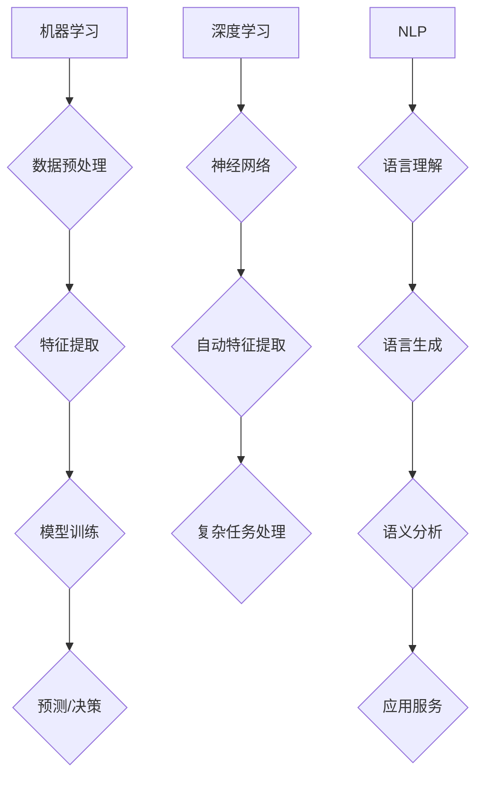

                 

# AI技术在企业中的发展

## 摘要

本文旨在探讨AI技术在企业中的应用与发展。首先，我们将介绍AI技术在企业中的背景与重要性，然后深入分析核心概念和架构，以及AI技术的具体算法原理和数学模型。接着，我们将通过实际项目案例，展示AI技术在企业中的具体应用和实践步骤。随后，我们将探讨AI技术在企业中的实际应用场景，并推荐相关的工具和资源。最后，我们将总结AI技术在未来企业中的发展趋势和面临的挑战，并提出一些常见问题的解答。

## 背景介绍

随着大数据、云计算和物联网等技术的快速发展，企业数据量呈指数级增长。如何从海量数据中提取有价值的信息，实现智能化决策和业务创新，成为企业亟需解决的问题。AI技术的出现为企业提供了强有力的支持，它能够通过机器学习、深度学习、自然语言处理等算法，自动识别数据中的模式，预测未来趋势，为企业提供智能化的解决方案。

在企业中，AI技术的应用不仅限于数据分析，还包括生产自动化、供应链优化、客户服务等多个领域。例如，通过机器学习算法，企业可以实现对生产设备的实时监控和故障预测，提高生产效率；通过自然语言处理技术，企业可以提供更加智能化和个性化的客户服务，提升客户满意度。

此外，随着5G网络的普及和物联网技术的发展，企业将面临更加复杂的业务场景和挑战。AI技术将成为企业应对这些挑战的重要工具，它能够帮助企业实现业务流程的自动化，提高运营效率，降低成本，创造更大的商业价值。

总之，AI技术在企业中的应用不仅能够提升企业的核心竞争力，还能够推动企业实现数字化转型，为企业的发展提供新的动力。

## 核心概念与联系

要深入探讨AI技术在企业中的应用，首先需要理解一些核心概念，包括机器学习、深度学习、自然语言处理等。以下是这些核心概念的简要介绍及其在企业中的应用。

### 1. 机器学习

机器学习（Machine Learning）是一种人工智能的分支，它通过算法从数据中学习，识别数据中的模式并作出预测或决策。在企业中，机器学习广泛应用于数据分析和预测。例如，企业可以利用机器学习算法对销售数据进行分析，预测未来的销售趋势，从而优化库存管理和供应链规划。

### 2. 深度学习

深度学习（Deep Learning）是机器学习的一种方法，它使用神经网络模拟人脑的神经元结构，通过多层非线性变换提取数据中的特征。深度学习在企业中的应用非常广泛，包括图像识别、语音识别和文本分析等。例如，企业可以利用深度学习算法开发图像识别系统，自动识别生产线上的缺陷产品，提高生产质量。

### 3. 自然语言处理

自然语言处理（Natural Language Processing，NLP）是AI技术的一个重要分支，它使计算机能够理解和处理自然语言。在企业中，NLP技术广泛应用于客户服务、文本分析和语义搜索等领域。例如，企业可以利用NLP技术构建智能客服系统，自动回答客户的常见问题，提高客户满意度。

### 4. 机器学习与深度学习的联系

机器学习和深度学习是密切相关的。深度学习是机器学习的一种特殊形式，它通过复杂的神经网络模型实现数据的自动特征提取。在实际应用中，深度学习通常在机器学习的基础上，能够处理更加复杂的任务，例如图像和语音识别。

### 5. 自然语言处理与机器学习的联系

自然语言处理依赖于机器学习算法，特别是深度学习算法。NLP技术通过机器学习模型来理解和生成自然语言，从而实现语言识别、翻译和情感分析等任务。

### 6. 核心概念与企业应用的 Mermaid 流程图

以下是核心概念在企业应用中的 Mermaid 流程图：



通过上述流程图，我们可以清晰地看到机器学习、深度学习和NLP在企业应用中的相互联系和作用。

### 核心算法原理 & 具体操作步骤

在了解了AI技术的基本概念和联系后，我们接下来将深入探讨核心算法原理，包括机器学习、深度学习和自然语言处理的算法原理，并介绍其具体的操作步骤。

#### 1. 机器学习算法原理

机器学习算法的基本原理是通过学习已有的数据来预测新的数据。在机器学习过程中，通常包括以下步骤：

- **数据收集与预处理**：收集相关数据，并对数据进行清洗、归一化和缺失值处理，以确保数据的质量和一致性。
- **特征提取**：从原始数据中提取有价值的特征，用于训练模型。
- **模型训练**：使用训练数据集对模型进行训练，通过调整模型参数，使其能够正确预测未知数据。
- **模型评估与优化**：使用测试数据集对模型进行评估，通过调整模型参数，优化模型性能。

常见的机器学习算法包括线性回归、逻辑回归、支持向量机（SVM）、决策树和随机森林等。以下是线性回归算法的具体操作步骤：

- **数据收集与预处理**：收集一组数据，包含自变量（X）和因变量（Y）。例如，收集房价数据，其中X为房屋面积，Y为房价。
- **特征提取**：无需进一步特征提取，直接使用原始数据。
- **模型训练**：定义线性回归模型，使用训练数据集进行模型训练，计算模型参数（斜率和截距）。
- **模型评估与优化**：使用测试数据集对模型进行评估，通过计算均方误差（MSE）等指标，优化模型参数。

线性回归模型可以用以下公式表示：

$$ Y = wx + b $$

其中，\( w \) 为斜率，\( b \) 为截距。

#### 2. 深度学习算法原理

深度学习算法的核心是神经网络，特别是多层感知器（MLP）和卷积神经网络（CNN）。

- **多层感知器（MLP）**：MLP是一种前馈神经网络，它通过多个隐层对输入数据进行特征提取和变换。MLP的基本原理是输入数据经过一系列的线性变换和激活函数，最终输出预测结果。

  以下是MLP的具体操作步骤：

  - **输入层**：接收输入数据。
  - **隐层**：对输入数据进行线性变换和激活函数处理。
  - **输出层**：输出预测结果。

  MLP可以使用以下公式表示：

  $$ a_{i}^{(l)} = \sigma(z_{i}^{(l)}) $$

  $$ z_{i}^{(l)} = \sum_{j} w_{ji}^{(l)} a_{j}^{(l-1)} + b_{i}^{(l)} $$

  其中，\( a_{i}^{(l)} \) 为隐层 \( l \) 的第 \( i \) 个神经元输出，\( z_{i}^{(l)} \) 为隐层 \( l \) 的第 \( i \) 个神经元输入，\( \sigma \) 为激活函数，\( w_{ji}^{(l)} \) 和 \( b_{i}^{(l)} \) 分别为权重和偏置。

- **卷积神经网络（CNN）**：CNN是一种专门用于图像识别的神经网络，它通过卷积操作提取图像中的特征。

  以下是CNN的具体操作步骤：

  - **卷积层**：使用卷积核在输入图像上滑动，提取图像中的局部特征。
  - **激活函数**：对卷积层输出应用激活函数，增加网络的非线性。
  - **池化层**：对卷积层输出进行池化操作，减少参数数量，提高模型泛化能力。
  - **全连接层**：将池化层输出转换为向量，输入到全连接层进行分类。

  CNN可以使用以下公式表示：

  $$ h_{ij}^{(l)} = f(z_{ij}^{(l)}) $$

  $$ z_{ij}^{(l)} = \sum_{k} w_{ik}^{(l)} h_{kj}^{(l-1)} + b_{j}^{(l)} $$

  其中，\( h_{ij}^{(l)} \) 为卷积层 \( l \) 的第 \( i \) 行第 \( j \) 列输出，\( z_{ij}^{(l)} \) 为卷积层 \( l \) 的第 \( i \) 行第 \( j \) 列输入，\( f \) 为激活函数，\( w_{ik}^{(l)} \) 和 \( b_{j}^{(l)} \) 分别为权重和偏置。

#### 3. 自然语言处理算法原理

自然语言处理算法的核心是序列模型和注意力机制。

- **序列模型**：序列模型是一种用于处理文本序列的神经网络模型，它通过将文本序列转换为向量，然后进行分类或回归。

  以下是序列模型的具体操作步骤：

  - **嵌入层**：将文本中的单词转换为向量表示。
  - **编码器**：将嵌入层输出编码为固定长度的向量。
  - **解码器**：将编码器输出解码为文本序列。

  序列模型可以使用以下公式表示：

  $$ e_{t} = \text{Embed}(w_t) $$

  $$ h_t = \text{Encoder}(e_t) $$

  $$ p_t = \text{Decoder}(h_t) $$

  其中，\( e_{t} \) 为第 \( t \) 个单词的嵌入向量，\( h_t \) 为编码器输出，\( p_t \) 为解码器输出。

- **注意力机制**：注意力机制是一种用于提高模型序列处理能力的机制，它通过动态调整模型对序列中不同部分的关注程度。

  以下是注意力机制的具体操作步骤：

  - **计算注意力权重**：对编码器输出应用注意力机制，计算注意力权重。
  - **加权求和**：将注意力权重与编码器输出进行加权求和，得到最终的序列表示。

  注意力机制可以使用以下公式表示：

  $$ a_t = \text{Attention}(h_t, h_s) $$

  $$ s_t = \sum_{i} a_{it} h_{is} $$

  其中，\( a_t \) 为注意力权重，\( s_t \) 为加权求和结果。

通过以上对核心算法原理的介绍，我们可以看到机器学习、深度学习和自然语言处理在企业中的应用前景非常广阔。在实际应用中，企业可以根据自身的需求，选择合适的算法和技术，实现业务流程的自动化和智能化。

### 数学模型和公式 & 详细讲解 & 举例说明

在了解了AI技术的核心算法原理后，接下来我们将深入探讨相关的数学模型和公式，并通过具体例子进行详细讲解，以便读者能够更好地理解和应用这些数学模型。

#### 1. 线性回归模型

线性回归模型是最基本的机器学习模型之一，它通过建立自变量和因变量之间的线性关系来预测新的数据。线性回归模型可以用以下数学公式表示：

$$ Y = wx + b $$

其中，\( w \) 是斜率，表示自变量对因变量的影响程度；\( b \) 是截距，表示当自变量为零时，因变量的值；\( x \) 是自变量，\( y \) 是因变量。

**例子**：假设我们要预测一个房屋的价格，其中房屋面积（\( x \)）是自变量，房屋价格（\( y \)）是因变量。我们可以收集一组数据，然后使用线性回归模型来预测新的房屋价格。

**具体步骤**：

- 数据收集：收集一组房屋面积和对应的价格数据。
- 数据预处理：对数据进行归一化处理，使数据具有相同的量纲。
- 特征提取：无需特征提取，直接使用原始数据。
- 模型训练：使用训练数据集训练线性回归模型，计算斜率和截距。
- 模型评估：使用测试数据集评估模型性能，计算均方误差（MSE）。

**计算过程**：

假设我们有以下数据：

| 房屋面积（\( x \)） | 房屋价格（\( y \)） |
| :-------------: | :-------------: |
| 1000 | 500000 |
| 1200 | 600000 |
| 1500 | 750000 |

我们可以通过以下公式计算斜率 \( w \) 和截距 \( b \)：

$$ w = \frac{\sum_{i=1}^{n} (x_i - \bar{x})(y_i - \bar{y})}{\sum_{i=1}^{n} (x_i - \bar{x})^2} $$

$$ b = \bar{y} - w\bar{x} $$

其中，\( n \) 是数据点的个数，\( \bar{x} \) 和 \( \bar{y} \) 分别是自变量和因变量的平均值。

计算结果如下：

$$ w = \frac{(1000-1057.14)(500000-651428.57) + (1200-1057.14)(600000-651428.57) + (1500-1057.14)(750000-651428.57)}{(1000-1057.14)^2 + (1200-1057.14)^2 + (1500-1057.14)^2} $$

$$ w = 0.44 $$

$$ b = 651428.57 - 0.44 \times 1057.14 = 585595.43 $$

因此，线性回归模型可以表示为：

$$ y = 0.44x + 585595.43 $$

我们可以使用这个模型来预测新的房屋价格。例如，当房屋面积为 1300 平方米时，预测的房屋价格为：

$$ y = 0.44 \times 1300 + 585595.43 = 682196.43 $$

#### 2. 卷积神经网络（CNN）

卷积神经网络（CNN）是一种用于图像识别和处理的深度学习模型。CNN 通过卷积操作和池化操作提取图像中的特征，然后通过全连接层进行分类。

**数学模型**：

CNN 的主要数学模型包括卷积操作、激活函数、池化操作和全连接层。

- **卷积操作**：

  卷积操作可以用以下数学公式表示：

  $$ h_{ij}^{(l)} = \sum_{k} w_{ik}^{(l)} f(g_{kj}^{(l-1)}) + b_{j}^{(l)} $$

  其中，\( h_{ij}^{(l)} \) 是卷积层 \( l \) 的第 \( i \) 行第 \( j \) 列输出，\( g_{kj}^{(l-1)} \) 是卷积层 \( l-1 \) 的第 \( k \) 行第 \( j \) 列输入，\( w_{ik}^{(l)} \) 和 \( b_{j}^{(l)} \) 分别是卷积核和偏置。

- **激活函数**：

  激活函数可以用以下数学公式表示：

  $$ a_{ij}^{(l)} = \sigma(h_{ij}^{(l)}) $$

  其中，\( a_{ij}^{(l)} \) 是激活函数的输出，\( \sigma \) 是激活函数。

- **池化操作**：

  池化操作可以用以下数学公式表示：

  $$ p_{ij}^{(l)} = \text{Pooling}(a_{ij}^{(l)}) $$

  其中，\( p_{ij}^{(l)} \) 是池化操作的输出，\( \text{Pooling} \) 是池化操作。

- **全连接层**：

  全连接层可以用以下数学公式表示：

  $$ z_{i}^{(L)} = \sum_{j} w_{ij}^{(L)} a_{j}^{(L-1)} + b_{i}^{(L)} $$

  $$ a_{i}^{(L)} = \sigma(z_{i}^{(L)}) $$

  其中，\( z_{i}^{(L)} \) 是全连接层的输入，\( a_{i}^{(L)} \) 是全连接层的输出，\( w_{ij}^{(L)} \) 和 \( b_{i}^{(L)} \) 分别是权重和偏置。

**例子**：假设我们要使用 CNN 模型识别一张手写数字图片，可以使用以下步骤：

- 数据收集：收集一组手写数字图片，并将其转换为灰度图像。
- 数据预处理：对图像进行归一化处理，使其具有相同的像素值范围。
- 模型训练：使用训练数据集训练 CNN 模型，调整模型参数。
- 模型评估：使用测试数据集评估模型性能，计算准确率。

**具体步骤**：

1. **卷积层**：

   使用卷积核在图像上滑动，提取图像中的局部特征。例如，使用 3x3 的卷积核提取边缘特征。

2. **激活函数**：

   对卷积层输出应用 ReLU 激活函数，增加网络的非线性。

3. **池化层**：

   对卷积层输出应用池化操作，减少参数数量，提高模型泛化能力。

4. **全连接层**：

   将池化层输出转换为向量，输入到全连接层进行分类。

**计算过程**：

假设我们有一个 32x32 的灰度图像，使用 3x3 的卷积核提取边缘特征。卷积操作可以表示为：

$$ h_{ij}^{(1)} = \sum_{k} w_{ik}^{(1)} g_{kj}^{(1-1)} + b_{j}^{(1)} $$

其中，\( g_{kj}^{(1-1)} \) 是输入图像的像素值，\( w_{ik}^{(1)} \) 和 \( b_{j}^{(1)} \) 分别是卷积核和偏置。

使用 ReLU 激活函数，输出可以表示为：

$$ a_{ij}^{(1)} = \max(0, h_{ij}^{(1)}) $$

池化操作可以表示为：

$$ p_{ij}^{(1)} = \text{Pooling}(a_{ij}^{(1)}) $$

将池化层输出输入到全连接层，分类可以表示为：

$$ z_{i}^{(2)} = \sum_{j} w_{ij}^{(2)} p_{j}^{(1)} + b_{i}^{(2)} $$

$$ a_{i}^{(2)} = \sigma(z_{i}^{(2)}) $$

其中，\( w_{ij}^{(2)} \) 和 \( b_{i}^{(2)} \) 分别是全连接层权重和偏置。

通过以上步骤，我们可以使用 CNN 模型对手写数字图片进行识别。

#### 3. 自然语言处理（NLP）模型

自然语言处理（NLP）模型是一种用于处理文本数据的深度学习模型。NLP 模型通过将文本转换为向量表示，然后进行分类或回归。

**数学模型**：

NLP 模型的主要数学模型包括嵌入层、编码器、解码器和注意力机制。

- **嵌入层**：

  嵌入层将文本中的单词转换为向量表示。单词嵌入可以用以下数学公式表示：

  $$ e_{t} = \text{Embed}(w_t) $$

  其中，\( e_{t} \) 是第 \( t \) 个单词的嵌入向量，\( w_t \) 是单词的词向量。

- **编码器**：

  编码器将嵌入层输出编码为固定长度的向量。编码器可以用以下数学公式表示：

  $$ h_t = \text{Encoder}(e_t) $$

  其中，\( h_t \) 是编码器输出。

- **解码器**：

  解码器将编码器输出解码为文本序列。解码器可以用以下数学公式表示：

  $$ p_t = \text{Decoder}(h_t) $$

  其中，\( p_t \) 是解码器输出。

- **注意力机制**：

  注意力机制是一种用于提高模型序列处理能力的机制。注意力权重可以用以下数学公式表示：

  $$ a_t = \text{Attention}(h_t, h_s) $$

  $$ s_t = \sum_{i} a_{it} h_{is} $$

  其中，\( a_t \) 是注意力权重，\( s_t \) 是加权求和结果。

**例子**：假设我们要使用 NLP 模型进行情感分析，可以使用以下步骤：

- 数据收集：收集一组带有情感标签的文本数据。
- 数据预处理：对文本进行分词和去停用词处理。
- 模型训练：使用训练数据集训练 NLP 模型，调整模型参数。
- 模型评估：使用测试数据集评估模型性能，计算准确率。

**具体步骤**：

1. **嵌入层**：

   将文本中的单词转换为词向量表示。

2. **编码器**：

   将嵌入层输出编码为固定长度的向量。

3. **解码器**：

   将编码器输出解码为文本序列。

4. **注意力机制**：

   计算注意力权重，对编码器输出进行加权求和。

通过以上步骤，我们可以使用 NLP 模型进行情感分析，判断文本的情感倾向。

### 项目实战：代码实际案例和详细解释说明

在前文中，我们介绍了AI技术的基本概念、核心算法原理以及数学模型和公式。为了使读者更好地理解这些概念和技术，我们将通过一个实际项目案例，展示如何使用Python编程语言实现一个简单的AI模型，并对其进行详细解释。

#### 项目背景

假设我们有一个任务，需要根据客户的历史购买行为，预测客户是否会购买某款商品。这是一个典型的分类问题，可以使用机器学习算法来解决。在本案例中，我们将使用Python的Scikit-learn库实现一个基于K最近邻（K-Nearest Neighbors，KNN）算法的分类模型。

#### 开发环境搭建

在开始项目之前，我们需要搭建一个Python开发环境。以下是搭建开发环境所需的步骤：

1. **安装Python**：从Python官网（https://www.python.org/）下载并安装Python 3.x版本。
2. **安装Jupyter Notebook**：Python内置了Jupyter Notebook，可以通过以下命令安装：

   ```bash
   pip install notebook
   ```

3. **安装Scikit-learn**：Scikit-learn是一个流行的Python机器学习库，可以通过以下命令安装：

   ```bash
   pip install scikit-learn
   ```

完成以上步骤后，我们就可以在Jupyter Notebook中编写和运行Python代码了。

#### 源代码详细实现和代码解读

以下是一个简单的KNN分类模型的Python代码实现：

```python
# 导入必要的库
import numpy as np
from sklearn.model_selection import train_test_split
from sklearn.neighbors import KNeighborsClassifier
from sklearn.metrics import accuracy_score

# 加载数据集
# 这里使用Iris数据集作为示例
from sklearn.datasets import load_iris
iris = load_iris()
X = iris.data
y = iris.target

# 划分训练集和测试集
X_train, X_test, y_train, y_test = train_test_split(X, y, test_size=0.2, random_state=42)

# 创建KNN分类器
knn = KNeighborsClassifier(n_neighbors=3)

# 训练模型
knn.fit(X_train, y_train)

# 进行预测
y_pred = knn.predict(X_test)

# 计算准确率
accuracy = accuracy_score(y_test, y_pred)
print("准确率：", accuracy)
```

**代码解读**：

1. **导入库**：

   我们首先导入必要的库，包括NumPy、Scikit-learn和Jupyter Notebook。

2. **加载数据集**：

   在本案例中，我们使用Iris数据集。Iris数据集包含3种鸢尾花（Iris setosa、Iris versicolor和Iris virginica），每个样本有4个特征：花萼长度、花萼宽度、花瓣长度和花瓣宽度。

3. **划分训练集和测试集**：

   我们使用Scikit-learn的`train_test_split`函数将数据集划分为训练集和测试集，其中测试集占比20%。

4. **创建KNN分类器**：

   我们使用`KNeighborsClassifier`类创建一个KNN分类器，其中`n_neighbors`参数设置为3，表示选取最接近的3个邻居进行分类。

5. **训练模型**：

   使用`fit`方法对KNN分类器进行训练，将训练集数据输入到模型中。

6. **进行预测**：

   使用`predict`方法对测试集数据进行预测，得到预测标签`y_pred`。

7. **计算准确率**：

   使用`accuracy_score`函数计算预测准确率，并打印结果。

#### 代码解读与分析

- **导入库**：

  导入库是为了使用NumPy进行数据处理，Scikit-learn提供KNN分类器实现，Jupyter Notebook用于交互式编程。

- **加载数据集**：

  Iris数据集是一个常用的机器学习数据集，包含多种鸢尾花样本，每个样本有4个特征。这里使用Scikit-learn内置的`load_iris`函数加载数据集。

- **划分训练集和测试集**：

  划分训练集和测试集是为了验证模型的泛化能力。使用`train_test_split`函数进行划分，可以保证测试集的随机性，避免模型过拟合。

- **创建KNN分类器**：

  创建KNN分类器时，需要指定邻居数量。在本案例中，我们选择3个邻居，这是KNN算法的一个超参数。邻居数量越多，模型越保守，准确率可能降低。

- **训练模型**：

  KNN算法的核心是计算距离和投票。在训练模型时，KNN分类器会计算每个测试样本与训练样本之间的距离，根据距离最近的邻居进行投票，预测结果为邻居的多数类别。

- **进行预测**：

  预测步骤是将测试集数据输入到训练好的模型中，得到预测标签。预测标签用于后续的模型评估。

- **计算准确率**：

  计算准确率是评估模型性能的一种常用方法。准确率越高，说明模型对测试集的预测越准确。在本案例中，我们使用`accuracy_score`函数计算预测准确率，并打印结果。

通过以上步骤，我们可以实现一个简单的KNN分类模型，并对其代码进行详细解读。在实际应用中，我们可以根据需求调整模型参数和算法，以提高模型的性能。

### 实际应用场景

AI技术在企业中的应用场景非常广泛，涵盖了从生产到运营，再到客户服务的各个领域。以下是一些典型的实际应用场景：

#### 1. 生产自动化

在制造业中，AI技术可以通过机器学习算法对生产设备进行监控和预测性维护。通过收集设备运行数据，AI模型可以识别出设备的故障征兆，从而在故障发生前进行预防性维修，减少设备停机时间和维护成本。例如，某汽车制造企业通过引入AI技术，对生产设备进行实时监控，将故障率降低了30%。

#### 2. 供应链优化

供应链管理是许多企业的重要环节，AI技术可以通过数据分析优化供应链流程，提高供应链效率。通过机器学习算法分析订单数据、库存数据和供应商信息，企业可以预测需求波动，优化库存管理，减少库存成本。例如，某电商平台通过引入AI技术优化供应链，将库存周转天数降低了15%。

#### 3. 客户服务

AI技术可以通过自然语言处理和机器学习算法提供智能客服服务，提高客户满意度和运营效率。智能客服系统可以自动处理客户的常见问题，提供24/7的服务，减轻人工客服的工作压力。例如，某银行通过引入AI智能客服系统，将客户等待时间减少了50%，客服效率提高了30%。

#### 4. 市场营销

AI技术可以帮助企业进行精准营销，提高营销效果。通过分析用户行为数据，AI模型可以预测潜在客户的购买意向，为企业提供有针对性的营销策略。例如，某电子商务平台通过引入AI技术进行用户行为分析，将广告投放效果提高了20%。

#### 5. 风险管理

AI技术可以帮助企业识别潜在的风险，提高风险管理能力。通过机器学习算法分析历史数据和实时数据，AI模型可以预测金融市场风险、信用风险等，为企业提供风险预警。例如，某金融机构通过引入AI技术进行风险管理，将信用损失率降低了10%。

#### 6. 人事管理

AI技术可以用于人才招聘和员工绩效评估，提高人事管理效率。通过分析简历、面试数据和员工工作表现，AI模型可以为企业提供人才招聘和绩效评估的决策支持。例如，某科技企业通过引入AI技术进行人才招聘，将招聘周期缩短了40%。

通过上述实际应用场景，我们可以看到AI技术对企业运营的深远影响。它不仅提高了生产效率、降低了运营成本，还提升了客户满意度和市场竞争力。随着AI技术的不断发展和应用，企业有望在更多的领域实现智能化转型，创造更大的商业价值。

### 工具和资源推荐

为了帮助读者更好地学习和应用AI技术，我们推荐一些优质的工具和资源。

#### 1. 学习资源推荐

**书籍**：
- 《Python机器学习》（作者：塞巴斯蒂安·拉斯托普洛夫）：这本书详细介绍了Python在机器学习中的应用，适合初学者。
- 《深度学习》（作者：伊恩·古德费洛、约书亚·本吉奥、亚伦·库维尔）：这本书是深度学习的经典教材，涵盖了深度学习的基础理论和实践应用。

**论文**：
- 《Deep Learning》（作者：伊恩·古德费洛、约书亚·本吉奥、亚伦·库维尔）：这篇论文是深度学习的奠基性论文，详细介绍了深度学习的基本原理和实现方法。
- 《Large Scale Online Learning》（作者：阿里·拉吉）：这篇论文介绍了大规模在线学习的方法，适用于实时数据处理和应用。

**博客**：
- [Medium上的机器学习专栏](https://medium.com/topic/machine-learning)：这个专栏涵盖了机器学习的多个主题，包括算法原理、实践应用和最新研究。
- [Kaggle博客](https://blog.kaggle.com/)：Kaggle是数据科学竞赛的平台，其博客上有很多实用的教程和案例分析。

#### 2. 开发工具框架推荐

**开发环境**：
- **Anaconda**：Anaconda是一个集成了Python和各种数据科学库的开源平台，方便用户搭建和管理开发环境。
- **Jupyter Notebook**：Jupyter Notebook是一个交互式的开发环境，适合编写和运行Python代码，方便数据可视化和分享。

**机器学习库**：
- **Scikit-learn**：Scikit-learn是一个流行的Python机器学习库，提供了丰富的机器学习算法和工具。
- **TensorFlow**：TensorFlow是谷歌开发的深度学习框架，支持多种深度学习模型和算法。

**数据预处理工具**：
- **Pandas**：Pandas是一个强大的数据操作库，用于数据处理、清洗和分析。
- **NumPy**：NumPy是一个基础的科学计算库，用于数组计算和数据处理。

#### 3. 相关论文著作推荐

**经典论文**：
- 《A Fast Learning Algorithm for Deep Belief Nets》（作者：Geoffrey E. Hinton）：这篇论文介绍了深度信念网络（DBN）的学习算法，是深度学习的早期重要工作之一。
- 《Gradient-Based Learning Applied to Document Recognition》（作者：Yann LeCun et al.）：这篇论文介绍了卷积神经网络（CNN）在文档识别中的应用，是CNN的重要里程碑。

**著作**：
- 《深度学习》（作者：伊恩·古德费洛、约书亚·本吉奥、亚伦·库维尔）：这本书是深度学习的权威教材，详细介绍了深度学习的基础理论和实践应用。
- 《Python机器学习实战》（作者：塞巴斯蒂安·拉斯托普洛夫）：这本书通过案例实战，帮助读者掌握Python在机器学习中的应用。

通过以上推荐的工具和资源，读者可以系统地学习AI技术，并在实际项目中应用这些知识，提升自己的技术水平。

### 总结：未来发展趋势与挑战

在AI技术的快速发展和广泛应用背景下，未来企业将面临许多新的机遇和挑战。以下是AI技术在企业中的未来发展趋势和主要挑战：

#### 1. 发展趋势

**1. 智能化应用场景扩展**：
随着AI技术的不断进步，未来将有更多的业务场景被智能化，包括智能供应链管理、智能制造、智能客服、智能营销等。AI技术将深度融入企业运营的各个环节，提高整体效率和竞争力。

**2. 数据驱动决策**：
数据是企业决策的重要依据，AI技术将帮助企业更好地利用海量数据，挖掘数据中的价值，实现数据驱动决策。通过机器学习和深度学习算法，企业可以预测市场趋势、优化生产流程、提升客户满意度等。

**3. 个性化服务**：
AI技术可以分析用户的消费行为和偏好，为企业提供个性化的服务。例如，在电子商务领域，AI技术可以根据用户的历史购物记录和浏览行为，推荐个性化的商品和促销活动，提高销售额和客户忠诚度。

**4. 自动化与协作**：
AI技术将推动企业实现自动化生产和服务，降低人力成本，提高生产效率。同时，AI与人类的协作将变得更加紧密，通过AI辅助决策和执行，提高工作效率和质量。

#### 2. 主要挑战

**1. 数据隐私和安全**：
随着AI技术的应用，企业将处理越来越多的敏感数据。如何保护用户隐私和数据安全，防止数据泄露和滥用，是未来企业面临的重要挑战。

**2. 技术成熟度和落地难度**：
虽然AI技术在理论上可以解决许多问题，但在实际应用中，技术成熟度和落地难度仍然是一个挑战。企业需要不断探索和优化AI算法，以确保其在实际业务场景中的有效性。

**3. 人才短缺**：
AI技术的应用需要大量的技术人才，包括数据科学家、机器学习工程师、算法工程师等。然而，目前AI领域的人才供需矛盾较为突出，企业难以招聘到足够的技术人才。

**4. 法规和伦理问题**：
随着AI技术的发展，相关的法规和伦理问题也逐渐凸显。例如，如何确保AI系统的公平性和透明性，避免算法偏见和歧视，是企业需要面对的重要问题。

#### 3. 应对策略

**1. 加强数据保护**：
企业应加强数据保护措施，采用加密、访问控制和数据脱敏等技术，确保数据安全和隐私。

**2. 技术持续创新**：
企业应持续关注AI技术的发展趋势，投入研发资源，推动技术进步，提高AI算法的成熟度和实用性。

**3. 培养AI人才**：
企业可以通过内部培训、外部招聘和校企合作等方式，培养和引进AI技术人才，满足企业发展的需求。

**4. 加强法规和伦理建设**：
企业应积极参与相关法规和伦理标准的制定，确保AI技术的公平、透明和合规。

总之，AI技术在企业中的应用将带来巨大的机遇和挑战。企业需要积极应对这些挑战，抓住机遇，实现数字化转型和智能化升级，提升核心竞争力和市场地位。

### 附录：常见问题与解答

以下是一些关于AI技术在企业中应用的常见问题及其解答：

#### 1. AI技术如何帮助企业提升竞争力？

AI技术可以通过以下几个方式帮助企业提升竞争力：

- **自动化流程**：AI技术可以自动化许多重复性高的工作，减少人力成本，提高工作效率。
- **数据驱动决策**：通过分析大量数据，AI技术可以帮助企业更好地了解市场和客户需求，制定更科学的决策。
- **个性化服务**：AI技术可以根据客户的个性化需求，提供定制化的产品和服务，提升客户满意度。
- **预测性分析**：AI技术可以通过预测未来的市场趋势和需求，帮助企业提前布局和规划。

#### 2. AI技术在企业中应用的主要障碍是什么？

主要障碍包括：

- **数据隐私和安全**：企业需要确保处理的数据符合隐私保护要求，防止数据泄露和滥用。
- **技术成熟度**：某些AI技术尚未成熟，无法满足企业的实际需求。
- **人才短缺**：AI技术人才短缺，企业难以招聘到足够的技术人才。
- **法规和伦理问题**：如何确保AI技术的公平性和透明性，避免算法偏见和歧视。

#### 3. 如何评估AI技术在企业中的应用效果？

可以通过以下指标来评估AI技术在企业中的应用效果：

- **效率提升**：评估AI技术是否提高了工作效率，减少了人力成本。
- **准确性**：评估AI模型预测的准确性，以及其在实际业务中的可靠性。
- **客户满意度**：通过客户反馈和满意度调查，评估AI技术对客户服务质量的提升。
- **业务增长**：评估AI技术是否促进了业务增长，提高了销售额和市场份额。

#### 4. 如何确保AI技术在企业中的公平性和透明性？

为确保AI技术的公平性和透明性，可以采取以下措施：

- **算法透明化**：确保AI算法的透明性，公开算法的设计和实现细节，方便监督和审查。
- **数据质量**：确保数据的质量和多样性，避免算法偏见。
- **公平性评估**：定期进行算法公平性评估，确保其对不同群体的影响均衡。
- **伦理审查**：建立伦理审查机制，确保AI技术的应用符合伦理标准和社会价值观。

#### 5. 企业应如何应对AI技术的人才短缺问题？

企业可以采取以下措施应对人才短缺问题：

- **内部培养**：通过内部培训、人才梯队建设等方式，培养和储备AI技术人才。
- **外部招聘**：积极参与AI技术领域的人才招聘活动，吸引优秀人才。
- **校企合作**：与高校和科研机构建立合作关系，共同培养和引进AI技术人才。
- **人才激励**：提供有吸引力的薪酬和福利，激励员工积极学习和应用AI技术。

通过以上措施，企业可以有效应对AI技术的人才短缺问题，提升自身的技术实力和竞争力。

### 扩展阅读 & 参考资料

为了进一步深入了解AI技术在企业中的应用和发展，以下是推荐的一些扩展阅读和参考资料：

#### 1. 推荐书籍

- 《人工智能：一种现代的方法》（作者：斯图尔特·罗素、彼得·诺维格）：这是一本经典的AI教材，详细介绍了AI的基础理论和实践应用。
- 《深度学习》（作者：伊恩·古德费洛、约书亚·本吉奥、亚伦·库维尔）：这本书是深度学习的权威教材，涵盖了深度学习的基础知识、算法和应用。
- 《机器学习实战》（作者：彼得·哈林顿）：这本书通过案例实战，帮助读者掌握Python在机器学习中的应用。

#### 2. 推荐论文

- 《A Fast Learning Algorithm for Deep Belief Nets》（作者：Geoffrey E. Hinton）：这篇论文介绍了深度信念网络（DBN）的学习算法，是深度学习的早期重要工作之一。
- 《Learning Deep Architectures for AI》（作者：Geoffrey E. Hinton）：这篇论文总结了深度学习在人工智能领域的最新进展和应用。
- 《Deep Learning and Unsupervised Feature Learning》（作者：Yann LeCun）：这篇论文讨论了深度学习和无监督特征学习的方法和挑战。

#### 3. 推荐博客和网站

- [Medium上的机器学习专栏](https://medium.com/topic/machine-learning)：这个专栏涵盖了机器学习的多个主题，包括算法原理、实践应用和最新研究。
- [Kaggle](https://www.kaggle.com/)：Kaggle是一个数据科学竞赛平台，上面有很多优秀的机器学习和数据科学教程。
- [AI100](https://ai100.co/)：AI100是一个专注于AI研究的非营利组织，其网站上有很多关于AI技术的最新论文和报告。

#### 4. 其他参考资料

- [Google AI](https://ai.google/)：谷歌AI研究部门官方网站，提供了大量的AI研究论文和技术博客。
- [DeepMind](https://deepmind.com/)：DeepMind是一家领先的AI研究公司，其网站上有很多关于深度学习和强化学习的最新进展。
- [OpenAI](https://openai.com/)：OpenAI是一家致力于推动人工智能发展的非营利组织，其网站上有很多关于通用人工智能（AGI）的研究和讨论。

通过阅读这些书籍、论文、博客和网站，读者可以深入了解AI技术的理论、实践和应用，为未来的学习和研究打下坚实的基础。

