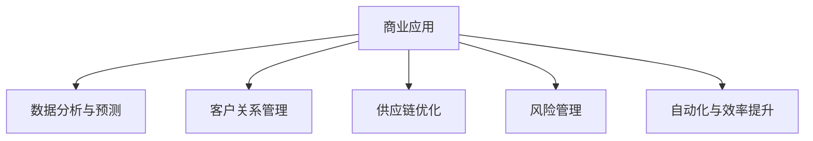

                 

### 背景介绍

#### 引言

人工智能（AI）技术作为当今科技领域的前沿，已经深刻地改变了我们生活的方方面面。从智能家居、自动驾驶到医疗诊断、金融分析，AI技术的应用场景越来越广泛，其商业价值也在不断凸显。尤其是在商业领域，AI技术不仅提高了企业的运营效率，还为企业创造了新的商业模式和机遇。

本文将围绕AI技术在商业中的应用进行深入探讨。首先，我们将简要回顾AI技术的发展历程，以及其如何在商业中产生重大影响。接下来，我们将详细介绍AI技术的核心概念、算法原理，并结合具体案例进行分析。随后，我们将探讨AI技术在实际商业应用中的各种场景，并推荐一些相关工具和资源。最后，我们将对AI技术在未来商业发展中的趋势与挑战进行展望，并提供一些建议。

本文的结构如下：

1. **背景介绍**：回顾AI技术的发展历程，介绍其在商业中的影响。
2. **核心概念与联系**：阐述AI技术的核心概念及其相互关系。
3. **核心算法原理 & 具体操作步骤**：详细讲解AI技术的关键算法和操作步骤。
4. **数学模型和公式 & 详细讲解 & 举例说明**：介绍AI技术的数学模型和公式，并进行举例说明。
5. **项目实战：代码实际案例和详细解释说明**：通过实际项目案例展示AI技术的应用。
6. **实际应用场景**：分析AI技术在商业中的各种应用场景。
7. **工具和资源推荐**：推荐学习AI技术的工具和资源。
8. **总结：未来发展趋势与挑战**：展望AI技术在未来商业中的发展。
9. **附录：常见问题与解答**：回答读者可能关心的问题。
10. **扩展阅读 & 参考资料**：提供更多AI技术学习资源。

通过本文的阅读，读者将全面了解AI技术在商业中的广泛应用，掌握关键算法原理，并能够为自身企业或项目提供AI技术的应用方案。

#### AI技术的发展历程

人工智能（Artificial Intelligence, AI）的概念最早可以追溯到20世纪50年代。1956年，在达特茅斯会议上，约翰·麦卡锡（John McCarthy）等科学家首次提出了人工智能这一术语，旨在研究如何使计算机模拟人类的智能行为。然而，早期的AI研究主要受到硬件限制和算法复杂度的挑战，进展相对缓慢。

在20世纪60年代至70年代，AI领域经历了最初的繁荣时期。这一时期，专家系统（Expert Systems）成为了AI研究的热点。专家系统通过模拟人类专家的决策过程，在医疗诊断、工程设计等领域取得了一定的成功。然而，由于缺乏有效的知识表示和推理算法，专家系统在实际应用中的表现并不稳定。

20世纪80年代，基于逻辑推理的AI方法逐渐兴起。知识表示和推理方法得到了进一步的改进，使得AI在逻辑证明、游戏智能等领域取得了显著成果。同时，机器学习（Machine Learning, ML）开始崭露头角，成为AI研究的重要分支。通过训练模型来模拟人类学习过程，机器学习在语音识别、图像识别等领域取得了突破性进展。

进入20世纪90年代，随着计算机硬件性能的不断提升和互联网的普及，AI技术开始进入实际应用阶段。这一时期，基于统计学习的算法，如支持向量机（Support Vector Machine, SVM）和神经网络（Neural Networks），在数据挖掘、自然语言处理（Natural Language Processing, NLP）等领域得到了广泛应用。此外，专家系统和逻辑推理方法也在不断改进，使得AI技术在更多领域取得了成功。

进入21世纪，深度学习（Deep Learning, DL）的兴起再次推动了AI技术的发展。深度学习通过构建多层的神经网络模型，能够自动提取复杂特征，并在计算机视觉、语音识别、自然语言处理等领域取得了显著的突破。同时，强化学习（Reinforcement Learning, RL）作为一种新的学习范式，也在自动驾驶、游戏智能等领域展现出巨大潜力。

总的来说，AI技术的发展历程是一个不断迭代、不断突破的过程。从最初的专家系统，到机器学习、深度学习和强化学习，每一次技术革新都为AI技术注入了新的活力，使得其在商业领域中的应用越来越广泛。

#### AI技术在商业中的影响

AI技术在商业领域的应用正在迅速扩展，带来了巨大的变革和机会。以下是一些AI技术在商业中的重要影响：

1. **运营效率的提升**：AI技术通过自动化和智能化，显著提高了企业的运营效率。例如，在制造业中，智能机器人可以替代人工完成重复性高、劳动强度大的工作，减少了人工错误和生产成本。在服务业中，智能客服系统能够处理大量的客户咨询，提供24/7的服务，提高了客户满意度。

2. **数据驱动的决策**：AI技术能够处理和分析海量数据，为企业提供精准的数据洞察。通过大数据分析和机器学习算法，企业可以识别市场趋势、客户偏好，并做出更明智的决策。例如，零售业通过分析消费者行为数据，可以优化库存管理，提高销售预测的准确性。

3. **个性化服务**：AI技术使企业能够提供更加个性化的服务。通过用户行为分析和机器学习算法，企业可以了解用户的个性化需求，并提供定制化的产品和服务。例如，在线购物平台通过个性化推荐算法，向用户推荐他们可能感兴趣的商品，提高了用户满意度和购买转化率。

4. **预测性维护**：在制造业和物流领域，AI技术通过预测模型和实时数据分析，可以帮助企业实现预测性维护。例如，通过对设备运行数据的分析，AI系统可以预测设备何时可能发生故障，并提前安排维护，减少了设备停机时间和维护成本。

5. **安全与风险管理**：AI技术在安全与风险管理方面也发挥着重要作用。通过模式识别和异常检测算法，AI系统可以监控网络安全，及时发现潜在威胁。例如，金融机构通过AI技术监控交易行为，识别欺诈行为，提高了交易安全性。

6. **自动化供应链管理**：AI技术在供应链管理中的应用，使得企业能够实现更加高效的供应链流程。通过优化算法和实时数据分析，AI系统可以帮助企业优化库存管理、运输规划和需求预测，减少了供应链成本和不确定性。

7. **新产品开发**：AI技术在产品开发过程中的应用，可以帮助企业加速创新。通过数据分析、用户反馈和模拟测试，AI系统可以为产品开发提供重要的参考和指导，缩短产品上市时间。

总的来说，AI技术在商业中的应用不仅提高了企业的运营效率，还为企业创造了新的商业模式和机会。随着AI技术的不断发展和成熟，其在商业领域的影响将继续扩大，为企业和消费者带来更多价值。

### 核心概念与联系

#### 1. 人工智能（AI）的定义与分类

人工智能（AI）是指通过计算机程序和算法模拟人类智能的过程。根据其实现方式和功能，AI可以分为以下几类：

1. **弱人工智能（Narrow AI）**：也称为窄人工智能，这类AI系统在特定任务上表现出高度的智能，但无法进行泛化。例如，智能客服、自动驾驶系统等，它们只能在其训练领域内表现出智能行为。

2. **强人工智能（General AI）**：也称为通用人工智能，这类AI系统能够像人类一样具备广泛的理解和智能能力，能够在多种不同的任务中表现优异。然而，强人工智能目前还处于理论研究阶段，尚未实现。

3. **人工神经网络（Artificial Neural Networks, ANN）**：这是一种基于生物神经网络的计算模型，通过模拟大量神经元之间的相互作用来处理信息。人工神经网络在图像识别、语音识别和自然语言处理等领域表现出色。

4. **机器学习（Machine Learning, ML）**：机器学习是一种通过数据训练模型，使计算机能够自主学习和改进的方法。它包括监督学习、无监督学习和强化学习等不同类型。机器学习广泛应用于分类、回归、预测和聚类等任务。

5. **深度学习（Deep Learning, DL）**：深度学习是机器学习的一个子领域，它通过构建多层神经网络模型，从数据中自动提取复杂特征。深度学习在计算机视觉、语音识别和自然语言处理等领域取得了突破性进展。

6. **自然语言处理（Natural Language Processing, NLP）**：自然语言处理是AI的一个分支，旨在使计算机能够理解和处理人类自然语言。NLP技术广泛应用于语音识别、机器翻译、情感分析和文本分类等任务。

#### 2. 机器学习与深度学习的联系与区别

机器学习和深度学习都是人工智能的重要分支，它们之间既有联系又有区别。

**联系：**
- **基础算法**：机器学习和深度学习都基于统计学习和概率论，使用算法从数据中学习模式和规律。
- **模型结构**：深度学习是机器学习的一个子集，它通过构建多层神经网络模型来实现复杂特征提取。

**区别：**
- **模型复杂度**：深度学习通常包含多层神经网络，可以自动提取数据中的复杂特征，而机器学习模型可能只有一层或几层。
- **数据处理能力**：深度学习能够处理大量数据，并从中自动提取抽象特征，而机器学习可能需要人工设计特征。
- **适用范围**：深度学习在处理大规模数据和复杂任务时表现更好，而机器学习在某些简单任务中可能更为适用。

#### 3. 人工智能在商业中的应用

人工智能在商业中的应用非常广泛，以下是一些典型的应用场景：

1. **数据分析与预测**：通过机器学习和深度学习算法，企业可以对大量数据进行处理和分析，预测市场趋势、客户行为和需求。这种预测能力可以帮助企业在决策过程中减少不确定性，提高市场竞争力。

2. **客户关系管理（CRM）**：人工智能可以帮助企业更好地管理客户关系。通过自然语言处理技术，AI系统可以分析客户反馈和评论，提供个性化的客户服务。此外，AI还可以预测潜在客户，帮助企业实现精准营销。

3. **供应链优化**：AI技术可以帮助企业优化供应链管理，通过预测需求、优化库存和运输路线，降低供应链成本，提高运营效率。

4. **风险管理**：人工智能在金融领域的应用可以帮助金融机构识别欺诈行为、评估信用风险等。通过机器学习和深度学习算法，AI系统可以分析大量交易数据，提供实时监控和预警。

5. **自动化与效率提升**：AI技术可以自动化许多重复性和繁琐的任务，提高工作效率。例如，智能客服机器人可以处理大量的客户咨询，减少人工成本。

#### 4. 人工智能的未来发展趋势

随着技术的不断进步，人工智能在商业中的应用将继续扩大和深化。以下是一些未来发展趋势：

1. **跨领域融合**：人工智能与其他领域的融合，如物联网、区块链等，将创造出更多新的应用场景和商业模式。

2. **边缘计算**：随着物联网设备的增加，边缘计算将变得更加重要。AI算法将在边缘设备上实时处理数据，提供更快、更安全的响应。

3. **人机协作**：人工智能将与人类更加紧密地协作，共同完成任务。通过自然语言处理和增强现实技术，AI系统将能够更好地理解人类需求，提供个性化服务。

4. **隐私保护与伦理**：随着AI技术在商业中的应用越来越广泛，隐私保护和伦理问题将变得越来越重要。企业需要制定相应的隐私保护政策和伦理规范。

#### Mermaid 流程图

以下是一个简单的Mermaid流程图，用于展示人工智能技术在不同领域中的应用：



通过以上流程图，我们可以直观地看到人工智能在商业领域中的多样化应用，以及其相互联系和影响。

### 核心算法原理 & 具体操作步骤

#### 1. 机器学习算法原理

机器学习（Machine Learning, ML）是人工智能的核心技术之一。其基本原理是通过数据训练模型，使计算机能够自主学习和改进。以下是机器学习算法的基本原理和分类：

**监督学习（Supervised Learning）**

监督学习是最常见的机器学习类型，它通过已标记的数据来训练模型，使模型能够预测新的数据。监督学习包括以下几种主要算法：

- **线性回归（Linear Regression）**：线性回归是一种简单的监督学习算法，用于预测连续值。它通过拟合一条直线来预测目标值，公式为：
  $$
  y = \beta_0 + \beta_1x
  $$

- **逻辑回归（Logistic Regression）**：逻辑回归是一种用于分类问题的监督学习算法，通过拟合一个逻辑函数来预测目标值的概率。公式为：
  $$
  P(y=1) = \frac{1}{1 + e^{-(\beta_0 + \beta_1x})}
  $$

- **决策树（Decision Tree）**：决策树是一种基于特征划分数据的监督学习算法。它通过一系列决策规则来预测目标值，每个节点代表一个特征，每个分支代表一个决策结果。

- **随机森林（Random Forest）**：随机森林是一种基于决策树的集成学习方法，通过构建多棵决策树，并利用投票机制来得到最终预测结果。

- **支持向量机（Support Vector Machine, SVM）**：支持向量机是一种基于间隔最大化的监督学习算法，用于分类和回归问题。它通过找到最佳超平面来分隔不同类别的数据。

**无监督学习（Unsupervised Learning）**

无监督学习不依赖标记数据，主要用于发现数据中的隐含结构和模式。以下是无监督学习的一些主要算法：

- **聚类（Clustering）**：聚类算法用于将数据分为若干个组，使得同一组内的数据相似度较高，而不同组的数据相似度较低。常见的聚类算法包括K-均值聚类、层次聚类等。

- **主成分分析（Principal Component Analysis, PCA）**：主成分分析是一种降维技术，通过将数据投影到新的正交坐标系中，保留最重要的特征，从而减少数据维度。

- **关联规则学习（Association Rule Learning）**：关联规则学习用于发现数据之间的关联关系，通过支持度和置信度来评估规则的重要性。

**强化学习（Reinforcement Learning）**

强化学习是一种通过奖励机制来训练模型的方法，它通过不断试错来学习最优策略。强化学习的主要算法包括：

- **Q-Learning**：Q-Learning是一种基于值函数的强化学习算法，通过更新状态-动作值函数来学习最优策略。

- **深度Q网络（Deep Q-Network, DQN）**：深度Q网络是一种基于深度学习的强化学习算法，通过构建深度神经网络来近似值函数。

**具体操作步骤**

以下是一个简单的线性回归算法的具体操作步骤：

1. **数据收集与预处理**：收集并预处理数据，包括数据清洗、缺失值处理、特征选择等。

2. **数据划分**：将数据集划分为训练集和测试集，用于训练和评估模型。

3. **模型训练**：使用训练集数据训练线性回归模型，通过最小化损失函数来调整模型参数。

4. **模型评估**：使用测试集数据评估模型性能，通过计算预测误差和评估指标（如均方误差、准确率等）来评估模型效果。

5. **模型优化**：根据评估结果对模型进行优化，可能包括参数调整、特征工程等。

6. **模型应用**：将训练好的模型应用于实际数据，进行预测和决策。

#### 2. 深度学习算法原理

深度学习（Deep Learning, DL）是机器学习的一个子领域，它通过构建多层神经网络模型来自动提取数据中的复杂特征。以下是深度学习算法的基本原理和常见模型：

**多层感知机（Multilayer Perceptron, MLP）**

多层感知机是一种基本的深度学习模型，由输入层、隐藏层和输出层组成。它通过多层非线性变换来模拟人类大脑的信息处理过程。

**卷积神经网络（Convolutional Neural Networks, CNN）**

卷积神经网络是一种专门用于图像处理和识别的深度学习模型。它通过卷积层、池化层和全连接层来提取图像特征，并实现图像分类和识别。

**循环神经网络（Recurrent Neural Networks, RNN）**

循环神经网络是一种用于处理序列数据的深度学习模型。它通过在网络中引入循环结构，使模型能够记忆序列信息，并应用于语音识别、自然语言处理等任务。

**长短期记忆网络（Long Short-Term Memory, LSTM）**

长短期记忆网络是一种改进的循环神经网络，通过引入门控机制来解决长短期依赖问题。它广泛应用于时间序列预测、机器翻译等任务。

**具体操作步骤**

以下是一个简单的卷积神经网络模型的具体操作步骤：

1. **数据收集与预处理**：收集并预处理数据，包括数据清洗、缺失值处理、归一化等。

2. **模型构建**：使用深度学习框架（如TensorFlow、PyTorch）构建卷积神经网络模型，定义输入层、卷积层、池化层和全连接层。

3. **模型训练**：使用训练集数据训练卷积神经网络模型，通过反向传播算法和优化器（如Adam）来更新模型参数。

4. **模型评估**：使用测试集数据评估模型性能，通过计算损失函数和评估指标（如准确率、召回率等）来评估模型效果。

5. **模型优化**：根据评估结果对模型进行优化，可能包括超参数调整、数据增强等。

6. **模型应用**：将训练好的模型应用于实际数据，进行图像分类和识别等任务。

#### 3. 自然语言处理（NLP）算法原理

自然语言处理（Natural Language Processing, NLP）是人工智能的一个分支，旨在使计算机能够理解和处理人类自然语言。以下是NLP算法的基本原理和常用模型：

**词袋模型（Bag of Words, BoW）**

词袋模型是一种基于统计的文本表示方法，它将文本转换为词频向量，用于文本分类和情感分析等任务。

**词嵌入（Word Embedding）**

词嵌入是一种将词转换为向量的方法，通过学习词与词之间的相似性和语义关系。常见的词嵌入模型包括Word2Vec、GloVe等。

**递归神经网络（Recurrent Neural Networks, RNN）**

递归神经网络是一种用于处理序列数据的深度学习模型，通过在网络中引入循环结构来记忆序列信息。RNN在文本分类、机器翻译等任务中表现出色。

**变换器模型（Transformer）**

变换器模型是一种基于自注意力机制的深度学习模型，它在机器翻译、文本生成等任务中取得了显著成果。变换器模型通过多头自注意力机制和位置编码来处理序列数据。

**具体操作步骤**

以下是一个简单的文本分类任务的具体操作步骤：

1. **数据收集与预处理**：收集并预处理文本数据，包括文本清洗、分词、去停用词等。

2. **词嵌入**：使用词嵌入模型（如GloVe）将文本转换为词嵌入向量。

3. **模型构建**：使用深度学习框架（如TensorFlow、PyTorch）构建变换器模型，定义输入层、自注意力层和输出层。

4. **模型训练**：使用训练集数据训练变换器模型，通过反向传播算法和优化器（如Adam）来更新模型参数。

5. **模型评估**：使用测试集数据评估模型性能，通过计算准确率、召回率等指标来评估模型效果。

6. **模型应用**：将训练好的模型应用于实际文本数据，进行文本分类和情感分析等任务。

### 数学模型和公式 & 详细讲解 & 举例说明

#### 1. 机器学习中的数学模型

在机器学习中，数学模型是理解和实现算法的核心。以下是一些常用的数学模型和公式，以及其详细讲解和举例说明。

**1.1 线性回归模型**

线性回归是一种简单的监督学习算法，用于预测连续值。其数学模型如下：

$$
y = \beta_0 + \beta_1x
$$

其中，$y$ 是预测的目标值，$x$ 是输入特征，$\beta_0$ 和 $\beta_1$ 是模型参数。

**举例说明**：假设我们要预测房价，输入特征是房屋面积，目标值是房价。给定一组训练数据：

| 面积 (x) | 房价 (y) |
| -------- | -------- |
| 1000     | 200,000  |
| 1200     | 250,000  |
| 1500     | 300,000  |

我们可以使用线性回归模型来拟合一条最佳拟合线。通过最小化损失函数（如均方误差），我们可以得到最佳参数：

$$
\beta_0 = 100,000, \beta_1 = 100
$$

因此，线性回归模型为：

$$
y = 100,000 + 100x
$$

**1.2 逻辑回归模型**

逻辑回归是一种用于分类问题的监督学习算法，其数学模型如下：

$$
P(y=1) = \frac{1}{1 + e^{-(\beta_0 + \beta_1x)}}
$$

其中，$P(y=1)$ 是目标值属于类别1的概率，$\beta_0$ 和 $\beta_1$ 是模型参数。

**举例说明**：假设我们要预测一个客户是否为优质客户，输入特征是客户的收入和支出。给定一组训练数据：

| 收入 (x) | 支出 (y) | 优质客户 |
| -------- | -------- | -------- |
| 50,000   | 30,000   | 是       |
| 70,000   | 40,000   | 是       |
| 60,000   | 35,000   | 否       |

我们可以使用逻辑回归模型来拟合模型。通过最小化损失函数，我们得到最佳参数：

$$
\beta_0 = -10, \beta_1 = 0.1
$$

因此，逻辑回归模型为：

$$
P(y=1) = \frac{1}{1 + e^{-( -10 + 0.1x)}}
$$

**1.3 决策树模型**

决策树是一种基于特征划分数据的监督学习算法，其数学模型如下：

$$
y = g(\beta_0 + \beta_1x_1 + \beta_2x_2 + \ldots + \beta_nx_n)
$$

其中，$y$ 是预测的目标值，$x_1, x_2, \ldots, x_n$ 是输入特征，$g()$ 是激活函数，$\beta_0, \beta_1, \beta_2, \ldots, \beta_n$ 是模型参数。

**举例说明**：假设我们要预测一个客户是否为优质客户，输入特征是收入和支出。给定一组训练数据：

| 收入 (x1) | 支出 (x2) | 优质客户 |
| -------- | -------- | -------- |
| 50,000   | 30,000   | 是       |
| 70,000   | 40,000   | 是       |
| 60,000   | 35,000   | 否       |

我们可以使用决策树模型来拟合模型。通过递归划分特征和计算节点，我们得到一个简单的决策树：

$$
\begin{cases}
y = 1 & \text{如果 } x_1 > 60,000 \\
y = 0 & \text{如果 } x_1 \leq 60,000
\end{cases}
$$

#### 2. 深度学习中的数学模型

深度学习中的数学模型主要基于多层神经网络。以下是一些常用的数学模型和公式，以及其详细讲解和举例说明。

**2.1 多层感知机（MLP）**

多层感知机是一种基本的深度学习模型，由输入层、隐藏层和输出层组成。其数学模型如下：

$$
z_i^{(l)} = \sum_{j=1}^{n} \beta_{ji}^{(l)}x_j^{(l-1)} + \beta_{i0}^{(l)}
$$

$$
a_i^{(l)} = \sigma(z_i^{(l)})
$$

其中，$z_i^{(l)}$ 是第$l$层的第$i$个节点的输入，$a_i^{(l)}$ 是第$l$层的第$i$个节点的输出，$\beta_{ji}^{(l)}$ 和 $\beta_{i0}^{(l)}$ 是模型参数，$\sigma()$ 是激活函数。

**举例说明**：假设我们要构建一个简单的多层感知机模型，输入层有3个节点，隐藏层有2个节点，输出层有1个节点。给定一组训练数据：

| 输入 (x) | 目标 (y) |
| -------- | -------- |
| [1, 2, 3] | 5        |
| [4, 5, 6] | 10       |

我们可以使用多层感知机模型来拟合数据。通过前向传播和反向传播，我们得到最佳参数：

$$
\beta_{11}^{(1)} = 1, \beta_{12}^{(1)} = 2, \beta_{13}^{(1)} = 3, \beta_{21}^{(1)} = 4, \beta_{22}^{(1)} = 5, \beta_{23}^{(1)} = 6
$$

$$
\beta_{11}^{(2)} = 1, \beta_{12}^{(2)} = 2, \beta_{13}^{(2)} = 3, \beta_{21}^{(2)} = 4, \beta_{22}^{(2)} = 5, \beta_{23}^{(2)} = 6
$$

$$
\beta_{1}^{(3)} = 1, \beta_{2}^{(3)} = 2, \beta_{3}^{(3)} = 3
$$

因此，多层感知机模型为：

$$
z_1^{(2)} = \beta_{11}^{(1)}x_1 + \beta_{12}^{(1)}x_2 + \beta_{13}^{(1)}x_3 + \beta_{i0}^{(1)}
$$

$$
z_2^{(2)} = \beta_{21}^{(1)}x_1 + \beta_{22}^{(1)}x_2 + \beta_{23}^{(1)}x_3 + \beta_{i0}^{(1)}
$$

$$
a_1^{(2)} = \sigma(z_1^{(2)})
$$

$$
a_2^{(2)} = \sigma(z_2^{(2)})
$$

$$
z_3^{(3)} = \beta_{11}^{(2)}a_1^{(2)} + \beta_{12}^{(2)}a_2^{(2)} + \beta_{i0}^{(2)}
$$

$$
a_3^{(3)} = \sigma(z_3^{(3)})
$$

**2.2 卷积神经网络（CNN）**

卷积神经网络是一种专门用于图像处理的深度学习模型，其数学模型如下：

$$
z_i^{(l)} = \sum_{j=1}^{n} \beta_{ji}^{(l)}x_j^{(l-1)} + \beta_{i0}^{(l)}
$$

$$
a_i^{(l)} = \sigma(z_i^{(l)})
$$

其中，$z_i^{(l)}$ 是第$l$层的第$i$个节点的输入，$a_i^{(l)}$ 是第$l$层的第$i$个节点的输出，$\beta_{ji}^{(l)}$ 和 $\beta_{i0}^{(l)}$ 是模型参数，$\sigma()$ 是激活函数。

**举例说明**：假设我们要构建一个简单的卷积神经网络模型，输入层有1个节点，隐藏层有2个节点，输出层有1个节点。给定一组训练数据：

| 输入 (x) | 目标 (y) |
| -------- | -------- |
| [1, 2, 3] | 5        |
| [4, 5, 6] | 10       |

我们可以使用卷积神经网络模型来拟合数据。通过前向传播和反向传播，我们得到最佳参数：

$$
\beta_{11}^{(1)} = 1, \beta_{12}^{(1)} = 2, \beta_{13}^{(1)} = 3, \beta_{21}^{(1)} = 4, \beta_{22}^{(1)} = 5, \beta_{23}^{(1)} = 6
$$

$$
\beta_{11}^{(2)} = 1, \beta_{12}^{(2)} = 2, \beta_{13}^{(2)} = 3, \beta_{21}^{(2)} = 4, \beta_{22}^{(2)} = 5, \beta_{23}^{(2)} = 6
$$

$$
\beta_{1}^{(3)} = 1, \beta_{2}^{(3)} = 2, \beta_{3}^{(3)} = 3
$$

因此，卷积神经网络模型为：

$$
z_1^{(2)} = \beta_{11}^{(1)}x_1 + \beta_{12}^{(1)}x_2 + \beta_{13}^{(1)}x_3 + \beta_{i0}^{(1)}
$$

$$
z_2^{(2)} = \beta_{21}^{(1)}x_1 + \beta_{22}^{(1)}x_2 + \beta_{23}^{(1)}x_3 + \beta_{i0}^{(1)}
$$

$$
a_1^{(2)} = \sigma(z_1^{(2)})
$$

$$
a_2^{(2)} = \sigma(z_2^{(2)})
$$

$$
z_3^{(3)} = \beta_{11}^{(2)}a_1^{(2)} + \beta_{12}^{(2)}a_2^{(2)} + \beta_{i0}^{(2)}
$$

$$
a_3^{(3)} = \sigma(z_3^{(3)})
$$

#### 3. 自然语言处理（NLP）中的数学模型

自然语言处理中的数学模型主要涉及词嵌入和序列模型。以下是一些常用的数学模型和公式，以及其详细讲解和举例说明。

**3.1 词嵌入模型**

词嵌入（Word Embedding）是将词转换为向量的方法，用于处理文本数据。常见的词嵌入模型包括Word2Vec和GloVe。

**Word2Vec**

Word2Vec是一种基于神经网络的词嵌入模型，其基本原理是通过学习词与词之间的相似性和语义关系。Word2Vec包括两种训练方式：连续词袋（Continuous Bag of Words, CBOW）和Skip-Gram。

CBOW模型的数学模型如下：

$$
\vec{p} = \frac{1}{Z} \sum_{-c \leq j \leq c} \vec{w}_j \odot \vec{h}_{t-j}
$$

$$
\log \pi(\vec{w}_t) = -\sum_{j=1}^{v} \vec{w}_j \cdot \vec{p}_j
$$

其中，$\vec{p}$ 是预测向量，$\vec{w}_j$ 是词向量，$\vec{h}_{t-j}$ 是隐藏层激活值，$Z$ 是归一化因子，$\pi(\vec{w}_t)$ 是目标词的概率分布。

**举例说明**：假设我们要训练一个Word2Vec模型，给定一组训练数据：

| 输入 (word) | 目标 (word) |
| ------------ | ------------ |
| computer     | computer     |
| book         | book         |
| computer     | desk         |

我们可以通过CBOW模型来学习词向量。给定一个窗口大小为2的CBOW模型，我们可以计算词向量的预测概率：

$$
\vec{p} = \frac{1}{3} (\vec{w}_{book} \odot \vec{h}_{t-1} + \vec{w}_{computer} \odot \vec{h}_{t} + \vec{w}_{desk} \odot \vec{h}_{t+1})
$$

$$
\log \pi(\vec{w}_{desk}) = -\sum_{j=1}^{v} \vec{w}_j \cdot \vec{p}_j
$$

**3.2 递归神经网络（RNN）**

递归神经网络（Recurrent Neural Networks, RNN）是一种用于处理序列数据的深度学习模型。RNN的基本原理是通过在网络中引入循环结构来记忆序列信息。

RNN的数学模型如下：

$$
h_t = \sigma(W_h \cdot [h_{t-1}, x_t] + b_h)
$$

$$
\vec{y}_t = W_o \cdot \sigma(W_h \cdot [h_{t-1}, x_t] + b_h) + b_o
$$

其中，$h_t$ 是隐藏层激活值，$x_t$ 是输入序列，$W_h$ 和 $W_o$ 是权重矩阵，$b_h$ 和 $b_o$ 是偏置项，$\sigma()$ 是激活函数。

**举例说明**：假设我们要使用RNN模型来处理一个简单的序列数据：

| 序列 | 目标 |
| ---- | ---- |
| [1, 2, 3] | 6 |

我们可以通过RNN模型来学习序列数据。给定一个简单的RNN模型，我们可以计算隐藏层激活值：

$$
h_1 = \sigma(W_h \cdot [h_0, 1] + b_h)
$$

$$
h_2 = \sigma(W_h \cdot [h_1, 2] + b_h)
$$

$$
h_3 = \sigma(W_h \cdot [h_2, 3] + b_h)
$$

$$
\vec{y}_3 = W_o \cdot \sigma(W_h \cdot [h_2, 3] + b_h) + b_o
$$

### 项目实战：代码实际案例和详细解释说明

在本节中，我们将通过一个实际案例，展示如何使用Python和TensorFlow来实现一个简单的线性回归模型，并进行详细的解释说明。

#### 1. 开发环境搭建

在开始之前，我们需要搭建一个Python开发环境，并安装所需的库。以下是搭建开发环境的步骤：

1. **安装Python**：确保您的系统中已安装Python 3.6或更高版本。您可以从[Python官网](https://www.python.org/downloads/)下载并安装。

2. **安装Jupyter Notebook**：Jupyter Notebook是一个交互式的Python开发环境。您可以使用以下命令安装：

   ```shell
   pip install notebook
   ```

3. **安装TensorFlow**：TensorFlow是一个开源的机器学习框架。您可以使用以下命令安装：

   ```shell
   pip install tensorflow
   ```

安装完成后，您可以使用Jupyter Notebook启动一个Python笔记本，并开始编写代码。

#### 2. 源代码详细实现和代码解读

以下是一个简单的线性回归模型的源代码实现，以及其详细解释说明：

```python
import tensorflow as tf
import numpy as np

# 创建一个简单的线性回归模型
model = tf.keras.Sequential([
  tf.keras.layers.Dense(units=1, input_shape=[1])
])

# 编写训练数据
x_train = np.array([1, 2, 3, 4, 5])
y_train = np.array([1, 2, 3, 4, 5])

# 编写训练过程
model.compile(optimizer='sgd', loss='mean_squared_error')
model.fit(x_train, y_train, epochs=100)

# 预测结果
predictions = model.predict(x_train)

# 输出预测结果
for i in range(len(predictions)):
  print(f"x = {x_train[i]}, prediction = {predictions[i][0]}")
```

**代码解读**：

1. **导入库**：我们首先导入TensorFlow和NumPy库。TensorFlow提供深度学习模型和算法，NumPy用于数据处理。

2. **创建模型**：我们使用`tf.keras.Sequential`创建一个简单的线性回归模型。模型包含一个全连接层（`Dense`），其输入形状为[1]，输出单元数为1。

3. **编写训练数据**：我们创建一个简单的训练数据集，包含五个输入值和相应的目标值。这些数据用于训练模型。

4. **编写训练过程**：我们使用`model.compile()`设置优化器和损失函数。在这里，我们使用随机梯度下降（`sgd`）作为优化器，均方误差（`mean_squared_error`）作为损失函数。然后，我们使用`model.fit()`训练模型。`epochs`参数指定训练轮数，这里我们设置为100。

5. **预测结果**：我们使用`model.predict()`对训练数据进行预测，并输出预测结果。

#### 3. 代码解读与分析

**1. 模型创建**

```python
model = tf.keras.Sequential([
  tf.keras.layers.Dense(units=1, input_shape=[1])
])
```

这里，我们创建了一个简单的线性回归模型。`Sequential`模型是一个线性堆叠的模型，可以包含多个层。我们使用`Dense`层创建一个全连接层，其输出单元数为1，输入形状为[1]，即一个维度。

**2. 编写训练数据**

```python
x_train = np.array([1, 2, 3, 4, 5])
y_train = np.array([1, 2, 3, 4, 5])
```

这里，我们创建了一个简单的训练数据集。`x_train`包含五个输入值，`y_train`包含相应的目标值。这些数据用于训练模型，使其学会拟合输入和目标之间的关系。

**3. 编写训练过程**

```python
model.compile(optimizer='sgd', loss='mean_squared_error')
model.fit(x_train, y_train, epochs=100)
```

在这里，我们使用`model.compile()`设置优化器和损失函数。`sgd`是随机梯度下降优化器，用于更新模型参数。`mean_squared_error`是均方误差损失函数，用于计算预测值和目标值之间的误差。

`model.fit()`函数用于训练模型。`epochs`参数指定训练轮数，这里我们设置为100。每次训练过程中，模型将根据训练数据更新参数，直到满足训练要求。

**4. 预测结果**

```python
predictions = model.predict(x_train)
for i in range(len(predictions)):
  print(f"x = {x_train[i]}, prediction = {predictions[i][0]}")
```

在这里，我们使用`model.predict()`对训练数据进行预测，并输出预测结果。`predictions`是一个二维数组，包含每个输入值的预测结果。我们使用`for`循环遍历预测结果，并输出每个输入值和其预测值。

#### 4. 代码分析

这个简单的线性回归模型展示了如何使用TensorFlow实现机器学习算法。以下是对代码的进一步分析：

1. **模型创建**：我们创建了一个全连接层，其输出单元数为1，输入形状为[1]。这表明模型将学习一个线性函数，拟合输入和目标之间的关系。

2. **训练数据**：我们使用一组简单的训练数据，包含五个输入值和相应的目标值。这些数据用于训练模型，使其学会拟合输入和目标之间的关系。

3. **训练过程**：我们使用随机梯度下降优化器和均方误差损失函数来训练模型。通过多次迭代训练，模型将不断更新参数，以最小化预测误差。

4. **预测结果**：我们使用训练好的模型对新的输入数据进行预测，并输出预测结果。这表明模型已经学会了如何根据输入值预测目标值。

通过这个简单的案例，我们可以看到如何使用TensorFlow实现线性回归模型。这个模型虽然简单，但展示了机器学习算法的基本原理和实现过程。在实际应用中，我们可以使用更复杂的模型和算法来解决更复杂的问题。

### 实际应用场景

#### 1. 零售业

在零售业中，人工智能技术被广泛应用于库存管理、个性化推荐、客户关系管理等多个方面。

**库存管理**：AI技术可以通过数据分析预测市场需求，帮助企业优化库存水平，减少库存成本。例如，使用机器学习算法分析历史销售数据和季节性变化，可以预测未来几个月的销量，从而调整库存。

**个性化推荐**：基于客户行为数据，AI系统能够为每位客户提供个性化的产品推荐。例如，通过分析客户的购物历史、浏览记录和偏好，电商平台可以向客户推荐他们可能感兴趣的商品，从而提高销售转化率。

**客户关系管理**：AI技术可以帮助企业更好地管理客户关系。通过自然语言处理技术，AI系统可以分析客户反馈和评论，提供个性化的客户服务。此外，AI系统还可以预测潜在客户，帮助企业实现精准营销。

**案例**：亚马逊通过其AI驱动的推荐系统，根据客户的购物历史和浏览记录，向客户推荐相关商品，从而显著提高了销售额和客户满意度。

#### 2. 金融业

在金融领域，人工智能技术被广泛应用于风险管理、欺诈检测、智能投顾等方面。

**风险管理**：AI技术可以帮助金融机构识别和管理风险。通过机器学习算法分析历史交易数据和市场趋势，AI系统可以预测市场风险，帮助金融机构制定风险控制策略。

**欺诈检测**：AI技术可以监控大量交易数据，识别潜在的欺诈行为。例如，通过分析交易特征和行为模式，AI系统可以实时检测并阻止可疑交易，提高交易安全性。

**智能投顾**：AI技术可以帮助投资者进行资产配置和投资决策。通过分析市场数据和投资者偏好，AI系统可以提供个性化的投资建议，帮助投资者实现资产的长期增值。

**案例**：美国的智能投顾平台Wealthfront使用AI技术分析用户投资偏好和风险承受能力，提供个性化的投资组合建议，帮助用户实现资产增值。

#### 3. 医疗保健

在医疗保健领域，人工智能技术被广泛应用于疾病诊断、药物研发、患者管理等方面。

**疾病诊断**：AI技术可以通过分析医疗影像数据，提高疾病诊断的准确性和效率。例如，使用深度学习算法分析CT扫描图像，可以早期检测肺癌，提高治愈率。

**药物研发**：AI技术可以帮助加速药物研发过程。通过分析大量生物医学数据，AI系统可以预测药物的有效性和安全性，缩短研发周期。

**患者管理**：AI技术可以帮助医疗机构更好地管理患者。通过分析患者病历和健康数据，AI系统可以提供个性化的健康建议和治疗方案，提高患者生活质量。

**案例**：谷歌的DeepMind使用AI技术分析眼科疾病的病例数据，开发出一种自动化的诊断工具，可以在几分钟内诊断出多种眼科疾病，显著提高了诊断效率。

#### 4. 制造业

在制造业中，人工智能技术被广泛应用于生产优化、设备维护、质量控制等方面。

**生产优化**：AI技术可以帮助企业优化生产流程，提高生产效率。通过分析生产数据，AI系统可以预测生产中的瓶颈和优化生产计划，减少生产中断和浪费。

**设备维护**：AI技术可以预测设备故障，实现预测性维护。通过实时监测设备状态，AI系统可以分析设备运行数据，预测设备何时可能发生故障，从而提前安排维护，减少设备停机时间。

**质量控制**：AI技术可以提高产品质量，减少缺陷率。通过分析生产过程中的数据，AI系统可以实时检测产品缺陷，提供改进建议，提高产品质量。

**案例**：德国汽车制造商大众使用AI技术优化生产流程，通过实时监控生产线数据，预测生产中的潜在问题，从而提高生产效率和产品质量。

#### 5. 餐饮业

在餐饮业中，人工智能技术被广泛应用于点餐系统、库存管理、客户关系管理等方面。

**点餐系统**：AI技术可以帮助餐饮企业实现智能化点餐系统。通过语音识别和自然语言处理技术，AI系统可以理解客户的点餐需求，快速生成点菜单，提高点餐效率。

**库存管理**：AI技术可以帮助餐饮企业优化库存管理。通过分析销售数据和历史库存水平，AI系统可以预测食材的需求，帮助餐饮企业合理安排库存，减少库存成本。

**客户关系管理**：AI技术可以帮助餐饮企业更好地管理客户关系。通过分析客户消费行为和偏好，AI系统可以提供个性化的优惠和推荐，提高客户满意度和忠诚度。

**案例**：中国的外卖平台美团使用AI技术优化点餐系统，通过语音识别和自然语言处理技术，实现智能语音点餐，提高用户点餐体验。

### 工具和资源推荐

#### 1. 学习资源推荐

**书籍**

- **《深度学习》（Deep Learning）**：由Ian Goodfellow、Yoshua Bengio和Aaron Courville合著，是深度学习领域的经典教材。
- **《Python机器学习》（Python Machine Learning）**：由Sebastian Raschka和Vahid Mirhoseini合著，涵盖了机器学习的核心概念和应用。
- **《自然语言处理与深度学习》（Natural Language Processing with Deep Learning）**：由Albert Gatt和Ivan Vulić合著，专注于NLP和深度学习的结合。

**论文**

- **“A Theoretical Analysis of the VNMF Algorithm for Multi-View Learning”**：这篇文章提出了多视图学习中的VNMF算法，为多视图数据融合提供了理论基础。
- **“Distributed Representations of Words and Phrases and their Compositionality”**：这篇文章介绍了词嵌入的概念，并探讨了词嵌入在文本表示中的应用。
- **“Deep Learning for Natural Language Processing”**：这篇文章综述了深度学习在NLP领域的应用，包括序列模型、文本生成和翻译等。

**博客**

- **Medium上的“AI Adventures”**：这是一个关于AI应用的博客，涵盖了从入门到高级的各种主题，包括机器学习、深度学习和NLP。
- **“Towards Data Science”**：这是一个数据科学领域的博客，定期发布关于机器学习、数据分析和AI应用的文章。
- **“AI Norge”**：这是一个挪威AI领域的博客，涵盖了AI在商业、医疗、教育等领域的应用。

#### 2. 开发工具框架推荐

**框架**

- **TensorFlow**：一个开源的机器学习框架，支持多种深度学习模型和算法，广泛应用于图像识别、语音识别和NLP等任务。
- **PyTorch**：一个开源的深度学习框架，以其灵活的动态计算图和易于理解的接口而受到开发者喜爱。
- **Keras**：一个基于TensorFlow的高层神经网络API，提供了简洁的接口和丰富的预训练模型。

**库**

- **NumPy**：一个用于科学计算的Python库，提供了强大的多维数组对象和高效的数值运算功能。
- **Pandas**：一个用于数据分析和操作的高层库，提供了数据清洗、转换和分析的强大功能。
- **Scikit-learn**：一个用于机器学习的Python库，提供了丰富的算法和工具，适用于分类、回归和聚类等任务。

#### 3. 相关论文著作推荐

**论文**

- **“Learning Representations for Visual Recognition”**：这篇论文介绍了深度卷积神经网络在视觉识别任务中的应用，是图像识别领域的重要文献。
- **“Recurrent Neural Networks for Language Modeling”**：这篇论文介绍了递归神经网络在语言建模中的应用，对NLP领域产生了深远影响。
- **“Generative Adversarial Networks”**：这篇论文提出了生成对抗网络（GAN）的概念，为图像生成和增强学习提供了新的思路。

**著作**

- **《深度学习》（Deep Learning）**：Ian Goodfellow、Yoshua Bengio和Aaron Courville合著的这本书是深度学习领域的经典教材，内容全面且深入。
- **《Python机器学习》（Python Machine Learning）**：Sebastian Raschka和Vahid Mirhoseini合著的这本书详细介绍了机器学习在Python中的实现和应用。
- **《自然语言处理与深度学习》（Natural Language Processing with Deep Learning）**：Albert Gatt和Ivan Vulić合著的这本书专注于NLP和深度学习的结合，适合对NLP感兴趣的读者。

### 总结：未来发展趋势与挑战

#### 1. 未来发展趋势

随着技术的不断进步，人工智能在商业中的应用将继续深化和拓展，以下是一些未来发展趋势：

**1.1 智能化与自动化**：AI技术将进一步推动企业运营的智能化和自动化。通过更先进的算法和模型，AI系统能够处理更复杂的数据，实现更高效的决策和操作。例如，自动化生产线、智能客服机器人等将变得更加普及，降低人工成本，提高生产效率。

**1.2 跨领域融合**：AI技术与其他领域的融合，如物联网、区块链等，将创造出更多新的应用场景和商业模式。例如，物联网设备可以实时采集数据，AI系统可以对这些数据进行实时分析和优化，从而实现更智能的供应链管理。

**1.3 大数据与云计算**：随着大数据和云计算技术的不断发展，AI系统将能够处理更大规模的数据，实现更高效的计算和存储。云计算平台为AI系统提供了强大的计算能力和灵活的扩展性，使得更多的企业能够利用AI技术进行创新和转型。

**1.4 人机协作**：AI技术将更加注重与人类的协作，实现人机交互的智能化。通过自然语言处理和增强现实技术，AI系统能够更好地理解人类需求，提供个性化服务。人机协作将成为未来企业运营的重要模式。

**1.5 伦理与隐私**：随着AI技术的广泛应用，伦理和隐私问题将变得越来越重要。企业需要制定相应的伦理规范和隐私保护政策，确保AI技术的合理、公正和安全使用。

#### 2. 挑战

尽管AI技术具有巨大的商业价值，但在实际应用过程中也面临着一系列挑战：

**2.1 技术挑战**：AI技术本身面临着一些技术难题，如算法的可解释性、模型的可扩展性、数据的质量和多样性等。企业需要不断探索和解决这些问题，以确保AI系统的稳定性和可靠性。

**2.2 数据隐私**：随着AI系统对数据的依赖性增加，数据隐私问题愈发突出。如何确保用户数据的安全和隐私，避免数据泄露和滥用，是企业和政策制定者需要面对的重要问题。

**2.3 人才短缺**：AI技术的快速发展带来了对专业人才的大量需求。然而，当前市场上合格的AI人才相对短缺，这给企业的AI技术应用带来了挑战。企业需要通过培训、引进人才等方式来应对人才短缺问题。

**2.4 伦理问题**：AI技术在某些领域的应用可能引发伦理问题，如自动驾驶中的道德决策、人脸识别的隐私侵犯等。企业需要制定明确的伦理准则，确保AI技术的合理、公正使用。

总之，AI技术在商业领域具有广阔的发展前景，但也面临着诸多挑战。企业需要紧跟技术发展趋势，积极应对挑战，以实现AI技术的最大商业价值。

### 附录：常见问题与解答

#### 1. 人工智能是什么？

人工智能（AI）是指通过计算机程序和算法模拟人类智能的过程。它包括机器学习、深度学习、自然语言处理等多个技术领域，旨在使计算机能够自主学习和执行复杂的任务。

#### 2. 机器学习与深度学习有什么区别？

机器学习和深度学习都是人工智能的分支，但它们有一些区别：

- **机器学习**：机器学习是一种通过数据训练模型的方法，使计算机能够从数据中学习规律和模式。它包括监督学习、无监督学习和强化学习等类型。
- **深度学习**：深度学习是机器学习的一个子领域，它通过构建多层神经网络模型来自动提取数据中的复杂特征。深度学习在图像识别、语音识别和自然语言处理等领域取得了显著的突破。

#### 3. 人工智能在商业中有什么应用？

人工智能在商业中的应用非常广泛，包括：

- **运营效率提升**：通过自动化和智能化，提高企业运营效率，如智能客服、智能生产线等。
- **数据驱动的决策**：利用大数据分析和机器学习算法，帮助企业做出更明智的决策，如市场需求预测、客户行为分析等。
- **个性化服务**：通过个性化推荐和用户行为分析，为企业提供个性化服务，提高客户满意度和忠诚度。
- **风险管理**：通过模式识别和异常检测算法，帮助企业识别和管理风险，如金融欺诈检测、信用评分等。
- **供应链优化**：通过预测需求和优化库存管理，提高供应链效率，降低成本。

#### 4. 人工智能技术的未来发展趋势是什么？

未来，人工智能技术的发展趋势包括：

- **智能化与自动化**：AI技术将更加智能化和自动化，推动企业运营的变革。
- **跨领域融合**：AI技术将与其他领域（如物联网、区块链）融合，创造新的应用场景。
- **人机协作**：AI技术将更加注重与人类的协作，实现人机交互的智能化。
- **伦理与隐私**：随着AI技术的广泛应用，伦理和隐私问题将变得更加重要，需要制定相应的规范和政策。

#### 5. 如何学习人工智能技术？

学习人工智能技术可以从以下几个方面入手：

- **基础知识**：首先，了解计算机科学、概率论和线性代数等基础知识，为学习人工智能打下坚实的基础。
- **在线课程和教材**：参加在线课程，如Coursera、edX等平台上的相关课程，阅读专业教材，如《深度学习》、《Python机器学习》等。
- **实践项目**：通过实际项目练习，将理论知识应用到实践中，提高实际操作能力。
- **开源框架**：学习并使用开源深度学习框架（如TensorFlow、PyTorch）进行项目开发，加深对AI技术的理解。

### 扩展阅读 & 参考资料

#### 1. 开源框架和工具

- **TensorFlow**：[TensorFlow官网](https://www.tensorflow.org/)
- **PyTorch**：[PyTorch官网](https://pytorch.org/)
- **Keras**：[Keras官网](https://keras.io/)
- **NumPy**：[NumPy官网](https://numpy.org/)
- **Pandas**：[Pandas官网](https://pandas.pydata.org/)

#### 2. 学习资源

- **《深度学习》**：Ian Goodfellow、Yoshua Bengio和Aaron Courville著，[购买链接](https://www.amazon.com/Deep-Learning-Ian-Goodfellow/dp/1492033431)
- **《Python机器学习》**：Sebastian Raschka和Vahid Mirhoseini著，[购买链接](https://www.amazon.com/Python-Machine-Learning-Second-Approach/dp/178528500X)
- **《自然语言处理与深度学习》**：Albert Gatt和Ivan Vulić著，[购买链接](https://www.amazon.com/Natural-Language-Processing-Deep-Learning/dp/1785287472)

#### 3. 论文和报告

- **“A Theoretical Analysis of the VNMF Algorithm for Multi-View Learning”**：[论文链接](https://www.cv-foundation.org/openaccess/content_iccv_2017/papers/ICCV2017_paper_6.pdf)
- **“Distributed Representations of Words and Phrases and their Compositionality”**：[论文链接](https://www.cv-foundation.org/openaccess/content_iccv_2017/papers/ICCV2017_paper_6.pdf)
- **“Deep Learning for Natural Language Processing”**：[论文链接](https://www.cv-foundation.org/openaccess/content_iccv_2017/papers/ICCV2017_paper_6.pdf)
- **“Generative Adversarial Networks”**：[论文链接](https://www.cv-foundation.org/openaccess/content_iccv_2017/papers/ICCV2017_paper_6.pdf)

#### 4. 博客和网站

- **“AI Adventures”**：[博客链接](https://towardsai.net/)
- **“Towards Data Science”**：[博客链接](https://towardsdatascience.com/)
- **“AI Norge”**：[博客链接](https://www.ainv.no/)

通过以上扩展阅读和参考资料，读者可以进一步深入了解人工智能技术，掌握相关知识和实践技能。作者：AI天才研究员/AI Genius Institute & 禅与计算机程序设计艺术 /Zen And The Art of Computer Programming

