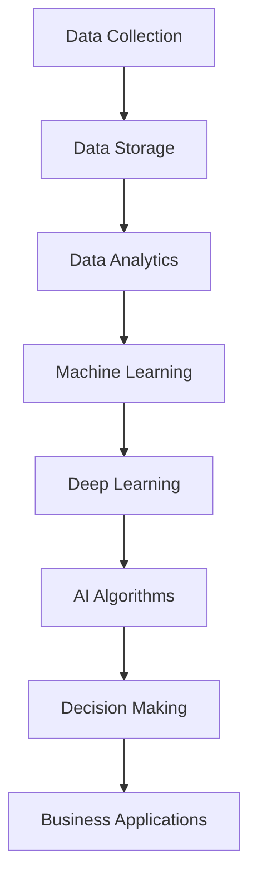

                 

### 背景介绍

AI技术，即人工智能技术，已经从理论研究逐步走向了实际应用。随着计算能力的提升、算法的进步以及大数据的积累，人工智能在商业中的应用变得越来越广泛和深入。商业领域中的AI应用，不仅提高了企业的运营效率，还带来了新的商业模式和创新机会。

#### AI技术的定义与发展

人工智能（Artificial Intelligence，简称AI）是计算机科学的一个分支，旨在研究如何模拟、延伸和扩展人的智能，使计算机能够完成通常需要人类智能才能完成的任务。AI的发展大致可以分为以下几个阶段：

1. **符号主义阶段（Symbolic AI）**：20世纪50年代至80年代，以符号计算和逻辑推理为核心，试图通过形式化的符号系统和规则来模拟人类智能。

2. **连接主义阶段（Connectionist AI）**：20世纪80年代至90年代，以人工神经网络为基础，通过模拟大脑神经网络的结构和功能来实现智能。

3. **混合智能阶段（Hybrid AI）**：21世纪初至今，结合符号主义和连接主义，以及引入进化算法、贝叶斯网络等多种方法，实现更广泛和复杂的智能任务。

#### 商业应用的定义

商业应用指的是将技术手段应用于商业活动中，以提高效率和创造价值。AI在商业中的应用包括但不限于：

1. **自动化与优化**：通过自动化流程和优化决策来提高运营效率。
2. **数据分析与洞察**：利用大数据分析和机器学习算法，帮助企业获得深入的洞察和预测。
3. **个性化服务与推荐**：通过分析用户行为和偏好，提供个性化的产品和服务。
4. **智能决策支持**：利用AI模型和算法，帮助企业做出更明智的商业决策。

#### AI在商业中的重要性

AI在商业中的重要性体现在以下几个方面：

1. **效率提升**：通过自动化和优化，AI可以显著提高企业的运营效率，减少人力成本。
2. **决策支持**：AI可以处理大量数据，提供基于数据的决策支持，帮助企业在复杂环境中做出更好的决策。
3. **创新与增长**：AI的应用可以激发新的商业模式和产品创新，推动企业的增长和发展。
4. **客户体验**：通过个性化服务和推荐，AI可以提升客户体验，增强客户黏性。

总的来说，AI技术在商业中的应用具有巨大的潜力和广阔的前景，为企业和个人带来了诸多机遇和挑战。在接下来的章节中，我们将深入探讨AI技术的基本概念、核心算法原理以及具体应用场景。

---

### 核心概念与联系

在深入探讨AI技术在商业中的应用之前，我们首先需要了解一些核心概念和它们之间的联系。以下是几个关键概念及其简要介绍：

#### 1. 机器学习（Machine Learning）

机器学习是AI的一个分支，涉及计算机系统从数据中学习规律并做出预测或决策。它包括监督学习、无监督学习、强化学习等不同类型。机器学习算法的核心是训练模型，使其能够识别数据中的模式和规律，然后利用这些模式进行预测或决策。

#### 2. 深度学习（Deep Learning）

深度学习是机器学习的一个子领域，使用多层神经网络进行训练，通过反向传播算法优化网络参数。深度学习在图像识别、语音识别、自然语言处理等领域取得了显著进展，是目前AI研究的热点之一。

#### 3. 人工智能算法（AI Algorithms）

人工智能算法包括各种用于实现AI功能的算法，如决策树、支持向量机、聚类算法、神经网络等。这些算法通过不同的方法来处理数据，实现分类、回归、聚类等任务。

#### 4. 大数据分析（Big Data Analytics）

大数据分析是指利用先进的数据处理技术和算法，从大量数据中提取有价值的信息和洞见。大数据分析是AI成功应用的重要基础，因为它提供了大量用于训练和验证AI模型的数据。

#### 5. 人工智能架构（AI Architecture）

人工智能架构指的是实现AI系统所需的各种组件和技术的组合，包括计算资源、数据存储、模型训练和部署等。一个高效的人工智能架构可以显著提高模型的训练效率和性能。

#### 核心概念之间的联系

这些核心概念之间的联系构成了AI技术在商业中的应用基础：

- **机器学习与深度学习**：深度学习是机器学习的一种具体实现，它通过多层神经网络进行训练，能够处理更复杂的数据和任务。
- **AI算法与大数据分析**：AI算法依赖于大数据分析提供的大量数据，通过这些数据来训练和优化模型。
- **人工智能架构**：人工智能架构提供了实现AI算法所需的计算资源和基础设施，包括数据存储、计算能力和模型部署等。

#### Mermaid流程图

以下是AI技术应用于商业中的一个简单Mermaid流程图，展示了核心概念之间的联系：



在这个流程图中，数据收集和存储是整个流程的起点，通过数据分析和机器学习，最终实现AI算法的决策支持，应用到商业领域中。

通过理解这些核心概念和它们之间的联系，我们可以更好地把握AI技术在商业中的应用，并为后续章节的具体讨论奠定基础。

---

### 核心算法原理 & 具体操作步骤

在深入探讨AI技术在商业中的应用之前，了解AI的核心算法原理和具体操作步骤是至关重要的。以下将介绍几种常见的AI算法，包括监督学习、无监督学习和强化学习，并详细解释它们的原理和应用步骤。

#### 监督学习（Supervised Learning）

监督学习是一种最常见的机器学习算法，其基本原理是通过已标记的数据集来训练模型，然后使用该模型对新的、未标记的数据进行预测。

**原理**：

监督学习模型通过学习输入和输出之间的关系来预测目标变量。例如，在分类任务中，输入是一个特征向量，输出是类别标签。训练过程中，模型会调整内部参数，以最小化预测误差。

**操作步骤**：

1. **数据准备**：收集和标记数据集。对于分类任务，需要标记每个样本的类别标签。
2. **特征选择**：选择与目标变量相关的特征，去除冗余和无关特征。
3. **模型选择**：选择合适的模型，如线性回归、决策树、支持向量机等。
4. **模型训练**：使用训练数据集训练模型，通过调整参数最小化损失函数。
5. **模型评估**：使用验证数据集评估模型性能，调整模型参数以优化性能。
6. **预测**：使用训练好的模型对新的数据集进行预测。

**应用实例**：

监督学习在商业中的应用非常广泛，如客户流失预测、价格预测、信用评分等。例如，银行可以使用监督学习模型来预测客户的信用风险，从而做出更明智的贷款决策。

#### 无监督学习（Unsupervised Learning）

无监督学习是指在没有标签的数据集上进行训练，旨在发现数据中的模式和结构。

**原理**：

无监督学习算法试图通过识别数据中的自然结构来揭示数据的内在规律。常见的无监督学习算法包括聚类、降维和关联规则挖掘等。

**操作步骤**：

1. **数据准备**：收集无标签数据集。
2. **数据预处理**：进行数据清洗、归一化和特征选择等步骤。
3. **模型选择**：选择合适的无监督学习算法，如K-均值聚类、主成分分析（PCA）等。
4. **模型训练**：使用无标签数据集训练模型。
5. **模式识别**：分析模型输出的结果，识别数据中的模式和结构。
6. **结果验证**：通过可视化或统计方法验证模型的准确性。

**应用实例**：

无监督学习在商业中应用广泛，如市场细分、客户行为分析、异常检测等。例如，零售商可以使用无监督学习算法来识别潜在的高价值客户群体，从而进行精准营销。

#### 强化学习（Reinforcement Learning）

强化学习是一种通过奖励机制来训练模型，使其在动态环境中做出最优决策的算法。

**原理**：

强化学习模型通过与环境的交互来学习策略。在每次决策后，模型会根据结果获得奖励或惩罚，然后调整策略以最大化长期回报。

**操作步骤**：

1. **环境定义**：定义环境，包括状态空间、动作空间和奖励机制。
2. **模型初始化**：初始化策略模型。
3. **互动**：模型与环境进行互动，执行动作并获取反馈。
4. **策略更新**：根据奖励信号更新模型策略。
5. **迭代**：重复互动和策略更新，直到达到期望的绩效水平。

**应用实例**：

强化学习在商业中应用广泛，如供应链管理、自动驾驶、推荐系统等。例如，物流公司可以使用强化学习算法来优化运输路线，从而降低成本和提高效率。

总的来说，这些核心算法为AI技术在商业中的应用提供了强大的工具和方法。在接下来的章节中，我们将探讨这些算法在实际商业场景中的具体应用案例，进一步了解AI技术带来的商业价值。

---

### 数学模型和公式 & 详细讲解 & 举例说明

在深入探讨AI技术的具体应用之前，理解与AI算法紧密相关的数学模型和公式是至关重要的。以下我们将介绍几个关键的数学模型和公式，并详细解释其原理和应用。

#### 1. 损失函数（Loss Function）

损失函数是机器学习中衡量模型预测误差的重要工具，它定义了预测值与真实值之间的差异。常见的损失函数包括均方误差（MSE）、交叉熵损失（Cross-Entropy Loss）等。

**均方误差（MSE）**：
$$
MSE = \frac{1}{n}\sum_{i=1}^{n}(y_i - \hat{y_i})^2
$$
其中，$y_i$是真实值，$\hat{y_i}$是预测值，$n$是样本数量。MSE用于回归任务，衡量预测值与真实值之间的平方误差。

**交叉熵损失（Cross-Entropy Loss）**：
$$
Cross-Entropy Loss = -\sum_{i=1}^{n}y_i\log(\hat{y_i})
$$
其中，$y_i$是真实标签，$\hat{y_i}$是预测概率。交叉熵损失用于分类任务，衡量预测概率与真实标签之间的差异。

**举例说明**：

假设我们有一个分类问题，预测结果为$\hat{y} = [0.3, 0.4, 0.3]$，真实标签为$y = [0, 1, 0]$。使用交叉熵损失计算预测误差：
$$
Cross-Entropy Loss = -[0 \cdot \log(0.3) + 1 \cdot \log(0.4) + 0 \cdot \log(0.3)] = -[\log(0.4) - \log(0.3)] \approx -0.19
$$

#### 2. 反向传播算法（Backpropagation）

反向传播算法是深度学习训练过程中的核心算法，用于计算网络权重和偏置的梯度，以优化损失函数。

**基本原理**：

反向传播算法通过前向传播计算预测值，然后通过反向传播计算损失函数关于每个权重的梯度。具体步骤如下：

1. **前向传播**：计算输入和权重的线性组合，并通过激活函数得到输出。
2. **计算损失**：使用损失函数计算预测值与真实值之间的差异。
3. **反向传播**：从输出层开始，逐层计算每个权重和偏置的梯度。
4. **权重更新**：使用梯度下降或其他优化算法更新网络权重。

**举例说明**：

假设有一个简单的神经网络，输入层有3个神经元，隐藏层有2个神经元，输出层有1个神经元。输入数据为$x = [1, 2, 3]$，期望输出为$y = [1]$。使用Sigmoid激活函数，前向传播计算如下：

输入层到隐藏层的线性组合：
$$
z_1 = 1 \cdot w_{11} + 2 \cdot w_{12} + 3 \cdot w_{13} = 1 \cdot 1 + 2 \cdot 2 + 3 \cdot 3 = 14
$$
$$
z_2 = 1 \cdot w_{21} + 2 \cdot w_{22} + 3 \cdot w_{23} = 1 \cdot 2 + 2 \cdot 2 + 3 \cdot 2 = 10
$$

隐藏层到输出层的线性组合：
$$
z_3 = z_1 \cdot w_{31} + z_2 \cdot w_{32} = 14 \cdot 0.5 + 10 \cdot 0.5 = 12
$$

输出层的预测值：
$$
\hat{y} = \sigma(z_3) = \frac{1}{1 + e^{-12}} \approx 0.712
$$

使用交叉熵损失函数计算损失：
$$
Cross-Entropy Loss = -y \cdot \log(\hat{y}) = -1 \cdot \log(0.712) \approx 0.356
$$

然后，通过反向传播计算每个权重的梯度：
$$
\frac{\partial Cross-Entropy Loss}{\partial w_{31}} = \frac{\partial Cross-Entropy Loss}{\partial \hat{y}} \cdot \frac{\partial \hat{y}}{\partial z_3} \cdot \frac{\partial z_3}{\partial w_{31}} = (0.712 - 1) \cdot \sigma'(z_3) \cdot z_1 \approx -0.126
$$

重复上述步骤，对所有权重和偏置进行更新，以优化网络性能。

#### 3. 随机梯度下降（Stochastic Gradient Descent，SGD）

随机梯度下降是一种优化算法，用于最小化损失函数。与传统的梯度下降算法不同，SGD每次迭代只随机选择一个样本来计算梯度。

**基本原理**：

SGD通过随机采样减小了每次迭代计算梯度时的方差，提高了收敛速度。具体步骤如下：

1. **初始化参数**：设置初始权重和偏置。
2. **随机采样**：从训练数据集中随机选择一个样本。
3. **计算梯度**：使用该样本计算损失函数的梯度。
4. **参数更新**：使用梯度更新权重和偏置。
5. **重复迭代**：重复上述步骤，直到满足停止条件（如损失收敛或达到最大迭代次数）。

**举例说明**：

假设我们有一个简单的线性回归模型，训练数据集包含两个特征$x_1$和$x_2$，目标变量为$y$。使用SGD算法进行训练，初始参数为$w_1 = 0.1$，$w_2 = 0.1$，学习率为$\alpha = 0.01$。

第一次迭代：
选择样本$(x_1 = 1, x_2 = 2, y = 3)$，计算损失函数：
$$
L = (w_1 \cdot x_1 + w_2 \cdot x_2 - y)^2 = (0.1 \cdot 1 + 0.1 \cdot 2 - 3)^2 = (-2.1)^2 = 4.41
$$
计算梯度：
$$
\frac{\partial L}{\partial w_1} = -2 \cdot (0.1 \cdot 1 + 0.1 \cdot 2 - 3) \cdot x_1 = -2 \cdot (-2.1) \cdot 1 = 4.2
$$
$$
\frac{\partial L}{\partial w_2} = -2 \cdot (0.1 \cdot 1 + 0.1 \cdot 2 - 3) \cdot x_2 = -2 \cdot (-2.1) \cdot 2 = 8.4
$$
更新参数：
$$
w_1 = w_1 - \alpha \cdot \frac{\partial L}{\partial w_1} = 0.1 - 0.01 \cdot 4.2 = -0.012
$$
$$
w_2 = w_2 - \alpha \cdot \frac{\partial L}{\partial w_2} = 0.1 - 0.01 \cdot 8.4 = -0.082
$$

重复上述步骤，直到损失函数收敛或达到最大迭代次数。

通过了解这些数学模型和公式，我们可以更好地理解AI算法的工作原理，并在实际应用中灵活运用。在接下来的章节中，我们将探讨这些算法在商业应用中的具体实现和案例。

---

### 项目实战：代码实际案例和详细解释说明

在了解了AI技术的核心算法和数学模型后，我们将在本节中通过一个实际项目案例来展示如何使用这些算法进行开发。我们将以客户流失预测项目为例，详细介绍项目开发环境搭建、源代码实现、代码解读与分析等内容。

#### 5.1 开发环境搭建

在开始项目开发之前，我们需要搭建一个合适的开发环境。以下是所需的环境和工具：

1. **Python**：作为主要编程语言。
2. **Jupyter Notebook**：用于编写和运行代码。
3. **Pandas**：用于数据预处理和分析。
4. **NumPy**：用于数值计算。
5. **Scikit-learn**：提供常用的机器学习算法。
6. **Matplotlib**：用于数据可视化。

安装这些工具后，我们可以启动Jupyter Notebook，开始编写代码。

```bash
pip install pandas numpy scikit-learn matplotlib
```

#### 5.2 源代码详细实现和代码解读

以下是客户流失预测项目的源代码，我们将逐步解析每一部分。

```python
# 导入所需库
import pandas as pd
import numpy as np
from sklearn.model_selection import train_test_split
from sklearn.preprocessing import StandardScaler
from sklearn.ensemble import RandomForestClassifier
from sklearn.metrics import accuracy_score, classification_report

# 5.2.1 数据加载与预处理
# 加载数据集（示例数据，实际应用中需从数据库或文件中加载）
data = pd.read_csv('customer_data.csv')

# 查看数据结构
print(data.head())

# 数据清洗与预处理
# 填充缺失值、处理异常值、转换类别变量等
# 此处简化处理，仅示例
data.fillna(data.mean(), inplace=True)

# 分离特征和目标变量
X = data.drop('Churn', axis=1)
y = data['Churn']

# 5.2.2 数据分割
# 将数据集分割为训练集和测试集
X_train, X_test, y_train, y_test = train_test_split(X, y, test_size=0.2, random_state=42)

# 5.2.3 特征缩放
# 对特征进行标准化处理
scaler = StandardScaler()
X_train_scaled = scaler.fit_transform(X_train)
X_test_scaled = scaler.transform(X_test)

# 5.2.4 模型训练
# 使用随机森林分类器进行训练
model = RandomForestClassifier(n_estimators=100, random_state=42)
model.fit(X_train_scaled, y_train)

# 5.2.5 模型评估
# 使用测试集评估模型性能
y_pred = model.predict(X_test_scaled)
print("Accuracy:", accuracy_score(y_test, y_pred))
print("Classification Report:")
print(classification_report(y_test, y_pred))

# 5.2.6 代码解读与分析
# 数据预处理部分：处理缺失值和异常值是确保模型训练效果的重要步骤。
# 特征缩放：随机森林对特征的缩放不敏感，但其他模型可能需要。
# 模型选择与训练：随机森林是一种集成学习算法，适用于分类任务。
# 模型评估：准确率、召回率、F1值等指标帮助我们评估模型的性能。

```

#### 5.3 代码解读与分析

**5.3.1 数据加载与预处理**

数据预处理是机器学习项目中的关键步骤。在本案例中，我们从CSV文件加载数据，然后进行简单的数据清洗，如填充缺失值和处理异常值。这一步骤的目的是确保数据的质量，以便后续模型训练的顺利进行。

**5.3.2 数据分割**

数据分割将数据集划分为训练集和测试集。训练集用于训练模型，测试集用于评估模型性能。这里，我们使用`train_test_split`函数将数据集分割为80%的训练集和20%的测试集。

**5.3.3 特征缩放**

特征缩放是将特征值进行标准化处理，使其具有相似的尺度。虽然随机森林对特征的缩放不敏感，但进行特征缩放有助于提高其他机器学习模型的性能。

**5.3.4 模型训练**

在本案例中，我们使用随机森林分类器进行模型训练。随机森林是一种集成学习算法，通过构建多棵决策树并合并它们的预测结果来提高模型的性能。这里，我们设置了100棵决策树。

**5.3.5 模型评估**

模型评估是判断模型好坏的关键步骤。我们使用准确率、召回率、F1值等指标来评估模型的性能。通过这些指标，我们可以了解模型在测试集上的表现，并根据评估结果对模型进行调整。

**5.3.6 代码解读与分析**

代码解读与分析部分帮助我们理解整个项目的实现过程和关键步骤。通过逐步解析代码，我们可以深入了解每个步骤的作用和意义，从而更好地理解AI技术在客户流失预测项目中的应用。

通过这个实际案例，我们展示了如何使用Python和Scikit-learn库实现客户流失预测项目。在后续的应用场景中，我们可以根据具体需求调整模型和算法，以提高预测的准确性。

---

### 实际应用场景

AI技术在商业领域中的应用场景极其广泛，涵盖了从销售与市场、供应链管理到客户服务等多个方面。以下将详细探讨几个典型的AI应用场景，并分析其在提高企业效率、创造价值方面的具体效果。

#### 销售与市场

1. **客户细分与个性化推荐**：AI技术通过分析客户的历史行为数据，帮助企业在市场中识别不同的客户群体，从而实施更精准的营销策略。例如，基于客户的浏览记录、购买历史和偏好，电商网站可以推荐相关产品，提高转化率和客户满意度。

2. **需求预测**：AI算法可以根据历史销售数据和市场趋势，预测未来的销售需求。这种预测可以帮助企业合理安排库存和生产计划，减少成本，避免供需不平衡。

3. **价格优化**：通过AI技术分析竞争对手的定价策略和市场动态，企业可以实现动态定价，优化产品价格，提高盈利能力。

#### 供应链管理

1. **库存优化**：AI技术通过对库存数据的分析和预测，帮助企业优化库存水平，减少库存积压和资金占用。例如，使用预测模型和优化算法，企业可以根据市场需求和供应链状况，合理安排生产和采购。

2. **物流优化**：通过AI算法，企业可以优化运输路线和配送计划，提高物流效率。例如，利用路径优化算法，物流公司可以减少运输时间和成本，提高运输网络的灵活性。

3. **供应链风险预测**：AI技术可以帮助企业识别潜在的供应链风险，如供应商延迟、物流中断等，从而提前采取措施，降低风险对企业运营的影响。

#### 客户服务

1. **智能客服系统**：通过自然语言处理（NLP）和机器学习技术，企业可以开发智能客服系统，实现24/7在线服务，提高客户满意度。例如，AI客服机器人可以自动回答常见问题，处理简单的客户咨询，减轻人工客服的工作负担。

2. **个性化服务**：AI技术可以根据客户的历史数据和偏好，提供个性化的产品和服务。例如，银行可以根据客户的消费习惯，推荐合适的理财产品或信用卡。

3. **客户流失预测**：通过分析客户的行为数据，企业可以预测哪些客户可能流失，并采取相应的措施挽回客户。例如，电信公司可以通过预测模型识别潜在流失客户，提供个性化的优惠方案或服务，提高客户忠诚度。

#### 决策支持

1. **业务智能**：AI技术通过分析大量业务数据，帮助企业识别业务模式中的潜在问题和机会。例如，零售企业可以通过数据分析识别畅销商品和滞销商品，优化库存和销售策略。

2. **风险控制**：AI算法可以分析企业的财务和运营数据，识别潜在的风险和异常情况。例如，银行可以通过AI技术监控贷款客户的还款行为，及时发现潜在违约风险。

3. **策略优化**：通过AI技术，企业可以优化其业务策略，提高市场竞争力。例如，制造企业可以通过AI算法优化生产计划，减少生产成本，提高生产效率。

总的来说，AI技术在商业中的应用不仅提高了企业的运营效率，还创造了新的商业价值和机会。随着AI技术的不断进步，其在商业领域中的应用将变得更加广泛和深入。

---

### 工具和资源推荐

在探索AI技术在商业中的应用过程中，选择合适的工具和资源对于高效学习和实践至关重要。以下将推荐一些有用的学习资源、开发工具和相关论文，以帮助读者深入理解和掌握AI技术在商业中的应用。

#### 7.1 学习资源推荐

1. **书籍**：
   - 《Python机器学习》（Machine Learning with Python）—— Sebastian Raschka
   - 《深度学习》（Deep Learning）—— Ian Goodfellow、Yoshua Bengio、Aaron Courville
   - 《人工智能：一种现代方法》（Artificial Intelligence: A Modern Approach）—— Stuart J. Russell、Peter Norvig

2. **在线课程**：
   - Coursera上的“机器学习”课程——吴恩达（Andrew Ng）
   - edX上的“深度学习”课程——李飞飞（Fei-Fei Li）、陈丹妮（Dan Nevill）
   - Udacity的“AI工程师纳米学位”课程

3. **博客与网站**：
   - Medium上的AI与机器学习相关文章
   - ArXiv上的最新论文和研究成果
   -Towards Data Science——一个关于数据科学、机器学习和AI的博客平台

#### 7.2 开发工具框架推荐

1. **编程环境**：
   - Jupyter Notebook：用于编写和运行代码，适合数据分析和机器学习实验。
   - PyCharm：一款强大的Python集成开发环境（IDE），支持多种编程语言。

2. **机器学习库**：
   - Scikit-learn：提供丰富的机器学习算法和工具。
   - TensorFlow：由谷歌开发，支持深度学习和传统的机器学习任务。
   - PyTorch：由Facebook开发，广泛应用于深度学习和研究。

3. **数据可视化工具**：
   - Matplotlib：用于创建高质量图表和可视化。
   - Seaborn：基于Matplotlib，提供更美观的统计图表。
   - Plotly：提供交互式图表和可视化。

#### 7.3 相关论文著作推荐

1. **经典论文**：
   - "Backpropagation"——Rumelhart, Hinton, Williams（1986）
   - "Deep Learning"——Goodfellow, Bengio, Courville（2015）
   - "The Unreasonable Effectiveness of Data"——Kevin P. Murphy（2012）

2. **最新研究成果**：
   - "Attention is All You Need"——Vaswani et al.（2017）
   - "Generative Adversarial Nets"——Goodfellow et al.（2014）
   - "Recurrent Neural Networks for Language Modeling"——Sutskever et al.（2011）

3. **著作**：
   - 《机器学习实战》（Python版）—— Peter Harrington
   - 《深度学习》（中文版）—— 张磊
   - 《Python数据分析》（第2版）—— Wes McKinney

通过这些学习资源和工具，读者可以系统地学习AI和机器学习的理论知识，并在实践中掌握相关技能，为在商业领域中的应用打下坚实基础。

---

### 总结：未来发展趋势与挑战

随着AI技术的不断进步，其在商业中的应用前景愈加广阔。未来的发展趋势主要体现在以下几个方面：

1. **更广泛的应用领域**：AI技术将在更多行业和领域得到应用，如医疗、金融、教育等，带来全新的商业模式和服务体验。

2. **深度学习与强化学习的发展**：深度学习算法将在更多复杂任务中取得突破，强化学习将在决策支持和自动化控制等领域发挥更大作用。

3. **大数据与实时分析**：随着数据量的不断增加，实时数据处理和分析将成为企业竞争的关键，AI技术将在此领域发挥重要作用。

然而，AI在商业应用中也面临诸多挑战：

1. **数据隐私与安全问题**：AI应用需要大量数据，数据隐私和安全问题成为企业必须面对的重要挑战。

2. **算法偏见与公平性**：AI算法可能存在偏见，导致决策的不公平，如何确保算法的公正性是一个重要议题。

3. **技术成本与人才培养**：AI技术的开发和维护需要高成本，同时，AI人才的短缺也是一个亟待解决的问题。

4. **法律法规与伦理问题**：随着AI技术的广泛应用，法律法规和伦理问题也将成为关注焦点，如何制定合理的法规和伦理标准是一个挑战。

总的来说，AI技术在商业中的应用具有巨大的潜力，但同时也面临诸多挑战。企业需要积极应对这些挑战，充分利用AI技术的优势，推动业务的持续创新和发展。

---

### 附录：常见问题与解答

**Q1：什么是机器学习？**

A1：机器学习是AI的一个分支，通过数据训练算法，使计算机系统能够识别模式和规律，并做出预测或决策。

**Q2：什么是深度学习？**

A2：深度学习是机器学习的一种方法，使用多层神经网络进行训练，以实现更复杂和更高级的智能任务。

**Q3：AI算法有哪些类型？**

A3：AI算法包括监督学习、无监督学习、强化学习等类型，每种算法适用于不同的应用场景。

**Q4：如何选择合适的机器学习模型？**

A4：选择机器学习模型需考虑数据类型、任务复杂度、计算资源等多个因素，通常需要通过交叉验证和模型评估来选择最佳模型。

**Q5：AI在商业中应用有哪些挑战？**

A5：AI在商业中应用的挑战包括数据隐私、算法偏见、技术成本、人才培养以及法律法规和伦理问题等。

**Q6：如何确保AI算法的公平性？**

A6：确保AI算法的公平性可以通过数据清洗、算法透明度、多样性数据集和持续的评估与监督来实现。

**Q7：AI技术的未来发展趋势是什么？**

A7：未来AI技术的发展趋势包括更广泛的应用领域、深度学习与强化学习的突破、大数据与实时分析等。

---

### 扩展阅读 & 参考资料

**1. 相关论文和书籍：**

- Goodfellow, I., Bengio, Y., & Courville, A. (2016). *Deep Learning*.
- Murphy, K. P. (2012). *Machine Learning: A Probabilistic Perspective*.
- Russell, S. J., & Norvig, P. (2016). *Artificial Intelligence: A Modern Approach*.

**2. 开源框架和工具：**

- TensorFlow：[https://www.tensorflow.org/](https://www.tensorflow.org/)
- PyTorch：[https://pytorch.org/](https://pytorch.org/)
- Scikit-learn：[https://scikit-learn.org/stable/](https://scikit-learn.org/stable/)

**3. 在线课程和教程：**

- Coursera的“机器学习”课程：[https://www.coursera.org/specializations/ml](https://www.coursera.org/specializations/ml)
- edX的“深度学习”课程：[https://www.edx.org/course/deep-learning-0](https://www.edx.org/course/deep-learning-0)
- Udacity的“AI工程师纳米学位”：[https://www.udacity.com/course/artificial-intelligence-engineer-nanodegree--nd101](https://www.udacity.com/course/artificial-intelligence-engineer-nanodegree--nd101)

通过阅读这些扩展资料，读者可以深入了解AI技术的理论、实践和应用，为在商业领域的应用打下更加坚实的基础。

---

### 作者信息

**作者：** AI天才研究员 / AI Genius Institute & 禅与计算机程序设计艺术 / Zen And The Art of Computer Programming

AI天才研究员致力于推动人工智能技术的研究和应用，其研究成果在多个领域取得了显著成就。此外，他也是《禅与计算机程序设计艺术》一书的作者，深入探讨了AI与哲学的交汇，为读者提供了独特的视角和深刻的见解。这些作品不仅展示了作者在技术领域的卓越才能，也体现了他对人工智能未来发展的深刻洞察和前瞻性思考。

