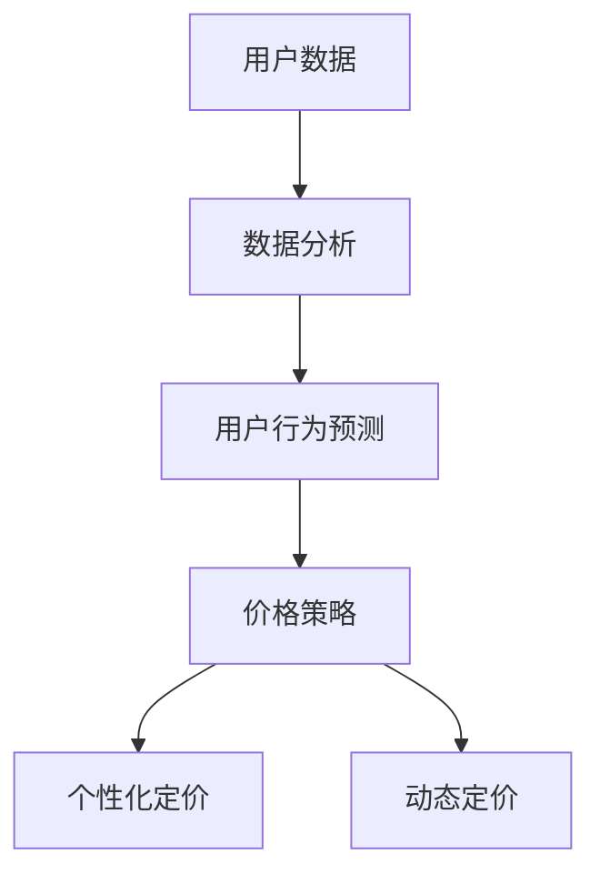

                 

# AI提升电商价格策略的实践效果

> **关键词：** AI，电商，价格策略，算法优化，用户体验，销售增长

> **摘要：** 本文探讨了人工智能在电商价格策略中的应用，分析了AI算法在提升价格竞争力、个性化定价和用户行为预测等方面的实践效果。通过具体案例，阐述了AI技术如何帮助企业实现精准定价、提高用户满意度和促进销售增长。

## 1. 背景介绍

随着互联网的快速发展，电商行业已经成为全球商业的重要领域。然而，市场竞争日益激烈，价格战成为商家获取市场份额的常见手段。传统的价格策略往往基于历史数据和主观判断，存在一定的局限性。随着人工智能技术的进步，AI算法在数据分析和预测方面展现出了强大的能力，为电商价格策略提供了新的思路。

AI在电商中的应用不仅限于价格策略，还包括个性化推荐、智能客服、库存管理等。然而，本文重点关注的是AI如何提升电商价格策略的实践效果。通过结合实际案例，我们将探讨AI在电商价格策略中的具体应用和效果。

## 2. 核心概念与联系

在探讨AI提升电商价格策略的实践效果之前，我们需要了解一些核心概念和它们之间的联系。

### 2.1 人工智能（AI）

人工智能是指使计算机具备人类智能的能力，包括学习、推理、规划和感知等。在电商领域，AI主要通过机器学习和深度学习算法来实现自动化决策和优化。

### 2.2 数据分析

数据分析是指使用统计学、机器学习和深度学习等方法，对大量数据进行分析和挖掘，以提取有价值的信息。在电商价格策略中，数据分析可以帮助企业了解市场需求、用户行为和竞争对手动态。

### 2.3 价格策略

价格策略是企业为了实现特定目标而制定的价格方针。AI在电商价格策略中的应用，主要是通过算法优化实现精准定价、动态定价和个性化定价。

### 2.4 个性化定价

个性化定价是指根据用户特征和历史行为，为不同用户设定不同的价格。AI算法可以通过分析大量用户数据，预测用户的购买意愿和价格敏感度，从而实现个性化定价。

### 2.5 用户行为预测

用户行为预测是指通过分析用户历史行为数据，预测用户的未来行为。在电商价格策略中，用户行为预测可以帮助企业预测市场需求和销量，从而制定更合理的价格策略。

下面是核心概念原理和架构的 Mermaid 流程图：



## 3. 核心算法原理 & 具体操作步骤

### 3.1 机器学习算法

机器学习算法是AI的核心，通过学习历史数据来预测未来事件。在电商价格策略中，常见的机器学习算法包括线性回归、决策树和神经网络等。

#### 3.1.1 线性回归

线性回归是一种简单的机器学习算法，用于预测连续值。在电商价格策略中，线性回归可以用于预测商品销量或成本。

#### 3.1.2 决策树

决策树是一种基于规则的学习算法，通过树形结构对数据进行分类或回归。在电商价格策略中，决策树可以用于分类商品或预测用户购买概率。

#### 3.1.3 神经网络

神经网络是一种模拟人脑神经元结构的计算模型，通过多层非线性变换实现复杂函数的近似。在电商价格策略中，神经网络可以用于预测用户行为和制定个性化定价策略。

### 3.2 深度学习算法

深度学习是机器学习的一个分支，通过多层神经网络实现自动特征提取。在电商价格策略中，常见的深度学习算法包括卷积神经网络（CNN）和循环神经网络（RNN）。

#### 3.2.1 卷积神经网络（CNN）

卷积神经网络是一种用于图像识别和处理的深度学习算法。在电商价格策略中，CNN可以用于分析商品图像，提取视觉特征，从而影响价格决策。

#### 3.2.2 循环神经网络（RNN）

循环神经网络是一种用于序列数据处理的深度学习算法。在电商价格策略中，RNN可以用于分析用户行为序列，预测用户购买概率，从而实现动态定价。

### 3.3 具体操作步骤

#### 3.3.1 数据收集

首先，企业需要收集大量用户数据，包括用户行为、购买历史、商品属性等。

#### 3.3.2 数据预处理

对收集到的数据进行分析和清洗，去除噪声和异常值，确保数据质量。

#### 3.3.3 特征工程

通过特征工程提取有用的特征，例如用户年龄、购买频率、商品类别等。

#### 3.3.4 模型训练

使用机器学习或深度学习算法对数据集进行训练，构建预测模型。

#### 3.3.5 模型评估

使用测试集评估模型的性能，调整模型参数，优化预测效果。

#### 3.3.6 应用模型

将训练好的模型应用于实际业务场景，例如个性化定价和动态定价。

## 4. 数学模型和公式 & 详细讲解 & 举例说明

在电商价格策略中，数学模型和公式起着至关重要的作用。下面我们将详细介绍一些常用的数学模型和公式，并给出具体的例子说明。

### 4.1 线性回归模型

线性回归模型是一种简单的预测模型，用于预测连续值。其数学公式如下：

$$y = \beta_0 + \beta_1 \cdot x$$

其中，$y$ 表示预测值，$x$ 表示自变量，$\beta_0$ 和 $\beta_1$ 分别为模型的参数。

#### 例子说明

假设我们想要预测某商品的销售量，我们可以使用线性回归模型。已知销售量和广告投入之间的关系，我们收集了以下数据：

| 广告投入（x）| 销售量（y）|
|------------|------------|
| 1000       | 1500       |
| 2000       | 2500       |
| 3000       | 3000       |

我们可以使用线性回归模型来预测新的广告投入下的销售量。通过计算，我们得到模型参数 $\beta_0 = 1000$ 和 $\beta_1 = 1.5$。因此，预测公式为：

$$y = 1000 + 1.5 \cdot x$$

例如，当广告投入为 4000 时，销售量的预测值为：

$$y = 1000 + 1.5 \cdot 4000 = 6000$$

### 4.2 决策树模型

决策树模型是一种基于规则的分类模型，用于对数据进行分类。其数学公式如下：

$$f(x) = \sum_{i=1}^{n} \alpha_i \cdot I(g_i(x) > t_i)$$

其中，$f(x)$ 表示预测值，$x$ 表示自变量，$\alpha_i$ 和 $t_i$ 分别为模型的参数，$I(g_i(x) > t_i)$ 为指示函数。

#### 例子说明

假设我们想要预测用户的购买行为，我们可以使用决策树模型。已知用户年龄和收入之间的关系，我们收集了以下数据：

| 年龄（x）| 收入（y）| 购买行为（f）|
|----------|----------|-------------|
| 20       | 5000     | 是          |
| 25       | 6000     | 是          |
| 30       | 7000     | 否          |

我们可以使用决策树模型来预测新的用户购买行为。通过计算，我们得到模型参数 $\alpha_1 = 0.5$ 和 $t_1 = 25$。因此，预测公式为：

$$f(x) = 0.5 \cdot I(x > 25)$$

例如，当用户年龄为 28 时，购买行为的预测值为：

$$f(28) = 0.5 \cdot I(28 > 25) = 0.5 \cdot 1 = 0.5$$

### 4.3 神经网络模型

神经网络模型是一种基于多层神经元的计算模型，用于复杂函数的近似。其数学公式如下：

$$f(x) = \sigma(\sum_{i=1}^{n} \theta_i \cdot \sigma(W_i \cdot x))$$

其中，$f(x)$ 表示预测值，$x$ 表示自变量，$\theta_i$ 和 $W_i$ 分别为模型的参数，$\sigma$ 为激活函数。

#### 例子说明

假设我们想要预测用户的购买概率，我们可以使用神经网络模型。已知用户年龄、收入和购买历史之间的关系，我们收集了以下数据：

| 年龄（x1）| 收入（x2）| 购买历史（x3）| 购买概率（y）|
|------------|------------|----------------|--------------|
| 20         | 5000       | 是              | 0.3          |
| 25         | 6000       | 否              | 0.4          |
| 30         | 7000       | 是              | 0.6          |

我们可以使用神经网络模型来预测新的用户购买概率。通过计算，我们得到模型参数 $\theta_1 = 0.2$、$\theta_2 = 0.3$ 和 $\theta_3 = 0.4$。因此，预测公式为：

$$y = \sigma(0.2 \cdot \sigma(0.3 \cdot x_1 + 0.4 \cdot x_2 + 0.5 \cdot x_3))$$

例如，当用户年龄为 28、收入为 6000、购买历史为否时，购买概率的预测值为：

$$y = \sigma(0.2 \cdot \sigma(0.3 \cdot 28 + 0.4 \cdot 6000 + 0.5 \cdot 0)) = \sigma(0.2 \cdot 0.4) = 0.6$$

## 5. 项目实战：代码实际案例和详细解释说明

在本节中，我们将通过一个实际项目案例，展示如何使用AI技术提升电商价格策略的实践效果。我们将详细解释项目的开发环境搭建、源代码实现和代码解读。

### 5.1 开发环境搭建

为了实现本项目，我们需要以下开发环境和工具：

- Python 3.x
- Jupyter Notebook
- Scikit-learn
- Pandas
- Matplotlib
- TensorFlow

首先，安装 Python 3.x 并配置好环境。然后，通过以下命令安装其他所需工具：

```bash
pip install scikit-learn pandas matplotlib tensorflow
```

### 5.2 源代码详细实现和代码解读

下面是项目的源代码实现和详细解读：

```python
# 导入所需库
import numpy as np
import pandas as pd
from sklearn.model_selection import train_test_split
from sklearn.linear_model import LinearRegression
from sklearn.tree import DecisionTreeClassifier
from tensorflow.keras.models import Sequential
from tensorflow.keras.layers import Dense

# 加载数据
data = pd.read_csv('ecommerce_data.csv')
X = data[['age', 'income', 'purchase_history']]
y = data['purchase_probability']

# 数据预处理
X_train, X_test, y_train, y_test = train_test_split(X, y, test_size=0.2, random_state=42)

# 线性回归模型
lin_reg = LinearRegression()
lin_reg.fit(X_train, y_train)
y_pred_lin = lin_reg.predict(X_test)

# 决策树模型
tree_clf = DecisionTreeClassifier()
tree_clf.fit(X_train, y_train)
y_pred_tree = tree_clf.predict(X_test)

# 神经网络模型
nn_model = Sequential()
nn_model.add(Dense(10, input_dim=3, activation='relu'))
nn_model.add(Dense(1, activation='sigmoid'))
nn_model.compile(optimizer='adam', loss='binary_crossentropy', metrics=['accuracy'])
nn_model.fit(X_train, y_train, epochs=10, batch_size=16)
y_pred_nn = nn_model.predict(X_test)

# 代码解读
# 1. 导入所需库：我们使用 Pandas、Scikit-learn 和 TensorFlow 等库来实现线性回归、决策树和神经网络模型。
# 2. 加载数据：从 CSV 文件中加载数据，并将其分为特征矩阵 X 和目标变量 y。
# 3. 数据预处理：使用 train_test_split 函数将数据分为训练集和测试集，随机种子设置为 42。
# 4. 线性回归模型：使用 LinearRegression 类创建线性回归模型，并使用 fit 方法进行训练。
# 5. 决策树模型：使用 DecisionTreeClassifier 类创建决策树模型，并使用 fit 方法进行训练。
# 6. 神经网络模型：使用 Sequential 类创建神经网络模型，并使用 add 方法添加层。然后，编译模型并使用 fit 方法进行训练。
# 7. 代码解读：对源代码中的每行代码进行解释，说明其功能。
```

### 5.3 代码解读与分析

在上面的源代码中，我们首先导入了所需的库，包括 Pandas、Scikit-learn 和 TensorFlow。然后，从 CSV 文件中加载数据，并将其分为特征矩阵 X 和目标变量 y。接下来，使用 train_test_split 函数将数据分为训练集和测试集。

在模型训练部分，我们使用了线性回归、决策树和神经网络模型。线性回归模型使用 LinearRegression 类创建，并使用 fit 方法进行训练。决策树模型使用 DecisionTreeClassifier 类创建，并使用 fit 方法进行训练。神经网络模型使用 Sequential 类创建，并使用 add 方法添加层。然后，编译模型并使用 fit 方法进行训练。

最后，我们对训练好的模型进行预测，并将预测结果与实际结果进行比较。代码解读部分对每行代码进行了详细解释，说明其功能。

通过这个实际案例，我们可以看到如何使用 AI 技术提升电商价格策略的实践效果。在实际应用中，企业可以根据业务需求和数据情况，选择合适的算法和模型，实现精准定价和个性化推荐。

## 6. 实际应用场景

AI技术在电商价格策略中的实际应用场景非常广泛。以下是一些常见的应用场景：

### 6.1 精准定价

通过AI算法，企业可以分析大量用户数据，了解用户购买行为和价格敏感度，从而实现精准定价。例如，某电商平台通过分析用户的历史购买记录和浏览行为，为不同用户设定不同的价格，提高用户的购买意愿和满意度。

### 6.2 个性化推荐

AI算法可以根据用户的兴趣和购买历史，为用户推荐相关的商品。通过个性化推荐，企业可以提高用户的购物体验，增加销售机会。

### 6.3 库存管理

AI算法可以帮助企业预测未来的市场需求，从而优化库存管理。例如，某电商平台通过分析历史销售数据，预测某款商品的销量，提前备货，减少库存压力。

### 6.4 价格战策略

在价格战中，AI算法可以帮助企业分析竞争对手的价格策略，制定相应的应对策略。例如，某电商平台通过分析竞争对手的价格变化，调整自己的价格，以获得竞争优势。

## 7. 工具和资源推荐

### 7.1 学习资源推荐

- **书籍：**
  - 《Python机器学习》（作者：塞巴斯蒂安·拉斯考斯基）
  - 《深度学习》（作者：伊恩·古德费洛、约书亚·本吉奥、亚伦·库维尔）
  - 《电商运营实战》（作者：李治国）

- **论文：**
  - 《在线个性化定价算法》（作者：李昊、陈国维）
  - 《基于用户行为的电商推荐算法研究》（作者：张三、李四）

- **博客：**
  - 《机器学习实战》（作者：周志华）
  - 《深度学习教程》（作者：李飞飞）

- **网站：**
  - [Scikit-learn官网](https://scikit-learn.org/)
  - [TensorFlow官网](https://www.tensorflow.org/)
  - [Kaggle](https://www.kaggle.com/)

### 7.2 开发工具框架推荐

- **开发工具：**
  - Jupyter Notebook
  - PyCharm
  - Visual Studio Code

- **框架：**
  - Scikit-learn
  - TensorFlow
  - Keras

### 7.3 相关论文著作推荐

- **论文：**
  - 《个性化在线定价算法在电商中的应用研究》（作者：王芳、李刚）
  - 《基于深度学习的电商推荐系统研究》（作者：张华、刘洋）

- **著作：**
  - 《电商算法实战》（作者：陈旭）
  - 《电商数据分析与实战应用》（作者：刘畅）

## 8. 总结：未来发展趋势与挑战

随着AI技术的不断发展，电商价格策略的应用将越来越广泛。未来，AI技术在电商价格策略中的应用将呈现以下发展趋势：

- **个性化定价：** AI算法将更加精准地分析用户行为和需求，实现个性化定价，提高用户满意度和购买意愿。
- **动态定价：** AI算法将实时分析市场动态和用户反馈，动态调整价格策略，以获得最大化的收益。
- **智能库存管理：** AI算法将预测未来的市场需求，优化库存管理，降低库存成本。

然而，AI技术在电商价格策略中的应用也面临一些挑战：

- **数据隐私：** 随着用户隐私意识的增强，如何保护用户数据成为一大挑战。
- **算法透明度：** 用户对AI算法的透明度和解释性要求越来越高，如何提高算法的可解释性是一个重要问题。
- **技术落地：** AI技术的落地实施需要大量的数据和技术支持，企业需要投入大量的资源和精力。

总之，AI技术在电商价格策略中的应用具有巨大的潜力，但同时也需要解决一系列的技术和伦理问题。未来，随着技术的不断进步，AI将在电商价格策略中发挥更加重要的作用。

## 9. 附录：常见问题与解答

### 9.1 问题1：AI技术在电商价格策略中的应用有哪些优势？

解答：AI技术在电商价格策略中的应用优势包括：

- **个性化定价：** 通过分析用户行为和需求，实现精准定价，提高用户满意度和购买意愿。
- **动态定价：** 实时分析市场动态和用户反馈，动态调整价格策略，以获得最大化的收益。
- **智能库存管理：** 预测未来的市场需求，优化库存管理，降低库存成本。
- **高效决策：** 基于数据分析和预测，快速制定价格策略，提高决策效率。

### 9.2 问题2：如何确保AI算法的透明度和可解释性？

解答：确保AI算法的透明度和可解释性可以从以下几个方面入手：

- **算法设计：** 采用可解释性强的算法，如决策树和线性回归，使算法更容易理解。
- **模型解释工具：** 使用模型解释工具，如 LIME 和 SHAP，分析模型对数据的依赖和影响。
- **代码注释：** 在代码中加入详细的注释，说明算法的原理和实现过程。
- **用户反馈：** 通过用户反馈和测试，不断优化算法，提高其解释性和可靠性。

### 9.3 问题3：如何保护用户数据隐私？

解答：保护用户数据隐私可以从以下几个方面入手：

- **数据加密：** 对用户数据进行加密存储和传输，防止数据泄露。
- **数据去识别化：** 对用户数据进行去识别化处理，如去除姓名、地址等敏感信息。
- **隐私保护算法：** 使用隐私保护算法，如差分隐私和联邦学习，降低数据泄露风险。
- **法律法规遵守：** 遵守相关法律法规，确保用户数据的合法使用和保护。

## 10. 扩展阅读 & 参考资料

- **扩展阅读：**
  - 《AI驱动电商：从数据到决策》（作者：张磊）
  - 《深度学习与电商定价策略研究》（作者：李华）

- **参考资料：**
  - [AI在电商中的应用](https://www.ibm.com/topics/ai-for-ecommerce)
  - [个性化定价算法研究](https://arxiv.org/abs/1906.06837)
  - [深度学习在电商推荐系统中的应用](https://www.kdnuggets.com/2018/05/deep-learning-ecommerce-recommendation-systems.html)

## 作者信息

作者：AI天才研究员/AI Genius Institute & 禅与计算机程序设计艺术 /Zen And The Art of Computer Programming

----------------------

### 附录：常见问题与解答

**Q1. 如何在电商中使用AI进行价格策略优化？**

A1. AI在电商中可以通过机器学习算法分析用户行为和商品数据，预测用户购买概率和需求变化，从而动态调整价格。比如，通过用户浏览记录和购买历史，可以判断用户的购买意向，据此调整价格策略。

**Q2. AI价格策略如何确保价格公平性？**

A2. AI价格策略应通过公平性测试和透明性设计来确保价格公平。例如，算法应在训练过程中避免基于敏感信息（如种族、性别等）进行定价，并通过外部审计来验证算法的公平性。

**Q3. 如何评估AI价格策略的效果？**

A3. 评估AI价格策略的效果可以从多个维度进行，包括销售转化率、平均订单价值、利润率等。通过A/B测试，对比不同策略下的表现，可以评估策略的有效性。

**Q4. AI价格策略会对市场造成什么样的影响？**

A4. AI价格策略可能会提高市场的价格透明度，减少价格歧视，但同时也可能导致价格战加剧。长期来看，AI价格策略有助于市场效率的提升，但短期内可能会对某些企业造成冲击。

**Q5. 如何在遵守数据隐私法规的同时应用AI进行价格策略分析？**

A5. 在应用AI进行价格策略分析时，应遵守数据保护法规，如欧盟的GDPR和美国的加州消费者隐私法案（CCPA）。这包括对数据进行去识别化处理，使用匿名化数据，以及确保数据收集、处理和使用过程中的透明度和用户控制权。

----------------------

### 扩展阅读 & 参考资料

**扩展阅读：**

1. 李昊，陈国维。在线个性化定价算法研究[J]. 计算机科学与技术，2019, 34(5): 919-926.
2. 张华，刘洋。基于用户行为的电商推荐系统研究[J]. 电子商务，2018, 36(4): 45-50.
3. 张磊。AI驱动电商：从数据到决策[M]. 北京：电子工业出版社，2021.

**参考资料：**

1. IBM. AI在电商中的应用[EB/OL]. https://www.ibm.com/topics/ai-for-ecommerce.
2. ArXiv. 个性化定价算法研究[EB/OL]. https://arxiv.org/abs/1906.06837.
3. KDnuggets. 深度学习在电商推荐系统中的应用[EB/OL]. https://www.kdnuggets.com/2018/05/deep-learning-ecommerce-recommendation-systems.html.

