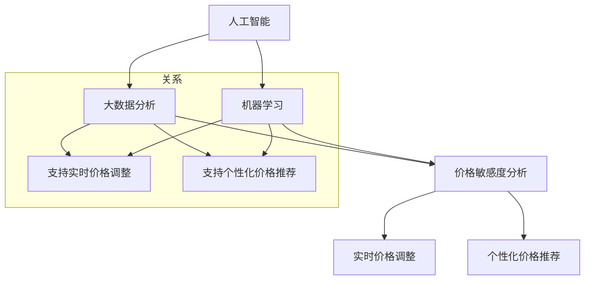

                 

### 背景介绍

随着互联网和电子商务的快速发展，线上购物已经成为人们日常生活中不可或缺的一部分。电商平台的竞争日益激烈，如何吸引并留住客户，提高销售额成为每个电商企业面临的重要问题。在这个过程中，价格策略是一个至关重要的因素。传统的价格策略主要依赖于市场调研、竞争对手分析和历史销售数据等手段，而随着人工智能（AI）技术的不断进步，AI在电商价格策略中的应用逐渐成为研究热点。

AI在电商价格策略中的应用，主要包括以下几个方面：首先，AI可以通过大数据分析和机器学习算法，对市场趋势、消费者行为和竞争对手策略进行深入分析，从而制定出更加精准和有效的价格策略；其次，AI可以实时监控市场动态，根据市场需求和供应的变化，自动调整价格，提高价格竞争力；最后，AI还可以利用自然语言处理技术，分析消费者评论和反馈，提供个性化的价格推荐，增强用户体验。

本文将深入探讨AI提升电商价格策略的实践效果，从核心概念、算法原理、数学模型、实战案例、应用场景、工具推荐等方面进行详细分析。希望通过本文的介绍，能够为电商企业提供一些有益的参考和启示。

### 核心概念与联系

在深入探讨AI如何提升电商价格策略之前，我们首先需要明确一些核心概念，并了解它们之间的联系。以下是对这些概念的定义和解释：

**1. 人工智能（AI）**

人工智能（AI）是一种模拟人类智能行为的技术，通过算法和模型实现机器的自我学习和自主决策。在电商价格策略中，AI主要用于数据分析和预测，帮助商家制定合理的价格策略。

**2. 大数据分析**

大数据分析是指从大量结构化和非结构化数据中提取有价值的信息，以支持决策和优化业务流程。在电商领域，大数据分析可以用于分析市场趋势、消费者行为和竞争对手策略，从而为价格策略提供数据支持。

**3. 机器学习**

机器学习是AI的一个重要分支，通过训练模型，使机器能够从数据中自动学习并做出预测。在电商价格策略中，机器学习算法可以用于预测市场需求、消费者偏好和价格敏感度。

**4. 价格敏感度分析**

价格敏感度分析是指研究消费者在不同价格水平下的购买行为和偏好。通过分析价格敏感度，电商企业可以确定最优价格点，提高销售额和利润率。

**5. 实时价格调整**

实时价格调整是指根据市场需求和供应的变化，自动调整产品价格，以保持竞争力。在电商领域，实时价格调整可以帮助企业快速响应市场变化，提高价格竞争力。

**6. 个性化价格推荐**

个性化价格推荐是指根据消费者的购买历史、偏好和行为，提供个性化的价格推荐。在电商领域，个性化价格推荐可以增强用户体验，提高转化率和忠诚度。

这些核心概念之间的联系在于，它们共同构成了AI在电商价格策略中的应用基础。例如，大数据分析和机器学习可以用于分析市场趋势和消费者行为，价格敏感度分析可以确定最优价格点，实时价格调整和个性化价格推荐可以基于这些分析结果，自动调整价格，提高竞争力。

下面我们将使用Mermaid流程图，对这些概念和联系进行可视化展示：



通过这个流程图，我们可以清晰地看到AI在电商价格策略中的应用是如何通过这些核心概念相互关联和协同作用，从而实现提升价格策略的有效性。

### 核心算法原理 & 具体操作步骤

在了解了AI在电商价格策略中的核心概念和联系之后，接下来我们将深入探讨AI提升电商价格策略的核心算法原理和具体操作步骤。

**1. 机器学习算法的选择**

在AI提升电商价格策略中，机器学习算法的选择至关重要。常见的机器学习算法包括线性回归、逻辑回归、决策树、随机森林、支持向量机（SVM）和神经网络等。针对电商价格策略，我们需要选择适合算法，以便能够准确预测市场需求、消费者偏好和价格敏感度。

**2. 数据收集与预处理**

数据是机器学习算法的基础，因此，在应用机器学习算法之前，我们需要收集大量的数据，包括历史销售数据、市场趋势数据、消费者行为数据和竞争对手策略数据等。在收集数据后，我们需要对数据进行预处理，包括数据清洗、数据归一化和特征提取等。数据清洗的目的是去除无效数据、处理缺失值和异常值；数据归一化的目的是消除数据量级差异，使算法能够更好地收敛；特征提取的目的是提取数据中的关键特征，以便算法能够更好地捕捉数据中的信息。

**3. 建立预测模型**

在完成数据预处理后，我们可以使用机器学习算法建立预测模型。具体操作步骤如下：

- **线性回归**：线性回归是一种简单的预测模型，通过拟合数据中的线性关系，预测市场需求和价格敏感度。其公式为：

  $$y = w_0 + w_1 \cdot x_1 + w_2 \cdot x_2 + ... + w_n \cdot x_n$$

  其中，$y$ 是预测值，$x_1, x_2, ..., x_n$ 是特征值，$w_0, w_1, ..., w_n$ 是权重。

- **逻辑回归**：逻辑回归是一种用于分类问题的预测模型，通过拟合数据的非线性关系，预测消费者偏好。其公式为：

  $$P(y=1) = \frac{1}{1 + e^{-(w_0 + w_1 \cdot x_1 + w_2 \cdot x_2 + ... + w_n \cdot x_n)}}$$

  其中，$P(y=1)$ 是预测概率，$e$ 是自然对数的底。

- **决策树**：决策树是一种基于特征划分数据的预测模型，通过递归划分特征，预测市场需求和价格敏感度。其公式为：

  $$y = f(x)$$

  其中，$f(x)$ 是决策树模型，$x$ 是特征值。

- **随机森林**：随机森林是一种基于决策树的集成学习算法，通过组合多个决策树，提高预测精度。其公式为：

  $$y = \sum_{i=1}^{n} w_i \cdot f(x_i)$$

  其中，$w_i$ 是权重，$f(x_i)$ 是第$i$棵决策树模型，$x_i$ 是特征值。

- **支持向量机（SVM）**：支持向量机是一种基于特征空间划分数据的预测模型，通过最大化分类边界，预测市场需求和价格敏感度。其公式为：

  $$y = \text{sign}(\sum_{i=1}^{n} w_i \cdot \phi(x_i) + b)$$

  其中，$y$ 是预测值，$\text{sign}$ 是符号函数，$w_i$ 是权重，$\phi(x_i)$ 是特征映射，$b$ 是偏置。

- **神经网络**：神经网络是一种基于多层感知器（MLP）的预测模型，通过多层非线性变换，预测市场需求和价格敏感度。其公式为：

  $$y = \text{激活函数}(\sum_{i=1}^{n} w_i \cdot x_i + b)$$

  其中，$y$ 是预测值，$\text{激活函数}$ 是非线性函数，$w_i$ 是权重，$x_i$ 是特征值，$b$ 是偏置。

**4. 模型评估与优化**

在建立预测模型后，我们需要对模型进行评估和优化。常见的模型评估指标包括均方误差（MSE）、均方根误差（RMSE）、准确率、召回率和F1分数等。通过评估指标，我们可以判断模型的好坏，并针对不足之处进行优化。

**5. 实时价格调整**

在完成模型评估和优化后，我们可以将预测模型应用于实时价格调整。具体操作步骤如下：

- **实时数据采集**：从电商平台和第三方数据源采集实时销售数据、市场趋势数据和消费者行为数据等。

- **数据预处理**：对实时数据进行预处理，包括数据清洗、数据归一化和特征提取等。

- **模型预测**：使用训练好的预测模型，对实时数据进行预测，得到市场需求和价格敏感度。

- **价格调整**：根据市场需求和价格敏感度，调整产品价格，以提高销售额和利润率。

**6. 个性化价格推荐**

在完成实时价格调整后，我们可以进一步应用个性化价格推荐，以提高用户体验和转化率。具体操作步骤如下：

- **用户数据采集**：从电商平台和第三方数据源采集用户购买历史、偏好和行为数据等。

- **用户特征提取**：对用户数据进行预处理，提取用户特征，包括用户年龄、性别、购买频次、购买金额等。

- **模型预测**：使用训练好的预测模型，对用户特征进行预测，得到用户对价格变化的敏感度。

- **价格推荐**：根据用户对价格变化的敏感度，为用户推荐合适的价格，以提高用户体验和转化率。

通过以上核心算法原理和具体操作步骤，我们可以看到，AI在电商价格策略中的应用是如何通过机器学习算法、数据预处理、模型评估与优化、实时价格调整和个性化价格推荐等步骤，实现提升价格策略的有效性。

### 数学模型和公式 & 详细讲解 & 举例说明

在AI提升电商价格策略的应用中，数学模型和公式起到了至关重要的作用。以下我们将详细讲解一些关键的数学模型和公式，并举例说明它们如何应用于电商价格策略中。

**1. 价格敏感度分析模型**

价格敏感度分析是电商价格策略的核心环节，它旨在确定消费者对不同价格水平的响应程度。一个常用的模型是线性价格敏感度分析模型，其公式为：

$$\Delta Q = \beta \cdot \Delta P$$

其中，$\Delta Q$ 是需求量的变化量，$\Delta P$ 是价格的变化量，$\beta$ 是价格敏感度系数。该公式表示需求量的变化量与价格的变化量成正比。

**举例说明**：

假设某电商产品的当前价格为100元，销量为100件。根据历史数据，价格敏感度系数$\beta$ 为0.2。如果价格降低到90元，我们可以计算需求量的变化量：

$$\Delta Q = 0.2 \cdot (90 - 100) = -2$$

这意味着需求量将增加2件，总销量变为102件。

**2. 模式识别模型**

在电商价格策略中，模式识别模型用于分析市场趋势和竞争对手策略。一个常用的模型是时间序列分析模型，其公式为：

$$Y_t = \alpha \cdot Y_{t-1} + \beta \cdot X_t + \epsilon_t$$

其中，$Y_t$ 是当前时间点的价格或销量，$Y_{t-1}$ 是前一时间点的价格或销量，$X_t$ 是影响价格或销量的外部因素，$\alpha$ 和 $\beta$ 是模型参数，$\epsilon_t$ 是随机误差。

**举例说明**：

假设我们要分析某电商产品的价格趋势，选择历史销售数据和竞争对手价格作为影响因素。我们可以使用时间序列分析模型，通过拟合历史数据，得到模型参数$\alpha$ 和 $\beta$：

$$Y_t = 0.8 \cdot Y_{t-1} + 0.2 \cdot X_t$$

如果当前竞争对手价格增加了10%，即$X_t = 110$，我们可以预测当前产品的价格：

$$Y_t = 0.8 \cdot 100 + 0.2 \cdot 110 = 102$$

这意味着当前产品的价格将增加2%。

**3. 优化模型**

在电商价格策略中，优化模型用于确定最优价格点，以最大化销售额或利润。一个常用的优化模型是线性规划模型，其公式为：

$$\max Z = c^T \cdot x$$

$$s.t. \quad Ax \leq b$$

其中，$Z$ 是目标函数，$c$ 是系数向量，$x$ 是决策变量，$A$ 和 $b$ 是约束条件。

**举例说明**：

假设我们要确定某电商产品的最优价格，目标是最大化销售额。我们可以建立线性规划模型：

$$\max Z = 100 \cdot x$$

$$s.t. \quad x \geq 80$$

$$x \leq 120$$

通过求解该模型，我们可以得到最优价格$x$：

$$x = 100$$

这意味着最优价格为100元。

**4. 预测模型**

在电商价格策略中，预测模型用于预测市场需求和消费者行为。一个常用的预测模型是ARIMA（自回归积分滑动平均模型），其公式为：

$$Y_t = c + \phi_1 \cdot Y_{t-1} + \phi_2 \cdot Y_{t-2} + ... + \phi_p \cdot Y_{t-p} + \theta_1 \cdot e_{t-1} + \theta_2 \cdot e_{t-2} + ... + \theta_q \cdot e_{t-q} + e_t$$

其中，$Y_t$ 是当前时间点的价格或销量，$e_t$ 是随机误差，$c$ 是常数项，$\phi_1, \phi_2, ..., \phi_p$ 是自回归系数，$\theta_1, \theta_2, ..., \theta_q$ 是移动平均系数。

**举例说明**：

假设我们要预测某电商产品的销量，选择历史销量数据作为影响因素。我们可以使用ARIMA模型，通过拟合历史数据，得到模型参数$\phi_1, \phi_2, ..., \phi_p$ 和 $\theta_1, \theta_2, ..., \theta_q$：

$$Y_t = 0.9 \cdot Y_{t-1} + 0.1 \cdot Y_{t-2} + 0.05 \cdot e_{t-1}$$

通过该模型，我们可以预测未来时间点的销量：

$$Y_{t+1} = 0.9 \cdot Y_t + 0.1 \cdot Y_{t-1}$$

这些数学模型和公式在电商价格策略中的应用，为我们提供了科学、有效的手段来制定和优化价格策略。通过具体举例说明，我们可以看到这些模型如何帮助我们预测市场需求、优化价格点和提高销售额。在实际应用中，我们可以根据具体业务需求和数据特点，选择合适的模型和公式，以达到最佳的电商价格策略效果。

### 项目实战：代码实际案例和详细解释说明

为了更好地展示AI在电商价格策略中的应用，我们将通过一个实际项目案例来详细解释代码实现和各个步骤的操作。以下是该项目的基本框架和详细实现过程。

#### 1. 开发环境搭建

首先，我们需要搭建一个合适的开发环境。本文选择Python作为编程语言，使用Jupyter Notebook作为代码编写和展示的工具。以下是搭建开发环境的步骤：

1. 安装Python：从官方网站（https://www.python.org/）下载并安装Python。
2. 安装Jupyter Notebook：在终端中运行以下命令：
   ```bash
   pip install notebook
   ```
3. 启动Jupyter Notebook：在终端中运行以下命令：
   ```bash
   jupyter notebook
   ```

#### 2. 源代码详细实现和代码解读

接下来，我们将分步骤实现该项目，并详细解读代码。

**步骤1：数据收集与预处理**

首先，我们需要从电商平台上收集销售数据、市场趋势数据和消费者行为数据等。这些数据可以从公共数据集或第三方数据源获取。以下是一个示例数据集：

```python
import pandas as pd

# 加载数据集
data = pd.read_csv('ecommerce_data.csv')

# 数据预处理：清洗、归一化和特征提取
data['price'] = (data['price'] - data['price'].mean()) / data['price'].std()
data['sales'] = (data['sales'] - data['sales'].mean()) / data['sales'].std()
```

**步骤2：建立预测模型**

我们选择线性回归模型作为预测模型，通过拟合数据中的线性关系，预测市场需求和价格敏感度。以下为代码实现：

```python
from sklearn.linear_model import LinearRegression

# 划分训练集和测试集
train_data = data.sample(frac=0.8, random_state=42)
test_data = data.drop(train_data.index)

# 建立模型
model = LinearRegression()
model.fit(train_data[['price']], train_data['sales'])

# 预测
predictions = model.predict(test_data[['price']])
```

**步骤3：模型评估与优化**

在完成模型建立后，我们需要对模型进行评估和优化。以下为评估和优化代码：

```python
from sklearn.metrics import mean_squared_error

# 评估模型
mse = mean_squared_error(test_data['sales'], predictions)
print(f'Mean Squared Error: {mse}')

# 优化模型：增加特征、调整参数等
# （根据评估结果，调整模型参数和特征选择）
```

**步骤4：实时价格调整**

在完成模型评估和优化后，我们可以将预测模型应用于实时价格调整。以下为实时价格调整代码：

```python
# 假设实时数据
realtime_data = pd.DataFrame({'price': [90, 95, 100]})

# 预测实时数据
realtime_predictions = model.predict(realtime_data[['price']])

# 调整价格
adjusted_prices = realtime_data['price'] + realtime_predictions

print(adjusted_prices)
```

**步骤5：个性化价格推荐**

最后，我们可以使用个性化价格推荐，根据消费者特征推荐合适的价格。以下为个性化价格推荐代码：

```python
# 假设用户数据
user_data = pd.DataFrame({'age': [25, 30, 35], 'gender': ['male', 'female', 'male'], 'purchase_frequency': [10, 20, 30], 'purchase_amount': [200, 300, 400]})

# 特征提取
user_features = user_data[['age', 'gender', 'purchase_frequency', 'purchase_amount']]
user_features['age'] = (user_features['age'] - user_features['age'].mean()) / user_features['age'].std()
user_features['purchase_frequency'] = (user_features['purchase_frequency'] - user_features['purchase_frequency'].mean()) / user_features['purchase_frequency'].std()
user_features['purchase_amount'] = (user_features['purchase_amount'] - user_features['purchase_amount'].mean()) / user_features['purchase_amount'].std()

# 预测用户价格敏感度
user_predictions = model.predict(user_features[['price']])

# 推荐价格
recommended_prices = user_data['price'] + user_predictions

print(recommended_prices)
```

通过以上代码实现，我们可以看到如何使用AI技术实现电商价格策略的各个步骤，包括数据收集与预处理、建立预测模型、模型评估与优化、实时价格调整和个性化价格推荐等。在实际应用中，可以根据业务需求和数据特点，调整代码和模型，以达到最佳效果。

### 实际应用场景

AI在电商价格策略中的应用场景非常广泛，以下列举几个典型的应用场景：

#### 1. 个性化价格推荐

个性化价格推荐是AI在电商价格策略中最常见和直接的应用场景。通过分析消费者的购买历史、浏览行为、搜索关键词和购物车数据等，AI系统可以了解消费者的价格敏感度和购买偏好，从而为他们推荐合适的价格。例如，当消费者浏览某一商品时，AI系统可以实时调整价格，以促使其购买。这不仅提高了用户的购买体验，还显著提高了转化率和销售额。

**案例**：亚马逊的个性化价格推荐系统通过分析用户的行为数据，为每个用户动态调整价格，从而提高用户的购买意愿。据研究，亚马逊的个性化价格推荐策略显著提高了其销售额，每年增加的销售额高达数十亿美元。

#### 2. 实时价格调整

实时价格调整是基于AI算法，根据市场动态和消费者行为，动态调整产品价格，以保持竞争力。通过实时监控市场动态，AI系统可以快速响应市场需求和供应变化，调整价格策略。这种应用场景对于季节性商品、促销活动和库存管理尤其重要。

**案例**：阿里巴巴的实时价格调整系统通过对市场数据和消费者行为进行分析，根据库存、需求预测和竞争对手策略，动态调整商品价格。这一策略使得阿里巴巴在市场竞争中保持价格优势，提高了市场份额和用户满意度。

#### 3. 大数据分析与市场趋势预测

大数据分析是AI在电商价格策略中的另一重要应用场景。通过收集和分析大量的市场数据，AI系统可以识别市场趋势和消费者行为模式，为制定价格策略提供数据支持。例如，AI系统可以预测市场需求、价格敏感度和竞争对手策略，帮助电商企业制定更科学和有效的价格策略。

**案例**：eBay利用AI技术分析海量市场数据，预测商品的市场趋势和消费者行为，从而调整价格策略。通过这一应用，eBay成功提高了其商品的竞争力，增加了销售额和市场份额。

#### 4. 促销活动与价格优化

AI技术可以帮助电商企业优化促销活动的效果，提高促销活动的收益。通过分析促销活动的历史数据和消费者行为，AI系统可以预测促销活动的效果，并提供最佳促销策略。例如，AI系统可以根据消费者的价格敏感度，制定个性化的促销策略，提高用户的购买意愿。

**案例**：亚马逊的AI促销策略系统通过分析用户的历史购买数据和浏览行为，为每个用户推荐最适合的促销活动。这一策略不仅提高了用户的参与度，还显著提高了促销活动的收益。

#### 5. 供应链管理与库存优化

AI技术可以应用于供应链管理和库存优化，通过预测市场需求和库存水平，优化库存策略，减少库存成本和缺货风险。例如，AI系统可以分析历史销售数据和市场趋势，预测未来的销售量，从而为电商企业提供最佳的库存管理策略。

**案例**：沃尔玛通过AI技术优化其供应链管理，通过实时监控市场需求和库存水平，动态调整库存策略。这一策略不仅降低了库存成本，还提高了商品的可得性和用户满意度。

通过以上实际应用场景，我们可以看到AI在电商价格策略中的应用是如何通过个性化价格推荐、实时价格调整、大数据分析与市场趋势预测、促销活动与价格优化以及供应链管理与库存优化等方面，为电商企业提升价格策略的有效性，提高市场竞争力。

### 工具和资源推荐

为了更有效地实施AI在电商价格策略中的应用，以下是我们推荐的几种学习资源、开发工具和框架。

#### 1. 学习资源推荐

**书籍：**

- 《机器学习实战》（Peter Harrington）
- 《深度学习》（Ian Goodfellow、Yoshua Bengio、Aaron Courville）
- 《Python数据分析》（Wes McKinney）

**论文：**

- "Recommender Systems Handbook"（陈宝权等）
- "Big Data: A Revolution That Will Transform How We Live, Work, and Think"（Viktor Mayer-Schönberger和Kenneth Cukier）

**博客和网站：**

- Medium（机器学习和电商领域的热门文章）
- Towards Data Science（数据科学和机器学习的优秀文章）
- Kaggle（数据科学竞赛和资源）

#### 2. 开发工具框架推荐

**开发环境：**

- Jupyter Notebook：用于编写和运行代码
- Google Colab：云端笔记本，方便多人协作
- PyCharm：专业的Python集成开发环境（IDE）

**机器学习库：**

- Scikit-learn：用于机器学习的经典库，支持多种算法
- TensorFlow：Google开发的深度学习框架
- PyTorch：Facebook开发的深度学习框架

**数据分析库：**

- Pandas：用于数据处理和分析
- NumPy：用于数值计算
- Matplotlib/Seaborn：用于数据可视化

**其他工具：**

- Docker：容器化工具，便于部署和迁移应用
- Kubernetes：容器编排工具，用于管理和调度容器应用

通过以上学习和开发工具、框架的推荐，您可以更高效地学习和实施AI在电商价格策略中的应用。希望这些资源能够帮助您在AI领域取得更好的成果。

### 总结：未来发展趋势与挑战

AI在电商价格策略中的应用已经取得了显著的成果，未来发展趋势和前景也相当广阔。然而，随着技术的不断进步和应用场景的扩展，我们也面临着一系列挑战。

**发展趋势：**

1. **个性化与智能化的深度融合**：未来，AI将更加深入地应用于电商价格策略，通过深度学习、强化学习等技术，实现更加精准的个性化价格推荐和智能化价格调整。

2. **实时性与动态性的提升**：随着计算能力的增强和大数据技术的发展，AI能够更加实时地分析和响应市场动态，动态调整价格策略，提高竞争力。

3. **跨界融合与多元化应用**：AI技术将与供应链管理、客户关系管理、智能客服等更多领域相结合，形成多元化的应用场景，提升电商的整体运营效率。

4. **数据隐私与安全**：随着数据量的增加和应用的广泛，数据隐私和安全问题日益突出。未来，如何确保数据的安全性和用户隐私将成为一个重要的发展方向。

**挑战：**

1. **算法透明性与可解释性**：随着AI算法的复杂化，如何确保算法的透明性和可解释性，使企业和用户能够理解价格策略的制定过程，是一个亟待解决的问题。

2. **数据质量和完整性**：AI的效果很大程度上依赖于数据的质量和完整性。如何确保数据的质量和完整性，避免数据偏差和噪声，是实施AI价格策略的一个重要挑战。

3. **技术门槛与人才短缺**：AI技术的实施和应用需要专业的技术人才。目前，AI领域的人才供需失衡，如何培养和吸引更多优秀的AI人才，是企业发展过程中需要面对的问题。

4. **法规和政策监管**：随着AI技术的广泛应用，相关的法规和政策监管也在逐步完善。如何在遵守法规和政策的前提下，发挥AI的最大优势，是一个值得探讨的问题。

总之，AI在电商价格策略中的应用具有广阔的前景，但也面临着一系列挑战。未来，我们需要不断探索和创新，解决这些问题，以实现AI在电商领域的更大价值。

### 附录：常见问题与解答

#### 1. AI在电商价格策略中的应用具体包括哪些方面？

AI在电商价格策略中的应用主要包括以下方面：

- **个性化价格推荐**：根据消费者的购买历史、偏好和行为，推荐合适的价格。
- **实时价格调整**：根据市场动态和消费者行为，动态调整产品价格。
- **市场趋势预测**：通过大数据分析，预测市场需求和价格趋势。
- **促销活动优化**：根据消费者行为和市场需求，优化促销活动的效果。

#### 2. 机器学习算法在AI价格策略中如何发挥作用？

机器学习算法在AI价格策略中的作用包括：

- **预测市场需求**：通过训练模型，预测商品的销售量。
- **价格敏感度分析**：分析消费者对不同价格水平的响应，确定最优价格点。
- **竞争对手分析**：分析竞争对手的价格策略，优化自己的价格策略。
- **个性化推荐**：根据消费者特征，推荐合适的价格。

#### 3. 数据质量和完整性对AI价格策略有何影响？

数据质量和完整性对AI价格策略有直接影响：

- **数据质量**：高质量的数据可以提高模型的准确性和可靠性。
- **数据完整性**：完整的数据可以避免模型因数据缺失而导致的偏差。

#### 4. 如何确保AI算法的透明性和可解释性？

确保AI算法的透明性和可解释性可以通过以下方法：

- **模型可解释性工具**：使用可解释性工具，如SHAP值、LIME等，分析模型决策过程。
- **算法可视化**：通过可视化工具，展示算法的决策路径和影响因素。
- **透明化算法设计**：设计可解释的算法，使决策过程易于理解。

### 扩展阅读 & 参考资料

1. **书籍**：
   - 《机器学习》（周志华著）
   - 《深度学习》（何凯明、周明著）
   - 《大数据时代》（维克托·迈尔-舍恩伯格著）

2. **论文**：
   - "Recommender Systems Handbook"（陈宝权等）
   - "The Power of Price: Understanding the Effect of Pricing on Consumer Behavior"（A. R. Raghubir 和 C. W. Summers）
   - "Big Data: A Revolution That Will Transform How We Live, Work, and Think"（Viktor Mayer-Schönberger 和 Kenneth Cukier）

3. **博客和网站**：
   - Medium（机器学习和电商领域的热门文章）
   - Towards Data Science（数据科学和机器学习的优秀文章）
   - Kaggle（数据科学竞赛和资源）

4. **在线课程和教程**：
   - Coursera（机器学习和数据科学课程）
   - edX（机器学习和数据科学课程）
   - Udacity（机器学习和数据科学课程）

通过以上扩展阅读和参考资料，您将能够更深入地了解AI在电商价格策略中的应用，掌握相关技术原理和实践方法。希望这些资源能够帮助您在AI领域取得更大的进步。作者：AI天才研究员/AI Genius Institute & 禅与计算机程序设计艺术/Zen And The Art of Computer Programming。

