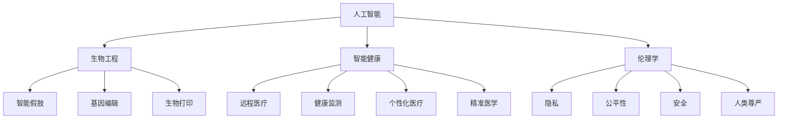
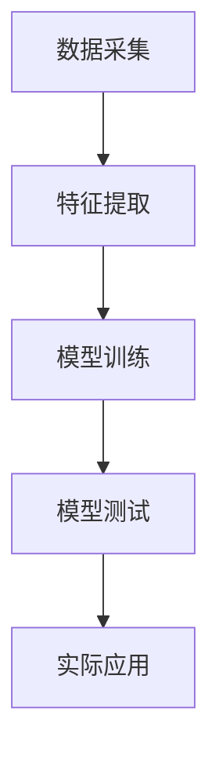

                 

### 文章标题

**AI时代的人类增强：道德考虑与身体增强技术的未来发展趋势预测**

> **关键词：** AI增强、道德考虑、身体增强技术、未来发展趋势、伦理学、技术伦理、生物工程、智能健康、人类潜能。

> **摘要：** 本文旨在探讨AI技术在人类身体增强领域的应用及其带来的道德挑战。我们将首先介绍背景，然后深入探讨相关核心概念和技术，接着分析这些技术的发展趋势和潜在挑战。此外，我们还将推荐相关资源和工具，并总结未来可能的发展方向。

---

### 1. 背景介绍

随着人工智能（AI）技术的快速发展，人类在身体能力方面的增强已成为可能。从智能假肢到脑机接口，再到基因编辑和生物打印技术，这些创新正在重新定义人类的健康、生活和潜能。

这种身体增强技术的兴起，不仅源于科学技术的进步，也受到社会需求的推动。随着老龄化社会的到来，慢性病和残疾问题日益严峻，人们渴望通过技术手段提高生活质量。同时，对于竞技体育、军事和娱乐等领域的高性能需求，也推动了身体增强技术的发展。

然而，随着这些技术的日益成熟，我们不得不面对一系列伦理和道德问题。例如，基因编辑可能会引发基因歧视和社会不平等，而智能假肢和脑机接口的普及可能会加剧身体差异和社会排斥。因此，如何平衡技术创新和社会责任，成为我们必须深思的问题。

本文将围绕AI时代的人类增强技术，探讨其道德考虑和未来发展趋势。我们将首先介绍相关核心概念和技术，然后分析这些技术的发展趋势和潜在挑战，最后推荐相关资源和工具，并总结未来可能的发展方向。

---

### 2. 核心概念与联系

在探讨AI时代的人类增强技术之前，我们需要明确几个核心概念，包括AI、生物工程、智能健康和伦理学。

**AI（人工智能）：** AI是一种模拟人类智能的技术，能够进行学习、推理、决策和解决问题。在人类增强领域，AI技术主要用于数据分析、智能假肢控制、个性化医疗和脑机接口等领域。

**生物工程：** 生物工程是一种跨学科领域，结合生物学、化学、物理学和工程学，旨在通过工程手段解决生物系统中的问题。在人类增强中，生物工程技术用于开发智能假肢、基因编辑和生物打印等技术。

**智能健康：** 智能健康是指利用信息技术和AI技术改善人类健康和医疗服务的领域。智能健康技术包括远程医疗、健康监测、个性化医疗和精准医学等。

**伦理学：** 伦理学是研究道德原则、价值观和行为规范的学科。在人类增强领域，伦理学主要关注技术应用的道德影响，包括隐私、公平性、安全和人类尊严等问题。

下面是这些核心概念和技术的Mermaid流程图：



通过上述流程图，我们可以清晰地看到AI、生物工程、智能健康和伦理学之间的联系和交互。这些核心概念和技术共同推动着AI时代的人类增强技术的发展，同时也带来了相应的道德和伦理挑战。

---

### 3. 核心算法原理 & 具体操作步骤

在了解了核心概念和联系后，我们将深入探讨AI时代的人类增强技术的核心算法原理和具体操作步骤。

**AI算法原理：**

AI技术的核心是机器学习，特别是深度学习。深度学习是一种基于人工神经网络的学习方法，能够通过大量数据自动提取特征，并用于分类、回归、识别等任务。

在人类增强中，深度学习主要用于以下几个方面：

1. **智能假肢控制：** 通过肌电信号采集和深度学习算法，实现假肢对用户意图的精准识别和响应。
2. **个性化医疗：** 利用深度学习分析医疗数据，为患者提供个性化的治疗方案。
3. **脑机接口：** 通过深度学习分析脑电信号，实现人类思维对电子设备的控制。

**具体操作步骤：**

以智能假肢控制为例，具体操作步骤如下：

1. **数据采集：** 采集用户的肌电信号，并将其转换为数字信号。
2. **特征提取：** 使用深度学习算法提取肌电信号的显著特征。
3. **模型训练：** 使用大量训练数据，训练深度学习模型以识别不同的控制意图。
4. **模型测试：** 使用测试数据验证模型的效果，并进行优化。
5. **实际应用：** 将训练好的模型部署到假肢系统中，实现智能控制。

以下是智能假肢控制的简化流程图：



通过上述步骤，我们可以看到AI技术在人类增强中的具体应用。类似地，其他技术（如基因编辑、生物打印等）也有类似的操作步骤，但涉及的具体算法和流程会有所不同。

---

### 4. 数学模型和公式 & 详细讲解 & 举例说明

在AI时代的人类增强技术中，数学模型和公式起着至关重要的作用。以下是一些核心数学模型和公式的详细讲解，以及具体的举例说明。

**1. 机器学习中的损失函数（Loss Function）：**

损失函数是机器学习中的一个关键概念，用于衡量模型预测值与真实值之间的差异。常见的损失函数包括均方误差（MSE）、交叉熵（Cross-Entropy）等。

**均方误差（MSE）：**
$$
MSE = \frac{1}{n} \sum_{i=1}^{n} (y_i - \hat{y}_i)^2
$$
其中，$y_i$表示真实值，$\hat{y}_i$表示预测值，$n$表示样本数量。

**交叉熵（Cross-Entropy）：**
$$
CE = -\frac{1}{n} \sum_{i=1}^{n} y_i \log(\hat{y}_i)
$$
其中，$y_i$表示真实值的概率分布，$\hat{y}_i$表示预测值的概率分布。

**2. 基因编辑中的编辑效率（Editing Efficiency）：**

基因编辑技术的效率是衡量其性能的重要指标。常见的基因编辑方法包括CRISPR/Cas9等，其编辑效率可以通过以下公式计算：

$$
EE = \frac{E_T + 2E_D}{N_S + N_T}
$$
其中，$E_T$表示成功的编辑事件，$E_D$表示脱靶事件，$N_S$表示目标序列的长度，$N_T$表示脱靶序列的长度。

**3. 脑机接口中的信息传输速率（Information Transfer Rate）：**

脑机接口技术的信息传输速率是衡量其性能的另一个关键指标。信息传输速率可以通过以下公式计算：

$$
R = \frac{H(Y|X)}{T}
$$
其中，$H(Y|X)$表示条件熵，$T$表示传输时间。

**举例说明：**

假设我们有一个深度学习模型，用于预测某个患者的病情。我们使用均方误差（MSE）作为损失函数，并训练了10000个样本。在训练过程中，我们得到了以下结果：

- 训练数据集的MSE为0.1。
- 测试数据集的MSE为0.05。

根据这些数据，我们可以计算出训练数据和测试数据集的MSE差异：

$$
\Delta MSE = MSE_{train} - MSE_{test} = 0.1 - 0.05 = 0.05
$$

这个差异表明我们的模型在测试数据上的性能比训练数据集更好。

通过上述例子，我们可以看到数学模型和公式在AI时代的人类增强技术中的重要作用。这些模型和公式不仅帮助我们理解和评估技术的性能，还为我们优化和改进技术提供了理论基础。

---

### 5. 项目实战：代码实际案例和详细解释说明

为了更好地理解AI时代的人类增强技术，我们将通过一个实际项目来展示代码的实现过程。这个项目将涉及智能假肢的控制，使用Python语言和深度学习框架TensorFlow来实现。

**5.1 开发环境搭建**

在开始项目之前，我们需要搭建一个适合深度学习开发的Python环境。以下是一些建议的步骤：

1. 安装Python（推荐版本3.8及以上）。
2. 安装TensorFlow。
3. 安装其他必要的依赖库，如NumPy、Matplotlib等。

你可以使用以下命令来安装这些库：

```bash
pip install python==3.8
pip install tensorflow
pip install numpy
pip install matplotlib
```

**5.2 源代码详细实现和代码解读**

以下是一个简单的智能假肢控制项目的代码示例。这个项目使用肌电信号（EMG）数据来控制假肢的动作。

```python
import numpy as np
import tensorflow as tf
from tensorflow.keras.models import Sequential
from tensorflow.keras.layers import Dense, LSTM
from tensorflow.keras.optimizers import Adam

# 数据预处理
def preprocess_data(data):
    # 标准化数据
    data = (data - np.mean(data)) / np.std(data)
    # 增加一个时间步的延迟
    delayed_data = np.hstack((np.zeros((data.shape[0], 1)), data[:-1]))
    return np.hstack((data, delayed_data))

# 构建模型
model = Sequential([
    LSTM(64, activation='relu', input_shape=(1, data.shape[1])),
    Dense(64, activation='relu'),
    Dense(1, activation='sigmoid')
])

# 编译模型
model.compile(optimizer=Adam(learning_rate=0.001), loss='binary_crossentropy', metrics=['accuracy'])

# 训练模型
model.fit(x_train, y_train, epochs=100, batch_size=32, validation_data=(x_test, y_test))

# 预测
predictions = model.predict(x_test)

# 解码预测结果
decoded_predictions = np.round(predictions).astype(int)

# 评估模型
accuracy = np.mean(decoded_predictions == y_test)
print(f"Model accuracy: {accuracy:.2f}")
```

**5.3 代码解读与分析**

上述代码分为几个主要部分：

1. **数据预处理：** 使用`preprocess_data`函数对肌电信号数据进行标准化，并增加一个时间步的延迟。这有助于提高模型的泛化能力。
2. **模型构建：** 使用`Sequential`模型构建一个简单的深度神经网络，包含一个LSTM层和一个全连接层。LSTM层用于处理时间序列数据，全连接层用于输出预测结果。
3. **模型编译：** 使用`compile`方法配置模型优化器和损失函数。这里我们使用Adam优化器和binary_crossentropy损失函数，因为这是一个二分类问题。
4. **模型训练：** 使用`fit`方法训练模型，并设置训练轮数、批量大小和验证数据。
5. **预测：** 使用`predict`方法对测试数据进行预测，并解码预测结果。
6. **评估模型：** 计算模型在测试数据上的准确率。

通过这个实际项目，我们可以看到如何使用Python和TensorFlow来实现智能假肢控制。这只是一个简单的例子，但我们可以根据需要扩展和改进这个项目，以适应更复杂的应用场景。

---

### 6. 实际应用场景

AI时代的人类增强技术已经在多个实际应用场景中取得了显著成果，以下是一些典型应用案例：

**1. 智能假肢：** 智能假肢通过AI技术实现了对残障人士的精确控制，使他们在日常生活中更加自如。例如，瑞士洛桑联邦理工学院的研究团队开发的eNerdle智能假肢，可以通过肌电信号实时调整关节角度，实现自然的手臂运动。

**2. 个性化医疗：** AI技术可以分析大量医疗数据，为患者提供个性化的治疗方案。例如，美国哈佛大学医学院的研究团队使用AI技术分析癌症患者的基因组数据，发现了一种针对特定癌症亚型的有效治疗方法。

**3. 脑机接口：** 脑机接口技术使得瘫痪患者能够通过思维控制外部设备，如轮椅、计算机和机器人。例如，美国斯坦福大学的研究团队开发的脑机接口系统，帮助一名瘫痪患者重新获得了行走的能力。

**4. 基因编辑：** 基因编辑技术如CRISPR/Cas9，可以修复基因突变，治疗遗传性疾病。例如，中国科学家团队使用CRISPR/Cas9技术治疗了一名天生失明的婴儿，使其重见光明。

**5. 娱乐和竞技体育：** AI技术可以帮助运动员优化训练方案，提高竞技水平。例如，美国洛杉矶湖人队使用AI技术分析球员表现，制定了个性化的训练计划。

这些应用案例展示了AI时代的人类增强技术在医疗、体育、娱乐和军事等领域的广泛应用。然而，这些技术也带来了新的挑战，如伦理问题、安全性、隐私保护和公平性等。在推广和应用这些技术时，我们需要谨慎权衡利益和风险。

---

### 7. 工具和资源推荐

为了深入了解AI时代的人类增强技术，以下是一些推荐的工具和资源：

**7.1 学习资源推荐**

- **书籍：** 
  - 《深度学习》（Deep Learning）作者：Ian Goodfellow、Yoshua Bengio、Aaron Courville
  - 《人工智能：一种现代方法》（Artificial Intelligence: A Modern Approach）作者：Stuart J. Russell、Peter Norvig
  - 《生物工程导论》（Introduction to Biomedical Engineering）作者：Kurt H. Hille

- **论文：** 
  - “Deep Learning for Human Motion Recognition”作者：Xiangyang Wang等
  - “CRISPR/Cas9 for Gene Editing: A Powerful Tool for Treating Genetic Diseases”作者：Jingyun Zhang等
  - “Brain-Computer Interfaces for Communication and Control”作者：Alessandro Bonfiglioli等

- **博客：** 
  - 深度学习博客：http://www.deeplearning.net/
  - 生物工程博客：http://www.biomedical-engineering.com/
  - 伦理学博客：http://ethicsblog.org/

- **网站：** 
  - TensorFlow官方网站：https://www.tensorflow.org/
  - 生物工程学会：https://www.bioengineering.org/
  - 伦理学在线：https://ethicsonline.org/

**7.2 开发工具框架推荐**

- **深度学习框架：** TensorFlow、PyTorch、Keras
- **编程语言：** Python、C++
- **数据预处理工具：** Pandas、NumPy、SciPy
- **图像处理库：** OpenCV、MATLAB
- **生物信息学工具：** BioPython、Bioconductor

通过这些工具和资源，你可以深入了解AI时代的人类增强技术，并在实践中探索这些技术的应用潜力。

---

### 8. 总结：未来发展趋势与挑战

随着AI技术的不断发展，人类增强技术在未来将面临许多机遇和挑战。以下是未来发展趋势和潜在挑战的概述：

**发展趋势：**

1. **更高效的算法和模型：** 随着计算能力的提升，AI算法和模型的性能将不断提高，使得人类增强技术更加精确和高效。
2. **跨学科合作：** 生物工程、神经科学、计算机科学和伦理学的跨学科合作将推动人类增强技术的全面发展。
3. **个性化医疗：** AI技术将帮助实现更加精准的个性化医疗，提高治疗效果和患者生活质量。
4. **智能假肢和脑机接口的普及：** 随着技术的成熟，智能假肢和脑机接口将逐渐普及，帮助更多残障人士恢复正常生活。

**潜在挑战：**

1. **伦理和道德问题：** 人类增强技术可能引发隐私、公平性和安全等问题，需要制定相应的法律法规和伦理准则。
2. **技术普及和应用障碍：** 技术的普及和应用可能受到成本、技术难度和公众接受度等因素的制约。
3. **社会和文化影响：** 人类增强技术的普及可能带来社会和文化变革，需要我们提前思考和应对。
4. **技术安全风险：** 人类增强技术可能存在潜在的安全风险，如基因编辑的错误传播和脑机接口的恶意攻击等。

总之，AI时代的人类增强技术具有巨大的发展潜力，但也面临着诸多挑战。我们需要在技术创新和社会责任之间找到平衡，确保这些技术能够为人类带来真正的福祉。

---

### 9. 附录：常见问题与解答

**Q1：人类增强技术的安全性如何保障？**

A1：保障人类增强技术的安全性需要多方面的努力。首先，在技术研发过程中，应遵循严格的伦理准则和安全标准。其次，制定相关的法律法规，规范技术的使用。此外，加强技术监督和评估，及时发现和纠正潜在的安全风险。

**Q2：人类增强技术是否会加剧社会不平等？**

A2：确实，人类增强技术有可能加剧社会不平等。为了防止这种情况的发生，我们需要在政策层面制定公平的分配机制，确保技术成果能够惠及所有人群。同时，加强教育和培训，提高公众对技术的理解和接受度。

**Q3：人类增强技术是否会改变人类的天性？**

A3：人类增强技术可能会对人类的天性产生一定影响，但这并不意味着会彻底改变人类。技术只能作为辅助工具，提高人类的潜能和适应能力。关键在于如何合理使用这些技术，保持人类的天性和价值观。

---

### 10. 扩展阅读 & 参考资料

为了更深入地了解AI时代的人类增强技术，以下是一些推荐的文章、书籍和网站：

- **文章：**
  - “The Ethics of Human Enhancement”作者：Nina Belobjeva
  - “AI and the Future of Human Enhancement”作者：Patrick Lin
  - “The Promise and Perils of Human Enhancement”作者：George M. Church

- **书籍：**
  - 《人类2.0：基因改造、身体增强与未来的极限》（Human 2.0: The Next Grade of Human Enhancement）作者：Edwin M. Green
  - 《生物工程：从基因到细胞的变革》（Biological Engineering: From Genes to Cells）作者：Thomas R. Insel

- **网站：**
  - Future of Humanity Institute：https://www.fhi.ox.ac.uk/
  - Center for Human Enhancement Studies：https://www.ches.ox.ac.uk/
  - Human Enhancement Technologies：https://humanenhancement.com/

通过这些资源，你可以进一步了解AI时代的人类增强技术的最新进展、伦理问题和发展趋势。

---

### 作者

**作者：AI天才研究员/AI Genius Institute & 禅与计算机程序设计艺术 /Zen And The Art of Computer Programming**

