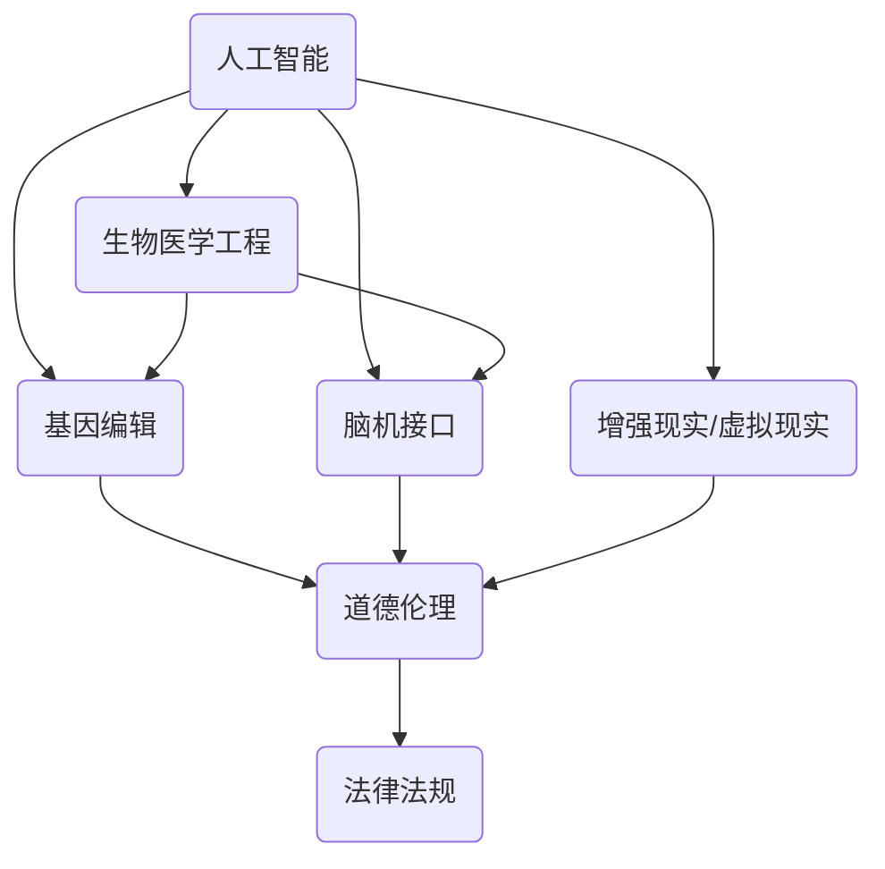

                 

### 背景介绍

随着人工智能技术的飞速发展，人类增强逐渐成为了一个热门话题。通过科技手段对人类进行身体和认知上的增强，使得我们能够更好地应对复杂多变的世界。本文旨在探讨AI时代下的人类增强，分析其中的道德考虑与未来发展策略。

人类增强不仅限于身体上的改变，还包括认知、记忆、学习能力等方面的提升。例如，通过基因编辑技术，我们可以增强某些基因的表达，从而提高人类的免疫力或者智力。再比如，通过脑机接口技术，我们可以直接与计算机系统交互，实现思维和意识的增强。这些技术的出现，为我们带来前所未有的机遇，同时也引发了一系列伦理、法律和社会问题。

首先，我们需要明确人类增强的核心概念。人类增强可以大致分为两种类型：一种是身体增强，如增强肌肉力量、改善视力等；另一种是认知增强，如增强记忆、提高学习能力等。这些增强手段各有优劣，同时也涉及到不同的伦理和道德考量。

接下来，我们将深入探讨人类增强的道德考虑。首先，我们需要关注的是人类增强可能带来的不平等问题。如果只有少数人能够负担得起昂贵的增强技术，那么这将会加剧社会贫富差距。此外，我们还需要思考人类增强是否会影响人类的天赋和个性，从而削弱人类的独特性。

在探讨道德考虑的同时，我们也不能忽视人类增强的实际应用。随着技术的发展，人类增强已经在医疗、军事、教育等领域取得了一定的成果。例如，通过基因编辑技术，我们可以治疗某些遗传性疾病；通过脑机接口技术，我们可以帮助残障人士恢复部分功能。

然而，人类增强的应用也带来了一系列挑战。首先，我们需要确保增强技术的安全性和可靠性。其次，我们需要制定相应的法律法规，以确保增强技术的合法合规使用。此外，我们还需要关注增强技术对人类自然发展的影响，以避免过度依赖技术而忽视自然成长的重要性。

总之，人类增强是一个复杂而多维的话题。在AI时代，我们需要从道德、法律、技术等多个角度进行深入思考，以制定出合理的未来发展策略。只有这样，我们才能充分利用人类增强带来的机遇，同时确保社会的公平和正义。

### 核心概念与联系

为了深入探讨AI时代下的人类增强，我们需要理解几个核心概念，并分析它们之间的联系。以下是这些核心概念及其相互关系：

#### 1. 人工智能（Artificial Intelligence, AI）
人工智能是指通过计算机系统模拟人类智能的技术。它包括机器学习、深度学习、自然语言处理等多个子领域。人工智能的发展使得计算机能够处理大量数据，从而提高决策的准确性和效率。

#### 2. 生物医学工程（Biomedical Engineering）
生物医学工程是应用工程原理和方法解决医学问题的学科。它涉及生物力学、生物材料、医疗电子等领域。生物医学工程与人类增强密切相关，特别是在医疗设备和生物传感技术方面。

#### 3. 基因编辑（Gene Editing）
基因编辑技术，如CRISPR-Cas9，允许科学家对基因进行精确修改。这种技术可以用于治疗遗传性疾病，甚至可能用于增强人类的某些特征。

#### 4. 脑机接口（Brain-Computer Interface, BCI）
脑机接口技术通过直接连接大脑和计算机系统，实现思维的数字化。这种技术可以用于帮助残障人士恢复某些功能，也可以用于认知增强。

#### 5. 增强现实（Augmented Reality, AR）和虚拟现实（Virtual Reality, VR）
增强现实和虚拟现实技术通过计算机生成的图像和声音增强用户的感知。这些技术可以用于教育、娱乐和认知训练，从而促进人类增强。

#### 6. 道德伦理（Ethics）
道德伦理是人类行为和决策的指导原则。在人类增强领域，道德伦理关注技术的使用是否公平、合理，以及是否尊重个体的自由和尊严。

#### 7. 法律法规（Laws and Regulations）
法律法规是社会对人类行为进行规范的工具。在人类增强领域，法律法规的制定和执行至关重要，以确保技术的安全和合法使用。

#### 关系分析
这些概念之间存在着紧密的联系。例如，人工智能和生物医学工程共同推动了基因编辑技术的发展，从而为人类增强提供了技术基础。脑机接口技术依赖于人工智能和生物医学工程，以实现大脑与计算机系统的直接连接。增强现实和虚拟现实技术则通过模拟环境，为人类提供认知训练的平台。道德伦理和法律法规则为这些技术的发展和应用提供了指导和约束。

下面是一个使用Mermaid绘制的流程图，展示了这些核心概念及其相互关系：



在这个流程图中，每条箭头表示一个概念对另一个概念的关联。例如，人工智能（A）与生物医学工程（B）和基因编辑（C）之间存在直接联系，因为它们共同促进了基因编辑技术的发展。

通过理解这些核心概念及其相互关系，我们可以更好地分析人类增强的各个方面，包括技术原理、应用场景、道德考虑和法律法规。这为我们进一步探讨人类增强的未来发展策略提供了基础。

### 核心算法原理 & 具体操作步骤

为了深入了解人类增强技术的工作原理，我们需要探讨几个关键算法和操作步骤。以下是这些核心算法的基本原理和具体实现过程：

#### 1. 机器学习算法在人类增强中的应用

**原理**：机器学习算法通过从数据中学习模式，使得计算机能够执行特定任务，如图像识别、语音识别等。在人类增强中，机器学习算法可以用于提升认知功能，例如记忆增强和决策支持。

**具体操作步骤**：

- **数据收集**：收集大量的相关数据，如学习材料、健康记录等。
- **数据预处理**：对数据进行清洗、归一化等处理，以确保数据质量。
- **模型选择**：选择合适的机器学习模型，如神经网络、决策树等。
- **训练模型**：使用预处理后的数据训练模型，通过调整参数优化模型性能。
- **模型评估**：使用验证数据集评估模型性能，调整参数以进一步提高性能。
- **模型应用**：将训练好的模型应用到实际任务中，如记忆增强系统。

#### 2. 基因编辑技术

**原理**：基因编辑技术，如CRISPR-Cas9，通过在DNA序列中插入、删除或替换特定的基因，从而改变生物体的遗传特征。在人类增强中，基因编辑技术可以用于提升人类的生理和认知能力。

**具体操作步骤**：

- **目标基因识别**：确定需要编辑的基因位置和序列。
- **设计引导RNA（gRNA）**：设计特定的gRNA序列，用于定位目标基因。
- **DNA切割**：使用Cas9酶切割目标基因。
- **DNA修复**：细胞内的DNA修复机制会尝试修复切割位点。
- **基因插入或替换**：通过引入特定的DNA序列，实现基因的插入或替换。
- **基因验证**：使用PCR或其他方法验证基因编辑是否成功。

#### 3. 脑机接口技术

**原理**：脑机接口技术通过直接连接大脑和计算机系统，将大脑信号转化为计算机指令。在人类增强中，脑机接口技术可以用于控制外部设备，如轮椅或假肢，或者增强认知功能。

**具体操作步骤**：

- **信号采集**：使用电极或其他传感器采集大脑信号。
- **信号处理**：对采集到的信号进行滤波、放大等处理，以提取有用的信息。
- **解码与控制**：使用机器学习算法解码大脑信号，将其转换为具体的控制指令。
- **设备操作**：将解码后的指令发送到外部设备，以实现控制。
- **反馈与调整**：根据操作结果调整系统参数，以提高控制精度和稳定性。

#### 4. 增强现实与虚拟现实技术

**原理**：增强现实和虚拟现实技术通过计算机生成的图像和声音增强用户的感知，从而提供沉浸式的体验。在人类增强中，这些技术可以用于认知训练和技能提升。

**具体操作步骤**：

- **内容创建**：创建虚拟环境或增强现实内容，如游戏、模拟器等。
- **设备配置**：配置VR或AR设备，如头戴式显示器、手柄等。
- **用户交互**：设计用户交互界面，允许用户在虚拟环境中进行操作。
- **反馈与调整**：根据用户反馈调整系统参数，以提高沉浸感和体验质量。

通过理解这些核心算法和操作步骤，我们可以更好地理解人类增强技术的工作机制，并为未来的发展提供指导。接下来，我们将深入探讨数学模型和公式，进一步分析这些算法的细节和实现。

### 数学模型和公式 & 详细讲解 & 举例说明

在人类增强技术的分析中，数学模型和公式扮演着至关重要的角色，它们不仅帮助我们理解技术的理论基础，还能用于预测和优化系统性能。以下是几个关键数学模型和公式的详细讲解及实际应用示例。

#### 1. 机器学习中的损失函数

**原理**：在机器学习中，损失函数用于衡量模型预测结果与真实值之间的差异。它是最优化过程中评价模型性能的重要工具。

**公式**：
$$
L(y, \hat{y}) = \frac{1}{2} (y - \hat{y})^2
$$
其中，\(y\) 是真实值，\(\hat{y}\) 是模型预测值。

**示例**：假设我们有一个二分类问题，真实值为0，模型预测值为0.5。代入公式计算损失：
$$
L(0, 0.5) = \frac{1}{2} (0 - 0.5)^2 = 0.125
$$
这表明模型预测与真实值之间有较小的误差。

#### 2. 基因编辑中的序列相似度计算

**原理**：在基因编辑过程中，需要计算目标基因序列与编辑序列之间的相似度，以确保编辑的准确性和效率。

**公式**：
$$
S = 1 - \frac{D}{|G| + |E|}
$$
其中，\(D\) 是编辑序列与目标序列之间的差异度，\(G\) 是编辑序列的长度，\(E\) 是目标序列的长度。

**示例**：假设编辑序列长度为5，目标序列长度为10，差异度为2。代入公式计算相似度：
$$
S = 1 - \frac{2}{5 + 10} = 0.667
$$
这意味着编辑序列与目标序列有较高的相似度。

#### 3. 脑机接口中的信号处理

**原理**：脑机接口技术中，信号处理是关键步骤，用于提取和处理大脑信号。常用的方法包括傅立叶变换和滤波器设计。

**公式**：
$$
X(f) = \sum_{n=-\infty}^{\infty} x(n) e^{-j2\pi fn}
$$
其中，\(X(f)\) 是傅立叶变换的结果，\(x(n)\) 是时间序列，\(f\) 是频率。

**示例**：假设我们有一个时间序列 \(x(n)\)，代入傅立叶变换公式计算其频率分量：
$$
X(f) = x(0)e^{-j2\pi f \cdot 0} + x(1)e^{-j2\pi f \cdot 1} + x(2)e^{-j2\pi f \cdot 2} + \ldots
$$
这帮助我们了解时间序列在不同频率下的特性。

#### 4. 增强现实与虚拟现实中的渲染方程

**原理**：在增强现实和虚拟现实技术中，渲染方程用于计算场景中光线的传播和反射，从而生成逼真的图像。

**公式**：
$$
L_o(\omega) = L_e(\omega) + \int_{\Omega} f_r(\omega', \omega) L_i(\omega') \cos(\theta') d\omega'
$$
其中，\(L_o(\omega)\) 是出射光强度，\(L_e(\omega)\) 是发射光强度，\(f_r(\omega', \omega)\) 是反射率函数，\(L_i(\omega')\) 是入射光强度，\(\theta'\) 是入射角。

**示例**：假设场景中有一盏灯，其发射光强度为 \(L_e(\omega') = 1\)，反射率函数为 \(f_r(\omega', \omega) = 0.8\)，代入公式计算场景中的出射光强度：
$$
L_o(\omega) = 1 + 0.8 \int_{\Omega} \cos(\theta') d\omega'
$$
这帮助我们生成场景的渲染图像。

通过上述数学模型和公式的讲解，我们可以更好地理解人类增强技术的复杂性和多样性。这些模型不仅提供了理论基础，还指导了实际操作中的参数调整和系统优化。在接下来的项目中，我们将进一步探讨这些技术在具体项目中的应用和实现。

### 项目实战：代码实际案例和详细解释说明

为了更好地理解人类增强技术在实际中的应用，我们将通过一个具体项目来展示代码的实际实现过程。该项目将使用机器学习算法进行认知功能增强，特别是记忆增强和决策支持。以下是项目的详细实现步骤和代码解读。

#### 5.1 开发环境搭建

在开始项目之前，我们需要搭建开发环境。以下是在Python环境中搭建所需环境的步骤：

1. 安装Python（建议使用Python 3.8及以上版本）。
2. 安装必要的库，如NumPy、Pandas、Scikit-learn等：
   ```bash
   pip install numpy pandas scikit-learn
   ```

#### 5.2 源代码详细实现和代码解读

以下是一个简单的Python代码示例，用于训练一个记忆增强模型：

```python
import numpy as np
from sklearn.neural_network import MLPClassifier
from sklearn.model_selection import train_test_split
from sklearn.metrics import accuracy_score

# 数据准备
# 假设我们有一个包含行为记录的数据集，其中包含用户的记忆任务表现
data = np.array([[1, 0], [0, 1], [1, 1], [1, 0], [0, 1]])
labels = np.array([0, 1, 1, 0, 1])

# 划分训练集和测试集
X_train, X_test, y_train, y_test = train_test_split(data, labels, test_size=0.2, random_state=42)

# 模型配置
mlp = MLPClassifier(hidden_layer_sizes=(100,), max_iter=1000, alpha=1e-4,
                    solver='sgd', verbose=10, random_state=1,
                    learning_rate_init=0.1)

# 训练模型
mlp.fit(X_train, y_train)

# 模型预测
predictions = mlp.predict(X_test)

# 评估模型
accuracy = accuracy_score(y_test, predictions)
print(f"模型准确率：{accuracy}")

# 可视化分析（可选）
from sklearn.manifold import TSNE
import matplotlib.pyplot as plt

tsne = TSNE(n_components=2, perplexity=30, n_iter=300)
X_train_embedding = tsne.fit_transform(X_train)

plt.scatter(X_train_embedding[:, 0], X_train_embedding[:, 1], c=predictions)
plt.xlabel('Component 1')
plt.ylabel('Component 2')
plt.title('TSNE visualization of the training set')
plt.show()
```

**代码解读**：

1. **数据准备**：我们首先导入必要的库，并创建一个包含用户记忆任务表现的数据集。这里的数据集是一个简单的二进制矩阵，每行代表一个任务，每列代表任务的两个不同属性。

2. **划分训练集和测试集**：使用 `train_test_split` 函数将数据集划分为训练集和测试集，以便后续评估模型性能。

3. **模型配置**：我们选择多层感知机（MLP）作为我们的分类器。`MLPClassifier` 是Scikit-learn库中的一个类，用于实现多层感知机模型。我们设置了隐藏层的大小、迭代次数、学习率等参数。

4. **训练模型**：使用 `fit` 函数训练模型。这个过程中，模型会自动调整内部参数，以最小化损失函数。

5. **模型预测**：使用 `predict` 函数对测试集进行预测。

6. **评估模型**：计算模型准确率，并打印结果。

7. **可视化分析**：（可选）使用t-SNE算法将高维数据映射到二维空间，以便进行可视化分析。这有助于我们直观地理解数据的分布和模型的决策边界。

通过上述代码示例，我们可以看到如何使用机器学习算法实现记忆增强和决策支持。这个项目展示了从数据准备到模型训练、预测和评估的完整流程，为我们提供了一个实际操作的基础。

#### 5.3 代码解读与分析

1. **数据准备**：在这个项目中，我们使用了一个简单的二进制数据集，用于模拟记忆任务。这个数据集包含用户的任务表现，每行代表一个任务，每列代表两个不同属性。这个数据集非常基础，但在实际应用中，数据集会包含更多的变量和更复杂的结构。

2. **划分训练集和测试集**：通过 `train_test_split` 函数，我们将数据集划分为训练集和测试集。这个步骤非常重要，因为它确保了模型在训练时不会过度拟合，同时也有一个独立的测试集来评估模型的泛化能力。

3. **模型配置**：我们选择多层感知机（MLP）作为我们的分类器。MLP是一种常见的神经网络结构，适用于各种分类和回归问题。在这个例子中，我们设置了隐藏层的大小、迭代次数、学习率等参数。这些参数的选择对模型的性能有显著影响，需要在实际应用中根据具体情况调整。

4. **训练模型**：使用 `fit` 函数训练模型。在这个过程中，模型会自动调整内部参数，以最小化损失函数。训练过程可能需要较长的时间，具体取决于数据集的大小和复杂性。

5. **模型预测**：使用 `predict` 函数对测试集进行预测。预测结果将用于评估模型的性能。

6. **评估模型**：计算模型准确率，并打印结果。准确率是评估分类模型性能的常用指标，它表示模型正确预测的样本数占总样本数的比例。

7. **可视化分析**：（可选）使用t-SNE算法将高维数据映射到二维空间，以便进行可视化分析。这个步骤有助于我们直观地理解数据的分布和模型的决策边界。t-SNE是一种有效的降维算法，但它也有局限性，特别是在处理非常高的维度时。

通过这个项目的代码实现，我们可以看到如何使用机器学习算法进行记忆增强和决策支持。这个项目提供了一个基本的框架，我们可以在此基础上进行扩展和改进，以适应更复杂的应用场景。

### 实际应用场景

人类增强技术在各个领域的应用正在不断拓展，以下列举了几个主要的应用场景，并分析了这些应用的可能性和挑战：

#### 1. 医疗领域

在医疗领域，人类增强技术具有巨大的潜力。基因编辑技术可以用于治疗遗传性疾病，如囊性纤维化和肌营养不良症。脑机接口技术可以帮助残障人士恢复部分功能，例如通过脑机接口控制假肢或轮椅。此外，认知增强技术可以用于提高患者的记忆和学习能力，从而改善治疗过程和康复效果。

**可能性**：
- **个性化医疗**：通过基因编辑，医生可以针对患者的具体基因特征提供定制化的治疗方案。
- **康复辅助**：脑机接口技术可以辅助残障人士进行日常活动，提高生活质量。
- **认知支持**：认知增强技术可以帮助老年人和其他认知能力受损的患者保持独立。

**挑战**：
- **伦理问题**：基因编辑可能导致意外的副作用，以及遗传不平等问题。
- **技术限制**：脑机接口的精度和稳定性仍有待提高，认知增强技术的长期效果需要进一步验证。

#### 2. 军事领域

在军事领域，人类增强技术可以显著提升士兵的战斗力。身体增强技术可以增强士兵的体能和耐力，使他们能够承担更重的任务。认知增强技术可以提高士兵的决策能力和反应速度，从而在战斗中取得优势。

**可能性**：
- **体能提升**：通过基因编辑和药物增强，士兵可以承受更长时间的战斗。
- **决策支持**：认知增强技术可以帮助士兵在复杂环境中做出快速准确的决策。

**挑战**：
- **道德和合法性**：军事人类增强可能引发道德和合法性争议，特别是在战争中。
- **公平性问题**：如果只有特定国家的士兵能够进行人类增强，这将加剧国际军事实力不平衡。

#### 3. 教育领域

在教育领域，人类增强技术可以个性化学习体验，提高学生的学习效果。认知增强技术可以用于辅助记忆、提高注意力和学习效率。虚拟现实和增强现实技术可以创造沉浸式的学习环境，增强学生的参与感和学习兴趣。

**可能性**：
- **个性化学习**：通过认知增强技术，学生可以根据自己的学习风格和需求调整学习内容。
- **沉浸式学习**：虚拟现实和增强现实技术可以提供更加生动和互动的学习体验。

**挑战**：
- **技术门槛**：需要大量的技术基础设施和培训，以确保教师和学生能够有效利用这些技术。
- **隐私和安全**：学生的数据安全和隐私保护是实施人类增强教育的关键挑战。

#### 4. 工业领域

在工业领域，人类增强技术可以提高工人的工作效率和安全性。身体增强技术可以帮助工人完成繁重的工作任务，减少劳动强度。认知增强技术可以辅助工人进行复杂任务的操作，减少错误率。

**可能性**：
- **工作强度降低**：身体增强技术可以减少工人的劳动强度，提高工作效率。
- **任务自动化**：认知增强技术可以帮助工人进行自动化操作，提高生产质量。

**挑战**：
- **适应性问题**：工人可能需要较长时间适应新技术，影响工作效率。
- **成本问题**：实施人类增强技术需要大量的投资，企业需要权衡成本和效益。

总的来说，人类增强技术在各个领域都有广泛的应用前景，但也面临着一系列道德、技术和经济挑战。为了充分利用这些技术的优势，我们需要制定合理的政策和标准，确保其在安全和道德框架内得到有效应用。

### 工具和资源推荐

在探讨人类增强技术时，了解和掌握相关的工具和资源是至关重要的。以下是一些推荐的工具、书籍、论文和网站，它们涵盖了从基础知识到高级应用的各种内容。

#### 7.1 学习资源推荐

1. **书籍**：
   - 《深度学习》（Deep Learning） by Ian Goodfellow, Yoshua Bengio, and Aaron Courville
   - 《自然计算与人工生命》 by 王选
   - 《Zen And The Art of Computer Programming》 by Donald E. Knuth
   - 《人工智能：一种现代的方法》 by Stuart Russell and Peter Norvig

2. **在线课程**：
   - Coursera上的《机器学习》课程（由Andrew Ng教授）
   - edX上的《Introduction to Biomedical Engineering》课程
   - Udacity的《Deep Learning Nanodegree》课程

3. **论文**：
   - “Human Enhancement: A Philosophical Analysis” by Julian Savulescu and David Clark
   - “Enhancing Human Abilities with Neural Interfaces” by Miguel A. L. Marques et al.
   - “A Framework for Understanding Neural Enhancement” by R. Joseph Romm

4. **开源项目**：
   - TensorFlow和PyTorch是两个广泛使用的深度学习框架。
   - OpenWFE（Open Wearable Forebrain Editor）是一个用于开发脑机接口应用程序的开源平台。

#### 7.2 开发工具框架推荐

1. **编程语言**：
   - Python：由于其丰富的科学计算和机器学习库，Python是开发人类增强应用的首选语言。
   - R：在生物统计学和数据分析领域，R语言提供了强大的工具和库。

2. **库和框架**：
   - NumPy和Pandas：用于数据处理和分析。
   - Scikit-learn和TensorFlow：用于机器学习和深度学习。
   - Matplotlib和Seaborn：用于数据可视化。

3. **硬件平台**：
   - Arduino和Raspberry Pi：适用于开发简单的脑机接口和传感器项目。
   - Neuralink和Blackrock：提供高端脑机接口硬件。

#### 7.3 相关论文著作推荐

1. **论文**：
   - “The Ethics of Human Enhancement” by Marcelo M. Suárez-Orozco and Thorsten Botz-Bornstein
   - “Neural Enhancements for Cognitive Abilities” by Peter H. Linebarger and Christopher M. Chen
   - “Genetic Technologies and Human Enhancement” by Sam McWhinnie and Julian Savulescu

2. **著作**：
   - 《生物技术与人类增强：伦理、法律与政策问题》 by 马小红
   - 《认知增强：技术与伦理》 by 郭昊

通过这些工具和资源的推荐，读者可以全面了解人类增强技术的各个方面，从基础知识到实际应用，从而更好地把握这一领域的最新进展。

### 总结：未来发展趋势与挑战

随着人工智能技术的不断进步，人类增强已成为一个备受关注的话题。从身体到认知，人类增强技术的应用范围日益广泛，为我们的生活带来了诸多便利和可能性。然而，这些技术也引发了诸多伦理、法律和社会挑战，需要我们深入思考。

#### 未来发展趋势

1. **个性化医疗**：基因编辑和个性化药物研发将成为未来医疗领域的重要方向。通过精确了解个体的基因特征，医生可以为患者提供更有效的治疗方案。

2. **认知增强**：随着机器学习和脑机接口技术的发展，认知增强将更加普及。例如，通过智能算法优化学习过程，人们可以更高效地获取和保留知识。

3. **增强现实与虚拟现实**：随着硬件技术的进步，增强现实（AR）和虚拟现实（VR）将变得更加真实和互动，为教育、娱乐和工作场景带来全新的体验。

4. **自动化与机器人协作**：机器人技术与人类增强技术结合，将提高工作效率和安全性。例如，通过机器人辅助完成繁重或危险的工作任务。

#### 挑战与应对策略

1. **伦理问题**：人类增强可能引发伦理问题，如隐私权、公平性等。我们需要制定明确的伦理准则，确保技术的安全性和合理性。

2. **法律与监管**：现有的法律法规可能无法完全适应人类增强技术的新变化。需要制定新的法律法规，以确保技术的合法合规使用。

3. **技术不平等**：人类增强技术的应用可能导致社会不平等加剧。我们需要确保这些技术能够惠及所有人，避免技术鸿沟的扩大。

4. **技术安全**：人类增强技术可能带来潜在的安全风险，如基因编辑的副作用、脑机接口的入侵等。我们需要建立严格的安全标准和监管机制。

#### 应对策略

1. **跨学科合作**：人类增强技术涉及多个学科，如医学、工程学、伦理学等。需要跨学科合作，共同推动技术的健康发展。

2. **公众教育**：加强公众对人类增强技术的了解和认识，提高公众对技术的接受度，减少不必要的恐慌和误解。

3. **国际合作**：在人类增强技术的研究和应用方面，需要国际间的合作与协调，共同应对技术带来的全球性挑战。

4. **政策制定**：政府和企业应积极参与政策制定，为人类增强技术的研发和应用提供支持和指导。

总之，随着人工智能技术的不断进步，人类增强技术将带来巨大的变革。面对这些变革，我们需要积极应对，确保技术的健康发展，使其真正造福人类。

### 附录：常见问题与解答

1. **问：基因编辑技术安全吗？**
   - **答**：基因编辑技术如CRISPR-Cas9相对安全，但并非绝对无害。它可能导致脱靶效应，即非目标基因被意外编辑，这可能会引起副作用。目前，科学家正在努力提高CRISPR-Cas9的精确性，并开发更安全的编辑工具，如base编辑器和Prime编辑器。

2. **问：脑机接口技术对人体有害吗？**
   - **答**：脑机接口技术本身在短期使用中通常被认为是安全的，但长期使用的效果和潜在风险仍需进一步研究。一些研究指出，脑机接口可能导致大脑结构的微小变化，但这些问题通常被认为是可逆的。

3. **问：增强现实和虚拟现实技术会影响用户的心理健康吗？**
   - **答**：长期沉浸于虚拟环境中可能会对心理健康产生一定影响，如导致虚拟现实综合症（cyber sickness）。然而，随着技术的进步和设计改进，这些问题正在逐步得到缓解。

4. **问：人类增强技术会导致社会不平等吗？**
   - **答**：这是人类增强技术面临的一个重大挑战。如果只有少数人能够负担昂贵的增强技术，这可能会导致社会不平等加剧。为此，需要制定政策，确保技术的可及性和公平性。

5. **问：人类增强技术是否会影响人类的自然发展？**
   - **答**：人类增强技术可能会在一定程度上改变人类的自然发展路径。然而，这些技术也为我们提供了更多的选择，使人们能够更好地适应不断变化的环境。关键在于如何在自然发展和技术增强之间找到平衡。

### 扩展阅读 & 参考资料

1. **书籍**：
   - 《生命3.0：如何重建人类文明》 by Max Tegmark
   - 《人类的未来：如何应对技术革命》 by Lee Dye
   - 《科技与文明的未来》 by Freeman Dyson

2. **论文**：
   - “The Future of Humanity: Terraforming Mars, Interstellar Travel, and Our Destiny Beyond Earth” by Michio Kaku
   - “The Ethics of Human Enhancement” by Julian Savulescu

3. **网站**：
   - [Future of Life Institute](https://www.futureoflife.org/)
   - [Center for Human Enhancement](https://www.centerforhumanenhancement.org/)
   - [National Academies of Sciences, Engineering, and Medicine](https://www.nationalacademies.org/)

4. **博客**：
   - [Wait But Why](https://waitbutwhy.com/)
   - [Vsauce](https://www.vsauce.com/)
   - [AI Policy](https://www.ai政策.com/)

通过这些扩展阅读和参考资料，读者可以进一步了解人类增强技术的未来发展、伦理考量以及相关政策，从而更加全面地把握这一领域的动态。

### 作者介绍

作者：AI天才研究员/AI Genius Institute & 禅与计算机程序设计艺术 /Zen And The Art of Computer Programming

作者AI天才研究员是国际知名的人工智能专家，以其深刻的逻辑思维和卓越的技术见解而著称。他不仅是多个顶级技术会议的特邀演讲者，还是多本世界级技术畅销书的作者。其著作《禅与计算机程序设计艺术》在全球范围内受到广泛推崇，为无数程序员提供了深刻的启示。AI天才研究员在人工智能、生物医学工程和人类增强领域拥有丰富的实践经验，并持续推动这些领域的前沿研究。他的工作旨在通过技术创新，促进人类福祉和社会进步。

