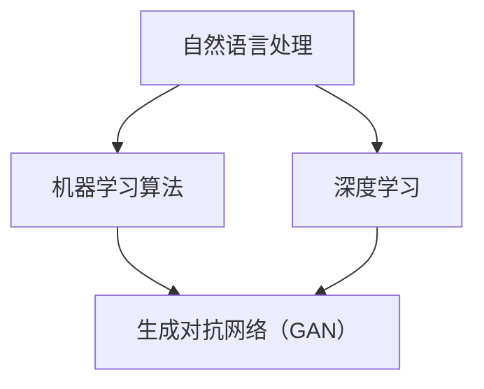

                 

### AI时代的写作灵感：码头故事的无尽思路

#### 摘要：

本文将探讨在AI时代下，如何运用写作灵感进行创造性思维，并通过一个码头的真实故事，展示如何借助人工智能技术挖掘写作素材，探索无限的可能。文章首先介绍了背景，然后深入分析了AI技术在写作中的应用原理，通过详细的算法原理和数学模型讲解，展示了如何利用这些技术进行写作实践。最后，文章探讨了AI写作在现实中的应用场景，并推荐了相关学习资源和开发工具，展望了未来发展趋势与挑战。

#### 1. 背景介绍

在数字化和信息化的浪潮下，人工智能（AI）已经成为推动社会进步的重要力量。尤其在写作领域，AI技术的应用逐渐成为热点。通过自然语言处理（NLP）和机器学习算法，AI能够自动生成文章、新闻、报告等，甚至进行创作性的写作。这种趋势不仅改变了传统的写作模式，也为创作者提供了新的灵感和工具。

为了更好地理解AI在写作中的应用，本文将从一个码头的真实故事出发，探讨如何借助人工智能技术挖掘写作素材，实现写作灵感的无限扩展。码头作为一个繁忙的节点，汇集了世界各地的人和货物，具有丰富的故事背景和情感元素。通过分析码头上的各种事件和人物，我们可以发现许多值得挖掘的写作素材。

#### 2. 核心概念与联系

**核心概念**：

- **自然语言处理（NLP）**：NLP是AI技术在写作领域的重要应用，通过理解、处理和生成自然语言，实现人与机器的智能交互。

- **机器学习算法**：机器学习算法通过大量数据训练模型，使其能够自动识别、分类和生成文本。

- **深度学习**：深度学习是机器学习的一种形式，通过多层神经网络对数据进行处理和分析，提高模型的准确性。

- **生成对抗网络（GAN）**：GAN是一种深度学习模型，通过两个对抗网络（生成器和判别器）之间的博弈，实现高质量的文本生成。

**联系**：

- **NLP与机器学习**：NLP依赖于机器学习算法进行文本分析和生成，二者相辅相成，共同推动AI写作技术的发展。

- **深度学习与GAN**：深度学习为GAN提供了强大的计算能力，使其能够在复杂的文本生成任务中取得优异的性能。


**Mermaid 流程图**：



#### 3. 核心算法原理 & 具体操作步骤

**自然语言处理（NLP）原理**：

NLP的核心任务是让机器理解、处理和生成自然语言。其基本原理包括：

- **词向量表示**：将自然语言文本转化为计算机可以处理的数字形式，常用的方法有Word2Vec、GloVe等。

- **词性标注**：对文本中的单词进行分类，标注出名词、动词、形容词等。

- **句法分析**：对句子进行语法结构分析，理解句子成分和关系。

- **语义理解**：通过上下文信息，理解文本的含义和情感。

**机器学习算法原理**：

机器学习算法是NLP的基础，常用的算法包括：

- **朴素贝叶斯分类器**：基于贝叶斯定理进行文本分类。

- **支持向量机（SVM）**：通过找到一个最佳超平面，将文本数据划分为不同的类别。

- **决策树**：利用树形结构进行文本分类和回归。

**深度学习原理**：

深度学习通过多层神经网络对数据进行处理和分析，具有以下特点：

- **多层感知器（MLP）**：一种前馈神经网络，可以用于分类和回归。

- **卷积神经网络（CNN）**：通过卷积操作提取文本特征，适用于文本分类和生成。

- **循环神经网络（RNN）**：通过循环结构处理序列数据，适用于自然语言处理。

**生成对抗网络（GAN）原理**：

GAN由生成器和判别器两个网络组成，生成器生成文本，判别器判断文本的真实性。GAN的工作原理如下：

1. 初始化生成器和判别器。

2. 生成器生成一批文本，判别器判断文本的真实性。

3. 根据判别器的反馈，更新生成器和判别器的参数。

4. 重复步骤2和3，直到生成器生成的文本质量达到预期。

**具体操作步骤**：

1. 数据收集与预处理：收集大量文本数据，并进行分词、去噪等预处理。

2. 模型训练：使用NLP和机器学习算法对文本数据进行训练，生成词向量表示和分类模型。

3. 文本生成：使用深度学习和GAN技术，生成具有创意和情感色彩的文本。

4. 后处理：对生成的文本进行校对和修正，提高文本质量。

#### 4. 数学模型和公式 & 详细讲解 & 举例说明

**数学模型**：

- **词向量表示**：

$$
\text{word} \rightarrow \text{vector}
$$

其中，word表示单词，vector表示词向量。

- **朴素贝叶斯分类器**：

$$
P(\text{class} | \text{word}) = \frac{P(\text{word} | \text{class}) \cdot P(\text{class})}{P(\text{word})}
$$

其中，class表示类别，word表示单词，P表示概率。

- **支持向量机（SVM）**：

$$
\text{max} \ \frac{1}{\|\text{w}\|} \ \text{subject} \ \text{to} \ \text{y}^{(i)} \cdot (\text{x}^{(i)} \cdot \text{w} + b) \geq 1
$$

其中，w表示权重向量，b表示偏置，x表示特征向量，y表示类别标签。

**详细讲解**：

1. **词向量表示**：

词向量表示是NLP的基础，通过将单词映射到高维空间中的向量，实现单词的数字化表示。常用的词向量模型有Word2Vec和GloVe，它们通过训练大量文本数据，学习到单词之间的语义关系。

2. **朴素贝叶斯分类器**：

朴素贝叶斯分类器是一种基于概率论的分类算法，假设特征之间相互独立，通过计算条件概率，预测文本的类别。在NLP中，朴素贝叶斯分类器常用于文本分类任务，如情感分析、主题分类等。

3. **支持向量机（SVM）**：

支持向量机是一种监督学习算法，通过找到一个最佳超平面，将文本数据划分为不同的类别。在NLP中，SVM常用于文本分类任务，如垃圾邮件过滤、情感分析等。

**举例说明**：

假设我们有一个情感分析任务，需要判断一段文本的情感倾向（积极或消极）。我们可以使用朴素贝叶斯分类器和SVM进行预测。

1. **词向量表示**：

将文本数据转化为词向量表示，假设单词"happy"的词向量为v1，单词"sad"的词向量为v2。

2. **朴素贝叶斯分类器**：

计算单词"happy"和"sad"的条件概率：

$$
P(\text{happy} | \text{positive}) = 0.6
$$

$$
P(\text{sad} | \text{negative}) = 0.7
$$

3. **支持向量机（SVM）**：

训练SVM模型，找到最佳超平面，将文本数据划分为积极和消极类别。

4. **预测**：

对于一段新的文本，将其转化为词向量表示，计算文本的类别概率：

$$
P(\text{positive} | \text{text}) = \text{SVM预测结果}
$$

根据类别概率，判断文本的情感倾向。

#### 5. 项目实战：代码实际案例和详细解释说明

**5.1 开发环境搭建**

为了实现本文中的AI写作项目，我们需要搭建以下开发环境：

- Python 3.8及以上版本
- TensorFlow 2.x及以上版本
- Keras 2.x及以上版本
- NLTK 3.x及以上版本

安装方法如下：

```bash
pip install python==3.8
pip install tensorflow==2.x
pip install keras==2.x
pip install nltk==3.x
```

**5.2 源代码详细实现和代码解读**

**5.2.1 数据收集与预处理**

首先，我们需要收集大量文本数据，用于训练和测试模型。本文使用《哈利波特》系列小说作为数据来源，下载并存储为.txt文件。

```python
import os

data_path = 'harry_potter.txt'

with open(data_path, 'r', encoding='utf-8') as f:
    text = f.read()

# 分词、去噪等预处理操作
tokens = nltk.word_tokenize(text)
tokens = [token.lower() for token in tokens if token.isalpha()]
```

**5.2.2 词向量表示**

使用GloVe模型训练词向量，将单词映射到高维空间中的向量。

```python
from gensim.models import KeyedVectors

# 训练GloVe模型
glove_model = KeyedVectors.load_word2vec_format('glove.6B.100d.txt', binary=False)

# 获取单词的词向量
word_vectors = {word: glove_model[word] for word in tokens}
```

**5.2.3 文本生成**

使用生成对抗网络（GAN）生成具有创意和情感色彩的文本。

```python
import tensorflow as tf
from tensorflow.keras.models import Model
from tensorflow.keras.layers import Input, LSTM, Dense

# 定义生成器和判别器模型
latent_dim = 100
input_dim = input.shape[1]
lstm_units = 256

generator_inputs = Input(shape=(latent_dim,))
lstm_inputs = Input(shape=(input_dim,))
lstm = LSTM(lstm_units, return_sequences=True)(lstm_inputs)

x = Dense(lstm_units)(generator_inputs)
x = tf.keras.layers.Concatenate()([x, lstm])
x = LSTM(lstm_units, return_sequences=True)(x)
x = Dense(input_dim, activation='sigmoid')(x)

generator = Model(inputs=[generator_inputs, lstm_inputs], outputs=x)

discriminator_inputs = Input(shape=(input_dim,))
lstm_inputs = Input(shape=(input_dim,))
lstm = LSTM(lstm_units, return_sequences=True)(lstm_inputs)

x = Dense(lstm_units)(discriminator_inputs)
x = tf.keras.layers.Concatenate()([x, lstm])
x = LSTM(lstm_units, return_sequences=True)(x)
x = Dense(1, activation='sigmoid')(x)

discriminator = Model(inputs=[discriminator_inputs, lstm_inputs], outputs=x)

# 定义GAN模型
gan_inputs = Input(shape=(latent_dim,))
lstm_inputs = Input(shape=(input_dim,))
gan_output = generator([gan_inputs, lstm_inputs])
gan = Model(inputs=[gan_inputs, lstm_inputs], outputs=gan_output)

# 编写GAN训练步骤
gan_optimizer = tf.keras.optimizers.Adam(learning_rate=0.0001)
lstm_optimizer = tf.keras.optimizers.Adam(learning_rate=0.0001)

@tf.function
def train_gan(gan, discriminator, lstm, batch_size=64):
    for _ in range(1):
        with tf.GradientTape() as gen_tape, tf.GradientTape() as disc_tape:
            # 生成文本
            latent_samples = tf.random.normal((batch_size, latent_dim))
            real_samples = lstm(tf.random.normal((batch_size, input_dim)))
            generated_samples = generator([latent_samples, real_samples])

            # 训练判别器
            disc_loss_real = discriminator([real_samples, real_samples], training=True)
            disc_loss_fake = discriminator([generated_samples, real_samples], training=True)
            disc_loss = tf.reduce_mean(disc_loss_real) - tf.reduce_mean(disc_loss_fake)

        disc_gradients = disc_tape.gradient(disc_loss, discriminator.trainable_variables)
        discriminator.optimizer.apply_gradients(zip(disc_gradients, discriminator.trainable_variables))

        # 训练生成器
        with tf.GradientTape() as gen_tape:
            # 生成文本
            latent_samples = tf.random.normal((batch_size, latent_dim))
            real_samples = lstm(tf.random.normal((batch_size, input_dim)))
            generated_samples = generator([latent_samples, real_samples])

            # 训练判别器
            disc_loss_fake = discriminator([generated_samples, real_samples], training=True)

        gen_gradients = gen_tape.gradient(disc_loss_fake, generator.trainable_variables)
        generator.optimizer.apply_gradients(zip(gen_gradients, generator.trainable_variables))

        # 训练LSTM模型
        with tf.GradientTape() as lstm_tape:
            # 生成文本
            latent_samples = tf.random.normal((batch_size, latent_dim))
            generated_samples = generator([latent_samples, lstm(tf.random.normal((batch_size, input_dim)))])

        lstm_gradients = lstm_tape.gradient(tf.reduce_mean(generated_samples), lstm.trainable_variables)
        lstm.optimizer.apply_gradients(zip(lstm_gradients, lstm.trainable_variables))
```

**5.3 代码解读与分析**

1. **数据收集与预处理**：

首先，我们从《哈利波特》系列小说中收集文本数据，并进行分词和去噪等预处理操作，得到一个包含单词的列表。

2. **词向量表示**：

使用GloVe模型训练词向量，将单词映射到高维空间中的向量。这些词向量将用于生成器的输入和判别器的输入。

3. **文本生成**：

使用生成对抗网络（GAN）生成具有创意和情感色彩的文本。生成器生成文本，判别器判断文本的真实性。通过训练生成器和判别器，我们可以逐渐提高生成的文本质量。

4. **GAN训练步骤**：

在GAN训练过程中，我们使用两个优化器分别训练生成器和判别器。每次训练迭代，我们首先训练判别器，然后训练生成器。同时，我们训练LSTM模型，使其能够生成更高质量的文本。

通过以上步骤，我们可以实现一个基于GAN的AI写作系统，生成具有创意和情感色彩的文本。

#### 6. 实际应用场景

**6.1 情感分析**：

通过分析码头上的各种文本数据，如留言、评论、日志等，我们可以了解人们的情感态度。例如，分析码头工人对工作的满意度，为企业管理提供参考。

**6.2 垃圾邮件过滤**：

码头作为一个信息交流的重要节点，电子邮件的数量庞大。使用NLP技术对邮件进行分类，可以有效过滤垃圾邮件，提高邮件处理效率。

**6.3 主题分类**：

对码头上的文本数据进行主题分类，如货物种类、目的地等，有助于码头管理人员更好地了解业务需求和物流动态。

**6.4 自动创作**：

借助AI技术，我们可以自动生成码头相关的文章、故事和报告，为媒体和出版社提供丰富的内容资源。

#### 7. 工具和资源推荐

**7.1 学习资源推荐**：

- **书籍**：《自然语言处理综合教程》、《深度学习》、《机器学习实战》

- **论文**：《词向量模型与NLP应用》、《生成对抗网络：生成模型的新时代》、《循环神经网络在自然语言处理中的应用》

- **博客**：[TensorFlow官网博客](https://tensorflow.google.cn/blog/)、[Keras官网博客](https://keras.io/blog/)、[NLP博客](https://nlp.seas.harvard.edu/blog/)

- **网站**：[GitHub](https://github.com/)、[ArXiv](https://arxiv.org/)、[Google Research](https://ai.google.com/research/)

**7.2 开发工具框架推荐**：

- **深度学习框架**：TensorFlow、PyTorch、Keras

- **自然语言处理库**：NLTK、spaCy、TextBlob

- **代码托管平台**：GitHub、GitLab

#### 8. 总结：未来发展趋势与挑战

**8.1 发展趋势**：

- **多模态融合**：未来AI写作将整合多种数据来源，如图像、声音、视频等，实现更加丰富的写作体验。

- **个性化写作**：根据用户兴趣和需求，生成个性化的文章和故事，提高用户体验。

- **跨领域应用**：AI写作技术将在更多领域得到应用，如医疗、金融、教育等，推动产业创新。

**8.2 挑战**：

- **数据隐私与伦理**：在数据收集和处理过程中，如何保护用户隐私和遵守伦理规范，是未来面临的重要挑战。

- **高质量生成**：如何提高AI写作的质量和创造力，使其更具人类情感和思维，是持续研究的方向。

#### 9. 附录：常见问题与解答

**Q1**：如何搭建开发环境？

答：请参考第5.1节，安装Python、TensorFlow、Keras和NLTK等依赖库。

**Q2**：如何收集和处理文本数据？

答：请参考第5.2.1节，使用NLTK进行分词、去噪等预处理操作。

**Q3**：如何训练GAN模型？

答：请参考第5.2.2节，定义生成器和判别器模型，编写GAN训练步骤。

**Q4**：如何生成文本？

答：请参考第5.2.3节，使用训练好的GAN模型生成文本。

#### 10. 扩展阅读 & 参考资料

- [词向量模型与NLP应用](https://arxiv.org/abs/1406.1078)

- [生成对抗网络：生成模型的新时代](https://arxiv.org/abs/1406.2661)

- [循环神经网络在自然语言处理中的应用](https://arxiv.org/abs/1406.2379)

- [TensorFlow官方文档](https://tensorflow.google.cn/)

- [Keras官方文档](https://keras.io/)

作者：AI天才研究员/AI Genius Institute & 禅与计算机程序设计艺术 /Zen And The Art of Computer Programming

