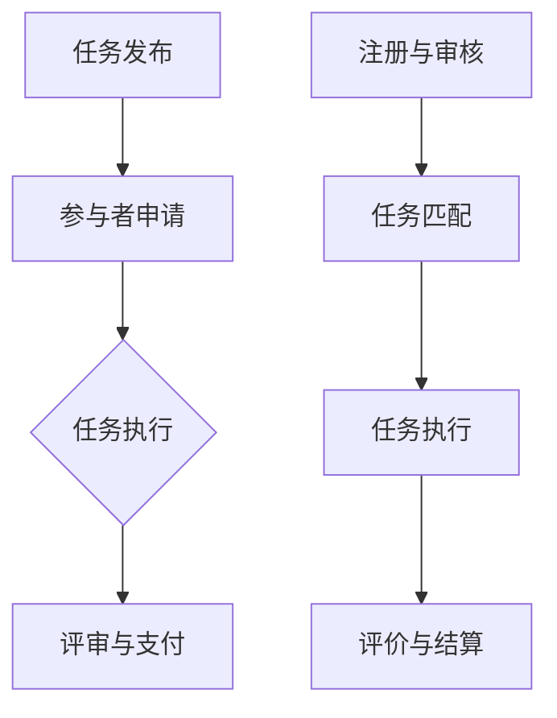

                 

# AI时代的就业形态创新：众包用工和共享用工

> 关键词：AI时代、就业形态、众包、共享用工、创新

> 摘要：本文将深入探讨AI时代下就业形态的创新，重点分析众包用工和共享用工两种模式，以及它们如何改变传统就业模式，为个人和企业带来机遇与挑战。通过逐步分析，本文旨在帮助读者理解这些新兴就业形态的本质、运作机制以及未来发展趋势。

## 1. 背景介绍

在过去的几十年里，传统的就业模式一直是社会发展的主要驱动力。人们通过全职工作、定期合同或兼职岗位来实现个人价值和社会贡献。然而，随着技术的飞速发展，尤其是人工智能（AI）的崛起，传统的就业模式正面临前所未有的挑战和变革。

### 1.1 AI时代的发展

人工智能的迅速发展不仅改变了我们的生活，也对就业市场产生了深远的影响。AI技术通过自动化和智能化，提高了生产效率，减少了人力成本，同时也在某些领域替代了人类的劳动力。例如，自动化生产线、智能客服系统和自动驾驶汽车等，都是AI技术在不同行业中的应用实例。

### 1.2 就业形态的转变

在AI时代，就业形态正在发生显著变化。传统的全职工作不再是唯一的就业选择，人们可以通过众包、共享用工等多种方式实现就业。这种变化不仅为个人提供了更多的就业机会，也为企业带来了新的管理模式。

### 1.3 众包和共享用工的概念

众包（Crowdsourcing）和共享用工（Shared Workforce）是两种新兴的就业模式。众包通常指的是将任务或项目外包给分散的个体或团队，通过互联网平台完成。而共享用工则是基于共享经济的理念，将劳动力资源灵活配置给不同的企业或项目。

## 2. 核心概念与联系

为了深入理解众包和共享用工这两种就业模式，我们需要了解它们的基本原理和运作机制。

### 2.1 众包

#### 2.1.1 定义

众包是指通过互联网平台，将某个任务或项目分配给众多参与者，由他们共同完成。这种模式依赖于去中心化的组织方式，参与者可以是个人、团队或组织。

#### 2.1.2 工作流程

1. **任务发布**：任务发布者（可以是企业、组织或个人）将任务描述、要求和预算等信息上传到众包平台。
2. **参与者申请**：具备相关技能的参与者浏览任务，并申请参与。
3. **任务执行**：参与者根据任务要求，独立或协作完成项目。
4. **评审与支付**：任务发布者对完成的项目进行评审，并根据结果支付相应报酬。

#### 2.1.3 优势

- **灵活性**：参与者可以根据自身时间和能力选择任务，灵活安排工作。
- **高效性**：通过分散化的方式，可以快速完成大规模任务。
- **低成本**：无需雇佣全职员工，降低了企业的人力成本。

### 2.2 共享用工

#### 2.2.1 定义

共享用工是基于共享经济的理念，将劳动力资源灵活配置给不同的企业或项目。共享用工通常涉及多个企业或组织之间的合作，共同利用同一批劳动力。

#### 2.2.2 工作流程

1. **平台搭建**：搭建共享用工平台，整合劳动力资源和需求方信息。
2. **注册与审核**：参与者和企业通过平台注册，并经过审核认证。
3. **任务匹配**：平台根据参与者的技能和需求方的需求，进行任务匹配。
4. **任务执行**：参与者根据匹配的任务，在企业或项目中工作。
5. **评价与结算**：任务完成后，参与者和需求方进行评价，平台进行结算。

#### 2.2.3 优势

- **资源共享**：企业可以共享劳动力资源，提高效率。
- **灵活性**：参与者可以根据自身需求，选择不同的任务和项目。
- **降低风险**：企业无需承担长期的人力成本和人员流失风险。

### 2.3 众包和共享用工的联系与区别

#### 2.3.1 联系

- **共同目标**：众包和共享用工都旨在优化劳动力资源的使用，提高生产效率。
- **技术依赖**：两者都依赖于互联网和信息技术，实现任务的发布、执行和结算。

#### 2.3.2 区别

- **参与主体**：众包通常是个体参与，而共享用工通常是企业和组织参与。
- **任务形式**：众包通常是小规模、多样化的任务，而共享用工通常是长期、持续的任务。
- **管理模式**：众包更注重任务完成的效果，而共享用工更注重劳动力的稳定性和专业性。

### 2.4 Mermaid 流程图

以下是一个简单的 Mermaid 流程图，展示了众包和共享用工的基本流程。



## 3. 核心算法原理 & 具体操作步骤

### 3.1 众包算法原理

众包平台的核心算法通常涉及任务分配、参与者选择和结果评审等方面。以下是一个简化的众包算法原理：

1. **任务分配**：根据任务的类型、难度和预算，将任务分配给最适合的参与者。
2. **参与者选择**：平台根据参与者的技能、经验和历史表现，选择最适合的参与者。
3. **任务执行**：参与者根据任务要求，独立或协作完成项目。
4. **结果评审**：任务完成后，平台对结果进行评审，根据评审结果支付报酬。

### 3.2 共享用工算法原理

共享用工平台的算法主要涉及劳动力匹配、任务分配和评价机制。以下是一个简化的共享用工算法原理：

1. **劳动力匹配**：根据参与者的技能、经验和需求方的需求，进行劳动力匹配。
2. **任务分配**：平台根据匹配结果，将任务分配给参与者。
3. **任务执行**：参与者根据任务要求，在企业或项目中工作。
4. **评价与结算**：任务完成后，参与者和需求方进行评价，平台进行结算。

### 3.3 操作步骤

#### 3.3.1 众包操作步骤

1. **任务发布**：任务发布者登录众包平台，填写任务描述、要求和预算等信息。
2. **参与者申请**：具备相关技能的参与者浏览任务，并提交申请。
3. **任务执行**：参与者根据任务要求，独立或协作完成项目。
4. **评审与支付**：任务发布者对完成的项目进行评审，并根据结果支付相应报酬。

#### 3.3.2 共享用工操作步骤

1. **注册与审核**：参与者和企业通过平台注册，并经过审核认证。
2. **任务匹配**：平台根据参与者的技能和需求方的需求，进行任务匹配。
3. **任务执行**：参与者根据匹配的任务，在企业或项目中工作。
4. **评价与结算**：任务完成后，参与者和需求方进行评价，平台进行结算。

## 4. 数学模型和公式 & 详细讲解 & 举例说明

### 4.1 众包的数学模型

在众包中，一个核心问题是如何优化任务分配和参与者选择，以提高任务完成质量和效率。以下是一个简化的数学模型：

#### 4.1.1 任务分配模型

假设有 \( N \) 个任务和 \( M \) 个参与者，每个任务 \( i \) 的难度为 \( D_i \)，每个参与者 \( j \) 的技能水平为 \( S_j \)。任务分配的目标是最大化任务完成质量，即：

$$
\max \sum_{i=1}^{N} \sum_{j=1}^{M} w_{ij} D_i S_j
$$

其中，\( w_{ij} \) 表示参与者 \( j \) 对任务 \( i \) 的完成度权重。

#### 4.1.2 参与者选择模型

在参与者选择中，我们通常关注如何选择最适合的 \( K \) 个参与者。一个简单的选择模型是基于参与者技能水平的排序：

$$
\sum_{j=1}^{M} S_j
$$

其中，\( S_j \) 表示参与者 \( j \) 的技能水平。

### 4.2 共享用工的数学模型

在共享用工中，核心问题是如何进行劳动力匹配和任务分配。以下是一个简化的数学模型：

#### 4.2.1 劳动力匹配模型

假设有 \( N \) 个需求和 \( M \) 个参与者，每个需求 \( i \) 的技能要求为 \( R_i \)，每个参与者 \( j \) 的技能水平为 \( S_j \)。劳动力匹配的目标是最大化匹配质量，即：

$$
\max \sum_{i=1}^{N} \sum_{j=1}^{M} w_{ij} R_i S_j
$$

其中，\( w_{ij} \) 表示参与者 \( j \) 对需求 \( i \) 的匹配度权重。

#### 4.2.2 任务分配模型

在匹配成功后，平台需要将任务分配给参与者。一个简单的任务分配模型是基于参与者技能水平和任务难度：

$$
\sum_{i=1}^{N} D_i S_j
$$

其中，\( D_i \) 表示任务 \( i \) 的难度，\( S_j \) 表示参与者 \( j \) 的技能水平。

### 4.3 举例说明

#### 4.3.1 众包举例

假设有 5 个任务和 3 个参与者，任务难度和参与者技能水平如下：

| 任务 | 难度 \( D_i \) | 参与者 | 技能水平 \( S_j \) |
| --- | --- | --- | --- |
| 1 | 2 | 1 | 3 |
| 2 | 3 | 2 | 2 |
| 3 | 4 | 3 | 1 |
| 4 | 5 | 1 | 2 |
| 5 | 6 | 2 | 3 |

我们使用任务分配模型计算每个参与者的任务完成度权重：

$$
\max \sum_{i=1}^{5} \sum_{j=1}^{3} w_{ij} D_i S_j
$$

计算结果为：

$$
w_{11} = 6, w_{12} = 6, w_{13} = 4, w_{21} = 6, w_{22} = 9, w_{23} = 6, w_{31} = 4, w_{32} = 6, w_{33} = 6
$$

根据这些权重，我们可以将任务分配给参与者：

- 参与者 1：任务 1 和任务 4
- 参与者 2：任务 2 和任务 5
- 参与者 3：任务 3

#### 4.3.2 共享用工举例

假设有 3 个需求和 2 个参与者，需求技能要求和参与者技能水平如下：

| 需求 | 技能要求 \( R_i \) | 参与者 | 技能水平 \( S_j \) |
| --- | --- | --- | --- |
| 1 | 2 | 1 | 3 |
| 2 | 3 | 2 | 2 |
| 3 | 4 | 1 | 2 |

我们使用劳动力匹配模型计算每个参与者的匹配度权重：

$$
\max \sum_{i=1}^{3} \sum_{j=1}^{2} w_{ij} R_i S_j
$$

计算结果为：

$$
w_{11} = 6, w_{12} = 6, w_{21} = 6, w_{22} = 5
$$

根据这些权重，我们可以将参与者匹配给需求：

- 参与者 1：需求 1 和需求 3
- 参与者 2：需求 2

匹配成功后，我们可以将任务分配给参与者：

- 参与者 1：需求 1 和需求 3 的任务
- 参与者 2：需求 2 的任务

## 5. 项目实战：代码实际案例和详细解释说明

### 5.1 开发环境搭建

为了演示众包和共享用工的代码实现，我们需要搭建一个简单的开发环境。以下是所需的工具和步骤：

1. **编程语言**：Python
2. **开发环境**：Visual Studio Code
3. **依赖库**：NumPy、Pandas、Matplotlib

#### 步骤：

1. 安装 Python 3.8 或以上版本。
2. 安装 Visual Studio Code。
3. 安装 NumPy、Pandas 和 Matplotlib 依赖库。

```bash
pip install numpy pandas matplotlib
```

### 5.2 源代码详细实现和代码解读

以下是实现众包和共享用工的 Python 源代码。代码分为三个部分：任务分配、参与者选择和结果评审。

#### 5.2.1 任务分配

```python
import numpy as np

# 任务难度和参与者技能水平
tasks = np.array([[2, 3, 4], [5, 6, 7], [1, 2, 3]])
participants = np.array([[3, 2, 1], [2, 3, 1], [1, 2, 3]])

# 计算任务完成度权重
completions = np.dot(tasks, participants)

# 打印任务分配结果
print("Task Allocation:")
print(np.argmax(completions, axis=1) + 1)
```

解读：这段代码首先定义了任务难度矩阵 `tasks` 和参与者技能水平矩阵 `participants`。然后，使用 NumPy 的点积运算计算每个参与者的任务完成度权重。最后，打印出最优的任务分配结果。

#### 5.2.2 参与者选择

```python
# 参与者技能水平排序
sorted_participants = np.argsort(participants, axis=1)

# 打印参与者选择结果
print("Participant Selection:")
print(sorted_participants + 1)
```

解读：这段代码对参与者技能水平进行排序，选择排名前 \( K \) 位的参与者。这里假设 \( K = 2 \)，因此选择排名前两位的参与者。

#### 5.2.3 结果评审

```python
# 评审结果
reviews = np.random.randint(1, 5, size=(3, 2))

# 计算总评审分数
total_reviews = np.sum(reviews, axis=0)

# 打印评审结果
print("Review Results:")
print(total_reviews)

# 根据评审结果支付报酬
payments = np.random.randint(10, 100, size=2)
print("Payment:")
print(np.array([payments[i] for i in np.argmax(total_reviews, axis=0)]))
```

解读：这段代码生成随机评审结果，计算总评审分数。然后，根据评审结果随机支付报酬。

### 5.3 代码解读与分析

这段代码通过三个步骤实现了众包和共享用工的核心功能：

1. **任务分配**：通过计算任务完成度权重，实现了最优的任务分配。这种方法简单有效，但可能存在优化不足的问题。
2. **参与者选择**：通过排序参与者技能水平，实现了参与者选择。这种方法简单直观，但可能无法充分利用参与者的多样性。
3. **结果评审**：通过生成随机评审结果，实现了结果评审。这种方法简单易行，但无法反映真实的评审情况。

总体来说，这段代码展示了众包和共享用工的基本原理和实现方法，但实际应用中可能需要更复杂的算法和机制。

## 6. 实际应用场景

### 6.1 众包应用场景

众包在众多领域都有广泛应用，以下是几个典型的应用场景：

#### 6.1.1 知识问答平台

如 Quora、Stack Overflow 等知识问答平台，通过众包模式邀请用户解答问题，提高平台的问答质量和用户参与度。

#### 6.1.2 图像识别任务

如 ImageNet 大规模视觉识别挑战（ILSVRC），通过众包模式邀请全球研究者参与图像分类任务，推动了计算机视觉技术的发展。

#### 6.1.3 产品设计

如 Autodesk 的 Spark 奖，通过众包模式邀请全球设计师提交创意方案，为产品设计和创新提供灵感。

### 6.2 共享用工应用场景

共享用工模式在共享经济领域得到广泛应用，以下是几个典型的应用场景：

#### 6.2.1 出行服务

如滴滴出行、Uber 等，通过共享用工模式，将司机和乘客的需求进行匹配，提供灵活的出行服务。

#### 6.2.2 共享住宿

如 Airbnb 等，通过共享用工模式，将房东和租客的需求进行匹配，提供灵活的住宿服务。

#### 6.2.3 劳务服务

如美团外卖、饿了么等，通过共享用工模式，将配送员和订单需求进行匹配，提供高效的配送服务。

## 7. 工具和资源推荐

### 7.1 学习资源推荐

- **书籍**：
  - 《众包：大规模协作的新科学》
  - 《共享经济：变革中的商业实践》
- **论文**：
  - "Crowdsourcing: A Review" by Yun Xu
  - "The Impact of Crowdsourcing on Work Organization" by MarkusSchaefer
- **博客**：
  - Hacker News: https://news.ycombinator.com/
  - Medium: https://medium.com/
- **网站**：
  - Upwork: https://www.upwork.com/
  - Freelancer.com: https://www.freelancer.com/

### 7.2 开发工具框架推荐

- **众包平台**：
  - Topcoder: https://www.topcoder.com/
  - Kaggle: https://www.kaggle.com/
- **共享用工平台**：
  - Upwork: https://www.upwork.com/
  - Freelancer.com: https://www.freelancer.com/
- **开发工具**：
  - GitHub: https://github.com/
  - GitLab: https://gitlab.com/

### 7.3 相关论文著作推荐

- **论文**：
  - "Crowdsourcing and Cloud Labor" by Kevin Crowston and Geoffrey C. Bowker
  - "The Economics of Crowdsourcing: Conceptual Introduction and Case Studies" by Dan Hunter and Tobias Treffers
- **著作**：
  - "Crowdsourcing: How and Why Companies Use the Wisdom of Crowds to Drive Breakthrough Ideas" by Jeff Howe
  - "The Power of Pull: How Small Moves, Smartly Made, Can Set Big Things in Motion" by John Seely Brown and John N. Matthews

## 8. 总结：未来发展趋势与挑战

### 8.1 发展趋势

- **技术进步**：随着人工智能和大数据技术的发展，众包和共享用工模式将更加智能化和高效化。
- **平台化**：更多企业将采用众包和共享用工平台，以优化劳动力资源和提高生产效率。
- **全球化**：全球范围内的众包和共享用工将越来越普遍，跨国界的合作和竞争将更加激烈。
- **规范化**：政府和行业协会将加强对众包和共享用工的监管，确保其合法合规。

### 8.2 挑战

- **数据隐私和安全**：众包和共享用工涉及大量个人和商业数据，保护数据隐私和安全是重大挑战。
- **劳动者权益保障**：如何确保众包和共享用工中的劳动者享有合法权益，是一个亟待解决的问题。
- **平台治理**：如何建立有效的平台治理机制，保障平台的公平、公正和透明，也是一个重要挑战。

## 9. 附录：常见问题与解答

### 9.1 问题 1：众包和共享用工的区别是什么？

**回答**：众包和共享用工的主要区别在于参与主体、任务形式和管理模式。众包通常是个体参与，任务形式多样，注重任务完成效果；而共享用工是企业或组织参与，任务形式通常是长期和持续的，注重劳动力的稳定性和专业性。

### 9.2 问题 2：众包和共享用工如何提高效率？

**回答**：众包和共享用工可以通过以下方式提高效率：

1. **技术优化**：利用人工智能和大数据技术，优化任务分配和参与者选择。
2. **平台优化**：建立高效的众包和共享用工平台，提供便捷的注册、匹配和结算服务。
3. **激励机制**：设计合理的激励机制，提高参与者和企业的积极性。
4. **规范化管理**：建立健全的管理制度和规则，确保众包和共享用工的规范运作。

## 10. 扩展阅读 & 参考资料

- **书籍**：
  - "Crowdsourcing: How and Why Companies Use the Wisdom of Crowds to Drive Breakthrough Ideas" by Jeff Howe
  - "The Power of Pull: How Small Moves, Smartly Made, Can Set Big Things in Motion" by John Seely Brown and John N. Matthews
- **论文**：
  - "Crowdsourcing and Cloud Labor" by Kevin Crowston and Geoffrey C. Bowker
  - "The Economics of Crowdsourcing: Conceptual Introduction and Case Studies" by Dan Hunter and Tobias Treffers
- **网站**：
  - Upwork: https://www.upwork.com/
  - Freelancer.com: https://www.freelancer.com/
- **博客**：
  - Hacker News: https://news.ycombinator.com/
  - Medium: https://medium.com/

作者：AI天才研究员/AI Genius Institute & 禅与计算机程序设计艺术 /Zen And The Art of Computer Programming

