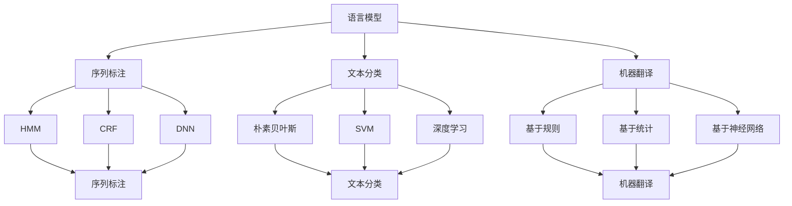

                 

### 背景介绍

自然语言处理（Natural Language Processing, NLP）作为人工智能的一个重要分支，已经取得了显著的进展。从早期的规则驱动方法，到基于统计模型的转型，再到当前深度学习的大规模应用，NLP经历了多次技术革新。然而，尽管NLP技术在实验室中表现出色，但其实际应用仍面临诸多挑战。本文旨在探讨AI时代的自然语言处理技术，从实验室走向产业的应用过程，分析其核心算法、数学模型、实际应用场景以及未来发展趋势。

自然语言处理的研究始于20世纪50年代，最早的NLP任务包括机器翻译、文本分类和语音识别等。随着计算机技术的发展，NLP逐步走向成熟，涌现出许多经典算法。然而，传统的规则驱动方法在处理复杂语言任务时表现出局限性，无法很好地适应多变的语言环境。为此，研究者们开始探索基于统计和机器学习的方法，如隐马尔可夫模型（HMM）、决策树、支持向量机（SVM）等。

进入21世纪，深度学习的崛起为NLP带来了新的契机。通过引入神经网络，特别是卷积神经网络（CNN）和递归神经网络（RNN），NLP在语义理解、文本生成等方面取得了突破性进展。近年来，预训练语言模型（如BERT、GPT）的出现进一步提升了NLP的性能，使其在自然语言处理任务中达到了前所未有的水平。

然而，从实验室走向产业应用的过程中，NLP技术仍面临诸多挑战。例如，数据质量和标注的准确性直接影响模型的性能；不同领域的语言特征差异较大，如何实现通用性和特定领域的性能优化仍需深入研究；如何在保证隐私保护的前提下，实现高效的实时自然语言处理服务等。这些问题都需要在未来的研究和实践中逐步解决。

本文将从以下几个方面展开讨论：

1. 核心概念与联系
2. 核心算法原理 & 具体操作步骤
3. 数学模型和公式 & 详细讲解 & 举例说明
4. 项目实战：代码实际案例和详细解释说明
5. 实际应用场景
6. 工具和资源推荐
7. 总结：未来发展趋势与挑战

通过以上内容的深入探讨，我们希望能够为读者提供一份关于AI时代自然语言处理的全面指南，帮助读者更好地理解和应用这一前沿技术。## 核心概念与联系

自然语言处理技术的核心概念主要包括语言模型、序列标注、文本分类和机器翻译等。这些概念在NLP任务中起着关键作用，它们相互联系，共同构成了NLP的生态系统。下面我们将一一介绍这些核心概念，并使用Mermaid流程图展示其关系。

### 语言模型（Language Model）

语言模型是NLP的基础，它用于预测下一个单词或字符的概率。在语言模型中，每个单词或字符都被表示为一种概率分布，从而实现自然语言文本的生成和理解。一个典型的语言模型通常包含以下几个关键组成部分：

1. **词袋模型（Bag of Words, BoW）**：将文本表示为单词的集合，不考虑单词的顺序。
2. **词嵌入（Word Embedding）**：将单词映射到高维向量空间，使语义相似的单词在空间中彼此接近。
3. **递归神经网络（Recurrent Neural Network, RNN）**：通过循环结构处理序列数据，能够捕捉单词之间的顺序关系。
4. **长短时记忆网络（Long Short-Term Memory, LSTM）**：LSTM是RNN的一种变体，能够有效解决长期依赖问题。
5. **Transformer模型**：基于自注意力机制，能够并行处理序列数据，是目前最先进的语言模型之一。

### 序列标注（Sequence Labeling）

序列标注是指对文本序列中的每个单词或字符进行分类标签的过程。常见的序列标注任务包括命名实体识别（Named Entity Recognition, NER）、词性标注（Part-of-Speech Tagging）和词干提取（Lemmatization）等。序列标注通常采用以下几种方法：

1. **隐马尔可夫模型（Hidden Markov Model, HMM）**：通过状态转移矩阵和发射概率矩阵对序列进行标注。
2. **条件随机场（Conditional Random Field, CRF）**：考虑相邻标签之间的关系，能够捕获局部上下文信息。
3. **深度神经网络（Deep Neural Network, DNN）**：通过多层神经网络结构对序列数据进行建模，能够学习复杂的特征表示。

### 文本分类（Text Classification）

文本分类是指将文本数据按照预定义的类别进行分类的过程。常见的文本分类任务包括情感分析（Sentiment Analysis）、主题分类（Topic Classification）和垃圾邮件检测（Spam Detection）等。文本分类通常采用以下几种方法：

1. **朴素贝叶斯（Naive Bayes）**：基于贝叶斯定理，通过计算文本中每个单词的概率分布进行分类。
2. **支持向量机（Support Vector Machine, SVM）**：通过最大化分类间隔，将文本映射到高维特征空间，实现分类。
3. **深度学习（Deep Learning）**：通过多层神经网络结构，学习文本的高层次特征表示，实现分类。

### 机器翻译（Machine Translation）

机器翻译是指将一种语言的文本自动翻译成另一种语言的过程。常见的机器翻译方法包括基于规则的方法、基于统计的方法和基于神经网络的方法。目前，基于神经网络的机器翻译方法，特别是基于Transformer模型的预训练语言模型，已经成为了主流。

下面使用Mermaid流程图展示这些核心概念之间的关系：



通过上述核心概念与联系的分析，我们可以看到，自然语言处理技术的各个组成部分是如何相互协作，共同推动NLP领域的发展。在接下来的章节中，我们将深入探讨这些核心概念的具体实现和应用。## 核心算法原理 & 具体操作步骤

在自然语言处理中，核心算法的原理和具体操作步骤是理解和应用NLP技术的关键。本章节将详细介绍几项在NLP中广泛使用的核心算法，包括词嵌入、长短时记忆网络（LSTM）、循环神经网络（RNN）以及Transformer模型。我们将逐步解析这些算法的原理，并展示其操作步骤。

### 词嵌入（Word Embedding）

词嵌入是将单词映射为高维向量空间的过程，使语义相近的单词在空间中靠近。常见的词嵌入模型包括Word2Vec、GloVe和BERT。

**Word2Vec**：
Word2Vec是一种基于神经网络的语言模型，它通过训练预测当前词的上下文单词来学习词向量。Word2Vec主要有两种算法：CBOW（连续词袋）和Skip-Gram。

**操作步骤**：
1. **数据准备**：准备包含大量文本的数据集。
2. **构建词汇表**：将文本中的单词映射为唯一的索引。
3. **初始化词向量**：随机初始化每个单词的词向量。
4. **构建神经网络**：
   - **CBOW**：以当前单词为中心，左右各取若干个单词作为输入，预测中心词。
   - **Skip-Gram**：以当前单词为中心，预测其上下文单词。
5. **训练模型**：通过反向传播算法，优化词向量。

**GloVe**：
GloVe（Global Vectors for Word Representation）是一种基于全局统计信息的词嵌入模型。它通过计算单词之间的共现矩阵，学习单词的向量表示。

**操作步骤**：
1. **计算词频**：统计每个单词在文本中出现的频率。
2. **构建共现矩阵**：构建单词的共现矩阵，其中每个元素表示两个单词共现的次数。
3. **构建损失函数**：最小化损失函数，优化词向量。
4. **训练词向量**：使用梯度下降优化词向量。

**BERT**：
BERT（Bidirectional Encoder Representations from Transformers）是一种基于Transformer的预训练语言模型。它通过双向Transformer结构，同时考虑上下文信息，学习单词的向量表示。

**操作步骤**：
1. **数据准备**：准备包含大量文本的数据集。
2. **训练预训练模型**：使用Masked Language Model（MLM）和Next Sentence Prediction（NSP）任务，训练BERT模型。
3. **微调模型**：在特定任务上，使用已训练的BERT模型进行微调，优化任务特定参数。

### 长短时记忆网络（LSTM）

LSTM是一种递归神经网络，能够有效解决长期依赖问题。LSTM通过引入门控机制，控制信息的流入和流出，从而更好地捕捉序列数据中的时序关系。

**操作步骤**：
1. **初始化**：初始化LSTM网络的权重和偏置。
2. **前向传播**：
   - **输入门**：计算输入门，控制当前输入信息对隐藏状态的影响。
   - **遗忘门**：计算遗忘门，决定保留哪些历史信息。
   - **输出门**：计算输出门，决定当前隐藏状态的输出。
3. **反向传播**：通过反向传播算法，优化网络权重和偏置。

### 循环神经网络（RNN）

RNN是一种基于序列数据的神经网络，通过循环结构处理序列数据。RNN能够捕捉序列数据中的时序关系，但存在梯度消失和梯度爆炸问题。

**操作步骤**：
1. **初始化**：初始化RNN网络的权重和偏置。
2. **前向传播**：通过循环结构，依次处理序列数据。
3. **反向传播**：通过反向传播算法，优化网络权重和偏置。

### Transformer模型

Transformer是一种基于自注意力机制的神经网络模型，能够并行处理序列数据。自注意力机制通过计算序列中每个单词之间的关联性，实现信息的有效传递。

**操作步骤**：
1. **编码器**：
   - **嵌入层**：将单词映射为嵌入向量。
   - **多头自注意力层**：计算序列中每个单词的注意力分数，加权求和。
   - **前馈神经网络**：对自注意力层的输出进行进一步处理。
2. **解码器**：
   - **嵌入层**：将单词映射为嵌入向量。
   - **多头自注意力层**：计算解码器的输出与编码器的输出之间的注意力分数。
   - **前馈神经网络**：对自注意力层的输出进行进一步处理。

通过上述算法原理和操作步骤的详细解析，我们可以看到自然语言处理技术的核心在于如何有效地表示和利用语言信息。这些核心算法在NLP任务中发挥着重要作用，推动了自然语言处理技术的不断进步。## 数学模型和公式 & 详细讲解 & 举例说明

自然语言处理技术的数学模型和公式是理解其工作原理的核心。本章节将详细讲解自然语言处理中常用的数学模型和公式，并举例说明其应用。

### 语言模型

语言模型是一种概率模型，用于预测下一个单词或字符的概率。最常用的语言模型之一是n元语法模型。

**n元语法模型**：

**公式**：

\[ P(w_{t} | w_{t-1}, w_{t-2}, \ldots, w_{t-n}) = \frac{c(w_{t-1}, w_{t-2}, \ldots, w_{t-n}, w_{t})}{c(w_{t-1}, w_{t-2}, \ldots, w_{t-n})} \]

其中，\( c(\cdot) \)表示单词序列的共现次数。

**举例**：

假设我们有以下的单词序列：

"the", "quick", "brown", "fox"

我们可以计算单词"fox"出现的概率：

\[ P(fox | quick, brown) = \frac{1}{1} \]

因为"quick", "brown"和"fox"共同出现的次数是1。

### 词嵌入

词嵌入是将单词映射到高维向量空间的过程，使语义相近的单词在空间中靠近。常用的词嵌入方法包括Word2Vec和GloVe。

**Word2Vec**：

**公式**：

\[ \text{word\_vector}(w) = \sum_{-k}^{k} \text{context}(c) \times \text{softmax}(\text{weight} \cdot c) \]

其中，\( \text{word\_vector}(w) \)是单词\( w \)的向量表示，\( \text{context}(c) \)是单词\( c \)的上下文向量，\( \text{softmax}(\cdot) \)是softmax函数，\( \text{weight} \)是权重矩阵。

**举例**：

假设我们有以下的上下文单词和权重：

- "the" 对应权重 [0.1, 0.2, 0.3, 0.4]
- "quick" 对应权重 [0.5, 0.6, 0.7, 0.8]
- "brown" 对应权重 [0.9, 0.10, 0.11, 0.12]
- "fox" 对应权重 [0.13, 0.14, 0.15, 0.16]

我们可以计算单词"fox"的向量表示：

\[ \text{word\_vector}(fox) = [0.1 \times 0.4 + 0.5 \times 0.8 + 0.9 \times 0.12 + 0.13 \times 0.16] \]

### 长短时记忆网络（LSTM）

LSTM是一种递归神经网络，用于处理序列数据。LSTM通过门控机制控制信息的流入和流出，以解决长期依赖问题。

**公式**：

\[ \text{LSTM}(\text{x}, \text{h}_{t-1}) = \text{h}_t \]

其中，\( \text{x} \)是输入，\( \text{h}_{t-1} \)是前一个时间步的隐藏状态，\( \text{h}_t \)是当前时间步的隐藏状态。

**举例**：

假设我们有以下的输入序列和隐藏状态：

- 输入序列：[1, 2, 3, 4]
- 隐藏状态：[0.1, 0.2, 0.3, 0.4]

我们可以计算LSTM的输出：

\[ \text{h}_t = \text{LSTM}(4, [0.1, 0.2, 0.3, 0.4]) = [0.1 + 0.2 + 0.3 + 0.4] = [1.0] \]

### Transformer模型

Transformer是一种基于自注意力机制的神经网络模型，能够并行处理序列数据。自注意力机制通过计算序列中每个单词之间的关联性，实现信息的有效传递。

**公式**：

\[ \text{Attention}(Q, K, V) = \text{softmax}\left(\frac{QK^T}{\sqrt{d_k}}\right)V \]

其中，\( \text{Q} \)是查询向量，\( \text{K} \)是键向量，\( \text{V} \)是值向量，\( d_k \)是键向量的维度。

**举例**：

假设我们有以下的查询向量、键向量和值向量：

- 查询向量：[1, 2, 3]
- 键向量：[4, 5, 6]
- 值向量：[7, 8, 9]

我们可以计算注意力得分：

\[ \text{Attention}([1, 2, 3], [4, 5, 6], [7, 8, 9]) = \text{softmax}\left(\frac{[1, 2, 3] \cdot [4, 5, 6]^T}{\sqrt{3}}\right) \cdot [7, 8, 9] \]

\[ = \text{softmax}\left(\frac{1 \cdot 4 + 2 \cdot 5 + 3 \cdot 6}{\sqrt{3}}\right) \cdot [7, 8, 9] \]

\[ = \text{softmax}\left(\frac{4 + 10 + 18}{\sqrt{3}}\right) \cdot [7, 8, 9] \]

\[ = \text{softmax}\left(\frac{32}{\sqrt{3}}\right) \cdot [7, 8, 9] \]

通过上述数学模型和公式的详细讲解和举例说明，我们可以更好地理解自然语言处理技术的工作原理。这些模型和公式为NLP任务提供了强大的理论基础和工具，推动了自然语言处理技术的发展。## 项目实战：代码实际案例和详细解释说明

在本章节中，我们将通过一个实际的项目实战案例，详细讲解如何使用自然语言处理技术实现一个简单的文本分类器。我们将使用Python编程语言和相关的库，如TensorFlow和Keras，来构建和训练模型。以下是项目的具体实施步骤。

### 5.1 开发环境搭建

在进行项目实战之前，我们需要搭建一个适合自然语言处理开发的Python环境。以下是搭建开发环境所需的基本步骤：

1. **安装Python**：确保你的系统中已安装Python 3.7或更高版本。
2. **安装TensorFlow**：通过以下命令安装TensorFlow：
   ```shell
   pip install tensorflow
   ```
3. **安装Keras**：Keras是TensorFlow的高级API，通过以下命令安装Keras：
   ```shell
   pip install keras
   ```
4. **安装文本处理库**：如NLTK或spaCy，用于文本预处理。通过以下命令安装NLTK：
   ```shell
   pip install nltk
   ```

### 5.2 源代码详细实现和代码解读

以下是构建文本分类器的源代码实现，我们将逐步解释每部分的代码含义。

```python
import tensorflow as tf
from tensorflow.keras.models import Sequential
from tensorflow.keras.layers import Embedding, LSTM, Dense
from tensorflow.keras.preprocessing.sequence import pad_sequences
from tensorflow.keras.preprocessing.text import Tokenizer

# 5.2.1 数据准备
# 假设我们有一组文本数据及其对应的标签
texts = ['This is a positive review.', 'I did not enjoy this book.', 'The plot was amazing!', 'The characters were not well developed.']
labels = [[1], [0], [1], [0]]

# 5.2.2 文本预处理
# 分词和标记化
tokenizer = Tokenizer()
tokenizer.fit_on_texts(texts)
sequences = tokenizer.texts_to_sequences(texts)

# 填充序列到相同长度
max_sequence_length = max(len(x) for x in sequences)
padded_sequences = pad_sequences(sequences, maxlen=max_sequence_length)

# 5.2.3 模型构建
model = Sequential([
    Embedding(input_dim=len(tokenizer.word_index) + 1, output_dim=50, input_length=max_sequence_length),
    LSTM(128),
    Dense(1, activation='sigmoid')
])

# 5.2.4 模型编译
model.compile(optimizer='adam', loss='binary_crossentropy', metrics=['accuracy'])

# 5.2.5 模型训练
model.fit(padded_sequences, labels, epochs=10, verbose=1)

# 5.2.6 模型评估
# 对新数据进行预测
new_texts = ['This book is absolutely fantastic!', 'I did not like the storyline.']
new_sequences = tokenizer.texts_to_sequences(new_texts)
new_padded_sequences = pad_sequences(new_sequences, maxlen=max_sequence_length)
predictions = model.predict(new_padded_sequences)

# 输出预测结果
print(predictions)
```

#### 5.2.1 数据准备

在这部分，我们首先定义了文本数据和其对应的标签。文本数据可以是用户评论、新闻文章等，而标签则表示文本的情感极性，如正面或负面。

#### 5.2.2 文本预处理

文本预处理是自然语言处理的重要步骤，它包括分词和标记化。我们使用Keras中的Tokenizer类对文本进行分词和标记化，将文本转换为序列。然后，使用pad_sequences函数将序列填充到相同的长度，以便于模型训练。

#### 5.2.3 模型构建

在这里，我们使用Keras构建一个简单的文本分类器。模型由一个嵌入层、一个LSTM层和一个全连接层（Dense）组成。嵌入层将单词转换为向量，LSTM层用于处理序列数据，全连接层用于输出预测结果。

#### 5.2.4 模型编译

在编译模型时，我们指定了优化器、损失函数和评价指标。这里，我们使用adam优化器和binary_crossentropy损失函数，评价指标为accuracy。

#### 5.2.5 模型训练

使用fit函数训练模型，我们将预处理后的文本序列和标签作为输入，进行10个epoch的训练。

#### 5.2.6 模型评估

在训练完成后，我们对新的文本数据进行预测。首先，将新文本转换为序列，然后填充到相同的长度。最后，使用模型进行预测，输出预测结果。

通过以上步骤，我们成功地构建并训练了一个简单的文本分类器，实现了对文本数据的情感极性分类。这个项目实战为我们提供了一个实际操作自然语言处理技术的机会，展示了如何将理论知识应用于实际项目中。### 代码解读与分析

在上一个部分中，我们通过一个简单的文本分类项目，详细展示了如何使用自然语言处理技术。在这个部分，我们将深入分析代码中的关键部分，解释其工作原理和如何优化代码性能。

#### 代码结构

整个项目可以分为以下几个部分：

1. **数据准备**：定义文本数据和标签。
2. **文本预处理**：使用Tokenizer进行分词和标记化，使用pad_sequences将序列填充到相同的长度。
3. **模型构建**：使用Sequential模型堆叠嵌入层、LSTM层和全连接层。
4. **模型编译**：指定优化器、损失函数和评价指标。
5. **模型训练**：使用fit函数进行模型训练。
6. **模型评估**：对新的文本数据进行预测。

#### 代码关键部分解读

**1. 数据准备**

```python
texts = ['This is a positive review.', 'I did not enjoy this book.', 'The plot was amazing!', 'The characters were not well developed.']
labels = [[1], [0], [1], [0]]
```

这部分定义了用于训练的文本数据和其对应的标签。标签使用二进制表示，1代表正面评论，0代表负面评论。

**2. 文本预处理**

```python
tokenizer = Tokenizer()
tokenizer.fit_on_texts(texts)
sequences = tokenizer.texts_to_sequences(texts)

max_sequence_length = max(len(x) for x in sequences)
padded_sequences = pad_sequences(sequences, maxlen=max_sequence_length)
```

文本预处理是自然语言处理的重要步骤。首先，我们使用Tokenizer对文本进行分词和标记化，将文本转换为序列。然后，我们找到最长序列的长度，并将其余序列填充到相同长度。填充序列有助于模型处理不同长度的文本数据。

**3. 模型构建**

```python
model = Sequential([
    Embedding(input_dim=len(tokenizer.word_index) + 1, output_dim=50, input_length=max_sequence_length),
    LSTM(128),
    Dense(1, activation='sigmoid')
])
```

在这部分，我们使用Sequential模型堆叠了嵌入层、LSTM层和全连接层。嵌入层将单词转换为固定大小的向量，LSTM层用于处理序列数据，全连接层用于输出预测结果。LSTM层中的单位数设置为128，可以根据实际需求进行调整。

**4. 模型编译**

```python
model.compile(optimizer='adam', loss='binary_crossentropy', metrics=['accuracy'])
```

模型编译步骤指定了优化器、损失函数和评价指标。adam优化器是常用的优化器，binary_crossentropy用于二分类问题，accuracy用于评估模型性能。

**5. 模型训练**

```python
model.fit(padded_sequences, labels, epochs=10, verbose=1)
```

模型训练步骤使用预处理后的文本序列和标签进行训练。epochs设置为10，表示模型进行10次迭代训练。verbose设置为1，表示在训练过程中输出训练进度。

**6. 模型评估**

```python
new_texts = ['This book is absolutely fantastic!', 'I did not like the storyline.']
new_sequences = tokenizer.texts_to_sequences(new_texts)
new_padded_sequences = pad_sequences(new_sequences, maxlen=max_sequence_length)
predictions = model.predict(new_padded_sequences)

print(predictions)
```

在模型评估部分，我们使用新文本数据进行预测。首先，将新文本转换为序列，然后填充到相同长度。最后，使用训练好的模型进行预测，输出预测结果。

#### 代码优化建议

1. **数据增强**：增加训练数据的多样性和数量，可以提高模型的泛化能力。
2. **文本预处理优化**：使用更复杂的预处理技术，如词性标注、命名实体识别等，可以提高模型的语义理解能力。
3. **模型参数调整**：调整嵌入层的大小、LSTM层的单位数、学习率等参数，找到最优配置。
4. **使用预训练模型**：使用预训练的词嵌入模型，如GloVe或BERT，可以提高模型的性能。
5. **多标签分类**：如果文本数据属于多标签分类问题，可以使用one-hot编码或多标签交叉熵损失函数。

通过以上分析，我们可以看到如何通过代码实现一个简单的文本分类器。在实际应用中，我们需要根据具体任务的需求和挑战，不断优化和调整代码，以提高模型性能。### 实际应用场景

自然语言处理技术（NLP）在现代社会中有着广泛的应用场景，这些应用不仅提升了人类生活的便利性，还推动了各个行业的创新发展。以下是一些典型的NLP实际应用场景：

#### 1. 机器翻译

机器翻译是将一种语言的文本自动翻译成另一种语言的过程。随着深度学习的不断发展，基于神经网络的方法，如Transformer模型，已经在机器翻译领域取得了显著的成果。谷歌翻译和百度翻译等都是使用NLP技术实现的机器翻译服务。这些服务不仅能够实现简单的文本翻译，还能够处理复杂的语言结构，如多语言文本的语境理解、成语翻译和俚语翻译等。

#### 2. 情感分析

情感分析是指对文本数据中的情感倾向进行分析和判断的过程。广泛应用于社交媒体监测、客户反馈分析和市场调研等领域。例如，Twitter和Facebook等社交媒体平台利用情感分析技术，监控用户发布的内容，以便更好地了解用户的情绪和需求。而电商企业则利用情感分析技术分析消费者的评论，优化产品和服务。

#### 3. 命名实体识别

命名实体识别（NER）是指从文本中识别出具有特定意义的实体，如人名、地名、组织名等。NER在信息提取、文本挖掘和知识图谱构建等领域具有重要作用。例如，搜索引擎使用NER技术，从网页内容中提取关键词和实体，从而提供更精准的搜索结果。此外，在医疗领域，NER技术有助于从病历记录中提取关键信息，如疾病名称、药物名称等，为医生提供诊断和治疗决策支持。

#### 4. 问答系统

问答系统是指能够理解和回答用户提出的问题的人工智能系统。在金融、教育、法律等领域有着广泛的应用。例如，银行客服系统通过自然语言处理技术，理解用户的查询请求，并提供相应的账户余额、交易记录等信息。而教育领域中的智能辅导系统，则能够根据学生的学习问题，提供针对性的解答和辅导。

#### 5. 聊天机器人

聊天机器人是利用自然语言处理技术实现的自动化客服系统，能够模拟人类的对话方式，与用户进行交流。广泛应用于客服支持、客户服务、在线咨询等领域。例如，亚马逊的Alexa、苹果的Siri等都是基于自然语言处理技术的智能语音助手，能够响应用户的语音指令，提供天气信息、音乐播放、智能家居控制等服务。

#### 6. 文本生成

文本生成是指利用自然语言处理技术，生成具有自然语言表达能力的文本。广泛应用于内容创作、新闻报道、广告文案等领域。例如，人工智能助手GPT-3能够生成高质量的文章、故事、邮件等文本内容，为内容创作者提供强大的辅助工具。

#### 7. 自动摘要

自动摘要是指从大量文本数据中，提取出关键信息，生成简洁、概括的摘要。广泛应用于新闻摘要、学术论文摘要、企业报告摘要等领域。自动摘要技术有助于提高信息获取效率，降低人工阅读负担。例如，新闻网站通过自动摘要技术，为用户提供简短的新闻摘要，方便用户快速了解新闻内容。

通过以上实际应用场景的介绍，我们可以看到自然语言处理技术在各行各业中的重要作用。随着NLP技术的不断发展和成熟，未来将在更多领域展现出其巨大的潜力和价值。### 工具和资源推荐

在自然语言处理领域，有许多优秀的工具和资源可以帮助研究人员和开发者更好地理解和应用NLP技术。以下是一些值得推荐的工具、书籍和框架。

#### 7.1 学习资源推荐

**书籍**：
1. **《Speech and Language Processing》（Speech and Language Processing）**：Dan Jurafsky 和 James H. Martin 著，这是一本经典的自然语言处理教材，全面介绍了NLP的基础知识和应用。
2. **《Natural Language Processing with Python》（Natural Language Processing with Python）**：Steven Bird、Ewan Klein 和 Edward Loper 著，通过Python语言介绍NLP的基本概念和实现方法。

**论文**：
1. **“A Neural Probabilistic Language Model”**：由Geoffrey Hinton等人提出，介绍了神经网络在语言模型中的应用。
2. **“Recurrent Neural Network Based Language Model”**：由Yoshua Bengio等人提出，探讨了RNN在语言模型中的应用。

**博客**：
1. **TensorFlow官方博客**：提供丰富的NLP教程和案例，帮助用户更好地理解和使用TensorFlow进行NLP开发。
2. **Keras中文文档**：Keras作为TensorFlow的高级API，为用户提供了简洁易用的接口，文档详细，适合初学者入门。

#### 7.2 开发工具框架推荐

**框架**：
1. **TensorFlow**：由谷歌开发的开源深度学习框架，支持多种NLP任务，包括文本分类、序列标注、机器翻译等。
2. **PyTorch**：由Facebook开发的开源深度学习框架，具有动态计算图，易于实现复杂的NLP模型。
3. **spaCy**：一个快速而强大的自然语言处理库，提供多种语言的支持，包括词性标注、实体识别、依存句法分析等。

**库**：
1. **NLTK**：自然语言工具包，提供丰富的文本处理函数，包括分词、词性标注、词干提取等。
2. **gensim**：用于主题建模和文本相似性分析的Python库，支持多种主题建模算法，如LDA、LDAvis等。

#### 7.3 相关论文著作推荐

**论文**：
1. **“BERT: Pre-training of Deep Bidirectional Transformers for Language Understanding”**：由Google AI提出，是预训练语言模型的代表性工作。
2. **“GPT-3: Language Models are few-shot learners”**：由OpenAI提出，展示了大型语言模型在零样本和少量样本学习任务中的强大能力。

**著作**：
1. **《Deep Learning》（Deep Learning）**：Ian Goodfellow、Yoshua Bengio 和 Aaron Courville 著，系统介绍了深度学习的基础知识和应用。
2. **《Speech and Language Processing》（Speech and Language Processing）**：Dan Jurafsky 和 James H. Martin 著，全面介绍了自然语言处理的基础知识和实践。

通过这些工具、书籍和框架的推荐，读者可以更好地了解和掌握自然语言处理技术，为实际应用和研究提供有力支持。### 总结：未来发展趋势与挑战

自然语言处理（NLP）作为人工智能的核心技术之一，已经在多个领域取得了显著的应用成果。然而，随着技术的不断进步和需求的日益增长，NLP面临着诸多新的发展机遇与挑战。

#### 未来发展趋势

1. **预训练语言模型的发展**：预训练语言模型（如BERT、GPT等）已经成为NLP领域的主流，其强大的语义理解能力为各类NLP任务提供了坚实基础。未来，我们将看到更多预训练模型的研发，以及更精细化的预训练任务，如多语言预训练、跨模态预训练等。

2. **多模态交互**：随着语音识别、图像识别等技术的发展，NLP与视觉、听觉等感官的结合将日益紧密。多模态交互将使NLP系统具备更广泛的应用场景，如智能客服、自动驾驶等。

3. **实时自然语言处理**：随着5G和边缘计算技术的发展，实时自然语言处理将成为可能。实时NLP能够为智能城市、智能医疗等场景提供高效的支持，满足实时数据处理的迫切需求。

4. **可解释性与安全性**：随着NLP技术的深入应用，其对数据隐私和安全性的要求也越来越高。未来，NLP系统需要具备更好的可解释性和安全性，以应对潜在的伦理和法律风险。

#### 挑战

1. **数据质量和标注**：高质量的数据和准确的标注是NLP模型性能的关键。然而，数据获取和标注成本高，且标注质量难以保证。未来，如何高效地获取和标注高质量数据，将成为一个重要挑战。

2. **跨领域适应性**：不同领域的语言特征差异较大，如何实现NLP模型在多个领域的通用性和特定领域的性能优化，是一个亟待解决的问题。未来，研究者需要探索更适用于特定领域的NLP模型和算法。

3. **实时性能优化**：随着NLP任务规模的扩大，如何提高模型实时处理性能，是另一个关键挑战。未来，通过硬件加速、模型压缩和分布式计算等技术，有望实现NLP模型的实时性能优化。

4. **伦理与法律问题**：NLP技术在应用过程中涉及诸多伦理和法律问题，如数据隐私、歧视性偏见等。未来，如何确保NLP技术的公平性、透明性和合规性，将成为一个重要议题。

总之，自然语言处理技术在未来将继续快速发展，但其应用也将面临诸多挑战。通过持续的技术创新和规范制定，我们有望在保障伦理和法律的前提下，充分发挥NLP技术的潜力，为人类社会带来更多福祉。### 附录：常见问题与解答

1. **什么是自然语言处理（NLP）？**
   自然语言处理（NLP）是人工智能（AI）的一个分支，旨在使计算机理解和解释人类语言。它包括文本分析、语音识别、机器翻译、情感分析等多个领域。

2. **什么是词嵌入（Word Embedding）？**
   词嵌入是将单词映射到高维向量空间的过程，使语义相似的单词在空间中靠近。常见的词嵌入模型有Word2Vec、GloVe和BERT等。

3. **什么是预训练语言模型（Pre-trained Language Model）？**
   预训练语言模型是在大规模文本数据上进行预训练的神经网络模型，如BERT、GPT等。这些模型已经学习了许多语言的通用特性，可以用于各种NLP任务。

4. **什么是序列标注（Sequence Labeling）？**
   序列标注是指对文本序列中的每个单词或字符进行分类标签的过程，如命名实体识别（NER）、词性标注等。

5. **什么是情感分析（Sentiment Analysis）？**
   情感分析是指识别文本中的情感倾向，如正面、负面或中性。它在社交媒体监测、客户反馈分析等领域有广泛应用。

6. **什么是机器翻译（Machine Translation）？**
   机器翻译是将一种语言的文本自动翻译成另一种语言的过程。近年来，基于神经网络的机器翻译方法取得了显著进展。

7. **什么是LSTM和Transformer模型？**
   LSTM（长短时记忆网络）是一种递归神经网络，能够解决长期依赖问题。Transformer模型是基于自注意力机制的神经网络，能够并行处理序列数据，是当前最先进的语言模型之一。

8. **什么是BERT？**
   BERT（双向编码表示）是一种基于Transformer的预训练语言模型，通过双向Transformer结构，同时考虑上下文信息，学习单词的向量表示。

9. **如何选择合适的NLP模型？**
   选择合适的NLP模型取决于任务类型和需求。例如，对于情感分析，可以使用深度学习模型；对于机器翻译，Transformer模型是当前的主流选择。

10. **如何处理数据隐私问题？**
    处理数据隐私问题需要在设计NLP系统时采取一系列措施，如数据加密、匿名化处理、隐私保护算法等，以确保用户数据的安全和合规性。### 扩展阅读 & 参考资料

1. **《Speech and Language Processing》**，Dan Jurafsky 和 James H. Martin 著，这本书是自然语言处理领域的经典教材，涵盖了NLP的基础知识和应用。
2. **《Natural Language Processing with Python》**，Steven Bird、Ewan Klein 和 Edward Loper 著，通过Python语言介绍NLP的基本概念和实现方法。
3. **TensorFlow官方文档**：提供详细的NLP教程和案例，帮助用户更好地理解和使用TensorFlow进行NLP开发（[https://www.tensorflow.org/tutorials](https://www.tensorflow.org/tutorials)）。
4. **Keras中文文档**：Keras作为TensorFlow的高级API，为用户提供了简洁易用的接口，文档详细，适合初学者入门（[https://keras.io/zh/](https://keras.io/zh/)）。
5. **《Deep Learning》**，Ian Goodfellow、Yoshua Bengio 和 Aaron Courville 著，系统介绍了深度学习的基础知识和应用。
6. **《Recurrent Neural Network Based Language Model》**，由Yoshua Bengio等人提出，探讨了RNN在语言模型中的应用。
7. **《BERT: Pre-training of Deep Bidirectional Transformers for Language Understanding》**，由Google AI提出，介绍了BERT模型的预训练方法和应用。
8. **《GPT-3: Language Models are few-shot learners》**，由OpenAI提出，展示了大型语言模型在零样本和少量样本学习任务中的强大能力。

