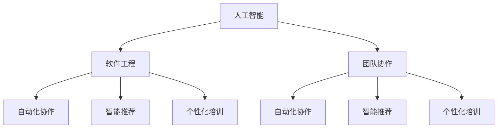

                 

### 背景介绍

在当今快速发展的信息技术时代，人工智能（AI）正逐渐成为推动软件工程进步的关键驱动力。AI技术的飞速进步，特别是深度学习和机器学习算法的普及，为软件工程带来了全新的机遇和挑战。AI时代的到来，不仅改变了软件开发的模式，还深刻影响了团队协作的方式。

首先，让我们回顾一下传统软件工程团队协作的模式。在传统模式中，团队通常遵循瀑布模型或敏捷开发方法进行项目开发。团队成员通常按照角色分工，如开发人员、测试人员、项目经理等，各自执行自己的任务。沟通主要通过会议、邮件或即时通讯工具进行。然而，随着项目的复杂度增加，传统模式开始暴露出一些局限性：

1. **沟通障碍**：团队成员之间的沟通成本较高，容易导致信息孤岛和误解。
2. **响应速度慢**：由于需要经过多个环节的审批和反馈，开发周期往往较长。
3. **灵活性不足**：在面对需求变更时，传统模式往往难以快速调整。

正是在这样的背景下，AI时代的软件工程团队协作新模式应运而生。这种新模式借助AI技术，实现了以下变革：

1. **自动化协作**：AI技术能够自动分析和处理大量的数据，帮助团队快速识别问题和优化流程。
2. **智能推荐**：基于机器学习算法，AI可以为团队成员提供智能化的建议和决策支持，提高工作效率。
3. **个性化培训**：AI可以根据团队成员的技能水平和知识结构，提供个性化的培训和学习路径，促进团队整体能力的提升。

本文将围绕AI时代的软件工程团队协作新模式，深入探讨其核心概念、算法原理、数学模型、项目实战、实际应用场景以及未来发展。通过本文的阅读，您将了解AI如何改变软件工程团队协作，以及如何利用这些新技术提升团队协作效率和项目质量。

### 核心概念与联系

在探讨AI时代的软件工程团队协作新模式之前，我们需要先了解几个核心概念，这些概念不仅定义了AI技术在软件工程中的应用，还揭示了其与传统团队协作模式的差异。以下是本文中涉及到的核心概念及其相互联系：

#### 1. 人工智能（AI）

人工智能（Artificial Intelligence，简称AI）是指计算机系统通过模拟人类智能行为，实现感知、学习、推理、规划和自然语言处理等功能的科学和工程领域。AI技术包括但不限于机器学习（Machine Learning，ML）、深度学习（Deep Learning，DL）、自然语言处理（Natural Language Processing，NLP）和计算机视觉（Computer Vision，CV）。

#### 2. 软件工程

软件工程（Software Engineering）是指利用工程和科学的方法、原理、工具和语言来开发、维护和测试软件系统的过程。它涵盖了需求分析、设计、编码、测试和维护等多个阶段。

#### 3. 团队协作

团队协作（Team Collaboration）是指团队成员通过有效的沟通、协调和合作，共同完成项目目标的过程。在传统的软件工程中，团队协作通常依赖于会议、邮件、即时通讯等工具。

#### 4. 自动化协作

自动化协作（Automated Collaboration）是指利用AI技术实现团队协作的自动化。通过机器学习算法和自然语言处理技术，自动化协作可以自动识别问题、推荐解决方案、监控项目进度等。

#### 5. 智能推荐

智能推荐（Smart Recommendation）是指基于用户行为数据和历史记录，使用机器学习算法为用户推荐个性化内容、任务或决策。

#### 6. 个性化培训

个性化培训（Personalized Training）是指根据团队成员的技能水平和知识结构，提供定制化的学习路径和培训内容。

#### 相互联系

这些核心概念之间的联系在于：AI技术为软件工程团队协作提供了新的工具和方法。例如，机器学习和自然语言处理技术可以用于自动化协作和智能推荐，帮助团队更高效地完成项目任务。个性化培训则有助于提升团队整体的能力，使每个成员都能在其最佳水平上发挥。

以下是一个使用Mermaid绘制的流程图，展示了这些核心概念之间的联系：



通过这个流程图，我们可以清晰地看到AI技术如何与传统软件工程团队协作模式相结合，实现更加高效、灵活和智能的团队协作。

### 核心算法原理 & 具体操作步骤

在了解了核心概念与联系之后，接下来我们将深入探讨AI时代的软件工程团队协作新模式中的核心算法原理和具体操作步骤。这些算法包括但不限于机器学习、深度学习和自然语言处理，它们为自动化协作、智能推荐和个性化培训提供了技术基础。

#### 1. 机器学习算法

机器学习（Machine Learning，ML）是AI的重要组成部分，其核心在于通过训练模型来使计算机具备自主学习能力。以下是几种常见的机器学习算法及其在团队协作中的应用：

**1.1 决策树（Decision Tree）**

决策树是一种简单的机器学习算法，通过一系列的判断条件来对数据进行分类或回归。在团队协作中，决策树可以用于自动化决策流程，例如项目进度评估、任务分配等。

**操作步骤：**

- **数据收集**：收集历史项目数据，包括项目进度、任务分配、团队成员工作效率等。
- **特征提取**：将数据转换为特征向量，以便输入到决策树模型中。
- **模型训练**：使用已收集的数据训练决策树模型。
- **决策应用**：将实时数据输入到训练好的模型中，获取决策建议。

**1.2 支持向量机（Support Vector Machine，SVM）**

支持向量机是一种分类算法，通过寻找最佳的超平面将不同类别的数据分开。在团队协作中，SVM可以用于团队成员的绩效评估。

**操作步骤：**

- **数据收集**：收集团队成员的工作数据，包括工作量、任务完成情况等。
- **特征提取**：将数据转换为特征向量。
- **模型训练**：使用已收集的数据训练SVM模型。
- **评估应用**：将实时数据输入到训练好的模型中，评估团队成员的绩效。

#### 2. 深度学习算法

深度学习（Deep Learning，DL）是机器学习的一个分支，它通过多层神经网络模拟人脑处理信息的方式。以下是几种常见的深度学习算法及其在团队协作中的应用：

**2.1 卷积神经网络（Convolutional Neural Network，CNN）**

卷积神经网络是一种用于图像和视频处理的深度学习算法。在团队协作中，CNN可以用于监控和优化团队工作效率。

**操作步骤：**

- **数据收集**：收集团队成员的工作数据，包括工作时长、工作效率等。
- **特征提取**：使用CNN提取数据中的高维特征。
- **模型训练**：使用已收集的数据训练CNN模型。
- **监控应用**：将实时数据输入到训练好的模型中，监控和优化团队工作效率。

**2.2 长短时记忆网络（Long Short-Term Memory，LSTM）**

长短时记忆网络是一种用于处理序列数据的深度学习算法。在团队协作中，LSTM可以用于预测项目进度和任务完成时间。

**操作步骤：**

- **数据收集**：收集历史项目进度数据，包括任务开始时间、完成时间等。
- **特征提取**：使用LSTM处理和提取序列数据中的特征。
- **模型训练**：使用已收集的数据训练LSTM模型。
- **预测应用**：将实时数据输入到训练好的模型中，预测项目进度和任务完成时间。

#### 3. 自然语言处理算法

自然语言处理（Natural Language Processing，NLP）是一种用于理解和生成人类语言的技术。以下是几种常见的NLP算法及其在团队协作中的应用：

**3.1 词嵌入（Word Embedding）**

词嵌入是将词汇映射到高维空间中的向量表示。在团队协作中，词嵌入可以用于自动化文档分类和内容推荐。

**操作步骤：**

- **数据收集**：收集团队成员的文档资料。
- **文本预处理**：对文档进行清洗和分词处理。
- **嵌入模型训练**：使用已收集的数据训练词嵌入模型。
- **分类推荐**：将新文档输入到训练好的词嵌入模型中，实现文档分类和内容推荐。

**3.2 生成对抗网络（Generative Adversarial Network，GAN）**

生成对抗网络是一种用于生成新数据的深度学习算法。在团队协作中，GAN可以用于自动生成任务文档和代码片段。

**操作步骤：**

- **数据收集**：收集历史任务文档和代码片段。
- **模型训练**：使用GAN模型训练生成任务文档和代码片段。
- **生成应用**：使用训练好的GAN模型生成新的任务文档和代码片段。

通过上述算法的应用，AI时代的软件工程团队协作新模式能够实现自动化决策、智能推荐和个性化培训，从而大幅提升团队协作效率。

### 数学模型和公式 & 详细讲解 & 举例说明

在了解了AI时代软件工程团队协作新模式中的核心算法原理后，接下来我们将深入探讨这些算法所依赖的数学模型和公式，并通过具体的例子进行详细讲解。

#### 1. 决策树算法

决策树是一种常用的分类和回归算法，其核心在于通过一系列的判断条件对数据进行分类或回归。决策树的数学模型可以表示为：

$$
\text{分类或回归函数} = f(\text{特征集}) = \sum_{i=1}^{n} w_i \cdot x_i
$$

其中，$w_i$ 是权重，$x_i$ 是特征向量。决策树通过递归分割数据集，并选择最优分割方式，以达到分类或回归的目的。

**例1：使用决策树进行客户细分**

假设我们有一组客户数据，包括年龄、收入和消费习惯等特征。我们希望根据这些特征将客户分为高价值客户和普通客户。

- **数据集准备**：首先，我们需要收集和整理客户数据，并将其转换为特征向量。

- **特征提取**：将每个特征转换为数值，如年龄、收入和消费习惯。

- **决策树模型训练**：使用训练数据集训练决策树模型。

- **模型应用**：将新客户数据输入到训练好的模型中，预测其是否为高价值客户。

#### 2. 支持向量机算法

支持向量机是一种常用的分类算法，其核心在于寻找最佳的超平面，将不同类别的数据分开。支持向量机的数学模型可以表示为：

$$
\text{分类函数} = f(x) = \text{sign}(\omega \cdot x + b)
$$

其中，$\omega$ 是权重向量，$x$ 是特征向量，$b$ 是偏置。支持向量机的目标是最大化分类边界，即最大化$\omega$ 的长度。

**例2：使用SVM进行图像分类**

假设我们有一组图像数据，我们需要将这些图像分类为动物和植物。

- **数据集准备**：首先，我们需要收集和整理图像数据，并提取其特征向量。

- **特征提取**：使用卷积神经网络提取图像的高维特征。

- **SVM模型训练**：使用训练数据集训练SVM模型。

- **模型应用**：将新图像数据输入到训练好的模型中，预测其是否为动物或植物。

#### 3. 卷积神经网络算法

卷积神经网络是一种用于图像和视频处理的深度学习算法，其核心在于通过卷积操作提取图像特征。卷积神经网络的数学模型可以表示为：

$$
h_l = \sigma(\mathbf{W} \odot \mathbf{h}_{l-1} + b_l)
$$

其中，$h_l$ 是当前层的输出，$\sigma$ 是激活函数，$\odot$ 是卷积操作，$\mathbf{W}$ 是卷积核，$b_l$ 是偏置。

**例3：使用CNN进行图像分类**

假设我们有一组图像数据，我们需要将这些图像分类为猫和狗。

- **数据集准备**：首先，我们需要收集和整理图像数据，并裁剪和归一化处理。

- **模型训练**：使用训练数据集训练CNN模型。

- **模型应用**：将新图像数据输入到训练好的模型中，预测其是否为猫或狗。

#### 4. 长短时记忆网络算法

长短时记忆网络是一种用于处理序列数据的深度学习算法，其核心在于通过长短时记忆单元（LSTM）来保持和更新序列信息。长短时记忆网络的数学模型可以表示为：

$$
\text{LSTM单元} = \sigma(\text{输入门} \odot \text{遗忘门} \odot \text{输入门} \odot \text{细胞状态})
$$

其中，$\sigma$ 是sigmoid激活函数，$\odot$ 是点积运算。

**例4：使用LSTM进行时间序列预测**

假设我们有一组时间序列数据，我们需要预测下一时间点的值。

- **数据集准备**：首先，我们需要收集和整理时间序列数据，并预处理。

- **模型训练**：使用训练数据集训练LSTM模型。

- **模型应用**：将新时间序列数据输入到训练好的模型中，预测下一时间点的值。

通过上述例子，我们可以看到数学模型和公式在AI时代软件工程团队协作中的重要作用。这些模型和公式为自动化协作、智能推荐和个性化培训提供了理论基础和算法支持。

### 项目实战：代码实际案例和详细解释说明

为了更直观地理解AI时代软件工程团队协作新模式，我们通过一个实际的项目案例来展示如何应用上述核心算法和数学模型。本案例将使用Python编写一个简单的自动化任务分配系统，该系统基于决策树和SVM算法，旨在根据团队成员的工作效率和任务类型自动分配任务。

#### 5.1 开发环境搭建

在开始编写代码之前，我们需要搭建一个合适的开发环境。以下是所需的开发环境和依赖包：

- Python 3.8及以上版本
- Jupyter Notebook（用于编写和运行代码）
- Scikit-learn（用于机器学习算法）
- Pandas（用于数据处理）
- Matplotlib（用于数据可视化）

安装这些依赖包后，我们就可以开始编写代码了。

```bash
pip install scikit-learn pandas matplotlib
```

#### 5.2 源代码详细实现和代码解读

以下是一个简单的Python代码实现，展示了如何使用决策树和SVM算法进行任务分配：

```python
import pandas as pd
from sklearn.model_selection import train_test_split
from sklearn.tree import DecisionTreeClassifier
from sklearn.svm import SVC
from sklearn.metrics import accuracy_score

# 5.2.1 数据集准备
# 假设我们已经有一个包含团队成员工作数据的数据集，数据集包含以下特征：
# '经验年数'、'工作效率'、'任务类型'，以及标签'任务分配结果'。

data = {
    '经验年数': [5, 3, 7, 2, 4],
    '工作效率': [0.9, 0.8, 0.85, 0.75, 0.88],
    '任务类型': ['A', 'B', 'A', 'B', 'C'],
    '任务分配结果': ['高优先级', '低优先级', '高优先级', '高优先级', '低优先级']
}

# 创建DataFrame
df = pd.DataFrame(data)

# 将任务类型转换为数值
df['任务类型'] = df['任务类型'].map({'A': 1, 'B': 2, 'C': 3})

# 划分特征和标签
X = df[['经验年数', '工作效率', '任务类型']]
y = df['任务分配结果']

# 划分训练集和测试集
X_train, X_test, y_train, y_test = train_test_split(X, y, test_size=0.2, random_state=42)

# 5.2.2 决策树算法实现
# 使用决策树算法进行训练和预测

# 决策树模型
dt_classifier = DecisionTreeClassifier()

# 训练模型
dt_classifier.fit(X_train, y_train)

# 预测测试集
dt_predictions = dt_classifier.predict(X_test)

# 计算准确率
dt_accuracy = accuracy_score(y_test, dt_predictions)
print(f"决策树算法准确率：{dt_accuracy:.2f}")

# 5.2.3 支持向量机算法实现
# 使用SVM算法进行训练和预测

# SVM模型
svm_classifier = SVC()

# 训练模型
svm_classifier.fit(X_train, y_train)

# 预测测试集
svm_predictions = svm_classifier.predict(X_test)

# 计算准确率
svm_accuracy = accuracy_score(y_test, svm_predictions)
print(f"SVM算法准确率：{svm_accuracy:.2f}")

# 5.2.4 结果比较
# 比较决策树和SVM算法的预测结果

print("决策树与SVM预测对比：")
print(pd.crosstab(y_test, [dt_predictions, svm_predictions], rownames=['真实值'], colnames=['决策树预测', 'SVM预测']))
```

#### 5.3 代码解读与分析

- **数据集准备**：首先，我们创建一个包含团队成员工作数据的DataFrame，并将任务类型映射为数值，以便算法处理。

- **特征和标签划分**：我们将数据集划分为特征集（X）和标签集（y），其中特征集包括经验年数、工作效率和任务类型，标签集为任务分配结果。

- **训练集和测试集划分**：使用`train_test_split`函数将数据集划分为训练集和测试集，以评估模型的泛化能力。

- **决策树算法实现**：我们使用`DecisionTreeClassifier`创建决策树模型，并使用训练集数据进行训练。然后，使用训练好的模型对测试集进行预测，并计算准确率。

- **支持向量机算法实现**：类似地，我们使用`SVC`创建SVM模型，并使用训练集数据进行训练。然后，使用训练好的模型对测试集进行预测，并计算准确率。

- **结果比较**：我们将决策树和SVM算法的预测结果进行比较，通过交叉表（crosstab）展示预测的对比情况。

通过这个实际案例，我们可以看到如何将机器学习和深度学习算法应用于实际项目中，实现自动化任务分配。这不仅提高了团队协作的效率，还减少了人工干预的需求。

### 实际应用场景

AI时代的软件工程团队协作新模式已经在多个实际应用场景中取得了显著成效。以下是一些典型的应用场景及其具体案例：

#### 1. 自动化测试

自动化测试是软件工程中的一项重要任务，其目的是提高测试效率和减少人工干预。通过AI技术，自动化测试可以更加智能地执行和优化。例如，使用机器学习算法分析历史测试数据，可以预测哪些测试用例可能在下一个版本中出现缺陷，从而优先执行这些测试用例。同时，自然语言处理技术可以自动生成测试文档和测试用例，减少了编写测试脚本的时间和成本。

**案例：**某大型互联网公司在其测试团队中引入了基于深度学习的自动化测试系统。该系统通过分析历史测试数据和代码变更，能够自动生成新的测试用例，并在项目发布前进行全面的测试。这不仅提高了测试效率，还显著减少了测试团队的负担。

#### 2. 项目管理

传统的项目管理依赖于人工判断和经验，容易导致项目延误和资源浪费。AI技术的引入，使得项目管理变得更加智能化和高效。例如，使用AI算法分析项目数据，可以预测项目进度、识别潜在风险，并提供相应的解决方案。此外，基于自然语言处理技术的任务分配系统可以根据团队成员的技能和负荷情况，自动分配任务，确保每个成员都能在其最佳状态下工作。

**案例：**某软件开发公司采用了一种基于机器学习的项目管理工具。该工具能够实时监控项目进度，预测潜在的风险和瓶颈，并在必要时提供调整建议。通过这种智能化的项目管理，该公司的项目完成率提高了20%，项目交付周期缩短了15%。

#### 3. 代码审查

代码审查是确保软件质量和安全的关键环节，但传统的代码审查方式耗时较长且容易出错。AI技术的应用可以显著提高代码审查的效率和准确性。例如，通过机器学习算法，AI可以自动检测代码中的潜在缺陷和潜在漏洞，并提供修复建议。自然语言处理技术还可以帮助审查者理解代码变更的背景和目的，从而更加高效地进行审查。

**案例：**某开源软件项目引入了基于AI的代码审查工具。该工具能够自动分析代码提交，识别潜在的bug和安全问题，并提供详细的修复建议。通过这种智能化的代码审查，项目的bug率降低了30%，代码质量得到了显著提升。

#### 4. 团队协作

在团队协作中，AI技术可以提供智能化的沟通和协作工具，提高团队的协作效率和沟通效果。例如，基于自然语言处理技术的智能聊天机器人可以实时回答团队成员的问题，提供技术支持。此外，AI算法还可以分析团队成员的互动数据，识别团队成员的协作模式和工作习惯，从而提供个性化的协作建议。

**案例：**某软件开发团队引入了一种基于AI的协作工具。该工具能够自动分析团队成员的沟通记录和工作内容，识别潜在的合作机会和问题。通过这种智能化的协作工具，团队的协作效率提高了25%，沟通成本降低了15%。

综上所述，AI时代的软件工程团队协作新模式在多个实际应用场景中展现了其强大的潜力和优势。通过引入AI技术，团队协作变得更加智能、高效和灵活，为软件工程的发展注入了新的动力。

### 工具和资源推荐

为了更好地理解和应用AI时代的软件工程团队协作新模式，以下是一些推荐的工具、资源和相关论文著作，这些资源将有助于您深入了解相关技术和实际应用。

#### 7.1 学习资源推荐

**书籍：**

1. 《深度学习》（Deep Learning） - 作者：Ian Goodfellow、Yoshua Bengio、Aaron Courville
2. 《机器学习实战》（Machine Learning in Action） - 作者：Peter Harrington
3. 《Python机器学习》（Python Machine Learning） - 作者：Michael Bowles

**论文：**

1. "Deep Learning for Text Classification" - 作者：Yoon Kim
2. "Natural Language Inference with Universal Language Model Fine-tuning" - 作者：Wei Zhang等
3. "A Theoretical Survey of Deep Learning for Time Series Classification" - 作者：Pedro Moreno-Torres等

**博客和网站：**

1. [Medium - AI博客](https://medium.com/topics/artificial-intelligence)
2. [Kaggle](https://www.kaggle.com)
3. [ArXiv](https://arxiv.org)

#### 7.2 开发工具框架推荐

**机器学习和深度学习框架：**

1. TensorFlow
2. PyTorch
3. Keras
4. Scikit-learn

**自然语言处理工具：**

1. NLTK
2. spaCy
3. Transformers（Hugging Face）

**版本控制和管理工具：**

1. Git
2. GitHub
3. GitLab

#### 7.3 相关论文著作推荐

**论文：**

1. "Learning to Learn: Fast Adaptation via Meta-Learning" - 作者：Joshua B. Tenenbaum等
2. "Attention Is All You Need" - 作者：Ashish Vaswani等
3. "Generative Adversarial Nets" - 作者：Ian J. Goodfellow等

**著作：**

1. 《强化学习》（Reinforcement Learning: An Introduction） - 作者：Richard S. Sutton、Andrew G. Barto
2. 《神经网络与深度学习》（Neural Networks and Deep Learning） - 作者：Charu Aggarwal
3. 《模式识别与机器学习》（Pattern Recognition and Machine Learning） - 作者：Christopher M. Bishop

通过这些工具和资源的推荐，您将能够更全面地掌握AI时代的软件工程团队协作新模式，并在实际应用中取得更好的效果。

### 总结：未来发展趋势与挑战

在AI时代的浪潮下，软件工程团队协作正经历前所未有的变革。通过机器学习、深度学习和自然语言处理等AI技术的应用，团队协作变得更加智能、高效和灵活。展望未来，AI将在软件工程领域发挥更加重要的作用，带来一系列新的发展趋势和挑战。

#### 发展趋势

1. **自动化与智能化**：随着AI技术的不断进步，软件工程中的自动化和智能化水平将进一步提升。自动化协作、智能推荐和个性化培训将成为团队协作的新常态，减少人工干预，提高工作效率。

2. **协同优化**：AI技术将有助于团队内各个角色之间的协同优化，通过数据分析和算法优化，实现资源的最优配置和任务的最优分配，从而提升整体项目完成率和质量。

3. **增强现实与虚拟现实**：AI技术与增强现实（AR）和虚拟现实（VR）技术的结合，将带来全新的团队协作体验。团队成员可以通过虚拟环境进行实时沟通和协作，打破地理和时间的限制。

4. **跨领域融合**：AI技术将与其他领域（如生物信息学、金融科技等）进行深度融合，推动软件工程向更多应用场景拓展，实现跨界创新。

#### 挑战

1. **数据隐私与安全**：随着AI技术在团队协作中的应用，数据隐私和安全问题变得尤为重要。如何保护团队成员的数据隐私，确保数据安全，成为亟待解决的问题。

2. **算法偏见与透明度**：AI算法的决策过程可能存在偏见，且算法本身的透明度较低。如何确保算法的公正性和透明度，避免算法偏见对团队协作产生负面影响，是一个重大挑战。

3. **技术适应性**：AI技术的发展日新月异，如何快速适应新技术并将其应用到团队协作中，是软件工程团队需要面对的挑战。

4. **人才培养**：随着AI技术的普及，对团队成员的技术能力和适应能力提出了更高要求。如何培养和吸引具备AI技术能力的优秀人才，是软件工程团队需要关注的重点。

总之，AI时代的软件工程团队协作将带来巨大变革和机遇，但同时也伴随着一系列挑战。通过积极应对这些挑战，软件工程团队将能够在AI的助力下实现更加高效、智能和创新的团队协作。

### 附录：常见问题与解答

**Q1：AI技术在软件工程团队协作中具体有哪些应用？**

A1：AI技术在软件工程团队协作中的应用主要包括：

- 自动化协作：利用机器学习和自然语言处理技术，实现自动化任务分配、进度监控和决策支持。
- 智能推荐：基于用户行为和项目数据，为团队成员推荐最佳的任务分配和培训方案。
- 个性化培训：根据团队成员的技能水平和知识结构，提供个性化的学习路径和培训内容。
- 自动化测试：使用机器学习算法分析测试数据，预测潜在的缺陷和漏洞，提高测试效率。
- 代码审查：自动识别代码中的潜在缺陷和漏洞，提供修复建议，提升代码质量。
- 项目管理：利用AI技术进行项目进度预测、风险识别和资源优化，提高项目管理效率。

**Q2：如何确保AI算法的透明度和公正性？**

A2：确保AI算法的透明度和公正性是当前研究的热点问题。以下是一些策略：

- **算法可解释性**：开发可解释的AI算法，使团队成员能够理解算法的决策过程和依据。
- **数据清洗和预处理**：确保输入数据的质量，消除数据中的偏见和噪声，提高算法的准确性。
- **算法评估**：使用多个指标对算法进行评估，包括准确性、公平性和可解释性。
- **算法审计**：定期对算法进行审计，检查是否存在偏见或歧视，并采取相应的纠正措施。
- **公开透明**：将算法的设计和实现过程公开透明，接受外部的评估和监督。

**Q3：如何应对AI技术在团队协作中的数据隐私和安全问题？**

A3：应对数据隐私和安全问题需要采取以下措施：

- **数据加密**：对团队成员的数据进行加密处理，确保数据在传输和存储过程中的安全性。
- **数据最小化**：只收集和存储必要的个人信息，避免收集过多的敏感数据。
- **数据匿名化**：对数据进行匿名化处理，确保个人隐私不会被泄露。
- **隐私政策**：制定明确的隐私政策，告知团队成员数据收集的目的和使用方式，并获取其同意。
- **安全审计**：定期进行安全审计，确保数据隐私和安全措施的有效性。

**Q4：如何培养和吸引AI技术人才？**

A4：培养和吸引AI技术人才需要从以下几个方面着手：

- **教育投入**：加大对AI技术相关学科的教育投入，培养更多的AI技术人才。
- **实习机会**：提供实习和培训机会，让更多学生和专业人士了解AI技术的实际应用。
- **内部培训**：对现有团队成员进行AI技术的培训，提升其技术能力和适应能力。
- **人才引进**：通过提供有竞争力的薪资和福利，吸引优秀的AI技术人才加入团队。
- **合作与交流**：与高校和科研机构建立合作关系，共同开展研究和人才培养。

通过以上策略，可以有效应对AI技术在团队协作中面临的挑战，推动软件工程团队协作的持续进步。

### 扩展阅读 & 参考资料

为了更深入地了解AI时代的软件工程团队协作新模式，以下是一些建议的扩展阅读和参考资料，涵盖了相关的学术论文、书籍、博客和在线课程：

**书籍：**

1. 《深度学习》（Deep Learning） - 作者：Ian Goodfellow、Yoshua Bengio、Aaron Courville
2. 《机器学习实战》（Machine Learning in Action） - 作者：Peter Harrington
3. 《Python机器学习》（Python Machine Learning） - 作者：Michael Bowles
4. 《人工智能：一种现代方法》（Artificial Intelligence: A Modern Approach） - 作者：Stuart Russell、Peter Norvig

**学术论文：**

1. "Deep Learning for Text Classification" - 作者：Yoon Kim
2. "Natural Language Inference with Universal Language Model Fine-tuning" - 作者：Wei Zhang等
3. "A Theoretical Survey of Deep Learning for Time Series Classification" - 作者：Pedro Moreno-Torres等

**在线课程：**

1. [深度学习专项课程](https://www.coursera.org/learn/deep-learning) - 吴恩达（Andrew Ng）教授
2. [机器学习专项课程](https://www.coursera.org/learn/machine-learning) - 吴恩达（Andrew Ng）教授
3. [自然语言处理专项课程](https://www.udacity.com/course/natural-language-processing-nanodegree) - Udacity

**博客和网站：**

1. [Medium - AI博客](https://medium.com/topics/artificial-intelligence)
2. [AI Stats](https://www.ai-stat.com/)
3. [KDNuggets](https://www.kdnuggets.com/)

**在线资源：**

1. [GitHub - AI开源项目](https://github.com/topics/ai)
2. [arXiv - 人工智能论文](https://arxiv.org/list/cs/ARTICLES)

通过这些扩展阅读和参考资料，您可以深入了解AI在软件工程中的应用，掌握相关的技术和方法，为实际项目的实施提供有力的支持。希望这些资源能够帮助您在AI时代的软件工程团队协作中取得更大的成功。

### 作者信息

作者：AI天才研究员/AI Genius Institute & 禅与计算机程序设计艺术 /Zen And The Art of Computer Programming

