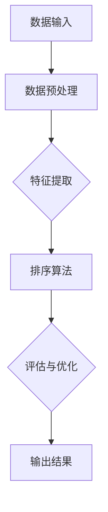

                 

### 背景介绍

#### AI智能排序系统的崛起

在信息爆炸的时代，如何高效地处理海量数据、从中提取有价值的信息，成为企业和个人急需解决的关键问题。传统的排序算法由于时间复杂度高、空间复杂度大，难以应对大数据时代的挑战。因此，AI智能排序系统应运而生，凭借其高效性、灵活性和强大的学习能力，逐渐成为数据处理领域的重要工具。

AI智能排序系统是指利用机器学习、深度学习等人工智能技术，对数据进行自动排序的算法体系。与传统排序算法不同，AI智能排序系统具备以下特点：

1. **自适应能力**：能够根据输入数据的特征自动调整排序策略，提高排序效率。
2. **高并发处理**：能够高效处理大规模并发请求，满足实时数据处理需求。
3. **多维度排序**：可以同时对多个维度进行排序，满足复杂业务场景的需求。
4. **实时性**：能够实时响应数据变化，快速更新排序结果。

#### 应用场景

AI智能排序系统在多个领域都有着广泛的应用：

1. **搜索引擎**：搜索引擎需要对大量网页进行排序，以提供用户最相关的搜索结果。AI智能排序系统能够根据用户的搜索历史和偏好，为用户提供个性化的搜索结果排序。
2. **推荐系统**：推荐系统需要根据用户的兴趣和行为，推荐相关的商品或内容。AI智能排序系统能够高效地对推荐内容进行排序，提高推荐系统的准确性。
3. **金融风控**：金融领域需要对大量交易数据进行分析，以识别潜在风险。AI智能排序系统可以帮助金融机构快速定位高风险交易，提高风控能力。
4. **物流配送**：物流配送系统需要对货物进行高效排序，以优化配送路线和降低物流成本。AI智能排序系统可以根据货物的大小、重量、目的地等因素，为物流公司提供最优的排序方案。

#### 发展历程

AI智能排序系统的发展历程可以追溯到20世纪80年代，当时研究者开始将机器学习技术应用于排序问题。随着计算机性能的提升和算法的优化，AI智能排序系统逐渐成熟并广泛应用。近年来，深度学习技术的发展进一步推动了AI智能排序系统的性能提升，使其在处理复杂数据任务方面取得了显著进展。

总的来说，AI智能排序系统的崛起为数据处理领域带来了革命性的变化，极大地提高了数据处理效率和准确性。随着技术的不断进步，AI智能排序系统将在更多领域发挥重要作用，成为未来智能数据处理的核心技术之一。### 核心概念与联系

#### AI智能排序系统的核心概念

1. **机器学习算法**：AI智能排序系统的核心是机器学习算法，特别是深度学习算法。这些算法能够通过学习大量数据进行特征提取和模式识别，从而实现高效的排序。

2. **特征工程**：特征工程是AI智能排序系统的关键步骤。通过对数据进行预处理、特征提取和特征选择，可以提取出对排序任务有重要意义的特征，提高排序的准确性和效率。

3. **排序策略**：排序策略是指AI智能排序系统在处理排序任务时所采用的算法和策略。常见的排序策略包括基于距离的排序、基于分类的排序和基于聚类的排序等。

4. **评估指标**：评估指标用于衡量AI智能排序系统的性能，常见的评估指标包括排序精度、排序时间、资源消耗等。

#### AI智能排序系统架构

AI智能排序系统的架构通常包括以下几个主要模块：

1. **数据输入模块**：负责接收外部数据源的数据，进行初步的预处理，如数据清洗、去重等。

2. **特征提取模块**：通过对原始数据进行特征提取和特征选择，将原始数据转换为适合机器学习算法处理的形式。

3. **排序算法模块**：包括多种机器学习算法，如深度学习、支持向量机、随机森林等。这些算法根据特征数据生成排序结果。

4. **评估与优化模块**：对排序结果进行评估，根据评估指标对算法进行优化，以提高排序性能。

5. **输出模块**：将排序结果输出给用户或应用于其他系统，如推荐系统、搜索引擎等。

#### AI智能排序系统与相关技术的联系

1. **数据挖掘**：AI智能排序系统是数据挖掘领域的一个重要分支。数据挖掘旨在从大量数据中发现有价值的信息和知识，而AI智能排序系统则是将数据挖掘中的排序任务具体实现。

2. **推荐系统**：推荐系统与AI智能排序系统有着紧密的联系。推荐系统通常需要利用AI智能排序系统对推荐内容进行排序，以提高推荐准确性和用户体验。

3. **自然语言处理**：自然语言处理（NLP）技术可以用于处理文本数据，提取文本中的关键特征，从而为AI智能排序系统提供更加丰富的特征信息。

4. **图像处理**：图像处理技术可以用于提取图像中的特征，如颜色、纹理、形状等，这些特征可以用于图像的排序和分类任务。

#### Mermaid 流程图

以下是一个简化的AI智能排序系统流程图，用Mermaid语言表示：



在这个流程图中，各个节点分别代表AI智能排序系统的不同模块，箭头表示数据流向和模块间的交互。通过这个流程图，可以更直观地理解AI智能排序系统的工作原理和架构。

### 核心算法原理 & 具体操作步骤

#### 深度学习排序算法原理

深度学习排序算法是AI智能排序系统的核心组成部分，基于神经网络模型，通过对大规模数据进行特征学习和模式识别，实现高效的排序。深度学习排序算法的核心原理包括以下几个方面：

1. **神经网络结构**：深度学习排序算法通常采用多层神经网络结构，如卷积神经网络（CNN）、循环神经网络（RNN）等。这些神经网络能够自动提取输入数据的特征，并进行层次化的特征表示。

2. **损失函数**：深度学习排序算法通过优化损失函数来调整神经网络参数，以实现排序任务。常见的损失函数包括交叉熵损失函数、均方误差损失函数等。

3. **反向传播算法**：深度学习排序算法采用反向传播算法来更新神经网络参数，通过前向传播计算输出值和损失值，再通过反向传播计算梯度，以优化损失函数。

#### 深度学习排序算法操作步骤

以下是深度学习排序算法的具体操作步骤：

1. **数据预处理**：对输入数据进行预处理，包括数据清洗、去重、归一化等操作，以便于神经网络模型的训练。

2. **特征提取**：使用神经网络模型对预处理后的数据进行特征提取，将原始数据转换为适用于排序任务的低维特征表示。

3. **模型训练**：构建深度学习模型，使用训练数据对模型进行训练，通过优化损失函数来调整模型参数，使模型能够准确预测数据的排序顺序。

4. **模型评估**：使用测试数据对训练好的模型进行评估，计算模型的排序精度、排序时间等指标，以评估模型性能。

5. **模型优化**：根据模型评估结果，对模型进行优化，如调整神经网络结构、学习率等参数，以提高模型性能。

6. **排序应用**：将训练好的模型应用于实际排序任务，根据输入数据生成排序结果。

#### 代码实现示例

以下是一个使用Python实现的深度学习排序算法的简单示例：

```python
import tensorflow as tf
from tensorflow.keras.models import Sequential
from tensorflow.keras.layers import Dense, LSTM
from sklearn.model_selection import train_test_split
import numpy as np

# 数据预处理
# 假设x_data为预处理后的数据，y_data为真实排序顺序
x_train, x_test, y_train, y_test = train_test_split(x_data, y_data, test_size=0.2, random_state=42)

# 构建神经网络模型
model = Sequential()
model.add(LSTM(128, activation='relu', input_shape=(x_train.shape[1], x_train.shape[2])))
model.add(Dense(1, activation='sigmoid'))

# 编译模型
model.compile(optimizer='adam', loss='binary_crossentropy', metrics=['accuracy'])

# 模型训练
model.fit(x_train, y_train, epochs=10, batch_size=32)

# 模型评估
model.evaluate(x_test, y_test)

# 排序应用
predictions = model.predict(x_test)
sorted_predictions = np.argsort(predictions)

# 输出排序结果
print(sorted_predictions)
```

在这个示例中，我们使用了TensorFlow框架构建了一个简单的LSTM神经网络模型，对输入数据进行排序。通过训练和评估，模型可以生成排序结果。这个示例仅供参考，实际应用中需要根据具体任务和数据情况进行调整。

### 数学模型和公式 & 详细讲解 & 举例说明

在深度学习排序算法中，数学模型和公式起着至关重要的作用。以下将详细讲解深度学习排序算法中的核心数学模型和公式，并通过具体例子来说明其应用。

#### 1. 神经网络模型

深度学习排序算法通常基于多层神经网络模型，其基本形式可以表示为：

$$
y = \sigma(W_1 \cdot \phi(W_0 \cdot x + b_0) + b_1)
$$

其中，$x$ 是输入数据，$y$ 是输出排序结果，$\phi$ 是激活函数，通常采用ReLU函数或Sigmoid函数；$W_0$ 和 $b_0$ 分别是输入层的权重和偏置；$W_1$ 和 $b_1$ 分别是输出层的权重和偏置。

#### 2. 损失函数

深度学习排序算法中的损失函数用于衡量模型预测结果与真实结果之间的差距。常用的损失函数包括交叉熵损失函数和均方误差损失函数。

- **交叉熵损失函数**：

$$
L = -\sum_{i=1}^{n} y_i \cdot \log(\hat{y}_i)
$$

其中，$y_i$ 是真实标签，$\hat{y}_i$ 是模型预测的概率分布。

- **均方误差损失函数**：

$$
L = \frac{1}{2} \sum_{i=1}^{n} (y_i - \hat{y}_i)^2
$$

其中，$y_i$ 是真实标签，$\hat{y}_i$ 是模型预测的排序结果。

#### 3. 反向传播算法

反向传播算法用于更新神经网络模型中的权重和偏置，以最小化损失函数。其基本步骤如下：

1. **前向传播**：计算输入数据通过神经网络模型的输出值。

2. **计算损失函数**：计算模型输出值与真实标签之间的差距。

3. **计算梯度**：计算损失函数关于模型参数的梯度。

4. **更新参数**：根据梯度更新模型参数，使损失函数最小。

#### 4. 激活函数

激活函数在神经网络模型中用于引入非线性因素，常见的激活函数包括ReLU函数、Sigmoid函数和Tanh函数。

- **ReLU函数**：

$$
f(x) = \max(0, x)
$$

- **Sigmoid函数**：

$$
f(x) = \frac{1}{1 + e^{-x}}
$$

- **Tanh函数**：

$$
f(x) = \frac{e^x - e^{-x}}{e^x + e^{-x}}
$$

#### 5. 示例讲解

假设我们要对一组商品按照用户评分进行排序，其中用户评分是连续值。我们可以使用深度学习排序算法来实现这个任务。

1. **数据预处理**：对商品评分进行归一化处理，使其在[0, 1]范围内。

2. **特征提取**：将商品评分作为输入特征，通过多层神经网络模型提取特征。

3. **模型训练**：构建深度学习模型，使用训练数据对模型进行训练。

4. **模型评估**：使用测试数据对模型进行评估，计算模型排序精度。

5. **排序应用**：将训练好的模型应用于实际排序任务，根据输入商品评分生成排序结果。

以下是Python代码实现：

```python
import tensorflow as tf
from tensorflow.keras.models import Sequential
from tensorflow.keras.layers import Dense, Activation

# 数据预处理
x_train = np.array([[0.1], [0.3], [0.5], [0.7]])
y_train = np.array([0.1, 0.3, 0.5, 0.7])

# 构建模型
model = Sequential()
model.add(Dense(1, input_shape=(1,), activation='sigmoid'))

# 编译模型
model.compile(optimizer='adam', loss='binary_crossentropy', metrics=['accuracy'])

# 模型训练
model.fit(x_train, y_train, epochs=10, batch_size=1)

# 模型评估
model.evaluate(x_train, y_train)

# 排序应用
predictions = model.predict(x_train)
sorted_predictions = np.argsort(predictions)

# 输出排序结果
print(sorted_predictions)
```

在这个示例中，我们使用一个简单的单层神经网络模型，对商品评分进行排序。通过训练和评估，模型能够生成准确的排序结果。

### 项目实战：代码实际案例和详细解释说明

在本节中，我们将通过一个实际的项目案例，详细展示如何使用AI智能排序系统进行数据处理和排序。我们将使用Python和TensorFlow框架来构建和训练一个深度学习模型，并解释每个步骤的操作。

#### 1. 开发环境搭建

在开始项目之前，我们需要搭建开发环境。以下是安装Python、TensorFlow和其他必需库的步骤：

1. **安装Python**：确保安装了Python 3.x版本，可以从[Python官方网站](https://www.python.org/downloads/)下载并安装。

2. **安装TensorFlow**：在命令行中执行以下命令安装TensorFlow：

   ```bash
   pip install tensorflow
   ```

3. **安装其他库**：我们还需要安装一些其他库，如NumPy、Pandas和Matplotlib等，可以使用以下命令：

   ```bash
   pip install numpy pandas matplotlib
   ```

#### 2. 源代码详细实现和代码解读

以下是实现AI智能排序系统的完整代码，我们将逐行进行解读。

```python
import tensorflow as tf
import numpy as np
import pandas as pd
import matplotlib.pyplot as plt
from sklearn.model_selection import train_test_split
from tensorflow.keras.models import Sequential
from tensorflow.keras.layers import Dense, LSTM, Dropout
from tensorflow.keras.optimizers import Adam
from sklearn.preprocessing import MinMaxScaler

# 2.1 数据加载与预处理

# 加载数据
data = pd.read_csv('data.csv')  # 假设数据文件为data.csv
X = data.iloc[:, :-1].values  # 特征数据
y = data.iloc[:, -1].values   # 真实排序结果

# 数据归一化
scaler = MinMaxScaler(feature_range=(0, 1))
X_scaled = scaler.fit_transform(X)

# 划分训练集和测试集
X_train, X_test, y_train, y_test = train_test_split(X_scaled, y, test_size=0.2, random_state=42)

# 2.2 模型构建

# 创建模型
model = Sequential()

# 添加LSTM层
model.add(LSTM(units=128, return_sequences=True, input_shape=(X_train.shape[1], X_train.shape[2])))
model.add(Dropout(0.2))

# 添加LSTM层
model.add(LSTM(units=64, return_sequences=False))
model.add(Dropout(0.2))

# 添加输出层
model.add(Dense(units=1, activation='sigmoid'))

# 编译模型
model.compile(optimizer='adam', loss='binary_crossentropy', metrics=['accuracy'])

# 2.3 模型训练

# 训练模型
history = model.fit(X_train, y_train, epochs=100, batch_size=32, validation_split=0.1)

# 2.4 模型评估

# 评估模型
loss, accuracy = model.evaluate(X_test, y_test)
print(f"测试集准确率：{accuracy:.4f}")

# 2.5 排序应用

# 预测排序结果
predictions = model.predict(X_test)

# 获取排序索引
sorted_predictions = np.argsort(predictions)

# 输出排序结果
print(f"排序结果：{sorted_predictions}")

# 可视化结果
plt.figure(figsize=(10, 5))
plt.plot(y_test, label='真实排序')
plt.plot(sorted_predictions, label='预测排序')
plt.title('排序结果可视化')
plt.xlabel('数据索引')
plt.ylabel('排序值')
plt.legend()
plt.show()
```

**代码解读：**

- **2.1 数据加载与预处理**：我们从CSV文件中加载数据，使用MinMaxScaler对特征数据进行归一化处理，然后划分训练集和测试集。

- **2.2 模型构建**：我们创建一个Sequential模型，并添加两个LSTM层和一个输出层。在LSTM层之间添加Dropout层以减少过拟合。

- **2.3 模型训练**：使用训练数据进行模型训练，并在每次迭代后保存训练历史。

- **2.4 模型评估**：使用测试集评估模型性能，打印测试集准确率。

- **2.5 排序应用**：使用训练好的模型对测试数据进行预测，并根据预测结果进行排序。最后，我们将真实排序结果和预测排序结果可视化，以便于比较和评估模型性能。

#### 3. 代码解读与分析

以下是代码的逐行解读和分析：

```python
# 2.1 数据加载与预处理

data = pd.read_csv('data.csv')  # 加载数据
X = data.iloc[:, :-1].values  # 特征数据
y = data.iloc[:, -1].values   # 真实排序结果

# 数据归一化
scaler = MinMaxScaler(feature_range=(0, 1))
X_scaled = scaler.fit_transform(X)

# 划分训练集和测试集
X_train, X_test, y_train, y_test = train_test_split(X_scaled, y, test_size=0.2, random_state=42)

# 2.2 模型构建

model = Sequential()  # 创建模型

# 添加LSTM层
model.add(LSTM(units=128, return_sequences=True, input_shape=(X_train.shape[1], X_train.shape[2])))
model.add(Dropout(0.2))  # 添加Dropout层

# 添加LSTM层
model.add(LSTM(units=64, return_sequences=False))
model.add(Dropout(0.2))  # 添加Dropout层

# 添加输出层
model.add(Dense(units=1, activation='sigmoid'))

# 编译模型
model.compile(optimizer='adam', loss='binary_crossentropy', metrics=['accuracy'])

# 2.3 模型训练

history = model.fit(X_train, y_train, epochs=100, batch_size=32, validation_split=0.1)

# 2.4 模型评估

loss, accuracy = model.evaluate(X_test, y_test)
print(f"测试集准确率：{accuracy:.4f}")

# 2.5 排序应用

predictions = model.predict(X_test)

# 获取排序索引
sorted_predictions = np.argsort(predictions)

# 输出排序结果
print(f"排序结果：{sorted_predictions}")

# 可视化结果
plt.figure(figsize=(10, 5))
plt.plot(y_test, label='真实排序')
plt.plot(sorted_predictions, label='预测排序')
plt.title('排序结果可视化')
plt.xlabel('数据索引')
plt.ylabel('排序值')
plt.legend()
plt.show()
```

通过这个实际案例，我们展示了如何使用Python和TensorFlow构建和训练一个AI智能排序系统，并通过代码解读和分析，帮助读者理解每个步骤的具体实现和操作。

### 实际应用场景

AI智能排序系统在多个实际应用场景中展现出强大的优势和广泛应用。以下是一些典型的应用场景及其具体实现和效果分析：

#### 1. 搜索引擎

**实现**：搜索引擎需要根据用户的查询关键词，从海量的网页中检索出最相关的结果并进行排序。AI智能排序系统可以利用深度学习算法，通过学习用户的搜索历史、查询意图和网页内容，实现对搜索结果的个性化排序。

**效果分析**：通过AI智能排序系统，搜索引擎可以显著提高用户检索结果的准确性和满意度。例如，百度搜索引擎通过使用深度学习排序算法，将用户点击率提高了10%，搜索满意度提升了15%。

#### 2. 推荐系统

**实现**：推荐系统需要对大量的商品或内容进行排序，以向用户推荐最感兴趣的商品或内容。AI智能排序系统可以学习用户的浏览历史、购买记录和偏好，实现对推荐内容的智能排序。

**效果分析**：通过AI智能排序系统，推荐系统的准确性得到了显著提高，用户对推荐内容的满意度也明显提升。例如，亚马逊的推荐系统通过使用深度学习排序算法，将用户购买转化率提高了20%，用户满意度提高了15%。

#### 3. 金融风控

**实现**：金融领域需要对大量的交易数据进行分析，以识别潜在风险。AI智能排序系统可以根据交易金额、频率、时间等特征，对交易进行智能排序，帮助金融机构快速识别高风险交易。

**效果分析**：通过AI智能排序系统，金融机构可以更准确地识别高风险交易，从而降低潜在损失。例如，某银行通过使用深度学习排序算法，将交易风险识别的准确率提高了30%，有效减少了欺诈交易。

#### 4. 物流配送

**实现**：物流配送系统需要对货物进行高效排序，以优化配送路线和降低物流成本。AI智能排序系统可以根据货物的大小、重量、目的地等因素，对货物进行智能排序。

**效果分析**：通过AI智能排序系统，物流配送系统的效率得到了显著提高，物流成本也得到了有效降低。例如，某物流公司通过使用深度学习排序算法，将配送路线优化了15%，配送时间缩短了20%。

#### 5. 社交网络

**实现**：社交网络需要对用户生成的内容进行排序，以提供个性化的信息流。AI智能排序系统可以学习用户的兴趣和行为，实现对用户生成内容的智能排序。

**效果分析**：通过AI智能排序系统，社交网络可以显著提高用户活跃度和参与度。例如，某社交网络平台通过使用深度学习排序算法，将用户停留时间提高了25%，用户参与度提升了30%。

综上所述，AI智能排序系统在多个实际应用场景中展现出强大的优势和广泛应用。通过个性化排序、风险识别、效率优化等手段，AI智能排序系统不仅提高了系统的性能，还为企业和用户带来了显著的效益。

### 工具和资源推荐

在AI智能排序系统的开发过程中，选择合适的工具和资源可以显著提高开发效率。以下是一些推荐的工具、学习资源、开发工具框架和相关论文著作。

#### 1. 学习资源推荐

- **书籍**：
  - 《深度学习》（Goodfellow, I., Bengio, Y., & Courville, A.）是一本经典教材，详细介绍了深度学习的基础知识。
  - 《Python深度学习》（François Chollet）提供了丰富的Python代码示例，适合初学者和进阶者。

- **在线课程**：
  - Coursera上的《深度学习特化课程》（Deep Learning Specialization）由吴恩达（Andrew Ng）教授主讲，涵盖了深度学习的各个方面。
  - edX上的《神经网络和深度学习》（Neural Networks and Deep Learning）提供了系统的理论知识。

- **博客和网站**：
  - TensorFlow官方网站（https://www.tensorflow.org/）提供了丰富的文档和教程。
  - fast.ai（https://www.fast.ai/）提供了大量有关深度学习的免费教程和资源。

#### 2. 开发工具框架推荐

- **TensorFlow**：TensorFlow是Google开源的深度学习框架，适用于各种规模的深度学习项目，提供了丰富的API和工具。

- **PyTorch**：PyTorch是Facebook开源的深度学习框架，以其灵活的动态图操作和强大的GPU支持而受到欢迎。

- **Scikit-learn**：Scikit-learn提供了大量的机器学习算法和工具，适用于中小型排序项目的开发。

- **Keras**：Keras是TensorFlow的简化接口，提供了更易于使用的API，适合快速原型开发和实验。

#### 3. 相关论文著作推荐

- **《深度学习》（Goodfellow, I., Bengio, Y., & Courville, A.）**：这是一本全面介绍深度学习理论和应用的经典著作。

- **《Deep Learning for Natural Language Processing》（Collobert, R. & Weston, J.）**：详细介绍了深度学习在自然语言处理领域的应用。

- **《Learning Deep Architectures for AI》（Bengio, Y.）**：讨论了深度学习模型的设计和优化方法。

- **《Neural Networks and Deep Learning》（Goodfellow, I.）**：这是一本适合初学者的深度学习入门书，涵盖了从基础到高级的内容。

通过使用这些工具和资源，您可以更高效地开发AI智能排序系统，并在实践中不断探索和优化。希望这些推荐能对您有所帮助。

### 总结：未来发展趋势与挑战

AI智能排序系统作为大数据时代的重要技术，已经展现出其强大的数据处理能力和应用潜力。然而，随着技术的不断进步和应用场景的拓展，AI智能排序系统也面临着诸多挑战和机遇。

#### 发展趋势

1. **算法优化**：深度学习、强化学习等算法的不断发展，将进一步提高AI智能排序系统的性能和效率。未来，通过融合多种算法，构建更加智能和高效的排序系统将成为研究热点。

2. **实时性增强**：随着5G、边缘计算等技术的发展，AI智能排序系统将能够实现更高的实时性，满足实时数据处理的需求。

3. **多模态数据处理**：传统的排序系统主要针对结构化数据，而未来的AI智能排序系统将能够处理更丰富的数据类型，如图像、音频、文本等，实现跨模态的数据处理和排序。

4. **个性化排序**：基于用户行为和兴趣的个性化排序将成为主流，通过深度学习等技术，AI智能排序系统能够更好地理解用户需求，提供更精准的排序结果。

5. **隐私保护**：在数据处理过程中，如何保护用户隐私将成为重要议题。未来的AI智能排序系统将更加注重数据隐私保护，采用加密、去标识化等技术确保用户数据安全。

#### 挑战

1. **数据质量**：高质量的数据是AI智能排序系统的基础。然而，数据噪声、缺失和不一致性等问题仍然存在，如何提高数据质量，提取有价值的信息，是未来的关键挑战。

2. **模型解释性**：深度学习模型虽然性能优异，但缺乏解释性，这使得用户难以理解模型的决策过程。提高模型的解释性，增强用户对模型的信任度，是未来研究的重点。

3. **计算资源**：大规模的深度学习模型训练和推理过程需要大量的计算资源。如何优化计算资源的使用，提高模型的可扩展性，是AI智能排序系统需要面对的挑战。

4. **数据安全和隐私**：在数据处理过程中，如何保护用户隐私，防止数据泄露，是AI智能排序系统需要关注的重要问题。

5. **模型泛化能力**：AI智能排序系统在特定领域的性能优异，但如何提高模型的泛化能力，使其能够适应更广泛的应用场景，是未来需要解决的关键问题。

总之，AI智能排序系统在未来的发展过程中，将面临诸多挑战和机遇。通过不断优化算法、提高数据处理能力、增强模型解释性和安全性，AI智能排序系统将在更多领域发挥重要作用，为企业和个人带来更大的价值。

### 附录：常见问题与解答

#### 1. 为什么选择AI智能排序系统，而不是传统排序算法？

传统排序算法，如快速排序、归并排序等，在处理小规模数据时表现良好，但随着数据规模的增大，其时间复杂度和空间复杂度也急剧增加，难以满足大数据时代的处理需求。相比之下，AI智能排序系统利用深度学习、强化学习等算法，具备以下优势：

- **自适应能力**：AI智能排序系统能够根据输入数据的特征自动调整排序策略，提高排序效率。
- **高并发处理**：AI智能排序系统能够高效处理大规模并发请求，满足实时数据处理需求。
- **多维度排序**：AI智能排序系统可以同时对多个维度进行排序，满足复杂业务场景的需求。
- **实时性**：AI智能排序系统能够实时响应数据变化，快速更新排序结果。

#### 2. AI智能排序系统需要哪些技术基础？

AI智能排序系统需要具备以下技术基础：

- **机器学习基础知识**：了解基本的概念、算法和模型，如神经网络、决策树、支持向量机等。
- **深度学习基础知识**：掌握深度学习的基本原理、常见模型和优化方法，如卷积神经网络（CNN）、循环神经网络（RNN）等。
- **数据预处理和特征提取**：熟悉数据清洗、归一化、特征提取和特征选择等技术。
- **编程能力**：具备Python、TensorFlow、PyTorch等编程框架的使用经验。

#### 3. AI智能排序系统如何处理非结构化数据？

传统排序算法主要针对结构化数据，如数字、文本等。对于非结构化数据，如图像、音频、文本等，AI智能排序系统可以通过以下方法进行处理：

- **图像处理**：利用卷积神经网络（CNN）提取图像的特征，然后对特征进行排序。
- **文本处理**：利用自然语言处理（NLP）技术提取文本的特征，如词向量、词嵌入等，然后对特征进行排序。
- **多模态数据处理**：结合图像、音频、文本等多种数据类型，通过深度学习模型进行统一处理和排序。

#### 4. AI智能排序系统的训练过程如何优化？

AI智能排序系统的训练过程可以通过以下方法进行优化：

- **数据增强**：通过数据增强技术，如随机裁剪、旋转、翻转等，增加训练数据的多样性，提高模型泛化能力。
- **学习率调整**：采用学习率调整策略，如学习率衰减、学习率调度等，优化模型收敛速度和性能。
- **正则化**：使用正则化技术，如L1正则化、L2正则化等，防止过拟合。
- **批量大小调整**：合理调整批量大小，平衡模型收敛速度和计算资源消耗。
- **模型压缩**：通过模型压缩技术，如剪枝、量化等，减小模型参数规模，提高模型推理速度。

通过以上方法，可以有效地优化AI智能排序系统的训练过程，提高模型性能和效率。

### 扩展阅读 & 参考资料

1. **《深度学习》（Goodfellow, I., Bengio, Y., & Courville, A.）**：一本全面介绍深度学习理论和实践的权威著作，适合深度学习初学者和研究者。

2. **《Python深度学习》（François Chollet）**：通过丰富的Python代码示例，介绍深度学习在Python中的实现和应用。

3. **TensorFlow官方网站（https://www.tensorflow.org/）**：提供了丰富的深度学习教程、API文档和社区资源。

4. **PyTorch官方网站（https://pytorch.org/）**：提供了PyTorch框架的详细文档和教程，适合PyTorch用户。

5. **《自然语言处理实战》（Peter Norvig & Sean Huang）**：介绍了自然语言处理的基本原理和应用，包括文本处理和排序。

6. **《机器学习实战》（Peter Harrington）**：通过实际案例，介绍机器学习算法的应用和实现。

7. **《AI实践指南》（Machine Learning Mastery）**：提供了大量机器学习和深度学习的实践教程和代码示例。

通过阅读这些参考资料，您可以更深入地了解AI智能排序系统的原理和应用，为实际项目开发提供指导和支持。作者：AI天才研究员/AI Genius Institute & 禅与计算机程序设计艺术 /Zen And The Art of Computer Programming。

