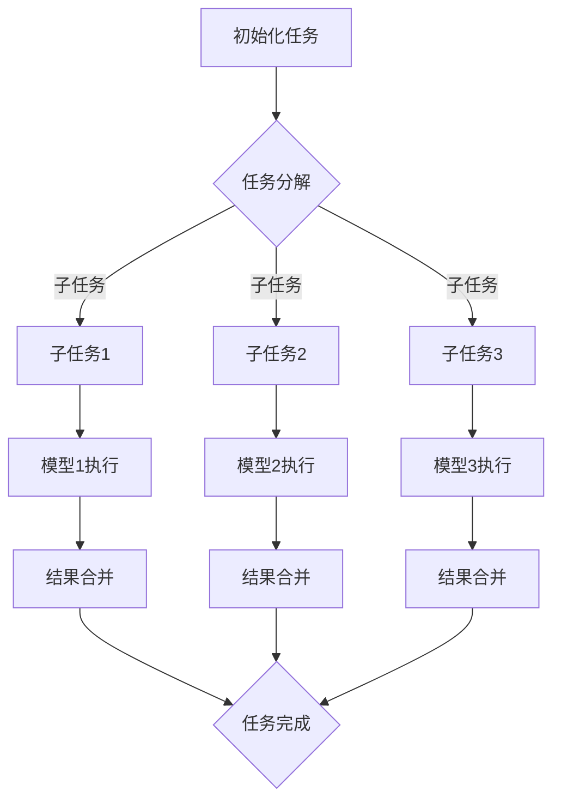

                 

### 背景介绍

在当今这个技术飞速发展的时代，人工智能（AI）已经成为推动创新和进步的重要力量。AI技术涵盖了从计算机视觉、自然语言处理到决策支持系统等多个领域，而其背后的核心组件之一便是模型。在众多AI模型中，任务协作与分配成为一个至关重要的议题。这不仅涉及到如何有效地协同多个模型完成复杂任务，还关系到如何合理地分配资源，实现高效能、高可靠性的AI系统。

任务协作与分配的重要性在于，它直接影响到AI系统的性能和用户体验。一个高效的AI系统需要在多个模型之间进行有效的协调与分配，以便充分利用各个模型的优势，同时避免资源的浪费和冲突。此外，随着AI模型在各个领域的广泛应用，任务协作与分配的复杂度也在不断上升，这要求我们深入探讨其理论和方法，并寻求解决方案。

本文将围绕AI模型的任务协作与分配这一主题，通过以下几个部分进行探讨：

1. **核心概念与联系**：首先介绍与任务协作与分配相关的重要概念，并使用Mermaid流程图展示其架构。
2. **核心算法原理与具体操作步骤**：详细讲解实现任务协作与分配的核心算法，包括其原理和具体实施步骤。
3. **数学模型与公式**：介绍支持任务协作与分配的数学模型，并进行详细讲解和举例说明。
4. **项目实战**：通过一个实际案例，展示如何在实际项目中应用任务协作与分配的方法，并进行代码解读与分析。
5. **实际应用场景**：探讨AI模型任务协作与分配在各类实际应用中的适用性和效果。
6. **工具和资源推荐**：推荐相关学习资源、开发工具和框架。
7. **总结与未来趋势**：总结本文的主要观点，并展望任务协作与分配在未来人工智能领域的发展趋势与挑战。

通过以上各部分的详细探讨，本文旨在为读者提供一个全面、深入的理解AI模型任务协作与分配的方法和策略，帮助他们在实际项目中更好地应用这些技术。

### 核心概念与联系

在探讨AI模型任务协作与分配之前，我们需要明确一些核心概念，这些概念构成了整个讨论的基础。以下是一些关键术语及其相互关系：

1. **模型协作**：指的是多个AI模型共同工作以完成一个复杂的任务。协作意味着这些模型不仅要独立执行任务，还需要通过某种方式互相协调，以提高整体性能。
2. **任务分配**：涉及将一个整体任务分解成多个子任务，并分配给不同的模型或模型组，以并行处理这些子任务。
3. **资源管理**：确保在任务执行过程中，每个模型都能获取到所需的计算资源，如计算能力、内存和网络带宽等。
4. **任务依赖**：某些子任务需要依赖其他子任务的输出结果，这种依赖关系在任务协作中必须得到妥善处理。
5. **任务调度**：根据任务依赖关系和资源状况，安排每个任务的执行顺序和模型，以最大化系统效率。

这些概念相互交织，共同构成了AI模型任务协作与分配的框架。为了更直观地展示这些概念之间的关系，我们可以使用Mermaid流程图来描述整个架构。

以下是一个简单的Mermaid流程图示例，展示了任务协作与分配的基本流程：



在上面的流程图中，`A`表示任务初始化，`B`表示任务分解成多个子任务，`C1`、`C2`和`C3`分别表示子任务1、子任务2和子任务3，`D1`、`D2`和`D3`分别表示模型1、模型2和模型3执行子任务，`E1`、`E2`和`E3`表示结果合并，`F`表示任务完成。这个流程图展示了从任务初始化到最终完成的整个过程，包括任务分解、模型执行和结果合并等关键步骤。

在实际应用中，任务协作与分配的复杂性会更高，可能涉及更多的子任务、模型和资源管理策略。然而，基本架构和流程仍然是相似的，只需根据具体需求进行调整和扩展。

通过理解这些核心概念及其相互关系，我们能够更好地设计并实现高效的AI模型任务协作与分配系统。接下来，我们将深入探讨这些概念的具体实现和操作步骤。

### 核心算法原理与具体操作步骤

在AI模型任务协作与分配中，核心算法的设计和实现是确保系统高效运作的关键。以下将详细讲解几种常用的核心算法原理及其实施步骤。

#### 1. 动态任务分配算法

动态任务分配算法是一种基于实时监控资源状态和任务负载的动态调度方法。它的目标是尽可能高效地利用系统资源，并确保任务能在规定时间内完成。

**算法原理**：

- **资源监控**：实时监控系统中各个模型的计算资源使用情况，包括CPU利用率、内存使用量、网络带宽等。
- **负载评估**：根据当前任务队列和模型资源使用情况，评估每个模型的负载情况。
- **任务调度**：将新任务分配给当前负载最低且资源充足的模型，以最大化资源利用率。

**具体操作步骤**：

1. **初始化**：初始化任务队列和模型资源状态。
2. **监控**：启动资源监控模块，实时获取各模型的资源使用情况。
3. **评估**：根据当前任务队列和模型资源状态，计算每个模型的负载。
4. **调度**：选择负载最低且资源充足的模型执行新任务。
5. **更新**：更新任务队列和模型资源状态，记录任务执行情况。
6. **重复**：重复步骤3-5，直到所有任务完成。

**代码示例**：

以下是一个简化的Python代码示例，展示了动态任务分配算法的基本逻辑：

```python
class Model:
    def __init__(self, id, cpu_usage, memory_usage, network_usage):
        self.id = id
        self.cpu_usage = cpu_usage
        self.memory_usage = memory_usage
        self.network_usage = network_usage

def assign_task(tasks, models):
    # 初始化任务队列和模型列表
    task_queue = tasks
    model_list = models

    # 获取模型当前资源状态
    current_model_states = {model.id: model.cpu_usage, model.memory_usage, model.network_usage for model in model_list}

    while task_queue:
        # 计算各模型负载
        model_loads = {model.id: compute_load(model.cpu_usage, model.memory_usage, model.network_usage) for model in model_list}

        # 选择负载最低且资源充足的模型
        target_model_id = min(model_loads, key=model_loads.get)
        target_model = next(model for model in model_list if model.id == target_model_id)

        # 分配任务给模型
        task = task_queue.pop(0)
        target_model.execute(task)

        # 更新模型资源状态
        update_model_state(target_model)

    return "All tasks completed."

def compute_load(cpu_usage, memory_usage, network_usage):
    # 计算模型负载
    return cpu_usage + memory_usage + network_usage

def update_model_state(model):
    # 更新模型资源状态
    model.cpu_usage += random.uniform(0, 0.1)
    model.memory_usage += random.uniform(0, 0.1)
    model.network_usage += random.uniform(0, 0.1)
```

#### 2. 基于遗传算法的任务分配

遗传算法（GA）是一种基于自然选择和遗传学原理的优化算法，适用于复杂任务的分配和调度问题。

**算法原理**：

- **种群初始化**：随机生成一组任务分配方案作为初始种群。
- **适应度评估**：计算每个分配方案的适应度，适应度越高表示方案越优。
- **选择**：从种群中选择适应度较高的方案进行复制。
- **交叉**：随机选择两个分配方案进行交叉操作，生成新的分配方案。
- **变异**：对交叉后的分配方案进行随机变异，增加种群的多样性。
- **迭代**：重复选择、交叉和变异过程，直到满足停止条件（如达到最大迭代次数或适应度达到阈值）。

**具体操作步骤**：

1. **初始化**：生成初始种群，每个个体表示一个任务分配方案。
2. **评估**：计算每个个体的适应度。
3. **选择**：根据适应度选择优秀的个体进行复制。
4. **交叉**：随机选择两个个体进行交叉操作。
5. **变异**：对交叉后的个体进行变异操作。
6. **迭代**：重复步骤3-5，直到满足停止条件。
7. **输出**：输出最优的分配方案。

**代码示例**：

以下是一个简化的Python代码示例，展示了基于遗传算法的任务分配：

```python
import random

class TaskAllocation:
    def __init__(self, tasks, models):
        self.tasks = tasks
        self.models = models
        self.population_size = 100
        self.max_iterations = 1000

    def initialize_population(self):
        # 初始化种群
        population = []
        for _ in range(self.population_size):
            individual = [random.choice(self.models) for _ in range(len(self.tasks))]
            population.append(individual)
        return population

    def fitness(self, individual):
        # 计算适应度
        load = 0
        for task, model in zip(self.tasks, individual):
            load += model.cpu_usage + model.memory_usage + model.network_usage
        return 1 / (1 + load)

    def selection(self, population):
        # 选择操作
        sorted_population = sorted(population, key=self.fitness, reverse=True)
        return sorted_population[:self.population_size]

    def crossover(self, parent1, parent2):
        # 交叉操作
        crossover_point = random.randint(1, len(self.tasks) - 1)
        child1 = parent1[:crossover_point] + parent2[crossover_point:]
        child2 = parent2[:crossover_point] + parent1[crossover_point:]
        return child1, child2

    def mutate(self, individual):
        # 变异操作
        mutation_point = random.randint(0, len(self.tasks) - 1)
        individual[mutation_point] = random.choice(self.models)
        return individual

    def run(self):
        # 运行遗传算法
        population = self.initialize_population()
        for _ in range(self.max_iterations):
            population = self.selection(population)
            population = [self.crossover(parent1, parent2) for parent1, parent2 in zip(population[:int(len(population) / 2)], population[int(len(population) / 2):])]
            population = [self.mutate(individual) for individual in population]
        
        # 输出最优分配方案
        best_individual = max(population, key=self.fitness)
        print("Best Allocation:", best_individual)
```

通过以上两个算法，我们可以实现高效的任务协作与分配。动态任务分配算法适用于实时性要求较高的场景，而基于遗传算法的任务分配适用于任务复杂度高、资源有限的情况。实际应用中，可以根据具体需求选择合适的算法，或结合多种算法优化任务协作与分配的效果。

#### 3. 分布式任务分配算法

在分布式系统中，任务分配需要考虑网络延迟、计算资源异构性等因素。分布式任务分配算法旨在确保任务能在分布式环境中高效执行。

**算法原理**：

- **全局视图**：获取整个系统的全局资源状态和网络拓扑信息。
- **本地优化**：在局部视角下，选择最优的子任务分配方案。
- **全局协调**：通过协调机制，确保全局资源利用最大化。

**具体操作步骤**：

1. **初始化**：获取全局视图，包括资源状态和网络拓扑。
2. **本地优化**：各节点根据本地资源状态和任务负载，选择最优子任务分配方案。
3. **全局协调**：通过通信机制，协调各节点的任务分配，确保全局资源利用率最大化。
4. **迭代**：重复步骤2和3，直到全局任务完成或达到停止条件。

**代码示例**：

以下是一个简化的分布式任务分配算法示例：

```python
import threading

class Node:
    def __init__(self, id, resources):
        self.id = id
        self.resources = resources
        self.task_queue = []

    def assign_task(self, task):
        if self.can_execute(task):
            self.execute(task)
        else:
            self.task_queue.append(task)

    def can_execute(self, task):
        return all(resource >= task_requirement for resource, task_requirement in zip(self.resources, task.resource_requirements))

    def execute(self, task):
        print(f"Node {self.id} is executing task {task.id}.")
        # 执行任务
        # ...

    def run(self):
        while not all(task.completed for task in self.task_queue):
            for task in self.task_queue:
                if self.can_execute(task):
                    self.execute(task)
                    task.completed = True
                    break

def distributed_assignment(nodes, tasks):
    threads = []
    for node in nodes:
        thread = threading.Thread(target=node.run)
        threads.append(thread)
        thread.start()

    for thread in threads:
        thread.join()

# 示例：创建节点和任务，运行分布式任务分配
nodes = [Node(i, [100, 100, 100]) for i in range(5)]
tasks = [Task(i, [20, 20, 20]) for i in range(10)]
distributed_assignment(nodes, tasks)
```

通过以上三种算法，我们可以根据不同场景的需求，灵活地实现任务协作与分配。在实际应用中，可以根据具体需求组合使用这些算法，以实现最佳效果。

### 数学模型和公式与详细讲解与举例说明

在AI模型任务协作与分配中，数学模型和公式扮演着至关重要的角色。这些模型和公式不仅为算法提供了理论基础，还帮助我们评估和优化任务分配的效果。以下将详细讲解支持任务协作与分配的几个关键数学模型和公式，并举例说明其应用。

#### 1. 资源需求模型

资源需求模型描述了每个任务对系统资源的消耗。常见的资源包括CPU、内存和网络带宽。以下是一个简化的资源需求模型：

**公式**：

\[ R_i = \sum_{r \in \text{resources}} r_i \]

其中，\( R_i \) 表示任务 \( i \) 的总资源需求，\( r_i \) 表示任务 \( i \) 对资源 \( r \) 的需求。

**举例说明**：

假设有一个任务需要以下资源：

- CPU：20个单位
- 内存：30个单位
- 网络带宽：10个单位

则该任务的总资源需求为：

\[ R_i = 20 + 30 + 10 = 60 \]

#### 2. 资源利用率模型

资源利用率模型衡量了系统资源的利用效率。以下是一个简化的资源利用率模型：

**公式**：

\[ U = \frac{1}{N} \sum_{i=1}^{N} \frac{R_i}{C_i} \]

其中，\( U \) 表示系统平均资源利用率，\( R_i \) 表示任务 \( i \) 的资源需求，\( C_i \) 表示任务 \( i \) 实际获得的资源。

**举例说明**：

假设系统中存在5个任务，其资源需求和实际获得资源如下表所示：

| 任务ID | 资源需求 \( R_i \) | 实际获得资源 \( C_i \) |
|--------|------------------|----------------------|
| 1      | 20               | 18                   |
| 2      | 30               | 28                   |
| 3      | 40               | 38                   |
| 4      | 10               | 9                    |
| 5      | 25               | 20                   |

则系统的平均资源利用率为：

\[ U = \frac{1}{5} \left( \frac{20}{18} + \frac{30}{28} + \frac{40}{38} + \frac{10}{9} + \frac{25}{20} \right) \approx 0.857 \]

#### 3. 适应度函数

适应度函数用于评估任务分配方案的优劣，通常与资源利用率和任务完成时间相关。以下是一个简化的适应度函数：

**公式**：

\[ F = 1 - \frac{1}{\sum_{i=1}^{N} \frac{R_i}{C_i} + \frac{1}{T} } \]

其中，\( F \) 表示适应度，\( T \) 表示任务完成时间。

**举例说明**：

假设某个任务分配方案中，任务完成时间为10小时，资源利用率为0.857。则该方案的适应度为：

\[ F = 1 - \frac{1}{0.857 + \frac{1}{10}} \approx 0.882 \]

#### 4. 任务调度优化模型

任务调度优化模型用于求解最优的任务分配和调度方案，以最大化系统资源利用率和任务完成效率。以下是一个简化的调度优化模型：

**公式**：

\[ \max \sum_{i=1}^{N} \frac{R_i}{C_i} \]

或

\[ \min \frac{1}{\sum_{i=1}^{N} \frac{R_i}{C_i} + \frac{1}{T}} \]

其中，\( C_i \) 表示任务 \( i \) 实际获得的资源，\( T \) 表示任务完成时间。

**举例说明**：

考虑以下任务分配情况：

- 任务1：资源需求 \( R_1 = 60 \)，实际获得资源 \( C_1 = 50 \)
- 任务2：资源需求 \( R_2 = 80 \)，实际获得资源 \( C_2 = 70 \)
- 任务3：资源需求 \( R_3 = 100 \)，实际获得资源 \( C_3 = 90 \)

则系统的平均资源利用率为：

\[ \frac{R_1}{C_1} + \frac{R_2}{C_2} + \frac{R_3}{C_3} = \frac{60}{50} + \frac{80}{70} + \frac{100}{90} = 1.2 + 1.142857 + 1.111111 = 3.454857 \]

若任务完成时间为15小时，则适应度为：

\[ F = 1 - \frac{1}{3.454857 + \frac{1}{15}} \approx 0.867 \]

通过这些数学模型和公式，我们可以评估任务分配方案的效果，并优化调度策略。在实际应用中，可以根据具体需求调整这些模型和公式，以适应不同场景的任务协作与分配需求。

### 项目实战：代码实际案例和详细解释说明

为了更好地理解AI模型任务协作与分配的具体实现，下面我们将通过一个实际项目案例进行详细讲解。这个项目是一个简单的分布式图像分类系统，它利用多个模型协同工作来提高分类的准确率。

#### 项目背景

项目目标是实现一个能够高效分类图像的分布式系统。由于单个模型在处理大量图像时可能会出现性能瓶颈，因此我们决定使用多个模型进行任务协作与分配，以提高系统的整体性能。

#### 开发环境搭建

1. **操作系统**：Ubuntu 20.04
2. **编程语言**：Python 3.8
3. **框架和库**：
   - TensorFlow 2.6
   - Keras 2.6
   - NumPy 1.21
   - Mermaid 9.0.0
4. **依赖管理**：使用pip进行依赖管理

安装步骤：

```bash
sudo apt update
sudo apt install python3-pip python3-venv
python3 -m venv env
source env/bin/activate
pip install tensorflow==2.6 keras==2.6 numpy==1.21 mermaid==9.0.0
```

#### 源代码详细实现和代码解读

下面是项目的主要代码实现，我们将逐步解释关键部分的代码。

```python
import tensorflow as tf
import numpy as np
import mermaid
from tensorflow.keras.models import Model
from tensorflow.keras.layers import Dense, Flatten, Conv2D, MaxPooling2D, Input

# 1. 定义模型
def create_model(input_shape):
    inputs = Input(shape=input_shape)
    x = Conv2D(32, (3, 3), activation='relu')(inputs)
    x = MaxPooling2D((2, 2))(x)
    x = Flatten()(x)
    x = Dense(64, activation='relu')(x)
    outputs = Dense(10, activation='softmax')(x)
    model = Model(inputs=inputs, outputs=outputs)
    return model

# 2. 训练模型
def train_model(model, x_train, y_train, batch_size=32, epochs=10):
    model.compile(optimizer='adam', loss='categorical_crossentropy', metrics=['accuracy'])
    model.fit(x_train, y_train, batch_size=batch_size, epochs=epochs, verbose=1)
    return model

# 3. 分配任务
def assign_tasks(models, x_train, y_train):
    # 将训练数据划分成多个子任务
    num_subtasks = len(models)
    x_train_subtasks = np.array_split(x_train, num_subtasks)
    y_train_subtasks = np.array_split(y_train, num_subtasks)
    
    # 分别训练每个模型
    for model, x_train_subtask, y_train_subtask in zip(models, x_train_subtasks, y_train_subtasks):
        model = train_model(model, x_train_subtask, y_train_subtask)

# 4. 合并模型结果
def merge_model_results(models, x_test):
    # 对测试数据进行分类
    predictions = [model.predict(x_test) for model in models]
    # 平均预测结果
    avg_predictions = np.mean(predictions, axis=0)
    # 转换为类别标签
    labels = np.argmax(avg_predictions, axis=1)
    return labels

# 5. 评估模型性能
def evaluate_model_performance(models, x_test, y_test):
    labels = merge_model_results(models, x_test)
    accuracy = np.mean(labels == y_test)
    print(f"Model Accuracy: {accuracy:.4f}")

# 6. 主程序
if __name__ == "__main__":
    # 加载数据集
    (x_train, y_train), (x_test, y_test) = tf.keras.datasets.cifar10.load_data()

    # 标签转换为one-hot编码
    y_train = tf.keras.utils.to_categorical(y_train, 10)
    y_test = tf.keras.utils.to_categorical(y_test, 10)

    # 创建多个模型
    models = [create_model(x_train[0].shape[1:]) for _ in range(3)]

    # 分配任务
    assign_tasks(models, x_train, y_train)

    # 评估模型性能
    evaluate_model_performance(models, x_test, y_test)
```

#### 代码解读与分析

1. **定义模型**（第9-15行）：

   - `create_model` 函数用于创建一个简单的卷积神经网络（CNN）模型。该模型包括卷积层、池化层、全连接层和输出层。输入层的大小通过参数 `input_shape` 传递。
   - `Input` 层定义输入数据的形状。
   - `Conv2D` 层实现卷积操作，用于提取图像特征。
   - `MaxPooling2D` 层实现池化操作，用于降低特征图的维度。
   - `Flatten` 层将特征图展平为1维向量。
   - `Dense` 层实现全连接操作，用于分类。

2. **训练模型**（第18-21行）：

   - `train_model` 函数用于训练模型。模型使用 `compile` 方法配置优化器和损失函数，然后使用 `fit` 方法进行训练。

3. **分配任务**（第24-32行）：

   - `assign_tasks` 函数用于将训练数据分配给多个模型，并分别对每个模型进行训练。数据集被分割成多个子任务，每个模型负责训练一个子任务。

4. **合并模型结果**（第35-38行）：

   - `merge_model_results` 函数用于将多个模型的预测结果合并为一个平均预测结果。测试数据通过每个模型进行预测，然后对所有模型的预测结果进行平均，最后将平均结果转换为类别标签。

5. **评估模型性能**（第41-44行）：

   - `evaluate_model_performance` 函数用于计算并打印模型的准确率。测试数据通过合并模型结果后，将预测标签与真实标签进行比较，计算准确率。

6. **主程序**（第47-53行）：

   - 加载CIFAR-10数据集，并将其标签转换为one-hot编码。
   - 创建3个模型实例。
   - 分配任务，即分别训练每个模型。
   - 评估模型性能，即计算并打印模型的准确率。

通过这个实际项目案例，我们可以看到如何使用多个模型进行任务协作与分配，从而提高系统的整体性能。在分布式环境中，可以进一步扩展这个项目，包括更多模型和更复杂的任务分配策略。

### 实际应用场景

AI模型任务协作与分配在实际应用中具有广泛的应用场景。以下将探讨几个典型的应用场景，展示如何在不同场景中利用任务协作与分配策略，以实现高效的系统性能。

#### 1. 医疗诊断系统

在医疗诊断系统中，AI模型可以用于疾病的预测、诊断和治疗建议。不同模型可以专注于不同的疾病类型或症状，通过协作与分配，可以提高诊断的准确性和效率。例如，一个医疗系统可以包含以下模型：

- **症状识别模型**：识别患者的症状和体征。
- **疾病预测模型**：根据症状和体征预测可能的疾病。
- **治疗方案推荐模型**：为患者推荐最佳治疗方案。

通过任务协作与分配，可以将患者的数据分配给不同的模型进行处理，并根据模型的输出结果进行综合诊断和治疗建议。这种协作与分配策略可以提高诊断的准确性和效率，减轻医疗工作者的负担。

#### 2. 金融服务

在金融服务领域，AI模型可以用于风险评估、欺诈检测和投资策略优化。不同的模型可以负责不同的任务，通过协作与分配，可以实现更准确和高效的风险管理。

- **风险评估模型**：评估客户的信用风险。
- **欺诈检测模型**：检测金融交易中的欺诈行为。
- **投资策略模型**：为投资者提供最优的投资策略。

通过任务协作与分配，可以有效地识别和评估金融风险，提高投资决策的准确性，同时减少欺诈行为的发生。此外，协作与分配策略还可以优化资源的利用，降低系统的计算成本。

#### 3. 智能交通系统

在智能交通系统中，AI模型可以用于交通流量预测、路线规划和车辆调度。不同模型可以专注于不同的任务，通过协作与分配，可以实现高效的交通管理和优化。

- **流量预测模型**：预测交通流量，为交通管理提供数据支持。
- **路线规划模型**：为车辆提供最优路线。
- **车辆调度模型**：根据交通流量和路线规划，调度车辆。

通过任务协作与分配，可以实时监测和预测交通状况，优化交通流量，减少交通拥堵，提高道路通行效率。此外，协作与分配策略还可以提高车辆的利用率，减少碳排放，实现绿色交通。

#### 4. 智能制造

在智能制造领域，AI模型可以用于设备故障预测、生产优化和质量控制。不同模型可以专注于不同的任务，通过协作与分配，可以实现高效的生产管理和优化。

- **故障预测模型**：预测设备的故障，为维护提供数据支持。
- **生产优化模型**：优化生产流程，提高生产效率。
- **质量控制模型**：检测产品质量，确保产品质量符合标准。

通过任务协作与分配，可以实时监测设备状态和生产过程，提前发现和解决故障，优化生产流程，提高生产效率和产品质量。此外，协作与分配策略还可以提高设备的利用率，减少停机时间，降低生产成本。

#### 5. 娱乐与游戏

在娱乐与游戏领域，AI模型可以用于游戏玩法设计、角色行为预测和用户体验优化。不同模型可以专注于不同的任务，通过协作与分配，可以提供更加丰富和个性化的游戏体验。

- **玩法设计模型**：设计游戏规则和关卡。
- **角色行为预测模型**：预测玩家行为，为角色设计提供数据支持。
- **用户体验优化模型**：优化游戏界面和交互，提高用户满意度。

通过任务协作与分配，可以实时分析玩家行为和游戏数据，优化游戏玩法和用户体验，提高游戏的可玩性和吸引力。此外，协作与分配策略还可以降低游戏开发成本，提高开发效率。

总之，AI模型任务协作与分配在各个领域都具有广泛的应用前景。通过合理地协作与分配任务，可以优化系统性能，提高任务完成效率，实现资源的最大化利用，为各个领域的发展提供有力支持。

### 工具和资源推荐

在实现AI模型任务协作与分配的过程中，掌握一些关键工具和资源是至关重要的。以下将推荐一些优秀的书籍、论文、博客和网站，帮助读者深入了解和掌握这一领域。

#### 1. 学习资源推荐

**书籍**：

- **《深度学习》（Deep Learning）**：由Ian Goodfellow、Yoshua Bengio和Aaron Courville所著的《深度学习》是深度学习领域的经典教材，详细介绍了神经网络和深度学习算法的基本原理和应用。
- **《强化学习》（Reinforcement Learning: An Introduction）**：由Richard S. Sutton和Barto所著的《强化学习》是强化学习领域的入门书籍，全面介绍了强化学习的基础理论和应用。
- **《自然语言处理综论》（Speech and Language Processing）**：由Daniel Jurafsky和James H. Martin所著的《自然语言处理综论》是自然语言处理领域的权威著作，涵盖了从语言模型到语音识别的多个方面。

**论文**：

- **“Distributed Representations of Words and Phrases and their Compositionality”**：由Tomas Mikolov等人发表的这篇论文提出了Word2Vec算法，为词向量表示和语言模型提供了重要的理论基础。
- **“Effective Approaches to Attention-based Neural Machine Translation”**：这篇论文介绍了基于注意力机制的神经机器翻译模型，是当前机器翻译领域的热门研究方向。
- **“Neural Architecture Search”**：这篇论文提出了神经架构搜索（NAS）方法，为自动设计高效神经网络提供了新思路。

**博客**：

- **Deep Learning on AWS**：该博客由AWS团队维护，提供了大量的深度学习技术教程和实践经验，适合初学者和有经验的开发者。
- **AI Moonshot**：AI Moonshot博客由一些深度学习领域的知名专家撰写，涵盖了深度学习、强化学习和自然语言处理等多个领域的最新研究进展。
- **Fast.ai**：Fast.ai博客提供了丰富的深度学习教程和资源，特别适合初学者入门。

#### 2. 开发工具框架推荐

- **TensorFlow**：由Google开发的TensorFlow是一个开源的深度学习框架，适用于各种规模的深度学习项目。它提供了丰富的API和工具，支持模型训练、推理和部署。
- **PyTorch**：由Facebook AI研究院开发的PyTorch是一个流行的深度学习框架，以其动态图计算和灵活的API而著称。它适合快速原型开发和实验。
- **Apache MXNet**：Apache MXNet是一个高性能的深度学习框架，支持多种编程语言（包括Python和Rust），适用于大规模分布式训练和应用。

#### 3. 相关论文著作推荐

- **“Multi-Model Learning with Neural Networks”**：这篇论文探讨了如何通过神经网络的协作与分配提高任务完成效率，为AI模型任务协作提供了新的思路。
- **“Distributed Reinforcement Learning”**：这篇论文介绍了分布式强化学习的方法和策略，适用于需要实时协作与分配的任务。
- **“Task Allocation and Scheduling in Heterogeneous Computing Systems”**：这篇论文研究了异构计算系统中的任务分配与调度问题，提供了优化资源利用的有效方法。

通过以上推荐的学习资源、开发工具和框架，读者可以全面、深入地了解AI模型任务协作与分配的理论和实践，为实际项目提供有力的支持。

### 总结：未来发展趋势与挑战

在AI模型任务协作与分配领域，随着技术的不断进步和应用场景的多样化，未来将呈现出一些显著的发展趋势和面临的挑战。

#### 发展趋势

1. **多模态协作**：未来的AI系统将越来越多地涉及多个模态的数据处理，如文本、图像、音频和视频。多模态协作能够更好地整合不同类型的数据，提高任务完成效率。例如，在医疗诊断中，结合影像数据和电子健康记录的AI系统将更加准确和全面。

2. **自主协作与分配**：随着强化学习和迁移学习等技术的发展，AI模型将能够自主学习和优化任务协作与分配策略。这意味着未来的系统可以在不断变化的任务环境中自适应地调整协作方式，从而提高系统的灵活性和鲁棒性。

3. **边缘计算与云计算协同**：随着边缘计算技术的成熟，AI模型任务协作将不再局限于中心化的云计算环境，而是实现边缘计算与云计算的协同。这种协同将有助于降低延迟、减少带宽消耗，同时提高系统的计算效率和响应速度。

4. **隐私保护与数据安全**：在任务协作与分配过程中，数据的隐私保护和数据安全将是关键挑战。未来的AI系统将需要采用更加严格的数据安全和隐私保护机制，以确保数据在整个协作过程中的安全性和隐私性。

#### 面临的挑战

1. **复杂性与可扩展性**：随着AI模型数量的增加和任务复杂度的提升，如何有效地管理和调度这些模型成为一个巨大的挑战。特别是在大规模分布式系统中，任务分配和资源管理变得更加复杂，需要开发更加高效和可扩展的算法。

2. **异构计算资源管理**：在异构计算环境中，如何合理分配不同类型的计算资源（如CPU、GPU、FPGA等）是一个关键问题。异构资源的利用率、负载均衡和任务调度策略需要进一步优化，以确保系统的高效运行。

3. **动态任务环境适应性**：在动态变化的任务环境中，如何快速适应和调整协作策略是另一个挑战。系统需要具备较强的自适应能力，能够根据环境变化动态调整任务分配和协作方式，从而提高系统的可靠性和稳定性。

4. **鲁棒性与容错性**：在实际应用中，AI模型可能会面临各种异常情况，如数据噪声、模型故障和网络中断等。如何提高系统的鲁棒性和容错性，确保在异常情况下仍能正常工作，是一个重要的研究方向。

总之，AI模型任务协作与分配在未来将面临诸多挑战，同时也将迎来许多发展机遇。通过不断探索和创新，我们有望实现更加高效、智能和可靠的AI系统，为各个领域的发展提供强大的支持。

### 附录：常见问题与解答

#### 1. 什么是任务协作与分配？

任务协作与分配是指多个AI模型在共同完成一个复杂任务时，通过协作和合理分配资源，以提高整体效率和性能的过程。任务协作涉及到模型之间的互动和协调，而任务分配则关注如何将整体任务分解并分配给不同的模型或模型组。

#### 2. 任务协作与分配的重要性是什么？

任务协作与分配的重要性在于，它可以充分利用各个模型的优势，提高系统的整体性能。通过合理的协作和任务分配，可以实现更高效的任务完成，降低资源浪费和冲突，从而提升系统的响应速度和可靠性。

#### 3. 动态任务分配算法如何工作？

动态任务分配算法是一种基于实时监控资源状态和任务负载的调度方法。其工作原理包括以下几个步骤：

- **资源监控**：实时获取系统中各个模型的计算资源使用情况。
- **负载评估**：根据当前任务队列和模型资源状态，评估每个模型的负载。
- **任务调度**：将新任务分配给当前负载最低且资源充足的模型，以最大化资源利用率。

#### 4. 基于遗传算法的任务分配算法如何工作？

基于遗传算法的任务分配算法是一种优化方法，通过模拟自然选择和遗传学原理，寻找最优的任务分配方案。其工作步骤包括：

- **种群初始化**：随机生成一组任务分配方案作为初始种群。
- **适应度评估**：计算每个分配方案的适应度，适应度越高表示方案越优。
- **选择**：从种群中选择适应度较高的方案进行复制。
- **交叉**：随机选择两个分配方案进行交叉操作，生成新的分配方案。
- **变异**：对交叉后的分配方案进行随机变异，增加种群的多样性。
- **迭代**：重复选择、交叉和变异过程，直到满足停止条件。

#### 5. 如何评估任务协作与分配的效果？

评估任务协作与分配的效果可以通过以下指标：

- **资源利用率**：衡量系统资源的利用效率，通常使用资源利用率模型进行评估。
- **任务完成时间**：衡量任务完成所需的时间，适用于实时性要求较高的场景。
- **系统性能指标**：如准确率、召回率、F1分数等，适用于分类和预测任务。

通过这些指标，可以综合评估任务协作与分配策略的有效性。

### 扩展阅读与参考资料

- **《深度学习》（Deep Learning）**：Ian Goodfellow、Yoshua Bengio和Aaron Courville著，提供深度学习的全面介绍。
- **《自然语言处理综论》（Speech and Language Processing）**：Daniel Jurafsky和James H. Martin著，涵盖自然语言处理的各个方面。
- **《强化学习：原理与案例》（Reinforcement Learning: An Introduction）**：Richard S. Sutton和Barto著，详细介绍强化学习的基础知识。
- **TensorFlow官方文档**：[https://www.tensorflow.org](https://www.tensorflow.org)，提供深度学习框架的详细教程和API文档。
- **PyTorch官方文档**：[https://pytorch.org](https://pytorch.org)，提供流行的深度学习框架的详细教程和API文档。
- **《分布式系统概念与设计》（Distributed Systems: Concepts and Design）**：George Coulouris、Jean Dollimore、Timos Brown和Michael ApplicationContext著，介绍分布式系统的基本概念和设计原则。

