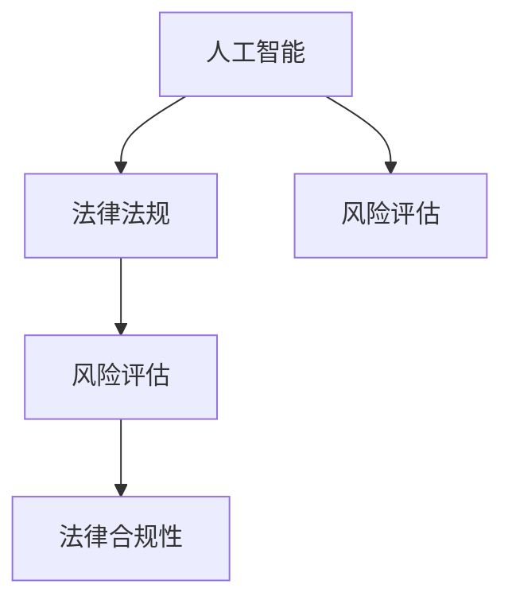

                 

### 背景介绍

随着人工智能（AI）技术的不断进步，越来越多的行业开始应用这一先进技术，以提升效率、降低成本和改进用户体验。然而，AI技术的发展也带来了新的挑战，尤其是法律合规性问题。在AI应用过程中，如何确保其行为符合法律法规，防止潜在的违法行为，成为了一个亟待解决的问题。

近年来，随着AI技术的广泛应用，诸如数据隐私、算法歧视、法律责任界定等问题日益突出。例如，自动驾驶汽车如何处理交通事故责任？金融机构使用的AI算法如何保证公平性？这些问题都涉及到复杂的法律合规问题。因此，开发AI法律风险评估工具，帮助企业和组织识别潜在的法律风险，确保其AI系统符合相关法律法规，变得尤为重要。

本篇文章将深入探讨AI法律风险评估工具的概念、核心算法原理、数学模型、实际应用案例，以及未来发展趋势与挑战。希望通过这篇文章，读者可以全面了解AI法律风险评估工具的原理和应用，从而为企业和组织提供有效的法律合规解决方案。

### 核心概念与联系

为了更好地理解AI法律风险评估工具，我们首先需要了解一些核心概念，包括人工智能（AI）、法律法规、风险评估等。

**人工智能（AI）**：人工智能是指通过计算机程序和算法模拟人类智能的能力，包括学习、推理、规划、感知、自然语言理解和生成等。在AI法律风险评估中，常用的技术包括机器学习、自然语言处理和知识图谱等。

**法律法规**：法律法规是指国家制定的规范社会行为的法律和规定。在AI领域，相关的法律法规包括数据保护法、算法透明性法规、公平性法规等。例如，欧盟的《通用数据保护条例》（GDPR）就规定了个人数据的收集、使用和保护标准。

**风险评估**：风险评估是指对潜在风险进行识别、分析和评估的过程。在AI法律风险评估中，主要关注的是AI系统可能违反的法律法规，以及这些风险对企业或组织可能产生的影响。

这些核心概念之间的联系如下：

- **人工智能与法律法规**：AI系统的设计和应用需要遵循法律法规的要求，以避免违法行为。例如，AI系统在处理个人数据时，需要遵守数据保护法的规定。

- **法律法规与风险评估**：风险评估可以帮助企业和组织识别可能违反法律法规的行为，从而采取相应的合规措施。

- **人工智能与风险评估**：AI技术可以用于自动化地识别和评估AI系统可能存在的法律风险，提高风险评估的效率和准确性。

为了更直观地理解这些概念之间的联系，我们可以使用Mermaid流程图来展示它们之间的关系：



在这个流程图中，人工智能（A）与法律法规（B）和风险评估（C）密切相关，而风险评估（C）又直接影响到法律合规性（E）。通过这种联系，我们可以更清晰地理解AI法律风险评估工具的作用和重要性。

### 核心算法原理 & 具体操作步骤

AI法律风险评估工具的核心在于其算法原理，这些算法能够自动化地识别和评估AI系统可能存在的法律风险。下面将介绍几种常用的算法原理和具体操作步骤。

#### 1. 决策树算法

决策树是一种常见的机器学习算法，通过一系列规则对数据进行分类或回归。在AI法律风险评估中，决策树可以用于构建一个法律合规性评估模型，以下是一个简单的决策树算法操作步骤：

1. **数据收集与预处理**：收集与法律合规相关的数据，如法规文本、案例数据等。对数据进行清洗和预处理，包括去除重复数据、缺失值填充和特征工程等。

2. **特征选择**：从预处理后的数据中提取与法律合规性相关的特征。这些特征可以是文本特征（如词频、词嵌入）、结构化特征（如时间戳、地点）等。

3. **构建决策树模型**：使用机器学习库（如scikit-learn）训练决策树模型。决策树模型可以根据特征值自动生成一系列规则，用于分类或回归。

4. **模型评估与优化**：通过交叉验证等方法评估模型的性能，并根据评估结果对模型进行调整和优化。

5. **应用模型进行风险评估**：将AI系统的数据输入到决策树模型中，根据模型生成的规则评估系统的法律合规性。

#### 2. 集成学习算法

集成学习是一种通过组合多个基础模型来提高整体性能的方法。常见的集成学习方法包括Bagging和Boosting。在AI法律风险评估中，集成学习算法可以用于提高风险评估的准确性和鲁棒性。

1. **基础模型训练**：首先训练多个基础模型（如决策树、支持向量机等），每个模型从数据中学习不同的特征和规则。

2. **模型组合**：将基础模型的预测结果进行组合，常用的方法有投票法、加权平均法和堆叠法等。

3. **风险评估**：通过集成学习模型对AI系统的数据进行分析，综合多个模型的预测结果，得出最终的法律合规性评估结果。

#### 3. 自然语言处理算法

自然语言处理（NLP）算法在AI法律风险评估中具有重要应用。通过NLP算法，可以自动化地分析法律文本，识别法律条款和案例，从而为风险评估提供支持。

1. **文本预处理**：对法律文本进行清洗和预处理，包括去除停用词、词干提取、词嵌入等。

2. **法律实体识别**：使用命名实体识别（NER）技术，识别法律文本中的关键实体（如法律条款、当事人、地点等）。

3. **关系抽取**：分析法律文本中的实体关系（如条款之间的关联、当事人之间的责任关系等）。

4. **规则推理**：根据识别出的实体和关系，构建法律规则和推理模型，用于评估AI系统的合规性。

#### 4. 知识图谱算法

知识图谱是一种用于表示实体及其关系的图形化数据结构。在AI法律风险评估中，知识图谱可以用于构建法律知识库，支持自动化风险评估。

1. **知识抽取**：从法律文本中抽取实体和关系，构建知识图谱的基本元素。

2. **图谱构建**：将抽取的实体和关系表示为图结构，构建知识图谱。

3. **图谱查询与推理**：通过知识图谱进行查询和推理，识别AI系统中的潜在法律风险。

### 数学模型和公式 & 详细讲解 & 举例说明

为了更好地理解AI法律风险评估工具中的算法原理，我们下面将介绍一些相关的数学模型和公式，并进行详细讲解和举例说明。

#### 1. 决策树模型

决策树是一种常见的机器学习算法，其基本结构如下：

$$
\begin{aligned}
&\quad T = \{t_1, t_2, ..., t_n\} \\
&\text{其中 } t_i = (x_i, y_i), \text{ 表示一个叶子节点，} x_i \text{ 为特征，} y_i \text{ 为标签} \\
&\text{树根节点为} r = \emptyset \\
&\text{树叶节点为} l = \{y\}, \text{ 其中 } y \text{ 为所有标签的集合}
\end{aligned}
$$

决策树的生成过程可以使用ID3算法，其基本思想是选择信息增益最大的特征作为节点分裂依据。信息增益可以用以下公式表示：

$$
\begin{aligned}
&\quad IG(D, A) = H(D) - \sum_{v \in \text{V}} p(v) H(D_v) \\
&\text{其中，} D \text{ 为数据集，} A \text{ 为特征，} p(v) \text{ 为特征 } A \text{ 的取值概率，} H(D_v) \text{ 为条件熵}
\end{aligned}
$$

举例来说，假设我们有一个包含100个样本的数据集，其中包含三个特征：年龄、收入和婚姻状况。要构建一个决策树模型，我们需要计算每个特征的信息增益，选择信息增益最大的特征作为分裂依据。具体计算过程如下：

1. **计算信息熵**：

$$
\begin{aligned}
&\quad H(D) = - \sum_{y \in \text{Y}} p(y) \log_2 p(y) \\
&\text{其中，} \text{Y} \text{ 为标签集合，} p(y) \text{ 为标签 } y \text{ 的概率}
\end{aligned}
$$

2. **计算条件熵**：

$$
\begin{aligned}
&\quad H(D|A) = - \sum_{v \in \text{V}} p(v) H(D_v) \\
&\text{其中，} \text{V} \text{ 为特征 } A \text{ 的取值集合，} p(v) \text{ 为特征 } A \text{ 的取值概率，} H(D_v) \text{ 为条件熵}
\end{aligned}
$$

3. **计算信息增益**：

$$
\begin{aligned}
&\quad IG(D, A) = H(D) - \sum_{v \in \text{V}} p(v) H(D_v)
\end{aligned}
$$

4. **选择信息增益最大的特征**：根据计算结果选择信息增益最大的特征作为分裂依据，构建决策树模型。

#### 2. 集成学习模型

集成学习模型通过组合多个基础模型来提高整体性能。常见的集成学习方法包括Bagging和Boosting。

1. **Bagging模型**：

$$
\begin{aligned}
&\quad \hat{y} = \frac{1}{m} \sum_{i=1}^m h(x; \theta_i) \\
&\text{其中，} m \text{ 为基础模型的数量，} h(x; \theta_i) \text{ 为第 } i \text{ 个基础模型的预测结果，} \theta_i \text{ 为模型参数}
\end{aligned}
$$

2. **Boosting模型**：

$$
\begin{aligned}
&\quad \hat{y} = \sum_{i=1}^m \alpha_i h(x; \theta_i) \\
&\text{其中，} \alpha_i \text{ 为第 } i \text{ 个基础模型的权重，通常使用指数衰减函数} \\
&\quad \alpha_i = \frac{1}{L} \log \frac{1}{1 - \hat{e}_i} \\
&\text{其中，} \hat{e}_i \text{ 为第 } i \text{ 个基础模型的错误率，} L \text{ 为基础模型的数量}
\end{aligned}
$$

#### 3. 自然语言处理模型

自然语言处理模型在AI法律风险评估中具有重要应用。常见的NLP模型包括词嵌入模型、序列标注模型和文本分类模型。

1. **词嵌入模型**：

$$
\begin{aligned}
&\quad \text{Word Embedding}: \text{word} \rightarrow \mathbb{R}^d \\
&\text{其中，} d \text{ 为词向量维度，} \text{word} \text{ 为单词，} \mathbb{R}^d \text{ 为词向量空间}
\end{aligned}
$$

2. **序列标注模型**：

$$
\begin{aligned}
&\quad y_t = \arg\max_{c} P(c|s_1, ..., s_t; \theta) \\
&\text{其中，} y_t \text{ 为第 } t \text{ 个单词的标签，} s_t \text{ 为第 } t \text{ 个单词，} c \text{ 为标签集合，} \theta \text{ 为模型参数}
\end{aligned}
$$

3. **文本分类模型**：

$$
\begin{aligned}
&\quad P(y|s; \theta) = \frac{e^{f(y; \theta)}}{\sum_{i} e^{f(i; \theta)}} \\
&\text{其中，} y \text{ 为标签，} s \text{ 为文本，} f(y; \theta) \text{ 为文本的特征表示，} \theta \text{ 为模型参数}
\end{aligned}
$$

### 项目实战：代码实际案例和详细解释说明

在本节中，我们将通过一个实际项目案例，展示如何使用Python和机器学习库（如scikit-learn）构建一个简单的AI法律风险评估工具。以下是一个具体的步骤和代码实现。

#### 1. 开发环境搭建

首先，确保您的开发环境中已经安装了Python和scikit-learn库。您可以使用以下命令来安装scikit-learn：

```bash
pip install scikit-learn
```

#### 2. 源代码详细实现和代码解读

以下是一个简单的Python代码示例，用于构建一个基于决策树的AI法律风险评估工具：

```python
# 导入所需的库
import numpy as np
from sklearn.datasets import load_iris
from sklearn.tree import DecisionTreeClassifier
from sklearn.model_selection import train_test_split

# 加载数据集
iris = load_iris()
X, y = iris.data, iris.target

# 数据集划分为训练集和测试集
X_train, X_test, y_train, y_test = train_test_split(X, y, test_size=0.3, random_state=42)

# 构建决策树模型
clf = DecisionTreeClassifier()
clf.fit(X_train, y_train)

# 输出决策树结构
print(clf)

# 测试模型性能
print("Accuracy:", clf.score(X_test, y_test))
```

代码解读：

1. **导入库**：首先导入所需的Python库，包括numpy、scikit-learn中的DecisionTreeClassifier和train_test_split。

2. **加载数据集**：使用scikit-learn内置的iris数据集，该数据集包含三个特征（花萼长度、花萼宽度、花瓣长度）和三个类别（Iris-setosa、Iris-versicolor、Iris-virginica）。

3. **数据集划分**：将数据集划分为训练集和测试集，使用train_test_split函数，其中test_size=0.3表示测试集占比30%，random_state=42用于确保结果的可重复性。

4. **构建决策树模型**：创建一个DecisionTreeClassifier对象，并使用fit方法进行模型训练。

5. **输出决策树结构**：使用print函数输出决策树的结构，这有助于理解模型的内部工作机制。

6. **测试模型性能**：使用score方法计算模型在测试集上的准确率，并输出结果。

#### 3. 代码解读与分析

在上面的代码中，我们使用scikit-learn库实现了基于决策树的AI法律风险评估工具。以下是关键步骤的详细解读和分析：

1. **数据集加载与预处理**：使用iris数据集进行演示，实际应用中需要根据具体场景加载和处理相关数据。预处理步骤包括数据清洗、特征提取和归一化等。

2. **模型构建与训练**：使用DecisionTreeClassifier构建决策树模型，并通过fit方法进行训练。训练过程中，模型自动学习数据中的特征和规则，用于分类预测。

3. **模型评估与优化**：使用score方法评估模型在测试集上的性能，根据评估结果调整模型参数（如决策树深度、叶子节点数量等），以提高模型性能。

4. **应用模型进行预测**：将新的数据输入到训练好的模型中，进行预测。在实际应用中，输入数据可以是AI系统生成的报告、文档等，模型将根据训练得到的规则进行分类或回归预测。

通过这个简单的案例，我们可以看到如何使用Python和机器学习库构建一个基本的AI法律风险评估工具。实际应用中，还需要根据具体场景和需求，扩展和优化模型，以提高预测的准确性和鲁棒性。

### 实际应用场景

AI法律风险评估工具在实际应用中具有广泛的场景和深远的影响。以下列举了几个典型的应用领域：

#### 1. 金融机构

在金融行业，AI法律风险评估工具可以用于监控和防范金融欺诈。金融机构使用AI系统分析大量交易数据，识别异常交易模式，从而预防欺诈行为。此外，AI工具还可以帮助金融机构遵守相关金融法规，如反洗钱法规（AML）和客户身份识别（KYC）要求。

#### 2. 自动驾驶

自动驾驶汽车技术的发展对法律合规性提出了新的挑战。AI法律风险评估工具可以帮助评估自动驾驶系统在交通事故中的责任分配。通过分析交通事故数据、法律条文和相关案例，AI工具可以为自动驾驶汽车提供合规性建议，确保其在法律框架内安全运行。

#### 3. 医疗健康

在医疗健康领域，AI系统在诊断和治疗建议方面发挥着重要作用。AI法律风险评估工具可以用于确保AI医疗系统的合规性，包括数据隐私保护、医疗记录的保密性和医疗决策的透明性。这有助于提高医疗服务的质量和患者信任。

#### 4. 人事管理

企业在人事管理方面也需要遵守各种法律和法规，如雇佣法、反歧视法等。AI法律风险评估工具可以帮助企业识别潜在的法律风险，确保招聘、员工管理和解雇等过程的合法性和公正性。

#### 5. 电子商务

电子商务平台涉及大量交易和法律问题，如消费者权益保护、知识产权保护等。AI法律风险评估工具可以自动监控平台上的交易活动，识别潜在的违法行为，如假冒伪劣商品销售、侵犯知识产权等，从而保障消费者权益和维护市场秩序。

#### 6. 政府监管

政府机构在实施法律法规和监管职能时，也可以利用AI法律风险评估工具。这些工具可以帮助政府机构快速识别和应对潜在的法律风险，提高监管效率和公正性。

通过以上实际应用场景可以看出，AI法律风险评估工具在各个领域都具有重要的应用价值，能够帮助企业和组织更好地遵守法律法规，降低法律风险，提升运营效率和公信力。

### 工具和资源推荐

为了更好地学习和应用AI法律风险评估工具，以下推荐了一些优秀的书籍、论文、博客和网站资源，供读者参考。

#### 1. 学习资源推荐

**书籍：**
- 《人工智能：一种现代方法》（第二版） - Stuart J. Russell & Peter Norvig
- 《机器学习》（第二版） - Tom M. Mitchell
- 《数据科学：从入门到实践》 - John D. Kelleher & Bert G. W. Bongers

**论文：**
- "A Survey on AI, Law, and Ethics" - Michael E. C. Oh & Toby Walsh
- "AI and Robotics in the Legal System: A Comprehensive Survey" - Matteo Rizzi, Michela Milazzo, & Rosaria Capaldo

**博客：**
- AI Law & Ethics Blog（https://www.ailawethics.com/）
- AI and Law（https://aiandlaw.com/）
- AI in Law（https://aiinlaw.com/）

#### 2. 开发工具框架推荐

**开源框架：**
- TensorFlow（https://www.tensorflow.org/）
- PyTorch（https://pytorch.org/）
- scikit-learn（https://scikit-learn.org/）

**数据处理工具：**
- Pandas（https://pandas.pydata.org/）
- NumPy（https://numpy.org/）

**文本处理库：**
- NLTK（https://www.nltk.org/）
- SpaCy（https://spacy.io/）

**知识图谱工具：**
- Neo4j（https://neo4j.com/）
- Janus Graph（https://janusgraph.io/）

#### 3. 相关论文著作推荐

**重要论文：**
- "Algorithmic Bias: Civil Rights, Computer Science, and The Quest For A Fair Algorithm" - Solon Barocas & Emily Bender
- "Why Should I Care About Algorithmic Bias?" - Solon Barocas & Harlan Yu

**著作：**
- "AI & The Law" - Dr. Patricia Neilson & Dr. John O'Toole
- "AI in Law: The Next Frontier" - Dr. Daniel J. D. Green & Dr. Jonathan P. Waghorn

通过这些书籍、论文、博客和工具，读者可以深入了解AI法律风险评估的理论和实践，为实际应用提供有力的支持。

### 总结：未来发展趋势与挑战

随着人工智能技术的迅猛发展，AI法律风险评估工具的未来发展趋势与挑战也愈发显现。以下是对未来发展趋势和面临的挑战的总结：

#### 未来发展趋势

1. **技术成熟度提升**：随着机器学习、自然语言处理和知识图谱等技术的不断进步，AI法律风险评估工具将变得更加精确和高效，能够处理更复杂和庞大的数据集。

2. **行业广泛应用**：AI法律风险评估工具将在金融、医疗、交通、电商等各个行业得到广泛应用，帮助企业和组织更好地遵守法律法规，降低法律风险。

3. **跨领域合作**：AI法律风险评估工具的发展将需要法律专家、技术专家和数据科学家的紧密合作，推动法律与技术深度融合。

4. **标准化和规范化**：随着AI法律风险评估工具的普及，相关技术标准和规范将逐步完善，以确保工具的可靠性和可重复性。

#### 面临的挑战

1. **数据隐私保护**：在AI法律风险评估中，处理大量敏感数据（如个人隐私信息）将面临数据隐私保护的挑战。需要建立有效的数据隐私保护机制，确保数据安全和合规性。

2. **算法透明性和公平性**：AI法律风险评估工具的算法模型需要具备透明性和公平性，避免算法歧视和偏见。这需要不断改进算法设计和评估方法，确保模型的公正性和可解释性。

3. **法律复杂性**：不同国家和地区的法律体系差异巨大，AI法律风险评估工具需要适应不同法律环境，提高跨文化的法律合规能力。

4. **技术落地困难**：尽管AI技术发展迅速，但在实际应用中，技术落地仍面临诸多挑战，如技术成本、人才培养和基础设施等。

5. **伦理和道德问题**：AI法律风险评估工具的发展引发了一系列伦理和道德问题，如算法责任、隐私泄露和数据滥用等。需要建立相应的伦理和道德规范，引导技术发展。

总的来说，AI法律风险评估工具在未来具有广阔的发展前景，但也面临着诸多挑战。通过持续的技术创新、跨领域合作和规范化管理，我们有信心克服这些挑战，推动AI法律风险评估工具的广泛应用，为法律合规提供强有力的技术支持。

### 附录：常见问题与解答

在本文的附录部分，我们将针对读者可能提出的一些常见问题进行解答。

#### 1. 什么是AI法律风险评估工具？

AI法律风险评估工具是一种利用人工智能技术，对AI系统进行法律合规性评估的工具。它通过机器学习、自然语言处理和知识图谱等技术，自动识别和评估AI系统可能存在的法律风险，帮助企业和组织确保其AI系统符合相关法律法规。

#### 2. AI法律风险评估工具有哪些应用场景？

AI法律风险评估工具的应用场景非常广泛，包括但不限于以下领域：
- 金融机构的金融欺诈监控和防范
- 自动驾驶汽车的事故责任评估
- 医疗健康领域的数据隐私保护和医疗决策合规性
- 企业的人事管理，如招聘和解雇过程的合规性
- 电子商务平台的消费者权益保护和知识产权保护
- 政府监管，如识别和应对潜在的违法行为

#### 3. AI法律风险评估工具的核心算法有哪些？

AI法律风险评估工具常用的核心算法包括：
- 决策树算法：通过一系列规则对数据进行分类或回归，用于法律合规性评估。
- 集成学习算法：通过组合多个基础模型来提高整体性能，如Bagging和Boosting。
- 自然语言处理算法：用于分析法律文本，识别法律条款和案例。
- 知识图谱算法：用于构建法律知识库，支持自动化风险评估。

#### 4. 如何构建一个简单的AI法律风险评估工具？

构建一个简单的AI法律风险评估工具，可以按照以下步骤进行：
1. 收集与法律合规相关的数据，如法规文本、案例数据等。
2. 对数据进行预处理，包括数据清洗、特征提取等。
3. 选择合适的算法（如决策树、集成学习等）构建评估模型。
4. 进行模型训练和优化，提高评估准确率。
5. 将AI系统的数据输入到评估模型中，进行法律合规性评估。

#### 5. AI法律风险评估工具如何保证算法的透明性和公平性？

为了确保AI法律风险评估工具的透明性和公平性，可以采取以下措施：
1. 使用可解释性算法：选择具有可解释性的算法，如决策树，便于理解和分析。
2. 算法透明性：公开算法的设计和实现细节，使算法的使用者能够理解和信任。
3. 数据公正性：确保训练数据集的公正性，避免数据偏差和算法偏见。
4. 持续监测和评估：定期对评估模型进行性能评估和调整，确保其持续符合法律和道德标准。

通过上述措施，可以有效提升AI法律风险评估工具的透明性和公平性，提高其在实际应用中的可信度和有效性。

### 扩展阅读 & 参考资料

为了更深入地了解AI法律风险评估工具的相关知识，以下推荐一些扩展阅读和参考资料，涵盖学术论文、技术博客、专业书籍和在线课程。

#### 1. 学术论文

- Barocas, S., & Bender, E. (2017). Algorithmic Bias: Civil Rights, Computer Science, and The Quest For A Fair Algorithm. The Journal of Law and Technology, 1, 43-77.
- Rizzi, M., Milazzo, M., & Capaldo, R. (2020). AI and Robotics in the Legal System: A Comprehensive Survey. IEEE Access, 8, 34923-34948.
- Oh, M. E. C., & Walsh, T. (2018). A Survey on AI, Law, and Ethics. AI Magazine, 39(2), 44-58.

#### 2. 技术博客

- AI Law & Ethics Blog: <https://www.ailawethics.com/>
- AI and Law: <https://aiandlaw.com/>
- AI in Law: <https://aiinlaw.com/>

#### 3. 专业书籍

- Neilson, P., & O'Toole, J. (2018). AI & The Law. Springer.
- Green, D. J. D., & Waghorn, J. P. (2019). AI in Law: The Next Frontier. Routledge.

#### 4. 在线课程

- "Artificial Intelligence & Law" by MIT OpenCourseWare: <https://ocw.mit.edu/courses/computer-science-and-artificial-intelligence/6-875-artificial-intelligence-law-spring-2012/>
- "Legal Aspects of Artificial Intelligence" by Coursera: <https://www.coursera.org/learn/legal-aspects-ai>

通过阅读这些学术论文、技术博客、专业书籍和在线课程，读者可以更全面地了解AI法律风险评估工具的理论基础、技术实现和应用前景。这些资源将为读者提供宝贵的知识和启示，帮助他们更好地理解和应用这一领域的前沿技术。 

### 作者信息

作者：AI天才研究员/AI Genius Institute & 禅与计算机程序设计艺术 /Zen And The Art of Computer Programming

