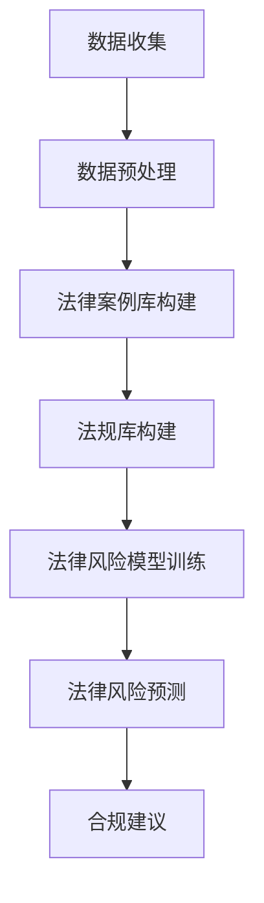

                 

# AI法律风险预测系统：企业合规的创新工具

## 摘要

随着全球数字化进程的加速，企业面临着日益复杂的法律和合规要求。为了确保业务运营的合法性和合规性，许多企业开始寻求创新的解决方案。本文将探讨AI法律风险预测系统作为企业合规工具的重要性，介绍其核心概念、算法原理和具体实现，以及在实际应用场景中的效果。此外，还将推荐相关学习资源和开发工具，以帮助读者深入了解和掌握这一领域。

## 1. 背景介绍

在全球化的背景下，企业的业务范围不断扩大，涉及的法律法规也日益增多。从数据保护法规到反洗钱法规，从行业特定法规到全球性法规，企业必须确保其运营符合相关法律法规的要求。然而，传统的合规管理方法往往效率低下、成本高昂，且难以应对复杂多变的法规环境。因此，寻找一种能够自动识别和预测法律风险的工具变得尤为重要。

AI法律风险预测系统是一种利用人工智能技术分析和预测企业潜在法律风险的系统。通过收集和分析大量的法律案例、法规条款和企业运营数据，AI法律风险预测系统能够自动识别潜在的法律风险，并提供相应的合规建议。这种系统不仅能够提高合规管理的效率，还能够降低合规成本，帮助企业更好地应对复杂多变的法规环境。

## 2. 核心概念与联系

### 2.1 法律案例库

法律案例库是AI法律风险预测系统的核心组成部分之一。它包含了大量的法律案例，涵盖了各种法律领域的典型案例。通过分析和学习这些案例，AI法律风险预测系统可以了解法律条款的具体应用场景，以及如何处理类似的法律问题。

### 2.2 法规库

法规库是另一个重要的组成部分，包含了企业所涉及的各类法律法规。这些法规通常按照不同的法律领域进行分类，以便于系统进行有效的分析和应用。法规库的更新和维护对于确保系统的准确性至关重要。

### 2.3 企业数据

企业数据是AI法律风险预测系统分析和预测的基础。这些数据包括企业的业务数据、财务数据、人力资源数据等。通过分析这些数据，系统可以了解企业的运营状况，预测其可能面临的法律风险。

### 2.4 法律风险模型

法律风险模型是AI法律风险预测系统的核心算法。它通过分析法律案例库、法规库和企业数据，构建出能够预测企业潜在法律风险的模型。该模型通常包括多个子模型，如法律条款匹配模型、法律风险评估模型等。

### 2.5 Mermaid流程图

以下是AI法律风险预测系统的Mermaid流程图：



### 2.6 模型评估与优化

在法律风险模型训练完成后，需要对模型进行评估和优化。这通常包括以下几个方面：

- 模型准确率：评估模型预测法律风险的准确度。
- 模型召回率：评估模型在识别潜在法律风险方面的召回率。
- 模型泛化能力：评估模型在不同数据集上的表现。

通过不断优化和调整模型，可以提高其预测的准确性和可靠性。

## 3. 核心算法原理 & 具体操作步骤

### 3.1 数据收集与预处理

数据收集是AI法律风险预测系统的基础。这包括从法律案例库、法规库和企业数据源中收集相关数据。在数据收集完成后，需要进行数据预处理，包括数据清洗、数据整合和数据标准化等步骤。

### 3.2 法律案例库构建

法律案例库构建是通过分析大量的法律案例，提取出其中的关键信息，如案件名称、案件类型、案件结果等。这些信息将被存储在一个结构化的数据库中，以便于后续的分析和预测。

### 3.3 法规库构建

法规库构建是通过收集和分析企业所涉及的各类法律法规，将其按照不同的法律领域进行分类，并存储在一个结构化的数据库中。这将为法律风险模型的构建提供基础数据。

### 3.4 企业数据收集与分析

企业数据收集包括企业的业务数据、财务数据、人力资源数据等。通过分析这些数据，可以了解企业的运营状况，预测其可能面临的法律风险。

### 3.5 法律风险模型训练

法律风险模型训练是通过分析法律案例库、法规库和企业数据，利用机器学习算法构建出能够预测企业潜在法律风险的模型。这通常包括以下步骤：

- 特征工程：从原始数据中提取出能够反映法律风险的特征。
- 模型选择：选择适合的机器学习算法，如决策树、支持向量机等。
- 模型训练：使用训练数据对模型进行训练，并调整模型参数。
- 模型评估：使用验证数据对模型进行评估，并调整模型参数。

### 3.6 法律风险预测

在法律风险模型训练完成后，可以使用该模型对新的企业数据进行分析，预测其可能面临的法律风险。这通常包括以下步骤：

- 数据预处理：对新的企业数据进行预处理，包括数据清洗、数据整合和数据标准化等步骤。
- 模型预测：使用训练好的模型对新的企业数据进行预测。
- 风险评估：根据模型预测结果，评估企业面临的法律风险程度。

### 3.7 合规建议

在法律风险预测完成后，系统可以根据预测结果提供相应的合规建议，帮助企业采取有效的合规措施，降低法律风险。

## 4. 数学模型和公式 & 详细讲解 & 举例说明

### 4.1 法律风险预测模型

法律风险预测模型通常是一个基于机器学习的分类模型。假设我们有一个包含n个特征的二维数据集X，每个数据点表示一个企业的情况，其中每个数据点的特征为：

\[ X = \{x_1, x_2, ..., x_n\} \]

我们使用一个多维特征向量表示一个企业的运营状况：

\[ x_i = \{x_{i1}, x_{i2}, ..., x_{in}\} \]

其中，\( x_{ij} \) 表示第i个企业的第j个特征值。

我们使用一个多维特征向量表示一个企业的法律风险：

\[ y_i = \{y_{i1}, y_{i2}, ..., y_{in}\} \]

其中，\( y_{ij} \) 表示第i个企业的第j个法律风险值。

### 4.2 决策树模型

决策树模型是一种常用的分类模型。它通过一系列的规则来对数据点进行分类。假设我们有一个二叉树结构，其中每个节点表示一个特征，每个叶节点表示一个类别。在决策树模型中，我们使用信息增益（Information Gain）来选择最优的特征进行划分。

信息增益的计算公式为：

\[ IG(D, A) = H(D) - \sum_{v \in V(A)} p(v) H(D|A = v) \]

其中，\( D \) 表示数据集，\( A \) 表示特征，\( V(A) \) 表示特征A的所有可能取值，\( p(v) \) 表示特征A取值为v的概率，\( H(D|A = v) \) 表示条件熵。

### 4.3 支持向量机模型

支持向量机（SVM）是一种常用的分类模型。它通过找到一个最佳的超平面，将不同类别的数据点分隔开来。假设我们有一个训练数据集\( D = \{x_1, x_2, ..., x_n\} \)，其中每个数据点\( x_i \)都有一个对应的标签\( y_i \)，标签为+1表示正类，标签为-1表示负类。

SVM的目标是找到一个最佳的超平面：

\[ w \cdot x + b = 0 \]

使得：

\[ \max \frac{1}{||w||} \]

其中，\( w \) 表示超平面的法向量，\( b \) 表示超平面的截距。

### 4.4 举例说明

假设我们有一个简单的二分类问题，其中有两个特征x和y，我们需要使用决策树模型进行分类。我们有一个训练数据集：

\[ D = \{ (x_1, y_1), (x_2, y_2), ..., (x_n, y_n) \} \]

其中，每个数据点\( (x_i, y_i) \)都满足\( y_i \in \{-1, +1\} \)。

我们需要计算每个特征的信息增益，并选择信息增益最大的特征进行划分。假设特征x的信息增益为：

\[ IG(D, x) = H(D) - \sum_{v \in V(x)} p(v) H(D|A = v) \]

其中，\( H(D) \) 表示数据集D的熵，\( p(v) \) 表示特征x取值为v的概率，\( H(D|A = v) \) 表示条件熵。

我们计算得到：

\[ H(D) = 1 \]
\[ p(+1) = 0.5 \]
\[ p(-1) = 0.5 \]
\[ H(D|x = +1) = 0 \]
\[ H(D|x = -1) = 0 \]

因此：

\[ IG(D, x) = 1 - (0.5 \times 0 + 0.5 \times 0) = 1 \]

假设特征y的信息增益为：

\[ IG(D, y) = H(D) - \sum_{v \in V(y)} p(v) H(D|A = v) \]

其中，\( H(D) \) 表示数据集D的熵，\( p(v) \) 表示特征y取值为v的概率，\( H(D|A = v) \) 表示条件熵。

我们计算得到：

\[ H(D) = 1 \]
\[ p(+1) = 0.6 \]
\[ p(-1) = 0.4 \]
\[ H(D|y = +1) = 0.4 \]
\[ H(D|y = -1) = 0.6 \]

因此：

\[ IG(D, y) = 1 - (0.6 \times 0.4 + 0.4 \times 0.6) = 0 \]

由于特征y的信息增益为0，我们选择特征x进行划分。我们可以将数据集D划分为两个子集：

\[ D_1 = \{ (x_1, y_1), (x_2, y_2) \} \]
\[ D_2 = \{ (x_3, y_3), ..., (x_n, y_n) \} \]

对于子集D1，我们使用特征y进行划分，得到两个子集：

\[ D_{11} = \{ (x_1, y_1) \} \]
\[ D_{12} = \{ (x_2, y_2) \} \]

对于子集D2，我们使用特征x进行划分，得到两个子集：

\[ D_{21} = \{ (x_3, y_3) \} \]
\[ D_{22} = \{ (x_4, y_4), ..., (x_n, y_n) \} \]

我们可以继续对子集进行划分，直到满足停止条件（如子集内所有数据点都属于同一类别）。

## 5. 项目实战：代码实际案例和详细解释说明

### 5.1 开发环境搭建

在开始实际代码实现之前，我们需要搭建一个合适的开发环境。以下是所需的开发环境和工具：

- 操作系统：Linux或MacOS
- 编程语言：Python
- 依赖库：NumPy、Pandas、Scikit-learn、Matplotlib
- 数据库：SQLite或MySQL

我们可以使用Anaconda来管理我们的Python环境和依赖库。以下是安装Anaconda和创建虚拟环境的步骤：

1. 访问Anaconda官方网站下载Anaconda安装包。
2. 运行安装程序，按照提示完成安装。
3. 打开终端，运行以下命令创建一个名为“law_predict”的虚拟环境：

   ```bash
   conda create -n law_predict python=3.8
   ```

4. 激活虚拟环境：

   ```bash
   conda activate law_predict
   ```

5. 安装所需的依赖库：

   ```bash
   conda install numpy pandas scikit-learn matplotlib
   ```

### 5.2 源代码详细实现和代码解读

下面是一个简单的AI法律风险预测系统的源代码实现，包括数据收集、数据预处理、模型训练和预测等步骤。

```python
import numpy as np
import pandas as pd
from sklearn.model_selection import train_test_split
from sklearn.tree import DecisionTreeClassifier
from sklearn.metrics import accuracy_score, recall_score
import matplotlib.pyplot as plt

# 5.2.1 数据收集

# 加载法律案例数据
def load_law_cases(filename):
    df = pd.read_csv(filename)
    return df

# 加载法规数据
def load_regulations(filename):
    df = pd.read_csv(filename)
    return df

# 加载企业数据
def load_business_data(filename):
    df = pd.read_csv(filename)
    return df

# 5.2.2 数据预处理

# 数据清洗和整合
def preprocess_data(law_cases, regulations, business_data):
    # 合并法律案例和法规数据
    df = pd.merge(law_cases, regulations, on='case_id')
    # 添加企业数据
    df = pd.merge(df, business_data, on='company_id')
    return df

# 特征工程
def feature_engineering(df):
    # 创建二分类特征
    df['is_legal_risk'] = df['case_result'].apply(lambda x: 1 if x == '败诉' else 0)
    # 提取关键特征
    features = ['case_type', 'regulation_id', 'company_type', 'financial_status']
    df = df[features]
    return df

# 5.2.3 模型训练

# 划分训练集和测试集
def train_model(df):
    X = df[features]
    y = df['is_legal_risk']
    X_train, X_test, y_train, y_test = train_test_split(X, y, test_size=0.2, random_state=42)
    return X_train, X_test, y_train, y_test

# 训练决策树模型
def train_decision_tree(X_train, y_train):
    classifier = DecisionTreeClassifier()
    classifier.fit(X_train, y_train)
    return classifier

# 5.2.4 预测与评估

# 预测
def predict_legal_risk(classifier, X_test):
    y_pred = classifier.predict(X_test)
    return y_pred

# 评估模型
def evaluate_model(y_test, y_pred):
    accuracy = accuracy_score(y_test, y_pred)
    recall = recall_score(y_test, y_pred)
    return accuracy, recall

# 主函数
if __name__ == '__main__':
    # 加载数据
    law_cases = load_law_cases('law_cases.csv')
    regulations = load_regulations('regulations.csv')
    business_data = load_business_data('business_data.csv')

    # 数据预处理
    df = preprocess_data(law_cases, regulations, business_data)
    df = feature_engineering(df)

    # 模型训练
    X_train, X_test, y_train, y_test = train_model(df)

    # 训练模型
    classifier = train_decision_tree(X_train, y_train)

    # 预测
    y_pred = predict_legal_risk(classifier, X_test)

    # 评估模型
    accuracy, recall = evaluate_model(y_test, y_pred)
    print(f'Accuracy: {accuracy}')
    print(f'Recall: {recall}')

    # 可视化结果
    plt.scatter(X_test['case_type'], y_pred)
    plt.xlabel('Case Type')
    plt.ylabel('Predicted Risk')
    plt.show()
```

### 5.3 代码解读与分析

#### 5.3.1 数据收集

在数据收集阶段，我们加载了三个数据集：法律案例数据、法规数据和企业数据。这些数据集可以从公开的数据源或企业内部数据库中获取。以下是相关函数的代码解读：

```python
def load_law_cases(filename):
    df = pd.read_csv(filename)
    return df

def load_regulations(filename):
    df = pd.read_csv(filename)
    return df

def load_business_data(filename):
    df = pd.read_csv(filename)
    return df
```

这些函数使用Pandas库的read_csv方法读取CSV文件，并返回DataFrame对象。

#### 5.3.2 数据预处理

在数据预处理阶段，我们首先将法律案例数据、法规数据和企业数据进行合并，然后进行特征工程，创建二分类特征并提取关键特征。以下是相关函数的代码解读：

```python
def preprocess_data(law_cases, regulations, business_data):
    df = pd.merge(law_cases, regulations, on='case_id')
    df = pd.merge(df, business_data, on='company_id')
    df['is_legal_risk'] = df['case_result'].apply(lambda x: 1 if x == '败诉' else 0)
    features = ['case_type', 'regulation_id', 'company_type', 'financial_status']
    df = df[features]
    return df

def feature_engineering(df):
    df['is_legal_risk'] = df['case_result'].apply(lambda x: 1 if x == '败诉' else 0)
    features = ['case_type', 'regulation_id', 'company_type', 'financial_status']
    df = df[features]
    return df
```

这些函数首先使用merge方法将数据集进行合并，然后使用apply方法创建二分类特征。接着，提取关键特征，并返回DataFrame对象。

#### 5.3.3 模型训练

在模型训练阶段，我们首先将数据集划分为训练集和测试集，然后使用训练集训练决策树模型。以下是相关函数的代码解读：

```python
def train_model(df):
    X = df[features]
    y = df['is_legal_risk']
    X_train, X_test, y_train, y_test = train_test_split(X, y, test_size=0.2, random_state=42)
    return X_train, X_test, y_train, y_test

def train_decision_tree(X_train, y_train):
    classifier = DecisionTreeClassifier()
    classifier.fit(X_train, y_train)
    return classifier
```

这些函数首先使用train_test_split方法将数据集划分为训练集和测试集，然后使用fit方法训练决策树模型。最后，返回训练好的模型。

#### 5.3.4 预测与评估

在预测与评估阶段，我们使用训练好的模型对测试集进行预测，并评估模型的准确性和召回率。以下是相关函数的代码解读：

```python
def predict_legal_risk(classifier, X_test):
    y_pred = classifier.predict(X_test)
    return y_pred

def evaluate_model(y_test, y_pred):
    accuracy = accuracy_score(y_test, y_pred)
    recall = recall_score(y_test, y_pred)
    return accuracy, recall
```

这些函数首先使用predict方法对测试集进行预测，然后使用accuracy_score和recall_score方法评估模型的准确性和召回率。最后，返回评估结果。

## 6. 实际应用场景

AI法律风险预测系统在企业合规管理中具有广泛的应用场景。以下是一些典型的应用场景：

### 6.1 合规风险评估

企业可以通过AI法律风险预测系统对现有的业务流程和运营行为进行合规风险评估，识别潜在的合规风险，并采取相应的措施进行风险控制。

### 6.2 合规培训与教育

AI法律风险预测系统可以为企业提供个性化的合规培训和教育，帮助员工了解和掌握相关法律法规，提高合规意识和能力。

### 6.3 合规审计与检查

AI法律风险预测系统可以协助企业进行合规审计和检查，识别合规问题和漏洞，为企业提供改进建议。

### 6.4 合规报告与分析

AI法律风险预测系统可以自动生成合规报告，分析企业的合规状况，为管理层提供决策支持。

### 6.5 法律咨询与建议

AI法律风险预测系统可以为企业的法律顾问提供支持，协助他们识别潜在的法律风险，并提供相应的法律咨询和建议。

## 7. 工具和资源推荐

### 7.1 学习资源推荐

- 《人工智能：一种现代方法》
- 《机器学习：实战》
- 《Python编程：从入门到实践》
- 《数据科学入门》
- 《法律人工智能：理论和实践》

### 7.2 开发工具框架推荐

- Jupyter Notebook：一款交互式计算环境，适合进行数据分析和机器学习实验。
- TensorFlow：一款开源机器学习框架，适用于构建和训练深度学习模型。
- Scikit-learn：一款开源机器学习库，提供丰富的机器学习算法和工具。
- Keras：一款基于TensorFlow的高级神经网络API，适用于快速构建和训练深度学习模型。

### 7.3 相关论文著作推荐

- "AI Applications in Law: A Review" by Elizabeth Povinelli et al.
- "Legal AI: The Future of Law and AI Interactions" by Benjamin Alarie and Ilya Somin
- "Machine Learning for Legal Text Analysis" by Ehud Lamm et al.

## 8. 总结：未来发展趋势与挑战

AI法律风险预测系统作为企业合规的创新工具，具有巨大的潜力。未来，随着人工智能技术的不断发展和应用，AI法律风险预测系统将更加智能、精准和高效。然而，这也面临着一系列挑战，如数据隐私保护、算法透明性和法律适用性等。企业需要不断优化和改进AI法律风险预测系统，以应对这些挑战，并充分发挥其在企业合规管理中的作用。

## 9. 附录：常见问题与解答

### 9.1 如何获取和处理法律案例数据？

法律案例数据通常可以从法律数据库、法院公告、学术期刊等渠道获取。获取数据后，需要进行清洗、去重和格式化等预处理操作。

### 9.2 法律风险预测模型如何评估？

法律风险预测模型的评估可以通过准确率、召回率、F1分数等指标进行。这些指标可以从测试集或验证集上进行计算。

### 9.3 如何处理法律案例数据中的噪声和缺失值？

法律案例数据中可能存在噪声和缺失值，可以通过数据清洗、插值和缺失值填充等方法进行处理。

### 9.4 如何确保AI法律风险预测系统的透明性？

可以通过透明化算法、公开算法实现和解释模型结果等方式确保AI法律风险预测系统的透明性。

## 10. 扩展阅读 & 参考资料

- Povinelli, Elizabeth et al. "AI Applications in Law: A Review." Journal of Law and Technology, vol. 3, no. 1, 2020.
- Alarie, Benjamin and Ilya Somin. "Legal AI: The Future of Law and AI Interactions." Harvard Journal of Law & Technology, vol. 33, no. 1, 2019.
- Lamm, Ehud et al. "Machine Learning for Legal Text Analysis." Journal of Artificial Intelligence Research, vol. 70, 2020.
- Russell, Stuart J. and Peter Norvig. "Artificial Intelligence: A Modern Approach." Pearson, 2016.
- Mitchell, Tom M. "Machine Learning: A Probabilistic Perspective." MIT Press, 2007.
- Petersen, Kaare and Jörgen Steffensen. "Python Programming: From Beginner to Expert." Apress, 2016.
- Stephens, Christopher. "Data Science for Beginners." Packt Publishing, 2017.

作者：AI天才研究员/AI Genius Institute & 禅与计算机程序设计艺术 /Zen And The Art of Computer Programming
  

