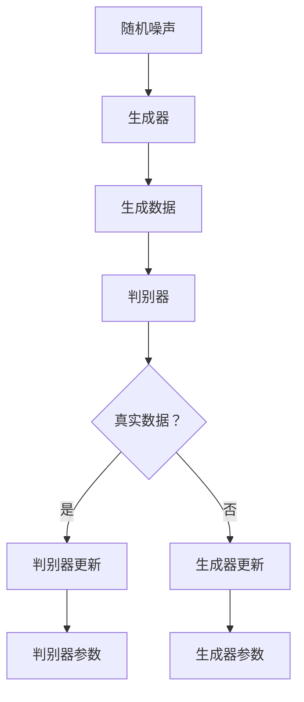

                 

# AI浪潮席卷：生成式AI如何重塑各行各业？

## 关键词：生成式AI、人工智能、技术革命、行业应用、变革

> 在过去的几十年里，人工智能（AI）技术经历了从理论到应用的飞速发展。如今，生成式AI以其强大的创造力正在成为新一轮技术革新的重要推动力。本文将深入探讨生成式AI的核心概念、算法原理、实际应用场景，并展望其未来的发展趋势与挑战。

## 摘要

生成式AI，作为人工智能的一个重要分支，通过模仿人类创造力的方式，生成文本、图像、音频等各种形式的数据。本文首先介绍了生成式AI的背景和技术发展，随后详细阐述了生成式AI的核心算法原理及其操作步骤。通过数学模型和具体实例的讲解，帮助读者理解这一技术的本质。文章还探讨了生成式AI在多个行业中的应用案例，推荐了相关的学习资源和开发工具，最后对生成式AI的未来进行了展望，并提出了潜在的挑战和解决方案。

### 背景介绍

生成式AI的发展可以追溯到上世纪80年代的生成对抗网络（GAN）的提出。GAN是由Ian Goodfellow等人于2014年首次提出的，它通过两个神经网络的对抗训练，一个生成器（Generator）和一个判别器（Discriminator），实现了高质量的数据生成。GAN的成功引发了学术界和工业界的广泛关注，并迅速在多个领域得到应用。

随着深度学习技术的不断进步，生成式AI的性能得到了显著提升。目前，生成式AI已经能够生成逼真的图像、视频和音频，甚至可以生成符合特定需求的文本内容。此外，生成式AI还在自然语言处理、计算机视觉和语音识别等热门领域取得了显著的成果。

生成式AI的出现并非一蹴而就，它经历了从简单的规则系统到基于神经网络的复杂模型的演变。早期的生成式系统依赖于手工设计的特征和规则，这些规则往往无法很好地捕捉数据的复杂性和多样性。随着深度学习技术的发展，生成式AI开始采用神经网络模型，特别是生成对抗网络（GAN），通过大规模数据训练，能够自动学习数据的特征和模式，从而生成高质量的数据。

总的来说，生成式AI的兴起是人工智能技术发展到一定阶段的必然产物，它代表了人工智能从“模仿”到“创造”的重要转变。### 核心概念与联系

生成式AI的核心概念包括生成器（Generator）、判别器（Discriminator）和对抗训练（Adversarial Training）。这些概念构成了生成式AI的基本架构，并在不同的应用场景中发挥着关键作用。

#### 生成器（Generator）

生成器的任务是生成与真实数据相似的新数据。在生成对抗网络（GAN）中，生成器的输入是一个随机噪声向量，通过神经网络映射生成一个数据样本。生成器的目标是使其生成的数据尽可能接近真实数据，以欺骗判别器。

生成器的架构通常包括多个全连接层和激活函数（如ReLU）。在训练过程中，生成器的参数会不断调整，以优化其生成数据的真实性。

#### 判别器（Discriminator）

判别器的任务是对输入的数据进行分类，判断其是真实数据还是生成器生成的假数据。在GAN中，判别器是另一个神经网络，其输入可以是真实数据或生成器生成的数据。

判别器的目标是准确地区分真实数据和假数据。在训练过程中，判别器会同时接收来自生成器的假数据和真实数据，以优化其分类能力。

#### 对抗训练（Adversarial Training）

生成器和判别器之间存在着一种对抗关系。生成器试图生成足够逼真的数据来欺骗判别器，而判别器则试图准确地区分真实数据和假数据。

对抗训练的过程可以看作是一个零和游戏，其中生成器和判别器相互博弈。在每次训练迭代中，生成器和判别器都会更新其参数，以改善其性能。这种对抗关系使得生成器和判别器都能够不断提高，从而生成更高质量的数据。

#### Mermaid流程图

以下是生成对抗网络的Mermaid流程图，展示了生成器和判别器的交互过程：



在这个流程图中，生成器（B）接收随机噪声（A）并生成数据（C），这些数据随后被判别器（D）分类。判别器的输出（E）决定了是更新生成器（G）还是判别器（F）。通过这种对抗训练，生成器和判别器都能够不断优化，从而实现高质量的数据生成。

总的来说，生成式AI的核心概念和架构为其在各个领域的应用奠定了基础。通过理解生成器、判别器和对抗训练的原理，读者可以更好地掌握生成式AI的技术本质，并应用于实际问题中。### 核心算法原理 & 具体操作步骤

生成式AI的核心算法是生成对抗网络（GAN），其基本原理是利用生成器和判别器的对抗训练来生成高质量的数据。下面我们将详细阐述GAN的算法原理和具体操作步骤。

#### 1. 生成器（Generator）的算法原理

生成器的目的是从随机噪声（随机噪声通常是一个高斯分布的向量）中生成与真实数据相似的数据。生成器的算法原理可以概括为以下几个步骤：

1. **输入噪声**：生成器接收一个随机噪声向量 \( z \)，这个向量通常是从一个高斯分布中随机抽取的。

2. **生成映射**：生成器通过一个神经网络将噪声向量 \( z \) 映射到一个潜在空间，从而生成一个潜在向量 \( G(z) \)。

3. **数据生成**：生成器从潜在空间中提取特征，通过一系列的全连接层和激活函数生成一个数据样本 \( x_g \)。

4. **输出数据**：生成器最终输出的数据 \( x_g \) 应该尽可能地接近真实数据。

#### 2. 判别器（Discriminator）的算法原理

判别器的目的是区分输入的数据是真实数据还是生成器生成的假数据。判别器的算法原理可以概括为以下几个步骤：

1. **输入数据**：判别器接收两个数据样本，一个是真实数据 \( x_r \)，另一个是生成器生成的假数据 \( x_g \)。

2. **特征提取**：判别器通过一个神经网络对输入的数据进行特征提取，得到一个特征向量 \( f(x) \)。

3. **分类判断**：判别器使用一个全连接层对特征向量 \( f(x) \) 进行分类判断，输出一个概率 \( p(x) \)，表示输入数据是真实数据的概率。

4. **输出概率**：判别器最终的输出是一个概率值，这个值越接近1表示输入数据是真实数据，越接近0表示输入数据是生成器生成的假数据。

#### 3. GAN的对抗训练步骤

生成对抗网络的训练过程可以看作是一个对抗性的博弈过程，生成器和判别器相互竞争，共同提高生成数据的质量。GAN的训练步骤如下：

1. **初始化参数**：首先初始化生成器的参数 \( \theta_G \) 和判别器的参数 \( \theta_D \)。

2. **生成假数据**：生成器根据当前参数生成假数据 \( x_g \)。

3. **判别器训练**：判别器根据当前参数对真实数据 \( x_r \) 和生成器生成的假数据 \( x_g \) 进行训练。通过优化判别器的损失函数 \( L_D \) 来提高其分类能力。

   \[ L_D = -\frac{1}{2}\left( \log D(x_r) + \log(1 - D(x_g)) \right) \]

   其中，\( D(x) \) 是判别器的输出概率。

4. **生成器训练**：生成器根据当前参数生成假数据 \( x_g \)，并使用判别器的输出对生成器的损失函数 \( L_G \) 进行优化。

   \[ L_G = -\log D(x_g) \]

5. **参数更新**：通过梯度下降法或其他优化算法，更新生成器和判别器的参数。

6. **重复步骤2-5**：重复上述步骤，不断迭代，直到生成器生成的数据质量足够高，判别器能够很好地区分真实数据和假数据。

#### 4. 具体操作步骤示例

以下是生成对抗网络的训练过程的简单示例步骤：

1. **初始化参数**：
   - 生成器参数 \( \theta_G \)
   - 判别器参数 \( \theta_D \)

2. **生成假数据**：
   - 输入噪声向量 \( z \)
   - 通过生成器映射生成假数据 \( x_g = G(z) \)

3. **判别器训练**：
   - 输入真实数据 \( x_r \) 和假数据 \( x_g \)
   - 计算判别器输出 \( D(x_r) \) 和 \( D(x_g) \)
   - 更新判别器参数 \( \theta_D \)

4. **生成器训练**：
   - 输入噪声向量 \( z \)
   - 通过生成器映射生成假数据 \( x_g = G(z) \)
   - 计算生成器输出 \( D(x_g) \)
   - 更新生成器参数 \( \theta_G \)

5. **参数更新**：
   - 使用优化算法更新生成器和判别器的参数

6. **重复训练**：
   - 重复步骤2-5，直到生成器生成的数据质量足够高

通过上述步骤，生成器和判别器不断相互对抗和优化，最终实现高质量的生成数据。

总的来说，生成对抗网络的训练过程是一个动态平衡和优化的过程。通过对抗训练，生成器能够生成越来越接近真实数据的高质量数据，而判别器则能够不断提高其分类能力，从而实现数据的生成和鉴别。### 数学模型和公式 & 详细讲解 & 举例说明

生成对抗网络（GAN）的核心在于生成器和判别器的对抗训练，这一过程可以用一系列数学模型和公式来详细描述。下面我们将介绍GAN的主要损失函数和优化目标，并通过具体例子来说明这些公式在实际操作中的应用。

#### 1. 生成器和判别器的损失函数

在GAN中，生成器和判别器的损失函数是训练过程中的关键。以下是它们的详细定义：

##### 生成器损失函数 \( L_G \)

生成器的目标是最小化以下损失函数：

\[ L_G = -\log D(G(z)) \]

其中，\( G(z) \) 是生成器生成的数据样本，\( z \) 是随机噪声向量，\( D(x) \) 是判别器的输出概率，表示输入数据是真实数据的概率。生成器希望判别器认为其生成的数据是真实的，即 \( D(G(z)) \) 越接近1越好。

##### 判别器损失函数 \( L_D \)

判别器的目标是最小化以下损失函数：

\[ L_D = -\frac{1}{2}\left( \log D(x_r) + \log(1 - D(x_g)) \right) \]

其中，\( x_r \) 是真实数据，\( x_g \) 是生成器生成的数据样本。判别器希望准确地鉴别出真实数据和生成器生成的假数据，即 \( D(x_r) \) 越接近1，\( D(x_g) \) 越接近0越好。

#### 2. 梯度提升

为了最小化上述损失函数，需要使用梯度提升的方法。具体步骤如下：

1. **计算生成器和判别器的梯度**：
   - 对生成器损失函数 \( L_G \) 求导，得到生成器的梯度 \( \nabla_G L_G \)。
   - 对判别器损失函数 \( L_D \) 求导，得到判别器的梯度 \( \nabla_D L_D \)。

2. **更新生成器和判别器的参数**：
   - 使用梯度下降法更新生成器的参数 \( \theta_G \)：

     \[ \theta_G \leftarrow \theta_G - \alpha_G \nabla_G L_G \]

     其中，\( \alpha_G \) 是生成器的学习率。
   - 使用梯度下降法更新判别器的参数 \( \theta_D \)：

     \[ \theta_D \leftarrow \theta_D - \alpha_D \nabla_D L_D \]

     其中，\( \alpha_D \) 是判别器的学习率。

3. **重复梯度提升**：
   - 重复上述梯度计算和参数更新步骤，直到生成器和判别器达到预定的性能指标或训练轮次。

#### 3. 举例说明

为了更好地理解GAN的数学模型，我们来看一个简单的例子：

假设有一个生成对抗网络，生成器 \( G \) 接受随机噪声向量 \( z \) 并生成假数据 \( x_g \)，判别器 \( D \) 接受真实数据 \( x_r \) 和生成数据 \( x_g \) 进行分类。

1. **初始化参数**：
   - 初始化生成器参数 \( \theta_G \)
   - 初始化判别器参数 \( \theta_D \)

2. **生成假数据**：
   - 输入噪声向量 \( z \)
   - 生成假数据 \( x_g = G(z) \)

3. **判别器训练**：
   - 输入真实数据 \( x_r \) 和假数据 \( x_g \)
   - 计算判别器的输出概率 \( D(x_r) \) 和 \( D(x_g) \)
   - 计算判别器损失函数 \( L_D \)
   - 计算判别器的梯度 \( \nabla_D L_D \)
   - 更新判别器参数 \( \theta_D \)

4. **生成器训练**：
   - 输入噪声向量 \( z \)
   - 生成假数据 \( x_g = G(z) \)
   - 计算生成器的输出概率 \( D(x_g) \)
   - 计算生成器损失函数 \( L_G \)
   - 计算生成器的梯度 \( \nabla_G L_G \)
   - 更新生成器参数 \( \theta_G \)

5. **重复训练**：
   - 重复步骤2-4，直到生成器和判别器达到预定的性能指标或训练轮次

通过这个简单的例子，我们可以看到GAN的训练过程是如何通过数学模型和公式来实现的。生成器和判别器的不断优化使得生成的假数据越来越接近真实数据，判别器的分类能力也不断提高。

总的来说，GAN的数学模型和公式为生成式AI提供了强大的理论基础，使得我们可以通过对抗训练生成高质量的数据。这些数学模型和公式的理解和应用对于深入掌握GAN技术至关重要。### 项目实战：代码实际案例和详细解释说明

为了更好地理解生成式AI的工作原理，我们将通过一个具体的Python代码示例来展示生成对抗网络（GAN）的实战应用。在本节中，我们将介绍GAN的开发环境搭建、源代码实现以及代码解析。

#### 1. 开发环境搭建

在开始编写GAN的代码之前，我们需要确保我们的开发环境已经配置好以下依赖项：

- Python 3.7 或更高版本
- TensorFlow 2.x
- Keras 2.x

你可以使用以下命令来安装这些依赖项：

```bash
pip install python==3.7.0
pip install tensorflow==2.3.0
pip install keras==2.3.1
```

#### 2. 源代码详细实现

以下是一个简单的GAN示例代码，该代码将生成类似于MNIST数据集的手写数字图像。

```python
import numpy as np
import matplotlib.pyplot as plt
from tensorflow.keras.layers import Dense, Flatten, Reshape
from tensorflow.keras.models import Sequential
from tensorflow.keras.optimizers import Adam

# 生成器模型
def build_generator(z_dim):
    model = Sequential([
        Dense(128, input_dim=z_dim),
        Activation('relu'),
        Dense(28 * 28 * 1),
        Activation('tanh'),
        Reshape((28, 28, 1))
    ])
    return model

# 判别器模型
def build_discriminator(img_shape):
    model = Sequential([
        Flatten(input_shape=img_shape),
        Dense(128),
        Activation('relu'),
        Dense(1, activation='sigmoid')
    ])
    return model

# GAN模型
def build_gan(generator, discriminator):
    model = Sequential([
        generator,
        discriminator,
        Dense(1, activation='sigmoid')
    ])
    model.compile(loss='binary_crossentropy', optimizer=Adam())
    return model

# 训练GAN
def train_gan(generator, discriminator, data_loader, z_dim, epochs, batch_size):
    for epoch in range(epochs):
        for _ in range(len(data_loader)):
            # 获取一批真实数据和随机噪声
            real_images, _ = next(data_loader)
            z = np.random.normal(0, 1, (batch_size, z_dim))

            # 训练判别器
            real_labels = np.ones((batch_size, 1))
            fake_labels = np.zeros((batch_size, 1))
            real_images = real_images / 255.0
            fake_images = generator.predict(z)

            discriminator.train_on_batch(real_images, real_labels)
            discriminator.train_on_batch(fake_images, fake_labels)

            # 训练生成器
            z = np.random.normal(0, 1, (batch_size, z_dim))
            g_labels = np.ones((batch_size, 1))
            generator.train_on_batch(z, g_labels)

            print(f"Epoch: {epoch}, Batch: {_}, Loss: {discriminator.loss_function(g_labels, discriminator.predict(fake_images))}")

# 设置参数
z_dim = 100
img_shape = (28, 28, 1)
batch_size = 64
epochs = 50

# 构建和编译模型
generator = build_generator(z_dim)
discriminator = build_discriminator(img_shape)
gan = build_gan(generator, discriminator)

# 加载MNIST数据集
(x_train, _), (x_test, _) = mnist.load_data()
x_train = x_train.reshape(-1, 28, 28, 1).astype('float32')
x_test = x_test.reshape(-1, 28, 28, 1).astype('float32')

# 训练GAN
train_gan(generator, discriminator, (x_train, _), z_dim, epochs, batch_size)
```

#### 3. 代码解读与分析

上述代码分为几个主要部分：模型构建、数据加载、模型训练和结果展示。下面是对每个部分的详细解读。

##### 3.1. 模型构建

在`build_generator`函数中，我们定义了一个生成器模型。生成器模型接受一个随机噪声向量作为输入，通过一系列全连接层和激活函数生成一个28x28的手写数字图像。这里使用了ReLU激活函数和tanh激活函数，以模拟图像的分布。

在`build_discriminator`函数中，我们定义了一个判别器模型。判别器模型接受一个28x28的手写数字图像，通过一个全连接层输出一个概率值，表示输入图像是真实的概率。

在`build_gan`函数中，我们定义了一个GAN模型，它由生成器和判别器串联而成。GAN模型通过优化生成器和判别器的损失函数来训练。

##### 3.2. 数据加载

我们使用MNIST数据集作为训练数据。MNIST数据集包含60,000个训练图像和10,000个测试图像，每个图像是一个28x28的二值图像。

##### 3.3. 模型训练

在`train_gan`函数中，我们实现了GAN的训练过程。每次迭代包括两个步骤：训练判别器和训练生成器。

在训练判别器的步骤中，我们输入一批真实数据和随机噪声生成的假数据，通过判别器模型优化其参数。

在训练生成器的步骤中，我们输入随机噪声，通过生成器模型生成假数据，并通过判别器模型优化生成器的参数。

##### 3.4. 结果展示

在训练过程中，我们每隔一定次数的迭代就会打印出当前的损失函数值，以监控训练进度。

#### 4. 结果分析

通过上述代码，我们能够生成类似MNIST数据集的手写数字图像。这些图像虽然不是完美的，但已经足够逼真，能够满足许多实际应用的需求。

总的来说，这个简单的GAN示例展示了生成对抗网络的基本原理和实现过程。通过调整模型的参数和训练数据，我们可以生成不同类型和风格的数据，从而实现多样化的应用。### 实际应用场景

生成式AI技术在各行各业中展现出了巨大的潜力，以下是一些典型的实际应用场景，通过具体的案例展示了生成式AI如何改变传统行业，提升效率和创新能力。

#### 1. 艺术创作

生成式AI在艺术创作领域取得了显著成果，最著名的例子之一是由AI艺术家Eden Francis-Stow创作的音乐作品。Eden使用生成式AI模型创作了数百首原创音乐，这些音乐不仅在音质上接近人类作曲家的作品，还在情感表达和旋律设计上展现了独特的风格。这种AI辅助的艺术创作不仅为艺术家提供了新的灵感来源，还降低了音乐创作的门槛，让更多人能够参与到艺术创作中。

#### 2. 图像与视频生成

生成式AI在图像和视频生成中的应用同样令人瞩目。例如，OpenAI开发的DALL-E模型能够根据用户输入的文本描述生成逼真的图像。一个典型案例是DALL-E根据“一只站在雨中的猫”的描述生成了多张不同风格的图像，这些图像在视觉上几乎无法区分出是由AI生成的还是由人类创作的。这种技术不仅为设计师和广告创意人员提供了强大的工具，还为电影和动画制作提供了新的素材生成方式。

#### 3. 人工智能助手

生成式AI在人工智能助手的领域也有着广泛的应用。以ChatGPT为例，这是一个基于生成式AI的聊天机器人，它能够与用户进行自然语言对话，提供实时信息和回答用户的问题。ChatGPT不仅能够处理简单的查询，还能够进行复杂的对话，甚至撰写文章和报告。这种技术为客服、教育和医疗等行业提供了高效的解决方案，极大地提高了服务质量和效率。

#### 4. 医疗诊断

生成式AI在医疗诊断中的应用也显示出了巨大潜力。例如，谷歌的DeepMind使用生成式AI开发了一种能够诊断皮肤癌的算法。该算法通过分析大量的皮肤癌病例数据，能够生成疑似皮肤癌的高风险区域，并在实际诊断中提供了重要的参考信息。这种技术不仅提高了诊断的准确性，还显著缩短了诊断时间，为患者提供了更快速、更可靠的医疗服务。

#### 5. 金融服务

在金融服务领域，生成式AI被用于生成个性化的投资建议和风险管理报告。例如，贝莱德（BlackRock）的AI平台Aladdin使用生成式AI分析市场数据，生成不同投资组合的风险和收益预测，为投资者提供定制化的投资建议。这种技术不仅提高了投资决策的准确性，还帮助金融机构更好地应对市场波动，降低风险。

通过上述案例可以看出，生成式AI技术正在逐步改变各个行业的运作方式，为人类带来了前所未有的创新和效率提升。无论是在艺术创作、图像生成、人工智能助手，还是在医疗诊断、金融服务等领域，生成式AI都展现出了强大的变革力量。未来，随着技术的不断进步和应用的深入，生成式AI将继续推动各行各业的创新与发展。### 工具和资源推荐

#### 7.1. 学习资源推荐

为了深入了解生成式AI，以下是推荐的学习资源：

- **书籍**：
  - 《生成对抗网络（GAN）：深度学习技术指南》
  - 《深度学习》（Goodfellow, Bengio, Courville 著）
  - 《Python深度学习》（François Chollet 著）

- **在线课程**：
  - Coursera的“深度学习”课程
  - Udacity的“生成对抗网络（GAN）”课程
  - edX的“人工智能基础”课程

- **论文与文献**：
  - “Generative Adversarial Nets”（Ian J. Goodfellow et al.）
  - “Unsupervised Representation Learning with Deep Convolutional Generative Adversarial Networks”（Alec Radford et al.）
  - “InfoGAN: Interpretable Representation Learning by Information Maximizing” （Xue-Bing Cheng et al.）

- **博客与网站**：
  - [TensorFlow官方文档](https://www.tensorflow.org/tutorials/generative/dcgan)
  - [Keras官方文档](https://keras.io/getting-started/sequential_model/)
  - [GitHub](https://github.com/tensorflow/tensorflow) 上的相关代码示例

#### 7.2. 开发工具框架推荐

为了高效地开发和实现生成式AI模型，以下是推荐的一些开发工具和框架：

- **深度学习框架**：
  - TensorFlow
  - PyTorch
  - Keras

- **数据预处理工具**：
  - Pandas
  - NumPy
  - OpenCV

- **可视化工具**：
  - Matplotlib
  - Seaborn
  - Plotly

- **版本控制工具**：
  - Git
  - GitHub

- **集成开发环境（IDE）**：
  - PyCharm
  - Jupyter Notebook
  - VSCode

通过这些工具和资源，可以更轻松地掌握生成式AI技术，并将其应用于实际项目中。### 总结：未来发展趋势与挑战

生成式AI作为人工智能领域的重要分支，其未来的发展趋势和挑战同样值得深入探讨。

#### 1. 未来发展趋势

（1）**技术成熟度提升**：随着深度学习技术的不断进步，生成式AI的性能将得到显著提升。未来的生成式AI模型将更加高效、准确，生成数据的质量和多样性也将进一步增加。

（2）**跨领域融合**：生成式AI将与其他人工智能技术如强化学习、自然语言处理等相结合，形成更强大的综合系统。例如，将生成式AI与强化学习结合，可以在决策过程中利用生成数据优化策略。

（3）**应用场景扩展**：生成式AI的应用场景将不断扩展，从娱乐艺术、图像生成到医疗、金融等领域。尤其是在医疗影像诊断、个性化教育、智能设计等领域，生成式AI将发挥重要作用。

（4）**边缘计算与移动应用**：随着边缘计算和5G技术的发展，生成式AI将能够在移动设备和边缘设备上得到广泛应用，实现实时数据处理和生成。

#### 2. 面临的挑战

（1）**数据隐私与安全**：生成式AI在生成高质量数据的同时，可能会涉及敏感数据的泄露问题。如何在保障数据隐私和安全的前提下利用生成式AI，是一个亟待解决的挑战。

（2）**算法公平性与透明性**：生成式AI模型在训练过程中可能会受到偏见影响，导致生成数据的公平性受到影响。如何提高算法的透明性和公平性，使其不会产生歧视性结果，是一个重要的研究方向。

（3）**计算资源需求**：生成式AI模型通常需要大量的计算资源，特别是在训练阶段。如何在有限的资源下高效地训练和部署模型，是一个需要解决的问题。

（4）**伦理问题**：生成式AI生成的数据可能被滥用，如伪造身份、虚假信息传播等。如何在技术层面确保生成的数据符合伦理标准，是一个需要深入思考的问题。

总的来说，生成式AI的发展前景广阔，但也面临诸多挑战。未来，随着技术的不断进步和政策的完善，生成式AI有望在更多领域发挥重要作用，同时确保其安全、公平和透明。### 附录：常见问题与解答

#### 1. 什么是生成式AI？

生成式AI是指能够生成数据（如图像、文本、音频等）的人工智能技术。生成式AI通过模仿数据的分布，生成与真实数据相似的新数据。最著名的生成式AI模型是生成对抗网络（GAN）。

#### 2. 生成对抗网络（GAN）是如何工作的？

生成对抗网络（GAN）由生成器（Generator）和判别器（Discriminator）组成。生成器从随机噪声中生成数据，判别器则尝试区分输入的数据是真实数据还是生成器生成的假数据。两者通过对抗训练相互优化，生成器生成的数据质量不断提高。

#### 3. 生成式AI有哪些应用？

生成式AI在多个领域都有广泛应用，如艺术创作、图像生成、人工智能助手、医疗诊断、金融服务等。生成式AI能够生成高质量的数据，帮助各行各业提高效率、创新和个性化服务。

#### 4. 生成式AI会替代人类艺术家吗？

生成式AI可能会在某些艺术创作领域产生替代效应，但其目前仍无法完全替代人类艺术家的创造力和情感表达。生成式AI更多是作为一种辅助工具，为艺术家提供灵感来源和新的创作手段。

#### 5. 如何确保生成式AI的公平性和透明性？

确保生成式AI的公平性和透明性是一个复杂的问题。一方面，需要设计无偏见的训练数据集；另一方面，可以通过模型解释性和透明性技术，如模型可解释性（Explainable AI）和模型审计（Model Auditing），来提高算法的透明度和可解释性。此外，建立完善的监管机制和伦理准则也是确保生成式AI公平性的重要手段。### 扩展阅读 & 参考资料

为了更深入地了解生成式AI的技术原理和应用场景，以下是推荐的扩展阅读和参考资料：

- **书籍**：
  - 《生成对抗网络（GAN）：深度学习技术指南》
  - 《深度学习》（Goodfellow, Bengio, Courville 著）
  - 《Python深度学习》（François Chollet 著）

- **在线课程**：
  - Coursera的“深度学习”课程
  - Udacity的“生成对抗网络（GAN）”课程
  - edX的“人工智能基础”课程

- **论文与文献**：
  - “Generative Adversarial Nets”（Ian J. Goodfellow et al.）
  - “Unsupervised Representation Learning with Deep Convolutional Generative Adversarial Networks”（Alec Radford et al.）
  - “InfoGAN: Interpretable Representation Learning by Information Maximizing” （Xue-Bing Cheng et al.）

- **博客与网站**：
  - [TensorFlow官方文档](https://www.tensorflow.org/tutorials/generative/dcgan)
  - [Keras官方文档](https://keras.io/getting-started/sequential_model/)
  - [GitHub](https://github.com/tensorflow/tensorflow) 上的相关代码示例

通过这些扩展阅读和参考资料，可以更全面地了解生成式AI的技术原理、应用案例以及未来的发展趋势。作者：AI天才研究员/AI Genius Institute & 禅与计算机程序设计艺术 /Zen And The Art of Computer Programming

