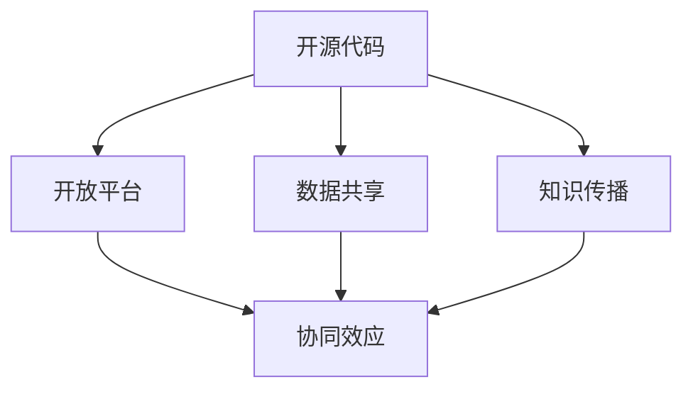
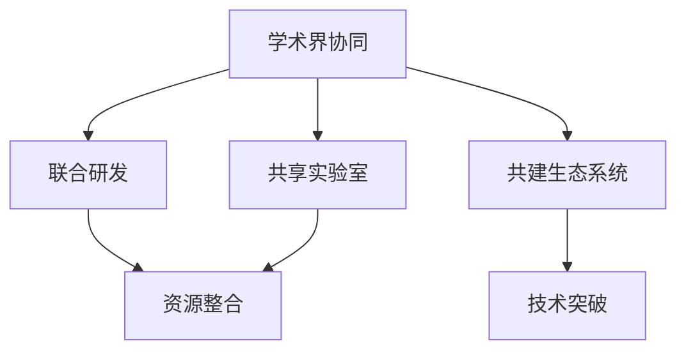
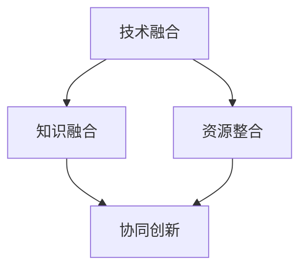
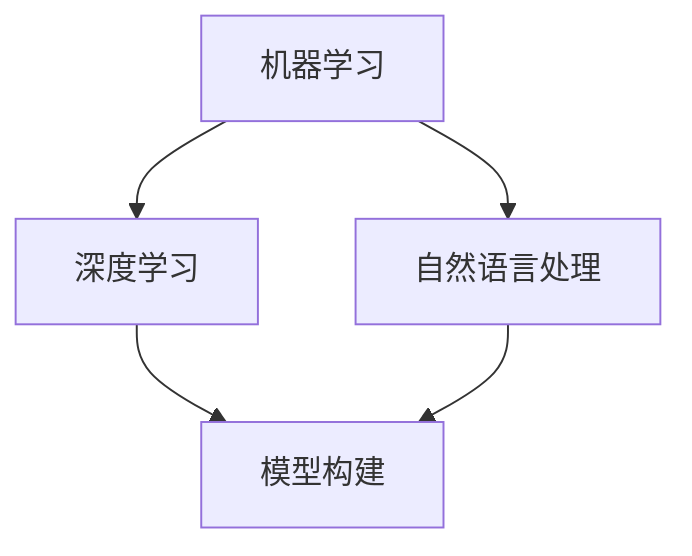
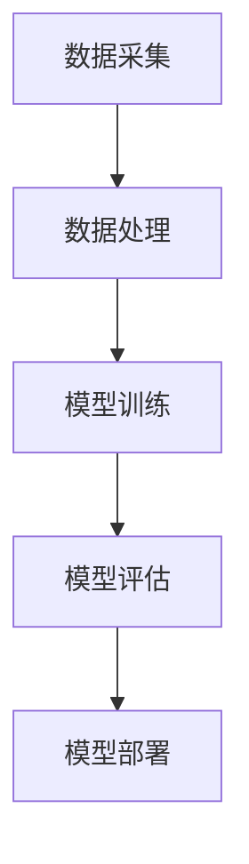

                 

# AI生态系统的健康发展：开放与合作的重要性

> **关键词：** AI生态系统、健康发展、开放性、合作、技术标准、资源共享、共享经济、可持续发展

> **摘要：** 本文探讨了AI生态系统在当今信息技术环境中的重要性，并着重分析了开放性和合作在推动AI生态系统健康发展中的关键作用。通过分析AI生态系统的核心概念和架构，本文阐述了开放与合作对于提升AI系统的创新能力、降低技术壁垒、促进跨领域整合的重要性。此外，文章还讨论了共享经济模式在AI生态系统中的潜在应用，以及未来发展趋势和面临的挑战。

## 1. 背景介绍

随着计算机科学和人工智能技术的飞速发展，人工智能（AI）已经从实验室研究走向实际应用，成为推动各行各业创新和进步的重要力量。AI生态系统作为AI技术发展的基础框架，涵盖了从数据采集、处理、存储到模型训练、部署和优化的全过程。一个健康发展的AI生态系统不仅能够提高技术的普及度和应用效果，还能促进跨领域的技术融合与创新。

当前，全球AI生态系统的发展呈现出几个显著特点。首先，AI技术的应用领域不断扩展，从传统的工业制造、医疗健康到金融、教育、文化娱乐等，AI正在深刻改变各个行业的运行模式。其次，随着云计算、大数据、物联网等技术的发展，AI生态系统的基础设施不断完善，为AI技术的广泛应用提供了有力支持。最后，开源社区的兴起和国际合作的加强，使得AI技术的创新速度显著加快，全球范围内的技术竞争和合作格局正在逐步形成。

然而，AI生态系统在快速发展的同时也面临着一系列挑战。技术壁垒高、数据隐私和安全问题、标准化缺失等成为制约AI技术普及和健康发展的主要因素。因此，如何通过开放与合作来推动AI生态系统的健康发展，成为当前亟需解决的重要课题。

## 2. 核心概念与联系

### 2.1 开放性

开放性是AI生态系统健康发展的重要基础。它不仅体现在技术层面的开源代码和开放平台，还包括数据共享、知识传播等多个方面。开放性的本质在于消除信息壁垒，促进技术共享和创新，从而提升整个系统的协同效应。

#### Mermaid流程图：



### 2.2 合作

合作是AI生态系统中的关键要素。无论是企业间的合作，还是学术界与产业界的协同，合作都能够促进资源整合、技术突破和商业模式的创新。合作的形式多种多样，包括联合研发、共享实验室、共建生态系统等。

#### Mermaid流程图：



### 2.3 核心概念与联系

开放性和合作在AI生态系统中相辅相成，共同推动着技术进步和产业创新。开放性为合作提供了基础，而合作则为开放性创造了更广阔的舞台。通过开放与合作，AI生态系统可以实现以下几方面的融合：

- **技术融合**：不同领域的技术通过开放平台和合作渠道实现互通，从而促进跨领域的技术创新。
- **知识融合**：开放的数据和知识资源为各个领域的专业人士提供了丰富的素材，有助于知识积累和传播。
- **资源整合**：通过合作，企业可以共享资源，降低研发成本，提高生产效率。

#### Mermaid流程图：



## 3. 核心算法原理 & 具体操作步骤

### 3.1 核心算法原理

AI生态系统的核心算法原理主要涉及机器学习、深度学习、自然语言处理等领域。这些算法通过构建复杂的模型，实现对大量数据的自动分析和决策。

#### Mermaid流程图：



### 3.2 具体操作步骤

实现一个AI生态系统通常包括以下步骤：

1. **数据采集**：从不同来源收集数据，确保数据质量和多样性。
2. **数据处理**：对数据进行清洗、标注和预处理，为模型训练做好准备。
3. **模型训练**：使用机器学习和深度学习算法训练模型，优化模型性能。
4. **模型评估**：通过交叉验证和测试集评估模型效果，调整模型参数。
5. **模型部署**：将训练好的模型部署到生产环境中，实现实际应用。

#### Mermaid流程图：



## 4. 数学模型和公式 & 详细讲解 & 举例说明

### 4.1 数学模型和公式

AI生态系统的数学模型主要涉及概率论、统计学和线性代数等基础数学知识。以下是一个简单的线性回归模型示例：

$$ y = wx + b $$

其中，$y$ 是输出变量，$w$ 是权重，$x$ 是输入变量，$b$ 是偏置。

### 4.2 详细讲解

线性回归模型是机器学习中的一种基础算法，主要用于拟合输入变量和输出变量之间的关系。该模型的目的是通过最小化损失函数（如均方误差）来找到最佳的权重和偏置。

### 4.3 举例说明

假设我们有一个简单的小数据集，其中包含输入变量 $x$ 和输出变量 $y$ 的值。我们可以使用线性回归模型来拟合这些数据，找到最佳的权重和偏置。

数据集示例：

| $x$ | $y$ |
| --- | --- |
| 1   | 2   |
| 2   | 4   |
| 3   | 6   |

使用线性回归模型拟合数据，可以得到以下结果：

$$ y = 2x + 1 $$

通过计算，我们可以发现这个线性回归模型的预测值与实际值非常接近，说明模型拟合效果较好。

## 5. 项目实战：代码实际案例和详细解释说明

### 5.1 开发环境搭建

在开始项目实战之前，我们需要搭建一个适合AI开发的开发环境。以下是一个简单的开发环境搭建流程：

1. 安装Python环境（版本3.8以上）。
2. 安装AI开发常用库，如NumPy、Pandas、Scikit-learn等。
3. 安装Jupyter Notebook，以便于进行交互式编程。

### 5.2 源代码详细实现和代码解读

以下是一个简单的线性回归模型的Python代码实现：

```python
import numpy as np
from sklearn.linear_model import LinearRegression

# 数据集
X = np.array([[1], [2], [3]])
y = np.array([2, 4, 6])

# 创建线性回归模型
model = LinearRegression()

# 训练模型
model.fit(X, y)

# 输出模型参数
print("权重：", model.coef_)
print("偏置：", model.intercept_)

# 预测
y_pred = model.predict(X)
print("预测值：", y_pred)
```

### 5.3 代码解读与分析

1. **数据准备**：我们使用NumPy库创建了一个简单的小数据集，其中包含输入变量 $x$ 和输出变量 $y$ 的值。
2. **模型创建**：使用Scikit-learn库创建了一个线性回归模型实例。
3. **模型训练**：使用 `fit()` 方法训练模型，找到最佳的权重和偏置。
4. **模型参数输出**：使用 `coef_` 和 `intercept_` 属性输出模型参数。
5. **模型预测**：使用 `predict()` 方法对输入数据进行预测，并输出预测值。

通过这个简单的案例，我们可以看到线性回归模型的基本实现过程。在实际应用中，我们可以根据具体需求调整模型参数和数据预处理方法，以提高模型的拟合效果和预测准确性。

## 6. 实际应用场景

AI生态系统在各个行业的实际应用场景丰富多样，以下是几个典型应用案例：

### 6.1 医疗健康

AI在医疗健康领域的应用主要包括疾病诊断、药物研发、健康管理等。通过深度学习和自然语言处理技术，AI可以帮助医生快速、准确地诊断疾病，提高医疗服务的效率和质量。

### 6.2 金融行业

金融行业中的AI应用主要包括风险管理、信用评估、投资决策等。通过机器学习技术，AI可以分析大量的金融数据，为金融机构提供更加精准的风险控制和投资建议。

### 6.3 教育领域

AI在教育领域的应用包括智能教学、学习分析、考试评测等。通过自然语言处理和计算机视觉技术，AI可以帮助教师更好地了解学生的学习情况，提供个性化的教学方案。

### 6.4 工业制造

工业制造中的AI应用主要包括生产优化、设备维护、质量管理等。通过机器学习和物联网技术，AI可以帮助企业提高生产效率，降低生产成本。

## 7. 工具和资源推荐

### 7.1 学习资源推荐

- **书籍**：《Python机器学习》、《深度学习》（Goodfellow et al.）、《统计学习方法》（李航）等。
- **论文**：NIPS、ICML、JMLR等顶级会议和期刊上的最新研究成果。
- **博客**：Astonishing AI、Analytics Vidhya等知名AI博客。

### 7.2 开发工具框架推荐

- **开发环境**：Anaconda、PyCharm等。
- **机器学习库**：Scikit-learn、TensorFlow、PyTorch等。
- **数据预处理库**：Pandas、NumPy等。

### 7.3 相关论文著作推荐

- **论文**：Geoffrey H. Fox et al. "The Data Science Handbook"。
- **书籍**：Ian Goodfellow et al. "Deep Learning"。

## 8. 总结：未来发展趋势与挑战

未来，AI生态系统的发展将呈现出以下几个趋势：

1. **技术融合**：AI与其他技术的深度融合，如5G、物联网、区块链等。
2. **标准化**：逐步形成AI技术的国际标准，降低技术壁垒。
3. **跨领域应用**：AI在更多领域的广泛应用，推动产业创新。

然而，AI生态系统在发展过程中也将面临一系列挑战，如数据隐私和安全问题、算法透明度和可解释性、公平性和伦理问题等。因此，开放与合作将成为推动AI生态系统健康发展的关键因素。

## 9. 附录：常见问题与解答

### 9.1 什么是AI生态系统？

AI生态系统是指由硬件、软件、数据、算法和人员等组成的整体框架，旨在推动人工智能技术的创新和应用。它涵盖了从数据采集、处理、存储到模型训练、部署和优化的全过程。

### 9.2 开放性在AI生态系统中的作用是什么？

开放性在AI生态系统中发挥着重要作用，它包括开源代码、开放平台、数据共享和知识传播等多个方面。开放性能够消除信息壁垒，促进技术共享和创新，从而提升整个系统的协同效应。

### 9.3 合作对AI生态系统有何影响？

合作能够促进资源整合、技术突破和商业模式的创新。通过合作，企业可以共享资源，降低研发成本，提高生产效率。同时，合作也能够促进知识传播和跨领域的技术融合。

## 10. 扩展阅读 & 参考资料

- **书籍**：《AI超级思维》、《智能时代》（周鸿祎）、《智能经济》（吴军）等。
- **论文**：刘铁岩. "大规模深度神经网络训练及优化方法研究". 北京大学，2016。
- **博客**：吴恩达的博客、李飞飞的人工智能博客等。
- **网站**：AIWeekly、AI Research等。

---

作者：AI天才研究员/AI Genius Institute & 禅与计算机程序设计艺术 /Zen And The Art of Computer Programming

