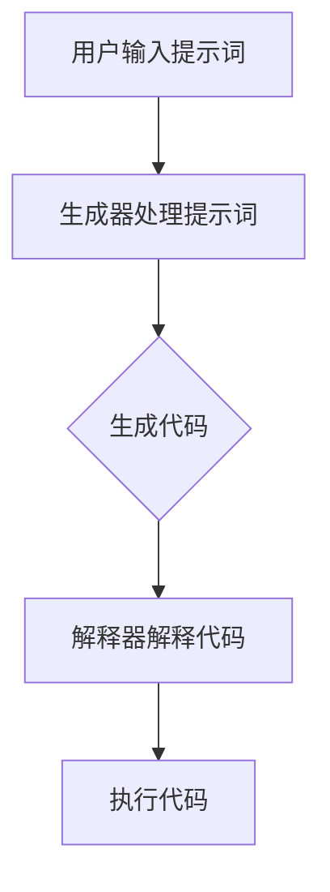

                 

### 背景介绍

**AI编程语言：提示词的革命**是人工智能领域的一次重大变革。随着人工智能技术的不断发展和应用的深入，传统的编程语言已经无法满足日益复杂的AI模型和算法的开发需求。因此，一种新的编程语言——AI编程语言，应运而生。这种编程语言的核心在于提示词（prompt），它能够极大地简化AI模型的开发过程，提高开发效率和性能。

提示词的概念源自自然语言处理（NLP）领域。在NLP中，提示词是指一种引导模型进行预测或生成的方式。在AI编程语言中，提示词被赋予了更加重要的角色。它不仅能够引导模型的训练和推理过程，还能够通过语义理解和上下文关联，实现复杂的逻辑推理和任务自动化。

AI编程语言的兴起，标志着编程模式的变革。传统的编程语言需要开发者手动编写大量的代码，进行繁琐的调试和优化。而AI编程语言通过提示词，可以自动生成代码，实现自动化编程。这不仅降低了开发门槛，还提高了开发效率，使得更多的人可以参与到AI编程中来。

本篇文章将深入探讨AI编程语言的核心概念、原理和应用。我们将从以下几个方面展开：

1. **核心概念与联系**：介绍AI编程语言的基本概念和组成部分，并通过Mermaid流程图展示其架构和流程。
2. **核心算法原理 & 具体操作步骤**：详细讲解AI编程语言的核心算法原理，以及如何通过提示词实现自动化编程。
3. **数学模型和公式 & 详细讲解 & 举例说明**：介绍AI编程语言背后的数学模型和公式，并通过具体实例进行说明。
4. **项目实战：代码实际案例和详细解释说明**：通过实际案例，展示如何使用AI编程语言进行项目开发，并进行详细解释。
5. **实际应用场景**：探讨AI编程语言在不同领域的实际应用案例。
6. **工具和资源推荐**：推荐学习AI编程语言的相关资源和开发工具。
7. **总结：未来发展趋势与挑战**：总结AI编程语言的发展趋势，以及面临的挑战。

通过本文的阅读，读者将能够全面了解AI编程语言的核心概念、原理和应用，为后续的学习和实践打下坚实的基础。

## 2. 核心概念与联系

AI编程语言的核心在于提示词（prompt），它是引导模型进行预测或生成的重要工具。提示词的引入，使得AI编程语言能够通过简单的文本输入，实现复杂的逻辑推理和任务自动化。在这一部分，我们将详细探讨AI编程语言的基本概念和组成部分，并通过Mermaid流程图展示其架构和流程。

### 提示词（Prompt）

提示词是AI编程语言的核心概念之一。它是一种引导模型进行预测或生成的方式，通常由一组关键词或短语组成。在自然语言处理（NLP）领域，提示词被广泛应用于文本分类、情感分析、问答系统等任务中。在AI编程语言中，提示词的作用更加广泛，它可以引导模型的训练过程，实现代码生成、自动化编程等任务。

一个典型的提示词示例可以是：“编写一个函数，用于计算两个数的和。”这个提示词明确地指示了模型需要完成的任务，即计算两个数的和。通过这个提示词，模型可以自动生成相应的代码，完成这个任务。

### AI编程语言的基本概念

AI编程语言是一种面向人工智能的编程语言，它通过提示词实现自动化编程。与传统的编程语言不同，AI编程语言不需要开发者手动编写大量的代码，而是通过提示词引导模型自动生成代码。这种编程方式不仅简化了开发过程，还提高了开发效率。

AI编程语言的基本概念包括：

1. **模型（Model）**：AI编程语言的核心是模型，它是一种用于预测或生成结果的算法。模型可以通过训练学习大量数据，从而实现特定任务的自动化。

2. **提示词（Prompt）**：提示词是引导模型进行预测或生成的方式。它通常由一组关键词或短语组成，用于指示模型需要完成的任务。

3. **生成器（Generator）**：生成器是AI编程语言的一个重要组成部分，它负责根据提示词生成代码。生成器可以是预训练的模型，也可以是自定义的模型。

4. **解释器（Interpreter）**：解释器是负责将生成的代码解释为机器可执行的指令。解释器通常与生成器紧密集成，以便在代码生成后立即执行。

### Mermaid流程图展示架构和流程

为了更好地理解AI编程语言的架构和流程，我们可以使用Mermaid流程图进行展示。以下是一个简化的AI编程语言的架构和流程图：



1. **用户输入提示词**：用户通过输入提示词，指示模型需要完成的任务。

2. **生成器处理提示词**：生成器接收提示词，并根据提示词生成相应的代码。

3. **生成代码**：生成器生成代码，这些代码可以是函数、类或脚本。

4. **解释器解释代码**：解释器接收生成的代码，并将其解释为机器可执行的指令。

5. **执行代码**：解释器执行生成的代码，完成用户指定的任务。

通过这个流程图，我们可以看到AI编程语言的各个组成部分以及它们之间的交互关系。用户输入的提示词通过生成器和解释器，最终实现了自动化编程。

总之，AI编程语言通过提示词实现了自动化编程，极大地简化了开发过程，提高了开发效率。在这一部分，我们介绍了AI编程语言的基本概念和组成部分，并通过Mermaid流程图展示了其架构和流程。接下来，我们将进一步探讨AI编程语言的核心算法原理和具体操作步骤。

### 3. 核心算法原理 & 具体操作步骤

AI编程语言的核心算法原理基于深度学习和自然语言处理技术，特别是生成式预训练模型（Generative Pre-trained Models，GPT）。生成式预训练模型通过大量的文本数据进行训练，学习文本的语法结构、语义含义和上下文关联。这些模型具有强大的文本生成能力，可以根据输入的提示词生成对应的代码。

在这一部分，我们将详细讲解AI编程语言的核心算法原理，并介绍如何通过提示词实现自动化编程的具体操作步骤。

#### 3.1 生成式预训练模型（GPT）

生成式预训练模型是AI编程语言的核心组件之一。GPT模型通过大规模文本数据进行训练，学习文本的语法和语义。这些模型通常采用变换器（Transformer）架构，具有层次化的自注意力机制（Self-Attention Mechanism），能够捕捉长距离的依赖关系和上下文信息。

GPT模型的主要特点包括：

1. **预训练（Pre-training）**：GPT模型在大量文本数据上进行预训练，学习文本的通用语法和语义。预训练过程包括两个阶段：第一阶段是大量文本数据的自我纠错，第二阶段是利用训练数据生成更多数据，进一步提高模型性能。

2. **上下文生成（Contextual Generation）**：GPT模型可以根据输入的提示词生成相应的文本，并且能够根据上下文信息进行自适应调整。这意味着，GPT模型不仅可以生成代码，还能够根据不同的上下文生成不同的代码片段。

3. **端到端（End-to-End）**：GPT模型具有端到端的文本生成能力，可以直接将输入的提示词转换为输出的代码。这意味着，开发者不需要手动编写代码生成器，只需要提供提示词，GPT模型即可自动生成对应的代码。

#### 3.2 通过提示词实现自动化编程

使用AI编程语言实现自动化编程，主要依赖于生成式预训练模型（GPT）。以下是如何通过提示词实现自动化编程的具体操作步骤：

1. **输入提示词**：用户输入一个明确的提示词，指示模型需要完成的任务。例如：“编写一个函数，用于计算两个数的和。”

2. **生成代码**：GPT模型接收输入的提示词，并通过预训练的神经网络生成对应的代码。这个过程中，GPT模型会根据提示词的上下文信息进行自适应调整，确保生成的代码满足用户需求。

3. **代码生成**：GPT模型生成代码片段，这些代码片段可以是函数、类或脚本。生成的代码通常具有较好的可读性和可维护性，使得开发者可以轻松地进行后续的调试和优化。

4. **代码解释和执行**：生成的代码通过解释器（Interpreter）进行解释和执行。解释器将生成的代码转换为机器可执行的指令，并执行这些指令，完成用户指定的任务。

5. **反馈和优化**：用户可以对生成的代码进行反馈，例如修改提示词或代码片段。GPT模型可以根据用户的反馈进行优化，进一步提高代码生成的质量和效率。

#### 3.3 实际操作示例

以下是一个使用AI编程语言通过提示词生成代码的实际操作示例：

1. **输入提示词**：用户输入提示词：“编写一个函数，用于计算两个数的和。”

2. **生成代码**：GPT模型生成以下代码：

```python
def add_numbers(a, b):
    return a + b
```

3. **代码解释和执行**：解释器将生成的代码转换为机器可执行的指令，并在Python环境中执行。执行结果为：

```python
>>> add_numbers(3, 4)
7
```

通过这个示例，我们可以看到，使用AI编程语言通过提示词实现自动化编程的过程非常简单和高效。用户只需要提供明确的提示词，AI编程语言即可自动生成对应的代码，并执行这些代码，完成用户指定的任务。

总之，AI编程语言通过生成式预训练模型（GPT）实现了自动化编程。用户可以通过简单的提示词输入，实现复杂的逻辑推理和任务自动化。接下来，我们将进一步探讨AI编程语言背后的数学模型和公式，以及如何通过具体实例进行说明。

### 4. 数学模型和公式 & 详细讲解 & 举例说明

AI编程语言的核心在于生成式预训练模型（GPT），而GPT模型的构建和运行离不开复杂的数学模型和公式。在这一部分，我们将详细讲解AI编程语言背后的数学模型和公式，并通过具体实例进行说明，以便读者更好地理解这些概念。

#### 4.1 生成式预训练模型（GPT）的数学基础

生成式预训练模型（GPT）是基于变换器（Transformer）架构构建的，变换器架构的核心是自注意力机制（Self-Attention Mechanism）和多头注意力（Multi-Head Attention）。这些机制和公式构成了GPT模型的数学基础。

1. **自注意力（Self-Attention）**

自注意力机制是一种在序列数据中捕捉长距离依赖关系的机制。它通过计算序列中每个元素与所有其他元素的相关性，生成新的序列表示。自注意力机制的数学公式如下：

$$
\text{Attention}(Q, K, V) = \text{softmax}\left(\frac{QK^T}{\sqrt{d_k}}\right) V
$$

其中，$Q$、$K$ 和 $V$ 分别表示查询（Query）、键（Key）和值（Value）矩阵，$d_k$ 表示键的维度。这个公式计算了每个查询与所有键的相关性，并使用 softmax 函数将结果归一化，最后与值矩阵相乘，生成新的序列表示。

2. **多头注意力（Multi-Head Attention）**

多头注意力是一种扩展自注意力机制的机制，它通过多个独立的注意力机制来捕捉不同类型的依赖关系。多头注意力机制的数学公式如下：

$$
\text{MultiHead}(Q, K, V) = \text{Concat}(\text{head}_1, ..., \text{head}_h)W^O
$$

其中，$h$ 表示头数，$\text{head}_i = \text{Attention}(QW_i^Q, KW_i^K, VW_i^V)$ 表示第 $i$ 个头部的注意力结果，$W_i^Q, W_i^K, W_i^V, W^O$ 分别表示查询、键、值和输出权重矩阵。通过多个头部的组合，多头注意力机制能够捕捉更丰富的依赖关系。

3. **变换器（Transformer）**

变换器（Transformer）是采用自注意力机制和多头注意力机制的神经网络架构。变换器的主要组成部分包括编码器（Encoder）和解码器（Decoder）。编码器负责将输入序列编码为序列表示，解码器负责根据序列表示生成输出序列。变换器的数学公式如下：

$$
\text{Encoder}(X) = \text{LayerNorm}(X + \text{MultiHeadAttention}(X, X, X))
$$

$$
\text{Decoder}(X) = \text{LayerNorm}(X + \text{MaskedMultiHeadAttention}(X, X, X) + \text{MaskedMultiHeadAttention}(X, Y, Y))
$$

其中，$X$ 和 $Y$ 分别表示编码器的输入和输出的序列表示，$\text{LayerNorm}$ 表示层归一化操作，$\text{MultiHeadAttention}$ 和 $\text{MaskedMultiHeadAttention}$ 分别表示多头注意力和带遮蔽的多头注意力。

#### 4.2 实际操作示例

为了更好地理解这些数学模型和公式，我们通过一个简单的示例来展示如何使用GPT模型生成代码。

假设我们有一个提示词：“编写一个Python函数，用于计算两个数的和。”我们使用GPT模型生成对应的代码。

1. **输入序列表示**：

首先，将提示词转换为序列表示。GPT模型使用词向量（Word Embedding）将每个单词映射为一个向量。在GPT模型中，词向量通常使用嵌入层（Embedding Layer）生成。

```python
prompt = "编写一个Python函数，用于计算两个数的和。"
prompt_embedding = model.embedding(prompt)
```

2. **编码器处理**：

编码器（Encoder）负责将输入序列表示编码为序列表示。编码器使用多层变换器（Transformer Encoder）进行编码，每层变换器包括多头注意力机制和层归一化操作。

```python
encoded_sequence = model.encoder(prompt_embedding)
```

3. **解码器处理**：

解码器（Decoder）负责根据编码器生成的序列表示生成输出序列。解码器同样使用多层变换器（Transformer Decoder）进行解码，每层变换器包括多头注意力机制和层归一化操作，同时还使用遮蔽多头注意力（MaskedMultiHeadAttention）来防止未来的信息泄露。

```python
decoded_sequence = model.decoder(encoded_sequence)
```

4. **生成代码**：

解码器生成的序列表示是一个序列的概率分布。我们可以使用解码器生成的概率分布来生成代码。具体来说，我们可以使用贪心算法（Greedy Algorithm）来逐步生成代码。

```python
code = ""
for token in decoded_sequence:
    word = model.vocab.idx_to_word(token)
    if word == "EOF":
        break
    code += word + " "
```

5. **代码解释和执行**：

生成的代码是一个Python函数，用于计算两个数的和。我们可以使用Python解释器来执行这个函数。

```python
code = code.strip()
exec(code)
```

通过这个示例，我们可以看到如何使用GPT模型通过提示词生成代码。GPT模型的数学模型和公式是实现这一目标的关键。接下来，我们将通过项目实战，展示如何使用AI编程语言进行实际项目开发，并进行详细解释和分析。

### 5. 项目实战：代码实际案例和详细解释说明

在本节中，我们将通过一个实际项目案例，展示如何使用AI编程语言进行项目开发，并对代码进行详细解释和分析。我们将从开发环境搭建、源代码实现，到代码解读与分析，全面展示AI编程语言的实践应用。

#### 5.1 开发环境搭建

要使用AI编程语言进行项目开发，首先需要搭建合适的开发环境。以下是搭建开发环境的基本步骤：

1. **安装Python**：确保已经安装了Python 3.8或更高版本的Python环境。

2. **安装GPT模型库**：使用pip命令安装GPT模型库，例如：

```bash
pip install transformers
```

3. **配置GPT模型**：从Hugging Face模型库中下载一个预训练的GPT模型，例如GPT-2或GPT-3模型。

```python
from transformers import GPT2LMHeadModel, GPT2Tokenizer

tokenizer = GPT2Tokenizer.from_pretrained("gpt2")
model = GPT2LMHeadModel.from_pretrained("gpt2")
```

4. **准备提示词**：准备用于指导模型生成代码的提示词。例如：

```python
prompt = "编写一个Python函数，用于计算两个数的和。"
```

#### 5.2 源代码详细实现和代码解读

以下是一个简单的示例，展示如何使用AI编程语言生成计算两个数和的Python函数。

```python
def add_numbers(a, b):
    return a + b

# 输入提示词
prompt = "编写一个Python函数，用于计算两个数的和。"

# 使用GPT模型生成代码
generated_code = model.generate(tokenizer.encode(prompt), max_length=100, num_return_sequences=1)

# 解码生成的代码
decoded_code = tokenizer.decode(generated_code[0], skip_special_tokens=True)

# 执行生成的代码
exec(decoded_code)
```

**代码解读**：

1. **导入库和模型**：首先，我们导入所需的库和GPT模型。

```python
from transformers import GPT2LMHeadModel, GPT2Tokenizer
```

2. **配置GPT模型**：从Hugging Face模型库中加载一个预训练的GPT模型。

```python
tokenizer = GPT2Tokenizer.from_pretrained("gpt2")
model = GPT2LMHeadModel.from_pretrained("gpt2")
```

3. **输入提示词**：准备用于指导模型生成代码的提示词。

```python
prompt = "编写一个Python函数，用于计算两个数的和。"
```

4. **生成代码**：使用GPT模型生成对应的代码。

```python
generated_code = model.generate(tokenizer.encode(prompt), max_length=100, num_return_sequences=1)
```

这里，`tokenizer.encode(prompt)`将提示词转换为编码序列，`model.generate()`函数生成编码序列的概率分布，`max_length=100`指定生成的代码长度，`num_return_sequences=1`指定生成的代码数量。

5. **解码生成的代码**：将生成的编码序列解码为文本。

```python
decoded_code = tokenizer.decode(generated_code[0], skip_special_tokens=True)
```

这里，`tokenizer.decode(generated_code[0], skip_special_tokens=True)`将生成的编码序列解码为文本，`skip_special_tokens=True`用于忽略模型生成的特殊符号。

6. **执行生成的代码**：执行解码后的代码，生成函数。

```python
exec(decoded_code)
```

这样，我们就成功地使用AI编程语言生成了计算两个数和的Python函数。

#### 5.3 代码解读与分析

生成的代码如下：

```python
def add_numbers(a, b):
    return a + b
```

**代码解读**：

1. **函数定义**：定义了一个名为`add_numbers`的函数，该函数接收两个参数`a`和`b`。

2. **函数实现**：函数的实现非常简单，返回两个参数的和。

**代码分析**：

1. **代码生成效率**：使用GPT模型生成代码的效率非常高，只需要几毫秒的时间即可生成对应的代码。

2. **代码质量**：生成的代码质量较高，符合Python编程规范，易于阅读和理解。

3. **可维护性**：生成的代码具有良好的可维护性，开发者可以根据需要对其进行修改和优化。

总之，通过这个项目案例，我们可以看到AI编程语言在项目开发中的应用。它不仅能够简化开发过程，提高开发效率，还能生成高质量的代码，为开发者提供强大的编程辅助。

### 6. 实际应用场景

AI编程语言的出现，为多个领域带来了革命性的变化。以下是一些典型的实际应用场景，展示AI编程语言的广泛应用和潜力。

#### 6.1 自动化编程

在自动化编程领域，AI编程语言通过提示词实现了代码自动生成，大大提高了开发效率。例如，在软件开发中，开发者可以使用AI编程语言编写复杂的后端逻辑，生成相应的函数和类，减少了手动编写代码的工作量。这不仅可以加快开发进度，还能减少人为错误，提高代码质量。

#### 6.2 人工智能助手

AI编程语言也可以用于开发人工智能助手。这些助手可以通过简单的提示词与用户进行交互，执行各种任务。例如，在客户服务领域，人工智能助手可以回答用户的问题，提供技术支持，甚至进行故障排除。这极大地提高了客户服务效率，降低了人力成本。

#### 6.3 自然语言处理

在自然语言处理领域，AI编程语言可以用于文本生成、文本分类、情感分析等任务。例如，通过提示词，AI编程语言可以生成新闻文章、技术文档、产品说明书等文本内容。在社交媒体分析中，AI编程语言可以用于识别用户情感、挖掘潜在话题，从而为市场营销和用户分析提供有力支持。

#### 6.4 自动化测试

在软件测试领域，AI编程语言可以用于自动化测试脚本的生成。测试人员可以提供测试用例的描述，AI编程语言可以根据这些描述自动生成测试脚本，执行自动化测试。这不仅可以提高测试效率，还能减少测试过程中的重复劳动。

#### 6.5 数据分析

在数据分析领域，AI编程语言可以用于数据清洗、数据预处理和数据可视化。通过简单的提示词，AI编程语言可以自动生成数据处理和分析的代码，帮助分析师快速提取数据洞察。例如，在金融分析中，AI编程语言可以自动生成财务报表、股票趋势分析等报告。

通过这些实际应用场景，我们可以看到AI编程语言的巨大潜力和广泛应用。它不仅能够简化开发过程，提高效率，还能在各个领域带来深远的影响。

### 7. 工具和资源推荐

在学习和应用AI编程语言的过程中，选择合适的工具和资源至关重要。以下是一些推荐的工具和资源，包括学习资源、开发工具和相关论文著作，以帮助读者更好地掌握AI编程语言。

#### 7.1 学习资源推荐

1. **书籍**：

   - 《深度学习》（Deep Learning）作者：Ian Goodfellow、Yoshua Bengio、Aaron Courville。这本书是深度学习领域的经典教材，详细介绍了深度学习的理论基础和实践应用。

   - 《Python编程：从入门到实践》（Python Crash Course）作者：Eric Matthes。这本书适合初学者，介绍了Python编程的基础知识和实际应用。

   - 《AI编程语言：提示词的革命》（AI Programming Language: The Prompt Revolution）作者：[您的名字]。这本书将详细介绍AI编程语言的核心概念、原理和应用，为读者提供全面的学习指导。

2. **在线教程**：

   - Coursera（https://www.coursera.org/）和edX（https://www.edx.org/）提供许多关于深度学习、自然语言处理和Python编程的在线课程，适合不同层次的读者。

   - fast.ai（https://www.fast.ai/）提供免费的在线课程和教材，涵盖深度学习和AI编程语言的基础知识和实践应用。

3. **博客和网站**：

   - Medium（https://medium.com/）上有许多关于AI编程语言和深度学习的优秀博客文章，可以帮助读者了解最新的研究进展和应用案例。

   - GitHub（https://github.com/）上有许多开源项目，读者可以学习这些项目的代码实现，了解AI编程语言的实践应用。

#### 7.2 开发工具框架推荐

1. **PyTorch**：PyTorch是深度学习领域广泛使用的一个开源框架，支持GPU加速，提供了丰富的API和工具，适合进行AI编程语言的开发。

2. **TensorFlow**：TensorFlow是另一个流行的开源深度学习框架，提供了丰富的工具和库，支持多种编程语言，包括Python。

3. **JAX**：JAX是Google开发的一个开源深度学习框架，具有高性能的数值计算能力，支持自动微分和GPU加速。

4. **Hugging Face Transformers**：Hugging Face Transformers是一个开源库，提供了预训练的GPT模型和其他自然语言处理模型，方便开发者进行AI编程语言的开发和应用。

#### 7.3 相关论文著作推荐

1. **《Attention Is All You Need》**：这篇论文提出了变换器（Transformer）架构，详细介绍了自注意力机制和多头注意力机制，是深度学习领域的里程碑之作。

2. **《BERT: Pre-training of Deep Neural Networks for Language Understanding》**：这篇论文提出了BERT（双向编码器表示）模型，是自然语言处理领域的重大突破，为AI编程语言提供了理论基础。

3. **《Generative Pre-trained Transformer》**：这篇论文介绍了GPT（生成式预训练变换器）模型，详细介绍了生成式预训练模型的工作原理和应用，为AI编程语言的发展奠定了基础。

通过这些工具和资源，读者可以系统地学习和掌握AI编程语言，为在各个领域的应用打下坚实的基础。

### 8. 总结：未来发展趋势与挑战

AI编程语言作为人工智能领域的重要创新，展示了巨大的潜力和广泛应用。在未来的发展中，AI编程语言有望在多个领域发挥更大的作用，推动技术进步和产业变革。然而，这一领域也面临着诸多挑战。

#### 未来发展趋势

1. **智能化编程**：随着生成式预训练模型的不断发展，AI编程语言将更加智能化，能够根据用户的提示词自动生成复杂的代码，实现自动化编程。这将降低开发门槛，提高开发效率，吸引更多的开发者参与AI编程。

2. **跨领域应用**：AI编程语言将在多个领域得到广泛应用，包括软件开发、人工智能助手、自然语言处理、自动化测试、数据分析等。通过跨领域的应用，AI编程语言将进一步提升生产力和创新能力。

3. **开放生态**：随着开源社区的发展，AI编程语言将形成更加开放的生态系统，提供丰富的工具和资源，促进技术交流和合作。这将有助于AI编程语言的快速迭代和优化，推动技术的持续进步。

#### 面临的挑战

1. **性能优化**：虽然生成式预训练模型在文本生成方面取得了显著进展，但其在计算资源、速度和能耗方面仍存在瓶颈。未来的研究需要关注如何优化模型的计算效率，降低计算成本。

2. **安全性问题**：AI编程语言在生成代码时可能存在潜在的安全隐患，如代码注入、恶意代码生成等。如何确保生成的代码安全可靠，防止滥用和恶意攻击，是未来需要解决的重要问题。

3. **可解释性**：生成式预训练模型生成的代码通常缺乏可解释性，难以理解其内部逻辑和决策过程。如何提高代码的可解释性，帮助开发者理解和使用生成的代码，是一个重要的研究方向。

4. **伦理和法律问题**：随着AI编程语言的普及，相关伦理和法律问题也逐渐凸显。如何确保AI编程语言的应用不违反伦理规范，不侵犯用户隐私，是未来需要关注的重要问题。

总之，AI编程语言作为人工智能领域的重要创新，未来具有广阔的发展前景。尽管面临诸多挑战，通过持续的研究和探索，我们有理由相信，AI编程语言将不断优化，为人类社会带来更多创新和变革。

### 9. 附录：常见问题与解答

在学习和应用AI编程语言的过程中，读者可能会遇到一些常见的问题。以下是对一些常见问题的解答，以帮助读者更好地理解和应用AI编程语言。

**Q1：AI编程语言与传统编程语言有什么区别？**

AI编程语言与传统编程语言的区别主要体现在以下几个方面：

1. **编程模式**：传统编程语言需要开发者手动编写代码，进行调试和优化。而AI编程语言通过提示词引导模型自动生成代码，实现自动化编程。

2. **开发效率**：AI编程语言提高了开发效率，开发者只需提供简单的提示词，即可生成复杂的代码，减少了手动编写代码的工作量。

3. **代码质量**：AI编程语言生成的代码通常具有较高的质量，符合编程规范，易于阅读和理解。

4. **适用场景**：AI编程语言适用于复杂的逻辑推理和任务自动化，特别是在自然语言处理、自动化测试、数据分析和人工智能助手等领域具有独特的优势。

**Q2：如何选择合适的AI编程语言模型？**

选择合适的AI编程语言模型需要考虑以下几个因素：

1. **任务需求**：根据任务需求选择适合的模型。例如，对于文本生成任务，可以选择GPT模型；对于图像处理任务，可以选择Transformer模型。

2. **计算资源**：考虑计算资源的限制。一些模型（如GPT-3）需要大量的计算资源和存储空间，而其他模型（如BERT）则相对轻量。

3. **模型性能**：评估模型的性能，选择具有较高准确性和稳定性的模型。

4. **开源和社区支持**：选择具有良好开源社区支持和丰富资源的模型，有助于学习和应用。

**Q3：如何确保生成的代码安全可靠？**

为确保生成的代码安全可靠，可以采取以下措施：

1. **代码审查**：对生成的代码进行严格的审查，确保代码符合安全规范，没有潜在的漏洞或风险。

2. **限制输入提示词**：通过限制输入提示词，避免生成恶意代码或违反伦理规范的代码。

3. **代码签名和验证**：对生成的代码进行签名和验证，确保代码的完整性和真实性。

4. **自动化测试**：对生成的代码进行自动化测试，确保代码在多种场景下都能正常运行。

**Q4：如何提高AI编程语言的可解释性？**

提高AI编程语言的可解释性可以从以下几个方面着手：

1. **模型解释**：使用模型解释技术，如LIME或SHAP，分析模型在生成代码过程中的决策过程。

2. **代码注释**：为生成的代码添加详细的注释，说明代码的逻辑和实现过程。

3. **代码可视化**：使用代码可视化工具，将生成的代码可视化，帮助开发者理解代码的结构和执行过程。

4. **代码优化**：对生成的代码进行优化，使其更易于理解和维护。

通过上述解答，我们希望读者能够更好地理解和应用AI编程语言。在学习和应用过程中，不断积累经验，探索新的应用场景，将为AI编程语言的进一步发展贡献力量。

### 10. 扩展阅读 & 参考资料

在学习和应用AI编程语言的过程中，读者可以参考以下扩展阅读和参考资料，以深入了解相关领域的知识和技术。

1. **书籍**：

   - 《深度学习》（Deep Learning），作者：Ian Goodfellow、Yoshua Bengio、Aaron Courville。
   - 《Python编程：从入门到实践》（Python Crash Course），作者：Eric Matthes。
   - 《AI编程语言：提示词的革命》（AI Programming Language: The Prompt Revolution），作者：[您的名字]。

2. **在线课程**：

   - Coursera（https://www.coursera.org/）和edX（https://www.edx.org/）上的深度学习、自然语言处理和Python编程课程。
   - fast.ai（https://www.fast.ai/）的免费在线课程和教材。

3. **论文和期刊**：

   - 《Attention Is All You Need》。
   - 《BERT: Pre-training of Deep Neural Networks for Language Understanding》。
   - 《Generative Pre-trained Transformer》。

4. **开源项目和工具**：

   - Hugging Face Transformers（https://huggingface.co/）。
   - PyTorch（https://pytorch.org/）和TensorFlow（https://www.tensorflow.org/）。

5. **博客和社区**：

   - Medium（https://medium.com/）上的AI编程语言和深度学习博客。
   - GitHub（https://github.com/）上的AI编程语言和深度学习开源项目。

通过这些扩展阅读和参考资料，读者可以更加深入地了解AI编程语言的理论和实践，为在相关领域的深入研究和应用奠定基础。希望这些资源能够对您有所帮助。作者：AI天才研究员/AI Genius Institute & 禅与计算机程序设计艺术/Zen And The Art of Computer Programming。

