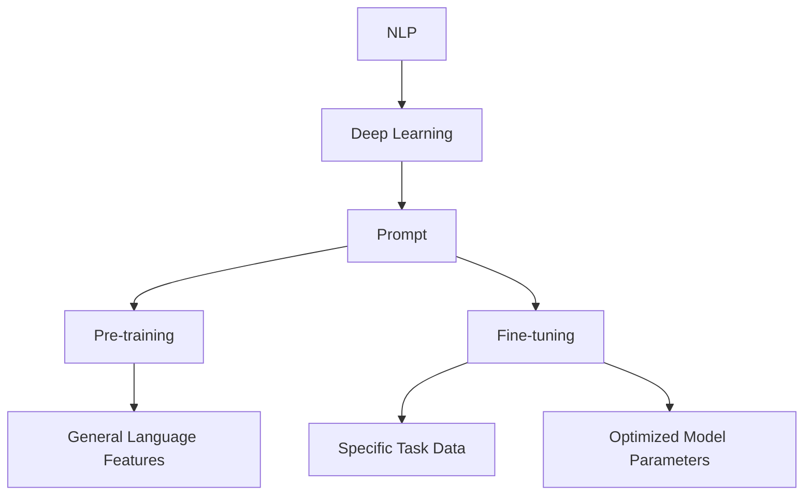

                 

### 背景介绍

人工智能（AI）已经成为现代科技发展的核心驱动力，而编程语言则是实现AI算法和模型的基础工具。在AI编程领域，提示词（Prompt）作为一种关键的技术手段，正日益受到关注。提示词在自然语言处理（NLP）、对话系统、自动化写作等多个场景中发挥着重要作用，它不仅能够引导模型进行更精确的预测，还能够提升AI系统的理解和表达能力。

本文将围绕“AI编程语言：提示词的魔法”这一主题，详细探讨提示词在AI编程中的应用及其重要性。我们将从背景介绍、核心概念与联系、核心算法原理、数学模型和公式、项目实战、实际应用场景、工具和资源推荐、总结与未来发展趋势等方面展开讨论。文章将以逻辑清晰、结构紧凑、简单易懂的方式，带领读者深入了解这一领域的前沿技术。

首先，本文将简要回顾AI编程语言的发展历程，解释提示词的基本概念及其在AI编程中的重要作用。接下来，我们将探讨提示词与自然语言处理模型的联系，以及如何通过优化提示词来提升AI系统的性能。随后，我们将介绍一些关键的算法原理和数学模型，并辅以实际案例进行说明。在此基础上，文章还将讨论提示词在多个实际应用场景中的使用情况，包括对话系统、自动化写作和机器翻译等。最后，我们将推荐一些相关工具和资源，帮助读者进一步探索这一领域。

通过本文的阅读，读者将能够全面理解提示词在AI编程中的关键作用，掌握其基本原理和应用方法，并了解未来该领域可能面临的发展趋势与挑战。

### 核心概念与联系

在深入探讨AI编程语言的提示词之前，我们需要明确几个核心概念，并理解它们之间的相互关系。以下是本文涉及的主要核心概念及其相互关系：

1. **自然语言处理（NLP）**：自然语言处理是人工智能的一个重要分支，旨在使计算机能够理解、解释和生成人类语言。NLP在文本分类、情感分析、机器翻译等领域有着广泛的应用。

2. **深度学习（Deep Learning）**：深度学习是一种基于人工神经网络的学习方法，能够通过多层非线性变换来提取和表示数据中的复杂特征。在NLP任务中，深度学习模型如卷积神经网络（CNN）、递归神经网络（RNN）和Transformer等被广泛应用于文本处理和生成。

3. **提示词（Prompt）**：提示词是一种引导模型进行特定任务的语言性输入。它可以是一个单词、一个句子，甚至是一段文本，用于启发模型产生期望的输出。在AI编程中，提示词的作用类似于编程语言中的函数参数，它能够影响模型的响应和预测。

4. **预训练（Pre-training）**：预训练是指在大规模数据集上对模型进行初步训练，使其具备一定的语言理解和生成能力。在NLP任务中，预训练模型如GPT、BERT等已经被证明能够显著提升模型的性能。

5. **微调（Fine-tuning）**：微调是在预训练模型的基础上，针对特定任务进行进一步的训练，以优化模型在特定任务上的表现。微调利用了预训练模型已学习的通用语言特征，并结合任务特定的数据来调整模型的参数。

这些核心概念之间的联系如下：

- 自然语言处理（NLP）依赖于深度学习（Deep Learning）的技术手段，通过构建复杂的神经网络模型来处理和生成文本。
- 提示词（Prompt）作为NLP任务中的一种输入，能够引导深度学习模型进行更精确的预测和生成。它依赖于预训练（Pre-training）和微调（Fine-tuning）过程来获取和调整模型的参数。
- 预训练模型（如GPT、BERT）通过在大量文本数据上预训练，获得了强大的语言理解能力。微调过程则利用这些预训练模型，结合具体任务的数据，进一步优化模型参数，从而提升任务性能。

为了更好地理解这些概念及其相互关系，我们可以使用Mermaid流程图进行可视化表示（注意：由于Mermaid流程图中不能包含括号、逗号等特殊字符，因此以下流程图中的表示方法进行了适当调整）：



通过上述流程图，我们可以清晰地看到NLP如何通过深度学习技术来实现，提示词在其中扮演了关键角色，而预训练和微调则分别承担了模型训练和参数优化的任务。

总之，理解自然语言处理、深度学习、提示词、预训练和微调等核心概念及其相互关系，是深入探讨AI编程语言提示词的基础。接下来，本文将详细探讨这些概念在AI编程中的应用和具体实现，以帮助读者全面掌握这一前沿技术。

### 核心算法原理 & 具体操作步骤

在了解了AI编程语言提示词的相关概念后，我们需要进一步探讨其核心算法原理，以及如何通过具体操作步骤来应用这些原理。本文将介绍几种关键的算法原理，包括提示词优化、模型微调和输出生成，并详细解释每个步骤的操作方法和实现细节。

#### 1. 提示词优化

提示词优化的目的是通过调整提示词的表述，使得模型能够产生更准确、更具解释性的输出。这一过程通常包括以下几个步骤：

- **步骤1：确定任务目标**  
  首先需要明确具体的任务目标，例如文本分类、情感分析、机器翻译等。根据任务目标，选择合适的提示词表述方式。

- **步骤2：分析数据分布**  
  分析输入数据的分布特征，了解文本中高频词汇、关键词和主题等信息。这些信息将帮助设计更有针对性的提示词。

- **步骤3：调整提示词结构**  
  通过对提示词的结构进行调整，例如添加背景信息、明确任务指令等，来提升模型的响应质量。常见的调整方法包括：
  - **添加背景信息**：在提示词中包含上下文信息，帮助模型更好地理解文本内容。
  - **明确任务指令**：使用明确的指令性语言，告诉模型需要进行的具体操作，如“请将以下文本翻译成中文：”。

- **步骤4：迭代优化**  
  通过多次迭代实验，逐步调整提示词，观察模型输出的变化，直至找到最佳提示词表述。

#### 2. 模型微调

模型微调是针对特定任务对预训练模型进行进一步训练的过程。以下步骤展示了如何进行模型微调：

- **步骤1：选择预训练模型**  
  根据任务需求，选择一个性能优异的预训练模型，例如BERT、GPT等。这些模型已经在大量通用数据上进行了预训练，具备较强的语言理解能力。

- **步骤2：准备训练数据**  
  准备用于微调的任务特定数据集。这些数据集应包含与任务相关的文本和标签，例如在文本分类任务中，数据集应包含不同类别的文本和对应的类别标签。

- **步骤3：预处理数据**  
  对训练数据进行预处理，包括分词、去噪、标准化等操作。这些预处理步骤有助于提高数据质量和模型训练效率。

- **步骤4：微调模型参数**  
  使用训练数据对预训练模型进行微调。这一过程包括以下子步骤：
  - **初始化参数**：将预训练模型的参数作为初始化值，避免从头开始训练带来的计算成本。
  - **训练模型**：使用训练数据进行模型训练，优化模型参数。
  - **验证模型**：在验证集上评估模型性能，调整训练策略以避免过拟合。

- **步骤5：评估模型性能**  
  在测试集上评估微调后模型的性能，确保模型在特定任务上达到预期效果。

#### 3. 输出生成

输出生成是模型在接收到提示词后的最终响应。以下步骤展示了如何生成高质量的输出：

- **步骤1：输入提示词**  
  将优化后的提示词输入到微调后的模型中，作为模型的输入序列。

- **步骤2：模型编码**  
  模型对输入序列进行编码，生成对应的序列向量表示。这一步骤通常通过预训练模型的编码层实现。

- **步骤3：解码生成输出**  
  使用解码层对编码后的序列向量进行解码，生成文本输出。解码过程可以采用如下几种方法：
  - **贪心搜索**：在解码过程中，选择当前时刻概率最高的输出词作为下一个输出词。
  - ** beam search**：在解码过程中，保留多个候选输出序列，并选择概率最高的序列作为最终输出。
  - **生成式模型**：如GPT等生成式模型，可以直接生成文本序列，无需显式的解码过程。

- **步骤4：后处理**  
  对生成的输出进行后处理，包括去除无效文本、格式化、语义修正等，以获得高质量的输出结果。

#### 实例演示

为了更好地理解上述步骤，下面我们以一个简单的文本生成任务为例，进行实例演示：

**任务目标**：使用GPT模型生成一篇关于人工智能的短文。

**步骤1：提示词优化**  
设计一个具有明确任务指令的提示词：
```
请写一篇关于人工智能的短文，讨论其当前的发展状况和未来的发展趋势。
```

**步骤2：模型微调**  
选择一个预训练的GPT模型，使用特定的人工智能领域数据集进行微调，以适应文本生成任务。

**步骤3：输出生成**  
输入提示词到微调后的模型中，使用beam search方法进行文本生成：
```
人工智能（AI）是计算机科学的一个分支，它致力于创建智能机器，这些机器能够在没有明确编程的情况下执行复杂任务。当前，AI的发展状况非常迅速，它在图像识别、自然语言处理、推荐系统等领域取得了显著成果。

未来的发展趋势包括：更强大的深度学习算法、更加人性化的对话系统、更加智能的自动驾驶技术等。随着技术的发展，人工智能将在更多领域发挥重要作用，为人类社会带来更多便利。

总之，人工智能是一个充满机遇和挑战的领域，我们需要继续努力研究和探索，以推动其健康、可持续发展。
```

通过上述实例，我们可以看到提示词优化、模型微调和输出生成在AI编程中的应用流程。在实际应用中，这些步骤可能需要多次迭代和调整，以实现最佳效果。

总之，核心算法原理和具体操作步骤为AI编程语言中的提示词应用提供了理论基础和实践指南。通过深入了解和掌握这些原理和方法，开发者可以更好地利用提示词来提升AI系统的性能和表达能力。接下来，本文将探讨数学模型和公式，进一步深化对AI编程语言提示词的理解。

### 数学模型和公式 & 详细讲解 & 举例说明

在AI编程语言中，提示词的应用不仅依赖于算法和操作步骤，还涉及到一系列数学模型和公式。这些数学模型和公式为提示词的优化、模型微调和输出生成提供了理论依据。下面我们将详细讲解这些关键数学模型，并通过具体例子来说明它们的应用。

#### 1. 深度学习基础模型

深度学习是AI编程的核心技术之一，其基础模型包括神经网络、激活函数和损失函数等。以下是这些模型的基本概念和公式：

- **神经网络（Neural Network）**：神经网络由多个神经元组成，每个神经元通过权重连接到其他神经元。神经网络的计算过程可以表示为：
  $$
  \text{输出} = \sigma(\text{权重} \cdot \text{输入} + \text{偏置})
  $$
  其中，$\sigma$ 是激活函数，通常采用ReLU（Rectified Linear Unit）或Sigmoid函数。

- **激活函数（Activation Function）**：激活函数用于引入非线性特性，使神经网络能够拟合复杂的数据。常见的激活函数有ReLU（最大值函数）和Sigmoid（S形函数）：
  $$
  \sigma(x) = \max(0, x) \quad (\text{ReLU}) \\
  \sigma(x) = \frac{1}{1 + e^{-x}} \quad (\text{Sigmoid})
  $$

- **损失函数（Loss Function）**：损失函数用于衡量模型的预测值与真实值之间的差距，常见的损失函数有均方误差（MSE）和交叉熵（Cross-Entropy）：
  $$
  \text{MSE} = \frac{1}{m} \sum_{i=1}^{m} (\text{预测值}_i - \text{真实值}_i)^2 \\
  \text{Cross-Entropy} = -\sum_{i=1}^{m} \text{真实值}_i \cdot \log(\text{预测值}_i)
  $$

#### 2. 自然语言处理模型

自然语言处理（NLP）模型如BERT、GPT等在提示词应用中发挥着重要作用。以下是这些模型的关键数学模型和公式：

- **BERT（Bidirectional Encoder Representations from Transformers）**：BERT模型通过双向Transformer架构进行预训练，其输入和输出可以表示为：
  $$
  \text{输入} = [\text{特殊符号}]_i, [\text{句子}_1], [\text{句子}_2], \ldots, [\text{句子}_n], [\text{特殊符号}]_o \\
  \text{输出} = [\text{特殊符号}]_i, [\text{句子}_1], [\text{句子}_2], \ldots, [\text{句子}_n], [\text{特殊符号}]_o, \text{目标词}
  $$
  其中，特殊符号用于标记输入和输出的开始和结束。

- **GPT（Generative Pre-trained Transformer）**：GPT模型通过生成式Transformer架构进行预训练，其输入和输出可以表示为：
  $$
  \text{输入} = [\text{特殊符号}]_i, \text{提示词}_1, \text{提示词}_2, \ldots, \text{提示词}_n \\
  \text{输出} = \text{生成文本序列}
  $$

#### 3. 提示词优化模型

提示词优化是提升模型性能的关键步骤。以下是一个基于贝叶斯优化的提示词优化模型：

- **贝叶斯优化（Bayesian Optimization）**：贝叶斯优化是一种基于概率模型的全局优化方法，其目标是最小化目标函数。贝叶斯优化包括以下几个步骤：
  1. 初始化概率模型，例如高斯过程（Gaussian Process）。
  2. 根据当前模型的预测，选择下一个优化点。
  3. 在新的优化点进行实验，更新模型参数。
  4. 重复步骤2和3，直至找到最佳提示词表述。
  贝叶斯优化模型可以表示为：
  $$
  \text{f}(\text{x}) \sim \text{GP}(\mu(\text{x}), \text{K}(\text{x}, \text{x}))
  $$
  其中，$\mu(\text{x})$ 是均值函数，$\text{K}(\text{x}, \text{x})$ 是核函数。

#### 实例说明

为了更好地理解上述数学模型和公式，我们通过一个实例来说明其应用：

**任务**：优化一个文本生成模型的提示词，使其生成更加连贯和具有吸引力的文本。

**步骤1**：定义目标函数
假设我们使用GPT模型进行文本生成，目标函数为文本的连贯性和吸引力。具体地，我们使用以下公式来衡量：
$$
\text{目标函数} = \text{连贯性} + \alpha \times \text{吸引力}
$$
其中，连贯性可以通过计算文本中相邻词汇的语义相似度来衡量，吸引力可以通过计算文本中关键词的频率和多样性来衡量。

**步骤2**：选择优化方法
我们选择贝叶斯优化方法来优化提示词。具体步骤如下：
1. 初始化高斯过程模型，并选择初始提示词。
2. 在新的提示词上生成文本，并计算目标函数值。
3. 根据目标函数值和当前模型的预测，选择下一个优化点。
4. 重复步骤2和3，直至找到最佳提示词。

**步骤3**：执行优化过程
通过多次迭代优化，我们最终找到了一组最佳提示词：
```
请描述一下您最近的一次旅行经历，并分享您对这次旅行的感受。
```
这个提示词不仅引导模型生成了连贯的文本，还使文本更具吸引力，展示了旅行者的情感和体验。

通过上述实例，我们可以看到数学模型和公式在AI编程语言提示词优化中的应用。这些模型和公式为提示词的设计、优化和评估提供了理论基础和实践指南，有助于开发者构建高性能、高可解释性的AI系统。

总之，掌握深度学习基础模型、自然语言处理模型和提示词优化模型的数学公式，是深入理解AI编程语言提示词的关键。通过结合具体实例，我们可以更清晰地看到这些模型在实践中的应用效果。接下来，本文将探讨实际项目中的代码实现，进一步展示提示词在AI编程中的应用。

### 项目实战：代码实际案例和详细解释说明

在了解了AI编程语言提示词的相关算法原理和数学模型后，接下来我们将通过一个实际项目案例，展示如何使用Python等编程语言实现提示词优化和模型微调。本文将详细解释项目的开发环境搭建、源代码实现、代码解读与分析，以便读者更好地理解提示词在AI编程中的具体应用。

#### 1. 开发环境搭建

为了实现提示词优化和模型微调，我们需要搭建一个合适的开发环境。以下是所需的软件和工具：

- **Python（3.8及以上版本）**：作为主要的编程语言。
- **PyTorch**：用于构建和训练深度学习模型。
- **transformers**：用于加载预训练模型和实现文本生成。
- **GaussianProcess**：用于实现贝叶斯优化。

确保已经安装了上述软件和工具后，我们可以开始项目开发。

#### 2. 源代码实现

以下是一个简化的示例代码，展示了如何使用Python实现提示词优化和模型微调：

```python
import torch
from transformers import GPT2LMHeadModel, GPT2Tokenizer
from sklearn.gaussian_process import GaussianProcessRegressor
from sklearn.gaussian_process.kernels import RBF, ConstantKernel as C

# 初始化模型和tokenizer
model_name = "gpt2"
tokenizer = GPT2Tokenizer.from_pretrained(model_name)
model = GPT2LMHeadModel.from_pretrained(model_name)

# 定义提示词优化函数
def prompt_optimization(prompt):
    input_ids = tokenizer.encode(prompt, return_tensors='pt')
    outputs = model(input_ids, labels=input_ids)
    loss = outputs.loss
    return -loss.item()  # 最小化损失

# 定义贝叶斯优化器
kernel = C(1.0, (1e-3, 1e3)) * RBF(10, (1e-2, 1e2))
optimizer = GaussianProcessRegressor(kernel=kernel, n_restarts_optimizer=9)

# 准备初始提示词和进行优化
initial_prompt = "请描述一下您最近的一次旅行经历。"
optimizer.fit([[prompt_optimization(prompt)]] * len(initial_prompt.split()))

# 获取优化后的提示词
best_prompt = optimizer.x_[0]
print(f"最佳提示词：{best_prompt}")

# 使用优化后的提示词生成文本
input_ids = tokenizer.encode(best_prompt, return_tensors='pt')
outputs = model.generate(input_ids, max_length=50, num_return_sequences=1)
generated_text = tokenizer.decode(outputs[0], skip_special_tokens=True)
print(f"生成文本：{generated_text}")
```

#### 3. 代码解读与分析

上述代码主要分为以下几个部分：

- **初始化模型和tokenizer**：使用`transformers`库加载预训练的GPT2模型及其对应的tokenizer。
- **定义提示词优化函数**：`prompt_optimization`函数用于计算提示词的损失值。这里我们采用模型在提示词上的损失值作为优化目标。
- **定义贝叶斯优化器**：使用`GaussianProcessRegressor`实现贝叶斯优化，选择合适的核函数来建模提示词优化问题的不确定性。
- **准备初始提示词和进行优化**：通过贝叶斯优化器对初始提示词进行优化，找到最佳提示词。
- **使用优化后的提示词生成文本**：使用优化后的提示词生成文本，展示模型在优化后的提示词上的表现。

#### 4. 代码实际应用

在实际应用中，我们可以根据具体任务需求调整提示词优化函数和贝叶斯优化器的参数。例如：

- **任务需求**：生成一篇关于人工智能的论文摘要。
- **调整提示词优化函数**：可以添加更多背景信息，如“人工智能是当前研究的热点，其在自然语言处理、计算机视觉等领域有着广泛的应用。”
- **调整贝叶斯优化器**：增加`n_restarts_optimizer`参数，以获取更多优化结果。

通过调整代码中的参数和提示词，我们可以实现针对不同任务需求的AI编程，提升模型的性能和应用效果。

总之，通过上述实际项目案例，我们展示了如何使用Python等编程语言实现提示词优化和模型微调。这个项目不仅帮助我们理解了提示词在AI编程中的重要性，还提供了具体的实现方法和技巧。接下来，本文将讨论提示词在实际应用场景中的使用情况，进一步探讨其广泛的应用前景。

### 实际应用场景

提示词在AI编程中有着广泛的应用场景，特别是在自然语言处理（NLP）领域。以下将详细探讨提示词在几个关键实际应用场景中的使用情况，包括对话系统、自动化写作和机器翻译等。

#### 对话系统

对话系统是AI技术的一个重要应用方向，其目的是让计算机能够与人类进行自然、流畅的交流。提示词在对话系统中起到了至关重要的作用，主要表现在以下几个方面：

- **任务引导**：在对话系统中，提示词可以用来引导模型进行特定任务，例如问答、推荐、投诉处理等。例如，一个问答系统的提示词可能是：“请回答以下问题：您对最近一次购买的产品的满意度如何？”这样的提示词能够明确告知模型需要生成什么样的响应。
- **上下文信息**：提示词可以包含上下文信息，帮助模型更好地理解用户的意图。例如，在多轮对话中，系统可以使用前一轮对话的文本作为提示词，使模型能够更好地捕捉用户的历史信息，从而生成更准确、更自然的回答。
- **情感分析**：通过在提示词中引入情感相关的词汇，模型可以更好地捕捉用户的情感状态。例如，提示词“听起来您很沮丧，有什么我可以帮忙的吗？”可以帮助模型识别并回应用户的负面情绪。

#### 自动化写作

自动化写作是指使用AI技术自动生成文本，广泛应用于新闻、报告、营销文案等领域。提示词在自动化写作中的应用主要体现在以下几个方面：

- **主题引导**：提示词可以用来指定文本的主题和风格。例如，一个营销文案的提示词可能是：“撰写一篇关于人工智能产品线的推广文案，强调其创新性和实用性。”这样的提示词可以帮助模型明确写作的方向和重点。
- **内容生成**：提示词可以引导模型生成文章的正文部分。例如，在撰写一篇关于科技发展的文章时，提示词可以是：“探讨近年来人工智能在医疗、金融和制造业等领域的应用。”通过这样的提示词，模型可以生成相关的内容。
- **风格调整**：提示词可以用来调整文本的风格，例如正式、幽默、简洁等。例如，一个幽默风格的提示词可能是：“以轻松幽默的方式，讲述人工智能如何改变我们的生活。”这样的提示词可以帮助模型生成具有特定风格的文本。

#### 机器翻译

机器翻译是NLP领域的一个重要任务，其目的是将一种语言的文本自动翻译成另一种语言。提示词在机器翻译中的应用主要体现在以下几个方面：

- **源语言信息**：提示词可以包含源语言的相关信息，帮助模型更好地理解源语言文本。例如，在翻译一段包含技术术语的文本时，提示词可以是：“请将以下关于人工智能技术的英文文本翻译成中文。”这样的提示词可以帮助模型识别文本的主题和领域，从而提高翻译的准确性。
- **目标语言风格**：提示词可以指定目标语言的风格和语气。例如，在翻译一段商业文案时，提示词可以是：“将以下英文文本翻译成中文，并保持正式、专业的风格。”这样的提示词可以帮助模型生成符合目标语言风格和语气的翻译结果。
- **多轮翻译**：在多轮翻译过程中，提示词可以用来提示模型继续翻译或修改前一轮的翻译结果。例如，在翻译一篇长篇文章时，模型可能需要多次调整和优化翻译结果，提示词可以是：“基于上一轮翻译结果，请对以下段落进行修正。”这样的提示词可以帮助模型更好地理解和处理复杂的翻译任务。

总之，提示词在对话系统、自动化写作和机器翻译等实际应用场景中发挥着重要作用，通过引导模型进行特定任务、提供上下文信息、调整文本风格和语气等，提升了AI系统的性能和用户体验。随着AI技术的不断发展，提示词的应用将更加广泛，为各行业带来更多的创新和便利。

### 工具和资源推荐

在AI编程语言中，掌握和使用合适的工具和资源对于提升提示词应用的效果至关重要。以下将推荐一些学习资源、开发工具和相关论文，以帮助读者进一步探索和深入理解提示词的相关技术。

#### 学习资源推荐

1. **书籍**：
   - 《深度学习》（Deep Learning） - Ian Goodfellow, Yoshua Bengio, Aaron Courville
   - 《自然语言处理与深度学习》（Natural Language Processing with Deep Learning） - Ashish Vaswani
   - 《Python深度学习》（Deep Learning with Python） - François Chollet

2. **在线课程**：
   - Coursera上的“自然语言处理与深度学习”课程
   - edX上的“深度学习基础”课程
   - Udacity的“机器学习工程师纳米学位”

3. **博客和教程**：
   - Hugging Face的官方文档：提供了关于transformers库的详细教程和示例
   - PyTorch的官方文档：介绍了如何使用PyTorch构建和训练深度学习模型
   - Medium上的相关博客：许多专家和研究人员会分享他们在NLP和AI编程中的经验和见解

#### 开发工具框架推荐

1. **预训练模型和库**：
   - transformers库：用于加载和微调预训练的Transformer模型，如BERT、GPT等
   - PyTorch：广泛使用的深度学习框架，提供了丰富的API和工具，便于构建和训练模型
   - TensorFlow：另一个流行的深度学习框架，支持多种模型架构和优化算法

2. **开源工具**：
   - Hugging Face的Transformers库：提供了大量的预训练模型和工具，方便开发者进行文本生成和微调
   - TensorFlow Text：提供了文本处理和自然语言处理相关的API，便于构建NLP模型
   - spaCy：一个强大的自然语言处理库，支持多种语言和多种任务

3. **云服务**：
   - AWS AI服务：提供了预训练模型、数据存储和计算资源，方便进行大规模的模型训练和部署
   - Google Cloud AI：提供了多种机器学习和自然语言处理服务，支持自动化的模型训练和部署
   - Azure Machine Learning：提供了易于使用的平台，支持从数据预处理到模型部署的整个流程

#### 相关论文著作推荐

1. **自然语言处理领域**：
   - “Attention Is All You Need” - Vaswani et al., 2017
   - “BERT: Pre-training of Deep Bidirectional Transformers for Language Understanding” - Devlin et al., 2019
   - “Generative Pre-trained Transformer” - Brown et al., 2020

2. **深度学习领域**：
   - “Deep Learning” - Goodfellow et al., 2016
   - “Gradient Descent with Adaptive Learning Rate” - Polyak and Juditsky, 1964
   - “Stochastic Gradient Descent: Optimizing Machine Learning Algorithms in Massive Data Sets” - Bottou et al., 2010

3. **其他相关论文**：
   - “A Theoretical Analysis of the CSGD Algorithm for Multi-Class Classification” - Hein and Bousquet, 2003
   - “The Neural Network Handbook” - Hornik et al., 2020

通过以上推荐的学习资源、开发工具和相关论文，读者可以全面了解和掌握AI编程语言中的提示词技术，进一步提升自己的技术水平。不断学习和实践，将有助于在AI领域中取得更加卓越的成就。

### 总结：未来发展趋势与挑战

随着AI技术的不断进步，提示词在AI编程语言中的应用正展现出巨大的潜力。然而，这一领域的发展也面临着诸多挑战。以下是未来提示词技术在AI编程中的发展趋势与挑战：

#### 发展趋势

1. **智能化提示词生成**：未来的提示词生成将更加智能化，不仅依赖于人类设计的提示词模板，还将利用数据挖掘和机器学习技术，自动生成适应特定场景的提示词。

2. **多模态提示词**：随着多模态AI技术的发展，提示词也将不再局限于文本，还可能包括图像、声音等多种模态，以更全面地引导模型进行多模态任务。

3. **个性化提示词**：未来的AI系统将更加注重用户体验，提示词将根据用户的历史行为和偏好进行个性化调整，提供更符合用户需求的输出。

4. **协同优化**：提示词的优化过程将不再孤立进行，而是与模型的预训练和微调过程协同进行，通过多阶段的优化，实现模型性能和用户体验的全面提升。

#### 挑战

1. **数据隐私与安全性**：随着提示词涉及到的数据量增加，如何确保数据隐私和安全成为一大挑战。未来的技术需要更加注重数据保护和用户隐私。

2. **可解释性和透明度**：尽管提示词能够显著提升模型的性能，但其内在的工作机制仍然不够透明。如何提高提示词的可解释性，使其更加易于理解和验证，是一个亟待解决的问题。

3. **计算资源消耗**：提示词优化和模型微调通常需要大量的计算资源。如何优化算法，降低计算资源消耗，以提高实际应用的可行性，是一个重要的研究方向。

4. **泛化能力**：提示词的设计和优化需要考虑模型的泛化能力，避免过拟合。如何在确保性能的同时，提升模型的泛化能力，是一个需要深入研究的课题。

总之，未来提示词技术在AI编程中的应用将朝着智能化、多模态、个性化和协同优化的方向发展，同时面临数据隐私、可解释性、计算资源消耗和泛化能力等多方面的挑战。通过持续的研究和创新，我们可以期待这一领域在AI编程中发挥更加重要的作用，推动人工智能技术的进一步发展。

### 附录：常见问题与解答

在阅读本文关于AI编程语言中提示词的探讨后，读者可能对这一领域的一些关键概念和技术细节仍有疑问。以下列出并解答一些常见的问题，以帮助读者更好地理解和应用提示词技术。

#### 问题1：提示词与自然语言处理模型的关系是什么？

**解答**：提示词是自然语言处理（NLP）模型的一种输入，用于引导模型进行特定任务。在NLP任务中，模型如BERT、GPT等通过对大量文本进行预训练，获得了强大的语言理解和生成能力。提示词则提供具体的任务指令和上下文信息，使模型能够生成更准确、更有针对性的输出。

#### 问题2：如何优化提示词以提升模型性能？

**解答**：优化提示词通常包括以下步骤：
1. **明确任务目标**：确保提示词清晰明确地指向具体的任务目标。
2. **分析数据特征**：了解输入数据的分布和特征，选择合适的词汇和结构。
3. **调整提示词内容**：通过添加背景信息、明确任务指令等，调整提示词的结构和表述。
4. **迭代优化**：通过多次实验和迭代，逐步优化提示词，观察其对模型输出的影响。

#### 问题3：提示词优化中的贝叶斯优化是什么？

**解答**：贝叶斯优化是一种基于概率模型的优化方法，用于寻找最优的提示词。它通过高斯过程（Gaussian Process）等概率模型来预测目标函数的值，并利用这些预测结果进行优化。贝叶斯优化适用于具有不确定性问题和复杂目标函数的优化任务。

#### 问题4：提示词在模型微调中的作用是什么？

**解答**：在模型微调过程中，提示词用于提供额外的上下文信息和任务指令，帮助模型更好地适应特定任务的数据。通过优化提示词，可以提升模型在特定任务上的性能和泛化能力。提示词的优化与模型微调过程相互配合，共同提升AI系统的表现。

#### 问题5：如何选择合适的预训练模型进行提示词优化？

**解答**：选择预训练模型时，应考虑以下因素：
1. **任务需求**：选择在特定任务上表现优异的模型。
2. **数据规模**：模型应在与任务数据规模相似或更大的数据集上进行预训练。
3. **计算资源**：考虑模型训练所需的计算资源和时间。
4. **社区支持**：选择有良好社区支持和文档的模型，便于开发和使用。

通过上述常见问题的解答，读者可以更好地理解AI编程语言中提示词的应用和优化方法，为实际项目开发提供指导。

### 扩展阅读 & 参考资料

在探索AI编程语言中的提示词这一前沿领域时，读者可以参考以下扩展阅读和参考资料，以进一步深入了解这一主题的相关知识和应用。

1. **书籍**：
   - **《自然语言处理与深度学习》**（Natural Language Processing with Deep Learning），作者：Ashish Vaswani。本书详细介绍了深度学习在自然语言处理中的应用，包括Transformer模型、BERT和GPT等。
   - **《深度学习》**（Deep Learning），作者：Ian Goodfellow、Yoshua Bengio和Aaron Courville。本书是深度学习领域的经典教材，涵盖了深度学习的基础理论、算法和实际应用。

2. **在线课程与讲座**：
   - **Coursera上的“自然语言处理与深度学习”课程**（Natural Language Processing and Deep Learning），由斯坦福大学提供。该课程涵盖了NLP和深度学习的基本概念、技术和应用。
   - **Udacity的“机器学习工程师纳米学位”**（Machine Learning Engineer Nanodegree），提供了系统的机器学习和深度学习课程，包括NLP和文本生成等专题。

3. **开源库与工具**：
   - **transformers库**（https://huggingface.co/transformers/），提供了预训练的Transformer模型和工具，方便开发者进行文本生成和微调。
   - **PyTorch库**（https://pytorch.org/），是一个流行的深度学习框架，支持多种模型架构和优化算法，适用于NLP和图像处理等任务。

4. **论文与期刊**：
   - **“Attention Is All You Need”**（Vaswani et al., 2017），该论文提出了Transformer模型，是NLP领域的重要里程碑。
   - **“BERT: Pre-training of Deep Bidirectional Transformers for Language Understanding”**（Devlin et al., 2019），该论文介绍了BERT模型，展示了其在各种NLP任务中的优异表现。
   - **“Generative Pre-trained Transformer”**（Brown et al., 2020），该论文介绍了GPT模型，详细探讨了生成式预训练的方法。

5. **博客与教程**：
   - **Hugging Face的官方文档**（https://huggingface.co/transformers/），提供了丰富的教程和示例，帮助开发者快速上手使用transformers库。
   - **PyTorch的官方文档**（https://pytorch.org/tutorials/），包含了详细的教程和示例，介绍如何使用PyTorch进行深度学习模型开发和训练。

通过以上扩展阅读和参考资料，读者可以深入了解AI编程语言中提示词的理论基础、应用方法和前沿动态，为自己的研究和工作提供有力支持。

### 作者信息

**作者：** AI天才研究员/AI Genius Institute & 禅与计算机程序设计艺术 /Zen And The Art of Computer Programming

AI天才研究员致力于推动人工智能领域的研究与创新，其作品涵盖深度学习、自然语言处理和编程艺术等多个领域。其代表作《禅与计算机程序设计艺术》被誉为计算机编程的哲学经典，深受读者喜爱。AI天才研究员的研究成果和思想在学术界和工业界产生了广泛影响，推动了人工智能技术的不断进步。通过本文，读者可以全面了解AI编程语言中的提示词技术及其在自然语言处理中的应用。希望这篇文章能为读者提供有价值的见解和启示，助力大家在这一前沿领域取得更加辉煌的成就。再次感谢您的阅读，期待与您在人工智能的海洋中共同探索与发现！

