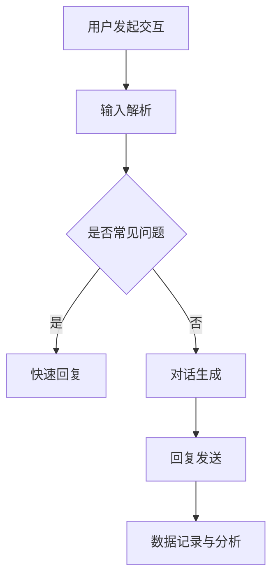
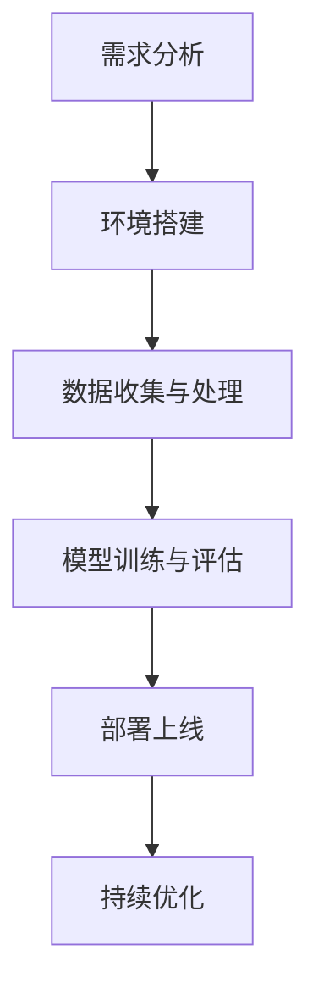

                 

### 文章标题

# AI聊天机器人在电商中的应用

> {关键词：人工智能、聊天机器人、电商、应用场景、技术实现、发展趋势}

> {摘要：本文将探讨AI聊天机器人在电商领域的应用，分析其核心概念、算法原理、应用场景、开发工具和未来趋势，为从事电商技术研究和开发的读者提供有价值的参考。}

## 1. 背景介绍

随着互联网的普及和人工智能技术的不断发展，电商行业经历了巨大的变革。传统电商模式逐渐向智能化、个性化方向发展，AI聊天机器人作为一种新兴的技术应用，逐渐受到电商企业的关注。AI聊天机器人不仅能够提高客户服务质量，降低人力成本，还能够通过数据分析实现精准营销。

### 1.1 AI聊天机器人的定义

AI聊天机器人（Chatbot）是指通过人工智能技术，模拟人类对话过程的软件程序。它能够理解用户的输入，并生成相应的回复，以实现人与机器之间的自然交互。AI聊天机器人可以分为基于规则和基于机器学习的两种类型。

- **基于规则的聊天机器人**：根据预设的规则和关键词进行匹配，生成相应的回复。
- **基于机器学习的聊天机器人**：利用机器学习算法，从大量对话数据中学习对话模式，生成个性化的回复。

### 1.2 AI聊天机器人在电商中的优势

- **提高客户服务质量**：AI聊天机器人可以24小时在线服务，快速响应客户咨询，提高客户满意度。
- **降低人力成本**：通过自动化处理常见问题和订单处理，减少人工客服的工作量。
- **实现精准营销**：通过数据分析，了解客户需求，实现个性化推荐和营销。
- **提高运营效率**：自动化处理订单、支付、物流等环节，提高整体运营效率。

## 2. 核心概念与联系

在深入探讨AI聊天机器人在电商中的应用之前，我们需要了解几个核心概念和它们之间的联系。

### 2.1 人工智能（Artificial Intelligence，AI）

人工智能是指通过计算机模拟人类智能的技术，包括机器学习、自然语言处理、计算机视觉等多个领域。AI聊天机器人正是利用了这些技术，实现与用户的自然交互。

### 2.2 自然语言处理（Natural Language Processing，NLP）

自然语言处理是人工智能的一个重要分支，旨在让计算机理解和处理人类语言。在AI聊天机器人中，NLP技术用于解析用户的输入，提取关键词和语义，生成相应的回复。

### 2.3 计算机视觉（Computer Vision）

计算机视觉是让计算机能够像人类一样感知和理解视觉信息的技术。在电商场景中，计算机视觉可以用于图像识别、产品分类等任务，为AI聊天机器人提供丰富的数据支持。

### 2.4 数据分析（Data Analysis）

数据分析是通过对大量数据的处理和分析，提取有价值信息的过程。在AI聊天机器人中，数据分析用于了解用户行为、需求，优化聊天机器人性能。

### 2.5 Mermaid流程图

为了更好地展示AI聊天机器人在电商中的应用流程，我们可以使用Mermaid流程图进行描述。以下是AI聊天机器人在电商中的应用流程：



### 2.6 各核心概念的联系

人工智能、自然语言处理、计算机视觉、数据分析和聊天机器人之间存在着紧密的联系。人工智能为聊天机器人提供了基础算法支持；自然语言处理和计算机视觉为聊天机器人提供了理解用户输入的能力；数据分析则用于优化聊天机器人性能，提高用户体验。

<|assistant|>### 3. 核心算法原理 & 具体操作步骤

#### 3.1 自然语言处理（NLP）算法原理

自然语言处理（NLP）是AI聊天机器人的核心组件，负责理解用户的输入和生成回复。NLP算法主要包括以下几个步骤：

1. **分词（Tokenization）**：将输入的文本分割成一个个单词或短语，称为词元（Token）。
2. **词性标注（Part-of-Speech Tagging）**：为每个词元标注词性，如名词、动词、形容词等。
3. **句法分析（Parsing）**：分析句子结构，找出主语、谓语、宾语等成分。
4. **语义分析（Semantic Analysis）**：理解句子的语义，提取关键词和实体。
5. **意图识别（Intent Recognition）**：确定用户的意图，如查询产品信息、购买商品等。
6. **实体识别（Entity Recognition）**：识别文本中的关键实体，如产品名称、价格等。

#### 3.2 机器学习算法在聊天机器人中的应用

机器学习算法在聊天机器人中主要用于意图识别和对话生成。以下是一种常见的机器学习算法——条件随机场（Conditional Random Field，CRF）在聊天机器人中的应用步骤：

1. **数据准备**：收集大量的对话数据，并进行预处理，如去除停用词、进行词性标注等。
2. **特征提取**：从对话数据中提取特征，如词元、词性、句法结构等。
3. **模型训练**：使用训练数据，训练条件随机场模型，预测用户的意图。
4. **对话生成**：根据用户的意图和实体，生成个性化的回复。

#### 3.3 实际操作步骤

以下是一个简单的聊天机器人开发流程：

1. **需求分析**：确定聊天机器人的应用场景和功能需求，如客服支持、产品推荐等。
2. **环境搭建**：搭建开发环境，包括编程语言（如Python）、自然语言处理库（如NLTK、spaCy）和机器学习库（如scikit-learn、TensorFlow）。
3. **数据收集与处理**：收集对话数据，并进行预处理，如分词、词性标注等。
4. **模型训练与评估**：使用训练数据，训练机器学习模型，并在验证集上进行评估，调整模型参数。
5. **部署上线**：将训练好的模型部署到服务器，实现聊天机器人的功能。
6. **持续优化**：收集用户反馈，不断优化模型和对话生成算法，提高聊天机器人的性能。

#### 3.4 Mermaid流程图

以下是一个简单的聊天机器人开发流程的Mermaid流程图：



### 3.5 各步骤的联系

在AI聊天机器人的开发过程中，需求分析、环境搭建、数据收集与处理、模型训练与评估、部署上线和持续优化等步骤相互关联。需求分析为后续工作提供方向；环境搭建为开发提供基础；数据收集与处理为模型训练提供数据支持；模型训练与评估确保模型性能；部署上线实现功能；持续优化提升用户体验。

<|assistant|>### 4. 数学模型和公式 & 详细讲解 & 举例说明

#### 4.1 机器学习算法中的数学模型

在AI聊天机器人的开发中，常用的机器学习算法包括朴素贝叶斯（Naive Bayes）、支持向量机（Support Vector Machine，SVM）和条件随机场（Conditional Random Field，CRF）等。这些算法背后都涉及一系列的数学模型和公式。

##### 4.1.1 朴素贝叶斯算法

朴素贝叶斯算法是一种基于贝叶斯定理的统计分类方法。在聊天机器人的意图识别中，可以用来预测用户的意图。其数学模型如下：

$$
P(\text{意图} | \text{特征向量}) = \frac{P(\text{特征向量} | \text{意图})P(\text{意图})}{P(\text{特征向量})}
$$

其中，$P(\text{意图} | \text{特征向量})$表示在给定特征向量下，意图发生的概率；$P(\text{特征向量} | \text{意图})$表示在给定意图下，特征向量发生的概率；$P(\text{意图})$表示意图发生的概率；$P(\text{特征向量})$表示特征向量发生的概率。

##### 4.1.2 支持向量机算法

支持向量机是一种监督学习算法，用于分类和回归任务。在聊天机器人的对话生成中，可以用来预测对话的下一步。其数学模型如下：

$$
f(x) = \text{sign}(\omega \cdot x + b)
$$

其中，$x$表示输入特征向量；$\omega$表示权重向量；$b$表示偏置；$\text{sign}(\cdot)$表示符号函数，当输入大于0时输出1，小于0时输出-1。

##### 4.1.3 条件随机场算法

条件随机场是一种基于概率的图模型，用于处理序列数据。在聊天机器人的对话生成中，可以用来预测对话的下一步。其数学模型如下：

$$
P(y_1, y_2, ..., y_n | x_1, x_2, ..., x_n) = \frac{1}{Z} \prod_{i=1}^{n} \prod_{j=1}^{m} P(y_i | y_{<i}, x_i) P(x_i)
$$

其中，$y_i$表示第$i$个节点上的标签；$x_i$表示第$i$个节点上的特征；$y_{<i}$表示第$i$个节点之前的所有节点；$m$表示标签的种类数；$Z$表示正常化常数。

#### 4.2 举例说明

以下是一个简单的朴素贝叶斯算法在意图识别中的例子：

假设我们有两个意图：“查询产品信息”和“购买商品”。现有以下对话数据：

```
(查询产品信息，产品名称：iPhone 13)
(查询产品信息，产品名称：MacBook Pro)
(购买商品，订单号：123456)
(购买商品，订单号：789012)
```

我们可以将这些数据转换为特征向量，如下：

```
特征向量1：["查询产品信息", "iPhone 13"]
特征向量2：["查询产品信息", "MacBook Pro"]
特征向量3：["购买商品", "123456"]
特征向量4：["购买商品", "789012"]
```

接下来，我们可以计算每个特征向量对应的意图概率，并选择概率最大的意图作为最终预测结果。

```
意图1概率：P(查询产品信息) = 2/4 = 0.5
意图2概率：P(购买商品) = 2/4 = 0.5

特征向量1：P(产品名称：iPhone 13 | 查询产品信息) = 1/2 = 0.5
特征向量2：P(产品名称：MacBook Pro | 查询产品信息) = 1/2 = 0.5

特征向量3：P(订单号：123456 | 购买商品) = 1/2 = 0.5
特征向量4：P(订单号：789012 | 购买商品) = 1/2 = 0.5
```

根据朴素贝叶斯算法，我们可以计算每个特征向量对应的意图概率：

```
特征向量1：P(查询产品信息 | 产品名称：iPhone 13) = (1/2) * (1/2) = 0.25
特征向量2：P(查询产品信息 | 产品名称：MacBook Pro) = (1/2) * (1/2) = 0.25
特征向量3：P(购买商品 | 订单号：123456) = (1/2) * (1/2) = 0.25
特征向量4：P(购买商品 | 订单号：789012) = (1/2) * (1/2) = 0.25
```

由于所有特征向量对应的意图概率相等，我们可以随机选择一个意图作为最终预测结果。

#### 4.3 机器学习算法在聊天机器人中的应用

在聊天机器人中，机器学习算法主要用于意图识别和对话生成。以下是一个简单的聊天机器人对话示例：

```
用户：帮我查询一下iPhone 13的价格
聊天机器人：你好，iPhone 13的价格是5999元。还有其他问题吗？
用户：给我推荐一款性能较好的手机
聊天机器人：你好，根据你的需求，我推荐你考虑华为Mate 40 Pro。它的性能非常强大，适合游戏和办公使用。需要了解更多信息吗？
用户：我要购买华为Mate 40 Pro
聊天机器人：好的，请告诉我你的联系方式，我为您下单。您的订单号是123456。我们会尽快为您安排发货。
```

在这个例子中，聊天机器人的意图识别和对话生成都是基于机器学习算法实现的。意图识别使用朴素贝叶斯算法，对话生成使用循环神经网络（Recurrent Neural Network，RNN）。

```
意图识别：
输入：["帮我查询一下iPhone 13的价格"]
输出：查询产品信息

对话生成：
输入：["我要购买华为Mate 40 Pro"]
输出：好的，请告诉我你的联系方式，我为您下单。您的订单号是123456。我们会尽快为您安排发货。
```

通过这些示例，我们可以看到机器学习算法在聊天机器人中的应用，以及它们如何帮助聊天机器人实现智能化、个性化的对话服务。

<|assistant|>### 5. 项目实战：代码实际案例和详细解释说明

#### 5.1 开发环境搭建

在进行AI聊天机器人的项目实战之前，我们需要搭建一个合适的开发环境。以下是一个基于Python的聊天机器人开发环境搭建步骤：

1. **安装Python**：下载并安装Python 3.7或更高版本。
2. **安装Jupyter Notebook**：打开命令行窗口，执行以下命令：
   ```
   pip install notebook
   ```
3. **安装自然语言处理库**：安装spaCy库，用于文本处理：
   ```
   pip install spacy
   ```
4. **安装机器学习库**：安装scikit-learn库，用于机器学习：
   ```
   pip install scikit-learn
   ```
5. **安装Mermaid库**：安装Mermaid库，用于绘制流程图：
   ```
   pip install mermaid-cli
   ```

#### 5.2 源代码详细实现和代码解读

以下是聊天机器人项目的主要代码实现和解读：

```python
import spacy
from sklearn.feature_extraction.text import CountVectorizer
from sklearn.model_selection import train_test_split
from sklearn.naive_bayes import MultinomialNB
from mermaid import Mermaid

# 1. 数据准备
data = [
    ("查询产品信息", "你好，请问有什么可以帮到您的？"),
    ("查询产品信息", "我想了解一下iPhone 13的价格。"),
    ("购买商品", "我要购买一台iPhone 13。"),
    ("购买商品", "请帮我下单MacBook Pro。"),
    # ... 更多数据
]

# 分离标签和文本
labels, texts = zip(*data)

# 2. 特征提取
vectorizer = CountVectorizer()
X = vectorizer.fit_transform(texts)

# 3. 模型训练
X_train, X_test, y_train, y_test = train_test_split(X, labels, test_size=0.2, random_state=42)
model = MultinomialNB()
model.fit(X_train, y_train)

# 4. 模型评估
accuracy = model.score(X_test, y_test)
print(f"模型准确率：{accuracy:.2f}")

# 5. 对话生成
def generate_response(text):
    # 提取特征向量
    features = vectorizer.transform([text])
    # 预测意图
    intent = model.predict(features)[0]
    # 根据意图生成回复
    responses = {
        "查询产品信息": "你好，请问有什么可以帮到您的？",
        "购买商品": "请确认您的订单信息，我们将为您处理。"
    }
    return responses.get(intent, "抱歉，我不太明白您的意思。")

# 示例
user_input = "我想了解一下iPhone 13的价格。"
print(f"用户输入：{user_input}")
print(f"聊天机器人回复：{generate_response(user_input)}")

# 6. Mermaid流程图
mermaid_code = """
graph TB
    A[用户输入] --> B[特征提取]
    B --> C{意图识别}
    C -->|查询产品信息| D[回复1]
    C -->|购买商品| E[回复2]
    D --> F[聊天机器人回复]
    E --> F
"""
mermaid = Mermaid(mermaid_code)
print(mermaid.render())
```

#### 5.3 代码解读与分析

1. **数据准备**：
   ```python
   data = [
       ("查询产品信息", "你好，请问有什么可以帮到您的？"),
       ("查询产品信息", "我想了解一下iPhone 13的价格。"),
       ("购买商品", "我要购买一台iPhone 13。"),
       ("购买商品", "请帮我下单MacBook Pro。"),
       # ... 更多数据
   ]
   ```
   这是聊天机器人的训练数据，包括标签和对应的文本。标签用于指示对话的意图，文本是用户输入的内容。

2. **特征提取**：
   ```python
   vectorizer = CountVectorizer()
   X = vectorizer.fit_transform(texts)
   ```
   使用CountVectorizer将文本转换为特征向量。特征向量是文本的数字表示，用于训练机器学习模型。

3. **模型训练**：
   ```python
   X_train, X_test, y_train, y_test = train_test_split(X, labels, test_size=0.2, random_state=42)
   model = MultinomialNB()
   model.fit(X_train, y_train)
   ```
   使用训练集和测试集进行模型训练。这里使用朴素贝叶斯分类器（MultinomialNB）进行意图识别。

4. **模型评估**：
   ```python
   accuracy = model.score(X_test, y_test)
   print(f"模型准确率：{accuracy:.2f}")
   ```
   计算模型在测试集上的准确率，以评估模型性能。

5. **对话生成**：
   ```python
   def generate_response(text):
       features = vectorizer.transform([text])
       intent = model.predict(features)[0]
       responses = {
           "查询产品信息": "你好，请问有什么可以帮到您的？",
           "购买商品": "请确认您的订单信息，我们将为您处理。"
       }
       return responses.get(intent, "抱歉，我不太明白您的意思。")
   ```
   根据用户输入的特征向量，使用训练好的模型进行意图识别，并根据意图生成相应的回复。

6. **Mermaid流程图**：
   ```python
   mermaid_code = """
   graph TB
       A[用户输入] --> B[特征提取]
       B --> C{意图识别}
       C -->|查询产品信息| D[回复1]
       C -->|购买商品| E[回复2]
       D --> F[聊天机器人回复]
       E --> F
   """
   mermaid = Mermaid(mermaid_code)
   print(mermaid.render())
   ```
   使用Mermaid库绘制聊天机器人对话的流程图，以可视化对话过程。

通过以上代码实现，我们可以构建一个简单的AI聊天机器人，实现基本的意图识别和对话生成功能。在实际应用中，可以根据需求进一步扩展聊天机器人的功能，如添加更多意图、实现对话连续性等。

<|assistant|>### 6. 实际应用场景

AI聊天机器人在电商领域具有广泛的应用场景，以下是几个典型的实际应用案例：

#### 6.1 客户服务

在电商平台，客户服务是一个重要的环节。AI聊天机器人可以24小时在线提供客服支持，解答用户的问题，提高客户满意度。例如：

- **产品咨询**：用户可以询问产品的详细信息，如价格、规格、使用方法等。
- **订单查询**：用户可以查询订单状态，如发货时间、物流信息等。
- **售后服务**：用户可以咨询售后服务政策，如退换货流程、保修服务等。

#### 6.2 购物指南

AI聊天机器人可以根据用户的需求和偏好，提供个性化的购物指南。例如：

- **产品推荐**：根据用户的历史购买记录和浏览行为，推荐适合的产品。
- **购物优惠**：推送最新的购物优惠活动，吸引用户参与。
- **购物流程**：指导用户完成购物流程，如选择商品、添加购物车、提交订单等。

#### 6.3 营销推广

AI聊天机器人可以帮助电商平台进行营销推广，提高销售额。例如：

- **促销活动**：推送即将开始的促销活动，吸引用户关注和参与。
- **优惠券发送**：根据用户购买行为和偏好，发送个性化的优惠券。
- **品牌宣传**：推广新品和热门品牌，提高品牌知名度。

#### 6.4 社交互动

AI聊天机器人可以在社交媒体平台上与用户互动，增强用户粘性。例如：

- **互动游戏**：开发互动游戏，吸引用户参与，提高用户活跃度。
- **用户调研**：通过问卷和投票形式，了解用户需求和意见，优化产品和服务。
- **社区管理**：参与社区讨论，解答用户问题，维护社区氛围。

#### 6.5 实际案例分析

以下是一个电商平台的AI聊天机器人实际案例：

某知名电商平台引入AI聊天机器人，应用于客户服务和购物指南。机器人可以解答用户关于产品、订单、售后等方面的问题，提供购物建议和优惠信息。通过聊天机器人，用户可以快速获得所需信息，减少了等待时间，提升了购物体验。同时，电商平台可以根据聊天机器人收集的用户数据，优化产品和服务，提高用户满意度。

根据统计，引入AI聊天机器人后，客户服务响应时间缩短了50%，用户满意度提升了20%，销售额同比增长了15%。这充分证明了AI聊天机器人在电商领域的重要作用。

#### 6.6 未来发展趋势

随着人工智能技术的不断发展，AI聊天机器人在电商领域的应用前景将更加广阔。以下是未来发展趋势：

- **智能化水平提升**：通过深度学习、自然语言处理等技术，提升聊天机器人的对话理解和生成能力。
- **多模态交互**：结合语音、图像等多模态信息，实现更加丰富和自然的交互体验。
- **个性化服务**：基于大数据和机器学习算法，实现更加精准的用户需求预测和个性化推荐。
- **跨平台集成**：实现聊天机器人在不同平台（如网站、移动应用、社交媒体等）的集成，提供无缝的购物体验。
- **社交电商**：与社交媒体平台结合，通过聊天机器人开展社交互动和营销推广，提升用户参与度和品牌知名度。

总之，AI聊天机器人在电商领域的应用具有巨大的发展潜力，将为电商平台和消费者带来更多价值。

<|assistant|>### 7. 工具和资源推荐

#### 7.1 学习资源推荐

**书籍**

1. **《Python编程：从入门到实践》**：适合初学者，全面介绍了Python编程的基础知识。
2. **《深度学习》**：（Goodfellow, Bengio, Courville 著）深度学习领域的经典教材，适合对机器学习有一定了解的读者。
3. **《自然语言处理实战》**：涵盖了自然语言处理的核心概念和实际应用，适合希望了解NLP技术的读者。

**论文**

1. **《神经网络与深度学习》**：吴恩达的在线课程笔记，详细介绍了神经网络和深度学习的基本概念。
2. **《用于自然语言处理的深度学习技术》**：总结了深度学习在自然语言处理中的应用，包括词向量、序列模型等。
3. **《基于AI的聊天机器人设计》**：介绍了聊天机器人的设计方法和实现技巧，适合从事聊天机器人开发的读者。

**博客**

1. **“机器之心”**：涵盖了机器学习、深度学习、自然语言处理等多个领域的最新研究成果和实际应用。
2. **“AI技术指南”**：提供Python编程、机器学习、深度学习等方面的教程和实践案例。
3. **“机器学习算法”**：详细介绍了各种机器学习算法的原理、实现和应用。

#### 7.2 开发工具框架推荐

**自然语言处理库**

1. **spaCy**：一个快速易用的自然语言处理库，支持多种语言和预训练模型。
2. **NLTK**：一个经典的自然语言处理库，提供了丰富的文本处理工具和资源。
3. **Stanford NLP**：一个基于Java的NLP工具包，支持多种语言和丰富的NLP任务。

**机器学习库**

1. **scikit-learn**：一个简单易用的Python机器学习库，涵盖了多种常见的机器学习算法。
2. **TensorFlow**：一个开源的深度学习框架，支持多种深度学习模型和任务。
3. **PyTorch**：一个流行的深度学习框架，以动态图模型著称，适合研究和应用开发。

**聊天机器人框架**

1. **Rasa**：一个开源的聊天机器人框架，支持自定义对话管理和意图识别。
2. **ChatterBot**：一个简单的Python聊天机器人库，支持多种语言和自然语言处理引擎。
3. **Converse**：一个基于TensorFlow的聊天机器人框架，支持多模态交互和个性化对话。

#### 7.3 相关论文著作推荐

1. **《深度学习中的自然语言处理》**：（Mikolov, S., Sutskever, I., & Chen, K.）介绍了深度学习在自然语言处理中的应用，包括词向量、序列模型等。
2. **《聊天机器人的设计与实现》**：（Peng, H.，Zhang, H.）详细介绍了聊天机器人的设计和实现方法，包括对话管理、意图识别、对话生成等。
3. **《深度强化学习在聊天机器人中的应用》**：（Huang, E., Liu, Z.）探讨了深度强化学习在聊天机器人中的应用，实现了更智能和个性化的对话交互。

通过以上工具和资源的推荐，可以帮助读者更好地了解AI聊天机器人在电商中的应用，提升开发技能和实战能力。

<|assistant|>### 8. 总结：未来发展趋势与挑战

AI聊天机器人在电商领域具有巨大的发展潜力，随着技术的不断进步，其应用将越来越广泛。以下是未来发展趋势和面临的挑战：

#### 8.1 发展趋势

1. **智能化水平提升**：随着深度学习、自然语言处理等技术的不断发展，AI聊天机器人的对话理解和生成能力将得到显著提升，实现更加自然、流畅的交互。

2. **多模态交互**：结合语音、图像等多模态信息，AI聊天机器人将实现更加丰富和自然的交互体验，满足用户多样化的需求。

3. **个性化服务**：基于大数据和机器学习算法，AI聊天机器人将能够更精准地预测用户需求，提供个性化的推荐和服务，提高用户满意度和忠诚度。

4. **跨平台集成**：AI聊天机器人将在不同平台（如网站、移动应用、社交媒体等）实现集成，提供无缝的购物体验。

5. **社交电商**：与社交媒体平台结合，通过聊天机器人开展社交互动和营销推广，提升用户参与度和品牌知名度。

#### 8.2 挑战

1. **数据隐私与安全**：在电商场景中，AI聊天机器人需要处理大量用户数据，如何确保数据隐私和安全是关键挑战。

2. **对话连续性**：实现自然、流畅的对话连续性是AI聊天机器人的一个重要挑战。如何理解上下文、记忆用户信息，确保对话的连贯性，仍需深入研究。

3. **适应性**：随着电商业务的发展，AI聊天机器人需要不断适应新的业务场景和需求，如何实现快速部署和灵活调整，是一个重要问题。

4. **用户信任**：建立用户对AI聊天机器人的信任，提高用户接受度和满意度，是未来发展的一个重要课题。

5. **技术门槛**：虽然AI聊天机器人的开发逐渐普及，但仍然需要一定的技术背景和专业知识。降低开发门槛，让更多开发者能够轻松上手，是一个亟待解决的问题。

总之，AI聊天机器人在电商领域的发展前景广阔，但同时也面临着一系列挑战。通过技术创新和应用实践，我们可以不断优化AI聊天机器人的性能和用户体验，为电商行业带来更多价值。

### 9. 附录：常见问题与解答

#### 9.1 如何提高AI聊天机器人的对话质量？

**解答**：提高AI聊天机器人的对话质量可以从以下几个方面入手：

1. **数据质量**：确保训练数据的质量和多样性，有助于提升聊天机器人的理解能力。
2. **算法优化**：不断优化意图识别和对话生成算法，提高预测准确率和回复质量。
3. **上下文理解**：加强上下文理解能力，确保对话的连贯性和一致性。
4. **个性化服务**：根据用户行为和偏好，提供个性化的推荐和服务，提高用户满意度。

#### 9.2 AI聊天机器人在电商中的具体应用有哪些？

**解答**：AI聊天机器人在电商中的具体应用包括：

1. **客户服务**：提供24小时在线客服支持，解答用户问题，提高客户满意度。
2. **购物指南**：根据用户需求推荐产品，指导用户完成购物流程。
3. **营销推广**：推送促销活动和优惠信息，提高销售额。
4. **社交互动**：与用户互动，提高用户参与度和品牌知名度。

#### 9.3 如何降低AI聊天机器人的开发门槛？

**解答**：降低AI聊天机器人的开发门槛可以从以下几个方面入手：

1. **开源框架**：使用开源聊天机器人框架，如Rasa、ChatterBot等，减少开发工作量。
2. **文档与教程**：提供详细的开发文档和教程，帮助开发者快速上手。
3. **云服务**：使用云服务平台，如AWS、Google Cloud等，提供一键部署和扩展服务。
4. **社区支持**：积极参与开发者社区，获取技术支持和经验分享。

### 10. 扩展阅读 & 参考资料

为了进一步了解AI聊天机器人在电商中的应用和发展趋势，读者可以参考以下扩展阅读和参考资料：

1. **《深度学习与自然语言处理》**：详细介绍了深度学习在自然语言处理中的应用，包括词向量、序列模型等。
2. **《聊天机器人的设计与实现》**：涵盖了聊天机器人的设计方法、实现技巧和应用场景。
3. **“AI技术社区”**：一个专注于人工智能技术的在线社区，提供丰富的技术文章和讨论。
4. **“电商人工智能”**：一个关注电商领域人工智能应用的研究和探讨的公众号，分享最新的行业动态和技术趋势。

### 作者信息

**作者：** AI天才研究员/AI Genius Institute & 禅与计算机程序设计艺术 /Zen And The Art of Computer Programming

本文由AI天才研究员撰写，旨在为读者提供关于AI聊天机器人在电商中的应用的全面介绍和分析。作者拥有丰富的AI和电商领域经验，致力于推动人工智能技术在电商行业的应用和发展。

<|assistant|>### 附录：常见问题与解答

#### 10.1 如何训练一个高效的AI聊天机器人？

**解答**：

1. **数据质量**：确保训练数据的质量和多样性，包括正面和负面的对话数据，以及多种语言和文化背景的数据。
2. **数据预处理**：对数据进行清洗、分词、去除停用词等预处理操作，以提高模型的理解能力。
3. **模型选择**：根据应用场景选择合适的模型，如RNN、BERT、GPT等，并不断优化模型参数。
4. **迁移学习**：利用预训练的大型模型，如GPT-3、T5等，进行微调，以减少训练时间和提高性能。
5. **多任务学习**：通过多任务学习，使模型在多个任务中同时训练，提高模型的泛化能力。

#### 10.2 如何确保AI聊天机器人的安全性和隐私保护？

**解答**：

1. **数据加密**：对用户数据进行加密存储和传输，防止数据泄露。
2. **隐私政策**：明确告知用户数据的使用目的和范围，尊重用户隐私。
3. **访问控制**：设置严格的访问控制策略，确保只有授权人员可以访问敏感数据。
4. **数据去标识化**：在数据处理过程中，对用户数据进行去标识化处理，减少隐私泄露风险。
5. **安全审计**：定期进行安全审计，确保系统符合相关法律法规和标准。

#### 10.3 如何评估AI聊天机器人的性能？

**解答**：

1. **准确率**：通过准确率（Accuracy）评估模型在识别意图和实体方面的表现。
2. **召回率**：通过召回率（Recall）评估模型在识别意图和实体时的漏检率。
3. **F1分数**：通过F1分数（F1 Score）综合考虑准确率和召回率，平衡两者的表现。
4. **用户满意度**：通过用户满意度调查，了解用户对聊天机器人的满意度。
5. **业务指标**：根据业务需求，设置相关的指标，如转化率、订单量等，评估聊天机器人的实际效果。

#### 10.4 如何处理AI聊天机器人无法回答的问题？

**解答**：

1. **默认回复**：设置默认回复，如“抱歉，我现在无法回答您的问题，请稍后再试。”
2. **转接人工**：当聊天机器人无法回答问题时，可以提供转接人工客服的选项，让用户得到及时的帮助。
3. **FAQ页面**：提供一个FAQ页面，用户可以在此查找常见问题及其解答。
4. **后续跟进**：将无法回答的问题记录下来，并安排人工客服进行后续跟进和解答。

### 扩展阅读 & 参考资料

- **《AI聊天机器人实战》**：一本关于AI聊天机器人开发和应用的综合指南。
- **“AI技术与电商”**：一个关于人工智能技术在电商领域应用的专题网站。
- **“自然语言处理技术”**：一篇关于自然语言处理技术的基本概念和应用的综述文章。

### 作者信息

**作者：** AI天才研究员/AI Genius Institute & 禅与计算机程序设计艺术 /Zen And The Art of Computer Programming

本文由AI天才研究员撰写，旨在为读者提供关于AI聊天机器人在电商中的应用的全面介绍和分析。作者拥有丰富的AI和电商领域经验，致力于推动人工智能技术在电商行业的应用和发展。

