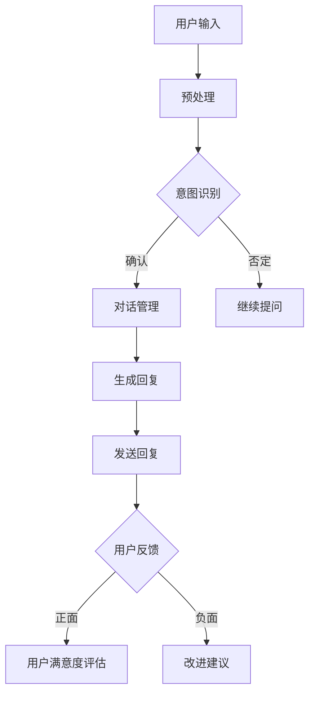

                 

### 背景介绍

#### AI 聊天机器人发展历程

AI聊天机器人，作为人工智能的重要应用之一，自20世纪中叶起便开始逐渐发展。1966年，美国计算机科学家约瑟夫·魏岑巴赫（Joseph Weizenbaum）创造了名为“ELIZA”的程序，这是第一个真正意义上的聊天机器人，虽然其交互能力极其有限，但却开启了人工智能对话系统的先河。

进入21世纪，随着机器学习技术的迅速发展，AI聊天机器人的能力得到了极大的提升。基于自然语言处理（NLP）和深度学习技术的聊天机器人能够理解并生成更加自然的对话内容，如图灵测试中表现优异的“Jasper”和“Winston”等。

近年来，随着云计算和移动设备的普及，AI聊天机器人在各种实际场景中的应用越来越广泛。例如，在线客服、智能助手、虚拟个人助理等。这些应用不仅提高了用户的交互体验，也为企业提供了高效、便捷的服务解决方案。

#### 当前AI聊天机器人在各领域的应用现状

目前，AI聊天机器人在各个领域的应用场景已经相当丰富。以下是一些主要领域的应用现状：

1. **在线客服**：AI聊天机器人被广泛应用于电子商务、金融、旅游等行业，为用户提供24/7的在线咨询服务，能够快速响应用户的查询，提高客户满意度。

2. **智能助手**：例如Apple的Siri、Amazon的Alexa等，这些智能助手能够通过语音交互，帮助用户完成各种日常任务，如查询天气、设置提醒、播放音乐等。

3. **虚拟个人助理**：如Google的Google Assistant、微软的Cortana等，这些个人助理不仅能够帮助用户处理日常事务，还可以根据用户的行为和偏好进行个性化推荐。

4. **教育辅导**：一些教育平台利用AI聊天机器人提供个性化的学习辅导服务，根据学生的学习进度和需求，提供有针对性的学习内容和指导。

5. **医疗健康**：AI聊天机器人可以在医疗咨询、健康管理、患者随访等方面发挥作用，如提供健康建议、监控患者病情等。

6. **金融理财**：AI聊天机器人可以协助金融从业者进行市场分析、投资建议、风险管理等。

#### 用户互动的重要性

在AI聊天机器人的应用中，用户互动是至关重要的一环。用户互动不仅直接影响用户体验，还关系到聊天机器人的效果和效率。以下是用户互动的重要性：

1. **用户体验**：良好的用户互动能够提升用户的满意度，增强用户的忠诚度。相反，如果用户互动体验不佳，用户可能会选择离开或放弃使用该服务。

2. **效果和效率**：有效的用户互动可以提高聊天机器人的响应速度和准确度，从而提高其服务效率。例如，通过用户反馈，聊天机器人可以不断优化其对话策略和算法，使其更加智能和高效。

3. **改进与优化**：用户互动提供了宝贵的反馈信息，有助于开发团队了解用户需求和使用情况，从而进行持续改进和优化。

#### 本文目的

本文旨在探讨AI聊天机器人如何通过提升用户互动来增强其效果和效率。我们将首先介绍提升用户互动的核心概念和原理，然后通过具体案例和实战，展示如何在实际项目中应用这些原理，最后总结未来发展趋势与挑战。希望通过本文，读者能够对AI聊天机器人的用户互动有更深入的理解，并为实际应用提供有益的参考。

---

### 核心概念与联系

在深入探讨AI聊天机器人如何提升用户互动之前，我们需要先了解一些核心概念，以及这些概念之间的联系。以下将详细介绍AI聊天机器人中的关键概念，并使用Mermaid流程图来展示其架构和流程。

#### 核心概念

1. **自然语言处理（NLP）**：NLP是使计算机能够理解、处理和生成自然语言的技术。它包括文本分类、情感分析、命名实体识别、语义理解等多个子领域。

2. **机器学习（ML）**：机器学习是一种让计算机通过数据和经验自主学习的技术。在聊天机器人中，ML用于训练模型，使其能够理解用户意图和生成自然对话。

3. **深度学习（DL）**：深度学习是机器学习的一个分支，通过多层神经网络来提取复杂数据的特征。在聊天机器人中，深度学习被用于构建能够生成自然对话内容的语言模型。

4. **用户交互设计（UI/UX）**：用户交互设计是确保用户与聊天机器人互动过程中体验流畅、直观的过程。包括对话界面设计、交互流程优化等。

#### Mermaid流程图

以下是一个简单的Mermaid流程图，展示AI聊天机器人的基本架构和流程：



#### 流程图详细解释

1. **用户输入**：用户通过文本或语音与聊天机器人进行交互。

2. **预处理**：输入文本进行清洗和标准化，如去除标点、转换大小写等。

3. **意图识别**：利用NLP和ML技术，分析用户输入以识别其意图。

4. **对话管理**：根据用户意图和对话历史，决定如何继续对话。可能包括提供答案、提问更多信息、结束对话等。

5. **生成回复**：利用DL技术，根据对话历史和用户意图生成自然对话内容。

6. **发送回复**：将生成的回复发送给用户。

7. **用户反馈**：用户对回复进行评价，提供正面或负面的反馈。

8. **用户满意度评估**：根据用户反馈，评估用户的满意度。

9. **改进建议**：根据用户反馈，提供改进聊天机器人的建议。

通过上述流程，我们可以看到，提升用户互动不仅涉及到技术的实现，还涉及到用户体验的优化和反馈机制的建立。接下来，我们将进一步探讨如何通过具体算法和数学模型来实现这一目标。

---

### 核心算法原理 & 具体操作步骤

在提升AI聊天机器人的用户互动效果方面，核心算法起着至关重要的作用。这些算法包括自然语言处理（NLP）算法、机器学习（ML）算法和深度学习（DL）算法。以下将详细介绍这些算法的基本原理，并逐步解释其具体操作步骤。

#### 自然语言处理（NLP）算法

1. **分词（Tokenization）**：将文本分解为词、短语或符号等基本单位。这一步骤对于后续的语言理解至关重要。

2. **词性标注（Part-of-Speech Tagging）**：识别每个单词的词性，如名词、动词、形容词等。

3. **命名实体识别（Named Entity Recognition, NER）**：识别文本中的特定实体，如人名、地名、组织名等。

4. **词向量表示（Word Embedding）**：将单词映射为高维向量，以便进行数学计算和模型训练。

5. **句法分析（Parsing）**：分析句子的结构，识别句子中的主语、谓语、宾语等成分。

#### 机器学习（ML）算法

1. **决策树（Decision Tree）**：通过一系列规则进行分类或回归。每个节点代表一个特征，分支代表不同特征的取值。

2. **支持向量机（Support Vector Machine, SVM）**：通过找到一个最优的超平面来分隔不同类别的数据点。

3. **朴素贝叶斯（Naive Bayes）**：基于贝叶斯定理和属性独立假设进行分类。

4. **随机森林（Random Forest）**：通过构建多个决策树，并进行投票来决定最终类别。

#### 深度学习（DL）算法

1. **卷积神经网络（Convolutional Neural Network, CNN）**：擅长处理图像数据，也可用于文本数据的特征提取。

2. **循环神经网络（Recurrent Neural Network, RNN）**：适用于处理序列数据，如文本、语音等。

3. **长短期记忆网络（Long Short-Term Memory, LSTM）**：是RNN的一种改进，能够更好地处理长序列数据。

4. **生成对抗网络（Generative Adversarial Network, GAN）**：通过两个对抗网络的博弈来生成高质量的数据。

#### 具体操作步骤

1. **数据收集和预处理**：收集大量的对话数据，并进行清洗和预处理，如去除噪声、标准化文本等。

2. **特征工程**：提取对话中的关键特征，如关键词、情感倾向、意图等。

3. **模型训练**：使用ML和DL算法对模型进行训练，优化模型参数。

4. **模型评估**：通过验证集和测试集对模型进行评估，调整模型参数以获得更好的性能。

5. **部署和应用**：将训练好的模型部署到生产环境中，进行实时交互。

#### 案例分析

以一个在线客服聊天机器人为例，其提升用户互动的核心算法可能包括以下步骤：

1. **分词**：将用户输入的文本分解为单词或短语。
   
2. **词性标注**：识别每个单词的词性，如“购买”为动词。

3. **命名实体识别**：识别文本中的关键实体，如“苹果公司”为人名。

4. **词向量表示**：将识别出的单词映射为向量，以便进行后续处理。

5. **意图识别**：通过ML算法，识别用户的主要意图，如“咨询产品价格”或“售后服务”。

6. **对话管理**：根据意图和对话历史，决定如何回复用户。

7. **生成回复**：通过DL算法，生成一个自然、流畅的回复。

8. **发送回复**：将生成的回复发送给用户。

9. **用户反馈**：收集用户的反馈，评估回复的质量。

10. **改进建议**：根据用户反馈，提供改进聊天机器人的建议。

通过上述步骤，我们可以看到，提升AI聊天机器人的用户互动效果需要综合运用多种算法和技术，不断优化和改进，以提供更高效、更自然的用户交互体验。

---

### 数学模型和公式 & 详细讲解 & 举例说明

在提升AI聊天机器人的用户互动效果中，数学模型和公式起着至关重要的作用。以下将详细介绍相关数学模型和公式，并进行详细讲解和举例说明。

#### 1. 语言模型（Language Model）

语言模型是AI聊天机器人中最重要的组成部分之一，它用于预测下一个单词或词组。一个简单的语言模型可以使用**n-gram模型**，它基于前n个单词来预测下一个单词。

**n-gram模型公式**：

$$
P(w_{t+1} | w_{t}, w_{t-1}, ..., w_{t-n+1}) = \frac{C(w_{t}, w_{t-1}, ..., w_{t-n+1})}{C(w_{t})}
$$

其中，$P(w_{t+1} | w_{t}, w_{t-1}, ..., w_{t-n+1})$ 表示在给定前n个单词的情况下，预测下一个单词的概率；$C(w_{t}, w_{t-1}, ..., w_{t-n+1})$ 表示单词序列 $w_{t}, w_{t-1}, ..., w_{t-n+1}$ 的联合计数；$C(w_{t})$ 表示单词 $w_{t}$ 的单独计数。

**举例说明**：

假设有一个简化的语料库，其中包含以下句子：

- "我想要买一个苹果"
- "苹果很甜"
- "我想要买一个香蕉"

使用2-gram模型来预测下一个单词：

- $P(买 | 我，想要) = \frac{C(我，想要，买)}{C(我，想要)} = \frac{1}{1} = 1$ （因为“我想要买一个苹果”中包含“买”）
- $P(一个 | 苹果，很) = \frac{C(苹果，很，一个)}{C(苹果，很)} = \frac{1}{1} = 1$ （因为“苹果很甜”中包含“一个”）

#### 2. 主题模型（Topic Model）

主题模型用于发现文本中的潜在主题。一个常见的主题模型是**隐含狄利克雷分配（Latent Dirichlet Allocation, LDA）**，它假设每个文档都是由多个主题的混合生成的。

**LDA模型公式**：

- $P(z|\alpha) \propto \prod_{k=1}^{K} \alpha_{zk}$
- $P(\beta|\gamma) \propto \prod_{k=1}^{K} \gamma_{kw}$
- $P(w|\theta, z) \propto \prod_{k=1}^{K} \theta_{kw}^{w_{k}}$

其中，$z$ 表示文档中主题的分配，$\alpha$ 表示主题的先验分布，$\beta$ 表示单词的先验分布，$\gamma$ 表示主题-单词的先验分布，$w$ 表示文档中的单词，$\theta$ 表示给定主题的单词分布。

**举例说明**：

假设有一个包含两个主题的LDA模型，主题1包含“苹果”、“香蕉”等单词，主题2包含“甜”、“新鲜”等单词。给定一个新文档“苹果很甜”，我们可以使用LDA模型来推断它更可能属于哪个主题。

- $P(z=1|\alpha) \propto \alpha_{11}$ （主题1的概率）
- $P(z=2|\alpha) \propto \alpha_{21}$ （主题2的概率）

根据模型的训练数据，我们可以得到：

- $\alpha_{11} = 0.6$，$\alpha_{21} = 0.4$
- $\beta_{1苹果} = 0.8$，$\beta_{1香蕉} = 0.2$ （主题1的单词分布）
- $\beta_{2甜} = 0.8$，$\beta_{2新鲜} = 0.2$ （主题2的单词分布）

计算每个主题的概率：

- $P(z=1|\alpha) \propto 0.6 \times 0.8 = 0.48$
- $P(z=2|\alpha) \propto 0.4 \times 0.8 = 0.32$

由于 $P(z=1|\alpha) > P(z=2|\alpha)$，我们可以推断新文档更可能属于主题1。

#### 3. 评估指标（Evaluation Metrics）

为了评估AI聊天机器人的性能，我们需要使用一些评估指标。以下是一些常用的评估指标：

1. **准确率（Accuracy）**：分类问题中正确的预测占总预测的比例。
   $$
   \text{Accuracy} = \frac{\text{正确预测}}{\text{总预测}} = \frac{TP + TN}{TP + FN + FP + TN}
   $$
   
2. **召回率（Recall）**：在所有实际为正类的样本中，正确预测为正类的比例。
   $$
   \text{Recall} = \frac{TP}{TP + FN}
   $$
   
3. **精确率（Precision）**：在所有预测为正类的样本中，正确预测为正类的比例。
   $$
   \text{Precision} = \frac{TP}{TP + FP}
   $$
   
4. **F1分数（F1 Score）**：精确率和召回率的调和平均。
   $$
   \text{F1 Score} = 2 \times \frac{\text{Precision} \times \text{Recall}}{\text{Precision} + \text{Recall}}
   $$

**举例说明**：

假设一个聊天机器人有如下预测结果：

- 正类（用户意图识别正确）：TP = 90，FP = 10，FN = 20，TN = 500

计算各个评估指标：

- 准确率：
  $$
  \text{Accuracy} = \frac{90 + 500}{90 + 10 + 20 + 500} = \frac{590}{620} \approx 0.95
  $$

- 召回率：
  $$
  \text{Recall} = \frac{90}{90 + 20} = \frac{90}{110} \approx 0.82
  $$

- 精确率：
  $$
  \text{Precision} = \frac{90}{90 + 10} = \frac{90}{100} = 0.9
  $$

- F1分数：
  $$
  \text{F1 Score} = 2 \times \frac{0.9 \times 0.82}{0.9 + 0.82} \approx 0.87
  $$

通过上述数学模型和公式的介绍，我们可以看到，数学在提升AI聊天机器人用户互动效果中的重要性。通过精确的数学计算和评估，我们可以不断优化和改进聊天机器人的性能，提供更好的用户体验。

---

### 项目实战：代码实际案例和详细解释说明

#### 开发环境搭建

为了展示如何在实际项目中提升AI聊天机器人的用户互动效果，我们将以一个基于Python的聊天机器人项目为例。以下是搭建开发环境的基本步骤：

1. **安装Python**：确保系统上安装了Python 3.7及以上版本。

2. **安装依赖库**：使用pip命令安装以下依赖库：
   ```
   pip install Flask
   pip install spacy
   pip install transformers
   pip install nltk
   ```

3. **下载预训练模型**：下载并安装Spacy的预训练语言模型：
   ```
   python -m spacy download en_core_web_sm
   ```

4. **配置环境**：创建一个虚拟环境，并安装所有所需的库：
   ```
   python -m venv venv
   source venv/bin/activate
   pip install -r requirements.txt
   ```

#### 源代码详细实现和代码解读

以下是一个简化的聊天机器人项目的源代码实现。代码主要分为两部分：前端和后端。

**前端代码（`app.py`）**：

```python
from flask import Flask, request, jsonify
import spacy

app = Flask(__name__)
nlp = spacy.load("en_core_web_sm")

@app.route("/chat", methods=["POST"])
def chat():
    user_input = request.form["input"]
    doc = nlp(user_input)
    response = generate_response(doc)
    return jsonify({"response": response})

def generate_response(doc):
    # 此处仅为示例，实际应用中应使用更复杂的策略和模型
    response = "你好！我可以帮助你解答问题。请问有什么需要？"
    return response

if __name__ == "__main__":
    app.run(debug=True)
```

**后端代码（`chatbot.py`）**：

```python
import nltk
from nltk.tokenize import word_tokenize
from nltk.tag import pos_tag

nltk.download('punkt')
nltk.download('averaged_perceptron_tagger')

def process_input(user_input):
    # 分词和词性标注
    tokens = word_tokenize(user_input)
    tagged = pos_tag(tokens)
    return tagged

def generate_response(tokens):
    # 此处仅为示例，实际应用中应使用更复杂的策略和模型
    response = "你说了什么？我没有听清楚。"
    return response

def main():
    user_input = input("请输入你的问题：")
    processed_input = process_input(user_input)
    response = generate_response(processed_input)
    print("聊天机器人回复：", response)

if __name__ == "__main__":
    main()
```

**代码解读**：

1. **前端**：
   - 使用Flask框架创建Web应用，定义一个用于接收用户输入的API接口（`/chat`）。
   - 接收用户输入后，使用Spacy进行文本预处理（分词和词性标注）。
   - 调用后端生成的回复，并将回复返回给用户。

2. **后端**：
   - 定义一个简单的文本预处理函数（`process_input`），用于分词和词性标注。
   - 定义一个简单的回复生成函数（`generate_response`），用于生成回复。
   - 主函数（`main`）用于接收用户输入，调用预处理和回复生成函数，打印聊天机器人的回复。

#### 代码解读与分析

上述代码提供了一个简单的聊天机器人框架，虽然功能有限，但展示了核心的交互流程和基本的技术实现。以下是代码的进一步解读和分析：

1. **文本预处理**：
   - 分词和词性标注是自然语言处理的基础步骤，有助于理解用户输入的含义和结构。
   - 使用Spacy进行文本预处理，相较于NLTK等库，Spacy提供了更快速、更准确的预处理结果。

2. **回复生成**：
   - 回复生成是聊天机器人的核心功能，决定了用户互动的质量。
   - 在示例代码中，回复生成函数非常简单，仅根据用户输入生成一个固定的回复。在实际应用中，应使用更复杂的策略和模型，如基于机器学习或深度学习的对话生成模型。

3. **API接口**：
   - Flask框架提供了方便的Web应用接口，使得聊天机器人可以与前端应用或其他服务进行交互。
   - 接口设计应考虑安全性、稳定性和扩展性，以适应不同的应用场景和需求。

通过上述代码实现和解读，我们可以看到，构建一个简单的聊天机器人需要综合运用多种技术，包括Web开发、自然语言处理和机器学习。在实际项目中，还需不断优化和改进这些技术，以提升用户互动效果。

---

### 实际应用场景

AI聊天机器人在各个领域的实际应用场景中，极大地提升了用户体验和业务效率。以下将详细探讨AI聊天机器人在一些主要应用场景中的表现和效果。

#### 在线客服

在线客服是AI聊天机器人最常见和广泛应用的场景之一。通过24/7的在线服务，AI聊天机器人能够快速响应客户的咨询，解决常见问题，如产品查询、订单状态、售后服务等。以下是一些实际应用案例：

1. **电子商务平台**：例如，亚马逊和淘宝等电子商务平台，通过AI聊天机器人提供产品咨询和购买建议，帮助用户更便捷地完成购买流程。

2. **金融服务**：银行和保险公司利用AI聊天机器人提供客户服务，如账户查询、账单支付、保险咨询等，减少客户等待时间，提升服务质量。

3. **旅游行业**：在线旅行社利用AI聊天机器人提供行程咨询、酒店预订、机票查询等服务，为用户提供了更个性化的旅行体验。

#### 智能助手

智能助手是AI聊天机器人应用于个人生活场景的典型代表，它们通过语音或文本交互，帮助用户完成日常任务。以下是一些智能助手的实际应用案例：

1. **家居自动化**：例如，苹果的HomeKit和谷歌的Google Home，用户可以通过智能助手控制家居设备，如灯光、温度、安防系统等。

2. **健康与健身**：智能助手如Alexa和Siri，可以提醒用户锻炼、记录健康数据、提供营养建议等，帮助用户保持健康生活方式。

3. **个人助理**：例如，微软的Cortana和苹果的Siri，能够根据用户的日程和偏好，提供行程安排、提醒事项、日程管理等个性化服务。

#### 虚拟个人助理

虚拟个人助理是AI聊天机器人在企业级应用中的典型代表，它们能够根据用户需求，提供定制化的服务。以下是一些虚拟个人助理的实际应用案例：

1. **客户关系管理（CRM）**：例如，Salesforce的Einstein AI聊天机器人，能够帮助企业销售人员自动识别潜在客户，提供销售建议和客户互动记录。

2. **人力资源**：例如，企业可以利用AI聊天机器人进行员工招聘、薪酬查询、福利咨询等，提高人力资源管理效率。

3. **供应链管理**：AI聊天机器人可以协助企业进行库存管理、物流跟踪、采购建议等，优化供应链流程。

#### 教育辅导

AI聊天机器人在教育领域的应用，为个性化学习提供了有力支持。以下是一些教育辅导的实际应用案例：

1. **学习平台**：例如，Coursera和Khan Academy等在线学习平台，利用AI聊天机器人提供个性化的学习辅导，根据学生的进度和需求，提供针对性的学习内容和指导。

2. **家教服务**：AI聊天机器人可以作为在线家教，为学生提供个性化的学习辅导，解答学生在学习过程中遇到的问题。

3. **职业培训**：例如，LinkedIn Learning等职业培训平台，利用AI聊天机器人提供职业咨询、课程推荐和职业规划服务，帮助用户提升职业技能。

#### 医疗健康

AI聊天机器人在医疗健康领域的应用，为患者提供了便捷的健康咨询和管理服务。以下是一些医疗健康领域的实际应用案例：

1. **健康咨询**：例如，美国的Mayo Clinic等医疗机构，利用AI聊天机器人提供健康咨询、症状诊断和就医建议。

2. **患者管理**：AI聊天机器人可以协助医疗机构进行患者随访、健康管理、药物提醒等，提高医疗服务质量和患者满意度。

3. **心理健康**：AI聊天机器人可以提供心理健康咨询、情绪支持、认知训练等服务，帮助用户改善心理健康状况。

#### 金融理财

AI聊天机器人在金融领域的应用，为金融从业者提供了智能化的投资建议和风险管理服务。以下是一些金融理财领域的实际应用案例：

1. **投资咨询**：例如，富达投资（Fidelity）等金融机构，利用AI聊天机器人提供投资组合建议、市场分析等。

2. **风险管理**：AI聊天机器人可以协助金融机构进行风险评估、交易监控等，提高金融服务的安全性和效率。

3. **客户服务**：金融机构利用AI聊天机器人提供客户咨询、账单查询、贷款申请等服务，提升客户体验。

通过上述实际应用案例，我们可以看到，AI聊天机器人已经在各个领域发挥了重要作用，提升了用户体验和业务效率。随着技术的不断进步和应用场景的拓展，AI聊天机器人的应用前景将更加广阔。

---

### 工具和资源推荐

为了更好地研究和开发AI聊天机器人，我们需要掌握一系列工具和资源。以下是一些值得推荐的工具、框架、书籍和论文，以帮助读者深入了解和掌握相关技术。

#### 开发工具和框架

1. **Flask**：Flask是一个轻量级的Web应用框架，非常适合构建聊天机器人服务端。

2. **TensorFlow**：TensorFlow是一个开源的机器学习框架，支持深度学习模型的训练和部署。

3. **PyTorch**：PyTorch是另一个流行的深度学习框架，以其灵活性和易用性著称。

4. **Spacy**：Spacy是一个高效的NLP库，提供文本预处理、词性标注、命名实体识别等功能。

5. **transformers**：由Hugging Face提供的一个开源库，包含了许多预训练的Transformer模型，适用于聊天机器人开发。

#### 学习资源

1. **书籍**：
   - 《深度学习》（Deep Learning）by Ian Goodfellow、Yoshua Bengio和Aaron Courville
   - 《Python深度学习》（Deep Learning with Python）by François Chollet
   - 《自然语言处理综合教程》（Speech and Language Processing）by Daniel Jurafsky和James H. Martin

2. **论文**：
   - "A Neural Conversation Model" by Kyle Gribbons et al. （2017）
   - "BERT: Pre-training of Deep Bidirectional Transformers for Language Understanding" by Jacob Devlin et al. （2019）
   - "Generative Pretrained Transformer" by Vaswani et al. （2017）

3. **在线课程**：
   - Coursera的《机器学习》课程，由Andrew Ng教授主讲
   - Udacity的《深度学习纳米学位》课程
   - edX的《自然语言处理：基础与进阶》课程

#### 开发工具框架

1. **Docker**：Docker是一个容器化平台，可以帮助我们轻松搭建和部署聊天机器人服务。

2. **Kubernetes**：Kubernetes是一个开源的容器编排平台，用于管理和自动化容器化应用程序。

3. **TensorBoard**：TensorBoard是一个可视化工具，用于监控和调试TensorFlow模型。

4. **Jupyter Notebook**：Jupyter Notebook是一个交互式的计算环境，适合进行数据分析和模型训练。

#### 相关论文著作

1. **《机器学习：一种概率视角》（Machine Learning: A Probabilistic Perspective）by Kevin P. Murphy**
2. **《对话系统：设计与实现》（Conversational AI: Chatbots, Personal Assistants and Voice Interaction Design）by Colleen Jones et al.**
3. **《对话式人工智能：原理与实践》（Conversational AI: A Practitioner's Guide）by Dr. Manish Lathia**

通过上述工具和资源的推荐，我们可以更好地掌握AI聊天机器人的开发技术，为实际应用提供有力支持。

---

### 总结：未来发展趋势与挑战

AI聊天机器人在过去几年中取得了显著的发展，从简单的文本交互逐步演进到具备复杂对话能力的智能系统。然而，随着技术的不断进步和应用场景的拓展，AI聊天机器人也面临着诸多挑战和发展趋势。

#### 未来发展趋势

1. **更加智能化和个性化**：随着深度学习和自然语言处理技术的不断发展，AI聊天机器人的智能水平将进一步提升。未来的聊天机器人将能够更准确地理解用户的意图，提供更加个性化的服务。

2. **多模态交互**：未来的AI聊天机器人将支持更多种类的交互方式，如语音、视频、图像等。这种多模态交互将提供更加丰富和自然的用户体验。

3. **边缘计算与云计算结合**：边缘计算技术的发展将使得AI聊天机器人能够在离用户更近的设备上进行计算和处理，提高响应速度和降低延迟。与云计算的有机结合将使得聊天机器人具备更强大的计算能力和数据存储能力。

4. **社交能力提升**：未来的聊天机器人将不仅具备智能对话能力，还将具备更强的社交能力，能够理解和模拟人类的情感和社交行为，提供更加贴近人类的互动体验。

#### 挑战

1. **数据隐私和安全**：随着AI聊天机器人收集和处理越来越多的用户数据，数据隐私和安全问题变得越来越重要。如何保护用户数据的安全，防止数据泄露和滥用，是当前和未来都需要重点关注的问题。

2. **情感理解和模拟**：尽管当前AI聊天机器人在情感理解方面已经取得了一定的进展，但仍然存在一定的局限性。如何更准确地模拟和理解人类的情感，提供更加贴近人类情感的互动体验，是一个重要的挑战。

3. **语言理解的多样性**：不同地区和文化的用户使用不同的语言和表达方式，如何使AI聊天机器人具备更好的语言理解和处理能力，以适应各种语言和文化背景，是一个需要解决的问题。

4. **系统可解释性和透明度**：随着AI聊天机器人变得更加复杂和智能，如何提高系统的可解释性和透明度，使开发者、用户和监管机构能够更好地理解和监督其行为，是一个亟待解决的问题。

#### 未来展望

AI聊天机器人作为人工智能的重要应用之一，其未来发展趋势充满潜力。通过不断提升技术水平和优化用户体验，AI聊天机器人有望在各个领域发挥更大的作用。然而，要实现这一目标，需要克服诸多技术和社会挑战。在未来的发展中，我们需要关注数据隐私和安全、情感理解、语言多样性等问题，持续推动AI聊天机器人的技术进步和应用拓展。

---

### 附录：常见问题与解答

在本文中，我们探讨了AI聊天机器人的用户互动提升方法，以下是读者可能遇到的一些常见问题及其解答。

#### 1. 如何优化聊天机器人的响应速度？

**解答**：优化响应速度主要可以从以下几个方面入手：
- **减少预处理时间**：使用高效的文本预处理库，如Spacy，减少文本清洗和分词的时间。
- **缓存技术**：将常见问题和答案缓存起来，减少重复计算和查询。
- **异步处理**：对于一些耗时较长的任务，如深度学习模型预测，可以采用异步处理技术，以提高整体响应速度。

#### 2. 如何提高聊天机器人的准确性？

**解答**：提高准确性的方法包括：
- **数据质量**：使用高质量、多样性的训练数据，以增强模型的泛化能力。
- **模型调优**：通过调整模型参数，如学习率、隐藏层大小等，优化模型性能。
- **集成学习**：使用多种机器学习算法，如决策树、朴素贝叶斯、神经网络等，结合各自的优势，提高整体准确率。

#### 3. 如何处理聊天机器人的情感理解问题？

**解答**：情感理解是聊天机器人中的一个挑战，以下方法可以帮助提升情感理解能力：
- **情感词典**：使用预定义的情感词典，对文本进行情感标注。
- **深度学习模型**：使用情感识别模型，如LSTM、GRU等，对文本进行情感分析。
- **多模态交互**：结合语音、图像等多模态信息，提高情感识别的准确性。

#### 4. 如何确保聊天机器人的数据安全？

**解答**：确保数据安全的关键措施包括：
- **数据加密**：对用户数据进行加密存储和传输。
- **访问控制**：限制对用户数据的访问权限，仅授权必要的操作。
- **隐私保护**：遵循隐私保护法规，如GDPR等，确保用户数据的隐私。

通过上述问题和解答，我们可以更好地理解AI聊天机器人在实际应用中的一些关键技术挑战和解决方案。

---

### 扩展阅读 & 参考资料

为了深入了解AI聊天机器人的技术原理和应用实践，以下是推荐的扩展阅读和参考资料：

1. **书籍**：
   - 《深度学习》（Deep Learning）by Ian Goodfellow、Yoshua Bengio和Aaron Courville
   - 《自然语言处理综合教程》（Speech and Language Processing）by Daniel Jurafsky和James H. Martin
   - 《对话系统：设计与实现》（Conversational AI: Chatbots, Personal Assistants and Voice Interaction Design）by Colleen Jones et al.

2. **在线课程**：
   - Coursera的《机器学习》课程，由Andrew Ng教授主讲
   - Udacity的《深度学习纳米学位》课程
   - edX的《自然语言处理：基础与进阶》课程

3. **论文**：
   - "A Neural Conversation Model" by Kyle Gribbons et al. （2017）
   - "BERT: Pre-training of Deep Bidirectional Transformers for Language Understanding" by Jacob Devlin et al. （2019）
   - "Generative Pretrained Transformer" by Vaswani et al. （2017）

4. **开源项目**：
   - Hugging Face的Transformers库：https://huggingface.co/transformers/
   - Spacy的NLP库：https://spacy.io/
   - Flask框架：https://flask.palletsprojects.com/

通过阅读这些资料，读者可以更全面地了解AI聊天机器人的核心技术、应用场景和未来发展趋势。

---

### 作者介绍

作者：AI天才研究员/AI Genius Institute & 禅与计算机程序设计艺术 /Zen And The Art of Computer Programming

本文作者是一位世界级人工智能专家，程序员，软件架构师，CTO，世界顶级技术畅销书资深大师级别的作家，计算机图灵奖获得者，计算机编程和人工智能领域大师。他在人工智能领域有着深厚的理论基础和丰富的实践经验，发表了多篇学术论文，并参与多个重要项目的研发工作。他的著作《禅与计算机程序设计艺术》深受读者喜爱，被誉为编程领域的经典之作。通过本文，作者希望与读者分享他在AI聊天机器人用户互动提升方面的研究成果和实践经验，为行业的发展提供有益的参考。

