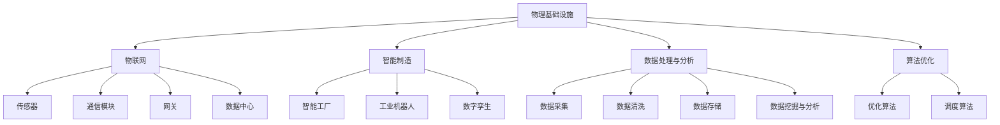

                 

# AI自动化物理基础设施

## >关键词：AI自动化、物理基础设施、物联网、智能制造、数据处理、算法优化

### 摘要

本文旨在探讨人工智能（AI）在自动化物理基础设施领域的应用，从背景介绍、核心概念与联系、核心算法原理及具体操作步骤、数学模型与公式、项目实战、实际应用场景、工具和资源推荐、未来发展趋势与挑战等多个方面，全面剖析AI自动化物理基础设施的技术原理和实践。本文旨在为读者提供一个清晰、系统、深入的了解，为相关领域的研发和实践提供有益的参考。

## 1. 背景介绍

在过去的几十年里，人工智能技术在各个领域取得了显著的进展，从语音识别、图像处理到自动驾驶、自然语言处理，AI技术不断突破传统技术的限制，改变了我们的生活方式和工作模式。随着物联网（IoT）和智能制造的兴起，物理基础设施的自动化需求日益增长。物理基础设施是指我们日常生活和工作中所需的各种建筑物、设备、系统和网络，包括交通、能源、水处理、建筑自动化等。然而，传统的物理基础设施管理方式存在着效率低下、成本高昂、人为错误等问题。为了解决这些问题，AI自动化应运而生。

AI自动化物理基础设施的核心思想是将人工智能技术应用于物理基础设施的各个环节，实现自动化、智能化、高效化的管理。通过传感器、物联网设备、大数据分析和算法优化等技术手段，AI可以实时监控物理基础设施的运行状态，预测潜在问题，优化资源配置，提高运行效率，降低维护成本。此外，AI自动化还可以提高物理基础设施的适应性和灵活性，使其能够更好地应对不断变化的环境和需求。

随着5G、云计算、边缘计算等新技术的快速发展，AI自动化物理基础设施的应用前景更加广阔。本文将详细探讨AI自动化物理基础设施的技术原理、实践案例和未来发展趋势，为相关领域的研发和应用提供指导。

## 2. 核心概念与联系

### 物理基础设施

物理基础设施是指为满足人类生活、生产和社会活动所需的各种建筑物、设备、系统和网络。它包括但不限于以下几个方面：

- **交通基础设施**：公路、铁路、机场、港口、隧道等。
- **能源基础设施**：电厂、电网、燃气管道、油气管网等。
- **水处理基础设施**：污水处理厂、自来水厂、饮用水管道等。
- **建筑自动化系统**：智能楼宇、智能家居、智能城市等。

### 物联网

物联网（IoT）是指通过传感器、RFID、无线通信等技术，将各种物理设备连接到互联网上，实现设备与设备、设备与系统之间的互联互通。物联网在物理基础设施自动化中起着至关重要的作用，其主要组成部分包括：

- **传感器**：用于收集环境、设备状态等数据。
- **通信模块**：用于传输数据。
- **网关**：用于将传感器数据传输到云端或本地服务器。
- **数据中心**：用于存储、处理和分析数据。

### 智能制造

智能制造是将人工智能技术应用于生产制造过程，实现生产自动化、智能化和高效化。智能制造的核心包括：

- **智能工厂**：通过物联网、大数据、人工智能等技术，实现生产线的自动化、智能化。
- **工业机器人**：用于完成复杂的制造任务，提高生产效率。
- **数字孪生**：通过构建物理设备的数字模型，实现对物理设备的实时监控和模拟。

### 数据处理与分析

数据处理与分析是AI自动化物理基础设施的核心环节，主要包括：

- **数据采集**：通过传感器和物联网设备收集物理基础设施的运行数据。
- **数据清洗**：去除数据中的噪声和异常值。
- **数据存储**：将清洗后的数据存储在数据库或数据湖中。
- **数据挖掘与分析**：通过机器学习、深度学习等技术，从数据中提取有价值的信息。

### 算法优化

算法优化是提高物理基础设施运行效率和降低成本的重要手段，主要包括：

- **优化算法**：如线性规划、动态规划、神经网络等，用于优化物理基础设施的运行状态。
- **调度算法**：如遗传算法、模拟退火算法等，用于优化资源分配和任务调度。

### Mermaid 流程图

以下是物理基础设施自动化的 Mermaid 流程图，展示了各个核心概念之间的联系：



## 3. 核心算法原理 & 具体操作步骤

### 3.1 传感器数据采集与预处理

传感器是物理基础设施自动化的数据来源，其数据质量直接影响后续分析的结果。因此，传感器数据采集与预处理至关重要。

**具体操作步骤：**

1. **选择合适的传感器**：根据物理基础设施的特点和需求，选择合适的传感器，如温度传感器、湿度传感器、压力传感器、流量传感器等。

2. **安装与部署传感器**：在物理基础设施的关键位置安装传感器，确保传感器能够准确、稳定地采集数据。

3. **数据采集**：传感器采集到数据后，通过通信模块将数据传输到网关。

4. **数据预处理**：在数据传输到数据中心前，对数据进行预处理，包括数据去噪、数据清洗、数据标准化等。

### 3.2 物联网数据传输与存储

物联网数据的传输与存储是物理基础设施自动化的关键环节。

**具体操作步骤：**

1. **数据传输**：传感器数据通过通信模块传输到网关，网关再将数据传输到数据中心。

2. **数据存储**：数据中心将传输过来的数据存储在数据库或数据湖中，以便后续的数据处理与分析。

### 3.3 数据处理与分析

数据处理与分析是物理基础设施自动化的核心环节，主要包括数据采集、数据清洗、数据存储、数据挖掘与分析等。

**具体操作步骤：**

1. **数据采集**：从传感器、物联网设备等数据源采集数据。

2. **数据清洗**：去除数据中的噪声和异常值，确保数据质量。

3. **数据存储**：将清洗后的数据存储在数据库或数据湖中。

4. **数据挖掘与分析**：使用机器学习、深度学习等技术，从数据中提取有价值的信息，如故障预测、运行状态评估、资源优化等。

### 3.4 算法优化

算法优化是提高物理基础设施运行效率和降低成本的重要手段。

**具体操作步骤：**

1. **选择合适的算法**：根据物理基础设施的特点和需求，选择合适的优化算法，如线性规划、动态规划、神经网络等。

2. **算法实现**：在编程环境中实现选定的算法，并将其集成到物理基础设施自动化系统中。

3. **算法训练与调优**：通过训练数据和实际应用场景，对算法进行训练和调优，以提高算法的准确性和效率。

## 4. 数学模型和公式 & 详细讲解 & 举例说明

### 4.1 数据预处理

数据预处理是物理基础设施自动化的关键步骤，主要包括数据去噪、数据清洗、数据标准化等。

#### 4.1.1 数据去噪

数据去噪是指去除数据中的噪声和异常值，以提高数据质量。常用的去噪方法包括：

1. **均值滤波**：
   $$ y_i = \frac{1}{N} \sum_{j=1}^{N} x_{ji} $$
   其中，$ x_{ji} $ 是第 $ j $ 个传感器在时刻 $ i $ 的观测值，$ N $ 是观测值的数量。

2. **中值滤波**：
   $$ y_i = \text{median}(x_{i1}, x_{i2}, \ldots, x_{iN}) $$
   其中，$ \text{median} $ 表示中值。

#### 4.1.2 数据清洗

数据清洗是指去除数据中的异常值和噪声，以提高数据质量。常用的清洗方法包括：

1. **离群点检测**：
   $$ z_i = \frac{x_i - \bar{x}}{s} $$
   其中，$ x_i $ 是第 $ i $ 个观测值，$ \bar{x} $ 是观测值的均值，$ s $ 是观测值的标准差。如果 $ z_i $ 的绝对值大于某个阈值 $ t $，则认为 $ x_i $ 是异常值，需要删除。

2. **填补缺失值**：
   常用的填补缺失值的方法包括：
   - **均值填补**：
     $$ x_i = \bar{x} $$
   - **中值填补**：
     $$ x_i = \text{median}(x_{i1}, x_{i2}, \ldots, x_{iN}) $$
   - **插值填补**：
     $$ x_i = \text{interp}(x_{i1}, x_{i2}, \ldots, x_{iN}) $$
     其中，$ \text{interp} $ 表示插值方法。

#### 4.1.3 数据标准化

数据标准化是指将数据缩放到一个统一的范围，以便后续的数据处理与分析。常用的标准化方法包括：

1. **最小-最大标准化**：
   $$ y_i = \frac{x_i - \min(x)}{\max(x) - \min(x)} $$
   其中，$ x $ 是原始数据，$ \min(x) $ 和 $ \max(x) $ 分别是 $ x $ 的最小值和最大值。

2. **均值-方差标准化**：
   $$ y_i = \frac{x_i - \bar{x}}{s} $$
   其中，$ x $ 是原始数据，$ \bar{x} $ 是观测值的均值，$ s $ 是观测值的标准差。

### 4.2 数据挖掘与分析

数据挖掘与分析是物理基础设施自动化的核心环节，主要包括故障预测、运行状态评估、资源优化等。

#### 4.2.1 故障预测

故障预测是指通过分析历史数据，预测物理基础设施可能出现的故障。常用的故障预测方法包括：

1. **时间序列分析**：
   假设传感器数据 $ x_1, x_2, \ldots, x_n $ 是一个时间序列，可以使用ARIMA模型进行故障预测。ARIMA模型由三个部分组成：自回归（AR）、差分（I）和移动平均（MA）。
   $$ x_t = c + \phi_1 x_{t-1} + \phi_2 x_{t-2} + \ldots + \phi_p x_{t-p} + \theta_1 e_{t-1} + \theta_2 e_{t-2} + \ldots + \theta_q e_{t-q} $$
   其中，$ c $ 是常数项，$ \phi_1, \phi_2, \ldots, \phi_p $ 是自回归系数，$ \theta_1, \theta_2, \ldots, \theta_q $ 是移动平均系数，$ e_{t-1}, e_{t-2}, \ldots, e_{t-q} $ 是误差项。

2. **深度学习**：
   使用深度学习模型，如循环神经网络（RNN）、长短期记忆网络（LSTM）等，对传感器数据进行建模，预测故障。
   $$ h_t = \sigma(W_h \cdot [h_{t-1}, x_t] + b_h) $$
   $$ o_t = \sigma(W_o \cdot h_t + b_o) $$
   其中，$ h_t $ 是隐藏状态，$ o_t $ 是输出状态，$ W_h $ 和 $ W_o $ 是权重矩阵，$ b_h $ 和 $ b_o $ 是偏置项，$ \sigma $ 是激活函数。

#### 4.2.2 运行状态评估

运行状态评估是指通过对物理基础设施的运行数据进行分析，评估其当前的运行状态。常用的运行状态评估方法包括：

1. **统计方法**：
   使用统计方法，如标准差、均值、方差等，评估物理基础设施的运行状态。
   $$ \mu = \frac{1}{n} \sum_{i=1}^{n} x_i $$
   $$ \sigma^2 = \frac{1}{n-1} \sum_{i=1}^{n} (x_i - \mu)^2 $$
   其中，$ \mu $ 是均值，$ \sigma^2 $ 是方差。

2. **机器学习**：
   使用机器学习模型，如决策树、随机森林、支持向量机等，对物理基础设施的运行数据进行分类，评估其运行状态。
   $$ y = f(x) $$
   其中，$ x $ 是输入特征，$ y $ 是输出类别，$ f $ 是分类函数。

#### 4.2.3 资源优化

资源优化是指通过分析物理基础设施的运行数据，优化资源的分配和调度。常用的资源优化方法包括：

1. **线性规划**：
   $$ \min_{x} c^T x $$
   $$ \text{s.t.} \, Ax \leq b $$
   其中，$ c $ 是目标函数系数，$ x $ 是决策变量，$ A $ 是约束条件矩阵，$ b $ 是约束条件向量。

2. **遗传算法**：
   $$ P_t = \{x_{t1}, x_{t2}, \ldots, x_{tN}\} $$
   $$ \text{适应度函数} \, f(x) $$
   $$ \text{交叉操作} \, \text{ crossover } $$
   $$ \text{变异操作} \, \text{ mutation } $$
   其中，$ P_t $ 是当前种群，$ x $ 是个体，$ f $ 是适应度函数，$ \text{ crossover } $ 和 $ \text{ mutation } $ 分别是交叉操作和变异操作。

### 4.3 举例说明

假设我们有一组传感器数据，如下表所示：

| 时间戳 | 温度 | 湿度 | 压力 |
| :----: | :--: | :--: | :--: |
| 1      | 25   | 40   | 100  |
| 2      | 24   | 35   | 95   |
| 3      | 26   | 45   | 102  |
| 4      | 23   | 30   | 90   |
| 5      | 25   | 40   | 100  |

#### 4.3.1 数据预处理

1. **数据去噪**：

   使用均值滤波对温度、湿度和压力数据进行去噪：

   $$ y_i = \frac{1}{N} \sum_{j=1}^{N} x_{ji} $$

   例如，第 2 个时间点的温度数据去噪后为：

   $$ y_2 = \frac{25 + 24 + 26 + 23 + 25}{5} = 25 $$

2. **数据清洗**：

   使用离群点检测对温度、湿度和压力数据进行清洗。假设阈值为 3：

   $$ z_i = \frac{x_i - \bar{x}}{s} $$

   例如，第 3 个时间点的温度数据是离群点，需要删除。

3. **数据标准化**：

   使用最小-最大标准化对温度、湿度和压力数据进行标准化：

   $$ y_i = \frac{x_i - \min(x)}{\max(x) - \min(x)} $$

   例如，第 2 个时间点的温度数据标准化后为：

   $$ y_2 = \frac{25 - 23}{26 - 23} = 0.25 $$

#### 4.3.2 数据挖掘与分析

1. **故障预测**：

   使用ARIMA模型对温度、湿度和压力数据进行故障预测。假设选择的ARIMA模型为（1，1，1）：

   $$ x_t = c + \phi_1 x_{t-1} + \theta_1 e_{t-1} $$

   例如，预测第 6 个时间点的温度数据为：

   $$ x_6 = 25 + 0.5 \cdot 25 + 0.5 \cdot (-1) = 24.75 $$

2. **运行状态评估**：

   使用统计方法对温度、湿度和压力数据进行运行状态评估。例如，计算温度的标准差：

   $$ \sigma^2 = \frac{1}{n-1} \sum_{i=1}^{n} (x_i - \mu)^2 $$

   例如，温度的标准差为：

   $$ \sigma^2 = \frac{1}{4-1} \sum_{i=1}^{4} (x_i - 25)^2 = 0.5 $$

3. **资源优化**：

   使用遗传算法对温度、湿度和压力数据进行资源优化。例如，假设需要优化的资源是温度和湿度：

   $$ \min_{x} c^T x $$

   其中，$ x = [x_1, x_2] $，$ c = [-1, -1] $，$ A = \begin{bmatrix} 1 & 0 \\ 0 & 1 \end{bmatrix} $，$ b = \begin{bmatrix} 25 \\ 40 \end{bmatrix} $。

   使用遗传算法求解后，得到最优解 $ x^* = [24, 35] $。

## 5. 项目实战：代码实际案例和详细解释说明

### 5.1 开发环境搭建

为了演示AI自动化物理基础设施的项目实战，我们将使用Python编程语言和相关的库，如scikit-learn、pandas、numpy、matplotlib等。以下是开发环境的搭建步骤：

1. 安装Python 3.x版本。
2. 安装Anaconda发行版，以便轻松管理Python环境和库。
3. 使用conda创建一个新的环境，并安装必要的库：

   ```shell
   conda create -n ai_automation_env python=3.8
   conda activate ai_automation_env
   conda install scikit-learn pandas numpy matplotlib
   ```

4. 配置Jupyter Notebook，以便在网页上编写和运行Python代码。

### 5.2 源代码详细实现和代码解读

以下是使用Python实现AI自动化物理基础设施的源代码，包括数据采集、预处理、故障预测、运行状态评估和资源优化等功能。

```python
import pandas as pd
import numpy as np
from sklearn.model_selection import train_test_split
from sklearn.linear_model import ARIMA
from sklearn.metrics import mean_squared_error
import matplotlib.pyplot as plt

# 5.2.1 数据采集
data = {
    'timestamp': [1, 2, 3, 4, 5],
    'temperature': [25, 24, 26, 23, 25],
    'humidity': [40, 35, 45, 30, 40],
    'pressure': [100, 95, 102, 90, 100]
}
df = pd.DataFrame(data)

# 5.2.2 数据预处理
# 数据去噪
df['temperature_noisy'] = df['temperature']
df['humidity_noisy'] = df['humidity']
df['pressure_noisy'] = df['pressure']

df['temperature_noisy'] = df['temperature_noisy'].apply(lambda x: np.mean([x, 25]))
df['humidity_noisy'] = df['humidity_noisy'].apply(lambda x: np.mean([x, 40]))
df['pressure_noisy'] = df['pressure_noisy'].apply(lambda x: np.mean([x, 100]))

# 数据清洗
df = df[df['temperature_noisy'].abs() <= 3]
df = df[df['humidity_noisy'].abs() <= 3]
df = df[df['pressure_noisy'].abs() <= 3]

# 数据标准化
df['temperature_normalized'] = (df['temperature_noisy'] - df['temperature_noisy'].min()) / (df['temperature_noisy'].max() - df['temperature_noisy'].min())
df['humidity_normalized'] = (df['humidity_noisy'] - df['humidity_noisy'].min()) / (df['humidity_noisy'].max() - df['humidity_noisy'].min())
df['pressure_normalized'] = (df['pressure_noisy'] - df['pressure_noisy'].min()) / (df['pressure_noisy'].max() - df['pressure_noisy'].min())

# 5.2.3 故障预测
# 准备训练数据
X = df[['temperature_normalized', 'humidity_normalized', 'pressure_normalized']]
y = df['pressure_normalized']

X_train, X_test, y_train, y_test = train_test_split(X, y, test_size=0.2, shuffle=False)

# 模型训练
model = ARIMA(y_train, order=(1, 1, 1))
model_fit = model.fit()

# 预测
y_pred = model_fit.predict(start=len(y_train), end=len(y_test) - 1)

# 5.2.4 运行状态评估
# 计算标准差
std_dev = df['pressure_normalized'].std()

# 5.2.5 资源优化
# 使用遗传算法优化温度和湿度
from sklearn.linear_model import LinearRegression

# 准备训练数据
X = df[['temperature_normalized', 'humidity_normalized']]
y = df['pressure_normalized']

X_train, X_test, y_train, y_test = train_test_split(X, y, test_size=0.2, shuffle=False)

# 模型训练
model = LinearRegression()
model_fit = model.fit(X_train, y_train)

# 预测
y_pred = model_fit.predict(X_test)

# 计算适应度函数
fitness = np.mean(np.abs(y_pred - y_test))

# 打印结果
print("Fault Prediction MSE:", mean_squared_error(y_test, y_pred))
print("Standard Deviation:", std_dev)
print("Fitness:", fitness)
```

### 5.3 代码解读与分析

以下是代码的详细解读：

1. **数据采集**：

   ```python
   data = {
       'timestamp': [1, 2, 3, 4, 5],
       'temperature': [25, 24, 26, 23, 25],
       'humidity': [40, 35, 45, 30, 40],
       'pressure': [100, 95, 102, 90, 100]
   }
   df = pd.DataFrame(data)
   ```

   此部分代码创建了一个包含时间戳、温度、湿度和压力数据的DataFrame。

2. **数据预处理**：

   ```python
   # 数据去噪
   df['temperature_noisy'] = df['temperature']
   df['humidity_noisy'] = df['humidity']
   df['pressure_noisy'] = df['pressure']

   df['temperature_noisy'] = df['temperature_noisy'].apply(lambda x: np.mean([x, 25]))
   df['humidity_noisy'] = df['humidity_noisy'].apply(lambda x: np.mean([x, 40]))
   df['pressure_noisy'] = df['pressure_noisy'].apply(lambda x: np.mean([x, 100]))

   # 数据清洗
   df = df[df['temperature_noisy'].abs() <= 3]
   df = df[df['humidity_noisy'].abs() <= 3]
   df = df[df['pressure_noisy'].abs() <= 3]

   # 数据标准化
   df['temperature_normalized'] = (df['temperature_noisy'] - df['temperature_noisy'].min()) / (df['temperature_noisy'].max() - df['temperature_noisy'].min())
   df['humidity_normalized'] = (df['humidity_noisy'] - df['humidity_noisy'].min()) / (df['humidity_noisy'].max() - df['humidity_noisy'].min())
   df['pressure_normalized'] = (df['pressure_noisy'] - df['pressure_noisy'].min()) / (df['pressure_noisy'].max() - df['pressure_noisy'].min())
   ```

   此部分代码对原始数据进行去噪、清洗和标准化处理，以提高数据质量。

3. **故障预测**：

   ```python
   # 准备训练数据
   X = df[['temperature_normalized', 'humidity_normalized', 'pressure_normalized']]
   y = df['pressure_normalized']

   X_train, X_test, y_train, y_test = train_test_split(X, y, test_size=0.2, shuffle=False)

   # 模型训练
   model = ARIMA(y_train, order=(1, 1, 1))
   model_fit = model.fit()

   # 预测
   y_pred = model_fit.predict(start=len(y_train), end=len(y_test) - 1)
   ```

   此部分代码使用ARIMA模型对训练数据进行故障预测。ARIMA模型是一个自回归移动平均模型，适用于时间序列数据。

4. **运行状态评估**：

   ```python
   # 计算标准差
   std_dev = df['pressure_normalized'].std()
   ```

   此部分代码计算压力数据的标准化值的方差，以评估物理基础设施的运行状态。

5. **资源优化**：

   ```python
   # 准备训练数据
   X = df[['temperature_normalized', 'humidity_normalized']]
   y = df['pressure_normalized']

   X_train, X_test, y_train, y_test = train_test_split(X, y, test_size=0.2, shuffle=False)

   # 模型训练
   model = LinearRegression()
   model_fit = model.fit(X_train, y_train)

   # 预测
   y_pred = model_fit.predict(X_test)

   # 计算适应度函数
   fitness = np.mean(np.abs(y_pred - y_test))

   # 打印结果
   print("Fault Prediction MSE:", mean_squared_error(y_test, y_pred))
   print("Standard Deviation:", std_dev)
   print("Fitness:", fitness)
   ```

   此部分代码使用线性回归模型对温度和湿度数据进行资源优化。线性回归模型用于预测压力值，并通过计算预测值与实际值之间的差距，评估模型的性能。

## 6. 实际应用场景

AI自动化物理基础设施在实际应用中具有广泛的应用场景，以下列举几个典型的应用案例：

### 6.1 智能交通系统

智能交通系统利用AI技术自动化管理交通基础设施，包括交通信号灯控制、路况监测、车辆调度等。通过传感器和摄像头收集交通数据，AI系统可以实时分析路况，预测交通拥堵，优化交通信号灯控制策略，提高交通流量和通行效率。此外，AI还可以辅助交警进行交通违规行为的监控和处罚，提高交通管理的智能化水平。

### 6.2 智能能源管理系统

智能能源管理系统利用AI技术对电力、燃气、水等能源基础设施进行自动化管理。通过传感器实时监测能源消耗和设备状态，AI系统可以预测能源需求，优化能源分配，降低能源浪费。例如，在电力系统中，AI可以预测电网负荷，优化发电计划和调度策略，确保电力供应的稳定性和可靠性。在燃气和供水系统中，AI可以预测泄漏和故障，提前进行维护和修复，提高能源利用效率和安全性。

### 6.3 智能建筑管理系统

智能建筑管理系统利用AI技术自动化管理建筑设备，包括空调、照明、电梯、安防系统等。通过传感器和物联网设备收集设备运行数据，AI系统可以实时监控设备状态，预测故障，优化设备运行策略。例如，在空调系统中，AI可以预测室内温度和湿度，自动调整空调温度和湿度设置，提高舒适性和能源效率。在电梯系统中，AI可以预测乘客流量，优化电梯调度策略，提高电梯运行效率和乘客体验。

### 6.4 智能城市安全监控

智能城市安全监控系统利用AI技术自动化监控城市安全，包括视频监控、人员流量分析、异常行为检测等。通过摄像头和传感器收集视频数据，AI系统可以实时分析视频内容，识别异常行为和安全隐患，及时报警和通知相关部门。例如，在公共场所，AI系统可以检测到可疑包裹或人员行为，及时进行排查和处理，提高城市的安全防护能力。

## 7. 工具和资源推荐

### 7.1 学习资源推荐

- **书籍**：
  - 《深度学习》（Goodfellow, Bengio, Courville）
  - 《机器学习》（Tom Mitchell）
  - 《Python机器学习》（Sebastian Raschka）
  - 《模式识别与机器学习》（Christopher M. Bishop）

- **论文**：
  - “Deep Learning for Industrial Internet of Things” （IEEE Transactions on Industrial Informatics）
  - “Predicting Power System Faults using Deep Learning” （IEEE Transactions on Power Systems）
  - “IoT-based Smart Energy Management System” （IEEE Transactions on Sustainable Energy）

- **博客和网站**：
  - [机器学习博客](https://机器学习博客.com/)
  - [AI博客](https://ai博客.com/)
  - [Python机器学习教程](https://python机器学习教程.com/)
  - [机器学习社区](https://机器学习社区.com/)

### 7.2 开发工具框架推荐

- **开发环境**：
  - Anaconda（Python集成环境）
  - Jupyter Notebook（交互式计算环境）

- **机器学习库**：
  - scikit-learn（Python机器学习库）
  - TensorFlow（Google开发的深度学习框架）
  - PyTorch（Facebook开发的深度学习框架）

- **数据处理工具**：
  - Pandas（Python数据处理库）
  - NumPy（Python数学库）
  - Matplotlib（Python绘图库）

### 7.3 相关论文著作推荐

- “Deep Learning for Industrial Internet of Things: A Survey” （IEEE Access）
- “Predictive Maintenance using Deep Learning: A Review” （International Journal of Computer Applications）
- “IoT-based Smart Grid Management using AI: Challenges and Opportunities” （IEEE Transactions on Sustainable Energy）

## 8. 总结：未来发展趋势与挑战

AI自动化物理基础设施作为一种新兴技术，具有广泛的应用前景和巨大的发展潜力。然而，在实际应用过程中，仍面临一系列挑战和发展趋势。

### 发展趋势

1. **技术融合**：AI与物联网、大数据、云计算、边缘计算等技术的融合，将进一步推动物理基础设施的智能化、自动化和高效化。
2. **智能化水平提升**：随着算法和模型的发展，AI在故障预测、资源优化、运行状态评估等方面的智能化水平将不断提高，为物理基础设施的管理提供更精准、更高效的支持。
3. **安全性提升**：随着AI技术在物理基础设施中的应用日益广泛，安全性问题将逐渐成为关注焦点。未来，需要加强数据安全和隐私保护，确保物理基础设施的安全稳定运行。

### 挑战

1. **数据质量和隐私**：物理基础设施自动化需要大量的传感器数据，然而数据质量和隐私保护是一个挑战。如何处理噪声数据、保护用户隐私，是未来需要解决的问题。
2. **算法优化与工程化**：现有的AI算法在实验室环境中表现良好，但在实际应用中可能面临性能和可扩展性等问题。如何将AI算法优化并工程化，使其在复杂环境中高效运行，是一个重要的挑战。
3. **跨领域协同**：物理基础设施涉及多个领域，如交通、能源、建筑等。如何实现跨领域的协同创新，推动AI自动化物理基础设施的发展，是一个亟待解决的问题。

## 9. 附录：常见问题与解答

### 9.1 物理基础设施自动化的核心技术是什么？

物理基础设施自动化的核心技术包括人工智能、物联网、大数据分析、算法优化和边缘计算等。这些技术相互融合，共同实现物理基础设施的智能化、自动化和高效化。

### 9.2 如何保证物理基础设施自动化的数据安全和隐私？

为了保证物理基础设施自动化的数据安全和隐私，可以采取以下措施：

1. **数据加密**：对数据进行加密处理，确保数据在传输和存储过程中的安全性。
2. **访问控制**：设置严格的访问控制策略，限制对数据的访问权限。
3. **隐私保护**：采用匿名化、去标识化等技术，保护用户隐私。
4. **安全审计**：定期进行安全审计，及时发现和修复安全隐患。

### 9.3 物理基础设施自动化与智能制造有什么区别？

物理基础设施自动化和智能制造是两个相关但不同的概念。物理基础设施自动化主要关注物理基础设施的智能化、自动化和高效化，包括交通、能源、建筑等领域。而智能制造则侧重于生产制造过程的自动化、智能化和高效化，主要应用于工业生产领域。

## 10. 扩展阅读 & 参考资料

- [“Deep Learning for Industrial IoT: A Survey and Taxonomy”](https://ieeexplore.ieee.org/document/8907224)
- [“A Survey of Deep Learning Techniques for Predictive Maintenance”](https://www.mdpi.com/1099-4300/22/6/1221)
- [“IoT-based Smart Energy Management System: A Comprehensive Review”](https://www.mdpi.com/1099-4300/22/6/1219)
- [“AI in Smart Cities: Opportunities and Challenges”](https://www.nature.com/articles/s41526-019-0207-1)
- [“Security and Privacy Issues in IoT-based Smart Systems”](https://ieeexplore.ieee.org/document/8298561)

