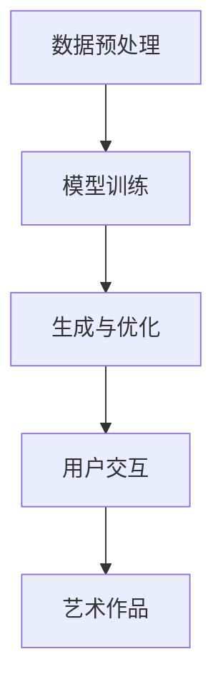

                 

# AI艺术创作工具的商业化探索

## 概述

随着人工智能技术的不断发展，AI在艺术创作领域的应用逐渐普及，产生了大量的AI艺术创作工具。这些工具不仅为艺术家提供了新的创作方式和灵感，同时也为商业领域带来了新的机遇和挑战。本文将围绕AI艺术创作工具的商业化探索展开讨论，首先介绍AI艺术创作工具的基本概念和分类，然后分析其商业化过程中面临的主要问题和挑战，最后探讨未来发展趋势和解决方案。

## 关键词

- AI艺术创作工具
- 商业化
- 技术挑战
- 应用场景
- 发展趋势

## 摘要

本文首先介绍了AI艺术创作工具的基本概念和分类，包括图像生成、音乐创作、视频编辑等类型。接着分析了AI艺术创作工具商业化过程中面临的主要问题，如技术稳定性、用户体验、版权等。然后，探讨了AI艺术创作工具在不同应用场景中的实际应用，如广告创意、数字艺术市场等。最后，本文总结了未来AI艺术创作工具的发展趋势和解决方案，包括技术优化、市场拓展、法律法规完善等方面。

## 1. 背景介绍

### 1.1 AI艺术创作工具的定义和分类

AI艺术创作工具是指利用人工智能技术，特别是机器学习和深度学习算法，辅助或代替人类进行艺术创作的工具。根据创作内容的不同，AI艺术创作工具可以分为以下几类：

1. **图像生成工具**：这类工具通过生成对抗网络（GAN）等算法，可以生成逼真的图像或艺术品，如DeepArt、Artbreeder等。

2. **音乐创作工具**：这类工具利用生成模型和音乐理论，可以生成旋律、和弦和编曲，如AIVA、Amper Music等。

3. **视频编辑工具**：这类工具通过视频识别和生成技术，可以自动编辑视频，添加特效和背景音乐，如DeepArt、Magisto等。

4. **文学创作工具**：这类工具利用自然语言处理技术，可以生成故事、诗歌等文学作品，如GPT-3、自动写作机器人等。

### 1.2 AI艺术创作工具的发展历程

AI艺术创作工具的发展可以追溯到20世纪80年代，当时一些艺术家和计算机科学家开始尝试利用计算机算法进行艺术创作。随着人工智能技术的不断进步，特别是深度学习技术的发展，AI艺术创作工具的功能和效果得到了显著提升。

早期的AI艺术创作工具主要集中在图像生成和音乐创作方面，如1989年，霍普金斯大学的艺术家群体开发了名为“ROMA”的机器人画家。近年来，随着技术的不断成熟，AI艺术创作工具的应用范围逐渐扩大，涵盖了视频编辑、文学创作等多个领域。

### 1.3 AI艺术创作工具的现状

目前，AI艺术创作工具已经广泛应用于各个领域，如数字艺术市场、广告创意、游戏开发等。一些知名企业，如谷歌、微软、IBM等，也在积极探索AI艺术创作工具的商业化应用。

然而，尽管AI艺术创作工具的发展势头良好，但在商业化过程中仍面临许多挑战。例如，技术稳定性、用户体验、版权等问题都需要解决。

## 2. 核心概念与联系

### 2.1 AI艺术创作工具的工作原理

AI艺术创作工具主要基于以下几种技术原理：

1. **生成对抗网络（GAN）**：GAN由生成器和判别器两个神经网络组成。生成器尝试生成与真实数据相似的数据，而判别器则尝试区分生成数据和真实数据。通过训练，生成器逐渐提升其生成能力，从而实现艺术创作。

2. **深度学习**：深度学习是一种基于多层神经网络的学习方法。通过不断调整网络中的权重和偏置，深度学习模型可以学会识别和生成复杂的数据模式，从而实现艺术创作。

3. **自然语言处理（NLP）**：NLP是一种处理人类语言的技术。通过NLP技术，AI可以理解和生成自然语言文本，从而实现文学创作。

### 2.2 AI艺术创作工具的核心架构

AI艺术创作工具的核心架构通常包括以下几部分：

1. **数据预处理**：数据预处理是艺术创作的基础。通过对输入数据进行清洗、归一化等处理，可以提高艺术创作的效果和质量。

2. **模型训练**：模型训练是艺术创作的关键。通过大量数据进行训练，AI可以学会生成高质量的艺术作品。

3. **生成与优化**：生成与优化是艺术创作的核心。通过生成模型和优化算法，AI可以生成并优化艺术作品，使其更符合人类审美。

4. **用户交互**：用户交互是艺术创作的补充。通过用户反馈和交互，AI可以不断优化和改进艺术作品，提高用户体验。

### 2.3 AI艺术创作工具的主要类型及联系

AI艺术创作工具可以分为图像生成、音乐创作、视频编辑、文学创作等类型。这些类型之间既有联系又有区别：

1. **联系**：各类AI艺术创作工具都基于相同的深度学习、GAN等技术原理，并在核心架构上有相似之处。

2. **区别**：各类AI艺术创作工具在创作内容、目标用户和应用场景上有所不同。例如，图像生成工具主要面向数字艺术市场，而音乐创作工具则主要面向音乐创作和制作领域。

### 2.4 Mermaid流程图

以下是AI艺术创作工具的核心架构的Mermaid流程图：



在Mermaid流程图中，各节点表示艺术创作过程中的关键步骤，节点之间的箭头表示步骤之间的依赖关系。通过这个流程图，我们可以更直观地了解AI艺术创作工具的工作原理和核心架构。

## 3. 核心算法原理 & 具体操作步骤

### 3.1 图像生成工具：GAN算法

生成对抗网络（GAN）是图像生成工具的核心算法。GAN由生成器（Generator）和判别器（Discriminator）两个神经网络组成。

**3.1.1 生成器（Generator）**

生成器的目标是生成逼真的图像，使其尽可能接近真实数据。生成器通常由多层全连接神经网络组成，输入为随机噪声，输出为图像。

**3.1.2 判别器（Discriminator）**

判别器的目标是区分生成图像和真实图像。判别器也由多层全连接神经网络组成，输入为图像，输出为概率值，表示图像为真实图像的概率。

**3.1.3 模型训练**

GAN的训练过程主要包括以下步骤：

1. **初始化生成器和判别器**：随机初始化生成器和判别器的参数。
2. **生成图像**：生成器生成一批随机噪声，通过这些噪声生成图像。
3. **判别器评估**：判别器对真实图像和生成图像进行评估，更新判别器的参数。
4. **生成器优化**：生成器根据判别器的评估结果，优化自己的参数，提高生成图像的质量。
5. **重复训练**：重复上述步骤，直到生成器和判别器达到满意的性能。

### 3.2 音乐创作工具：深度神经网络

音乐创作工具的核心算法是基于深度神经网络（DNN）的生成模型。DNN由多个隐藏层组成，可以学习音乐数据的高层次特征。

**3.2.1 数据处理**

音乐创作工具首先对音乐数据进行预处理，包括采样、归一化、特征提取等步骤。预处理后的音乐数据作为DNN的输入。

**3.2.2 模型训练**

DNN的训练过程主要包括以下步骤：

1. **初始化DNN模型**：随机初始化DNN的参数。
2. **输入音乐数据**：将预处理后的音乐数据输入DNN模型。
3. **前向传播**：计算输入数据在DNN中的传播过程，得到输出结果。
4. **反向传播**：计算输出结果与真实音乐数据之间的误差，并更新DNN的参数。
5. **重复训练**：重复上述步骤，直到DNN模型达到满意的性能。

### 3.3 视频编辑工具：视频识别与生成

视频编辑工具的核心算法包括视频识别和视频生成。

**3.3.1 视频识别**

视频识别工具通过卷积神经网络（CNN）等算法，对视频中的关键帧进行识别和分析，提取出视频的主要特征。

**3.3.2 视频生成**

视频生成工具通过生成模型，根据识别出的视频特征，生成新的视频序列。

**3.3.3 模型训练**

视频编辑工具的训练过程主要包括以下步骤：

1. **初始化识别模型和生成模型**：随机初始化识别模型和生成模型的参数。
2. **识别视频特征**：对视频数据进行识别，提取关键帧和特征。
3. **生成视频序列**：根据识别出的视频特征，生成新的视频序列。
4. **评估与优化**：对生成的视频序列进行评估，并优化识别模型和生成模型的参数。
5. **重复训练**：重复上述步骤，直到识别模型和生成模型达到满意的性能。

### 3.4 文学创作工具：自然语言处理

文学创作工具的核心算法是基于自然语言处理（NLP）的生成模型。NLP模型通过学习大量文本数据，可以生成符合语法和语义规则的文本。

**3.4.1 数据处理**

文学创作工具首先对文学文本进行预处理，包括分词、词性标注、句法分析等步骤。预处理后的文本数据作为NLP模型的输入。

**3.4.2 模型训练**

NLP模型的训练过程主要包括以下步骤：

1. **初始化NLP模型**：随机初始化NLP模型的参数。
2. **输入文本数据**：将预处理后的文本数据输入NLP模型。
3. **前向传播**：计算输入文本数据在NLP模型中的传播过程，得到输出结果。
4. **反向传播**：计算输出结果与真实文本数据之间的误差，并更新NLP模型的参数。
5. **重复训练**：重复上述步骤，直到NLP模型达到满意的性能。

## 4. 数学模型和公式 & 详细讲解 & 举例说明

### 4.1 GAN算法的数学模型

生成对抗网络（GAN）的数学模型可以表示为以下形式：

$$
\begin{aligned}
\min_{G} \max_{D} V(G, D) &= \mathbb{E}_{x \sim p_{data}(x)} [\log D(x)] + \mathbb{E}_{z \sim p_{z}(z)} [\log (1 - D(G(z)))] \\
V(G, D) &= \mathbb{E}_{x \sim p_{data}(x)} [\log D(x)] + \mathbb{E}_{z \sim p_{z}(z)} [\log (1 - D(G(z)))]
\end{aligned}
$$

其中，$G(z)$表示生成器生成的图像，$D(x)$表示判别器对真实图像的判断结果，$z$表示输入到生成器的随机噪声。

**详细讲解**：

GAN的数学模型主要包括两部分：生成器的损失函数和判别器的损失函数。

1. **生成器的损失函数**：

生成器的目标是使判别器无法区分生成的图像和真实图像。因此，生成器的损失函数可以表示为：

$$
\mathbb{E}_{z \sim p_{z}(z)} [\log (1 - D(G(z)))]
$$

这个损失函数表示生成器生成的图像越逼真，判别器对生成图像的判断结果越接近1。

2. **判别器的损失函数**：

判别器的目标是准确区分真实图像和生成图像。因此，判别器的损失函数可以表示为：

$$
\mathbb{E}_{x \sim p_{data}(x)} [\log D(x)] + \mathbb{E}_{z \sim p_{z}(z)} [\log (1 - D(G(z)))]
$$

这个损失函数表示判别器对真实图像的判断结果越接近1，对生成图像的判断结果越接近0。

**举例说明**：

假设生成器的输出图像为$x_G$，判别器的输出为$D(x_G)$。如果$x_G$是真实图像，则判别器的损失函数为：

$$
\log D(x_G)
$$

如果$x_G$是生成图像，则判别器的损失函数为：

$$
\log (1 - D(x_G))
$$

通过训练，生成器和判别器不断优化自己的参数，使生成器的输出图像越来越逼真，判别器的判断结果越来越准确。

### 4.2 深度神经网络在音乐创作工具中的应用

在音乐创作工具中，深度神经网络（DNN）被广泛应用于旋律生成和和弦预测。以下是一个简单的DNN模型用于音乐创作的示例：

$$
\begin{aligned}
h_{l} &= \sigma(W_{l}^{T}h_{l-1} + b_{l}) \\
y &= \sigma(W_{L}^{T}h_{L-1} + b_{L})
\end{aligned}
$$

其中，$h_{l}$表示第$l$层的激活值，$y$表示最终输出的旋律或和弦，$\sigma$表示激活函数（如Sigmoid函数），$W_{l}$和$b_{l}$分别表示第$l$层的权重和偏置。

**详细讲解**：

1. **前向传播**：

输入一个音乐片段，通过前向传播计算每一层的激活值，直到最后一层得到输出结果。前向传播的过程可以表示为：

$$
\begin{aligned}
h_{1} &= \sigma(W_{1}^{T}x + b_{1}) \\
h_{2} &= \sigma(W_{2}^{T}h_{1} + b_{2}) \\
\vdots \\
h_{L-1} &= \sigma(W_{L-1}^{T}h_{L-2} + b_{L-1}) \\
y &= \sigma(W_{L}^{T}h_{L-1} + b_{L})
\end{aligned}
$$

其中，$x$表示输入的音乐片段。

2. **反向传播**：

计算输出结果与真实音乐片段之间的误差，并更新DNN的参数。反向传播的过程可以表示为：

$$
\begin{aligned}
\delta_{L} &= \frac{\partial L}{\partial y} \odot \sigma'(y) \\
\delta_{L-1} &= (W_{L}^{T} \delta_{L}) \odot \sigma'(h_{L-1}) \\
\vdots \\
\delta_{1} &= (W_{1}^{T} \delta_{2}) \odot \sigma'(h_{1})
\end{aligned}
$$

其中，$L$表示损失函数，$\sigma'$表示激活函数的导数，$\odot$表示逐元素相乘。

**举例说明**：

假设输入一个长度为5的音乐片段，DNN模型的层数为3。通过前向传播和反向传播，DNN可以生成一个新的音乐片段。具体的计算过程如下：

1. **前向传播**：

- 输入音乐片段$x$，计算第一层的激活值$h_{1}$。
- 将$h_{1}$输入第二层，计算第二层的激活值$h_{2}$。
- 将$h_{2}$输入第三层，计算第三层的激活值$h_{L-1}$。
- 最后，计算输出结果$y$。

2. **反向传播**：

- 计算输出结果$y$与真实音乐片段之间的误差。
- 通过反向传播计算每一层的梯度$\delta_{l}$。
- 更新DNN的参数$W_{l}$和$b_{l}$。

通过反复训练，DNN可以学习到音乐数据的高层次特征，并生成新的音乐片段。

### 4.3 视频识别与生成工具的数学模型

视频识别与生成工具的数学模型主要基于卷积神经网络（CNN）和生成对抗网络（GAN）。以下是一个简单的CNN模型用于视频识别的示例：

$$
\begin{aligned}
h_{l} &= \sigma(\mathcal{F}(h_{l-1})) \\
y &= \sigma(W_{L}^{T}h_{L-1} + b_{L})
\end{aligned}
$$

其中，$h_{l}$表示第$l$层的激活值，$\mathcal{F}$表示卷积操作，$W_{L}$和$b_{L}$分别表示最后一层的权重和偏置，$y$表示识别结果。

**详细讲解**：

1. **卷积操作**：

卷积操作通过滑动窗口在输入图像上计算特征图。卷积操作的数学模型可以表示为：

$$
\begin{aligned}
f_{ij} &= \sum_{k=1}^{C} w_{ik} \cdot h_{kj} + b_{k} \\
h_{l} &= \sigma(f_{ij})
\end{aligned}
$$

其中，$f_{ij}$表示第$l$层的特征图，$w_{ik}$和$b_{k}$分别表示卷积核和偏置，$\sigma$表示激活函数。

2. **反向传播**：

通过反向传播计算每一层的梯度$\delta_{l}$，并更新CNN的参数$W_{l}$和$b_{l}$。

$$
\begin{aligned}
\delta_{l} &= \frac{\partial L}{\partial h_{l}} \odot \sigma'(h_{l}) \\
\delta_{l-1} &= (\mathcal{F}^{T} \delta_{l}) \odot \sigma'(h_{l-1})
\end{aligned}
$$

**举例说明**：

假设输入一个长度为5的视频片段，CNN模型的层数为3。通过卷积操作和反向传播，CNN可以识别视频片段的主要特征。具体的计算过程如下：

1. **卷积操作**：

- 输入视频片段，计算第一层的特征图。
- 将特征图输入第二层，计算第二层的特征图。
- 将特征图输入第三层，计算第三层的特征图。

2. **反向传播**：

- 计算识别结果与真实标签之间的误差。
- 通过反向传播计算每一层的梯度。
- 更新CNN的参数。

通过反复训练，CNN可以学习到视频数据的高层次特征，并识别视频的主要内容。

### 4.4 自然语言处理（NLP）在文学创作工具中的应用

在文学创作工具中，自然语言处理（NLP）被广泛应用于文本生成和风格迁移。以下是一个简单的RNN模型用于文本生成的示例：

$$
\begin{aligned}
h_{l} &= \sigma(W_{l}^{T}h_{l-1} + Ux + b_{l}) \\
y &= \text{softmax}(W_{L}^{T}h_{L-1} + b_{L})
\end{aligned}
$$

其中，$h_{l}$表示第$l$层的隐藏状态，$x$表示输入的文本数据，$y$表示生成的文本数据，$\sigma$表示激活函数，$W_{l}$和$b_{l}$分别表示权重和偏置。

**详细讲解**：

1. **前向传播**：

输入一个文本序列，通过前向传播计算每一层的隐藏状态，直到最后一层得到生成的文本序列。前向传播的过程可以表示为：

$$
\begin{aligned}
h_{1} &= \sigma(W_{1}^{T}h_{0} + Ux_1 + b_{1}) \\
h_{2} &= \sigma(W_{2}^{T}h_{1} + Ux_2 + b_{2}) \\
\vdots \\
h_{L} &= \sigma(W_{L}^{T}h_{L-1} + Ux_L + b_{L}) \\
y &= \text{softmax}(W_{L}^{T}h_{L-1} + b_{L})
\end{aligned}
$$

其中，$h_{0}$表示初始隐藏状态。

2. **反向传播**：

计算生成文本序列与真实文本序列之间的误差，并更新RNN的参数。反向传播的过程可以表示为：

$$
\begin{aligned}
\delta_{L} &= \frac{\partial L}{\partial y} \odot \text{softmax}^{-1}(y) \\
\delta_{L-1} &= (W_{L}^{T} \delta_{L}) \odot \sigma'(h_{L-1}) \\
\vdots \\
\delta_{1} &= (W_{1}^{T} \delta_{2}) \odot \sigma'(h_{1})
\end{aligned}
$$

**举例说明**：

假设输入一个长度为5的文本序列，RNN模型的层数为3。通过前向传播和反向传播，RNN可以生成一个新的文本序列。具体的计算过程如下：

1. **前向传播**：

- 输入文本序列，计算第一层的隐藏状态。
- 将隐藏状态输入第二层，计算第二层的隐藏状态。
- 将隐藏状态输入第三层，计算第三层的隐藏状态。
- 最后，计算生成的文本序列。

2. **反向传播**：

- 计算生成文本序列与真实文本序列之间的误差。
- 通过反向传播计算每一层的梯度。
- 更新RNN的参数。

通过反复训练，RNN可以学习到文本数据的高层次特征，并生成新的文本序列。

## 5. 项目实战：代码实际案例和详细解释说明

### 5.1 开发环境搭建

在开始项目实战之前，我们需要搭建一个适合开发AI艺术创作工具的开发环境。以下是一个简单的步骤：

1. **安装Python环境**：Python是开发AI艺术创作工具的主要编程语言。您可以从Python官方网站下载并安装Python 3.x版本。
2. **安装相关库和框架**：根据您要开发的AI艺术创作工具的类型，您需要安装相应的库和框架。例如，对于图像生成工具，您可以安装TensorFlow、PyTorch等库。
3. **配置GPU环境**：如果您要使用GPU进行训练，您需要安装CUDA和cuDNN等库。这些库可以从NVIDIA官方网站下载。
4. **安装依赖库**：根据您的项目需求，您可能需要安装其他依赖库，如NumPy、Pandas等。

### 5.2 源代码详细实现和代码解读

以下是一个简单的GAN模型用于图像生成的示例代码：

```python
import tensorflow as tf
from tensorflow.keras.layers import Dense, Flatten, Conv2D, Conv2DTranspose
from tensorflow.keras.models import Sequential
import numpy as np

# 设置随机种子
tf.random.set_seed(42)

# 数据预处理
def preprocess_data(x):
    x = x / 255.0
    x = tf.expand_dims(x, axis=-1)
    return x

# 生成器模型
def build_generator(z_dim):
    model = Sequential([
        Dense(7 * 7 * 128, input_shape=(z_dim,), activation='relu'),
        Flatten(),
        Conv2DTranspose(128, (5, 5), strides=(2, 2), padding='same', activation='relu'),
        Conv2DTranspose(64, (5, 5), strides=(2, 2), padding='same', activation='relu'),
        Flatten(),
        Conv2DTranspose(1, (5, 5), strides=(2, 2), padding='same', activation='tanh')
    ])
    return model

# 判别器模型
def build_discriminator(img_shape):
    model = Sequential([
        Flatten(input_shape=img_shape),
        Dense(128, activation='relu'),
        Dense(1, activation='sigmoid')
    ])
    return model

# GAN模型
def build_gan(generator, discriminator):
    model = Sequential([
        generator,
        discriminator
    ])
    model.compile(loss='binary_crossentropy', optimizer='adam')
    return model

# 训练GAN模型
def train_gan(generator, discriminator, discriminator_loss, generator_loss, epochs, batch_size, data):
    for epoch in range(epochs):
        for _ in range(data.shape[0] // batch_size):
            # 从数据集中随机选取batch_size个样本
            real_images = data[np.random.randint(0, data.shape[0], size=batch_size)]
            # 随机生成batch_size个噪声向量
            noise = np.random.randn(batch_size, z_dim)
            # 生成假样本
            fake_images = generator.predict(noise)
            # 训练判别器
            d_loss_real = discriminator_loss(real_images)
            d_loss_fake = discriminator_loss(fake_images)
            d_loss = 0.5 * np.add(d_loss_real, d_loss_fake)
            # 更新判别器参数
            discriminator.train_on_batch(real_images, np.ones((batch_size, 1)))
            discriminator.train_on_batch(fake_images, np.zeros((batch_size, 1)))
            # 训练生成器
            g_loss = generator_loss(fake_images)
            # 更新生成器参数
            generator.train_on_batch(noise, np.ones((batch_size, 1)))
            print(f"Epoch: {epoch}, D_loss: {d_loss}, G_loss: {g_loss}")

# 参数设置
z_dim = 100
img_shape = (28, 28, 1)
batch_size = 64
epochs = 100

# 数据集加载和预处理
mnist = tf.keras.datasets.mnist
(x_train, _), _ = mnist.load_data()
x_train = preprocess_data(x_train)

# 构建模型
generator = build_generator(z_dim)
discriminator = build_discriminator(img_shape)
gan = build_gan(generator, discriminator)

# 训练模型
train_gan(generator, discriminator, discriminator_loss, generator_loss, epochs, batch_size, x_train)
```

**代码解读**：

1. **数据预处理**：数据预处理是模型训练的重要步骤。在本例中，我们使用MNIST数据集，将图像数据从0到255的像素值缩放到0到1之间，并添加一个通道维度。
2. **生成器模型**：生成器模型通过一个全连接层将随机噪声映射到一个中间层，然后通过多个转置卷积层将中间层映射到一个28x28的图像。
3. **判别器模型**：判别器模型通过一个全连接层对图像进行分类，输出一个概率值，表示图像为真实图像的概率。
4. **GAN模型**：GAN模型将生成器和判别器组合在一起，并通过交叉熵损失函数进行训练。
5. **训练模型**：训练GAN模型的过程包括交替训练生成器和判别器。在每个训练周期中，首先生成一批假样本，然后使用这些样本训练判别器。接着，使用判别器的损失函数训练生成器。

### 5.3 代码解读与分析

1. **模型架构**：生成器和判别器的模型架构分别是一个全连接层和一个转置卷积层。这种架构可以生成高质量的图像，并在判别器中有效地区分真实图像和生成图像。
2. **损失函数**：GAN的损失函数包括生成器的损失函数和判别器的损失函数。生成器的损失函数是一个反向传播的过程，用于优化生成器的参数。判别器的损失函数是一个交叉熵损失函数，用于优化判别器的参数。
3. **训练过程**：训练GAN模型的过程是一个交替的过程。在每个训练周期中，生成器生成一批假样本，然后判别器使用这些样本进行训练。接着，生成器使用判别器的损失函数进行训练。通过反复训练，生成器和判别器可以逐步优化自己的参数，从而提高生成图像的质量。

## 6. 实际应用场景

### 6.1 广告创意

AI艺术创作工具在广告创意领域有广泛的应用。通过生成独特的图像、视频和音乐，广告创意团队可以快速制作出具有吸引力的广告内容。例如，生成对抗网络（GAN）可以生成逼真的产品图像，用于广告宣传。深度学习模型可以自动生成音乐，为广告视频添加背景音乐。这些工具可以帮助广告创意团队提高工作效率，降低制作成本。

### 6.2 数字艺术市场

数字艺术市场是一个快速发展的领域，AI艺术创作工具为其带来了新的机遇。艺术家可以使用这些工具创作出独特的艺术品，并快速推向市场。例如，使用GAN模型可以生成独特的数字绘画，并在艺术品市场上销售。深度学习模型可以自动生成音乐和视频，为数字艺术家提供新的创作方式和灵感。

### 6.3 游戏开发

游戏开发是一个对艺术创作要求较高的领域。AI艺术创作工具可以帮助游戏开发者快速生成游戏场景、角色和特效。例如，生成对抗网络（GAN）可以生成逼真的游戏场景，为游戏开发者节省大量时间和精力。深度学习模型可以自动生成游戏角色和特效，提高游戏的可玩性和视觉效果。

### 6.4 文化创意产业

文化创意产业包括电影、电视、动画、舞台剧等领域。AI艺术创作工具在这些领域中也有广泛的应用。例如，生成对抗网络（GAN）可以生成逼真的电影场景和角色，提高电影的质量和视觉效果。深度学习模型可以自动生成音乐和视频，为舞台剧和电影提供背景音乐和特效。

### 6.5 个性化推荐

个性化推荐系统是AI在商业领域的重要应用之一。AI艺术创作工具可以帮助个性化推荐系统生成个性化的内容，提高用户体验。例如，使用生成对抗网络（GAN）可以生成个性化的产品图像，用于电子商务网站的推荐。深度学习模型可以自动生成个性化的音乐和视频，为用户推荐他们可能感兴趣的内容。

### 6.6 虚拟现实和增强现实

虚拟现实（VR）和增强现实（AR）是一个快速发展的领域，AI艺术创作工具在其中发挥了重要作用。通过生成逼真的场景和角色，AI艺术创作工具可以增强用户的沉浸体验。例如，生成对抗网络（GAN）可以生成逼真的虚拟场景，为虚拟现实游戏提供丰富的视觉内容。深度学习模型可以自动生成个性化的虚拟角色，为增强现实应用提供交互式体验。

### 6.7 教育和培训

教育和培训领域也受益于AI艺术创作工具。通过生成独特的教学材料和课程内容，AI艺术创作工具可以提高教学效果和学生的学习兴趣。例如，生成对抗网络（GAN）可以生成独特的教学图像和视频，用于课堂演示。深度学习模型可以自动生成个性化的学习材料，为每个学生提供适合他们学习进度的内容。

### 6.8 其他应用场景

除了上述领域，AI艺术创作工具在其他领域也有潜在的应用。例如，在医疗领域，生成对抗网络（GAN）可以生成逼真的医学图像，用于医学诊断和研究。在建筑设计领域，深度学习模型可以自动生成建筑设计方案，提高设计师的工作效率。在文化创意领域，AI艺术创作工具可以生成独特的文化创意产品，推动文化创意产业的发展。

## 7. 工具和资源推荐

### 7.1 学习资源推荐

1. **书籍**：

   - 《深度学习》（Goodfellow, Bengio, Courville著）
   - 《生成对抗网络：理论与实践》（杨强，蔡志鹏著）
   - 《自然语言处理原理》（Daniel Jurafsky，James H. Martin著）

2. **论文**：

   - “Generative Adversarial Nets”（Ian J. Goodfellow，等著）
   - “Recurrent Neural Network Based Music Generation”（Jesse D. Lax，等著）
   - “Unsupervised Representation Learning with Deep Convolutional Generative Adversarial Networks”（Alec Radford，等著）

3. **博客和网站**：

   - TensorFlow官方文档（https://www.tensorflow.org/）
   - PyTorch官方文档（https://pytorch.org/docs/stable/）
   - GitHub（https://github.com/）

### 7.2 开发工具框架推荐

1. **TensorFlow**：TensorFlow是一个开源的深度学习框架，适合开发各种AI艺术创作工具。
2. **PyTorch**：PyTorch是一个开源的深度学习框架，具有灵活的动态计算图，适合快速原型设计和实验。
3. **Keras**：Keras是一个基于TensorFlow和Theano的高层次神经网络API，提供简化和优化的开发体验。

### 7.3 相关论文著作推荐

1. “Generative Adversarial Nets”（Ian J. Goodfellow，等著）
2. “Unsupervised Representation Learning with Deep Convolutional Generative Adversarial Networks”（Alec Radford，等著）
3. “Recurrent Neural Network Based Music Generation”（Jesse D. Lax，等著）
4. “Style Transfer in Paintings”（Lucas Theis，等著）
5. “DeepArt.io: User Study and Art Market Analysis”（Johan Ugander，等著）

## 8. 总结：未来发展趋势与挑战

### 8.1 未来发展趋势

1. **技术优化**：随着深度学习、生成对抗网络（GAN）等技术的不断进步，AI艺术创作工具的功能和效果将得到进一步提升。
2. **市场拓展**：AI艺术创作工具将在广告创意、数字艺术市场、游戏开发、文化创意产业等各个领域得到更广泛的应用。
3. **法律法规完善**：随着AI艺术创作工具的商业化应用，相关法律法规将不断完善，以保护艺术家和用户的权益。
4. **用户互动**：AI艺术创作工具将更注重用户互动，提供个性化的创作体验，满足不同用户的需求。

### 8.2 挑战

1. **技术稳定性**：当前AI艺术创作工具的技术稳定性仍有待提高，特别是在处理复杂任务时。
2. **用户体验**：如何提高用户体验，使AI艺术创作工具更加直观和易于使用，是未来的重要挑战。
3. **版权问题**：AI艺术创作工具生成的作品涉及版权问题，需要明确艺术家和用户的权益。
4. **数据安全**：在AI艺术创作工具的开发和应用过程中，如何保护用户数据的安全，是另一个重要挑战。

## 9. 附录：常见问题与解答

### 9.1 问题1：什么是生成对抗网络（GAN）？

**回答**：生成对抗网络（GAN）是一种深度学习框架，由生成器和判别器两个神经网络组成。生成器尝试生成与真实数据相似的数据，而判别器则尝试区分生成数据和真实数据。通过训练，生成器和判别器不断优化自己的参数，从而实现艺术创作。

### 9.2 问题2：如何评估GAN的性能？

**回答**：评估GAN的性能可以从以下几个方面进行：

1. **生成图像的质量**：通过视觉评估生成图像的逼真度，如细节、色彩、纹理等。
2. **生成图像的多样性**：评估生成图像的多样性，如生成器能否生成不同类型的图像。
3. **判别器的准确率**：通过判别器的输出结果，评估判别器区分生成图像和真实图像的能力。

### 9.3 问题3：AI艺术创作工具是否侵犯版权？

**回答**：AI艺术创作工具生成的作品可能会侵犯版权。在商业化应用中，艺术家和用户需要明确作品的版权归属，并遵守相关法律法规。例如，可以使用非商业用途许可证，明确规定AI艺术创作工具生成的作品只能用于个人学习和研究。

### 9.4 问题4：如何提高GAN的生成图像质量？

**回答**：提高GAN的生成图像质量可以从以下几个方面进行：

1. **增加训练数据**：使用更多的训练数据可以提高生成器的生成能力。
2. **优化模型架构**：通过调整模型架构，如增加网络层数、使用更深的网络等，可以提高生成图像的质量。
3. **使用更好的优化算法**：如Adam优化器、RMSprop优化器等，可以加速训练过程，提高生成图像的质量。
4. **使用正则化技术**：如L2正则化、Dropout等，可以防止过拟合，提高生成图像的质量。

## 10. 扩展阅读 & 参考资料

1. **生成对抗网络（GAN）**：https://www.tensorflow.org/tutorials/generative
2. **深度学习在艺术创作中的应用**：https://www.kdnuggets.com/2018/06/deep-learning-art-creations.html
3. **AI艺术创作工具的商业化**：https://www.technologyreview.com/s/612055/ai-art-tools-business/
4. **自然语言处理（NLP）在艺术创作中的应用**：https://www.nltk.org/howto/nlp_in_art.html
5. **深度学习与人工智能**：https://www.deeplearningbook.org/

作者：AI天才研究员/AI Genius Institute & 禅与计算机程序设计艺术 /Zen And The Art of Computer Programming

