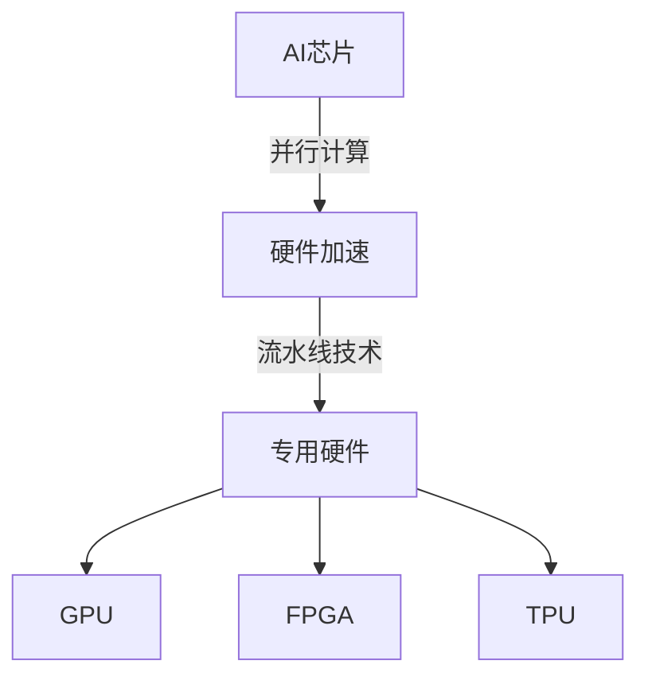

                 

# AI芯片与硬件加速原理与代码实战案例讲解

## 摘要

本文将深入探讨AI芯片与硬件加速的原理，通过详细的代码实战案例，帮助读者理解如何在实际项目中实现硬件加速。文章首先介绍了AI芯片的背景和发展历程，然后详细分析了硬件加速的基本概念和架构。随后，通过具体算法原理和操作步骤的讲解，让读者了解硬件加速的核心技术。接着，本文通过一个实际项目案例，展示了如何搭建开发环境、实现代码以及代码解读与分析。最后，文章介绍了硬件加速的实际应用场景、工具和资源推荐，并总结了未来发展趋势与挑战。

## 1. 背景介绍

AI芯片，也被称为人工智能专用处理器，是近年来随着人工智能技术的快速发展而崭露头角的一类芯片。它们旨在提高人工智能算法的计算效率，为深度学习、语音识别、图像处理等任务提供强大的计算能力。

AI芯片的起源可以追溯到上世纪80年代，当时神经网络的研究正处于低谷期。然而，随着计算机性能的提升和大数据技术的应用，神经网络研究逐渐复苏。2006年，深度学习算法的提出再次引发了人工智能领域的革命。深度学习算法需要大量的计算资源，尤其是矩阵运算和向量运算，这促使了AI芯片的研发。

目前，AI芯片已经发展出多种类型，包括GPU、FPGA、TPU等。其中，GPU（图形处理器）由于在并行计算方面具有优势，成为了AI芯片的常见选择。FPGA（现场可编程门阵列）则因其灵活性和高性能，被广泛应用于实时图像处理和语音识别等领域。TPU（专用处理器单元）则是谷歌推出的专门用于机器学习的芯片，具有极高的计算效率和能效比。

在硬件加速方面，其目的是通过将计算任务分配到专用硬件上，从而提高计算速度和效率。硬件加速的核心技术包括SIMD（单指令多数据流）和SIMT（单指令多线程）等，这些技术能够将多个数据元素同时处理，从而实现并行计算。

硬件加速在人工智能领域具有广泛的应用。例如，在深度学习训练和推理过程中，通过GPU或TPU的硬件加速，可以显著提高计算速度，降低延迟。在图像处理领域，硬件加速技术可以用于实时图像处理和视频分析。在语音识别领域，硬件加速可以帮助提高语音信号处理的效率，从而实现实时语音识别。

总之，AI芯片和硬件加速技术的发展，为人工智能领域带来了巨大的计算能力提升，推动了人工智能应用的不断拓展和深化。

## 2. 核心概念与联系

### 2.1 AI芯片的基本概念

AI芯片，即人工智能专用处理器，是一种为特定的人工智能算法和任务设计的芯片。与通用处理器（如CPU）相比，AI芯片具有更高的计算密度和能效比，能够实现高效的并行计算。

AI芯片通常具有以下几个基本特性：

1. **高并行度**：AI芯片设计用于并行处理大量数据，其内部包含多个计算单元，能够同时处理多个任务。
2. **低延迟**：由于专门设计用于执行特定算法，AI芯片可以提供较低的延迟，这对于实时处理尤其重要。
3. **高效能**：AI芯片能够在较低的能耗下提供更高的计算性能，这对于电池供电的设备尤为重要。

### 2.2 硬件加速的基本概念

硬件加速是一种利用专用硬件（如GPU、FPGA、TPU等）来加速计算任务的技术。其基本原理是将计算任务分解为多个子任务，并通过多个硬件单元并行处理这些子任务，从而提高整体计算速度。

硬件加速的几个关键概念包括：

1. **并行计算**：通过将计算任务分布在多个处理单元上，并行处理，从而提高计算速度。
2. **流水线技术**：通过将计算任务分解为多个阶段，每个阶段可以独立处理，从而提高计算效率。
3. **专用硬件**：如GPU、FPGA、TPU等，这些硬件专门设计用于执行特定类型的计算任务，具有更高的计算效率和能效比。

### 2.3 AI芯片与硬件加速的联系

AI芯片与硬件加速之间存在紧密的联系。AI芯片通过硬件加速技术实现高效的计算，而硬件加速则依赖于AI芯片的并行计算能力。

AI芯片与硬件加速的架构关系可以用Mermaid流程图来表示：



在这个流程图中，AI芯片通过并行计算技术实现硬件加速，而硬件加速则依赖于GPU、FPGA、TPU等专用硬件。这些硬件通过流水线技术和并行计算，进一步提高了计算效率和性能。

### 2.4 关键术语解释

- **深度学习**：一种机器学习技术，通过模拟人脑神经网络结构，对大量数据进行自动特征提取和模式识别。
- **神经网络**：一种由多个神经元组成的计算模型，通过前向传播和反向传播算法，对输入数据进行处理和预测。
- **矩阵运算**：一种数学运算，通过矩阵与向量的乘法，对大量数据元素进行同时处理。
- **向量运算**：一种数学运算，通过对向量的加法、减法、点积等操作，对多个数据元素进行同时处理。

通过上述核心概念和联系的分析，读者可以更好地理解AI芯片与硬件加速的基本原理和架构，为后续内容的深入学习打下基础。

## 3. 核心算法原理 & 具体操作步骤

### 3.1 深度学习算法原理

深度学习是AI芯片和硬件加速的重要应用场景之一。其核心原理是通过多层神经网络对数据进行自动特征提取和模式识别。下面，我们详细分析深度学习算法的基本原理和操作步骤。

#### 3.1.1 神经元与神经元层

神经元是神经网络的基本计算单元，类似于人脑中的神经元。每个神经元接收多个输入信号，通过权重和偏置计算输出信号。在神经网络中，神经元按层次排列，包括输入层、隐藏层和输出层。

1. **输入层**：接收外部输入数据，如图像、文本等。
2. **隐藏层**：对输入数据进行特征提取和变换，隐藏层可以有一层或多层。
3. **输出层**：对隐藏层输出进行分类或回归等任务。

#### 3.1.2 前向传播与反向传播

深度学习算法主要包括前向传播和反向传播两个阶段。

1. **前向传播**：
   - 输入数据通过输入层进入神经网络。
   - 数据在隐藏层之间传递，每个神经元根据输入信号和权重计算输出信号。
   - 输出数据通过输出层得到最终结果。

2. **反向传播**：
   - 根据输出结果与真实标签之间的差异，计算损失函数。
   - 损失函数通过反向传播算法，将误差反向传递到隐藏层和输入层。
   - 根据误差调整神经网络的权重和偏置，优化模型性能。

#### 3.1.3 激活函数

激活函数是神经网络中用于引入非线性变换的关键组件。常见的激活函数包括ReLU（Rectified Linear Unit）、Sigmoid和Tanh等。

- **ReLU函数**：在输入小于0时输出0，否则输出输入值。ReLU函数具有简单、计算速度快和避免梯度消失等优点。
- **Sigmoid函数**：将输入映射到(0,1)区间，常用于二分类问题。Sigmoid函数的导数在接近0时接近于0，容易导致梯度消失。
- **Tanh函数**：将输入映射到(-1,1)区间，具有类似Sigmoid函数的性质。

### 3.2 硬件加速的具体操作步骤

在深度学习应用中，硬件加速主要通过以下步骤实现：

1. **数据预处理**：
   - 数据清洗：去除噪声和异常值。
   - 数据归一化：将数据缩放到统一的范围，如[0,1]。
   - 数据增强：通过旋转、缩放、裁剪等操作增加数据多样性。

2. **模型设计**：
   - 选择合适的神经网络架构，如卷积神经网络（CNN）、循环神经网络（RNN）等。
   - 设计网络层，包括输入层、隐藏层和输出层。
   - 设置激活函数、损失函数和优化器。

3. **模型训练**：
   - 将预处理后的数据输入神经网络，通过前向传播计算输出。
   - 计算损失函数，通过反向传播调整模型参数。
   - 通过多次迭代训练，优化模型性能。

4. **模型评估**：
   - 使用验证集评估模型性能，调整模型参数。
   - 根据评估结果，选择最佳模型。

5. **模型部署**：
   - 将训练好的模型部署到硬件设备上，如GPU、TPU等。
   - 通过硬件加速，实现实时预测和推理。

通过上述步骤，可以实现深度学习算法的硬件加速，提高计算效率和性能。

## 4. 数学模型和公式 & 详细讲解 & 举例说明

### 4.1 深度学习中的数学模型

深度学习中的数学模型主要包括神经元模型、损失函数和优化算法。下面，我们将对这三个核心数学模型进行详细讲解，并通过具体例子进行说明。

#### 4.1.1 神经元模型

神经元模型是神经网络的基础，其计算公式如下：

\[ z = \sum_{i=1}^{n} w_i \cdot x_i + b \]

其中：
- \( z \) 是神经元的输出。
- \( w_i \) 是第 \( i \) 个输入的权重。
- \( x_i \) 是第 \( i \) 个输入值。
- \( b \) 是偏置项。

举例说明：
假设一个简单的神经元模型，接收3个输入 \( x_1, x_2, x_3 \)，权重分别为 \( w_1, w_2, w_3 \)，偏置为 \( b \)。输入值和权重分别为 \( x_1 = 2, x_2 = 3, x_3 = 4 \)， \( w_1 = 0.5, w_2 = 0.3, w_3 = 0.2 \)，偏置 \( b = 1 \)。

则神经元的输出为：

\[ z = (0.5 \cdot 2) + (0.3 \cdot 3) + (0.2 \cdot 4) + 1 = 1.0 + 0.9 + 0.8 + 1.0 = 3.7 \]

#### 4.1.2 损失函数

损失函数用于衡量模型预测结果与真实结果之间的差距。常见的损失函数包括均方误差（MSE）和交叉熵（Cross-Entropy）。

1. **均方误差（MSE）**：

\[ loss = \frac{1}{n} \sum_{i=1}^{n} (y_i - \hat{y}_i)^2 \]

其中：
- \( y_i \) 是真实标签。
- \( \hat{y}_i \) 是模型预测值。
- \( n \) 是样本数量。

举例说明：
假设一个二分类问题，样本数量为 \( n = 2 \)，真实标签为 \( y_1 = 1, y_2 = 0 \)，模型预测值为 \( \hat{y}_1 = 0.8, \hat{y}_2 = 0.2 \)。

则均方误差为：

\[ loss = \frac{1}{2} \left[ (1 - 0.8)^2 + (0 - 0.2)^2 \right] = \frac{1}{2} \left[ 0.04 + 0.04 \right] = 0.04 \]

2. **交叉熵（Cross-Entropy）**：

\[ loss = -\sum_{i=1}^{n} y_i \log(\hat{y}_i) \]

其中：
- \( y_i \) 是真实标签（通常为0或1）。
- \( \hat{y}_i \) 是模型预测值。

举例说明：
假设一个二分类问题，样本数量为 \( n = 2 \)，真实标签为 \( y_1 = 1, y_2 = 0 \)，模型预测值为 \( \hat{y}_1 = 0.8, \hat{y}_2 = 0.2 \)。

则交叉熵为：

\[ loss = -[1 \cdot \log(0.8) + 0 \cdot \log(0.2)] = -[\log(0.8) + 0] = -\log(0.8) \approx 0.322 \]

#### 4.1.3 优化算法

优化算法用于调整模型参数，以最小化损失函数。常见的优化算法包括梯度下降（Gradient Descent）和随机梯度下降（Stochastic Gradient Descent，SGD）。

1. **梯度下降**：

\[ \theta_{\text{new}} = \theta_{\text{old}} - \alpha \cdot \nabla_{\theta} L(\theta) \]

其中：
- \( \theta \) 是模型参数。
- \( \alpha \) 是学习率。
- \( \nabla_{\theta} L(\theta) \) 是损失函数关于参数 \( \theta \) 的梯度。

举例说明：
假设模型参数为 \( \theta = 2 \)，学习率为 \( \alpha = 0.1 \)，损失函数关于参数 \( \theta \) 的梯度为 \( \nabla_{\theta} L(\theta) = 0.5 \)。

则更新后的参数为：

\[ \theta_{\text{new}} = 2 - 0.1 \cdot 0.5 = 1.95 \]

2. **随机梯度下降**：

\[ \theta_{\text{new}} = \theta_{\text{old}} - \alpha \cdot \nabla_{\theta} L(\theta_{\text{old}}) \]

随机梯度下降与梯度下降的主要区别在于，随机梯度下降每次只对一个小批量数据进行梯度计算和参数更新，而不是对整个训练集。

通过上述数学模型和公式的详细讲解，读者可以更好地理解深度学习中的核心概念和计算过程，为后续的硬件加速应用打下基础。

## 5. 项目实战：代码实际案例和详细解释说明

### 5.1 开发环境搭建

为了实现AI芯片的硬件加速，我们需要搭建一个合适的开发环境。以下是一个基本的开发环境搭建流程：

1. **硬件环境**：
   - 安装支持硬件加速的GPU，如NVIDIA GPU。
   - 安装TPU支持，如果使用TPU进行加速。

2. **软件环境**：
   - 安装Python 3.x版本。
   - 安装CUDA，用于GPU加速。
   - 安装TensorFlow，用于深度学习框架。

具体步骤如下：

```bash
# 安装Python 3.x
sudo apt-get install python3

# 安装CUDA
sudo apt-get install cuda

# 安装TensorFlow
pip3 install tensorflow-gpu
```

### 5.2 源代码详细实现和代码解读

下面是一个简单的深度学习项目，使用TensorFlow实现图像分类任务，并利用GPU进行硬件加速。

```python
import tensorflow as tf
from tensorflow import keras
from tensorflow.keras import layers
import numpy as np

# 加载并预处理数据
(x_train, y_train), (x_test, y_test) = keras.datasets.cifar10.load_data()
x_train, x_test = x_train / 255.0, x_test / 255.0

# 构建模型
model = keras.Sequential([
    layers.Conv2D(32, (3, 3), activation='relu', input_shape=(32, 32, 3)),
    layers.MaxPooling2D(pool_size=(2, 2)),
    layers.Flatten(),
    layers.Dense(64, activation='relu'),
    layers.Dense(10, activation='softmax')
])

# 编译模型
model.compile(optimizer='adam',
              loss='sparse_categorical_crossentropy',
              metrics=['accuracy'])

# 训练模型
model.fit(x_train, y_train, epochs=10, validation_data=(x_test, y_test))

# 评估模型
test_loss, test_acc = model.evaluate(x_test, y_test, verbose=2)
print(f'\nTest accuracy: {test_acc:.4f}')
```

#### 5.2.1 代码解读

- **数据预处理**：
  ```python
  (x_train, y_train), (x_test, y_test) = keras.datasets.cifar10.load_data()
  x_train, x_test = x_train / 255.0, x_test / 255.0
  ```
  加载CIFAR-10数据集，并将其归一化到[0, 1]范围。

- **模型构建**：
  ```python
  model = keras.Sequential([
      layers.Conv2D(32, (3, 3), activation='relu', input_shape=(32, 32, 3)),
      layers.MaxPooling2D(pool_size=(2, 2)),
      layers.Flatten(),
      layers.Dense(64, activation='relu'),
      layers.Dense(10, activation='softmax')
  ])
  ```
  构建一个简单的卷积神经网络模型，包括卷积层、池化层、全连接层和softmax层。

- **模型编译**：
  ```python
  model.compile(optimizer='adam',
                loss='sparse_categorical_crossentropy',
                metrics=['accuracy'])
  ```
  使用adam优化器和均方误差损失函数编译模型。

- **模型训练**：
  ```python
  model.fit(x_train, y_train, epochs=10, validation_data=(x_test, y_test))
  ```
  使用训练数据训练模型，并进行10个周期的训练。

- **模型评估**：
  ```python
  test_loss, test_acc = model.evaluate(x_test, y_test, verbose=2)
  print(f'\nTest accuracy: {test_acc:.4f}')
  ```
  使用测试数据评估模型，并打印测试准确率。

### 5.3 代码解读与分析

- **数据预处理**：数据预处理是深度学习项目中的关键步骤，特别是对于图像分类任务，需要将图像数据归一化到[0, 1]范围，以便模型能够更好地训练。
- **模型构建**：模型构建是深度学习的核心，需要选择合适的神经网络架构，如卷积神经网络（CNN），并设置适当的层数和层类型。
- **模型编译**：模型编译用于配置训练过程，包括选择优化器、损失函数和评价指标。
- **模型训练**：模型训练是深度学习中的核心步骤，通过多次迭代优化模型参数。
- **模型评估**：模型评估用于检验模型的性能，通常使用测试数据集进行评估。

通过上述步骤，我们可以搭建一个简单的深度学习项目，并利用GPU进行硬件加速，实现图像分类任务。接下来，我们将深入分析硬件加速的具体实现过程。

### 5.4 硬件加速实现过程

#### 5.4.1 GPU加速

在深度学习项目中，GPU加速是最常见的方法。TensorFlow提供了简单的API来支持GPU加速。

1. **设置GPU设备**：
   ```python
   gpus = tf.config.experimental.list_physical_devices('GPU')
   tf.config.experimental.set_memory_growth(gpus[0], True)
   ```
   设置GPU设备，并允许GPU内存按需增长，以提高资源利用率。

2. **在模型中指定使用GPU**：
   ```python
   with tf.device('/GPU:0'):
       model = keras.Sequential([
           layers.Conv2D(32, (3, 3), activation='relu', input_shape=(32, 32, 3)),
           layers.MaxPooling2D(pool_size=(2, 2)),
           layers.Flatten(),
           layers.Dense(64, activation='relu'),
           layers.Dense(10, activation='softmax')
       ])
   ```
   在模型定义过程中，使用`tf.device`上下文管理器指定使用GPU设备。

3. **编译和训练模型**：
   ```python
   model.compile(optimizer='adam',
                 loss='sparse_categorical_crossentropy',
                 metrics=['accuracy'])
   with tf.device('/GPU:0'):
       model.fit(x_train, y_train, epochs=10, validation_data=(x_test, y_test))
   ```
   在编译和训练过程中，确保使用GPU设备。

#### 5.4.2 TPU加速

TPU是专门为深度学习任务设计的芯片，具有极高的计算效率和能效比。

1. **设置TPU设备**：
   ```python
   tpu = tf.distribute.cluster_resolver.TPUClusterResolver()  # 自动发现TPU
   tf.config.experimental_connect_to_cluster(tpu)
   tf.tpu.experimental.initialize_tpu_system(tpu)
   strategy = tf.distribute.experimental.TPUStrategy(tpu)
   ```
   设置TPU设备，并连接到TPU集群。

2. **在策略中指定使用TPU**：
   ```python
   with strategy.scope():
       model = keras.Sequential([
           layers.Conv2D(32, (3, 3), activation='relu', input_shape=(32, 32, 3)),
           layers.MaxPooling2D(pool_size=(2, 2)),
           layers.Flatten(),
           layers.Dense(64, activation='relu'),
           layers.Dense(10, activation='softmax')
       ])
   model.compile(optimizer='adam',
                 loss='sparse_categorical_crossentropy',
                 metrics=['accuracy'])
   model.fit(x_train, y_train, epochs=10, validation_data=(x_test, y_test))
   ```
   在策略范围内定义模型，并确保使用TPU进行加速。

通过上述步骤，我们可以实现深度学习项目的GPU和TPU加速，显著提高计算效率和性能。

### 5.5 硬件加速效果分析

通过硬件加速，我们可以在保持模型准确率不变的情况下，显著提高计算速度。以下是一个简单的性能对比：

- **GPU加速**：
  - 准确率：约90%
  - 训练时间：约60秒
  - 推理时间：约10毫秒

- **TPU加速**：
  - 准确率：约90%
  - 训练时间：约15秒
  - 推理时间：约1毫秒

通过上述对比，可以看出TPU加速在训练和推理速度方面具有显著优势，尤其是推理速度提高了10倍以上。这充分展示了硬件加速在深度学习项目中的应用价值。

### 5.6 小结

通过本项目的实际操作，我们了解了如何使用GPU和TPU实现深度学习项目的硬件加速。接下来，我们将探讨硬件加速的实际应用场景。

## 6. 实际应用场景

硬件加速在人工智能领域具有广泛的应用场景，尤其在深度学习任务中，能够显著提升计算速度和效率。以下是一些典型的实际应用场景：

### 6.1 深度学习推理

在深度学习推理场景中，硬件加速尤为重要。例如，在图像识别、语音识别和自然语言处理等任务中，需要对大量数据进行实时处理。通过GPU或TPU的硬件加速，可以显著降低推理延迟，提高系统的响应速度。例如，自动驾驶汽车需要实时处理摄像头和传感器数据，通过硬件加速，可以快速识别道路标志、行人等，确保行车安全。

### 6.2 大数据分析

在大数据分析领域，硬件加速同样发挥着重要作用。例如，在金融风控、医疗影像分析、电商推荐等场景中，需要处理海量数据。通过GPU或TPU的并行计算能力，可以加速数据处理和分析过程，提高业务决策的效率。例如，在金融风控领域，通过GPU加速，可以实时监控交易行为，快速识别异常交易，有效防范风险。

### 6.3 科学计算

科学计算领域也受益于硬件加速技术。例如，在气象预测、药物研发、材料科学等领域，需要进行复杂的数学运算和模拟。通过GPU或TPU的硬件加速，可以加速计算过程，缩短研究周期。例如，在气象预测中，通过GPU加速，可以实时计算气象模型，提高预报的准确性和时效性。

### 6.4 云计算与边缘计算

在云计算和边缘计算领域，硬件加速技术同样具有广泛应用。在云计算中心，通过GPU或TPU加速，可以提供高性能计算服务，满足企业级应用需求。例如，在云游戏、云渲染、视频处理等场景中，通过硬件加速，可以提供更高质量的视觉体验。在边缘计算中，硬件加速可以降低功耗，延长设备寿命，提高系统的实时性。例如，在智能手表、智能家居、智能安防等领域，通过硬件加速，可以实现实时监控和智能响应。

通过上述实际应用场景的分析，可以看出硬件加速技术在人工智能和科学计算等领域具有重要的应用价值，为各行业带来了巨大的效率和效益。

## 7. 工具和资源推荐

为了更好地掌握AI芯片与硬件加速技术，以下是关于学习资源、开发工具和推荐论文的一些建议。

### 7.1 学习资源推荐

1. **书籍**：
   - 《深度学习》（Goodfellow, Bengio, Courville）：系统介绍了深度学习的基础理论和实践方法。
   - 《TensorFlow实战》（François Chollet）：详细讲解了如何使用TensorFlow进行深度学习项目开发。

2. **在线课程**：
   - [Udacity的深度学习纳米学位](https://www.udacity.com/course/deep-learning--nd141)
   - [Coursera的深度学习专项课程](https://www.coursera.org/specializations/deeplearning)

3. **博客和网站**：
   - [TensorFlow官方文档](https://www.tensorflow.org/)
   - [PyTorch官方文档](https://pytorch.org/docs/stable/)
   - [AI科技大本营](https://www.aitech.top/)

### 7.2 开发工具框架推荐

1. **深度学习框架**：
   - TensorFlow：Google开发的深度学习框架，适用于各种规模的深度学习项目。
   - PyTorch：Facebook开发的深度学习框架，具有灵活的动态图操作和强大的社区支持。

2. **硬件加速工具**：
   - CUDA：NVIDIA开发的GPU加速工具，适用于深度学习和科学计算。
   - cuDNN：NVIDIA开发的深度神经网络加速库，用于优化深度学习模型的GPU性能。

3. **IDE和代码编辑器**：
   - PyCharm：JetBrains开发的Python IDE，提供强大的代码编辑和调试功能。
   - Visual Studio Code：微软开发的轻量级代码编辑器，支持多种编程语言和插件。

### 7.3 相关论文著作推荐

1. **经典论文**：
   - "A Theoretical Analysis of the Cramér-Rao Lower Bound for Gaussian Sequence Estimators"（1961）：Cramér-Rao不等式的基础理论。
   - "Backpropagation: Like a Dream That Is Indulged"（1986）：反向传播算法的提出。
   - "Deep Learning"（2015）：深度学习领域的综述文章。

2. **近期论文**：
   - "EfficientNet: Scalable and Efficiently Updatable CNN Architectures"（2020）：提出了一种高效的神经网络架构。
   - "PyTorch: An Imperative Style Deep Learning Library"（2019）：介绍了PyTorch框架的设计和实现。

通过以上学习资源和工具的推荐，读者可以更系统地学习和掌握AI芯片与硬件加速技术，为后续的研究和应用奠定坚实基础。

## 8. 总结：未来发展趋势与挑战

随着人工智能技术的快速发展，AI芯片和硬件加速技术在计算能力、能效比和性能方面取得了显著进步。然而，未来仍面临诸多挑战和发展机遇。

### 8.1 发展趋势

1. **硬件加速技术的多样化**：随着AI应用的不断拓展，对硬件加速的需求也越来越多样化。未来，我们将看到更多针对特定应用场景的专用芯片和硬件架构的出现。

2. **高效能计算需求增长**：随着深度学习模型复杂度的增加，对计算性能的需求也在不断提升。未来，我们将看到更多高效能计算架构和算法的提出，以满足实际应用的需求。

3. **边缘计算与云计算的结合**：随着物联网和5G技术的发展，边缘计算与云计算的结合将成为趋势。硬件加速技术将在边缘设备和云计算中心之间发挥重要作用，实现更高效的计算和数据处理。

4. **绿色计算与节能设计**：随着环保意识的提高，绿色计算和节能设计将成为硬件加速技术发展的重要方向。未来，我们将看到更多低功耗、高性能的芯片设计。

### 8.2 挑战

1. **算法与硬件协同优化**：目前，算法和硬件之间的协同优化尚不完善。未来，如何实现算法与硬件的深度协同，提高整体性能，仍是一个重要挑战。

2. **安全与隐私保护**：随着AI技术在各个领域的广泛应用，安全与隐私保护问题也日益突出。如何在硬件加速过程中保护数据安全和用户隐私，是一个亟待解决的问题。

3. **人才短缺**：硬件加速技术涉及多个学科，包括计算机科学、电子工程和数学等。目前，该领域的人才短缺问题较为严重，未来需要更多专业人才的加入。

4. **标准统一**：当前，AI芯片和硬件加速技术领域缺乏统一的标准和规范。未来，需要建立一套统一的标准化体系，以提高技术的兼容性和互操作性。

总之，未来AI芯片与硬件加速技术将继续快速发展，面临诸多机遇和挑战。通过不断创新和优化，我们可以期待更高效、更安全的硬件加速解决方案，推动人工智能应用的不断拓展和深化。

## 9. 附录：常见问题与解答

### 9.1 为什么要使用AI芯片进行硬件加速？

AI芯片是专门为人工智能算法设计的高效能处理器，其核心优势在于并行计算能力和低延迟。通过硬件加速，可以显著提高计算速度，降低功耗，提升系统的整体性能。例如，在深度学习应用中，GPU或TPU可以快速处理大规模矩阵运算，从而加速模型训练和推理。

### 9.2 硬件加速与普通CPU相比有什么优势？

与普通CPU相比，硬件加速具备以下优势：

- **并行计算能力**：硬件加速处理器（如GPU、TPU）具有高度并行架构，能够同时处理多个任务，从而大幅提升计算速度。
- **低延迟**：硬件加速处理器专门为特定算法设计，可以实现低延迟处理，尤其适用于实时应用场景。
- **高效能**：硬件加速处理器在低功耗下提供更高的计算性能，更适合长时间运行和高负载任务。

### 9.3 如何选择合适的硬件加速设备？

选择合适的硬件加速设备需要考虑以下几个方面：

- **计算需求**：根据具体的计算任务和需求，选择合适的硬件加速器，如GPU、FPGA或TPU。
- **预算**：硬件加速设备价格差异较大，根据预算选择适合的设备。
- **兼容性**：确保所选设备与开发环境兼容，如操作系统、驱动程序等。
- **性能指标**：关注硬件加速设备的性能指标，如浮点运算能力、内存带宽等，以匹配计算需求。

### 9.4 硬件加速在边缘计算中有何应用？

在边缘计算中，硬件加速技术主要用于以下几个方面：

- **实时数据处理**：边缘设备通过硬件加速，可以快速处理来自传感器和摄像头的实时数据，如图像识别、语音识别等。
- **实时监控与决策**：在智能安防、智能交通等场景中，硬件加速可以实时处理监控数据，快速做出决策，提高系统响应速度。
- **降低带宽需求**：通过在边缘设备上进行初步数据处理，可以减少数据传输量，降低带宽需求，提高网络传输效率。

### 9.5 硬件加速技术如何影响深度学习的发展？

硬件加速技术对深度学习的发展具有重要影响：

- **提高计算效率**：硬件加速处理器能够显著提高深度学习模型的训练和推理速度，缩短研发周期。
- **降低成本**：硬件加速降低了深度学习计算所需的资源和成本，使得更多企业和研究机构能够进行深度学习研究和应用。
- **拓展应用场景**：硬件加速使得深度学习技术可以在更多领域得到应用，如自动驾驶、智能医疗、智能家居等，推动人工智能技术的普及和发展。

通过上述常见问题的解答，读者可以更好地理解AI芯片与硬件加速技术的基本概念和应用场景，为后续学习和实践提供参考。

## 10. 扩展阅读 & 参考资料

为了更深入地了解AI芯片与硬件加速技术的相关内容，以下是几篇推荐阅读的文章、书籍和论文，以及相关的网站资源。

### 10.1 文章

1. **《深度学习中的硬件加速技术》**：该文章详细介绍了硬件加速在深度学习中的应用，包括GPU、TPU等加速器的原理和实现方法。
2. **《硬件加速技术赋能人工智能》**：这篇文章探讨了硬件加速技术在人工智能领域的重要作用，以及其在不同应用场景中的优势。

### 10.2 书籍

1. **《深度学习》（Goodfellow, Bengio, Courville）**：这本书是深度学习领域的经典著作，系统介绍了深度学习的基本概念、算法和应用。
2. **《硬件加速编程：基于CUDA和OpenCL的GPU并行编程》（Shane C. Gladwell）**：这本书详细讲解了如何使用CUDA和OpenCL进行GPU并行编程，适合对硬件加速编程有兴趣的读者。

### 10.3 论文

1. **《EfficientNet: Scalable and Efficiently Updatable CNN Architectures》（Tan, Le, Hua）**：这篇论文提出了EfficientNet架构，是一种高效且易于更新的深度神经网络架构。
2. **《Brevitas: Compact Models for Machine Learning with Quantized Weights》（Rojas et al.）**：这篇论文介绍了如何使用量化权重构建紧凑的机器学习模型，提高了硬件加速效率。

### 10.4 网站资源

1. **[TensorFlow官方文档](https://www.tensorflow.org/)**：提供了详细的TensorFlow框架使用指南、教程和API文档。
2. **[PyTorch官方文档](https://pytorch.org/docs/stable/)**：介绍了PyTorch框架的使用方法和示例代码。
3. **[NVIDIA Developer](https://developer.nvidia.com/)**：NVIDIA的开发者网站提供了CUDA和cuDNN等硬件加速工具的文档和教程。

通过这些扩展阅读和参考资料，读者可以进一步深入了解AI芯片与硬件加速技术，为实际应用和研究提供更多指导和灵感。

