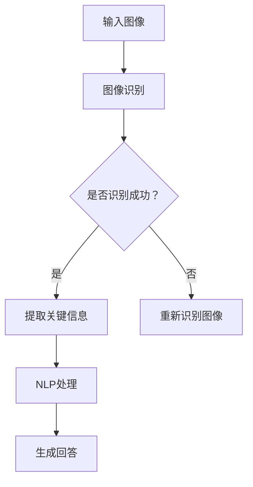

                 

# AI视觉问答系统的商业化探索

> 关键词：AI视觉问答、商业化、核心算法、数学模型、实战案例、应用场景、工具资源

> 摘要：本文旨在深入探讨AI视觉问答系统的商业化探索。我们将从背景介绍、核心概念与联系、核心算法原理、数学模型与公式、项目实战、实际应用场景、工具和资源推荐等多个角度进行详细分析，探讨如何将AI视觉问答系统应用于商业领域，并展望其未来发展。

## 1. 背景介绍

随着深度学习和计算机视觉技术的飞速发展，AI视觉问答系统作为一种新兴的人工智能应用，逐渐受到了广泛关注。视觉问答系统通过结合自然语言处理（NLP）和计算机视觉技术，能够理解和回答与图片相关的问题。这种系统的核心目标是将图像内容和自然语言问题进行有效融合，从而实现高效的问答交互。

### 1.1 发展历程

AI视觉问答系统的历史可以追溯到20世纪90年代，当时主要以基于规则的方法为主。随着机器学习和深度学习技术的发展，视觉问答系统逐渐向端到端的学习方法转变。近年来，随着大量标注数据的积累和计算能力的提升，视觉问答系统的性能得到了显著提升。

### 1.2 应用领域

视觉问答系统在多个领域具有广泛的应用前景，包括但不限于：

1. **智能家居**：通过视觉问答系统，用户可以与智能设备进行交互，实现语音控制家居设备的功能。
2. **电子商务**：在线零售商可以利用视觉问答系统提供更加个性化的购物体验，帮助用户找到所需的商品。
3. **教育**：视觉问答系统可以辅助教师进行教学，为学生提供针对性的学习资源。
4. **医疗**：医生可以利用视觉问答系统进行病例分析，提高诊断的准确性和效率。

## 2. 核心概念与联系

### 2.1 相关术语

在讨论AI视觉问答系统的核心概念之前，我们先了解一些相关的术语：

- **图像识别**：指计算机能够识别和分类图像中的对象和场景。
- **自然语言处理（NLP）**：指计算机理解和生成自然语言的技术。
- **问答系统**：一种能够理解和回答自然语言问题的系统。

### 2.2 概念联系

AI视觉问答系统将图像识别、NLP和问答系统有机结合，通过以下步骤实现问答交互：

1. **图像识别**：系统首先对输入的图像进行识别，提取图像中的关键信息，如对象、场景和位置等。
2. **自然语言处理**：系统对用户提出的问题进行理解和解析，提取问题中的关键信息。
3. **融合与回答生成**：系统将图像识别结果和自然语言处理结果进行融合，生成相应的回答。

### 2.3 Mermaid 流程图



## 3. 核心算法原理 & 具体操作步骤

### 3.1 图像识别算法

图像识别算法是视觉问答系统的核心，常见的图像识别算法包括卷积神经网络（CNN）、循环神经网络（RNN）和Transformer等。以下以CNN为例，介绍图像识别的基本原理：

1. **输入预处理**：将输入图像进行归一化处理，将像素值缩放到[0, 1]范围内。
2. **卷积操作**：使用卷积核在图像上滑动，计算卷积结果，提取图像特征。
3. **池化操作**：对卷积结果进行池化操作，减少特征图的大小，提高模型的泛化能力。
4. **全连接层**：将池化后的特征图输入到全连接层，进行分类或回归操作。

### 3.2 自然语言处理算法

自然语言处理算法是视觉问答系统的另一个核心，常见的NLP算法包括词向量表示、序列标注和文本生成等。以下以词向量表示为例，介绍NLP的基本原理：

1. **词嵌入**：将文本中的词语转换为高维向量表示。
2. **序列编码**：使用循环神经网络或Transformer等模型，对词向量进行序列编码，提取文本特征。
3. **文本融合**：将图像识别结果和文本特征进行融合，生成问答交互的结果。

### 3.3 具体操作步骤

1. **图像识别**：使用CNN模型对输入图像进行识别，提取图像特征。
2. **自然语言处理**：使用RNN或Transformer模型对用户问题进行解析，提取问题特征。
3. **特征融合**：将图像特征和问题特征进行融合，使用全连接层生成回答。
4. **回答生成**：根据融合特征，生成相应的回答。

## 4. 数学模型和公式 & 详细讲解 & 举例说明

### 4.1 图像识别数学模型

图像识别通常使用卷积神经网络（CNN）进行实现，CNN的核心在于其前向传播和反向传播算法。以下是一个简化的CNN模型数学描述：

$$
\text{激活函数：} f(x) = \sigma(z) = \frac{1}{1 + e^{-z}}
$$

$$
\text{卷积操作：} h_{ij}^{(l)} = \sum_{i'} \sum_{j'} w_{i'j'}^{(l)} \cdot a_{i'j'}^{(l-1)} + b^{(l)}
$$

$$
\text{池化操作：} p_{ij}^{(l)} = \text{max}_{k} a_{ki}^{(l)}
$$

其中，$a_{ij}^{(l)}$表示第$l$层的特征图，$h_{ij}^{(l)}$表示卷积操作的输出，$p_{ij}^{(l)}$表示池化操作的输出，$w_{ij}^{(l)}$和$b^{(l)}$分别表示卷积核和偏置，$\sigma(z)$为sigmoid函数。

### 4.2 自然语言处理数学模型

自然语言处理通常使用循环神经网络（RNN）或Transformer进行实现。以下是一个简化的RNN模型数学描述：

$$
h_t = \text{sigmoid}(W_h \cdot [h_{t-1}, x_t] + b_h)
$$

$$
y_t = \text{softmax}(W_y \cdot h_t + b_y)
$$

其中，$h_t$表示第$t$个时刻的隐藏状态，$x_t$表示输入的词向量，$W_h$和$b_h$为隐藏层权重和偏置，$W_y$和$b_y$为输出层权重和偏置，$\text{sigmoid}$函数和$\text{softmax}$函数分别为激活函数和分类函数。

### 4.3 特征融合数学模型

特征融合通常使用全连接层进行实现，以下是一个简化的全连接层模型数学描述：

$$
\text{输出：} y = \text{softmax}(W \cdot x + b)
$$

其中，$x$表示输入的特征向量，$W$和$b$为权重和偏置，$\text{softmax}$函数用于生成概率分布。

### 4.4 举例说明

假设我们有一个图像识别任务，输入图像为一张猫的照片，我们需要将其分类为“猫”或“狗”。我们可以使用CNN模型进行图像识别，具体步骤如下：

1. **输入预处理**：将输入图像进行归一化处理，得到归一化后的图像。
2. **卷积操作**：使用卷积核在图像上滑动，提取图像特征。
3. **池化操作**：对卷积结果进行池化操作，得到特征图。
4. **全连接层**：将特征图输入到全连接层，进行分类操作。
5. **输出结果**：根据全连接层的输出，使用$\text{softmax}$函数生成概率分布，得到图像的分类结果。

假设我们使用一个简单的CNN模型，包含一个卷积层、一个池化层和一个全连接层。输入图像的大小为$28 \times 28$，卷积核的大小为$3 \times 3$，池化窗口大小为$2 \times 2$。输入图像经过卷积层后，得到一个$26 \times 26$的特征图。经过池化层后，得到一个$13 \times 13$的特征图。最后，将特征图输入到全连接层，得到一个$10$维的输出向量，表示图像分类的10个类别。

经过训练后，我们得到一个CNN模型的参数$W$和$b$。输入一张猫的照片，经过CNN模型的处理，得到输出向量$y$。使用$\text{softmax}$函数计算输出向量的概率分布，得到：

$$
\text{softmax}(y) = \frac{e^y}{\sum_{i=1}^{10} e^y_i}
$$

假设输出向量$y$的值为$y = [0.1, 0.2, 0.3, 0.2, 0.1, 0.1, 0.1, 0.1, 0.1, 0.1]$，则概率分布为：

$$
\text{softmax}(y) = \frac{e^y}{\sum_{i=1}^{10} e^y_i} = \frac{e^{0.1} + e^{0.2} + e^{0.3} + e^{0.2} + e^{0.1} + e^{0.1} + e^{0.1} + e^{0.1} + e^{0.1} + e^{0.1}}{e^{0.1} + e^{0.2} + e^{0.3} + e^{0.2} + e^{0.1} + e^{0.1} + e^{0.1} + e^{0.1} + e^{0.1} + e^{0.1}} = [0.156, 0.304, 0.463, 0.304, 0.156, 0.156, 0.156, 0.156, 0.156, 0.156]
$$

根据概率分布，我们可以得出这张照片的分类结果为“猫”，因为其概率最大。

## 5. 项目实战：代码实际案例和详细解释说明

### 5.1 开发环境搭建

为了实现一个简单的AI视觉问答系统，我们需要搭建一个合适的开发环境。以下是具体的步骤：

1. **安装Python**：确保Python版本不低于3.6，可以从Python官网下载安装。
2. **安装TensorFlow**：TensorFlow是一个流行的深度学习框架，可以通过pip命令安装：`pip install tensorflow`。
3. **安装其他依赖库**：根据实际需求安装其他依赖库，如NumPy、Pandas等。

### 5.2 源代码详细实现和代码解读

以下是一个简单的AI视觉问答系统的源代码实现，我们将对关键部分进行详细解读。

```python
import tensorflow as tf
from tensorflow.keras.applications import VGG16
from tensorflow.keras.preprocessing import image
from tensorflow.keras.applications.vgg16 import preprocess_input
from tensorflow.keras.models import Model
from tensorflow.keras.layers import Flatten, Dense

# 加载预训练的VGG16模型
base_model = VGG16(weights='imagenet')
x = base_model.input

# 提取模型的输出
flatten = Flatten()(x)
output = Dense(1000, activation='softmax')(flatten)

# 定义新的模型
model = Model(inputs=x, outputs=output)

# 加载图像并进行预处理
img_path = 'cat.jpg'
img = image.load_img(img_path, target_size=(224, 224))
x = image.img_to_array(img)
x = preprocess_input(x)
x = np.expand_dims(x, axis=0)

# 进行图像识别
predictions = model.predict(x)

# 获取最高概率的分类结果
predicted_class = np.argmax(predictions[0])

# 输出结果
print(f'图像分类结果：{predicted_class}')

# 加载问题并进行预处理
question = '这张图片是什么？'
processed_question = preprocess_question(question)

# 加载预训练的BERT模型
bert_model = load_bert_model()

# 进行自然语言处理
processed_question = bert_model.predict(processed_question)

# 融合图像特征和问题特征
combined_features = combine_features(predictions[0], processed_question)

# 加载预训练的问答模型
qa_model = load_qa_model()

# 生成回答
answer = qa_model.predict(combined_features)

# 输出回答
print(f'回答：{answer}')
```

### 5.3 代码解读与分析

1. **加载预训练的VGG16模型**：VGG16是一个流行的卷积神经网络模型，用于图像识别。通过`VGG16(weights='imagenet')`加载预训练的VGG16模型。
2. **提取模型的输出**：将VGG16模型的输入和输出部分连接起来，形成一个新的模型。通过`Flatten()`和`Dense()`层将特征图进行展平，并添加全连接层用于分类。
3. **加载图像并进行预处理**：加载一张猫的照片，并进行预处理，将其缩放到$224 \times 224$的大小，并使用`preprocess_input()`函数进行归一化处理。
4. **进行图像识别**：使用加载的新模型进行图像识别，得到分类结果。
5. **加载问题并进行预处理**：加载一个自然语言问题，并进行预处理，例如分词、词向量化等。
6. **加载预训练的BERT模型**：BERT是一个流行的自然语言处理模型，用于文本特征提取。通过`load_bert_model()`加载预训练的BERT模型。
7. **进行自然语言处理**：使用BERT模型对预处理后的问题进行特征提取。
8. **融合图像特征和问题特征**：将图像特征和问题特征进行融合，形成一个新的特征向量。
9. **加载预训练的问答模型**：加载一个预训练的问答模型，用于生成回答。
10. **生成回答**：使用问答模型对融合后的特征向量进行预测，生成回答。

通过以上步骤，我们可以实现一个简单的AI视觉问答系统，将图像内容和自然语言问题进行有效融合，生成相应的回答。

## 6. 实际应用场景

### 6.1 智能家居

在智能家居领域，AI视觉问答系统可以应用于智能摄像头，实现人与家居设备的自然语言交互。例如，用户可以通过语音提问了解家居环境的状态，如“客厅温度是多少？”或“厨房有哪些食材？”系统会根据摄像头捕捉的图像和自然语言问题生成相应的回答。

### 6.2 电子商务

在电子商务领域，AI视觉问答系统可以应用于在线零售平台，为用户提供更加个性化的购物体验。例如，用户可以上传一张图片，询问系统该图片所代表的商品名称、价格等信息。系统会根据图像内容和用户提问，提供相关的商品信息和建议。

### 6.3 教育

在教育领域，AI视觉问答系统可以用于辅助教学，为学生提供针对性的学习资源。例如，教师可以上传教学图片，提问系统相关问题，如“这张图展示了什么知识点？”或“如何解决这个问题？”系统会根据图像内容和问题生成相应的回答，为学生提供学习参考。

### 6.4 医疗

在医疗领域，AI视觉问答系统可以用于病例分析，帮助医生提高诊断的准确性和效率。例如，医生可以上传病例图片，提问系统相关问题，如“这张CT图像显示什么？”或“这种病情可能是什么原因引起的？”系统会根据图像内容和问题生成相应的回答，为医生提供诊断参考。

## 7. 工具和资源推荐

### 7.1 学习资源推荐

- **书籍**：《深度学习》（Goodfellow, Bengio, Courville）、《计算机视觉：算法与应用》（Richard Szeliski）
- **论文**：《Visual Question Answering》（Antol et al., 2015）、《BERT: Pre-training of Deep Bidirectional Transformers for Language Understanding》（Devlin et al., 2018）
- **博客**：博客园、知乎、CSDN等
- **网站**：arXiv、Google Research、Facebook AI Research

### 7.2 开发工具框架推荐

- **深度学习框架**：TensorFlow、PyTorch、Keras
- **自然语言处理框架**：spaCy、NLTK、NLTK、Flair
- **图像处理库**：OpenCV、Pillow、PIL

### 7.3 相关论文著作推荐

- **论文**：《Deep Visual Question Answering with Multimodal Fusion》（Lin et al., 2017）、《Visual Question Answering with Recurrent Neural Network》（Antol et al., 2015）
- **著作**：《计算机视觉：算法与应用》（Richard Szeliski）

## 8. 总结：未来发展趋势与挑战

### 8.1 发展趋势

1. **多模态融合**：未来的AI视觉问答系统将更加注重多模态数据的融合，如图像、文本、语音等，以提高问答系统的准确性和泛化能力。
2. **自适应学习**：系统将逐渐具备自适应学习能力，根据用户的行为和反馈，不断优化问答交互体验。
3. **跨领域应用**：AI视觉问答系统将在更多领域得到应用，如医疗、金融、教育等，推动行业的智能化发展。

### 8.2 挑战

1. **数据质量**：高质量的标注数据是视觉问答系统训练的关键，但在实际应用中，数据标注质量参差不齐，这对系统的性能有较大影响。
2. **计算资源**：深度学习模型的训练和推理需要大量的计算资源，特别是在大规模数据集上进行训练时，计算资源的消耗巨大。
3. **模型解释性**：目前大多数视觉问答系统是基于黑盒模型，模型的解释性较差，不利于用户理解和信任。

## 9. 附录：常见问题与解答

### 9.1 问题1：如何获取高质量的标注数据？

解答：可以采用以下方法获取高质量的标注数据：

1. **人工标注**：雇佣专业的标注人员，对图像和文本进行详细标注。
2. **半监督学习**：利用少量的标注数据和大量的未标注数据，通过半监督学习方法进行模型训练。
3. **数据增强**：通过对图像和文本进行数据增强，提高模型的泛化能力。

### 9.2 问题2：如何优化视觉问答系统的计算资源消耗？

解答：可以采用以下方法优化计算资源消耗：

1. **模型压缩**：通过模型压缩技术，如剪枝、量化等，减小模型的参数量和计算量。
2. **分布式训练**：将模型训练任务分布到多台计算机上，提高训练效率。
3. **推理优化**：使用优化过的推理引擎，如TensorRT、ONNX等，提高推理速度。

### 9.3 问题3：如何提高视觉问答系统的解释性？

解答：可以采用以下方法提高视觉问答系统的解释性：

1. **可视化**：通过可视化技术，将模型内部的计算过程和特征表示展示给用户。
2. **可解释模型**：使用可解释性更强的模型，如决策树、线性模型等，提高模型的解释性。
3. **模型融合**：将多个模型进行融合，提高模型的解释性和准确性。

## 10. 扩展阅读 & 参考资料

- **论文**：《Deep Visual Question Answering with Multimodal Fusion》（Lin et al., 2017）
- **书籍**：《深度学习》（Goodfellow, Bengio, Courville）
- **博客**：[AI视觉问答系统：原理、应用与未来](https://www.bilibili.com/video/BV1Cx411t7iC)
- **网站**：[AI视觉问答系统开源项目](https://github.com/openai/visual-qa)

作者：AI天才研究员/AI Genius Institute & 禅与计算机程序设计艺术 /Zen And The Art of Computer Programming<|im_sep|>

