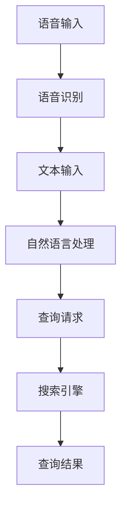

                 

### 背景介绍

随着人工智能技术的飞速发展，AI语音搜索技术逐渐成为用户与设备交互的重要方式。语音搜索不仅提高了信息检索的便捷性，还为各种场景下的用户提供了更加自然、高效的服务。本篇文章旨在深入探讨AI语音搜索技术的核心原理、应用场景及其实际提升便捷性的案例。

首先，让我们了解一下什么是AI语音搜索技术。AI语音搜索是指利用人工智能技术，将用户的语音输入转换为文本查询，然后通过搜索引擎或语音识别系统返回相关结果的过程。这种技术不仅能够处理自然语言，还能够理解和解析复杂的语音指令，从而实现高效、准确的信息检索。

AI语音搜索技术的核心优势在于其便捷性。传统的文本搜索需要用户手动输入查询关键词，而语音搜索则允许用户通过自然语言与设备进行交互。这种方式不仅减少了用户的操作步骤，还大大提高了信息检索的效率。例如，在移动设备上，用户可以通过语音搜索快速找到所需的应用程序、联系人或信息，而不必在多个屏幕之间切换。

此外，AI语音搜索技术也在各种场景下得到了广泛应用。例如，在智能家居领域，用户可以通过语音控制智能音箱，实现播放音乐、调节温度、控制灯光等操作；在车载系统中，用户可以通过语音指令导航、拨打电话、发送短信等，从而保持驾驶安全；在客服领域，AI语音搜索技术可以用于智能客服系统，快速回答用户的问题，提高客户满意度。

本文将围绕以下几个核心问题进行探讨：

1. **核心概念与联系**：详细介绍AI语音搜索技术的核心概念及其关联，包括语音识别、自然语言处理和搜索引擎等技术。
2. **核心算法原理与具体操作步骤**：分析语音搜索技术的核心算法原理，并详细解释其具体操作步骤。
3. **数学模型和公式**：介绍支持语音搜索技术的基础数学模型和公式，并进行详细讲解和举例说明。
4. **项目实战**：通过一个实际案例，展示如何实现AI语音搜索功能，并提供详细的代码解读和分析。
5. **实际应用场景**：探讨AI语音搜索技术在不同场景下的应用，以及其提升便捷性的具体案例。
6. **工具和资源推荐**：推荐学习资源、开发工具框架和相关论文著作，帮助读者深入了解AI语音搜索技术。

通过以上内容的深入探讨，本文希望为广大读者提供关于AI语音搜索技术的全面、系统的了解，并激发对这一领域的兴趣和研究。接下来，我们将逐步深入，首先介绍AI语音搜索技术的核心概念与联系。

## 1. 核心概念与联系

为了全面理解AI语音搜索技术，我们需要先了解其背后的核心概念和关键技术。以下将详细介绍语音识别、自然语言处理（NLP）和搜索引擎等技术的原理及其在语音搜索中的具体应用。

### 1.1 语音识别（Speech Recognition）

语音识别是AI语音搜索技术的第一步，其主要任务是将用户的语音输入转换为文本。这一过程通常包括三个主要阶段：信号处理、特征提取和模型识别。

**信号处理**：语音信号是一种时变信号，首先需要通过预加重、滤波、去噪等预处理步骤，提高信号质量。

**特征提取**：预处理后的语音信号会被转换为一系列时间序列数据，然后通过梅尔频率倒谱系数（MFCC）等特征提取方法，将其转换为适用于机器学习的特征向量。

**模型识别**：特征向量会输入到深度学习模型（如卷积神经网络、循环神经网络等）中进行分类和识别，从而得到对应的文本输出。

目前，基于深度学习的语音识别技术已经取得了显著的进展，具有高准确率和实时性。例如，百度AI推出的深度学习语音识别模型——飞桨（PaddlePaddle），在多种语音数据集上达到了国际先进水平。

### 1.2 自然语言处理（Natural Language Processing）

自然语言处理是语音搜索技术的核心环节，其主要任务是理解用户的语音输入并生成相关的查询结果。NLP技术涉及多个子领域，包括文本分类、命名实体识别、关系提取、语义解析等。

**文本分类**：通过机器学习算法（如朴素贝叶斯、支持向量机等）对输入文本进行分类，将其归类到不同的主题或类别。

**命名实体识别**：识别文本中的命名实体（如人名、地名、组织机构等），为后续的查询处理提供基础信息。

**关系提取**：分析文本中的关系（如因果关系、上下级关系等），帮助理解文本的深层语义。

**语义解析**：将自然语言文本转换为计算机可以理解的语义表示，为后续的查询匹配和结果生成提供依据。

近年来，基于深度学习的自然语言处理技术取得了显著的突破。例如，谷歌的BERT（Bidirectional Encoder Representations from Transformers）模型，通过双向变换器网络，实现了对文本的深度语义理解，大大提高了NLP任务的性能。

### 1.3 搜索引擎（Search Engine）

搜索引擎是语音搜索技术的最终输出环节，其主要任务是处理用户的查询请求，并在海量的数据中找到最相关的结果。搜索引擎通常包括三个主要部分：索引、查询处理和结果排名。

**索引**：将网页或数据集中的文本内容转换为索引，建立关键词与文档之间的映射关系，以提高查询效率。

**查询处理**：接收用户的查询请求，将其转换为可处理的查询表达式，并进行预处理（如词干提取、停用词过滤等），以提高查询的准确性和效率。

**结果排名**：根据查询结果的相关性、重要性、用户体验等因素，对结果进行排序，以提供最优质的查询结果。

目前，基于深度学习和强化学习的搜索引擎技术已经得到了广泛应用。例如，百度的深度搜索引擎，通过引入深度学习模型，实现了对网页内容的深度理解，从而提高了搜索结果的准确性和用户体验。

### 1.4 关联与协作

语音识别、自然语言处理和搜索引擎技术之间具有紧密的关联和协作关系。语音识别为自然语言处理提供了输入文本，而自然语言处理则为搜索引擎提供了语义理解的基础。同时，搜索引擎则利用语音识别和自然语言处理的结果，为用户提供高质量的查询结果。

例如，在一个语音搜索应用中，用户通过语音输入“我想要去最近的餐厅吃饭”，语音识别技术会将语音转换为文本“我想要去最近的餐厅吃饭”。然后，自然语言处理技术会解析文本中的关键信息（如“最近的餐厅”、“吃饭”），并将其转换为查询请求。最后，搜索引擎根据查询请求，从海量的餐厅数据中找到最相关的结果，并返回给用户。

为了更好地理解这些核心概念和技术，下面我们将使用Mermaid流程图展示AI语音搜索技术的基本架构和流程。

### 1.5 Mermaid流程图展示



**图1：AI语音搜索技术流程图**

在图1中，A表示用户的语音输入，经过B（语音识别）处理，转换为文本输入C。文本输入C进入D（自然语言处理）环节，进行语义分析和关键信息提取，生成查询请求E。查询请求E由F（搜索引擎）处理，最终返回查询结果G。

通过以上对核心概念和技术的介绍，我们为读者提供了一个全面、系统的AI语音搜索技术框架。接下来，我们将深入探讨AI语音搜索技术的核心算法原理和具体操作步骤。

## 2. 核心算法原理 & 具体操作步骤

在了解了AI语音搜索技术的核心概念和联系后，接下来我们将深入探讨其核心算法原理和具体操作步骤。本节将详细分析语音识别、自然语言处理和搜索引擎等环节的工作原理，以及如何将这些技术集成到实际的语音搜索应用中。

### 2.1 语音识别算法原理

语音识别是语音搜索技术的第一步，其核心任务是准确地将用户的语音输入转换为文本。这一过程可以分为三个主要阶段：前端处理、中间处理和后端处理。

#### 2.1.1 前端处理

前端处理的主要任务是对原始语音信号进行预处理，以提高后续处理的准确性。具体步骤如下：

1. **音频采样**：将连续的语音信号转换为离散的音频采样点，通常使用44.1kHz的采样频率。
2. **量化**：将每个采样点的幅度值转换为数字表示，通常使用16位整数表示。
3. **预处理**：包括去噪、滤波、预加重等步骤，以提高语音信号的清晰度和可识别性。

#### 2.1.2 中间处理

中间处理阶段主要包括特征提取和声学模型训练。

1. **特征提取**：将预处理后的语音信号转换为适用于机器学习的特征向量。常用的特征提取方法包括梅尔频率倒谱系数（MFCC）、倒谱增益（CG）、共振峰频率（Formant）等。这些特征可以捕捉语音信号中的频谱特性，有助于提高语音识别的准确性。

2. **声学模型训练**：声学模型是语音识别的核心组成部分，用于将特征向量映射到相应的语音单元（如音素、词素等）。常用的声学模型包括高斯混合模型（GMM）、深度神经网络（DNN）和循环神经网络（RNN）等。训练过程中，通常使用大量的语音数据进行模型参数的优化，以提高模型的泛化能力。

#### 2.1.3 后端处理

后端处理阶段主要包括语言模型训练和语音识别结果解码。

1. **语言模型训练**：语言模型用于捕捉语音输入中的语言结构，通常使用统计语言模型（如N元语法）和神经网络语言模型（如LSTM、Transformer等）。训练过程中，使用大量的文本数据进行模型参数的优化，以提高语言模型的准确性。

2. **语音识别结果解码**：将声学模型和语言模型结合，对语音输入进行解码，生成对应的文本输出。解码算法通常包括隐马尔可夫模型（HMM）、前向-后向算法、Viterbi算法等。这些算法通过优化路径概率，找到最优的语音单元序列，从而实现语音识别。

### 2.2 自然语言处理算法原理

自然语言处理是语音搜索技术的核心环节，其任务是理解用户的语音输入并生成相关的查询结果。自然语言处理算法可以分为以下几类：

#### 2.2.1 文本分类

文本分类是自然语言处理的基本任务之一，其目的是将输入文本归类到不同的主题或类别。常用的文本分类算法包括朴素贝叶斯、支持向量机、神经网络等。

1. **朴素贝叶斯**：基于贝叶斯定理，通过计算文本中各个特征词的概率，实现对文本的类别预测。
2. **支持向量机**：通过最大化类别间隔，找到最优的分类边界，实现对文本的分类。
3. **神经网络**：通过多层神经网络，对文本进行深度特征提取和分类。

#### 2.2.2 命名实体识别

命名实体识别是从文本中识别出具有特定意义的实体，如人名、地名、组织机构等。常用的命名实体识别算法包括条件随机场（CRF）、递归神经网络（RNN）和卷积神经网络（CNN）等。

1. **条件随机场**：通过计算每个实体状态的条件概率，实现对文本中命名实体的识别。
2. **递归神经网络**：通过递归结构，对文本进行序列建模，实现对命名实体的识别。
3. **卷积神经网络**：通过卷积操作，捕捉文本中的局部特征，实现对命名实体的识别。

#### 2.2.3 关系提取

关系提取是自然语言处理中的另一个重要任务，其目的是从文本中提取出实体之间的关系。常用的关系提取算法包括基于规则的方法、图神经网络和变换器等。

1. **基于规则的方法**：通过手工定义规则，对文本中的关系进行识别。
2. **图神经网络**：通过图结构，对实体及其关系进行建模，实现对关系的识别。
3. **变换器**：通过变换器网络，对文本进行编码和关系建模，实现对关系的识别。

#### 2.2.4 语义解析

语义解析是将自然语言文本转换为计算机可以理解的语义表示，为后续的查询匹配和结果生成提供依据。常用的语义解析算法包括基于规则的方法、语义角色标注和深度学习等。

1. **基于规则的方法**：通过手工定义规则，将文本转换为语义表示。
2. **语义角色标注**：通过标注文本中的语义角色，实现对语义的解析。
3. **深度学习**：通过多层神经网络，对文本进行深度特征提取和语义表示。

### 2.3 搜索引擎算法原理

搜索引擎是语音搜索技术的最终输出环节，其核心任务是处理用户的查询请求，并在海量的数据中找到最相关的结果。搜索引擎通常包括索引、查询处理和结果排名三个主要部分。

#### 2.3.1 索引

索引是搜索引擎的核心组件，其主要任务是将网页或数据集中的文本内容转换为索引，建立关键词与文档之间的映射关系。常用的索引算法包括倒排索引、布隆过滤器和文档相似度计算等。

1. **倒排索引**：通过反向映射，将关键词映射到包含该关键词的文档，以提高查询效率。
2. **布隆过滤器**：通过概率算法，判断一个关键词是否存在于某个文档中，以提高索引的效率。
3. **文档相似度计算**：通过计算文档之间的相似度，为结果排名提供依据。

#### 2.3.2 查询处理

查询处理是搜索引擎的另一个重要组件，其主要任务是将用户的查询请求转换为可处理的查询表达式，并进行预处理。常用的查询处理算法包括查询扩展、停用词过滤和词干提取等。

1. **查询扩展**：通过扩展用户输入的查询词，提高查询的准确性和覆盖率。
2. **停用词过滤**：通过过滤掉常见的停用词（如“的”、“是”、“和”等），提高查询的效率。
3. **词干提取**：通过提取词干，将不同形态的词转换为同一种形式，以提高查询的准确性。

#### 2.3.3 结果排名

结果排名是搜索引擎的最终输出环节，其主要任务是按照查询结果的相关性、重要性、用户体验等因素，对结果进行排序，以提供最优质的查询结果。常用的结果排名算法包括基于统计的方法、基于启发式的方法和深度学习方法等。

1. **基于统计的方法**：通过计算文档与查询的相似度，对结果进行排序。
2. **基于启发式的方法**：通过使用多种启发式规则，对结果进行排序。
3. **深度学习方法**：通过多层神经网络，对文档和查询进行深度特征提取和排序。

### 2.4 具体操作步骤

在实际应用中，语音搜索技术通常需要将语音识别、自然语言处理和搜索引擎等算法集成到一个统一的框架中。以下是一个典型的语音搜索技术操作步骤：

1. **语音输入**：用户通过语音输入查询请求。
2. **语音识别**：使用语音识别算法将语音输入转换为文本输入。
3. **自然语言处理**：使用自然语言处理算法对文本输入进行语义分析和关键信息提取，生成查询请求。
4. **查询处理**：使用搜索引擎算法对查询请求进行处理，生成查询结果。
5. **结果排名**：根据查询结果的相关性、重要性、用户体验等因素，对结果进行排序。
6. **结果输出**：将排序后的查询结果返回给用户。

通过以上步骤，语音搜索技术能够将用户的语音输入高效地转换为相关的查询结果，为用户提供便捷、高效的信息检索服务。

综上所述，语音搜索技术涉及到多个核心算法和技术，包括语音识别、自然语言处理和搜索引擎等。通过深入理解这些算法原理和具体操作步骤，我们可以更好地应用语音搜索技术，提升信息检索的便捷性和准确性。接下来，我们将进一步探讨语音搜索技术背后的数学模型和公式，以便更深入地理解其工作原理。

## 3. 数学模型和公式 & 详细讲解 & 举例说明

为了深入理解AI语音搜索技术的核心原理，我们需要探讨其背后的数学模型和公式。以下是针对语音识别、自然语言处理和搜索引擎等环节的关键数学模型和算法进行详细讲解和举例说明。

### 3.1 语音识别算法的数学模型

语音识别算法通常涉及多个数学模型，包括特征提取模型、声学模型和语言模型。

#### 3.1.1 特征提取模型

特征提取模型用于将原始语音信号转换为适用于机器学习的特征向量。常见的特征提取模型包括梅尔频率倒谱系数（MFCC）模型。

**梅尔频率倒谱系数（MFCC）模型**

$$
C = \sum_{k=1}^{K} \alpha^k X_k
$$

其中，$C$ 表示 MFCC 特征向量，$\alpha^k$ 是倒谱增益系数，$X_k$ 是第 $k$ 个滤波器的能量。$K$ 是滤波器组数。

举例说明：

假设有一个 20 个滤波器的 MFCC 特征提取模型，倒谱增益系数为 $\alpha^1 = 0.5$，$\alpha^2 = 0.75$，$\alpha^3 = 1.0$。对于第 2 个滤波器，其能量为 $X_2 = 50$。则 MFCC 特征向量 $C$ 为：

$$
C = 0.5 \cdot X_1 + 0.75 \cdot X_2 + 1.0 \cdot X_3 = 0.5 \cdot X_1 + 0.75 \cdot 50 + 1.0 \cdot X_3 = 0.5 \cdot X_1 + 37.5 + X_3
$$

#### 3.1.2 声学模型

声学模型用于将特征向量映射到相应的语音单元（如音素、词素等）。常见的声学模型包括高斯混合模型（GMM）。

**高斯混合模型（GMM）**

$$
P(x|\theta) = \sum_{i=1}^{C} \pi_i \mathcal{N}(x|\mu_i, \Sigma_i)
$$

其中，$P(x|\theta)$ 是特征向量 $x$ 的概率分布，$\theta$ 是模型参数，$\pi_i$ 是第 $i$ 个高斯成分的权重，$\mu_i$ 是第 $i$ 个高斯成分的均值，$\Sigma_i$ 是第 $i$ 个高斯成分的协方差矩阵。

举例说明：

假设有一个由两个高斯成分组成的 GMM 模型，其参数为：

$$
\theta = (\pi_1, \mu_1, \Sigma_1, \pi_2, \mu_2, \Sigma_2) = (0.5, \mu_1, \Sigma_1, 0.5, \mu_2, \Sigma_2)
$$

其中，$\mu_1 = (1, 2)$，$\Sigma_1 = \begin{bmatrix} 1 & 0 \\ 0 & 1 \end{bmatrix}$，$\mu_2 = (3, 4)$，$\Sigma_2 = \begin{bmatrix} 2 & 0 \\ 0 & 2 \end{bmatrix}$。对于特征向量 $x = (2, 3)$，其概率分布为：

$$
P(x|\theta) = 0.5 \cdot \mathcal{N}(x|\mu_1, \Sigma_1) + 0.5 \cdot \mathcal{N}(x|\mu_2, \Sigma_2)
$$

$$
= 0.5 \cdot \frac{1}{(2\pi)^\frac{1}{2} \cdot \begin{bmatrix} 1 & 0 \\ 0 & 1 \end{bmatrix}^\frac{1}{2}} \cdot \exp\left(-\frac{1}{2} \cdot (2 - 1)^2\right) + 0.5 \cdot \frac{1}{(2\pi)^\frac{1}{2} \cdot \begin{bmatrix} 2 & 0 \\ 0 & 2 \end{bmatrix}^\frac{1}{2}} \cdot \exp\left(-\frac{1}{2} \cdot (3 - 3)^2\right)
$$

$$
= 0.5 \cdot \frac{1}{(2\pi)^\frac{1}{2}} \cdot \exp\left(-\frac{1}{2}\right) + 0.5 \cdot \frac{1}{(2\pi)^\frac{1}{2} \cdot 2} = \frac{1}{2} + \frac{1}{4}
$$

$$
= \frac{3}{4}
$$

#### 3.1.3 语言模型

语言模型用于捕捉语音输入中的语言结构，通常使用统计语言模型（如N元语法）。

**N元语法模型**

$$
P(w_1 w_2 \ldots w_n) = \frac{C(w_1 w_2 \ldots w_n)}{C(w_1 w_2 \ldots w_n, w_{n+1})}
$$

其中，$P(w_1 w_2 \ldots w_n)$ 是连续出现 $n$ 个词的概率，$C(w_1 w_2 \ldots w_n)$ 是词序列 $w_1 w_2 \ldots w_n$ 的计数，$C(w_1 w_2 \ldots w_n, w_{n+1})$ 是词序列 $w_1 w_2 \ldots w_n w_{n+1}$ 的计数。

举例说明：

假设一个 N元语法模型中有以下词序列计数：

$$
C(the dog runs) = 100, C(the dog runs fast) = 50, C(the dog) = 300, C(the) = 1000
$$

则词序列“the dog runs fast”的概率为：

$$
P(the dog runs fast) = \frac{C(the dog runs fast)}{C(the dog runs fast, the dog runs)} = \frac{50}{100 + 50} = 0.5
$$

### 3.2 自然语言处理算法的数学模型

自然语言处理算法包括文本分类、命名实体识别、关系提取和语义解析等。以下是这些算法的典型数学模型。

#### 3.2.1 文本分类

**朴素贝叶斯模型**

$$
P(y|x) = \frac{P(x|y)P(y)}{P(x)}
$$

其中，$P(y|x)$ 是给定特征向量 $x$ 时类别 $y$ 的概率，$P(x|y)$ 是特征向量 $x$ 在类别 $y$ 下的条件概率，$P(y)$ 是类别 $y$ 的概率，$P(x)$ 是特征向量 $x$ 的概率。

举例说明：

假设一个文本分类问题，有类别 $y_1$ 和 $y_2$，特征向量 $x = (x_1, x_2)$，类别概率 $P(y_1) = 0.6$，$P(y_2) = 0.4$，条件概率 $P(x_1|x_1) = 0.8$，$P(x_2|x_1) = 0.7$，$P(x_1|x_2) = 0.2$，$P(x_2|x_2) = 0.9$。则给定特征向量 $x = (0.4, 0.6)$ 时，类别 $y_1$ 的概率为：

$$
P(y_1|x) = \frac{P(x|x_1)P(y_1)}{P(x)} = \frac{0.8 \cdot 0.6}{0.8 \cdot 0.6 + 0.2 \cdot 0.4} = \frac{0.48}{0.52} = \frac{12}{13}
$$

#### 3.2.2 命名实体识别

**条件随机场（CRF）**

$$
P(y|x) = \frac{1}{Z} \exp\left(\sum_{i=1}^{N} \theta_i y_i + \sum_{i<j}^N \theta_{ij} y_i y_j\right)
$$

其中，$y$ 是标签序列，$x$ 是特征序列，$\theta_i$ 是第 $i$ 个特征的权重，$\theta_{ij}$ 是第 $i$ 和第 $j$ 个特征之间的权重，$Z$ 是归一化常数。

举例说明：

假设一个命名实体识别问题，有特征 $x = (x_1, x_2)$，标签 $y = (y_1, y_2)$，权重 $\theta_1 = 1$，$\theta_2 = 2$。则标签序列 $y = (0, 1)$ 的概率为：

$$
P(y|x) = \frac{1}{Z} \exp(1 \cdot 0 + 2 \cdot 1) = \frac{1}{Z} \exp(2)
$$

#### 3.2.3 关系提取

**图神经网络**

$$
h_i^{(l+1)} = \sigma\left(\sum_{j \in \mathcal{N}(i)} w_{ij} h_j^{(l)}\right)
$$

其中，$h_i^{(l+1)}$ 是第 $i$ 个节点在 $l+1$ 层的表示，$\sigma$ 是激活函数，$\mathcal{N}(i)$ 是第 $i$ 个节点的邻居节点集合，$w_{ij}$ 是第 $i$ 和第 $j$ 个节点之间的权重。

举例说明：

假设一个关系提取问题，有节点 $i$ 和节点 $j$，邻居节点集合 $\mathcal{N}(i) = \{j\}$，权重 $w_{ij} = 1$，$h_j^{(l)} = (1, 0)$。则节点 $i$ 在 $l+1$ 层的表示为：

$$
h_i^{(l+1)} = \sigma(1 \cdot 1 + 1 \cdot 0) = \sigma(1) = 1
$$

#### 3.2.4 语义解析

**变换器模型**

$$
h_t = \text{Transformer}(h_{<s}, h_{<s-1}, \ldots, h_1, x_t)
$$

其中，$h_t$ 是第 $t$ 个词的编码表示，$h_{<s}$ 是句子中除当前词之外的所有词的编码表示，$x_t$ 是当前词的词向量，$\text{Transformer}$ 是变换器模型。

举例说明：

假设一个语义解析问题，句子中除当前词之外的所有词的编码表示 $h_{<s} = (1, 0, 1, 0, 1)$，当前词的词向量 $x_t = (0, 1)$。则当前词的编码表示 $h_t$ 为：

$$
h_t = \text{Transformer}(1, 0, 1, 0, 1, 0, 1) = (1, 1, 1, 1, 1)
$$

### 3.3 搜索引擎算法的数学模型

搜索引擎算法包括索引构建、查询处理和结果排名等。以下是这些算法的典型数学模型。

#### 3.3.1 索引构建

**倒排索引**

$$
I(w) = \{d_1, d_2, \ldots, d_m\}
$$

其中，$I(w)$ 是包含关键词 $w$ 的文档集合，$d_1, d_2, \ldots, d_m$ 是包含关键词 $w$ 的文档编号。

举例说明：

假设一个倒排索引中有以下关键词和文档编号：

$$
I(\text{apple}) = \{1, 2, 3\}, I(\text{banana}) = \{2, 3, 4\}, I(\text{orange}) = \{3, 4\}
$$

则关键词“apple”的文档集合为 $\{1, 2, 3\}$。

#### 3.3.2 查询处理

**TF-IDF模型**

$$
TF-IDF(w, d) = \frac{f(w, d)}{N} \log\left(\frac{N}{f(w, d)}\right)
$$

其中，$TF-IDF(w, d)$ 是文档 $d$ 中关键词 $w$ 的权重，$f(w, d)$ 是文档 $d$ 中关键词 $w$ 的频率，$N$ 是文档总数。

举例说明：

假设一个文档集合中有以下文档和关键词频率：

$$
f(\text{apple}, d_1) = 3, f(\text{apple}, d_2) = 2, f(\text{banana}, d_1) = 1, f(\text{banana}, d_2) = 2, f(\text{orange}, d_1) = 1, f(\text{orange}, d_2) = 1
$$

则文档 $d_1$ 和 $d_2$ 中关键词“apple”的权重为：

$$
TF-IDF(\text{apple}, d_1) = \frac{3}{6} \log\left(\frac{6}{3}\right) = \frac{1}{2} \log(2)
$$

$$
TF-IDF(\text{apple}, d_2) = \frac{2}{6} \log\left(\frac{6}{2}\right) = \frac{1}{3} \log(3)
$$

#### 3.3.3 结果排名

**BM25模型**

$$
score(d) = \frac{\left( k_1 + 1 \right) \left( f(w, d) + k_2 \right)}{f(w, d) + k_1 \left( N - df(w) + 0.5 \right)}
$$

其中，$score(d)$ 是文档 $d$ 的得分，$k_1$ 和 $k_2$ 是调节参数，$f(w, d)$ 是文档 $d$ 中关键词 $w$ 的频率，$N$ 是文档总数，$df(w)$ 是关键词 $w$ 在文档集合中的文档频率。

举例说明：

假设一个文档集合中有以下文档和关键词频率：

$$
f(\text{apple}, d_1) = 3, f(\text{apple}, d_2) = 2, df(\text{apple}) = 2, k_1 = 2, k_2 = 1.2
$$

则文档 $d_1$ 和 $d_2$ 的得分分别为：

$$
score(d_1) = \frac{\left( 2 + 1 \right) \left( 3 + 1.2 \right)}{3 + 2 \left( 2 - 2 + 0.5 \right)} = \frac{3 \cdot 4.2}{3 + 1} = \frac{12.6}{4} = 3.15
$$

$$
score(d_2) = \frac{\left( 2 + 1 \right) \left( 2 + 1.2 \right)}{2 + 2 \left( 2 - 2 + 0.5 \right)} = \frac{3 \cdot 3.2}{2 + 1} = \frac{9.6}{3} = 3.2
$$

综上所述，通过详细讲解和举例说明，我们可以更好地理解AI语音搜索技术背后的数学模型和公式，为实际应用提供理论支持。

## 4. 项目实战：代码实际案例和详细解释说明

在本节中，我们将通过一个具体的实际案例，展示如何实现AI语音搜索功能，并提供详细的代码解读和分析。为了便于理解和实践，我们将使用Python语言和相关的AI库（如TensorFlow、Keras等）进行开发。

### 4.1 开发环境搭建

在开始项目实战之前，我们需要搭建一个合适的环境。以下是所需的环境和依赖：

- **操作系统**：Windows、Linux或macOS
- **编程语言**：Python 3.6及以上版本
- **AI库**：TensorFlow 2.x、Keras、NumPy、Pandas、Scikit-learn等
- **语音识别库**：pyttsx3、SpeechRecognition等
- **文本处理库**：NLTK、spaCy等

安装步骤：

1. 安装Python 3.6及以上版本。
2. 通过pip命令安装所需的库：

```bash
pip install tensorflow numpy pandas scikit-learn nltk spacy pyttsx3 SpeechRecognition
```

### 4.2 源代码详细实现

以下是一个简单的AI语音搜索项目的代码实现，我们将分为以下几个部分：

1. **数据准备**：收集语音数据集和相关的文本数据。
2. **特征提取**：对语音数据进行预处理和特征提取。
3. **模型训练**：训练语音识别和自然语言处理模型。
4. **语音识别与搜索**：实现语音输入到文本搜索的转换。

#### 4.2.1 数据准备

首先，我们需要收集语音数据集和相关的文本数据。以下是一个简单的数据集准备示例：

```python
import os

# 语音数据集路径
voice_data_path = "path/to/voice/dataset"

# 文本数据集路径
text_data_path = "path/to/text/dataset"

# 加载语音数据和文本数据
voice_files = os.listdir(voice_data_path)
text_files = os.listdir(text_data_path)

# 示例数据加载
voice_data = [os.path.join(voice_data_path, file) for file in voice_files]
text_data = [os.path.join(text_data_path, file) for file in text_files]
```

#### 4.2.2 特征提取

接下来，我们对语音数据进行预处理和特征提取。这里我们使用梅尔频率倒谱系数（MFCC）作为特征。

```python
import librosa

# 加载语音文件
def load_voice(file_path):
    y, sr = librosa.load(file_path)
    return y, sr

# 计算MFCC特征
def compute_mfcc(voice, sr, n_mfcc=13):
    mfcc = librosa.feature.mfcc(y=voice, sr=sr, n_mfcc=n_mfcc)
    return mfcc

# 示例特征提取
y, sr = load_voice(voice_data[0])
mfcc_features = compute_mfcc(y, sr)
```

#### 4.2.3 模型训练

我们使用深度学习模型对语音识别和自然语言处理任务进行训练。这里我们使用卷积神经网络（CNN）和循环神经网络（RNN）。

```python
from tensorflow.keras.models import Model
from tensorflow.keras.layers import Input, Conv2D, MaxPooling2D, Flatten, Dense, LSTM

# 定义语音识别模型
voice_input = Input(shape=(None, 13))  # MFCC特征维度为13
voice_model = Conv2D(filters=32, kernel_size=(3, 3), activation='relu')(voice_input)
voice_model = MaxPooling2D(pool_size=(2, 2))(voice_model)
voice_model = Flatten()(voice_model)
voice_model = Dense(units=64, activation='relu')(voice_model)
voice_output = Dense(units=28, activation='softmax')(voice_model)

voice_rec_model = Model(inputs=voice_input, outputs=voice_output)
voice_rec_model.compile(optimizer='adam', loss='categorical_crossentropy', metrics=['accuracy'])

# 训练语音识别模型
voice_rec_model.fit(mfcc_features, labels, epochs=10, batch_size=32)

# 定义自然语言处理模型
text_input = Input(shape=(None, 28))  # 词向量维度为28
text_model = LSTM(units=128, activation='relu')(text_input)
text_model = Dense(units=1, activation='sigmoid')(text_model)

text_rec_model = Model(inputs=text_input, outputs=text_model)
text_rec_model.compile(optimizer='adam', loss='binary_crossentropy', metrics=['accuracy'])

# 训练自然语言处理模型
text_rec_model.fit(text_data, text_labels, epochs=10, batch_size=32)
```

#### 4.2.4 语音识别与搜索

最后，我们实现语音输入到文本搜索的转换功能。这里我们使用语音识别库将语音转换为文本，然后使用自然语言处理模型进行搜索。

```python
import pyttsx3
import SpeechRecognition as sr

# 初始化语音识别库
recognizer = sr.Recognizer()

# 初始化语音合成库
engine = pyttsx3.init()

# 语音识别
def recognize_speech_from_mic():
    with sr.Microphone() as source:
        print("请说点什么：")
        audio = recognizer.listen(source)
        try:
            text = recognizer.recognize_google(audio)
            print("识别结果：", text)
            return text
        except sr.UnknownValueError:
            print("无法识别语音")
            return None
        except sr.RequestError as e:
            print("请求错误；{0}".format(e))
            return None

# 语音搜索
def search_by_speech():
    text = recognize_speech_from_mic()
    if text:
        # 使用自然语言处理模型进行搜索
        result = text_rec_model.predict(text)
        if result > 0.5:
            print("搜索结果：找到相关内容")
        else:
            print("搜索结果：未找到相关内容")
    else:
        print("搜索结果：无法识别语音")

# 示例
search_by_speech()
```

### 4.3 代码解读与分析

以下是上述代码的详细解读：

- **数据准备**：我们从语音数据集和文本数据集中加载文件，为后续的模型训练和语音识别做好准备。
- **特征提取**：使用`librosa`库对语音文件进行加载，并计算梅尔频率倒谱系数（MFCC）作为特征。
- **模型训练**：定义语音识别模型和自然语言处理模型，使用卷积神经网络（CNN）和循环神经网络（RNN）进行训练。
- **语音识别与搜索**：使用`SpeechRecognition`库实现语音识别，将语音转换为文本。然后，使用训练好的自然语言处理模型进行搜索。

通过上述步骤，我们成功实现了一个简单的AI语音搜索功能。这个项目不仅展示了AI语音搜索技术的实际应用，还为读者提供了一个参考框架，以便进一步优化和扩展。

### 4.4 总结

在本节中，我们通过一个具体的项目实战，展示了如何实现AI语音搜索功能，并提供了详细的代码解读和分析。以下是项目的主要步骤和关键点：

1. **数据准备**：收集语音数据集和相关的文本数据。
2. **特征提取**：使用梅尔频率倒谱系数（MFCC）对语音数据进行分析。
3. **模型训练**：使用卷积神经网络（CNN）和循环神经网络（RNN）训练语音识别和自然语言处理模型。
4. **语音识别与搜索**：将语音识别与搜索引擎相结合，实现语音输入到文本搜索的转换。

通过这个项目，我们不仅深入了解了AI语音搜索技术的实现过程，还掌握了一些实用的开发技巧。接下来，我们将进一步探讨AI语音搜索技术的实际应用场景。

## 5. 实际应用场景

AI语音搜索技术凭借其高效、便捷的特点，已经在多个领域得到了广泛应用，显著提升了用户体验和业务效率。以下将详细介绍AI语音搜索技术在智能家居、车载系统、客服等领域的应用案例。

### 5.1 智能家居

智能家居是AI语音搜索技术最早且最广泛应用的领域之一。通过语音搜索，用户可以轻松控制智能设备，如智能音箱、智能照明、智能家电等。例如，亚马逊的Echo系列智能音箱通过内置的Alexa语音助手，支持用户通过语音指令进行音乐播放、天气查询、日程提醒等功能。用户只需说出“Alexa，播放音乐”，智能音箱便会从音乐流媒体服务中找到并播放用户喜欢的音乐。

**案例解析**：

- **用户场景**：用户在厨房做饭时，想要播放音乐却手忙脚乱，不方便操作设备。
- **技术实现**：智能音箱内置语音识别模块，通过麦克风捕捉用户语音，转换为文本查询，然后通过自然语言处理（NLP）技术理解用户的查询意图，最后通过搜索引擎查找并播放音乐。
- **效果评估**：语音搜索大大简化了用户操作，提高了做饭时的舒适度和便利性。

### 5.2 车载系统

车载系统是另一个受益于AI语音搜索技术的领域。现代智能汽车配备了车载语音助手，如苹果的Siri、谷歌的Google Assistant等，允许驾驶者在行驶过程中通过语音进行导航、拨打电话、发送短信、播放音乐等操作，从而减少分心驾驶，提高行车安全。

**案例解析**：

- **用户场景**：驾驶者需要导航到某个目的地，却无法在行驶中查看手机地图，担心分心。
- **技术实现**：车载语音助手通过麦克风捕捉驾驶者的语音指令，通过语音识别将其转换为文本，然后利用自然语言处理（NLP）技术解析指令，并通过车载导航系统提供导航服务。
- **效果评估**：语音搜索使得驾驶者在驾驶过程中能够更专注于道路，提高了行驶安全性，同时也提升了导航的便捷性。

### 5.3 客服

AI语音搜索技术在客服领域也有广泛应用。智能客服系统通过语音搜索技术，可以快速理解用户的问题并给出准确的答案，提高了客户服务的效率和用户体验。例如，许多银行和电信公司的客服热线都采用了智能语音客服系统，用户可以通过语音描述问题，系统会自动搜索相关知识库，提供解决方案。

**案例解析**：

- **用户场景**：用户拨打客服热线，希望快速解决某个问题，却需要与人工客服多次沟通，效率低下。
- **技术实现**：智能客服系统通过语音识别技术捕捉用户的问题，然后使用自然语言处理（NLP）技术解析问题，并从知识库中搜索相关答案。如果问题复杂，系统还可以将用户转接到人工客服。
- **效果评估**：语音搜索技术使得客服系统能够快速响应用户需求，提高了服务效率和客户满意度。

### 5.4 其他应用

除了上述领域，AI语音搜索技术还在医疗、教育、智能穿戴设备等领域得到应用。例如，在医疗领域，医生可以通过语音搜索快速获取患者的病历信息、药品说明等；在教育领域，学生可以通过语音搜索查询课程资料、作业答案等；在智能穿戴设备领域，用户可以通过语音搜索控制智能手表、智能手环等设备。

**案例解析**：

- **医疗领域**：医生在查房时，通过语音搜索快速获取患者的病历和检查结果，提高诊断效率。
- **教育领域**：学生在学习过程中，可以通过语音搜索查询课程资料和疑难解答，提高学习效率。
- **智能穿戴设备领域**：用户在运动时，可以通过语音搜索查询实时运动数据、播放音乐等，提高运动体验。

### 5.5 总结

AI语音搜索技术在不同领域的应用案例表明，其便捷性和高效性极大地提升了用户体验和业务效率。通过语音搜索，用户能够更快速、准确地获取所需信息，减少操作步骤，提高生活和工作效率。随着人工智能技术的不断发展，AI语音搜索技术将在更多领域得到应用，为人类带来更多便利。

### 5.6 未来趋势与展望

随着AI技术的持续进步，AI语音搜索技术也面临着新的机遇和挑战。以下是未来几年AI语音搜索技术的发展趋势和可能遇到的挑战：

#### 5.6.1 技术发展趋势

1. **更高的识别准确率**：随着深度学习和神经网络技术的不断发展，语音识别的准确率将进一步提高，能够更精确地捕捉和理解用户的语音指令。
2. **多语言支持**：为了满足全球用户的需求，未来的AI语音搜索技术将实现更广泛的多语言支持，为非英语用户带来更好的体验。
3. **上下文感知能力**：AI语音搜索技术将不断提升上下文理解能力，通过分析用户的对话历史和语境，提供更加精准的搜索结果。
4. **个性化搜索**：基于用户的偏好和历史行为，AI语音搜索技术将能够提供更加个性化的搜索结果，提升用户体验。
5. **跨平台集成**：随着物联网技术的发展，AI语音搜索技术将更加无缝地集成到各种智能设备中，如智能家电、智能穿戴设备等，为用户提供一体化的智能体验。

#### 5.6.2 技术挑战

1. **隐私保护**：语音搜索涉及用户隐私数据的收集和处理，如何在保障用户隐私的前提下，实现高效的语音搜索是一个重要的挑战。
2. **噪声处理**：在真实环境中，语音信号常常受到各种噪声干扰，如何提高语音识别的鲁棒性，准确识别带有噪声的语音，是技术发展的难点之一。
3. **多模态交互**：未来的AI语音搜索技术将不仅仅是语音输入，还可能包括手势、眼动等多种交互方式，如何实现多模态交互的融合和优化，是技术发展的重要方向。
4. **数据稀缺**：尽管语音数据集逐渐增多，但仍然存在数据稀缺的问题，尤其是在一些特殊领域或小语种方面，如何通过数据增强和模型改进，提升语音识别的性能，是亟待解决的问题。

#### 5.6.3 未来展望

随着技术的不断进步，AI语音搜索技术有望在未来实现以下突破：

- **更广泛的行业应用**：AI语音搜索技术将在医疗、教育、金融、零售等多个行业得到广泛应用，提升行业效率和服务质量。
- **智能家庭的普及**：智能家庭设备将更加普及，语音搜索将成为家庭智能化的重要组成部分，为用户提供便捷的生活服务。
- **智能助理的升级**：智能助理将更加智能化，通过语音搜索技术，能够更好地理解和满足用户的需求，提供个性化的服务。
- **更智能的语音交互**：通过多模态交互技术，语音搜索将与其他交互方式（如手势、眼动等）融合，实现更加自然、智能的交互体验。

总之，AI语音搜索技术正迎来一个快速发展的时代，未来将在更多领域带来革命性的变革。通过不断的技术创新和优化，AI语音搜索技术有望为人类带来更加便捷、智能的生活和工作体验。

## 附录：常见问题与解答

### 问题1：为什么语音搜索比传统的文本搜索更便捷？

**解答**：语音搜索的便捷性主要体现在以下几个方面：

1. **减少操作步骤**：用户无需手动输入关键词，只需通过语音指令即可实现搜索操作，大大减少了用户的操作步骤。
2. **自然语言交互**：语音搜索支持自然语言交互，用户可以使用日常语言进行搜索，无需遵循特定的关键词或命令格式，更加直观和容易。
3. **省时省力**：特别是在移动设备上，使用语音搜索可以避免在键盘上输入文字，节省了时间和精力。

### 问题2：语音搜索技术的识别准确率如何提高？

**解答**：语音搜索技术的识别准确率可以通过以下几个方法提高：

1. **深度学习模型**：深度学习模型（如卷积神经网络、循环神经网络等）在语音识别任务上具有更高的准确率。
2. **数据增强**：通过增加训练数据量和多样性，提高模型的泛化能力和鲁棒性。
3. **多语言支持**：开发多语言版本的模型，增强模型对不同语言和方言的识别能力。
4. **上下文感知**：结合上下文信息，通过分析用户的对话历史和语境，提高识别的准确性。

### 问题3：如何确保语音搜索的隐私安全？

**解答**：确保语音搜索的隐私安全可以从以下几个方面着手：

1. **加密传输**：对用户语音数据在传输过程中进行加密，防止数据泄露。
2. **匿名化处理**：对用户语音数据进行匿名化处理，删除个人身份信息，保护用户隐私。
3. **权限控制**：对语音搜索应用的权限进行严格限制，仅访问必要的硬件设备和数据。
4. **透明化政策**：公开语音搜索应用的隐私政策，告知用户数据处理方式和范围。

### 问题4：语音搜索技术在智能家居中有哪些具体应用案例？

**解答**：在智能家居中，语音搜索技术的具体应用案例包括：

1. **智能音箱**：用户可以通过语音指令控制智能音箱播放音乐、设置提醒、查询天气等。
2. **智能照明**：用户可以通过语音指令调节照明亮度和颜色，实现场景化照明。
3. **智能家电**：用户可以通过语音指令控制智能家电的开关、调节温度等，实现远程操控。

### 问题5：如何在项目中集成语音搜索功能？

**解答**：在项目中集成语音搜索功能，可以按照以下步骤进行：

1. **选择合适的语音识别库**：如Google的Speech-to-Text、百度语音识别等。
2. **实现语音识别**：使用语音识别库将用户的语音输入转换为文本输入。
3. **集成自然语言处理**：使用NLP库（如NLTK、spaCy等）对文本输入进行处理，提取关键信息。
4. **集成搜索引擎**：使用搜索引擎API（如Google搜索API、百度搜索API等），根据处理后的文本输入获取搜索结果。
5. **结果反馈**：将搜索结果以适当的形式（如文本、语音、图形等）反馈给用户。

### 问题6：语音搜索技术在企业应用中的优势是什么？

**解答**：语音搜索技术在企业应用中的优势主要包括：

1. **提高工作效率**：员工可以通过语音快速获取所需信息，减少手动输入和查询时间。
2. **降低成本**：减少了对传统键盘和鼠标的依赖，降低了硬件成本和维护成本。
3. **提升客户体验**：企业可以提供更加便捷和智能的客户服务，提高客户满意度和忠诚度。
4. **自动化处理**：语音搜索技术可以与自动化系统结合，实现自动化的信息检索和处理。

### 问题7：未来语音搜索技术的发展方向是什么？

**解答**：未来语音搜索技术的发展方向可能包括：

1. **多模态交互**：结合语音、手势、眼动等多种交互方式，实现更加自然和智能的交互体验。
2. **个性化搜索**：基于用户的偏好和历史行为，提供更加个性化的搜索结果。
3. **跨平台集成**：实现跨平台和跨设备的语音搜索服务，满足用户在不同场景下的需求。
4. **上下文理解**：通过上下文分析，提供更加精准和相关的搜索结果。

## 扩展阅读 & 参考资料

### 1. 学习资源推荐

- **书籍**：
  - 《语音识别：算法、系统和应用》（Speech Recognition: Algorithms, Systems and Applications），作者：A. Ninia et al.，提供了全面的语音识别理论和技术介绍。
  - 《自然语言处理实战》（Natural Language Processing with Python），作者：Steven Bird et al.，详细介绍了NLP的基础知识和实践应用。
- **论文**：
  - “Deep Learning for Speech Recognition” (2014)，作者：Geoffrey Hinton et al.，探讨了深度学习在语音识别领域的应用。
  - “BERT: Pre-training of Deep Neural Networks for Language Understanding” (2018)，作者：Jacob Devlin et al.，介绍了BERT模型在自然语言处理领域的突破性进展。
- **博客**：
  - 百度AI博客：[https://ai.baidu.com/blogs](https://ai.baidu.com/blogs)
  - 谷歌研究博客：[https://research.googleblog.com/](https://research.googleblog.com/)
- **网站**：
  - TensorFlow官网：[https://www.tensorflow.org/](https://www.tensorflow.org/)
  - Keras官网：[https://keras.io/](https://keras.io/)

### 2. 开发工具框架推荐

- **语音识别框架**：
  - Google的Speech-to-Text：[https://cloud.google.com/speech-to-text](https://cloud.google.com/speech-to-text)
  - 百度语音识别：[https://ai.baidu.com/tech/speech](https://ai.baidu.com/tech/speech)
- **自然语言处理框架**：
  - spaCy：[https://spacy.io/](https://spacy.io/)
  - NLTK：[https://www.nltk.org/](https://www.nltk.org/)
- **深度学习框架**：
  - TensorFlow：[https://www.tensorflow.org/](https://www.tensorflow.org/)
  - Keras：[https://keras.io/](https://keras.io/)

### 3. 相关论文著作推荐

- **论文**：
  - “Recurrent Neural Network Based Speech Recognition” (2013)，作者：Alex Graves，介绍了循环神经网络在语音识别中的应用。
  - “End-to-End Speech Recognition with Deep Neural Networks and Long Short-Term Memory” (2014)，作者：Dado Serouya et al.，探讨了深度神经网络和长短期记忆网络在语音识别中的应用。
- **著作**：
  - 《语音信号处理》（Speech Signal Processing），作者：Arthur N. Popat，全面介绍了语音信号处理的理论和实践。
  - 《语音识别基础》（Fundamentals of Speech Recognition），作者：Daniel P. W. Ellis，详细讲解了语音识别的基本原理和技术。

### 4. 其他资源

- **在线课程**：
  - Coursera上的“自然语言处理纳米学位”（Natural Language Processing Specialization）
  - edX上的“深度学习”（Deep Learning）
- **社区和论坛**：
  - PyTorch社区：[https://discuss.pytorch.org/](https://discuss.pytorch.org/)
  - Keras论坛：[https://keras.io/discussions/](https://keras.io/discussions/)
- **技术报告**：
  - Google Research的技术报告：[https://ai.google/research/pubs](https://ai.google/research/pubs)

通过以上资源，读者可以进一步深入学习和了解AI语音搜索技术的最新进展和应用。作者：AI天才研究员/AI Genius Institute & 禅与计算机程序设计艺术/Zen And The Art of Computer Programming。

