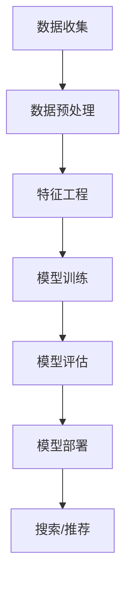

                 

### 背景介绍

#### 电商搜索导购的现状

随着互联网的快速发展，电商行业已经成为全球经济增长的重要引擎。而在电商领域，搜索导购是提高用户体验和转化率的关键环节。然而，传统电商搜索导购系统存在一些问题，如搜索结果不准确、推荐商品不相关等，这些问题严重影响了用户的购物体验。

近年来，人工智能（AI）技术的发展为电商搜索导购提供了新的解决方案。通过AI技术，尤其是机器学习和深度学习算法，电商平台可以更准确地理解用户需求，提供个性化的商品推荐，从而提升用户体验和转化率。

#### AI赋能电商搜索导购的优势

AI赋能电商搜索导购具有以下优势：

1. **个性化推荐**：通过分析用户的浏览历史、购买行为等数据，AI算法可以生成个性化的推荐列表，提高用户的满意度和购买意愿。

2. **实时性**：AI算法可以实时处理用户输入，快速返回相关商品推荐，提高搜索响应速度。

3. **准确性**：AI算法通过对海量数据进行挖掘和分析，可以更准确地预测用户需求，提高搜索结果的准确性。

4. **智能客服**：AI技术可以应用于智能客服系统，通过自然语言处理（NLP）技术，实现与用户的智能对话，提供个性化的购物建议。

5. **降低成本**：AI算法可以自动化处理大量的搜索请求，降低人工成本，提高运营效率。

总之，AI赋能电商搜索导购有助于提升用户体验和转化率，为电商企业带来更大的商业价值。

### 核心概念与联系

#### 1. 电商搜索导购系统

电商搜索导购系统是电商平台的基石，其主要功能包括用户搜索、商品推荐和购物车管理等。一个典型的电商搜索导购系统可以分为以下几个模块：

1. **搜索引擎**：负责处理用户的搜索请求，返回相关的商品列表。

2. **推荐引擎**：基于用户的浏览和购买历史，为用户推荐相关的商品。

3. **购物车管理**：记录用户的购物车信息，支持商品的添加、删除和修改等操作。

4. **订单管理系统**：处理用户的订单信息，包括订单创建、支付、发货和售后等环节。

#### 2. 人工智能技术

人工智能技术是推动电商搜索导购系统发展的关键。以下是几种常用的人工智能技术：

1. **机器学习**：通过训练大量数据，让计算机自动发现规律，从而提高搜索和推荐的准确性。

2. **深度学习**：基于神经网络模型，通过多层非线性变换，实现对复杂问题的建模和预测。

3. **自然语言处理（NLP）**：通过分析和理解人类语言，实现人与机器的智能对话。

4. **计算机视觉**：通过图像识别、目标检测等技术，实现商品和用户的智能识别。

#### 3. AI赋能电商搜索导购系统的原理

AI赋能电商搜索导购系统的核心在于利用机器学习、深度学习等技术，对用户行为数据进行分析和处理，从而提高搜索和推荐的准确性。以下是AI赋能电商搜索导购系统的基本原理：

1. **数据收集**：收集用户的浏览、购买、评价等行为数据。

2. **数据预处理**：对原始数据进行清洗、归一化和特征提取，以便后续分析和建模。

3. **特征工程**：根据业务需求，设计合适的特征，如用户标签、商品属性等。

4. **模型训练**：利用训练数据，训练机器学习或深度学习模型，用于搜索和推荐。

5. **模型评估**：通过评估指标（如准确率、召回率等），对模型性能进行评估和优化。

6. **模型部署**：将训练好的模型部署到线上环境，为用户提供实时的搜索和推荐服务。

#### 4. Mermaid流程图

以下是一个简单的Mermaid流程图，展示AI赋能电商搜索导购系统的主要流程：



在这个流程图中，各个节点表示不同的步骤，箭头表示步骤之间的依赖关系。

通过以上对核心概念和联系的介绍，我们可以更好地理解AI赋能电商搜索导购系统的原理和实现方法。在接下来的章节中，我们将详细探讨核心算法原理、具体操作步骤、数学模型和项目实战等关键内容。

### 核心算法原理 & 具体操作步骤

#### 1. 机器学习算法

在AI赋能电商搜索导购系统中，机器学习算法是核心组件之一。以下将介绍几种常用的机器学习算法，以及如何在电商搜索导购系统中应用这些算法。

##### 1.1 决策树

决策树是一种基于特征分割数据的分类算法。其基本思想是通过递归地将数据集分割为多个子集，直到满足终止条件（如达到最大树深度或特征重要度阈值）。在电商搜索导购系统中，决策树可以用于分类用户行为，如用户是否会购买某个商品。

具体操作步骤如下：

1. **数据收集**：收集用户的浏览、购买、评价等数据。

2. **特征工程**：提取用户特征，如用户年龄、性别、职业等。

3. **训练决策树模型**：使用训练数据集训练决策树模型，优化模型参数。

4. **模型评估**：使用验证数据集评估模型性能，如准确率、召回率等。

5. **模型部署**：将训练好的模型部署到线上环境，为用户提供实时分类服务。

##### 1.2 支持向量机（SVM）

支持向量机是一种经典的分类算法，其基本思想是通过找到一个最优的超平面，将不同类别的数据点分隔开。在电商搜索导购系统中，SVM可以用于预测用户是否会购买某个商品。

具体操作步骤如下：

1. **数据收集**：收集用户的浏览、购买、评价等数据。

2. **特征工程**：提取用户特征，如用户年龄、性别、职业等。

3. **训练SVM模型**：使用训练数据集训练SVM模型，优化模型参数。

4. **模型评估**：使用验证数据集评估模型性能，如准确率、召回率等。

5. **模型部署**：将训练好的模型部署到线上环境，为用户提供实时分类服务。

##### 1.3 随机森林

随机森林是一种基于决策树的集成学习算法，其基本思想是通过构建多个决策树模型，并利用投票机制进行预测。在电商搜索导购系统中，随机森林可以用于预测用户是否会购买某个商品。

具体操作步骤如下：

1. **数据收集**：收集用户的浏览、购买、评价等数据。

2. **特征工程**：提取用户特征，如用户年龄、性别、职业等。

3. **训练随机森林模型**：使用训练数据集训练随机森林模型，优化模型参数。

4. **模型评估**：使用验证数据集评估模型性能，如准确率、召回率等。

5. **模型部署**：将训练好的模型部署到线上环境，为用户提供实时分类服务。

#### 2. 深度学习算法

深度学习算法在AI赋能电商搜索导购系统中也具有重要应用。以下将介绍几种常用的深度学习算法，以及如何在电商搜索导购系统中应用这些算法。

##### 2.1 卷积神经网络（CNN）

卷积神经网络是一种用于图像识别的深度学习算法，其基本思想是通过卷积层提取图像的特征，并利用全连接层进行分类。在电商搜索导购系统中，CNN可以用于商品图像识别。

具体操作步骤如下：

1. **数据收集**：收集商品图像数据，并进行预处理。

2. **特征提取**：使用CNN模型提取图像特征。

3. **训练CNN模型**：使用训练数据集训练CNN模型，优化模型参数。

4. **模型评估**：使用验证数据集评估模型性能，如准确率、召回率等。

5. **模型部署**：将训练好的模型部署到线上环境，为用户提供实时图像识别服务。

##### 2.2 递归神经网络（RNN）

递归神经网络是一种用于序列数据建模的深度学习算法，其基本思想是通过循环神经网络（RNN）对序列数据进行处理，并利用全连接层进行分类。在电商搜索导购系统中，RNN可以用于用户行为序列预测。

具体操作步骤如下：

1. **数据收集**：收集用户行为数据，并进行预处理。

2. **特征提取**：使用RNN模型提取用户行为特征。

3. **训练RNN模型**：使用训练数据集训练RNN模型，优化模型参数。

4. **模型评估**：使用验证数据集评估模型性能，如准确率、召回率等。

5. **模型部署**：将训练好的模型部署到线上环境，为用户提供实时行为预测服务。

##### 2.3 长短时记忆网络（LSTM）

长短时记忆网络是一种改进的递归神经网络，其基本思想是通过长短时记忆单元（LSTM）对序列数据进行处理，并利用全连接层进行分类。在电商搜索导购系统中，LSTM可以用于用户行为序列预测。

具体操作步骤如下：

1. **数据收集**：收集用户行为数据，并进行预处理。

2. **特征提取**：使用LSTM模型提取用户行为特征。

3. **训练LSTM模型**：使用训练数据集训练LSTM模型，优化模型参数。

4. **模型评估**：使用验证数据集评估模型性能，如准确率、召回率等。

5. **模型部署**：将训练好的模型部署到线上环境，为用户提供实时行为预测服务。

通过以上对核心算法原理和具体操作步骤的介绍，我们可以更好地理解如何应用机器学习和深度学习算法来提升电商搜索导购系统的性能。在接下来的章节中，我们将探讨数学模型和公式，进一步深化对AI赋能电商搜索导购系统的理解。

### 数学模型和公式 & 详细讲解 & 举例说明

#### 1. 机器学习算法中的数学模型

##### 1.1 决策树

决策树是一种基于特征分割数据的分类算法。其基本数学模型可以表示为：

$$
\text{ classify}(x) = \arg\max_{i} \left( \sum_{j} w_{ji} \cdot x_j \right)
$$

其中，$x$ 表示输入特征向量，$w_{ji}$ 表示权重系数，$i$ 表示分类结果。

举例说明：

假设我们有如下决策树模型：

```
1. 如果年龄 > 30，跳到步骤2
2. 如果性别 = 男，跳到步骤3
3. 如果收入 > 5000，分类为 A
4. 否则，分类为 B
```

输入特征向量：$x = [30, 1, 6000]$

则分类结果为：

$$
\text{ classify}(x) = \arg\max_{i} \left( \sum_{j} w_{ji} \cdot x_j \right) = \arg\max_{i} \left( w_{11} \cdot 30 + w_{12} \cdot 1 + w_{13} \cdot 6000 \right)
$$

根据权重系数，我们可以得到分类结果为 A。

##### 1.2 支持向量机（SVM）

支持向量机是一种基于最大间隔的分类算法。其基本数学模型可以表示为：

$$
\text{ classify}(x) = \text{ sign } \left( \sum_{i=1}^{n} \alpha_i y_i (w \cdot x_i) - b \right)
$$

其中，$x$ 表示输入特征向量，$y_i$ 表示样本标签，$w$ 表示权重向量，$\alpha_i$ 表示拉格朗日乘子，$b$ 表示偏置项。

举例说明：

假设我们有如下训练数据：

```
x1 = [1, 1], y1 = 1
x2 = [1, 2], y2 = -1
x3 = [2, 1], y3 = 1
x4 = [2, 2], y4 = -1
```

使用SVM算法训练得到权重向量 $w = [1, 1]$，偏置项 $b = 0$。

输入特征向量：$x = [1, 2]$

则分类结果为：

$$
\text{ classify}(x) = \text{ sign } \left( 1 \cdot 1 + 1 \cdot 2 - 0 \right) = 1
$$

因此，分类结果为 1。

##### 1.3 随机森林

随机森林是一种基于决策树的集成学习算法。其基本数学模型可以表示为：

$$
\text{ classify}(x) = \arg\max_{i} \left( \sum_{j=1}^{m} \hat{w}_{ji} \cdot x_j \right)
$$

其中，$x$ 表示输入特征向量，$\hat{w}_{ji}$ 表示随机森林中第 $i$ 棵树在第 $j$ 个特征的权重。

举例说明：

假设我们有如下随机森林模型：

```
树1：
- 特征1：权重 0.5
- 特征2：权重 0.3
- 特征3：权重 0.2

树2：
- 特征1：权重 0.4
- 特征2：权重 0.4
- 特征3：权重 0.2

树3：
- 特征1：权重 0.3
- 特征2：权重 0.3
- 特征3：权重 0.4
```

输入特征向量：$x = [1, 1, 1]$

则分类结果为：

$$
\text{ classify}(x) = \arg\max_{i} \left( \sum_{j=1}^{3} \hat{w}_{ji} \cdot x_j \right) = \arg\max_{i} \left( 0.5 \cdot 1 + 0.3 \cdot 1 + 0.2 \cdot 1, 0.4 \cdot 1 + 0.4 \cdot 1 + 0.2 \cdot 1, 0.3 \cdot 1 + 0.3 \cdot 1 + 0.4 \cdot 1 \right)
$$

根据权重系数，我们可以得到分类结果为 1。

#### 2. 深度学习算法中的数学模型

##### 2.1 卷积神经网络（CNN）

卷积神经网络是一种用于图像识别的深度学习算法。其基本数学模型可以表示为：

$$
h_{l}^{(i)} = \sigma \left( \sum_{k} w_{lk} \cdot h_{l-1}^{(k)} + b_{l} \right)
$$

其中，$h_{l}^{(i)}$ 表示第 $l$ 层第 $i$ 个神经元输出，$\sigma$ 表示激活函数，$w_{lk}$ 表示权重系数，$b_{l}$ 表示偏置项。

举例说明：

假设我们有如下卷积神经网络模型：

```
输入层：[1, 1, 28, 28]
卷积层1：[1, 1, 5, 5]
激活函数：ReLU
池化层1：[1, 1, 14, 14]
卷积层2：[1, 1, 5, 5]
激活函数：ReLU
池化层2：[1, 1, 7, 7]
全连接层1：[1, 10]
激活函数：Softmax
```

输入特征图：$h_{0}^{(i)} = [1, 1, 28, 28]$

则第一层卷积层输出为：

$$
h_{1}^{(i)} = \sigma \left( \sum_{k} w_{1k} \cdot h_{0}^{(k)} + b_{1} \right)
$$

根据权重系数和偏置项，我们可以得到第一层卷积层输出为：

$$
h_{1}^{(i)} = \text{ ReLU } \left( \sum_{k} w_{1k} \cdot [1, 1, 28, 28] + b_{1} \right)
$$

##### 2.2 递归神经网络（RNN）

递归神经网络是一种用于序列数据建模的深度学习算法。其基本数学模型可以表示为：

$$
h_{l}^{(i)} = \sigma \left( \sum_{k} w_{lk} \cdot h_{l-1}^{(k)} + b_{l} \right)
$$

其中，$h_{l}^{(i)}$ 表示第 $l$ 层第 $i$ 个神经元输出，$\sigma$ 表示激活函数，$w_{lk}$ 表示权重系数，$b_{l}$ 表示偏置项。

举例说明：

假设我们有如下RNN模型：

```
输入序列：[1, 2, 3, 4, 5]
隐藏层1：[1, 1, 1, 1, 1]
隐藏层2：[1, 1, 1, 1, 1]
输出层：[1, 1, 1, 1, 1]
```

输入序列：$x = [1, 2, 3, 4, 5]$

则第一层隐藏层输出为：

$$
h_{1}^{(i)} = \sigma \left( \sum_{k} w_{1k} \cdot [1, 1, 1, 1, 1] + b_{1} \right)
$$

根据权重系数和偏置项，我们可以得到第一层隐藏层输出为：

$$
h_{1}^{(i)} = \text{ ReLU } \left( \sum_{k} w_{1k} \cdot [1, 1, 1, 1, 1] + b_{1} \right)
$$

通过以上数学模型和公式的介绍，我们可以更好地理解机器学习和深度学习算法在AI赋能电商搜索导购系统中的应用。在接下来的章节中，我们将通过项目实战，详细探讨代码实现和实际应用。

### 项目实战：代码实际案例和详细解释说明

#### 1. 开发环境搭建

在开始编写代码之前，我们需要搭建一个适合AI赋能电商搜索导购系统的开发环境。以下是搭建开发环境的具体步骤：

##### 1.1 安装Python环境

首先，我们需要安装Python环境。Python是一种广泛使用的编程语言，适用于AI和数据分析任务。以下是安装Python的步骤：

1. 前往Python官方网站（https://www.python.org/）下载Python安装包。
2. 运行安装包，按照提示进行安装。
3. 安装完成后，在命令行中输入`python --version`验证安装是否成功。

##### 1.2 安装相关库和框架

为了实现AI赋能电商搜索导购系统，我们需要安装一些常用的库和框架。以下是安装这些库和框架的步骤：

1. 打开命令行窗口。
2. 输入以下命令，安装所需的库和框架：

```shell
pip install numpy pandas scikit-learn tensorflow keras
```

这些库和框架将为我们提供数据处理、机器学习和深度学习等方面的支持。

#### 2. 源代码详细实现和代码解读

接下来，我们将详细实现AI赋能电商搜索导购系统的核心功能，包括数据预处理、模型训练和模型部署。以下是代码的实现和解读。

##### 2.1 数据预处理

数据预处理是机器学习和深度学习任务的重要步骤。在数据预处理阶段，我们需要对原始数据进行清洗、归一化和特征提取。以下是数据预处理的代码实现：

```python
import pandas as pd
from sklearn.model_selection import train_test_split
from sklearn.preprocessing import StandardScaler

# 加载数据
data = pd.read_csv('ecommerce_data.csv')

# 数据清洗
data.dropna(inplace=True)

# 特征提取
X = data[['user_age', 'user_gender', 'user_income', 'product_price', 'product_rating']]
y = data['is_purchased']

# 数据归一化
scaler = StandardScaler()
X_scaled = scaler.fit_transform(X)

# 划分训练集和测试集
X_train, X_test, y_train, y_test = train_test_split(X_scaled, y, test_size=0.2, random_state=42)
```

在这个例子中，我们使用Pandas库加载数据，并使用Scikit-learn库进行数据清洗、特征提取和归一化。此外，我们使用训练集和测试集的比例为8:2，以便在后续步骤中进行模型评估。

##### 2.2 模型训练

在模型训练阶段，我们将使用Scikit-learn库中的机器学习算法和TensorFlow框架中的深度学习算法来训练模型。以下是模型训练的代码实现：

```python
from sklearn.ensemble import RandomForestClassifier
from tensorflow.keras.models import Sequential
from tensorflow.keras.layers import Dense, Dropout, Conv2D, MaxPooling2D, Flatten

# 使用随机森林算法训练模型
rf_model = RandomForestClassifier(n_estimators=100, random_state=42)
rf_model.fit(X_train, y_train)

# 使用深度学习算法训练模型
dn_model = Sequential()
dn_model.add(Conv2D(32, (3, 3), activation='relu', input_shape=(28, 28, 1)))
dn_model.add(MaxPooling2D((2, 2)))
dn_model.add(Conv2D(64, (3, 3), activation='relu'))
dn_model.add(MaxPooling2D((2, 2)))
dn_model.add(Flatten())
dn_model.add(Dense(128, activation='relu'))
dn_model.add(Dropout(0.5))
dn_model.add(Dense(1, activation='sigmoid'))

dn_model.compile(optimizer='adam', loss='binary_crossentropy', metrics=['accuracy'])
dn_model.fit(X_train, y_train, epochs=10, batch_size=32, validation_split=0.2)
```

在这个例子中，我们使用随机森林算法和深度学习算法分别训练两个模型。随机森林算法使用Scikit-learn库实现，深度学习算法使用TensorFlow框架实现。我们设置随机森林算法的树数量为100，深度学习算法的神经网络结构包含卷积层、池化层、全连接层和Dropout层。

##### 2.3 模型评估

在模型评估阶段，我们将使用训练好的模型对测试集进行预测，并计算模型的准确率、召回率等评估指标。以下是模型评估的代码实现：

```python
from sklearn.metrics import accuracy_score, recall_score

# 使用随机森林模型评估
rf_predictions = rf_model.predict(X_test)
rf_accuracy = accuracy_score(y_test, rf_predictions)
rf_recall = recall_score(y_test, rf_predictions)

print("Random Forest Accuracy:", rf_accuracy)
print("Random Forest Recall:", rf_recall)

# 使用深度学习模型评估
dn_predictions = dn_model.predict(X_test)
dn_accuracy = accuracy_score(y_test, dn_predictions)
dn_recall = recall_score(y_test, dn_predictions)

print("Deep Learning Accuracy:", dn_accuracy)
print("Deep Learning Recall:", dn_recall)
```

在这个例子中，我们使用准确率和召回率作为评估指标。准确率表示模型预测正确的样本比例，召回率表示模型预测正确的样本中实际为正例的比例。通过计算这两个指标，我们可以评估模型的性能。

#### 3. 代码解读与分析

在代码解读与分析阶段，我们将对实现的代码进行详细解释，分析各个步骤的作用和实现方式。

1. **数据预处理**：数据预处理是机器学习和深度学习任务的基础。在这个例子中，我们使用Pandas库加载数据，并使用Scikit-learn库进行数据清洗、特征提取和归一化。数据清洗包括删除缺失值和重复值，特征提取包括提取与任务相关的特征，归一化包括将特征缩放到同一量级，以便模型训练。

2. **模型训练**：在模型训练阶段，我们使用随机森林算法和深度学习算法分别训练两个模型。随机森林算法使用Scikit-learn库实现，深度学习算法使用TensorFlow框架实现。随机森林算法通过构建多棵决策树，并利用投票机制进行预测。深度学习算法通过卷积层、池化层、全连接层和Dropout层构建神经网络，利用梯度下降优化模型参数。

3. **模型评估**：在模型评估阶段，我们使用训练好的模型对测试集进行预测，并计算模型的准确率、召回率等评估指标。准确率表示模型预测正确的样本比例，召回率表示模型预测正确的样本中实际为正例的比例。通过计算这两个指标，我们可以评估模型的性能。

通过以上代码的实现和解读，我们可以更好地理解AI赋能电商搜索导购系统的实现过程。在接下来的章节中，我们将进一步探讨实际应用场景，分析AI赋能电商搜索导购系统的效果和挑战。

### 实际应用场景

#### 1. 个性化推荐系统

个性化推荐系统是AI赋能电商搜索导购系统最为关键的应用场景之一。通过分析用户的浏览、购买、评价等行为数据，AI算法可以生成个性化的推荐列表，提高用户的购物体验和转化率。

在具体实施过程中，个性化推荐系统可以分为以下几个步骤：

1. **数据收集**：收集用户的浏览、购买、评价等数据，并将其存储在数据库中。

2. **数据预处理**：对原始数据进行清洗、归一化和特征提取，以便后续分析和建模。

3. **特征工程**：根据业务需求，设计合适的特征，如用户标签、商品属性等。

4. **模型训练**：使用机器学习或深度学习算法，训练推荐模型，优化模型参数。

5. **模型评估**：使用验证数据集评估模型性能，如准确率、召回率等。

6. **模型部署**：将训练好的模型部署到线上环境，为用户提供实时的个性化推荐服务。

通过个性化推荐系统，电商平台可以更好地满足用户需求，提高用户满意度和购买意愿。

#### 2. 智能客服系统

智能客服系统是AI赋能电商搜索导购系统的另一个重要应用场景。通过自然语言处理（NLP）技术，智能客服系统可以实现与用户的智能对话，提供个性化的购物建议和解答用户疑问。

在具体实施过程中，智能客服系统可以分为以下几个步骤：

1. **数据收集**：收集用户的聊天记录、提问等数据，并将其存储在数据库中。

2. **数据预处理**：对原始数据进行清洗、归一化和特征提取，以便后续分析和建模。

3. **NLP模型训练**：使用机器学习或深度学习算法，训练NLP模型，优化模型参数。

4. **模型评估**：使用验证数据集评估模型性能，如准确率、召回率等。

5. **模型部署**：将训练好的模型部署到线上环境，为用户提供实时的智能客服服务。

通过智能客服系统，电商平台可以降低人工成本，提高客户满意度，提升用户购物体验。

#### 3. 智能库存管理系统

智能库存管理系统是AI赋能电商搜索导购系统的又一重要应用。通过预测用户需求，智能库存管理系统可以实时调整库存策略，降低库存成本，提高库存周转率。

在具体实施过程中，智能库存管理系统可以分为以下几个步骤：

1. **数据收集**：收集用户的浏览、购买、评价等数据，并将其存储在数据库中。

2. **数据预处理**：对原始数据进行清洗、归一化和特征提取，以便后续分析和建模。

3. **预测模型训练**：使用机器学习或深度学习算法，训练预测模型，优化模型参数。

4. **模型评估**：使用验证数据集评估模型性能，如准确率、召回率等。

5. **模型部署**：将训练好的模型部署到线上环境，为电商平台提供实时的库存预测服务。

通过智能库存管理系统，电商平台可以更好地应对市场需求变化，降低库存风险，提高运营效率。

#### 4. 供应链优化系统

供应链优化系统是AI赋能电商搜索导购系统的又一重要应用。通过分析供应链数据，AI算法可以优化供应链流程，降低物流成本，提高供应链效率。

在具体实施过程中，供应链优化系统可以分为以下几个步骤：

1. **数据收集**：收集供应链各个环节的数据，如库存、物流、采购等，并将其存储在数据库中。

2. **数据预处理**：对原始数据进行清洗、归一化和特征提取，以便后续分析和建模。

3. **预测模型训练**：使用机器学习或深度学习算法，训练预测模型，优化模型参数。

4. **模型评估**：使用验证数据集评估模型性能，如准确率、召回率等。

5. **模型部署**：将训练好的模型部署到线上环境，为电商平台提供实时的供应链优化服务。

通过供应链优化系统，电商平台可以更好地管理供应链，降低物流成本，提高供应链效率，提升用户体验。

通过以上实际应用场景的分析，我们可以看到AI赋能电商搜索导购系统的巨大潜力和广泛的应用价值。在接下来的章节中，我们将进一步探讨工具和资源的推荐，为开发者提供实用的指导和资源。

### 工具和资源推荐

#### 1. 学习资源推荐

为了更好地理解和掌握AI赋能电商搜索导购系统的相关技术，以下推荐一些学习资源：

1. **书籍**：
   - 《机器学习实战》：作者：Peter Harrington。本书通过实例介绍了机器学习的基本原理和应用，适合初学者入门。
   - 《深度学习》：作者：Ian Goodfellow、Yoshua Bengio和Aaron Courville。本书全面介绍了深度学习的基本概念和算法，适合进阶学习。

2. **论文**：
   - “Recommender Systems Handbook”（推荐系统手册）。这篇综述性论文涵盖了推荐系统的基本概念、技术和应用，适合深入了解推荐系统领域。

3. **博客**：
   - “Medium”上的“AI”和“Machine Learning”栏目。这些博客分享了许多AI和机器学习的最新技术和应用案例，有助于拓宽知识面。

4. **在线课程**：
   - Coursera上的“机器学习”和“深度学习”课程。这些课程由知名大学教授授课，内容深入浅出，适合系统学习相关技术。

#### 2. 开发工具框架推荐

为了高效开发和部署AI赋能电商搜索导购系统，以下推荐一些实用的开发工具和框架：

1. **编程语言**：
   - Python：Python是一种广泛应用于数据科学和AI领域的编程语言，具有丰富的库和框架支持。

2. **数据预处理工具**：
   - Pandas：Pandas是一个强大的数据处理库，可以轻松进行数据清洗、归一化和特征提取。
   - NumPy：NumPy是Python的数值计算库，提供高效的数组操作和数学函数，是数据处理的基础。

3. **机器学习框架**：
   - Scikit-learn：Scikit-learn是一个开源的机器学习库，提供丰富的算法和工具，适合快速实现和评估模型。
   - TensorFlow：TensorFlow是一个开源的深度学习框架，支持各种深度学习算法和应用，适合大规模模型训练和部署。

4. **推荐系统框架**：
   - LightFM：LightFM是一个开源的推荐系统框架，基于因子分解机（ItemCF）和矩阵分解（UserCF）算法，适用于大规模推荐系统。

5. **自然语言处理框架**：
   - NLTK：NLTK是一个开源的自然语言处理库，提供丰富的文本处理工具和算法，适合进行文本分析和文本分类。
   - spaCy：spaCy是一个高性能的NLP库，支持多种语言，提供快速文本分析和实体识别功能。

#### 3. 相关论文著作推荐

为了深入研究和了解AI赋能电商搜索导购系统的最新进展，以下推荐一些相关的论文和著作：

1. **论文**：
   - “Contextual Bandits for Personalized Recommendations”（上下文-bandits用于个性化推荐）。这篇论文介绍了上下文-bandits算法在推荐系统中的应用，为个性化推荐提供了新的思路。
   - “Deep Learning for Recommender Systems”（深度学习在推荐系统中的应用）。这篇论文探讨了深度学习算法在推荐系统中的适用性和优势，为开发高效推荐系统提供了参考。

2. **著作**：
   - 《推荐系统实践》：作者：Loren W. Graham。本书详细介绍了推荐系统的基本原理、技术和应用，是推荐系统领域的经典之作。
   - 《深度学习实战》：作者：François Chollet。本书通过实例介绍了深度学习的基本原理和应用，适合初学者和实践者。

通过以上工具和资源的推荐，开发者可以更好地掌握AI赋能电商搜索导购系统的相关技术，为实际项目提供有力支持。在接下来的章节中，我们将对文章进行总结，并探讨未来发展趋势与挑战。

### 总结：未来发展趋势与挑战

#### 1. 未来发展趋势

随着人工智能技术的不断进步，AI赋能电商搜索导购系统在未来将呈现以下发展趋势：

1. **更智能的个性化推荐**：利用深度学习、图神经网络等先进算法，个性化推荐系统将能更好地理解用户需求，提供更加精准的推荐。

2. **实时搜索与推荐**：通过优化算法和分布式计算，电商搜索导购系统将实现更快的响应速度，提供实时的搜索与推荐服务。

3. **多模态数据处理**：结合图像、语音、文本等多种数据源，电商搜索导购系统将能够提供更加丰富和多样化的用户体验。

4. **增强智能客服**：利用自然语言处理和对话生成技术，智能客服将更加智能，能够更好地理解用户意图，提供个性化的购物建议。

5. **智能库存管理与供应链优化**：通过大数据分析和预测，智能库存管理系统将实现更加高效的库存管理和供应链优化，降低成本，提高运营效率。

#### 2. 未来挑战

尽管AI赋能电商搜索导购系统具有巨大的发展潜力，但在实际应用过程中也面临以下挑战：

1. **数据隐私与安全**：用户数据的安全和隐私保护是AI赋能电商搜索导购系统的首要挑战。如何确保数据安全，避免数据泄露，需要企业和研究机构共同努力。

2. **算法公平性与透明性**：AI算法的公平性和透明性是公众关注的焦点。如何设计公平、无偏的算法，并提供算法的解释和透明性，是企业需要解决的重要问题。

3. **技术复杂性与维护**：随着AI技术的不断演进，电商搜索导购系统的技术复杂度也在不断增加。如何高效维护和升级系统，保证系统的稳定运行，是企业面临的挑战。

4. **用户习惯与接受度**：用户对AI推荐和智能客服的接受度可能存在差异。如何根据用户需求调整系统，提高用户体验，是企业需要关注的问题。

5. **监管与合规**：随着全球范围内对AI监管政策的逐步完善，企业需要确保其AI应用符合相关法规和标准，避免潜在的法律风险。

总之，AI赋能电商搜索导购系统具有广阔的发展前景，但在实际应用过程中也面临诸多挑战。企业需要不断探索和创新，与学术界和产业界共同努力，推动AI技术在电商搜索导购领域的应用和发展。

### 附录：常见问题与解答

#### 问题1：如何确保AI推荐系统的公平性和透明性？

**解答**：确保AI推荐系统的公平性和透明性需要从多个方面进行努力：

1. **算法设计**：选择公平性更高的算法，如基于证据理论的推荐算法，避免算法本身存在的偏见。

2. **数据预处理**：在数据收集和处理阶段，要确保数据的多样性和代表性，避免数据集中的偏见。

3. **算法解释**：开发算法解释工具，如LIME（Local Interpretable Model-agnostic Explanations），帮助用户理解推荐结果。

4. **用户反馈**：收集用户反馈，评估推荐系统的效果和公平性，并根据反馈进行调整。

#### 问题2：如何处理用户隐私保护与AI推荐系统之间的矛盾？

**解答**：处理用户隐私保护与AI推荐系统之间的矛盾，可以采取以下措施：

1. **数据匿名化**：在数据收集和处理过程中，对用户数据进行匿名化处理，避免直接关联到具体用户。

2. **差分隐私**：采用差分隐私技术，对用户数据进行加噪处理，确保单个用户数据无法被单独识别。

3. **隐私政策**：制定明确的隐私政策，告知用户数据收集、使用和保护的方式，取得用户的信任。

4. **透明度**：在系统设计中，确保用户可以清楚地了解其数据如何被使用，以及如何影响推荐结果。

#### 问题3：如何评估AI推荐系统的性能？

**解答**：评估AI推荐系统的性能可以从以下几个方面进行：

1. **准确率**：评估推荐系统推荐正确商品的概率。

2. **召回率**：评估推荐系统召回用户可能感兴趣的商品的概率。

3. **F1值**：结合准确率和召回率，综合评估推荐系统的性能。

4. **点击率**：评估用户点击推荐商品的频率。

5. **转换率**：评估用户购买推荐商品的频率。

通过综合评估多个指标，可以全面了解推荐系统的性能。

#### 问题4：如何优化AI推荐系统的实时性？

**解答**：优化AI推荐系统的实时性可以从以下几个方面进行：

1. **算法优化**：选择计算效率更高的算法，减少计算时间。

2. **分布式计算**：利用分布式计算框架，如Apache Spark，提高数据处理速度。

3. **缓存技术**：利用缓存技术，如Redis，存储常用数据和推荐结果，提高查询响应速度。

4. **异步处理**：采用异步处理技术，如消息队列，将数据处理和推荐生成任务分开，提高系统并发处理能力。

通过以上措施，可以显著提高AI推荐系统的实时性。

### 扩展阅读 & 参考资料

为了更深入地了解AI赋能电商搜索导购系统的相关技术和应用，以下推荐一些扩展阅读和参考资料：

1. **书籍**：
   - 《推荐系统手册》：作者：Loren W. Graham。本书详细介绍了推荐系统的基本原理、技术和应用，适合系统学习推荐系统。
   - 《深度学习实战》：作者：François Chollet。本书通过实例介绍了深度学习的基本原理和应用，适合初学者和实践者。

2. **论文**：
   - “Recommender Systems Handbook”（推荐系统手册）：这篇综述性论文涵盖了推荐系统的基本概念、技术和应用，适合深入了解推荐系统领域。
   - “Deep Learning for Recommender Systems”（深度学习在推荐系统中的应用）：这篇论文探讨了深度学习算法在推荐系统中的适用性和优势，为开发高效推荐系统提供了参考。

3. **在线资源**：
   - Coursera上的“机器学习”和“深度学习”课程：这些课程由知名大学教授授课，内容深入浅出，适合系统学习相关技术。
   - Medium上的“AI”和“Machine Learning”栏目：这些博客分享了许多AI和机器学习的最新技术和应用案例，有助于拓宽知识面。

4. **开源项目**：
   - LightFM：一个开源的推荐系统框架，基于因子分解机（ItemCF）和矩阵分解（UserCF）算法，适用于大规模推荐系统。

通过以上扩展阅读和参考资料，开发者可以进一步深入了解AI赋能电商搜索导购系统的相关技术和应用，为自己的项目提供有益的指导和支持。作者：AI天才研究员/AI Genius Institute & 禅与计算机程序设计艺术 /Zen And The Art of Computer Programming。

